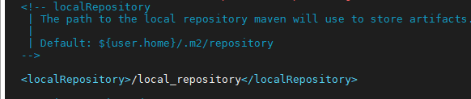

# Jenkins 配置

## 1 建立用户

### 1.1 配置管理员用户

### 1.2 配置普通用户

## 2 配置环境

### 2.1 JDK

**JDK 可以通过 Jenkins 配置页面自动下载安装配置，此处只说明手动下载配置方法。**

1）官网下载所需版本的 jdk 压缩包，并上传到指定目录下。

2）解压到 Jenkins docker 中的映射目录 `/usr/local/jenkins/jenkins_home` 下（docker run 命令启动 Jenkins 时的主机目录，不是 docker 内部的目录）。

````shell
tar zxvf jdk-8u221-linux-x64.tar.gz -C /usr/local/jenkins/jenkins_home
````

3）打开 Jenkins 页面，点击左侧 Manage Jenkins 菜单，进入 Global Tool Configuration。


4）找到 JDK 配置项，点击 Add JDK。


5）去掉 Install automatically 勾选，Name 任意填，如 `jdk1.8_221`，JAVA_HOME 填入目录 `/var/jenkins_home/jdk1.8.0_221`（docker run 命令启动 Jenkins 时的 docker 内部目录，不是主机上的目录），最后点击 Apply。


### 2.2 Maven

#### 2.2.1 安装 Maven Integration 插件

1）Jenkins 默认不装 Maven Integration 插件的，需要点击左侧 Manage Jenkins 菜单，进入 Manager Plugins。


2）在 Available 栏搜索 Maven Integration，点击下载安装。


3）等待下载


4）下载完成后重启 jenkins，可以在下载页面勾选底部下载完成且没有任务运行时自动重启 Jenkins（或浏览器地址栏输入 `http://192.168.10.204/restart` 手动重启）


#### 2.2.2 配置 Maven

**Maven 可以通过 Jenkins 配置页面自动下载安装配置，此处只说明手动下载配置方法。**

1）获取 Maven 压缩包

````shell
wget https://archive.apache.org/dist/maven/maven-3/3.5.4/binaries/apache-maven-3.5.4-bin.tar.gz
````

2）解压到 Jenkins docker 中的映射目录 `/usr/local/jenkins/jenkins_home` 下（docker run 命令启动 Jenkins 时的主机目录，不是 docker 内部的目录）。

````shell
tar zxvf apache-maven-3.5.4-bin.tar.gz -C /usr/local/jenkins/jenkins_home
````

3）自定义仓库位置，在根目录下（目录根据自己情况指定位置）建立 Maven 的仓库文件夹，并赋权限。 

````shell
mkdir /local_repository
chmod +x /local_repository
````

4）配置 `settings.xml` 文件，将建好的仓库地址配置进去。

````shell
vim /usr/local/jenkins/jenkins_home/apache-maven-3.5.4/conf/settings.xml
````

5）放开 `localRepository` 的注释。


6）添加自己的仓库地址 `<localRepository>/local_repository</localRepository>`。



7）打开 Jenkins 页面，点击左侧 Manage Jenkins 菜单，进入 Global Tool Configuration。


8）找到 Maven 配置项，点击 Add Maven。


9）去掉 Install automatically 勾选，Name 任意填，如 `maven3.5.4`，MAVEN_HOME 填入目录 `/var/jenkins_home/apache-maven-3.5.4`（docker run 命令启动 Jenkins 时的 docker 内部目录，不是主机上的目录），最后点击 Apply。


### 2.4 Git

#### 2.4.1 配置 Git

**Git 可以通过 Jenkins 配置页面自动下载安装配置，此处只说明手动下载配置方法。**

1）查看是否安装过 git

````shell
git --version
````

2）卸载老版本 git（如果有必要）

````shell
yum -y remove git
````

3）进入需要安装的目录

````shell
cd /usr/local
````

4）获取 git 源码压缩包

````shell
wget https://github.com/git/git/archive/v2.24.2.tar.gz
````

5）解压 git 源码包

````shell
tar -zxvf v2.24.2.tar.gz
````

6）安装编译所需环境及组件

````shell
yum -y install curl-devel expat-devel gettext-devel openssl-devel zlib-devel gcc perl-ExtUtils-MakeMaker
````

7）卸载上个步骤中自动安装的旧版本 git

````shell
yum -y remove git
````

8）进入 git 文件夹，编译 git 源码

````shell
cd /git-2.24.2
make
````

9）安装 git

````shell
make install
````

10）查看 git 版本号（显示版本号则表示安装成功）

````shell
./git --version
````

11）将 git 目录复制到 Jenkins docker 中的映射目录 `/usr/local/jenkins/jenkins_home` 下（docker run 命令启动 Jenkins 时的主机目录，不是 docker 内部的目录）。

````shell
cp -r git-2.24.2/ /usr/local/jenkins/jenkins_home
````

12）打开 Jenkins 页面，点击左侧 Manage Jenkins 菜单，进入 Global Tool Configuration。


13）找到 Git 配置项，点击 Add Git。


14）去掉 Install automatically 勾选，Name 任意填，如 `git2.24.2`，Path to Git executable 填入 git 可执行文件路径 `/var/jenkins_home/git-2.24.2/bin-wrappers/git`（docker run 命令启动 Jenkins 时的 docker 内部路径，不是主机上的路径），最后点击 Apply。


### 2.5 配置 harbor 仓库


### 2.6 配置 Kubernetes


