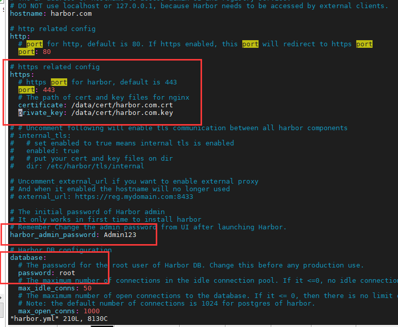
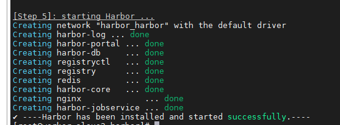
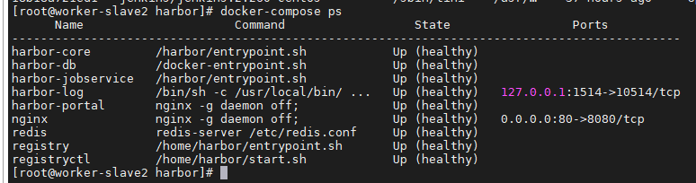
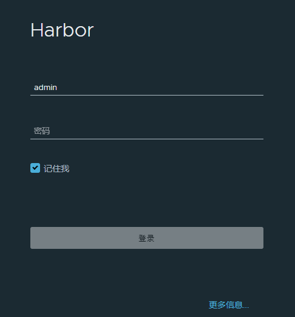

# 自动化环境搭建

## 1 Git

### 1.1 安装 Git

1）查看是否安装过 git

````shell
git --version
````

2）卸载老版本 git（如果有必要）

````shell
yum -y remove git
````

3）进入需要安装的目录

````shell
cd /usr/local
````

4）获取 git 源码压缩包

````shell
wget https://github.com/git/git/archive/v2.24.2.tar.gz
````

5）解压 git 源码包

````shell
tar -zxvf v2.24.2.tar.gz
````

6）安装编译所需环境及组件

````shell
yum -y install curl-devel expat-devel gettext-devel openssl-devel zlib-devel gcc perl-ExtUtils-MakeMaker
````

7）卸载上个步骤中自动安装的旧版本 git

````shell
yum -y remove git
````

8）进入 git 文件夹，编译 git 源码

````shell
cd /git-2.24.2
make
````

9）安装 git

````shell
make install
````

10）查看 git 版本号（显示版本号则表示安装成功）

````shell
./git --version
````

11）配置 git 环境变量

````shell
vim /etc/profile

# 最后一行加上此代码，保存并退出
export PATH=$PATH:/usr/local/git-2.24.2/bin-wrappers
````

12）使配置生效

````shell
source /etc/profile
````

13）再次查看版本号，确认是否安装完成

````shell
git --version
````

## 2 Docker

### 2.1 安装 Docker

Docker 要求 CentOS 系统的内核版本高于 3.10 。

1）查看操作系统当前的内核版本

````shell
uname -r
````

2）更新 yum 包到最新

````shell
yum -y update
````

3）卸载旧版本（如果存在旧版本，不存在则跳过）

````shell
yum remove -y docker docker-common docker-selinux docker-engine
````

4）安装docker需要的软件，yum-util 提供 yum-config-manager 功能，其他两个是 devicemapper 驱动依赖的包

````shell
yum install -y yum-utils device-mapper-persistent-data lvm2
````

5）配置 yum 源

````shell
yum-config-manager --add-repo http://mirrors.aliyun.com/docker-ce/linux/centos/docker-ce.repo
````

6）查看所有仓库中所有 docker 版本，并选择特定版本进行安装

````shell
yum list docker-ce --showduplicates | sort -r
````

7）安装 docker

````shell
# 不指定版本则默认装最新稳定版
yum -y install docker-ce-19.03.8
````

8）启动 docker 服务

````shell
systemctl start docker
````

9）开机启动 docker 服务

````shell
systemctl enable docker
````

10）查看 docker 版本（有 client 和 server 表示 docker 安装成功）

````shell
docker version
````

11）关闭防火墙及其开机自启

````shell
systemctl disable firewalld
service firewalld stop
````

12）关闭 selinux

````shell
setenforce 0
sed -i -e "s|^[^#]SELINUX=.*|SELINUX=disabled|" /etc/selinux/config
````

## 3 Jenkins

### 3.1 Docker 安装 Jenkins

1）docker 中搜索 Jenkins 软件列表

````shell
docker search jenkins
````

2）安装指定版本

````shell
docker pull jenkins/jenkins:2.260-centos
````

3）创建数据映射文件夹，并赋权限

````shell
mkdir -p /usr/local/jenkins/jenkins_home
chown -R 1000:1000 /usr/local/jenkins/jenkins_home
````

4）运行 jenkins（端口映射为 8888，根据需要调整）

````sh
docker run --restart=always --name jenkins -p 8888:8080 -p 50000:50000 -v /usr/local/jenkins/jenkins_home:/var/jenkins_home -d jenkins/jenkins:2.260-centos
````

5）查看 jenkins 启动日志，确认是否启动成功（同时查看 jenkins 管理员密码，或查看密码文件 `cat /usr/local/jenkins/jenkins_home/secrets/initialAdminPassword`）

````shell
docker logs -ft --tail 400 jenkins
````

6）访问 jenkins 主页面（[服务器 ip]:[自定义端口]）

````shell
http://192.168.10.204:8888/
````

## 4 Harbor 

### 4.1 安装 Docker Compose

1）下载 Docker Compose 文件。

````shell
curl -L https://github.com/docker/compose/releases/download/1.24.0/docker-compose-`uname -s`-`uname -m` -o /usr/local/bin/docker-compose
chmod +x /usr/local/bin/docker-compose
````

2）验证 Docker Compose 版本。

````shell
docker-compose version
````

### 4.2 生成 SSL 证书

**Harbor 仓库 linux 下登录默认采用 https 方式，所以需要配置 https 的 SSL 证书。**

**1. 生成认证授权证书**

1）进入指定文件夹（任意目录均可）。

````shell
mkdir -p /usr/local/certificate
cd /usr/local/certificate
````

2）此处采用 https，首先生成一个 CA 证书私钥。

````shell
openssl genrsa -out ca.key 4096
````

3）生成一个 CA 证书（CN 改为自己定义的 Harbor 仓库域名）。

````shell
openssl req -x509 -new -nodes -sha512 -days 3650 \
 -subj "/C=CN/ST=Shenzhen/L=Shenzhen/O=harbor/OU=Personal/CN=harbor.com" \
 -key ca.key \
 -out ca.crt
````

- subj：表示组织机构
- CN：通用名称

**2. 生成服务端证书**

1）生成私钥。

````shell
openssl genrsa -out harbor.com.key 4096
````

2）生成证书签名请求（CSR）。

````shell
openssl req -sha512 -new \
    -subj "/C=CN/ST=Shenzhen/L=Shenzhen/O=harbor/OU=Personal/CN=harbor.com" \
    -key harbor.com.key \
    -out harbor.com.csr
````

3）生成 x509 v3 扩展文件。

````shell
cat > v3.ext <<-EOF
authorityKeyIdentifier=keyid,issuer
basicConstraints=CA:FALSE
keyUsage = digitalSignature, nonRepudiation, keyEncipherment, dataEncipherment
extendedKeyUsage = serverAuth
subjectAltName = @alt_names

[alt_names]
DNS.1=harbor.com
DNS.2=harbor
DNS.3=hostname
EOF
````

4）使用 v3.ext 文件生成 Harbor 仓库域名。

````shell
openssl x509 -req -sha512 -days 36500 \
    -extfile v3.ext \
    -CA ca.crt -CAkey ca.key -CAcreateserial \
    -in harbor.com.csr \
    -out harbor.com.crt
````

**3. 生成提供给 Harbor 仓库和 Docker 的证书**

1）将证书文件拷贝到主机的证书存放文件夹下。

````shell
mkdir -p /data/cert/
cp harbor.com.crt /data/cert/
cp harbor.com.key /data/cert/
````

2）将 harbor.com.crt 证书文件转换为 Docker 使用的 harbor.com.cert 文件 。

````shell
openssl x509 -inform PEM -in harbor.com.crt -out harbor.com.cert
````

3）将服务器证书、私钥和 CA 文件拷贝到 Harbor 和 Docker 的证书文件夹中。

````shell
mkdir -p /etc/docker/certs.d/harbor.com/
cp harbor.com.cert /etc/docker/certs.d/harbor.com/
cp harbor.com.key /etc/docker/certs.d/harbor.com/
cp ca.crt /etc/docker/certs.d/harbor.com/
````

### 4.3 Docker Compose 安装 Harbor

1）进入 `/usr/local` 目录下（目录根据自己情况选择），下载 Harbor 离线包（也可以用相关下载软件下载后上传到服务器）。

````shell
cd /usr/local
wget https://github.com/goharbor/harbor/releases/download/v2.1.2/harbor-offline-installer-v2.1.2.tgz
````

2）解压 Harbor 离线包。

````shell
tar -zxvf harbor-offline-installer-v2.1.2.tgz
````

3）进入解压后的 Harbor 文件夹。

````shell
cd harbor
````

4）复制一份 Harbor 配置文件。

````shell
cp harbor.yml.tmpl harbor.yml
````

5）编辑 `harbor.yml`，将 hostname 改为自己定义的域名地址，如 `harbor.com` （与上述证书域名保持一直）

````shell
vim harbor.yml
````

6）根据需要自行修改其中的配置项，修改了自定义登录密码和 mysql 数据库密码【然后保存退出】。

````shell
hostname: harbor.com

# https related config
https:
  # https port for harbor, default is 443
  port: 443
  # The path of cert and key files for nginx
  certificate: /data/cert/harbor.com.crt
  private_key: /data/cert/harbor.com.key

````



7）执行启动脚本，最后出现 successfully 表示成功。

````shell
./install.sh
````



8）查看 docker compose 进程状态（healthy 表示进程正常）。

````shell
docker-compose ps
````



9）配置自己访问 Harbor 仓库的主机 hosts 文件（win10 路径 `C:\Windows\System32\drivers\etc`）。

````shell
192.168.10.204 harbor.com
````

10）输入服务器 ip 地址可直接进入 Harbor 仓库页面，管理员账号为 admin。

````shell
https://harbor.com
````



### 4.4 配置 Harbor 自动启动

**由于容器只有在 `docker-compose up` 时，才会按照 `depends_on` 定义的顺序启动。而 Docker 本身并不记录容器之间的依赖顺序，它们的重启是相互独立的。**

1）添加 harbor 服务配置文件

````shell
vim /usr/lib/systemd/system/harbor
````

2）写入配置文件内容（harbor 的 yml 配置文件根据自己实际路径配置），保存并退出。

````shell
[Unit]
Description=Harbor
After=docker.service systemd-networkd.service systemd-resolved.service
Requires=docker.service
Documentation=http://github.com/vmware/harbor

[Service]
Type=simple
Restart=on-failure
RestartSec=5
ExecStart=/usr/local/bin/docker-compose -f /usr/local/harbor/docker-compose.yml up
ExecStop=/usr/local/bin/docker-compose -f /usr/local/harbor/docker-compose.yml down

[Install]
WantedBy=multi-user.target
````

3）重启 systemctl 使配置生效

````shell
systemctl daemon-reload
````

4）给服务文件赋权限

````shell
chmod +x /usr/lib/systemd/harbor.service
````

5）配置开机启启动 harbor 服务

````shell
systemctl enable harbor
systemctl start harbor
````

## 5 Kubernetes

### 5.1 安装 Kubernetes