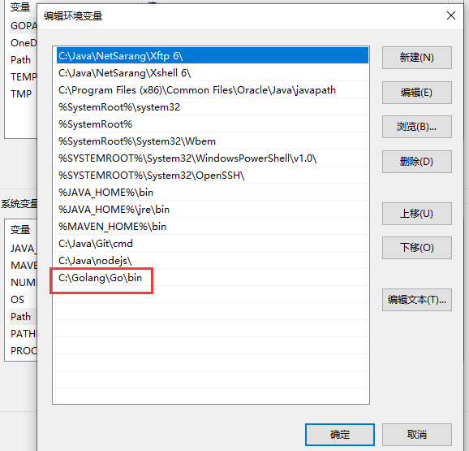

# Golang基础

## 1 Golang前置知识

### 1.1 Go的诞生背景

现代高级编程语言（Java、Python、Scala）大多都来自90年代的单线程环境。虽然其框架在不断地提高多核资源使用效率，如 Java 的 Netty、Scala 的 akka 等，但仍然需要开发人员花费大量的时间和精力搞懂这些框架的运行原理后才能熟练掌握。

### 1.2 Go语言特点

- 原生支持并发，且无需第三方库、开发者的编程技巧和开发经验
- Go的并发基于 `goroutine` 
- 纯编译型语言，性能更高
- 语法简洁易学，学习曲线平缓
- 代码风格统一（Go的开发环境或编辑器保存时会自动用工具格式化代码）
- 开发效率高

> `goroutine` 类似于线程，但并非线程。可以将 `goroutine` 理解为一种虚拟线程。Go 语言运行时会参与调度 `goroutine`，并将 `goroutine` 合理地分配到每个 CPU 中，最大限度地使用CPU性能。开启一个`goroutine`的消耗非常小（大约2KB的内存），可以轻松创建数百万个`goroutine`。
>
> `goroutine`的特点：
>
> - `goroutine`具有可增长的分段堆栈，即只在需要时才会使用更多内存
> - `goroutine`的启动时间比线程快
> - `goroutine`原生支持利用channel安全地进行通信
> - `goroutine`共享数据结构时无需使用互斥锁

### 1.3 配置开发环境

**1. 下载地址**

Go官网下载地址：<https://golang.org/dl/>

Go官方镜像站（推荐）：https://golang.google.cn/dl/


**2. Windows安装流程**

疯狂下一步，安装完后添加 golang 的 bin 目录到Path**系统变量**中

````
C:\Golang\Go\bin
````



**3. Linux安装流程**

1）进入 `/usr/local` 文件夹下，并下载 go 的 tar.gz 包

````shell
cd /usr/local
wget https://dl.google.com/go/go1.14.1.linux-amd64.tar.gz
````

2）解压 go 的压缩包

````
mkdir -p /usr/local/go
tar zxvf go1.14.1.linux-amd64.tar.gz
````

3）编辑环境变量配置文件，添加环境变量

````shell
vi /etc/profile

# 在文件最后一行，新起一行添加如下两行代码
export GOROOT=/usr/local/go
export PATH=$PATH:$GOROOT/bin
````

4）使环境变量生效

````shell
source /etc/profile
````

5）查看 go 的版本是否安装成功

````shell
go version
````

6）查看 go 的环境配置

`````shell
go env
`````

**4. 开发工具**

- Goland（Jetbrains公司的收费IDE）
- VS Code（微软的开源免费IDE）

### 1.4 GOPATH、GOROOT和GOPROXY

**1. GOPATH和GOROOT**

`GOROOT` 和 `GOPATH` 都是环境变量，其中 `GOROOT` 是安装go开发包的路径，Go开发包在安装完成后会为 `GOPATH` 设置一个默认目录，如下表。

|  平台   |   GOPATH默认值   |        例子        |
| :-----: | :--------------: | :----------------: |
| Windows | %USERPROFILE%/go | C:\Users\用户名\go |
|  Unix   |     $HOME/go     |  /home/用户名/go   |

**2. GOPROXY**

> Go1.14版本后，推荐使用`go mod`模式来管理依赖环境，不再强制我们必须把代码写在`GOPATH`下面的src目录中，可在电脑的任意位置编写go。

默认GoPROXY配置是：`GOPROXY=https://proxy.golang.org,direct`，但是国内访问不到。

修改GOPROXY：

````shell
go env -w GOPROXY=https://goproxy.cn,direct
````

### 1.5 安装和跨平台编译

**1. go install**

`go install` 表示安装，它先编译源代码得到可执行文件，然后将可执行文件移动到 `GOPATH` 的bin目录下。

> 因为环境变量中配置了 `GOPATH` 下的bin目录，所以我们可在任意地方直接执行可执行文件。

**2. 跨平台编译**

