# 深入理解JVM学习笔记

  * [1 内存管理](#1-%E5%86%85%E5%AD%98%E7%AE%A1%E7%90%86)
    * [1\.1 运行时数据区域](#11-%E8%BF%90%E8%A1%8C%E6%97%B6%E6%95%B0%E6%8D%AE%E5%8C%BA%E5%9F%9F)
      * [1\.1\.1 程序计数器](#111-%E7%A8%8B%E5%BA%8F%E8%AE%A1%E6%95%B0%E5%99%A8)
      * [1\.1\.2 Java虚拟机栈](#112-java%E8%99%9A%E6%8B%9F%E6%9C%BA%E6%A0%88)
        * [局部变量表](#%E5%B1%80%E9%83%A8%E5%8F%98%E9%87%8F%E8%A1%A8)
      * [1\.1\.3 本地方法栈](#113-%E6%9C%AC%E5%9C%B0%E6%96%B9%E6%B3%95%E6%A0%88)
      * [1\.1\.4 Java堆](#114-java%E5%A0%86)
      * [1\.1\.5 方法区](#115-%E6%96%B9%E6%B3%95%E5%8C%BA)
        * [运行时常量池](#%E8%BF%90%E8%A1%8C%E6%97%B6%E5%B8%B8%E9%87%8F%E6%B1%A0)
      * [1\.1\.6 直接内存](#116-%E7%9B%B4%E6%8E%A5%E5%86%85%E5%AD%98)
    * [1\.2 HotSpot虚拟机对象](#12-hotspot%E8%99%9A%E6%8B%9F%E6%9C%BA%E5%AF%B9%E8%B1%A1)
      * [1\.2\.1 对象的创建](#121-%E5%AF%B9%E8%B1%A1%E7%9A%84%E5%88%9B%E5%BB%BA)
      * [1\.2\.2 对象的内存布局](#122-%E5%AF%B9%E8%B1%A1%E7%9A%84%E5%86%85%E5%AD%98%E5%B8%83%E5%B1%80)
      * [1\.2\.3 对象的访问定位](#123-%E5%AF%B9%E8%B1%A1%E7%9A%84%E8%AE%BF%E9%97%AE%E5%AE%9A%E4%BD%8D)
  * [2 垃圾收集器与内存分配策略](#2-%E5%9E%83%E5%9C%BE%E6%94%B6%E9%9B%86%E5%99%A8%E4%B8%8E%E5%86%85%E5%AD%98%E5%88%86%E9%85%8D%E7%AD%96%E7%95%A5)
    * [2\.1 对象回收](#21-%E5%AF%B9%E8%B1%A1%E5%9B%9E%E6%94%B6)
      * [2\.1\.1 引用计数算法](#211-%E5%BC%95%E7%94%A8%E8%AE%A1%E6%95%B0%E7%AE%97%E6%B3%95)
      * [2\.1\.2 可达性分析算法](#212-%E5%8F%AF%E8%BE%BE%E6%80%A7%E5%88%86%E6%9E%90%E7%AE%97%E6%B3%95)
      * [2\.1\.3 引用](#213-%E5%BC%95%E7%94%A8)
      * [2\.1\.4 对象彻底回收](#214-%E5%AF%B9%E8%B1%A1%E5%BD%BB%E5%BA%95%E5%9B%9E%E6%94%B6)
      * [2\.1\.5 回收方法区](#215-%E5%9B%9E%E6%94%B6%E6%96%B9%E6%B3%95%E5%8C%BA)
    * [2\.2 追踪式垃圾收集算法](#22-%E8%BF%BD%E8%B8%AA%E5%BC%8F%E5%9E%83%E5%9C%BE%E6%94%B6%E9%9B%86%E7%AE%97%E6%B3%95)
      * [2\.2\.1 分代收集理论](#221-%E5%88%86%E4%BB%A3%E6%94%B6%E9%9B%86%E7%90%86%E8%AE%BA)
      * [2\.2\.2 标记清除算法](#222-%E6%A0%87%E8%AE%B0%E6%B8%85%E9%99%A4%E7%AE%97%E6%B3%95)
      * [2\.2\.3 标记复制算法](#223-%E6%A0%87%E8%AE%B0%E5%A4%8D%E5%88%B6%E7%AE%97%E6%B3%95)
      * [2\.2\.4 标记整理算法](#224-%E6%A0%87%E8%AE%B0%E6%95%B4%E7%90%86%E7%AE%97%E6%B3%95)
      * [2\.2\.5 三个标记算法总结](#225-%E4%B8%89%E4%B8%AA%E6%A0%87%E8%AE%B0%E7%AE%97%E6%B3%95%E6%80%BB%E7%BB%93)
    * [2\.3 Hotspot 算法实现](#23-hotspot-%E7%AE%97%E6%B3%95%E5%AE%9E%E7%8E%B0)
      * [2\.3\.1 根节点枚举](#231-%E6%A0%B9%E8%8A%82%E7%82%B9%E6%9E%9A%E4%B8%BE)
      * [2\.3\.2 安全点](#232-%E5%AE%89%E5%85%A8%E7%82%B9)
      * [2\.3\.3 安全区域](#233-%E5%AE%89%E5%85%A8%E5%8C%BA%E5%9F%9F)
      * [2\.3\.4 记忆集](#234-%E8%AE%B0%E5%BF%86%E9%9B%86)
      * [2\.3\.5 写屏障](#235-%E5%86%99%E5%B1%8F%E9%9A%9C)
      * [2\.3\.6 三色标记](#236-%E4%B8%89%E8%89%B2%E6%A0%87%E8%AE%B0)
    * [2\.4 经典垃圾收集器](#24-%E7%BB%8F%E5%85%B8%E5%9E%83%E5%9C%BE%E6%94%B6%E9%9B%86%E5%99%A8)
      * [2\.4\.1 Serial收集器](#241-serial%E6%94%B6%E9%9B%86%E5%99%A8)
      * [2\.4\.2 ParNew收集器](#242-parnew%E6%94%B6%E9%9B%86%E5%99%A8)
      * [2\.4\.3 Parallel Scavenge收集器](#243-parallel-scavenge%E6%94%B6%E9%9B%86%E5%99%A8)
      * [2\.4\.4 Serial Old收集器](#244-serial-old%E6%94%B6%E9%9B%86%E5%99%A8)
      * [2\.4\.5 Parallel Old收集器](#245-parallel-old%E6%94%B6%E9%9B%86%E5%99%A8)
      * [2\.4\.6 CMS收集器](#246-cms%E6%94%B6%E9%9B%86%E5%99%A8)
      * [2\.4\.7 Garbage First收集器（G1）](#247-garbage-first%E6%94%B6%E9%9B%86%E5%99%A8g1)
    * [2\.5 低延迟垃圾收集器](#25-%E4%BD%8E%E5%BB%B6%E8%BF%9F%E5%9E%83%E5%9C%BE%E6%94%B6%E9%9B%86%E5%99%A8)
      * [2\.5\.1 Shenandoah 收集器](#251-shenandoah-%E6%94%B6%E9%9B%86%E5%99%A8)
      * [2\.5\.2 ZGC 收集器](#252-zgc-%E6%94%B6%E9%9B%86%E5%99%A8)
      * [2\.5\.3 垃圾收集器对比汇总](#253-%E5%9E%83%E5%9C%BE%E6%94%B6%E9%9B%86%E5%99%A8%E5%AF%B9%E6%AF%94%E6%B1%87%E6%80%BB)
    * [2\.6 内存分配与回收策略](#26-%E5%86%85%E5%AD%98%E5%88%86%E9%85%8D%E4%B8%8E%E5%9B%9E%E6%94%B6%E7%AD%96%E7%95%A5)
      * [2\.6\.1 内存分配](#261-%E5%86%85%E5%AD%98%E5%88%86%E9%85%8D)
      * [2\.6\.2 空间分配担保](#262-%E7%A9%BA%E9%97%B4%E5%88%86%E9%85%8D%E6%8B%85%E4%BF%9D)
  * [3 类文件结构](#3-%E7%B1%BB%E6%96%87%E4%BB%B6%E7%BB%93%E6%9E%84)
    * [3\.1 class 字节码文件](#31-class-%E5%AD%97%E8%8A%82%E7%A0%81%E6%96%87%E4%BB%B6)
      * [3\.1\.1 class 类文件结构](#311-class-%E7%B1%BB%E6%96%87%E4%BB%B6%E7%BB%93%E6%9E%84)
      * [3\.1\.2 魔数](#312-%E9%AD%94%E6%95%B0)
      * [3\.1\.3 Class 文件的版本](#313-class-%E6%96%87%E4%BB%B6%E7%9A%84%E7%89%88%E6%9C%AC)
      * [3\.1\.4 常量池](#314-%E5%B8%B8%E9%87%8F%E6%B1%A0)
      * [3\.1\.5 访问标志](#315-%E8%AE%BF%E9%97%AE%E6%A0%87%E5%BF%97)
      * [3\.1\.6 类索引、父类索引与接口索引集合](#316-%E7%B1%BB%E7%B4%A2%E5%BC%95%E7%88%B6%E7%B1%BB%E7%B4%A2%E5%BC%95%E4%B8%8E%E6%8E%A5%E5%8F%A3%E7%B4%A2%E5%BC%95%E9%9B%86%E5%90%88)
      * [3\.1\.7 字段表集合](#317-%E5%AD%97%E6%AE%B5%E8%A1%A8%E9%9B%86%E5%90%88)
      * [3\.1\.8 方法表集合](#318-%E6%96%B9%E6%B3%95%E8%A1%A8%E9%9B%86%E5%90%88)
      * [3\.1\.9 属性表集合](#319-%E5%B1%9E%E6%80%A7%E8%A1%A8%E9%9B%86%E5%90%88)
  * [4 虚拟机类加载机制](#4-%E8%99%9A%E6%8B%9F%E6%9C%BA%E7%B1%BB%E5%8A%A0%E8%BD%BD%E6%9C%BA%E5%88%B6)
    * [4\.3 类加载的过程](#43-%E7%B1%BB%E5%8A%A0%E8%BD%BD%E7%9A%84%E8%BF%87%E7%A8%8B)
      * [4\.3\.1 加载](#431-%E5%8A%A0%E8%BD%BD)
      * [4\.3\.2 验证](#432-%E9%AA%8C%E8%AF%81)
      * [4\.3\.3 准备](#433-%E5%87%86%E5%A4%87)
      * [4\.3\.4 解析](#434-%E8%A7%A3%E6%9E%90)
      * [4\.3\.5 初始化](#435-%E5%88%9D%E5%A7%8B%E5%8C%96)
    * [4\.4 类加载器](#44-%E7%B1%BB%E5%8A%A0%E8%BD%BD%E5%99%A8)
      * [4\.4\.1 类与类加载器](#441-%E7%B1%BB%E4%B8%8E%E7%B1%BB%E5%8A%A0%E8%BD%BD%E5%99%A8)
      * [4\.4\.2 双亲委派模型](#442-%E5%8F%8C%E4%BA%B2%E5%A7%94%E6%B4%BE%E6%A8%A1%E5%9E%8B)
      * [4\.4\.3 打破双亲委派模型](#443-%E6%89%93%E7%A0%B4%E5%8F%8C%E4%BA%B2%E5%A7%94%E6%B4%BE%E6%A8%A1%E5%9E%8B)

## 1 内存管理

### 1.1 运行时数据区域

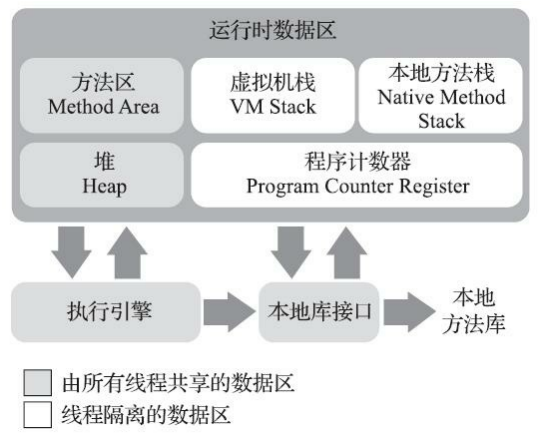

#### 1.1.1 程序计数器

**1. 概念**

程序计数器（Program Counter Register），是当前线程所执行的字节码的**行号指示器**。

> 线程私有的内存。

**2. 作用**

它是程序控制流的指示器，作用于以下基础功能：

- 分支
- 循环
- 跳转
- 异常处理
- 线程恢复

**3. 实现细节**

- 线程执行的是 Java 方法时，记录正在执行的虚拟机字节码指令的地址
- 线程执行本地（Native）方法时，计数器值为空（Undefined）

**4. 异常**

程序计数器是**唯一**一个在《Java虚拟机规范》中**没有**规定任何 **OutOfMemory Error** 情况的区域。

#### 1.1.2 Java虚拟机栈

**1. 概念**

Java 虚拟机栈（Java Virtual Machine Stack），是 Java 方法执行的线程内存模型。

> 线程私有的内存，生命周期与线程相同。

**2. 作用**

为 Java 方法（字节码）服务。

每个 Java 方法被执行时，Java 虚拟机栈会同步创建一个栈帧（Stack Frame），用于存储：

- 局部变量表
- 操作数栈
- 动态连接
- 方法出口

> 每个方法被调用至执行完毕的过程，对应一个栈帧在虚拟机中从入栈到出栈的过程。

**3. 异常**

- 抛出 StackOverflow Error 异常：线程请求的栈深度大于虚拟机允许的深度时。
- 抛出 OutOfMemory Error 异常：若 Java 虚拟机栈容量允许动态扩展，栈扩展无法申请到足够内存时。

> HotSpot 虚拟机的栈容量不允许动态扩展，所以它不会由于虚拟机无法扩展而导致 OutOfMemory Error 异常，但是线程申请空间失败会出现 OOM 异常。

##### 局部变量表

1）编译期的存放类型：

- Java 基本数据类型（boolean、byte、char、short、int、float、long、double）
- 对象引用（reference 类型，即【指向对象起始地址的引用指针】或【指向一个代表对象的句柄或与此对象相关的位置】）
- returnAddress 类型（指向字节码指令的地址）

2）编译期的存放方式：

以局部变量槽（Slot）表示

- 占用两个变量槽：long 和 double
- 占用一个变量槽：其余基本类型

> 局部变量表所需的内存空间在编译期间分配完成，确定局部变量槽的数量，方法运行期间不会改变大小。

#### 1.1.3 本地方法栈

**1. 作用**

本地方法栈（Java Virtual Machine Stack），为本地（Native）方法服务。

>  线程私有的内存。

**2. 异常**

- 抛出 StackOverflow Error 异常：栈深度溢出时
- 抛出 OutOfMemory Error 异常：栈扩展失败时

#### 1.1.4 Java堆

**1. 概念**

Java 堆（Java Heap）虚拟机管理的内存中最大的一块，也叫做 GC 堆。

> 线程共享的区域，虚拟机启动时创建。

**2. 作用**

存放对象实例。

- 回收内存：分代回收（新生代、老年代、永久代、Eden 空间、 From Survivor 空间、To Survivor 空间）
- 分配内存：堆中划分多个线程私有的分配缓冲区（Thread Local Allocation Buffer，TLAB）来提升对象分配时的效率

> Java 堆可在物理内存空间上不连续，但是逻辑上是连续的。

**3. 异常**

抛出 OutOfMemory Error 异常：Java 堆没有内存分配实例，且堆也无法再次扩展时。

> Java 堆默认固定大小，但是可以通过参数 `-Xmx` 和 `-Xms` 扩展其大小。

#### 1.1.5 方法区

**1. 概念**

方法区（Method Area），堆的一个逻辑部分。

> 线程共享的区域。它也叫做“非堆”（Non-Heap），目的是与 Java 堆区分。

**2. 作用**

方法区（Method Area）存储虚拟机加载的数据：

- 类型信息
- 常量
- 静态变量
- 即时编译器编译后的代码缓存

**3. 实现方式**

使用永久代来实现方法区。

- 目的：省去了专门为方法区编写内存管理代码的工作，复用 HotSpot 的垃圾收集器管理方法区。
- 缺陷：永久代有 `-XX: MaxPermSize` 上限，默认固定大小，容易导致 Java 程序的内存溢出问题（极少数方法（如 `String::intern()` ）在不同虚拟机下有不同的表现）。

HotSpot虚拟机：

- JDK6 中放弃了永久代，逐步改为本地内存（Native Memory）实现方法区
- JDK7 移除永久代中的字符串常量池和静态变量
- JDK8 完全放弃永久代，本地内存中实现元空间（Metaspace）来代替

BEA JRockit、IBM J9 等其他虚拟机：

- 没有用永久代实现方法区，所以只要不触碰到物理可用内存上限就不会出现 OOM

> 方法区并不等价于“永久代”。

**4. 内存回收**

内存回收主要针对

- 常量池的回收
- 对类型的卸载

> 方法区与 Java 堆一样可在物理内存空间上不连续，但是逻辑上是连续的，甚至可以不实现垃圾收集。
>
> 方法区的回收条件苛刻，回收效果不理想，但有时必须回收。

**5. 异常**

抛出 OutOfMemory Error 异常：方法区无法满足新内存的分配时。

##### 运行时常量池

1）概念

运行时常量池（Runtime Constant Pool），方法区的一部分。

> 编译后的Class文件包含
>
> - 类的版本
> - 字段
> - 方法
> - 接口描述
> - 常量池表（Constant Pool Table）

常量池表用于存放编译期生成的各种

- 字面量
- 符号引用

2）作用

在类加载后存放

- 常量池表
- 符号引用翻译出来的直接引用

3）动态性

在运行期间也能将新的常量放入池中（如 String 类的 `intern()` 方法）。

4）异常

抛出 OutOfMemory Error 异常：受到方法区的限制，常量池无法申请到内存时。

#### 1.1.6 直接内存

**1. 概念**

直接内存（Direct Memory）既不是虚拟机运行时数据区的部分，也不是《Java 虚拟机规范》中定义的内存区域。

**2. 作用**

JDK 1.4的 NIO 类，通过基于通道（Channel）与缓冲区（Buffer）的 I/O 方式使用 Native 函数库直接分配堆外内存，然后通过一个存储在 Java 堆里的 DirectByteBuffer 对象作为这块内存的引用进行操作。

> 此操作能在部分场景中显著提高性能（避免了在 Java 堆 和 Native 堆中来回复制数据）。

**3. 异常**

抛出 OutOfMemory Error 异常：设置的 `-Xmx` 参数信息与各个内存区域总和大于物理内存限制（包括物理和操作系统级的限制），导致动态扩展失败时。

### 1.2 HotSpot虚拟机对象

#### 1.2.1 对象的创建

**1. 创建过程**

Java 虚拟机遇到字节码new指令时：

①检查：先检查指令参数是否能在常量池中定位到一个类的符号引用

- 若有则检查这个符号引用代表的类是否已被加载、解析和初始化过
- 没有则执行类加载过程

②分配：检查通过后为新对象分配内存，类加载完成后完全确定对象所需内存大小

③初始化：Java 虚拟机将分配到的内存空间（不包括对象头）初始化为零值（保证对象的实例字段在 Java 代码中可以不赋初始值即可直接使用）

> 若使用了 TLAB，则此操作提前至使用 TLAB 分配时进行。

④设置：Java 虚拟机对对象头（Object Header）进行必要设置

- 哪个类的实例
- 类的元数据信息寻找方式
- 对象的 Hash 值（实际上对象 Hash 值延后到真正调用 `Object::hashCode()` 时才计算）
- 对象的 GC 分代年龄
- 是否启用偏向锁

⑤构造函数：若字节码 new 指令后跟随 invokespecial指令，则 new 指令执行后立即执行 `<init>()` 方法即构造函数，在 Java 程序层面初始化对象。

> JVM 虚拟机层面：①②③④
>
> Java 程序层面：①②③④⑤

**2. 内存分配**

1）分配方式：

- 指针碰撞（Bump The Point）：Java 堆内存是绝对规整的，被使用过的内存在一边，空闲的内存在另一边，中间则是指针作为分界点的指示器，分配内存时仅需把此指针向空闲内存方向挪动一段与新对象大小相等的距离
- 空闲列表（Free List）：Java 堆内存不规整时，已被使用的内存与空闲内存相互交错，虚拟机维护一个记录可用内存块的列表，分配内存时从列表中划分一块足够大的空间给对象实例，并更新列表上的记录

2）虚拟机的分配实现

- 带空间压缩整理（Compact）能力的收集器 Serial 和 ParNew：采用指针碰撞分配内存（简单高效）。

- 基于清除（Sweep）算法的收集器 CMS：采用空闲列表分配内存（复杂）。

> CMS的实现里，设计了 Linear Allocation Buffer 的分配缓冲区，通过空闲列表拿到一大块分配缓冲区后，在此区域仍然可以使用指针碰撞的方式来分配，提高分配效率。

3）分配时的线程安全性问题解决方式：

- 对分配内存空间的操作进行同步处理，即采用 CAS 配上失败重试机制保证更新的原子性
- 内存分配的操作按线程划分在不同空间处理，即每个线程在 Java 堆中预先分配小块内存，称为本地线程分配缓冲区（TLAB），本地缓冲区用完后分配新的缓存区时再同步锁定

> 设置 `-XX: ±UseTLAB` 参数来设定是否使用 TLAB 。

#### 1.2.2 对象的内存布局

HotSpot 虚拟机里，对象在堆内存中的存储布局划分为三个部分：

- 对象头（Object Header）
- 实例数据（Instance Data）
- 对其填充（Padding）

**1. 对象头**

对象头包含两部分数据：

- 存储对象自身的运行时数据（Mark Word）
    - HashCode
    - GC 分代年龄
    - 锁状态标志
    - 线程持有的锁
    - 偏向线程ID
    - 偏向时间戳
- 类型指针（即对象指向它的类型元数据的指针）
- 记录数组长度的数据**（对象为 Java 数组时）**

**2. 实例数据**

实例数据存储对象真正的有效信息，即代码中定义的各种类型的字段内容。

1）实例数据的的存储顺序影响因素：

- 虚拟机分配策略参数（`-XX:FieldsAllocationStyle` 参数）
- 字段在 Java 源码中定义的顺序

2）虚拟机默认的分配顺序

longs/doubles -> ints -> shorts/chars -> bytes/booleans -> OOPs（Ordinary Object Pointers）

分配条件（顺序表示优先级）：

- 相同宽度字段分配到一起存放
- 父类定义的变量存放在子类前面
- 子类较窄的变量允许插入父类变量的空隙中（节省少部分空间，前提是 `+XX:CompactFields` 参数值为 true【默认为true】）

**3. 对齐填充**

非必须的数据，仅仅起占位符的作用。

> HotSpot 虚拟机的自动内存管理系统要求对象起始地址必须是8字节的整数倍，若对象实例数据部分没有对齐，则需要通过对齐填充来补全。（对象头已被设计为8字节的数据）

#### 1.2.3 对象的访问定位

对象的访问定位由虚拟机实现，主要有两种访问方式：

- 使用句柄
- 直接指针

**1. 使用句柄**

Java 堆中划分出一块内存作为句柄池，reference 中存储对象的句柄地址，句柄中包含了对象实例数据与类型数据对应的具体内存地址信息。

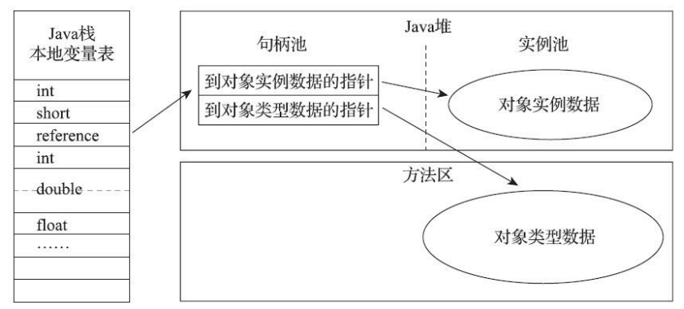

> 优势：reference 中存储的句柄地址稳定，对象移动时（如常见的垃圾收集时移动对象）只会改变句柄中实例数据指针，无需修改 reference

**2. 直接指针**

Java 堆中的reference 中直接存储对象的内存地址。

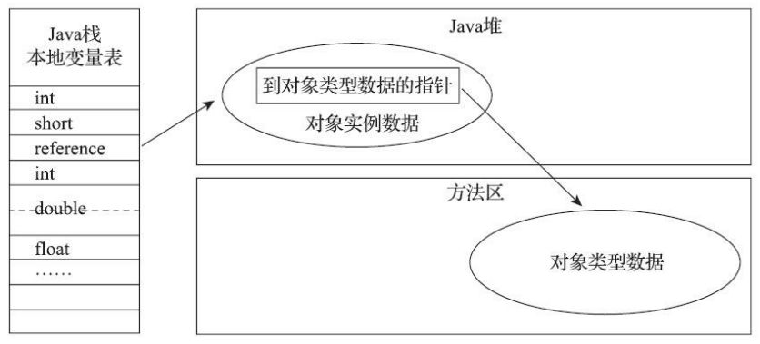

> 优势：访问对象本身时速度更快，少了一次的间接访问开销。

HotSpot 虚拟机

- 主要使用直接指针访问对象
- 例外情况下使用句柄访问（使用了 Shenandoah 收集器时会有一次额外的转发）

## 2 垃圾收集器与内存分配策略

Java 堆和方法区的内存分配和回收是动态的，垃圾收集器重点管理此部分内存。

> 程序计数器、虚拟机栈、本地方法栈等区域的内存分配和回收具备确定性，当方法或线程结束时，内存自然跟着回收。

**垃圾收集器的三大指标：**

- 内存占用（Footpoint）
- 吞吐量（Throughput）
- 延迟（Latency）

### 2.1 对象回收

#### 2.1.1 引用计数算法

**1. 概念**

对象额外存储一个引用计数器 A，被引用时 A 的值加一，引用失效时 A 的值减一。任意时刻引用计数器为零的对象即为不可使用对象。

**2. 应用案例**

- 微软 COM（Component Object Model）技术
- 使用 ActionScript3 的FlashPlayer
- Python 语言
- 应用于游戏脚本领域的 Squirrel

> 主流的 Java 虚拟机都没有选用引用计数法来管理内存。
>
> 引用计数法可以通过 Recycler 算法解决循环引用问题，但是多线程环境下，引用计数变更性能较低。

#### 2.1.2 可达性分析算法

**1. 概念**

可达性分析算法（Reachability Analysis），就是通过一系列“GC Roots”的根对象作为起始节点集，根据引用关系向下搜索，若某个对象到 GC Roots 间没有任何引用链相连，即从 GC Roots 到这个对象不可达，证明此对象不可再被使用。

> 引用链（Reference Chain）：搜索过程锁走过的路径。

实例：

如下图，对象 object 5、object 6、object 7 虽然互有关联，但是它们到GC Roots是不可达的，因此它们将会被判定为可回收的对象。

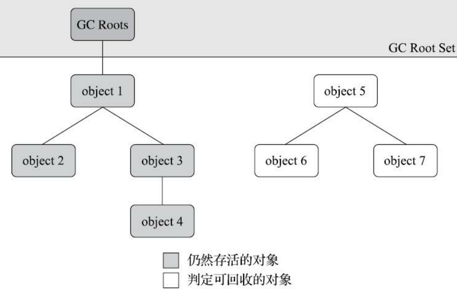

**2. 组成**

Java 技术体系中，固定可作为 GC Roots 的对象：

- Java 虚拟机栈中引用的对象（栈帧中的局部变量表），如线程被调用的方法堆栈中使用到的参数、局部变量、临时变量等
- 方法区中类静态属性引用的对象，如 Java 类的引用类型静态变量
- 方法区中常量引用的对象，如字符串常量池（String Table）的引用
- 本地方法栈中 JNI 引用的对象
- Java 虚拟机内部的引用，如基本类型的包装类对象，常驻的异常对象（如 NullPointException、OutOfMemory Error），系统类加载器
- 所有被同步锁（synchronized 关键字）持有的对象
- 反应 Java 虚拟机内部情况的 JMXBean、JVMTI 中注册的回调、本地代码缓存
- 其他临时性的对象，如关联区域的对象

#### 2.1.3 引用

四种引用强度依次减弱

- 强引用（Strongly Reference）
- 软引用（Soft Reference）
- 弱引用（Weak Reference）
- 虚引用（Phantom Reference）

**1. 强引用**

实现：new 关键字对应的引用赋值。

回收条件：只要强引用关系存在，垃圾收集器就不会回收被引用的对象。

**2. 软引用**

定义：描述有用但非必须的对象。

实现：`SoftReference` 类实现

回收条件：系统发生内存溢出异常前，会把软引用对象列进回收范围中进行第二次回收。（若这次回收依然内存不足则抛出内存溢出异常）

**3. 弱引用**

定义：描述但非必须的对象。

实现：`WeakReference` 类实现

回收条件：下一次垃圾收集发生时被回收。

**4. 虚引用**

定义：对象的虚引用完全不会影响其生存时间，又称为幽灵引用或幻影引用。（无法通过虚引用获取对象实例）

实现：`PhantomReference` 类实现

目的：在此对象被收集器回收时收到一个系统通知。

#### 2.1.4 对象彻底回收

对象被彻底回收的需要经过两次标记过程：

①可达性分析后发现没有与 GC Roots 相连的引用链，则被第一次标记，随后进行一次筛选。

> 筛选此对象是否有必要执行 `finalize()`，对象没有覆盖  `finalize()` 方法，或者者 `finalize()` 方法已被虚拟机调用过，则没有必要执行。

②有必要执行 `finalize()` 时，会将对象放在 F-Queue 队列中，由一条虚拟机自动建立的低调度优先级的 Finalizer 线程去 “执行” 它们的 `finalize()` 方法，稍后被第二次标记，随后彻底回收。

> 此处的执行只是触发方法开始运行，但不保证等待它运行结束。（因为若对象的 `finalize()` 方法执行缓慢甚至发生死循环时，将导致 F-Queue 队列的其他对象处于永久等待，进而导致整个内存回收子系统崩溃）

※注意：`finalize()` 方法（官方不推荐使用）的效果尽量用 try-finally 或其他方式代替。

#### 2.1.5 回收方法区

**1. 特性**

方法区垃圾回收

- 效率较低
- 回收条件苛刻

> 《Java虚 拟机规范》中可以不要求虚拟机在方法区中实现垃圾收集，如：JDK 11 的 ZGC 收集器不支持类卸载。

**2. 回收内容**

- 废弃的常量
- 不再使用的类型

1）废弃的常量的回收条件

- 没有任何对象引用此常量
- 虚拟机没有其他地方引用此常量
- 此时发生内存回收，且垃圾收集器判断有必要将其回收

2）不再使用的类型的**允许**回收条件

- 该类所有的实例已被回收（即 Java 堆中不存在该类机器任何派生子类的实例）
- 加载该类的类加载器已被回收（如 OSGi、JSP的重加载等）
- 该类对应的 java.lang.Class 对象没有被任何地方引用，且任何地方都无法通过反射访问该类的方法

> 允许回收条件：表示没有引用了不一定会回收。

**3. JVM 参数**

HotSpot 虚拟机的 Xnoclassgc 参数控制是否要对类型进行回收。

查看类加载和卸载信息：

- Product 版虚拟机：`verbose: class` `-XX:+TraceClassLoading`
- FastDebug 版虚拟机：`-XX:+TraceClassUnLoading`

### 2.2 追踪式垃圾收集算法

垃圾收集算法分为两类

- 引用计数式垃圾收集（Reference Counting GC）
- 追踪式垃圾收集（Tracing GC）

> 引用计数式垃圾收集又称为直接垃圾收集。（主流 Java 虚拟机均未涉及）
>
> 追踪式垃圾收集又称为间接垃圾收集。

#### 2.2.1 分代收集理论

**1. 背景**

分代收集理论建立在三个分代假说之上：

- 弱分代假说（Weak Generational Hypothesis）：绝大多数对象都是朝生夕灭的
- 强分代假说（Strong Generational Hypothesis）：熬过越多次垃圾收集过程的对象就越难以消灭
- 跨代引用假说（Intergenerational Reference Hypothesis）：跨代引用相对于同代引用来说仅占极少数

**2. 分类**

分代收集的分类：

- 部分收集（Partial GC）：指目标不是完整收集整个 Java 堆的垃圾收集
    - 新生代收集（Minor GC/Young GC）：指目标只是新生代的垃圾收集
    - 老年代收集（Major GC/Old GC）：指目标只是老年代的垃圾收集*（Major GC 有争议）*
    - 混合收集（Mixed GC）：指目标是收集整个新生代以及部分老年代的垃圾收集
- 整堆收集（Full GC）：指收集整个 Java 堆和方法区的垃圾收集

**3. 应用案例**

- 老年代收集：CMS 收集器独有
- 混合收集：G1 收集器独有

#### 2.2.2 标记清除算法

**1. 概念**

标记清除算法分为 “标记” 和 “清除” 两个阶段：

- 方式一：标记回收对象，统一回收所有被标记的对象
- 方式二：标记存活的对象，统一回收所有未被标记的对象

标记清除算法图解


**2. 缺点**

- 执行效率不稳定（Java 堆中大量对象中的大部分是需要回收的对象时，必须进行大量标记和清除的动作，导致这两个过程的执行效率随对象数量增长而降低）
- 会使内存空间碎片化（标记、清除之后会产生大量不连续的内存碎片，导致 JVM 需要分配较大对象时连续内存不足而再次触发垃圾收集动作）

#### 2.2.3 标记复制算法

**1. 背景**

标记复制算法基于1969年 Fenichel 提出的半区复制（Semispace Copyting）。

1）半区复制算法：将可用内存按容量划分为两块大小相等的部分，每次只用其中一块，这块内存快用完时将存活的对象复制到另一块上，然后清理掉之前用过的内存空间

2）半区复制算法特性：

优点：

- 存活对象较少时，资源消耗较少
- 内存分配实现简单，运行高效（没有内存空间碎片的复杂情况，只需移动堆顶指针即可）

缺点：

- 存活对象较多时，会产生大量的内存间复制的开销
- 浪费一半的可用内存

3）标记复制算法图解

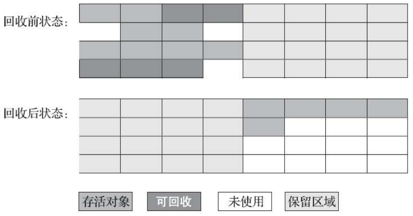

**2. Appel 式回收**

1）背景

Appel式回收是在1989年 Andrew Appel 提出的更优化的半区复制分代策略。

2）流程

①把新生代分为一块较大的 Eden 空间和两块较小的 Survivor 空间

②分配内存只使用 Eden 和其中一块 Survivor

③垃圾收集时，将 Eden 和 Survivor 中的存活对象一次性复制到 另外一块 Survivor 上，然后清理掉 Eden 和 Survivor 空间

> HotSpot 虚拟机默认 **Eden : Form Survivor : To Survivor** 的大小比例是**8:1:1**。

3）逃生门机制

当 Survivor 空间不足以容纳一次 Minor GC 后存活的对象时，依赖其他区域（大多为老年代）进行分配担保（Handle Promotion）。

4）应用案例

- HotSpot 虚拟机的 Serial 收集器
- HotSpot 虚拟机的 ParNew 收集器

#### 2.2.4 标记整理算法

**1. 概念**

标记过程同标记清除算法，但不清理回收对象，后续让所有存活对象移动到内存空间一端，然后清理存活对象边界以外的内存。

标记整理算法图解


**2. 特性**

优点：

- 分配内存效率高
- 没有内存碎片

缺点：

在老年代这样有大量对象存活的区域回收，移动存活对象并更新对象引用时

- 资源消耗巨大
- 用户程序短时间内不可用

#### 2.2.5 三个标记算法总结

1）标记清除算法与标记整理算法的本质区别：

- 标记清除算法是一种非移动式的回收算法
- 标记复制和标记整理算法是一种移动式的回收算法

2）对象移动角度

- 移动对象内存回收时更复杂
- 不移动对象内存分配时更复杂

3）垃圾收集的角度

- 不移动对象停顿时间更短甚至没有停顿
- 移动对象程序的吞吐量会更大

> 吞吐量的实质是赋值器（Mutator，垃圾收集的用户程序）与收集器的效率总和。

4）应用案例

- Parallel Scavenge 收集器基于标记整理算法，关注吞吐量
- CMS 收集器主要基于标记清除算法（面临空间碎片过多时采用标记整理算法收集一次，使内存规整）

### 2.3 Hotspot 算法实现

#### 2.3.1 根节点枚举

**1. 枚举对象**

主要是：

- 全局引用（如常量和类静态属性）
- 执行上下文（如栈帧中的本地变量表）

**2. 枚举原理**

HotSpot 虚拟机中，使用 OopMap 存储 GC Roots。类加载完成时，Hotspot 计算对象内所有偏移量对应的类型和引用所在栈和寄存器的特定位置，防止 GC Roots 全局扫描方法区。

> 此处的特定位置叫做安全点（safepoint）。

#### 2.3.2 安全点

**1. 作用**

安全点决定用户程序线程执行过程中发生 "stop the world" 的垃圾收集操作。

**2. 作为安全点的条件**

方法调用、循环跳转、异常跳转等指令序列复用。

**3. 问题**

1）如何在垃圾收集发生时让所有线程（JNI 调用线程除外）都执行到最近的安全点？

两种方案：

- 抢先式中断（Preemptive Suspension）：垃圾收集时，先中断所有用户线程，若有未执行到安全点的线程，则将其恢复执行一会再中断，直到执行到安全点；
- 主动式中断（Voluntary Suspension）：垃圾收集时，设置一个标志位，各个线程执行时不断轮询此标志位，一旦标志位为真，则线程在最近的安全点上主动中断挂起（轮询标志位与安全点、创建对象和其他需要在 Java 堆上分配内存的位置重合）。

2）主动式中断中的标志位轮询操作如何高效实现？

HotSpot 使用内存保护陷阱的方式，把轮询操作精简至只有一条汇编指令，即预先注册异常处理器，执行到一个指定的指令时产生一个自陷异常信号，从而将线程挂起。

#### 2.3.3 安全区域

**1. 作用对象**

处于 SLEEP 和 BLOCKED 状态的用户线程。

> 因为处于这两种状态的线程无法响应虚拟机的中断请求，无法执行到安全点中断挂起自己，虚拟机也不会一直等待线程重新激活后分配 CPU 时间片。

**2. 作用**

安全区域（Safe Region）确保在某一段代码片段中，引用关系不会发生变化。

> 安全区域中的任意地方开始垃圾收集都是安全的。

**3. 限制**

用户线程执行到安全区域的代码时，会标识自己已经进入安全区域，当虚拟机发起垃圾收集时不再管理这些线程，当线程里开安全区域时，它会检查虚拟机是否完成 GC Roots 的枚举或垃圾收集过程中其他需要暂停用户线程的阶段，完成则继续执行；未完成则持续等待，直到收到可以离开安全区域的信号。

#### 2.3.4 记忆集

**1. 定义**

一种用于记录从非收集区域指向收集其余的指针的集合的抽象数据结构。

**2. 底层数据结构**

记忆集底层数据结构为 Remembered Set。

**3. 作用**

缩减 GC Roots 扫描范围，即避免把整个老年代纳入 GC Roots 扫描范围。

**4. 实现方式**

判断某一块非收集区域是否存在有指向收集区域的指针。

**5. 精度范围分类**

记忆集根据节省存储和维护成本等方面分为三个记录粒度：

- 字长精度：每个记录精确到一个机器字长（处理器的寻址位数，如32位或64位），该字长包含跨代指针；
- 对象精度：每个记录精确到一个对象，该对象里有字段包含跨代指针；
- 卡精度：每个记录精确到一块内存区域，该区域内有对象含有跨代指针。

> 卡精度即卡表（Card Table），卡表是记忆集的一种实现。

**6. HotSpot 的卡表**

1）实现逻辑

HotSpot 虚拟机的卡表标记逻辑的实现就是一个字节数组。

````C++
CARD_TABLE [this address >> 9] = 0;
````

2）卡页

卡页（Card Page），即字节数组 CARD_TABLE 中每一个元素对应着其标识的内存区域中一块特定大小的内存块。

> 卡页一般为 2 的 N 次幂的字节数，HotSpot 中使用的卡页是2的9次幂，即512字节。

3）卡表与卡页的对应关系

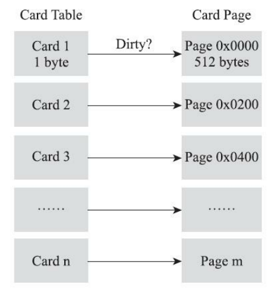

卡页的内存中至少包含一个对象，卡页内有一个或以上的对象的字段存在跨代引用指针，则此卡表数组元素变脏（Dirty），其值标识为1，否则为0。垃圾收集时，筛选出卡表变脏的元素，加入到 GC Roots 中一并扫描。

#### 2.3.5 写屏障

**1. 定义**

写屏障（Write Barrier）是一个在虚拟机层面对“引用类型字段赋值”动作的 AOP 切面。

> 此写屏障**不是**解决并发乱序执行问题的内存屏障。

**2. 产生原因**

即时编译后的代码是机器指令流，无法通过代码层面去干预。

**3. 分类**

- 写前屏障（Pre-Wirte Barrier）：在赋值前的部分进行执行额外操作；
- 写后屏障（Post-Write Barrier）：在赋值后的部分进行执行额外操作。

> G1 用到了写前屏障和写后屏障，在它之前的其他收集器只用了写后屏障。

**4. 作用**

维护卡表状态。

**5. 实现原理**

在引用对象赋值时，产生一个环形通知（Around Advice），供虚拟机在赋值前后执行额外的操作。

**6. 线程安全问题**

1）伪共享问题

伪共享（False Sharing），即当多线程修改互相独立的变量时，如果这些变量恰好共享同一个缓存行，则会彼此影响（写回、无效化或者同步）导致性能降低。

2）解决方案

不采用无条件的写屏障，而是先检查卡表标记，当卡表元素为被标记过则标记为变脏。

3）JVM 参数设置

-XX: +UseCondCardMark：开启卡表更新的条件判断（开启后增加一次额外判断的开销，避免伪共享问题）。

#### 2.3.6 三色标记

**1. 定义**

三色标记（Tri-color Marking）：

- 白色：对象未被垃圾收集器访问过，分析开始阶段，均为白色，结束阶段仍然为白色的表示不可达。等待被回收；
- 黑色：对象已被垃圾收集器访问过，且此对象的所有引用都已扫描，表示安全存活对象，若有其他对象指向黑色对象，无需重新扫描（黑色对象在扫描开始后不可能不经过灰色对象直接指向白色对象）
- 灰色：对象已被垃圾收集器访问过，但此对象至少存在一个引用未被扫描。

**2. 产生原因**

GC Roots 的遍历对象停顿时间与 Java 堆容量成正比关系。

**3. 作用**

缩短用户线程停顿时间。

**4. 对象消失问题**

以下两种条件满足时，会出现对象消失问题，即原本是黑色的对象被误标为白色：

- 赋值器插入了一条或多条从黑色对象到白色对象的新引用；
- 赋值器删除了全部灰色对象到该白色对象的直接或间接引用。

**5. 解决方案**

破坏上述两个条件的任意一个即可，有两种解决方案：

- 增量更新（Incremental Update）
- 原始快照（Snapshot At The Beginning，SATB）

1）增量更新

破坏第一个条件，当黑色对象插入新的指向白色对象的引用关系时，记录此新插入的引用，等并发扫描结束后，再将这些记录过的引用关系中的黑色对象作为 GC Roots，重新扫描一次。

**即黑色对象一旦新插入了指向白色对象的引用后，它就变回灰色对象。**

2）原始快照

破坏第二个条件，当灰色对象要删除指向白色对象的引用关系时，记录这个要删除的引用，等并发扫描结束后，再将这些记录过的引用关系中的灰色对象作为 GC Roots，重新扫描一次。

**即无论引用关系删除与否，都会按照刚开始扫描那一刻的对象图快照来进行搜索。**

**6. 应用**

应用相关解决方案的垃圾收集器：

- 增量更新：CMS
- 原始快照（SATB）：G1、Shenandoah

### 2.4 经典垃圾收集器


- Young generation 新生代
- Tenured generation 老年代
- 连线表示可以搭配使用
- JDK 9 图案表示在 JDK 9 中的组合搭配被废弃掉了

> 并行（Parallel）：同一时刻，多条垃圾收集器线程之间协同工作，此时用户线程处于等待状态。
>
> 并发（Concurrent）：同一时刻，垃圾收集器线程与用户线程同时运行，此时户线程的吞吐量受到影响。

#### 2.4.1 Serial收集器

**1. 目标**

缩短垃圾收集时用户线程的停顿时间。

**2. 特性**

- 垃圾收集面向新生代区域
- 收集效率最高的单线程收集器
- 额外内存消耗（Memory Footprint）最小
- 停顿时间在十几至一百多毫秒

**3. 原理**

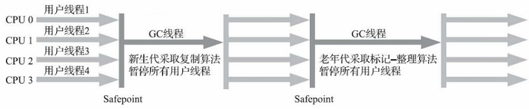

- 基于标记复制算法
- 单线程垃圾收集器
- 垃圾收集时须暂停所有工作线程直到它收集结束（Stop the world）

**4. 适用场景**

客户端模式下的 HotSpot 虚拟机。

#### 2.4.2 ParNew收集器

**1. 目标**

缩短垃圾收集时用户线程的停顿时间。

**2. 特性**

- 垃圾收集面向新生代区域
- 唯一能与 CMS 收集器配合工作的垃圾收集器
- 首个支持并发的垃圾收集器
- 首个退出历史舞台的垃圾收集器

> JDK 9 开始 ParNew + CMS 组合不再被官方推荐，取消了 ParNew + Serial Old 和 Serial + CMS 两套收集器组合的支持，取消了 `-XX:+UseParNewGC` 。

**3. 原理**


Serial 收集器的多线程版本，与其共用大部分代码。

- 基于标记复制算法
- 能并行收集的多线程垃圾收集器
- 垃圾收集时须暂停所有工作线程直到它收集结束（Stop the world）

**4. 适用场景**

多核处理器下的服务端的 HotSpot 虚拟机。

**5. JVM 参数**

- `-XX:+UseConcMarkSweepGC`  激活 CMS 收集器
- `-XX:±UseParNewGC` 强制指定或禁用 ParNew 收集器
- `-XX:ParallelGCThreads` 限制垃圾收集的线程数

#### 2.4.3 Parallel Scavenge收集器

**1. 目标**

达到一个可控制的吞吐量（Throughput）。

> 吞吐量指处理器用于运行用户代码的时间与处理器总消耗时间的比值。

$$
吞吐量=\frac{运行用户代码时间}{运行用户代码时间 + 运行垃圾收集时间}
$$

**2. 特性**

- 垃圾收集面向新生代区域
- 可开启垃圾收集的自适应的调节策略（GC Ergonomics）

> 垃圾收集的自适应的调节策略是指虚拟机会根据当前系统的运行情况收集性能监控信息，动态调整如下参数以提供最适合的停顿时间或者最大的吞吐量：
>
> 1）`-Xmn` 新生代的大小
>
> 2）`-XX:SurvivorRatio` Eden 与 Survivor 区域比例
>
> 3）`-XX:PretenureSizeThreshold` 晋升老年代对象大小

**3. 原理**

- 基于标记复制算法
- 能并行收集的多线程垃圾收集器

**4. 适用场景**

服务端模式下的 HotSpot 虚拟机。

**5. JVM 参数**

- `-XX:MaxGCPauseMillis` 控制最大垃圾收集停顿时间（大于0的毫秒数）

    > 缩短垃圾收集停顿时间是以牺牲吞吐量和新生代空间为代价换取的，不是越短越好。

- `-XX:GCTimeRatio` 直接设置吞吐量大小（0 ~ 100 的整数，默认99）

- `-XX:+UseAdaptiveSizePolicy` 开启垃圾收集的自适应的调节策略（开启前虚拟机内存数据和上述两个参数需要提前设定好）

#### 2.4.4 Serial Old收集器

**1. 目标**

缩短垃圾收集时用户线程的停顿时间。

**2. 用途**

服务端模式下：

- 在 JDK 5 及以前的版本中，配合 Parallel Scavenge 收集器使用
- 作为 CMS 收集器失败时的后预案，在并发收集发生 Concurrent Mode Failure 时使用

**3. 原理**

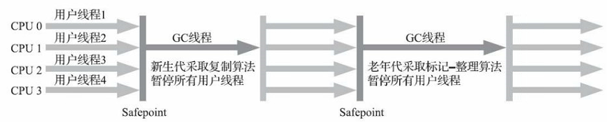

Serial 收集器的老年代的单线程版本。

- 基于标记整理算法
- 单线程垃圾收集器

**4. 适用场景**

客户端模式下的 HotSpot 虚拟机。

#### 2.4.5 Parallel Old收集器

**1. 目标**

同 Parallel Scavenge收集器。

**2. 特性**

- 垃圾收集面向老年代区域
- 其他同 Parallel Scavenge收集器

**3. 原理**

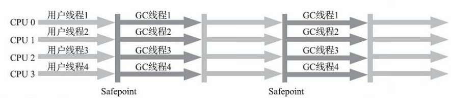

Parallel Scavenge 收集器的老年代版本。

- 基于标记整理算法
- 其他同 Parallel Scavenge收集器

**4. 适用场景**

- 注重吞吐量的场景
- 处理器资源较为稀缺的场合

#### 2.4.6 CMS收集器

CMS（全称 Concurrent Mark Sweep）并发标记收集器。

**1. 目标**

获取最短回收停顿时间。

**2. 特性**

面向老年代进行垃圾收集。

优点：

- 并发收集
- 低停顿

缺点：

- 会产生浮动垃圾
- 收集结束时产生大量空间碎片，导致触发 Full GC
- 不符合职责分离的设计原则

**3. 原理**


基于标记清除算法，清理流程分为四个步骤：

1）初始标记（CMS initial mark）

标记 GC Roots 能直接关联到的对象（需停顿用户线程，速度快）。

2）并发标记（CMS concurrent mark）

从 GC Roots 的直接关联对象开始便利整个对象图的过程，（并发执行，无需停顿用户线程，耗时长）。

3）重新标记（CMS remark）

修正并发标记期间，因用户程序同时运行导致增量更新的对象标记记录，（需停顿用户线程，执行速度仅次于初始标记）。

4）并发清除（CMS concurrent sweep）

清理删除掉标记阶段判断的回收对象，（并发执行，无需停顿用户线程）。

**4. 适用场景**

服务端模式下的 HotSpot 虚拟机。

**5. JVM 参数**

- `-XX:CMSInitialingOccupancyFraction` 设置 CMS 的触发百分比（根据老年代回收频率调整）

    > jDK 5 默认为68%，JDK 6 默认为92%。
    >
    > 设置太高会因为浮动垃圾（Floating Garbage）过多出现并发失败（Concurrent Model Failure），此时会临时启用 Serial Old 来重新回收老年代区域，导致用户线程停顿时间过长，性能降低。

- `-XX:+UseCMSCompactAtFullCollection` 解决空间碎片问题（默认开启，JDK 9 开始废弃）

- `-XX:CMSFullGCsBeforeCompaction` 进行Full GC 前进行碎片整理的间隔次数（默认0，表示每次进入 Full GC时都进行碎片整理，JDK 9 开始废弃）

**6. CMS 收集器的变种**

增量式并发收集器（Incremental Concurrent Mark Sweep/i-CMS）

1）目标

处理器核心不足四个时，降低垃圾收集独占资源的时间。

2）原理

并发标记、清理时让收集器线程和用户线程交替运行。

> jDK 7 开始被弃用， JDK 9 发布时 i-CMS 被完全废弃。

#### 2.4.7 Garbage First收集器（G1）

G1 收集器是垃圾收集器技术史上里程碑式的成果，开创了收集器面向局部收集的设计思路和基于 Region 的内存布局形式。

> JDK 8 Update 40后称为"全功能的垃圾收集器"（Fully-Featured Garbage Collector）。

**1. 目标**

- 替换掉 CMS 收集器
- 建立起 “停顿时间模型”（Pause Prediction Model）
- 有限时间内获取尽可能高的收集效率
- 追求内存分配速率（Allocation Rate）

1）停顿时间模型概念

是指能够支持指定在长度为 M 毫秒的时间片段内，消耗在垃圾收集上的时间大概率不超过 N 毫秒。

> 停顿时间模型已成为实时 Java （RTSJ）中软实时垃圾收集器的特征。

2）能建立停顿时间模型的原因

G1 收集器将 Region 作为单次回收的最小单元，可有计划地避免在整个 Java 堆中进行全区域的垃圾收集。

> 处理思路：
>
> ①G1 收集器跟踪各个 Region 里的垃圾堆积的价值（回收所得空间大小以及回收所需时间的经验值）大小
>
> ②在后台维护一个优先级列表，每次根据用户设定允许的收集停顿时间，优先处理回收价值收益最大的 Region （Garbage First 名字的由来）

**2. 特性**

优点：

- 支持类型卸载
- 不会产生内存空间碎片
- 垃圾收集效果更好
- 可预测停顿时间
- 有利于程序长时间运行（垃圾收集完成后能提供规整的可用内存）
- 程序为大对象分配内存空间时不容易因无法找到连续内存空间而提前触发下一次收集

缺点：

- 垃圾收集产生的内存占用（Footprint）高
- 程序运行时的额外执行负载（Overload）高

**3. 原理**

G1 收集器 Region 分区示意图


- 整体基于标记整理算法，局部（两个 Region 之间）基于标记复制算法
- 面向堆内存任何组成回收集（Collection Set，简称CSet）进行回收。
- 把 Java 堆划分为多个大小相等的独立区域（Region），每个区域可根据需要动态变成 Eden 空间、Survivor 空间或老年代空间，分别采用不同策略处理。
- Region中特殊的 Humongous 区域只存储大对象，判定条件为对象大小超过 Region 一半。

> Mixed GC 模式下：回收衡量标准为哪块内存垃圾数量最多，回收收益最大。

**4. 需要解决的问题**

1）跨 Refion 引用对象问题如何解决？

使用记忆集避免全堆作为 GC Roots 扫描。

> G1 的记忆集应用更加复杂，它的每个 Region 都有其单独的记忆集，用来记录别的 Region 指向自己的指针，并标记这些指针分别在哪些卡页的范围内。
>
> 记忆集的底层存储结构是哈希表，Key表示 Region 起始地址， Value 表示一个集合，存储卡表的索引号。（卡表是一种双向结构，记录指针源地址和指针目的地）

2）并发标记阶段如何保证收集线程与用户线程互不干扰的运行？

> CMS 收集器采用增量更新算法实现

G1收集器通过原始快照（SATB）算法实现，程序运行过程中如果有新对象创建，G1 每个 Region 上的 TAMS（Top at Mark Start）指针把 Region 中部分空间划分出来用于并发回收过程中的新对象分配，并发回收时新分配的对象地址都必须在这两个指针位置以上。

> G1 收集器默认在这两个 TAMS 指针地址以上的对象是被隐式标记过的，即存活对象，不纳入回收范围，所以内存回收速度赶不上内存分配速度时会被迫冻结用户线程执行，导致 Full GC 产生长时间 “Stop The World”。

3）怎样建立可靠的停顿预测模型？

以衰减均值（Decaying Average）为理论基础实现的。

> G1 收集器会记录每个 Region 回收耗时、每个 Region 记忆集里的脏卡数量等各个可测量的步骤花费的成本，分析得出平均值、标准偏差和置信度等统计信息。

**5. 收集流程**


分为四个步骤（没有计算用户线程运行过程中的动作，如写屏障维护记忆集的操作）：

1）初始标记

标记 GC Roots 能直接关联到的对象，并修改 TAMS 指针的值，为并发标记阶段用户线程并发运行时，能正确地在可用的 Region 中分配新对象（需停顿用户线程，耗时短）。

2）并发标记

从 GC Roots 开始对堆中对象进行可达性分析，递归扫描整个堆里的对象图，找出回收对象，对象图扫描完后重新处理 SATB 记录下的在并发时有引用变动的对象（并发执行，无需停顿用户线程，耗时长）。

3）最终标记

短暂暂停用户线程，用于处理并发阶段结束后仍遗留下来的少量 SATB 记录（需停顿用户线程）。

4）筛选回收

更新 Region 的统计数据，对各个 Region 的回收价值和成本进行排序，根据用户期望的停顿时间来指定回收计划，可自由选择任意 Region 构成回收集，把其中的存活对象复制到空的 Region 中，再清理掉整个旧 Region 的全部空间（涉及存活对象的移动，需停顿用户线程，多条收集器线程并行处理）。

**6. 适用场景**

面向服务应用的服务器。

**7. JVM 参数**

- `-XX:G1HeapRegionSize` 设置 Region 大小（1MB ~ 32MB，且为2的 N 次幂） 

- `-XX:MaxGCPauseMillis` 设定允许的收集停顿时间（默认200毫秒）

    > 100 ~ 300 毫秒最佳，太短会使收集器的收集速度低于分配器分配的速度，垃圾堆积导致触发 Full GC 降低性能。

### 2.5 低延迟垃圾收集器

#### 2.5.1 Shenandoah 收集器

Shenandoah 只存在于 Open JDK 中，Oracle JDK 将其排除在外。

**1. 目标**

- 替换掉 G1 收集器
- 在堆吞吐量影响较小的情况下，实现在任意堆内存大小下，都能将停顿时间控制在10ms以内

**2. 特性**

优点：

- 支持类型卸载
- 不会产生内存空间碎片
- 垃圾收集效果更好
- 可预测停顿时间
- 停顿时间更短
- 有利于程序长时间运行（垃圾收集完成后能提供规整的可用内存）
- 程序为大对象分配内存空间时不容易因无法找到连续内存空间而提前触发下一次收集

缺点：

- 垃圾收集产生的内存占用（Footprint）高
- 程序运行时的额外执行负载（Overload）高

**3. 原理**

- 基于 Region 的堆内存布局，拥有针对大对象的 Humongous Region
- 默认回收策略是优先处理回收价值最大的 Region
- 不使用分代收集，而是通过连接矩阵（Connection Martix）的全局结构来记录跨 Region 的引用关系，降低了处理夸大指针的记忆集维护消耗，降低了伪共享问题发生概率

**4. 收集流程**

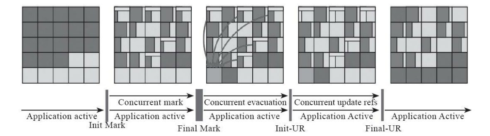

总共分为九个步骤，其中有三个最核心的步骤（并发标记、并发回收、并发引用更新）：

1）初始标记

同 G1，首先标记与 GC Roots 直接关联的对象（需停顿用户线程，耗时与 GC Roots 数量相关）。

2）并发标记

同 G1，遍历对象图，标记出全部可达对象（并发执行，无需停顿用户线程，耗时与堆中存货对象的数量及对象图的结构复杂度相关）。

3）最终标记

同 G1，短暂暂停用户线程，用于处理并发阶段结束后仍遗留下来的少量 SATB 记录，统计出回收价值最高的 Region，组成一组回收集（Collection Set）（需停顿用户线程）。

4）并发清理

清理整个区域内完全没有存活对象的 Region（即 Immediate Garbage Region）。

5）并发回收

通过都屏障和转发指针（Brooks Pointers），在与用户线程并发的情况下，把回收集里面的存活对象先复制一份到其他未被使用的 Region 中。

6）初始引用更新

把堆中所有指向就对象的引用修正到复制后的新地址，并确保所有并发回收阶段的收集器线程已完成分配给它们的对象移动任务（短暂停顿用户线程）

7）并发引用更新

按照内存物理地址的顺序，线性的搜索出引用类型，把旧值改为新值。

8）最终引用更新

修正 GC Roots 中的引用（短暂停顿用户线程，停顿时间与 GC Roots 的数量相关）

9）并发清理

调用一次并发清理回收这些 Immediate Garbage Region 的内存空间。

**5. 对象移动与用户程序的并发方案**

1）Forwarding Pointer 转发指针

- 实现原理：在被移动对象原有内存上设置保护陷阱（Memory Protection Trap），一旦用户程序访问到归属于旧对象原有的内存空间，则产生自陷中断，进入预设好的异常处理器中，再由其中的代码逻辑把访问转发到复制后的新对象上。
- 缺点：代价高，不能频繁使用（没有操作系统层面支持，则导致用户态频繁切换到内核态）

2）Brooks Pointer 转发指针

- 实现原理：在原有对象头中统一增加一个新的引用字段，在无并发的移动情况下，该引用指向自己。
- 优点：对象并发移动时，只需要修改一处旧对象转发指针的值，指向新对象
- 缺点：每次间接对象访问，产生额外的转向开销

> 在多线程竞争的情况下，Shenandoah 通过 CAS 操作保证并发对象的访问正确性。

#### 2.5.2 ZGC 收集器 

**1. 目标**

在堆吞吐量影响较小的情况下，实现在任意堆内存大小下，都能将停顿时间控制在10ms以内

**2. 特性**

优点：

- JDK 12 支持类型卸载（JDK 11 不支持）
- 不会产生内存空间碎片
- 垃圾收集效果更好
- 可预测停顿时间
- 停顿时间更短
- 有利于程序长时间运行（垃圾收集完成后能提供规整的可用内存）
- 程序为大对象分配内存空间时不容易因无法找到连续内存空间而提前触发下一次收集

缺点：

- 垃圾收集产生的内存占用（Footprint）高
- 程序运行时的额外执行负载（Overload）高

**3. 原理**

- 基于动态 Region（又叫 Page/ZPage） 的堆内存布局

- 默认回收策略是优先处理回收价值最大的 Region
- 不使用分代收集，而是通过染色指针技术（Colored Pointer）实现并发整理

**4. 动态 Region**

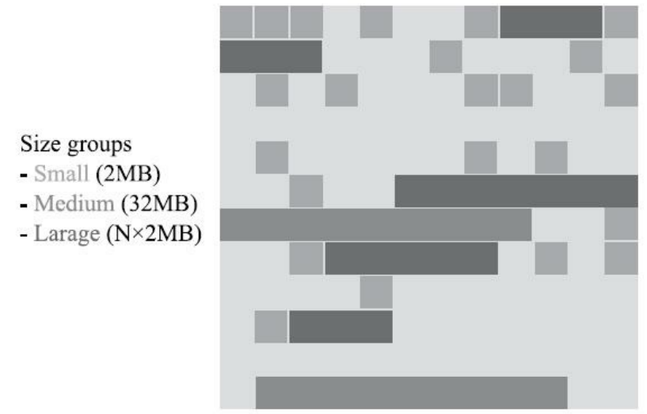

ZGC 的 Region 具有动态性，动态创建和销毁，以及动态的区域容量大小，根据容量分为三类：

- 小型 Region（Small Region）：固定 2MB，放置小于 256KB 的小对象；
- 中型 Region（Medium Region）：固定 32MB，放置大于等于 256KB 但小于 4MB 的对象；
- 大型 Region（Large Region）：容量动态变化，但必须为 2MB 的整数倍，放置 4MB 以上的的大对象（最小容量可能低至 4MB，且不会被重分配）。


（未完待续）

#### 2.5.3 垃圾收集器对比汇总

**1. 收集过程对比**

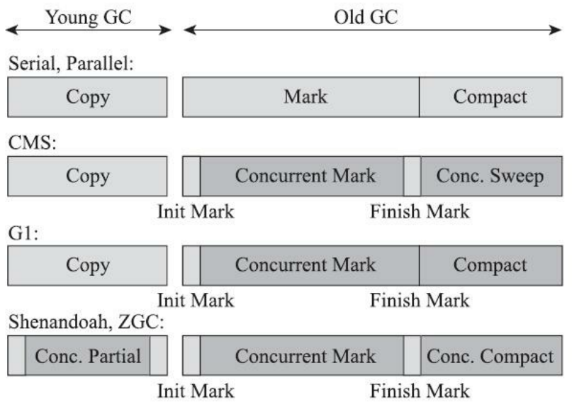

浅色表示必须挂起用户线程，深色表示收集器与用户线程并发执行。

Init Mark 表示初始标记，Finish Mark 表示最终标记。

- 标记阶段：CMS 使用增量更新实现标记阶段的并发；G1 使用原始快照实现标记阶段的并发。
- 整理阶段：CMS 使用标记清除算法，避免了标记整理阶段的停顿，但是会堆积内存碎片，最终触发 Full GC；G1 以 Region 为单位回收，降低整理阶段的停顿，但是服务器资源占用提高了。

**2. 收集器对比**

| 收集器            | 回收算法      | 回收区域      | 优点                                               | 缺点             |
| ----------------- | ------------- | ------------- | -------------------------------------------------- | ---------------- |
| Serial            | 标记复制      | 新生代        | 效率最高的单线程收集器                             | 停顿长           |
| ParNew            | 标记复制      | 新生代        | 首个并发收集器，低停顿                             | 上下文切换开销大 |
| Parallel Scavenge | 标记复制      | 新生代        | 并发收集，自适应的调节策略，高吞吐量，高效利用 CPU | 上下文切换开销大 |
| Serial Old        | 标记整理      | 老年代        | 单线程收集                                         | 停顿长           |
| Parallel Old      | 标记整理      | 老年代        | 并发收集，自适应的调节策略                         | 上下文切换开销大 |
| CMS               | 标记清除      | 老年代        | 并发收集，低停顿                                   | 产生内存碎片     |
| G1                | 标记复制/整理 | 新生代/老年代 | 并发收集，支持类型卸载，无内存碎片，可预测停顿时间 | 资源占用高       |
| Shenandoah        |               |               |                                                    |                  |
| ZGC               |               |               |                                                    |                  |

### 2.6 内存分配与回收策略

#### 2.6.1 内存分配

**1. 分配原则**

①对象优先在 Eden 区中分配，当 Eden 区没有足够空间时，将发起 Minor GC

②大对象直接进入老年代（大对象一般为很长的字符串或元素较多的大数组）

③长期存活的对象将晋升到老年代（每次 Minor GC，年龄增加1，默认年龄为15时晋升）

④动态对象年龄判定，即 Survivor 空间中相同年龄所有对象大小的总和大于 Survivor 空间的一半，且年龄大于或等于该年龄的对象可以直接进入老年代，而无需达到 `-XX：MaxTenuringThreshold` 要求的年龄

**2. 对应 JVM 参数优化**

①`-XX：Survivor-Ratio=8` （默认，Eden 区比 Survivor 区 为 8：1）

②`-XX：PretenureSizeThreshold=n` 指定大于 n 值（此处不能写单位）的对象直接在老年代分配，避免在 Eden 区及两个 Survivor 区之间来回复制，浪费资源（该参数只对 Serial 和 ParNew 两款新生代收集器有效）

③`-XX：MaxTenuringThreshold=n` 指定年龄大于 n 值时晋升到老年代

#### 2.6.2 空间分配担保

**1. 流程**

①发生 Minor GC 前，虚拟机先检查老年代最大可用的连续空间是否大于新生代所有对象总空间，成立则可以确保是安全的；否则执行②；

②查看 `XX：HandlePromotionFailure` 参数设置的值是否允许担保失败（Handle Promotion Failure），允许则执行③；

③检查老年代最大可用的连续空间，是否大于历次晋升到老年代对象的平均大小，大于则冒险进行一次 Minor GC，小于或者 `者-XX：HandlePromotionFailure` 设置不允许冒险，此时执行 Full GC。

**2. 冒险**

新生代使用复制收集算法，但为了内存利用率，只使用其中一个 Survivor 空间来作为轮换备份，因此当出现大量对象在 Minor GC 后仍然存活的情况——最极端的情况就是内存回收后新生代中所有对象都存活，需要老年代进行分配担保，把 Survivor 无法容纳的对象直接送入老年代。

老年代要进行这样的担保，前提是老年代本身还有容纳这些对象的剩余空间，但一共有多少对象会在这次回收中活下来在实际完成内存回收之前是无法明确知道的，所以只能取之前每一次回收晋升到老年代对象容量的平均大小作为经验值，与老年代的剩余空间进行比较，决定是否进行 Full GC 来让老年代腾出更多空间。

> 建议将 `-XX：HandlePromotionFailure` 开关打开，避免 Full GC 过于频繁。

## 3 类文件结构

### 3.1 class 字节码文件

**1. 基本概念**

- 全限定名：类全名，其中“.”替换成“/”，结尾“;”表示结束。（如 “java/util/HashMap;”）
- 简单名称：没有类型和参数修饰的方法或字段名称。
- 描述符：用来描述字段的数据类型、方法的参数列表（包括数量、类型以及顺序）和返回值。

**2. 特性**

class 字节码文件有两个特性：

- 平台无关性：跨 x86、windows、mac os 等多个平台。
- 语言无关性：支持多种语言编译为字节码文件，如 Kotlin、Clojure、Groovy、JRuby、JPython、Scala 等。

> 任何一个 Class 文件都对应着唯一的一个类或接口的定义信息；反过来，类或接口并不一定都得定义在文件里（如类或接口也可以动态生成，直接送入类加载器中）。

※注意：Class 文件结构中只有常量池的容量计数是从1开始，对于其他集合类型，包括接口索引集合、字段表集合、方法表集合等的容量计数都是从0开始。

#### 3.1.1 class 类文件结构

**1. 文件组成**

Class 文件是一组以8个字节为基础单位的二进制流，各个数据项目严格按照顺序紧凑地排列在文件之中，中间没有添加任何分隔符。

> 整个 Class 文件中存储的内容几乎全部是程序运行的必要据，没有空隙存在。当遇到需要占用8个字节以上空间的数据项时，则会按照高位在前的方式分割成若干个8个字节进行存储。

**2. 数据类型**

Class 文件格式采用一种类似于 C 语言结构体的伪结构来存储数据，分为两种类型：

- 无符号数
- 表

**3. 无符号数**

1）描述对象

无符号数可以用来描述：

- 数字
- 索引引用
- 数量值
- 按照 UTF-8 编码构成字符串值

2）分类

无符号数分为4类：

- u1：表示1个字节的无符号数
- u2：表示2个字节的无符号数
- u4：表示4个字节的无符号数
- u4：表示1个字节的无符号数
- u8：表示8个字节的无符号数

**4. 表**

1）概念

表是由多个无符号数或者其他表作为数据项构成的复合数据类型。

> 所有表的命名都习惯性地以“_info”结尾。

2）描述对象

用于描述有层次关系的复合结构的数据。

> 整个 Class 文件本质上也可以视作是一张表。

**5. Class 文件格式**

| 类型           | 名称                | 数量                    |
| :------------- | ------------------- | ----------------------- |
| u4             | magic               | 1                       |
| u2             | minor_version       | 1                       |
| u2             | major_version       | 1                       |
| u2             | constant_pool_count | 1                       |
| cp_info        | constant_pool       | constant_pool_count - 1 |
| u2             | access_flags        | 1                       |
| u2             | this_class          | 1                       |
| u2             | super_class         | 1                       |
| u2             | interfaces_count    | 1                       |
| u2             | interfaces          | interfaces_count        |
| u2             | fields_count        | 1                       |
| field_info     | fields              | fields_count            |
| u2             | methods_count       | 1                       |
| method_info    | methods             | methods_count           |
| u2             | attributes_count    | 1                       |
| attribute_info | attributes          | attributes_count        |

> 集合：同一类型（无符号数或表）但数量不定的多个连续数据。

#### 3.1.2 魔数

**1. 概念**

魔数（Magic Number）每个 Class 文件的头4个字节，值为 0xCAFEBABE。

**2. 作用**

确定这个文件是否为一个能被虚拟机接受的 Class 文件。

#### 3.1.3 Class 文件的版本

**1. 概念**

魔数后面的4个字节存储的是 Class 文件的版本号，分为两类：

- 次版本号（Minor Version）：第5、6个字节
- 主版本号（Major Version）：第7、8个字节

**2. 规则**

- Java 的版本号是从45开始。
- 高版本的 JDK 能向下兼容以前版本的 Class 文件，但不能运行以后版本的 Class 文件。

> 《Java 虚拟机规范》在 Class 文件校验部分明确要求了即使文件格式并未发生任何变化，虚拟机也必须拒绝执行超过其版本号的 Class 文件。

#### 3.1.4 常量池

**1. 概念**

次、主版本号后面的是常量池入口，入口有一项 u2 类型的数据，表示常量池容量计数值（constant_pool_count）。

> 容量计数值量计数是从1开始，而不是0。其中，0用来表示不引用任何一个常量池项目。

**2. 特性**

- Class 文件结构中与其他项目关联最多的数据
- 占用 Class 文件空间最大的数据项目之一
- 在 Class 文件中第一个出现的表类型数据项目

**3. 组成结构**

常量池中主要存放两大类常量：

- 字面量（Literal）
- 符号引用（Symbolic References）

1）字面量

字面量偏向于 Java 语言层面的常量：

- 文本字符串
- 被声明为 final 的常量值

2）符号引用

符号引用偏向于编译原理方面的常量：

- 被模块导出或者开放的包（Package）
- 类和接口的全限定名（Fully Qualified Name） 
- 字段的名称和描述符（Descriptor） 
- 方法的名称和描述符
- 方法句柄和方法类型（Method Handle、Method Type、Invoke Dynamic） 
- 动态调用点和动态常量（Dynamically-Computed Call Site、Dynamically-Computed Constant）

**4. 分类**

截至 JDK 13，常量表中分别有17种不同数据类型的常量如下表。

| 类型                             | 标志 | 描述                           |
| -------------------------------- | ---- | ------------------------------ |
| CONSTANT_Utf8_info               | 1    | UTF-8 编码的字符串             |
| CONSTANT_Integer_info            | 3    | 整型字面量                     |
| CONSTANT_Float_info              | 4    | 浮点型字面量                   |
| CONSTANT_Long_info               | 5    | 长整型字面量                   |
| CONSTANT_Double_info             | 6    | 双精度浮点型字面量             |
| CONSTANT_Class_info              | 7    | 类或接口的符号引用             |
| CONSTANT_String_info             | 8    | 字符串类型字面量               |
| CONSTANT_Fieldref_info           | 9    | 字段的符号引用                 |
| CONSTANT_Methodref_info          | 10   | 类中方法的符号引用             |
| CONSTANT_InterfaceMethodref_info | 11   | 接口中方法的符号引用           |
| CONSTANT_NameAndType_info        | 12   | 字段或方法的部分符号引用       |
| CONSTANT_MethodHandle_info       | 15   | 表示方法句柄                   |
| CONSTANT_MethodType_info         | 16   | 表示方法类型                   |
| CONSTANT_Dynamic_info            | 17   | 表示一个动态计算常量           |
| CONSTANT_InvokeDynamic_info      | 18   | 表示一个动态方法调用点         |
| CONSTANT_Module_info             | 19   | 表示一个模块                   |
| CONSTANT_Package_info            | 20   | 表示一个模块中开放或者导出的包 |

**5. 17种数据类型的常量结构**

常量池中的17种数据类型的结构如下：

1）CONSTANT_Utf8_info

UTF-8 编码的字符串。

| 结构   | 类型 | 描述                                |
| ------ | ---- | ----------------------------------- |
| tag    | u1   | 值为1                               |
| length | u2   | UTF-8 编码的字符串占用的字节数      |
| bytes  | u1   | 长度为 length 的 UTF-8 编码的字符串 |

2）CONSTANT_Integer_info

整型字面量。

| 结构  | 类型 | 描述                      |
| ----- | ---- | ------------------------- |
| tag   | u1   | 值为3                     |
| bytes | u4   | 按照高位在前存储的 int 值 |

3）CONSTANT_Float_info

浮点型字面量。

| 结构  | 类型 | 描述                        |
| ----- | ---- | --------------------------- |
| tag   | u1   | 值为4                       |
| bytes | u4   | 按照高位在前存储的 float 值 |

4）CONSTANT_Long_info

长整型字面量。

| 结构  | 类型 | 描述                       |
| ----- | ---- | -------------------------- |
| tag   | u1   | 值为5                      |
| bytes | u8   | 按照高位在前存储的 long 值 |

5）CONSTANT_Double_info

双精度浮点型字面量。

| 结构  | 类型 | 描述                         |
| ----- | ---- | ---------------------------- |
| tag   | u1   | 值为6                        |
| bytes | u8   | 按照高位在前存储的 double 值 |

6）CONSTANT_Class_info

类或接口的符号引用。

| 结构  | 类型 | 描述                     |
| ----- | ---- | ------------------------ |
| tag   | u1   | 值为7                    |
| index | u2   | 指向全限定名常量项的索引 |

7）CONSTANT_String_info

字符串类型字面量。

| 结构  | 类型 | 描述                   |
| ----- | ---- | ---------------------- |
| tag   | u1   | 值为8                  |
| index | u2   | 指向字符串字面量的索引 |

8）CONSTANT_Fieldref_info

字段的符号引用。

| 结构  | 类型 | 描述                                                        |
| ----- | ---- | ----------------------------------------------------------- |
| tag   | u1   | 值为9                                                       |
| index | u2   | 指向声明字段的类或者接口描述符 CONSTANT_Class_info 的索引项 |
| index | u2   | 指向字段描述符 CONSTANT_NameAndType 的索引项                |

9）CONSTANT_Methodref_info

类中方法的符号引用。

| 结构  | 类型 | 描述                                                |
| ----- | ---- | --------------------------------------------------- |
| tag   | u1   | 值为10                                              |
| index | u2   | 指向声明方法的类描述符 CONSTANT_Class_info 的索引项 |
| index | u2   | 指向名称及类型描述符 CONSTANT_NameAndType 的索引项  |

10）CONSTANT_InterfaceMethodref_info

  接口中方法的符号引用。

| 结构  | 类型 | 描述                                                  |
| ----- | ---- | ----------------------------------------------------- |
| tag   | u1   | 值为11                                                |
| index | u2   | 指向声明方法的接口描述符 CONSTANT_Class_info 的索引项 |
| index | u2   | 指向名称及类型描述符 CONSTANT_NameAndType 的索引项    |

11）CONSTANT_NameAndType_info

字段或方法的部分符号引用。

| 结构  | 类型 | 描述                               |
| ----- | ---- | ---------------------------------- |
| tag   | u1   | 值为12                             |
| index | u2   | 指向该字段或方法名称常量项的索引   |
| index | u2   | 指向该字段或方法描述符常量项的索引 |

12）CONSTANT_MethodHandle_info

表示方法句柄。

| 结构            | 类型 | 描述                                                         |
| --------------- | ---- | ------------------------------------------------------------ |
| tag             | u1   | 值为15                                                       |
| reference_kind  | u1   | 值必须在1至9之间（包括1和9），它决定方法句柄的类型。方法句柄类型的值表示方法句柄的字节码行为 |
| reference_index | u2   | 值必须是对常量池的有效索引                                   |

13）CONSTANT_MethodType_info

表示方法类型。

| 结构             | 类型 | 描述                                                         |
| ---------------- | ---- | ------------------------------------------------------------ |
| tag              | u1   | 值为16                                                       |
| descriptor_index | u2   | 值必须是对常量池的有效索引，常量池在该索引处的项必须是 CONSTANT_Utf8_info 结构，表示方法的描述符 |

14）CONSTANT_Dynamic_info

表示一个动态计算常量。

| 结构                        | 类型 | 描述                                                         |
| --------------------------- | ---- | ------------------------------------------------------------ |
| tag                         | u1   | 值为17                                                       |
| bootstrap_method_attr_index | u2   | 值必须是对当前 Class 文件中引导方法表的 bootstrap_methods[] 数组的有效索引 |
| name_and_type_index         | u2   | 值必须是对当前常量池的有效索引，常量池在该索引处的项必须是 CONSTANT_NameAdnType_info 结构，表示方法名和方法描述符 |

15）CONSTANT_InvokeDynamic_info

表示一个动态方法调用点。

| 结构                        | 类型 | 描述                                                         |
| --------------------------- | ---- | ------------------------------------------------------------ |
| tag                         | u1   | 值为18                                                       |
| bootstrap_method_attr_index | u2   | 值必须是对当前 Class 文件中引导方法表的 bootstrap_methods[] 数组的有效索引 |
| name_and_type_index         | u2   | 值必须是对当前常量池的有效索引，常量池在该索引处的项必须是 CONSTANT_NameAdnType_info 结构，表示方法名和方法描述符 |

16）CONSTANT_Module_info

表示一个模块。

| 结构       | 类型 | 描述                                                         |
| ---------- | ---- | ------------------------------------------------------------ |
| tag        | u1   | 值为19                                                       |
| name_index | u2   | 值必须是对当前常量池的有效索引，常量池在该索引处的项必须是 CONSTANT_Utf8_info 结构，表示模块名字 |

17）CONSTANT_Package_info

表示一个模块中开放或者导出的包。

| 结构       | 类型 | 描述                                                         |
| ---------- | ---- | ------------------------------------------------------------ |
| tag        | u1   | 值为20                                                       |
| name_index | u2   | 值必须是对当前常量池的有效索引，常量池在该索引处的项必须是 CONSTANT_Utf8_info 结构，表示包名称 |

#### 3.1.5 访问标志

**1. 概念**

常量池后面的2个字节是访问标志（access_flags）。

**2. 作用**

用于识别一些类或接口层次的访问信息。

**3. 访问标志位结构**

共有9种标志位，如下表

| 标志名称       | 标志值 | 含义                                                         |
| -------------- | ------ | ------------------------------------------------------------ |
| ACC_PUBLIC     | 0x0001 | 是否为 public 类型                                           |
| ACC_FINAL      | 0x0010 | 是否被声明为 final（只有类可设置）                           |
| ACC_SUPER      | 0x0020 | 是否允许使用 invokespecial 字节码指令的新语义，JDK1.0.2 后编译出来的类的这个标志必须为真 |
| ACC_INTRFACE   | 0x0200 | 标识这是一个接口                                             |
| ACC_ABSTRACT   | 0x0400 | 是否为 abstract 类型，对于接口或者抽象类来说，此标志值为真，其他类型值为假 |
| ACC_SYNTHETIC  | 0x1000 | 标识这个类并非由用户代码产生的                               |
| ACC_ANNOTATION | 0x2000 | 标识这是一个注解                                             |
| ACC_ENUM       | 0x4000 | 标识这是一个枚举                                             |
| ACC_MODULE     | 0x8000 | 标识这是一个模块                                             |

#### 3.1.6 类索引、父类索引与接口索引集合

**1. 概念**

访问标志的后面按顺序依次是类索引、父类索引和接口索引集合。

类索引（this_class）和父类索引（super_class）都是一个u2类型的数据，而接口索引集合（interfaces）是一组u2类型的数据的集合。

**2. 作用**

Class文件中由这三项数据来确定该类型的继承关系。

- 类索引用于确定这个类的全限定名。
- 父类索引用于确定这个类的父类的全限定名。
- 接口索引集合用来描述这个类实现了哪些接口，这些被实现的接口将按 implements 关键字（如果这个Class文件表示的是一个接口，则应当是 extends 关键字）后的接口顺序从左到右排列在接口索引集合中。

> 除了 java.lang.Object 外，所有的 Java 类都有父类，即它们的父类索引都不为0。

**3. 组成**

- 类索引：一个 u2 类型的索引数据
- 父类索引：一个 u2 类型的索引数据
- 接口索引集合：第一项 u2 类型的数据为接口计数器（interfaces_count），表示索引表的容量。后面则是具体的索引数据（接口计数器值为0则没有此数据）。

#### 3.1.7 字段表集合

**1. 概念**

接口索引集合后面的是字段表集合。

**2. 作用**

字段表（field_info）用于描述接口或者类中声明的变量。

**3. 结构**

字段表集合的结构如下表。

| 类型           | 名称             | 数量             |
| -------------- | ---------------- | ---------------- |
| u2             | access_flags     | 1                |
| u2             | name_index       | 1                |
| u2             | descriptor_index | 1                |
| u2             | attributes_count | 1                |
| attribute_info | attributes       | attributes_count |

1）access_flags 标志位结构

字段修饰符放在 access_flags 项目中，它与类中的 access_flags 项目非常类似，都是一个 u2 的数据类型，其中可以设置的标志位和含义如下表。

| 标志名称      | 标志值 | 含义                     |
| ------------- | ------ | ------------------------ |
| ACC_PUBLIC    | 0x0001 | 字段是否 public          |
| ACC_PRIVATE   | 0x0002 | 字段是否 private         |
| ACC_PROTECTED | 0x0004 | 字段是否 protected       |
| ACC_STATIC    | 0x0008 | 字段是否 static          |
| ACC_FINAL     | 0x0010 | 字段是否 final           |
| ACC_VOLATILE  | 0x0040 | 字段是否 volatile        |
| ACC_TRANSIENT | 0x0080 | 字段是否 transient       |
| ACC_SYNTHETIC | 0x1000 | 字段是否由编译器自动产生 |
| ACC_ENUM      | 0x4000 | 字段是否 enum            |

2）name_index 标志位结构

字段的简单名称。

3）descriptor_index 标志位结构

字段和方法的描述符，如下表。

> Class 文件格式种，只要两个字段的描述符不是完全相同，则字段重名是合法的。

| 标识字段 | 含义                            |
| -------- | ------------------------------- |
| B        | 基本类型 byte                   |
| C        | 基本类型 char                   |
| D        | 基本类型 double                 |
| F        | 基本类型 float                  |
| I        | 基本类型 int                    |
| J        | 基本类型 long                   |
| S        | 基本类型 short                  |
| Z        | 基本类型 boolean                |
| V        | 特殊类型 void                   |
| L        | 对象类型，如 Ljava/lang/Object; |

对于数组类型，每一维度使用一个前置 `[` 字符来描述，如 `java.lang.String[][]` 二维数组类型用 `[[Ljava/lang/String` 表示。

#### 3.1.8 方法表集合

**1. 概念**

字段集合后面的是方法表集合。

**2. 作用**

方法表（method_info）用于描述接口或者类中声明的方法。

**3. 结构**

方法表集合的结构（其结构与字段表集合几乎完全一致）如下表。

| 类型           | 名称             | 数量             |
| -------------- | ---------------- | ---------------- |
| u2             | access_flags     | 1                |
| u2             | name_index       | 1                |
| u2             | descriptor_index | 1                |
| u2             | attributes_count | 1                |
| attribute_info | attributes       | attributes_count |

1）access_flags 标志位结构

方法修饰符放在 access_flags 项目中，相比字段修饰符少了 ACC_VOLATILE 标志和 ACC_TRANSIENT 标志，增加了 ACC_SYNCHRONIZED、ACC_NATIVE、ACC_STRICTFP 和 ACC_ABSTRACT 标志。结构如下表。

| 标志名称         | 标志值 | 含义                           |
| ---------------- | ------ | ------------------------------ |
| ACC_PUBLIC       | 0x0001 | 方法是否 public                |
| ACC_PRIVATE      | 0x0002 | 方法是否 private               |
| ACC_PROTECTED    | 0x0004 | 方法是否 protected             |
| ACC_STATIC       | 0x0008 | 方法是否 static                |
| ACC_FINAL        | 0x0010 | 方法是否 final                 |
| ACC_SYNCHRONIZED | 0x0020 | 方法是否 synchronized          |
| ACC_BRIDGE       | 0x0040 | 方法是否由编译器产生的桥接方法 |
| ACC_VARARGS      | 0x0080 | 方法是否接受不定参数           |
| ACC_NATIVE       | 0x0100 | 方法是否为 native              |
| ACC_ABSTRACT     | 0x0400 | 方法是否为 abstract            |
| ACC_STRICT       | 0x0800 | 方法是否为 strictfp            |
| ACC_SYNTHETIC    | 0x1000 | 方法是否由编译器自动产生       |

2）name_index 标志位结构

方法的简单名称。

3）descriptor_index 标志位结构

字段和方法的描述符，结构同字段表集合中的 descriptor_index 标志位结构。

> 如果两个方法有相同的名称和特征签名，但返回值不同，也是可以合法共存于同一个 Class 文件中的。 

#### 3.1.9 属性表集合

**1. 概念**

Class文件、字段表、方法表均可携带属性表集合。

**2. 作用**

属性表（attribute_info）用于描述某些场景专有的信息。

**3. 结构**

属性表集合的结构如下表。

| 属性名称           | 使用位置           | 含义                                                         |
| ------------------ | ------------------ | ------------------------------------------------------------ |
| Code               | 方法表             | Java 代码编译成的字节码指令                                  |
| ConstantValue      | 字段表             | 由 final 关键字定义的常量值                                  |
| Deprecated         | 类、方法表、字段表 | 被声明为 deprecated 的方法和字段                             |
| Exceptions         | 方法表             | 方法抛出的异常列表                                           |
| EnclosingMethod    | 类文件             | 仅当一个类为局部类或者匿名类时才能拥有整个属性，整个属性用于标识这个类所在的外围方法 |
| InnerClasses       | 类文件             | 内部类列表                                                   |
| LineNumberTable    | Code 属性          | Java 源码的行号与字节码指令的对应关系                        |
| LocalVariableTable | Code 属性          | 方法的局部变量描述                                           |
| StackMapTable      | Code 属性          | 供新的类型检查验证器（Type Cheker）检查和处理目标方法的局部变量和操作数栈所需要的类型是否匹配（JDK 6） |
|                    |                    |                                                              |
|                    |                    |                                                              |
|                    |                    |                                                              |
|                    |                    |                                                              |
|                    |                    |                                                              |
|                    |                    |                                                              |
|                    |                    |                                                              |
|                    |                    |                                                              |
|                    |                    |                                                              |
|                    |                    |                                                              |
|                    |                    |                                                              |
|                    |                    |                                                              |
|                    |                    |                                                              |
|                    |                    |                                                              |
|                    |                    |                                                              |
|                    |                    |                                                              |
|                    |                    |                                                              |
|                    |                    |                                                              |
|                    |                    |                                                              |


（未完待续）


## 4 虚拟机类加载机制

### 4.3 类加载的过程

JVM 中类加载的过程分为三个阶段：**加载 → 连接 → 初始化。**

**连接过程**又分为三个部分：**验证 → 准备 → 解析。**

综合，即**加载 → 验证 → 准备 → 解析 → 初始化。**

#### 4.3.1 加载

**1. 类的加载过程**

①通过一个类的全限定名来获取定义此类的二进制字节流

②将此字节流所代表的静态存储结构转化为方法区的运行时数据结构

③在内存中生成一个代表此类的 java.lang.Class 对象，作为方法区这个类的各种数据的访问入口

**2. 二进制字节流获取方式**

- 从ZIP压缩包中读取，最终成为 JAR、EAR、WAR 格式的基础

- 从网络中获取（如Web Applet）

- 运行时计算生成（这种场景使用得最多的就是动态代理技术，在 java.lang.reflect.Proxy 中，就是用了 ProxyGenerator.generateProxyClass() 来为特定接口生成形式为 “*$Proxy” 的代理类的二进制字节流）

- 由其他文件生成（典型场景是JSP应用，由JSP文件生成对应的Class文件）

- 从数据库中读取（场景相对较少）

- 从加密文件中获取（防Class文件被反编译的保护措施，通过加载时解密 Class 文件来保障程序运行逻辑不被窥探）


**3. 加载方式**

- 使用Java虚拟机里内置的引导类加载器来完成
- 使用用户自定义的类加载器去完成

> 定义自己的类加载器去控制字节流的获取方式（重写一个类加载器的findClass()或loadClass()方法）。

**4. 数组的加载**

1）定义

数组类本身不通过类加载器创建，它是由Java虚拟机直接在内存中动态构造出来的。

> 数组类的元素类型（ElementType，指的是数组去掉所有维度的类型）最终还是要靠类加载器来完成加载。

2）创建规则

①如果数组的组件类型（Component Type，指的是数组去掉一个维度的类型，注意和前面的元素类型区分开来）是引用类型，则递归采用上述加载过程去加载这个组件类型，数组 C 将被标识在加载该组件类型的类加载器的类名称空间上

②如果数组的组件类型不是引用类型（例如 int[] 数组的组件类型为 int），JVM 将会把数组 C 标记为与引导类加载器关联

③数组类的可访问性与它的组件类型的可访问性一致，如果组件类型不是引用类型，它的数组类的可访问性将默认为 public，可被所有的类和接口访问到

3）创建流程

①根据上述创建规则加载

②加载阶段结束后，JVM 外部的二进制字节流就按照虚拟机所设定的格式存储在方法区中，方法区中的数据存储格式完全由虚拟机实现自行定义，类型数据放在方法区后，会在 Java 堆内存中实例化一个 java.lang.Class 类的对象，将其作为程序访问方法区中的类型数据的外部接口

> 加载阶段与连接阶段的部分动作（如一部分字节码文件格式验证动作）是交叉进行的，加载阶段尚未完成，连接阶段可能已经开始，但这些夹在加载阶段之中进行的动作，仍然属于连接阶段的一部分，这两个阶段的开始时间仍然保持着固定的先后顺序。

#### 4.3.2 验证

验证阶段分为四个阶段执行：

①文件格式验证；

②元数据验证；

③字节码验证；

④符号引用验证。

> 从代码量和耗费的执行性能的角度上，验证阶段的工作量在虚拟机的类加载过程中占了相当大的比重。

**1. 文件格式验证**

1）目的

- 验证字节流是否符合 Class 文件格式的规范，并且能被当前版本的虚拟机处理
- 保证输入的字节流能正确地解析并存储于方法区之内，格式上符合描述一个Java类型信息的要求

2）验证点

- 是否以魔数 0xCAFEBABE 开头
- 主、次版本号是否在当前 Java 虚拟机接受范围之内
- 常量池的常量中是否有不被支持的常量类型（检查常量 tag 标志）
- 指向常量的各种索引值中是否有指向不存在的常量或不符合类型的常量
- CONSTANT_Utf8_info 型的常量中是否有不符合UTF-8编码的数据
- Class文件中各个部分及文件本身是否有被删除的或附加的其他信息
- ……

3）验证方式

这阶段的验证是基于二进制字节流进行的。

> 只有通过了这个阶段的验证之后，这段字节流才被允许进入Java虚拟机内存的方法区中进行存储，所以后面的三个验证阶段，全部是基于方法区的存储结构上进行的，不会再直接读取、操作字节流了。

**2. 元数据验证**

1）目的

- 对字节码描述的信息进行语义分析，以保证其描述的信息符合《Java语言规范》的要求
- 对类的元数据信息进行语义校验，保证不存在与《Java语言规范》定义相悖的元数据信息

2）验证点

- 这个类是否有父类（除了 java.lang.Object 之外，所有的类都应当有父类）

- 这个类的父类是否继承了不允许被继承的类（被 final 修饰的类）

- 如果这个类不是抽象类，是否实现了其父类或接口之中要求实现的所有方法

- 类中的字段、方法是否与父类产生矛盾（如覆盖了父类的final字段，或者出现不符合规则的方 

    法重载，例如方法参数都一致，但返回值类型却不同等）

- ……

**3. 字节码验证**

1）目的

- 通过数据流分析和控制流分析，确定程序语义合法、符合逻辑

- 对类的方法体（Class 文件中的 Code 属性）进行校验分析，保证被校验类的方法在运行时不会做出危害 

    虚拟机安全的行为

2）验证点

- 保证任意时刻操作数栈的数据类型与指令代码序列都能配合工作（如不会出现类似于“在操作栈放置了一个int类型的数据，使用时却按long类型来加载入本地变量表中”这样的情况）
- 保证任何跳转指令都不会跳转到方法体以外的字节码指令上
- 保证方法体中的类型转换总是有效的

**4. 符号引用验证**

1）目的

确保解析行为能正常执行。

> 如果无法通过符号引用验证，Java虚拟机将会抛出一个 java.lang.IncompatibleClassChangeError 的子类异常。

2）验证点

- 符号引用中通过字符串描述的全限定名是否能找到对应的类
- 在指定类中是否存在符合方法的字段描述符及简单名称所描述的方法和字段
- 符号引用中的类、字段、方法的可访问性（private、protected、public、<package>）是否可被当前类访问
- ......

3）JVM 调优

如果程序运行的全部代码（包括自己编写的、第三方包中的、从外部加载的、动态生成的等所有代码）都已经被反复使用和验证过，则可以使用 `-Xverify：none` 参数来关闭大部分的类验证措施，以缩短虚拟机类加载的时间。

#### 4.3.3 准备

**1. 目的**

为类中定义的变量（即静态变量，被static修饰的变量）分配内存并设置类变量初始值。

> 此阶段进行内存分配的仅包括类变量，而不包括实例变量，实例变量将会在对象实例化时随着对象一起分配在 Java 堆中。

**2. 设置类变量初始值**

1）分类

类变量的初始值有两种情况：

- 仅被 static 修饰：初始化为数据类型的零值
- 同时被 static 和 final 修饰：初始化为 ConstantValue 属性所指定的初始值

2）数据类型零值表

| 数据类型  |   零值   |
| :-------: | :------: |
|    int    |    0     |
|   long    |    0L    |
|   short   | (short)0 |
|   char    | '\u0000' |
|   byte    | (byte)0  |
|  boolean  |  false   |
|   float   |   0.0f   |
|  double   |   0.0d   |
| reference |   null   |

#### 4.3.4 解析

**1. 目的**

将常量池内的符号引用替换为直接引用。

1）符号引用（Symbolic References）

符号引用以一组符号来描述所引用的目标，符号可以是任何形式的字面量，只要使用时能无歧义地定位到目标即可。

> 各种虚拟机实现的内存布局可以各不相同， 但是它们能接受的符号引用必须一致，因为符号引用的字面量形式明确定义在《Java虚拟机规 范》的 Class 文件格式中。 

2）直接引用（Direct References）

直接引用是可以直接指向目标的指针、相对偏移量或者是一个能间接定位到目标的句柄。

> 同一个符号引用在不同虚拟机实例上翻译出来的直接引用一般不相同。

**2. 要求**

要求在执行 ane-warray、checkcast、getfield、getstatic、instanceof、invokedynamic、invokeinterface、invoke-special、invokestatic、invokevirtual、ldc、ldc_w、ldc2_w、multianewarray、new、putfield 和 putstatic 这17个用于操作符号引用的字节码指令之前，先对它们所使用的符号引用进行解析。

**3. 分类**

1）按解析方式分类

有两种解析方式：

- "静态"解析指令：可对第一次解析结果进行缓存，避免重复解析；
- “动态”解析指令（如 invokedynamic 支持动态语言）：指必须等到程序实际运行到这条指令时，解析动作才能进行。

> JDK8 中，Java 的 Lambda 表达式和接口的默认方法，在底层调用时也会用到 invokedynamic 指令，这时再提动态语言支持其实已不完全切合，把其当个代称即可。

2）按解析目标分类

解析主要针对以下7类符号引用（对应8种常量类型）：

- 类或接口：CONSTANT_Class_info
- 字段：CONSTANT_Fieldref_info
- 类方法：CONSTANT_Methodref_info
- 接口方法：CONSTANT_InterfaceMethodref_info
- 方法类型：CONSTANT_MethodType_info
- 方法句柄：CONSTANT_MethodHandle_info
- 调用限定符：CONSTANT_Dynamic_info 和 CONSTANT_InvokeDynamic_info

**4. 类或接口解析**

1）前置背景

当前类为 D，把一个从未解析过的符号引用 N 解析为一个类或接口 C 的直接引用。

2）解析流程

①如果 C 不是数组类型，虚拟机则会把代表 N 的全限定名传递给 D 的类加载器去加载 C；

> 加载过程中有可能触发其他相关类的加载动作（如其父类或父接口的加载），一旦发生异常，则解析失败。

②如果 C 是数组类型，且数组的元素类型为对象（如 N 的描述符类似 [Ljava/lang/Ingeger 的形式），则按照步骤 ① 的规则加载数组元素类型，然后由虚拟机生产一个代表该数组维度和元素的数组对象；

③前两步无异常时则表示 C 在虚拟机中成为一个有效的类或接口，C 在解析完成前还需要进行符号引用验证，确认 D 是否具备对 C 的访问权限，不具备则抛出 java.lang.IllegalAccessError 异常。

> 对于 JDK9 中的模块化，虚拟机还会额外对 public 类型检查模块间的访问权限。

**5. 字段解析**

1）前置条件

这个字段所属的类或接口 C 已经解析成功。

2）解析流程

按如下步骤对 C 进行后续字段的搜索：

①如果 C 包含简单名称和字段描述符都与目标相匹配的字段，则返回这个字段的直接引用，查找结束；

②否则，如果 C 种实现了接口，将按照继承关系从下往上递归搜索各个接口和它的父接口，如果接口中包含了简单名称和字段描述符都与目标相匹配的字段，则返回这个字段的直接引用，查找结束；

③否则，如果 C 不是 java.lang.Object，将会按照继承关系从下往上递归搜索其父类，如果在父类中包含了简单名称和字段描述符都与目标相匹配的字段，则返回这个字段的直接引用，查找结束；

④否则，查找失败，抛出 java.langNosuchFieldError 异常。

> 以上解析规则能确保 Java 虚拟机获得字段唯一的解析结果。

**6. 方法解析**

1）前置条件

这个方法所属的类 C 已经解析成功。

2）解析流程

按如下步骤对类 C 进行后续方法的搜索：

①由于 Class 文件格式中类的方法和接口的方法符号引用的常量类型定义是分开的，如果在类的方法表中发现 class_index 中索引的 C 是个接口，则直接抛出 java.lang.IncompatibleClassChangeError 异常；

②如果通过了第一步，在类 C 中查找是否有简单名称和描述符都与目标相匹配的方法，有则返回这个方法的直接引用，查找结束；

③否则，在类 C 的父类中递归查找是否有简单名称和描述符都与目标相匹配的方法，有则返回这个方法的直接引用，查找结束；

④否则，在类 C 实现的接口列表及它们的父接口中递归查找是否有简单名称和描述符都与目标相匹配的方法，如果存在匹配的方法，说明类 C 是一个抽象类，这时候查找结束，抛出 java.lang.AbstractMethodError异 异常；

⑤否则，宣告方法查找失败，抛出 java.lang.NoSuchMethodError；

⑥如果查找过程成功返回了直接引用，将会对这个方法进行权限验证，如果发现不具备对此方法的访问权限，将抛出 java.lang.IllegalAccessError 异常。

**7. 接口方法解析**

1）前置条件

这个方法所属的接口 C 已经解析成功。

2）解析流程

按如下步骤对接口 C 进行后续接口方法的搜索：

①与类的方法解析相反，如果在接口方法表中发现 class_index 中的索引 C 是个类而不是接口，则直接抛出 java.lang.IncompatibleClassChangeError 异常；

②否则，在接口 C 中查找是否有简单名称和描述符都与目标相匹配的方法，有则返回这个方法的直接引用，查找结束；

③否则，在接口 C 的父接口中递归查找，直到 java.lang.Object 类（接口方法的查找范围也会包括 Object 类中的方法）为止，看是否有简单名称和描述符都与目标相匹配的方法，如果有则返回这个方法的直接引用，查找结束；

④对于步骤 ③，由于 Java 的接口允许多重继承，如果 C 的不同父接口中存有多个简单名称和描述符都与目标相匹配的方法，那将会从这多个方法中返回其中一个并结束查找；

⑤否则，宣告方法查找失败，抛出 java.lang.NoSuchMethodError 异常。

#### 4.3.5 初始化

初始化阶段就是执行类构造器 \<clinit>() 方法的过程。

**1. \<clinit>() 方法生成方式**

\<clinit>() 方法是由编译器自动收集类中的所有类变量的赋值动作和静态语句块（static{} 块）中的语句合并产生的。

**2. 编译器收集顺序**

由语句在源文件中出现的顺序决定。Java 虚拟机会保证在子类的 \<clinit>() 方法执行前，父类的 \<clinit>() 方法已经执行完毕。因此**在 Java 虚拟机中第一个被执行的 \<clinit>() 方法的类型肯定是 java.lang.Object**。 

**3. 初始化规则**

- 静态语句块中只能访问到定义在静态语句块之前的变量，定义在它之后的变量，在前面的静态语句块可以赋值，但是不能访问；
- 父类中定义的静态语句块要优先于子类的变量赋值操作。

**4. 执行的前置条件**

\<clinit>() 方法的执行条件，下述满足其一即可（均不满足则无需生成此方法）：

- 类中有静态语句块
- 有对变量的赋值操作

> 接口与类不同的是，执行接口的 \<clinit>() 方法不需要先执行父接口的 \<clinit>() 方法，因为只有当父接口中定义的变量被使用时，父接口才会被初始化。此外，接口的实现类在初始化时也一样不会执行接口的 \<clinit>() 方法。

**5. 线程安全问题**

Java 虚拟机必须保证一个类的 \<clinit>() 方法在多线程环境中被正确地加锁同步，如果多个线程同时去初始化一个类，那么只会有其中一个线程去执行这个类的 \<clinit>() 方法，其他线程都需要阻塞等待，直到活动线程执行完毕 \<clinit>() 方法。

### 4.4 类加载器

#### 4.4.1 类与类加载器

**1. 类加载器作用**

- 把类加载阶段中的”通过一个类的全限定名来获取描述该类的二进制字节流”这个操作放到 Java 虚拟机外部去实现，让应用程序自己决定如何去获取所需的类；
- 保证任意一个类在 Java 虚拟机中的唯一性（每个类加载器都拥有自己独立的类名称空间）

**2. 判断两个类是否相等**

1）判断方法

- Class 对象中
    - equals() 方法的返回结果
    - isAssignableFrom() 方法的返回结果
    - isInstance() 方法的返回结果
- instanceof 关键字做对象所属关系判定

2）判断根据

两个类来源于同一个 Class 文件，被同一个 Java 虚拟机加载时：

- 加载它们的类加载器不同，则这两个类不相等；
- 由同一个类加载器加载，则这两个类相等。

#### 4.4.2 双亲委派模型

**1. 启动类加载器（Bootstrap ClassLoader）**

1）实现方式

C++ 实现，虚拟机源码的一部分。

2）加载区域

- <JAVA_HOME>\lib 目录；
- 被 -Xbootclasspath 参数所指定的路径中 Java 虚拟机可识别的类 （按文件名识别，如 rt.jar、tools.jar，名字不符合的类库即使放在 lib 目录中也不会被加载）。

> 启动类加载器无法被 Java 程序直接引用。

**2. 扩展类加载器（Extention ClassLoader）**

1）概念

Java 系统类库的扩展机制。

2）实现方式

Java 实现，即 sun.misc.Launcher$ExtClassLoader 类。

3）加载区域

- <JAVA_HOME>\lib\ext 目录；
- 被 java.ext.dirs 系统变量所指定的路径中所有的类库。

**3. 应用类加载器（Application ClassLoader）**

1）概念

应用类加载器对象是 ClassLoader 类中的 getSystemClassLoader() 方法的返回值，所以也称作系统类加载器。

> 在没有自定义类加载器的情况下，它是程序中默认的类加载器。 

2）实现方式

Java 实现，即 sun.misc.Launcher$AppClassLoader 类。

3）加载区域

用户类路径 classpath 上的所有类库。

**4. 双亲委派模型**

1）三个类加载器的关系图

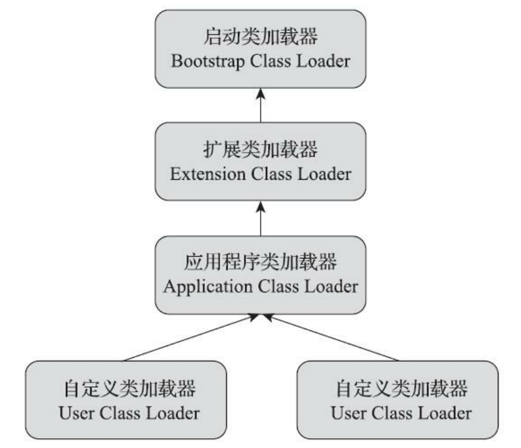

上图各种类加载器之间的层次关系称为类加载器的“双亲委派模型（Parents Delegation Model）。

2）概念

双亲委派模型要求除了顶层的启动类加载器外，其余的类加载器都应有自己的父类加载器。

3）实现方式

通常使用组合（Composition）关系来复用父加载器的代码。

4）流程

如果一个类加载器收到了类加载的请求，它首先把这个请求委派给父类加载器去完成，每层的类加载器都向上委派，因此所有的加载请求最终都应该传送到最顶层的启动类加载器中，只有当父加载器无法完成这个加载请求（它的搜索范围中没有找到所需的类）时，子加载器才会尝试自己去完成加载。

5）好处

- 每个类随着它的类加载器一起具备了一种带有优先级的层次关系；

    > 例如 rt.jar 中的 java.lang.Object 类，无论哪个类加载器要加载这个类，最终都是委派给处于模型最顶端的启动类加载器进行加载，因此 Object 类在程序的各种类加载器环境中都能够保证是同一个类。

- 保证 Java 程序的稳定运行

6）源码

java.lang.ClassLoader 的 loadClass() 方法：

````java
protected Class<?> loadClass(String name, boolean resolve)
        throws ClassNotFoundException{
        synchronized (getClassLoadingLock(name)) {
            // 首先，检查请求的类是否已经被加载过了
            Class<?> c = findLoadedClass(name);
            if (c == null) {
                long t0 = System.nanoTime();
                try {
                    if (parent != null) {
                        c = parent.loadClass(name, false);
                    } else {
                        c = findBootstrapClassOrNull(name);
                    }
                } catch (ClassNotFoundException e) {
                    // 如果父类加载器抛出 ClassNotFoundException
                    // 说明父类加载器无法完成加载请求
                }

                if (c == null) {
                    // 在父类加载器无法加载时
                    // 再调用本身的 findClass 方法来进行类加载
                    long t1 = System.nanoTime();
                    c = findClass(name);

                    // 这是定义类加载器，记录统计数据
                    sun.misc.PerfCounter.getParentDelegationTime().addTime(t1 - t0);
                    sun.misc.PerfCounter.getFindClassTime().addElapsedTimeFrom(t1);
                    sun.misc.PerfCounter.getFindClasses().increment();
                }
            }
            if (resolve) {
                resolveClass(c);
            }
            return c;
        }
    }
````

先检查请求加载的类型是否已经被加载过，若没有则调用父加载器的 loadClass() 方法，若父加载器为空则默认使用启动类加载器作为父加载器。假如父类加载器加载失败，抛出 ClassNotFoundException 异常的话，才调用自己的 findClass() 方法尝试进行加载。 

#### 4.4.3 打破双亲委派模型

**1. JDK**

JDK 中有三次打破双亲委派模型：

- JDK 1.2 引入双亲委派模型
- 双亲委派模型自身缺陷 
- 用户追求程序动态性

1）JDK 1.2 引入双亲委派模型

JDK 1.2 时才引入双亲委派模型，为了兼容之前已存在的 `java.lang.ClassLoader`，JDK 1.2 引入了protected 修饰的 `findClass()` 方法。

> 用户的类加载逻辑需要重载这个 `findClass()` 方法。

2）双亲委派模型自身缺陷

因为双亲委派模型是越基础的类由越上层的加载器进行加载，而在基础类型回调用户代码，这种逆向使用类加载器的场景，就需要打破这个规则，如 JNDI、JDBC、JCE、JAXB 和 JBI 等。

如 JNDI 引入了不优雅的线程上下文类加载器 （Thread Context ClassLoader），通过它

> 这个类加载器可以通过  `java.lang.Thread` 类的 `setContext-ClassLoader()` 方法进行设置，如果创建线程时还未设置，它将会从父线程中继承一个，如果在应用程序的全局范围内都没有设置过，那这个类加载器默认就是应用程序类加载器。

JDK 1.6 提供了 `java.util.ServiceLoader` 类，以 META-INF/services 中的配置信息，辅以责任链模式，

3）用户追求程序动态性

程序动态性指代码热替换（Hot Swap）、模块热部署（Hot Deployment）等。

通过 OSGi 实现模块化热部署，原理如下：

OSGi 自定义了类加载器机制的实现，每一个程序模块（OSGi 中称为 Bundle）都有一个自己的类加载器，当需要更换一个 Bundle 时，就把 Bundle 连同类加载器一起换掉以实现代码的热替换。在 OSGi 环境下，类加载器不再是双亲委派模型推荐的树状结构，而是更加复杂的网状结构，当收到类加载请求时，OSGi 将按照下面的顺序进行类搜索：

①将以 `java.*` 开头的类，委派给父类加载器加载;

②否则，将委派列表名单内的类，委派给父类加载器加载；

③否则，将 Import 列表中的类，委派给 Export 这个类的 Bundle 的类加载器加载；

④否则，查找当前 Bundle 的 ClassPath，使用自己的类加载器加载；

⑤否则，查找类是否在自己的 Fragment Bundle 中，如果在，则委派给 Fragment Bundle 的类加载器 

加载；

⑥否则，查找 Dynamic Import 列表的 Bundle，委派给对应 Bundle 的类加载器加载；

⑦否则，类查找失败。

> 以上 OSGi 的查找顺序中只有①②两点符合双亲委派模型的原则，其余的类查找都是在平级的类加载器中进行的。

**2.  Tomcat**