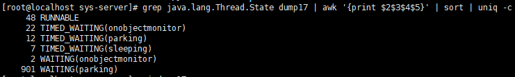
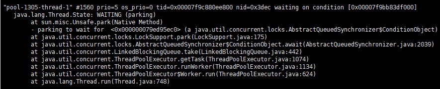
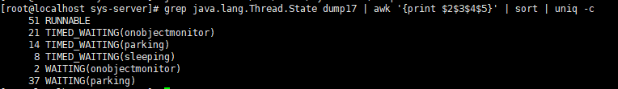
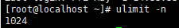
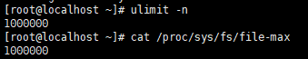

# 生产环境性能调优过程

## 1 优化资源占用

### 1.1 减少线程上下文切换

（1）查看jar包进程号

````shell
jps -l
````

（2）jstack命令dump线程信息到指定文件夹

````shell
jstack 11882 > /usr/local/ichat-server/dump1
````

（3）统计项目所有线程分别处于什么状态

````shell
grep java.lang.Thread.State dump1 | awk '{print $2$3$4$5}' | sort | uniq -c
````



（4）打开dump1文件查看处于WAITING(parking)的大量线程在await，说明线程池接收任务太少，大量线程都闲着不干活。



（5）优化了部分线程池代码，重新打包运行项目，再次dump线程信息，再次统计WAITING(parking)的线程，发现减少了800余个。



## 2 修改系统限制

### 2.1 单机百万连接调优

（1） 查看系统局部（用户进程）文件句柄限制数量

````shell
ulimit -n
````

> centos7 默认限制为1024



（2）编辑系统配置文件 `limits.conf`，修改系统局部文件句柄限制上限

````shell
vim /etc/security/limits.conf
# 或
vi /etc/security/limits.conf
````

（3）添加新的限制代码，然后保存并退出

````shell
# 添加如下代码到文件底部最后一行前
* hard nofile 1000000
* soft nofile 1000000
````

- \* 表示所有用户
- hard 表示真正的线程
- nofile 表示最大可打开文件数


（4）查看系统全局（系统进程）文件句柄限制数量

````shell
cat /proc/sys/fs/file-max
````


> 281514表示系统全局文件句柄限制数量为28万余个。

（5）编辑系统配置文件 `sysctl.conf`，修改系统全局（系统进程）文件句柄限制上限

````shell
vim /etc/sysctl.conf
# 或
vi /etc/sysctl.conf
````

（6）添加新的限制代码，然后保存并退出

```shell
# 添加如下代码到文件底部最后一行
fs.file-max=1000000
```

（7）执行命令，使配置生效

````shell
sysctl -p
````

（8）重启服务器

````shell
reboot
````

（9）查看系统局部（用户进程）文件句柄限制数量和系统全局（系统进程）文件句柄限制数量



