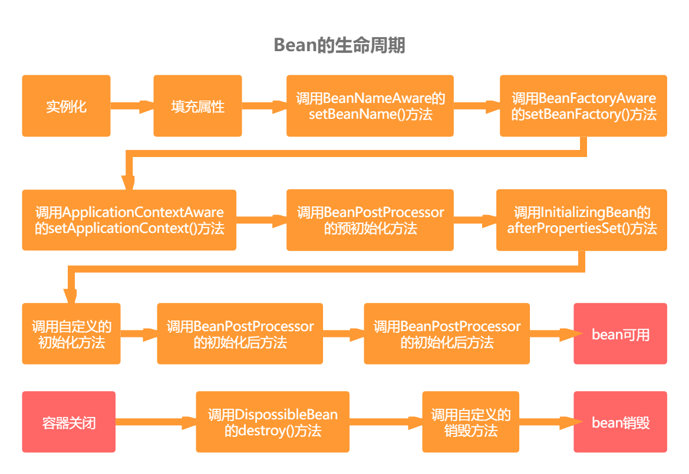
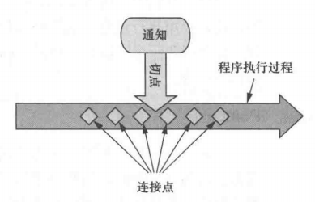

# Spring实战笔记

## 1 Spring核心

Spring的核心是Spring容器。

### 1.1 简化Java开发

Spring目标：简化 Java 开发，具体体现在：

- 基于 POJO 的轻量级和最小侵入性编程
- 通过依赖注入和面向接口实现松耦合
- 基于切面和惯例进行声明式编程
- 通过切面和模板减少样式代码

### 1.2 bean

**1. 注解**

- `@ComponentScan` ：启用组件扫描
  - 不指定包路径默认扫描当前类所在的包及其所有子包路径（Spring 默认不开启）
  - `(basePackages = "")` ：指定基础包
  - `(basePackageClasses = "")` 指定基础类或接口所在的包
- `@Component` ：声明为 Spring 组件
  - 不指定 bean 的 ID 则默认使用类名首字母小写的名称作为 ID

- `@Named` ：为 bean 设置 ID（可替换 `@Component` ）
- `@Autowired` ：启用自动装配
- `@Inject` ：启用自动装配（可替换 `@Autowired` ）
- `@Bean` ：返回一个注册为 Spring 应用上下文的 bean 对象

**2. bean的生命周期**



①Spring 对 bean 进行实例化；

②Spring 将值和 bean 的引用注入到 bean 对应的属性中

③如果 bean 实现了 BeanNameAware 接口，Spring 将 bean 的 ID 传递给 setBeanName() 方法

④如果 bean 实现了 BeanFactoryAware 接口，Spring 将调用 setBeanFactory() 方法，将 BeanFactory 容器实例传入

⑤如果 bean 实现了 ApplicationContextAware 接口，Spring 将调用 setApplicationContext() 方法，将 bean 所在的应用上下文引用传进来

⑥如果 bean 实现了 BeanPostProcessor 接口，Spring 将调用它们的 postProcessBeforeInitialization() 方法

⑦如果 bean 实现了 InitializingBean 接口，Spring 将调用它们的 afterPropertiesSet() 方法；同样，如果 bean 使用了 init-method 方法初始化方法，该方法也会被调用

⑧如果 bean 实现了 BeanPostProcessor 接口，Spring 将调用它们的 postProcessAfterInitialization() 方法

⑨此时 bean 可被使用，并一直驻留在应用上下文中，直到改应用上下文被销毁

⑩如果 bean 实现了 DisposableBean 接口，Spring 将调用它的destroy() 接口方法；同样，若 bean 使用 destroy-method 声明了销毁方法，该方法也会被调用

### 1.3 控制反转 IOC

**1. 概念**

将对象的控制权交给 Spring 管理。

**2. 实现方式**

依赖注入（DI，即Dependence Injection），有三种注入方式：

- 构造器注入
- setter 注入
- 接口注入

**3. 初始化流程**

①定位XML 或 Bean的注解；

②读取 Resource；

③获取 BeanDefinition；

④注册 Bean。

### 1.4 应用上下文

**Spring 常见的应用上下文**

- AnnotationConfigApplicationContext：从一个或多个基于 Java 的配置类中加载 Spring 应用上下文
- AnnotationConfigWebApplicationContext：从一个或多个基于 Java 的配置类中加载 Spring Web 应用上下文
- ClassPathXmlApplicationContext：从类路径下的一个或多个 XML 配置文件中加载上下文定义，把应用上下文的定义文件作为类资源
- FileSystemXmlApplicationContext：从文件系统下的一个或多个 XML 配置文件中加载上下文定义
- XmlWebApplicationContext：从 Web 应用下的一个或多个 XML 配置文件中加载上下文定义

### 1.5 Spring模块


- Spring 核心容器：Bean、core、context 和 spEL
- Spring 面向切面模块：AOP、Aspects
- 数据访问与集成：JDBC、ORM、OXM、JMS 和 Transactions
- Web 与远程调用：Websocket、Servlet、Web 和 Portlet
- Instrumentation 模块：Instrumentation 和 Messaging
- 测试模块：Test

## 2 装配 bean

### 2.1 Spring 配置 bean

Spring 提供了三种主要的 Bean 的装配机制：

- 隐式的 bean 发现机制和自动装配
- 在 Java 中显示配置
- 在 XML 中显示配置

### 2.2 自动化装配 bean

**1. Spring 实现自动化装配的两种方式**

- 组件扫描（component scanning）：Spring 会自动发现应用上下文中所创建的 bean 组件
- 自动装配（autowiring）：Spring 自动满足 bean 之间的依赖

**2. 流程**

①创建可发现的 bean

> 如在类上使用 `@Component` 注解。

②为组件扫描的 bean 命名

> 如在  `@Component("XXX")` 注解上增加 bean 的 ID；
>
> 如在类上用   `@Named("XXX")` 替换  `@Component` 注解。

③设置组件扫描的基础包

> 如在同包或父包下的主类上开启 `@ComponentScan` 注解扫描
>
> - 无参默认扫描本包及其子包；
> - `@ComponentScan(basePackages = "xxx", "yyy")` 扫描指定多个包；
> - `@ComponentScan(basePackageClasses = "xxx.class", "yyy.class")` 扫描指定多个类。

④通过为 bean 添加注解实现自动装配

> 如 `@Autowired` 注解修饰构造方法或 setter 方法。

### 2.3 Java 代码装配 bean

**1. 流程**

①创建配置类

> 如创建一个 JavaConfig 类，并为其添加 `@Configuration` 注解

②声明简单的 bean

> 创建返回实例的方法，并为其添加 `@Bean` 注解

③借助 JavaConfig 实现注入

**2. 适用场景**

将第三方库中的组件装配为 bean。

### 2.4 XML 装配 bean

**流程**

①创建 XML 配置规范

> 创建一个以 `<beans>` 元素为根的 XML 文件

②声明一个 `<bean>`

③借助构造器注入初始化 bean

> 两种方式：一是 `<constructor-arg>` 元素；二是使用 Spring 3.0 引入的 c-命名空间。

④设置属性

> 两种方式：一是使用 `<property>` 元素；二是使用 p-命名空间。

### 2.5 导入和混合配置

**1. bean 的导入**

bean 的导入有两种方式：

- 对于 JavaConfig 装配的 bean，可通过 `@Import(xxx.class)` 注解导入到另一个类中
- 对于 XML 装配的 bean，可通过 `@ImportResource("classpath:xxx.xml")` 注解导入到另一个类中

**2. 在 XML 中配置 JavaConfig**

在一个新的 XML 文件中同时引用 XML 和 JavaConfig，用 `<bean>` 元素声明 JavaConfig。

> 使用 `<import>` 元素只能导入其他 XML 配置文件。

## 3 高级装配

### 3.1 环境与 profile

#### 3.1.1 配置 profile bean

在类或方法上使用 `<@Profile("")>` 元素。

- dev 开发环境
- prod 生产环境
- test 测试环境

> 如`<@Profile("dev ")>` ，表示只在 dev profile 激活时才会创建对应的 bean。 

#### 3.1.2 激活 profile

**1. 激活配置项**

通过设置 spring.profiles.active 和 spring.profiles.default 这两个属性来确定激活的 profile。

- spring.profiles.active 表示激活的 profile
- spring.profiles.default 表示没有声明激活 profile 时的 profile 默认激活值

**2. 配置方式**

- 作为 DispatcherServlet 的初始化参数
- 作为 Web 应用的上下文参数
- 作为 JNDI 条目
- 作为环境变量
- 作为 JVM 的系统属性
- 在集成测试类上，使用 `@ActiveProfiles` 注解设置

### 3.2 条件化的 bean

**1. 配置流程**

①在需要配置的条件化 bean 类或方法上使用 `@Conditional` 注解，给定一个入参类

> 如  `@Conditional(xxx.class)` 

②此入参类需要实现 Condition 接口，并重写 `mathes(ConditionContext ctx, AnnotatedTypeMetadata metadata)` 方法

> `mathes(ConditionContext ctx, AnnotatedTypeMetadata metadata)` 方法返回 true 表示创建 bean；false 则表示不创建。

**2. ConditionContext 作用**

- 根据 getRegistry() 返回的 BeanDefinitionRegistry 检查 bean 定义
- 根据  getBeanFactory() 返回的 ConfigurableListableBeanFactory 检查 bean 是否存在，存在则查看 bean 的属性
- 根据 getEnvironment() 返回的 Environment 检查环境变量是否存在以及它的值是什么
- 读取并检查 getResourceLoader() 返回的 ResourceLoader 所加载的资源
- 根据 getClassLoader() 返回的 ClassLoader 加载并检查类是否存在

**3. AnnotatedTypeMetadata 作用**

检查带有 `@Bean` 注解的方法上还有其他的什么注解。

### 3.3 处理自动装配的歧义性

**1. 标识首选的 bean**

`@Primary` 修饰 bean，表示此 bean 作为多个相同 bean 的首选。

**2. 限定自动装配的 bean**

`@Qualifier` 修饰需要注入的 bean，表示限定为指定的唯一 bean（如 `@Qualifier("xxx")` ）。

**3. 使用自定义的限定符注解**

创建自定义的限定符注解，如命名为 `@Diy`

````java
@Target({ElementType.FIELD, ElementType.METHOD, ElementType.CONSTRUCTOR, ElementType.TYPE})
@Retention(RetentionPolicy.RUNTIME)
@Inherited
@Documented
@Qualifier
public @interface Diy {
    String value() default "";
}
````

> Java 8 允许出现重复的注解，只要注解本身带有 `@Repeatable` 注解即可。（但是 Spring 的 `@Qualifier` 注解并没有在定义时添加 `@Repeatable` 注解）

### 3.4 bean 的作用域

**1. 类型**

Spring 中 bean 的五种作用域：

- 单例（Singleton）：整个应用中，之创建一个 bean 的实例
- 原型（Prototype）：每次注入或者通过 Spring 应用上下文获取的时候，都会创建一个新的 bean 实例
- 会话（Session）：Web 应用中，为每个会话创建一个 bean 实例
- 请求（Request）：Web 应用中，为每个请求创建一个 bean 实例

bean 的作用域默认为单例模式。

> 无状态的 bean 是线程安全的。

**2. 声明方式**

使用 `@Scope` 声明指定所需用的作用域。

如指定原型模式：

````java
@Scope(ConfigurableBeanFactory.SCOPE_PROTOTYPE)
````

### 3.4 运行时值注入

Spring 提供了两种运行时求值的方式：

- 属性占位符（Property placeholder）
- Spring 表达式语言（SpEL）

#### 3.4.1 使用属性占位符

**1.使用方式**

使用 `@PropertySource` 注解对指定 bean 注入外部的值，然后通过 Spring 的 Environment 对象来获取指定属性值。

**2. Environment**

Spring 的 Environment 对象获取属性值的四种方法：

- `String getProperty(String key)` 根据属性返回对应属性值
- `String getProperty(String key, String defaultValue)` 根据属性返回对应属性值，若属性不存在则返回设置的默认值
- `T getProperty(String key, Class<T> type)` 根据属性返回对应属性对象
- `T getProperty(String key, Class<T> type, T defaultValue)` 据属性返回对应属性对象，若属性不存在则返回设置的默认对象

Spring 的 Environment 对象检查 profile 是否激活的三种方法：

- `String[] getActiveProfiles()` 返回激活 profile 名称的数组
- `String[] getDefaultProfiles()` 返回默认 profile 名称的数组
- `boolean accepetsProfiles()` 如果  Environment 支持给定 profile，则返回 true

**3. 解析属性占位符**

Spring 装配中，占位符使用 `${...}` 包装属性名称。

若通过组件扫描和自动装配来创建和初始化应用时，使用 `@Value` 注解来配置属性。

> 使用属性占位符前，需要配置一个 PropertyPlaceHolderConfigurer 的 bean 或 PropertySourcesPlaceHolderConfigurer 的 bean（推荐用这个，因为它能够基于 Spring 的 Environment 及其属性来源解析占位符）。

#### 3.4.2 使用 SpEL

**1. 特性**

SpEL的特性：

- 使用 bean 的 ID 来引用 bean
- 调用方法和访问对象的属性
- 对值进行算术、关系和逻辑运算
- 正则表达式匹配
- 集合操作

**2. 样例**

- #{T(System).currentTimeMillis()} 表示当前时间毫秒数
- #{xxx.yyy} 表示 ID 为 xxx 的 bean 的 yyy 属性
- #{systemProperties{ 'xxx.yyy' }} 表示通过 systemProperties 对象引用系统属性

**3. 作用**

- 表示字面值（如 #{3.14) 表示浮点值）
- 引用 bean 、属性和方法（如 #{xxx.yyy}）
- 在表达式中使用类型运算符 T() 调用指定类的方法（如 #{T(System).currentTimeMillis()} ）

**4.  SpEL 运算符**

| 运算符类型 | 运算符                               |
| ---------- | ------------------------------------ |
| 算术运算符 | +、-、*、/、%、^                     |
| 比较运算符 | <、>、==、<=、>=、lt、gt、eq、le、ge |
| 逻辑运算符 | and、or、not、\|                     |
| 条件运算符 | ?: (ternary)、?: (Elvis)             |
| 正则表达式 | mathes                               |

## 4 面向切面编程

### 4.1 AOP 基本概念

- 通知（advice）
- 切点（pointcut）
- 连接点（joinpoint）

它们三个的关系如图：



在一个或多个连接点上，可以把切面的功能（通知）织入到程序的执行过程中。

#### 4.1.1 通知 Advice

**1. 概念**

通知（Advice）定义了切面何时使用，包含需要用于多个应用对象的横切行为。

**2. 分类**

通知 Advice 分为五个类型（对应的 AspectJ 注解）：

- 前置通知（@Before）：在目标方法被调用之前调用通知功能
- 后置通知（@After）：在目标方法完成之后或抛出异常后调用通知，此时不会关心方法的输出是什么
- 返回通知（@AfterReturning）：在目标方法成功执行之后调用通知
- 异常通知（@AfterThrowing）：在目标方法抛出异常后调用通知
- 环绕通知（@Around）：通知包裹了被通知的方法，在被通知的方法调用之前和调用之后执行自定义的行为

#### 4.1.2 连接点 Join point

连接点是在应用执行过程中能够插入切面（应用通知）的所有点。

> 连接点可以是调用方法时、抛出异常时、修改字段时等等。

#### 4.1.3 切点 Pointcut

**1. 概念**

切点定义了通知被应用的具体位置（连接点）。

**2. 使用方式**

在需要声明为切点的方法上开启 `@Pointcut` 注解即可。

#### 4.1.4 切面 Aspect

**1. 概念**

切面是通知和切点的结合。

**2. 使用方式**

①在需要声明为切面的类上开启 `@Aspect` 注解；

②在声明切面类为 bean 的配置类上开启 `@EnableAspectJAutoProxy` 注解，启用自动代理功能。

#### 4.1.5 引入 Introduction

引入允许向现有的类添加新方法或属性。

#### 4.1.6 织入 Weaving

**1. 概念**

织入是把切面应用到目标对象并创建新的代理对象的过程。

**2. 织入点**

- 编译期：切面在目标类编译时被织入。（如 AspectJ）
- 类加载期：切面在目标类加载到 JVM 时被织入（如 ClassLoader、ApspectJ 5 的加载时织入）
- 运行期：切面在应用运行的某个时刻被织入（如 AOP）

### 4.2 AOP 支持

Sping 提供了4种类型的 AOP 支持：

- 基于代理的经典 Spring AOP
- 纯 POJO 切面
- `@AspectJ` 注解驱动的切面
- 注入式 AspectJ 切面（适用于 Spring 各版本）

#### 4.1.1 Spring 通知的 AOP 实现

**1. Spring 运行时通知对象流程**

①Spring 在运行期把切面织入到 Spring 管理的 bean 中；

②因为目标类被代理类封装，调用目标 bean 方法前，会执行切面逻辑。

> Spring 代理对象是懒加载模式，用到才会加载。
>
> 如果使用 ApplicationContext 时，在 ApplicationContext 从 BeanFactory 中加载 所有 bean 时，Spring 才会创建被代理的对象。

**2. 适用场景**

Spring 只支持方法级别的连接点，因为 Spring 基于动态代理。

> AspectJ 和 JBoss 支持字段和构造器级别的连接点。

#### 4.1.2 AOP 对 AspectJ 的支持

Spring AOP 对 AspectJ 支持的切点指示器如下表。

| AspectJ 指示器 | 描述                                                         |
| -------------- | ------------------------------------------------------------ |
| arg()          | 限制连接点匹配参数为指定类型的执行方法                       |
| @args()        | 限制连接点匹配参数由指定注解标注的执行方法                   |
| execution()    | 用于匹配是连接点的执行方法                                   |
| this()         | 限制连接点匹配 AOP 代理的 bean 引用为指定类型的类            |
| target         | 限制连接点匹配目标对象为指定类型的类                         |
| @target()      | 限制连接点匹配特定的执行对象，这些对象对应的类要具有指定类型的注解 |
| within()       | 限制连接点匹配指定的类型                                     |
| @within()      | 限制连接点匹配指定注解所标注的类型（当使用 Spring AOP 时，方法定义在由指定注解所标注的类里） |
| @annotation    | 限定匹配带有指定注解的连接点                                 |

- 只有 execution 指示器是实际执行匹配的
- 其他指示器都是限制匹配的

#### 4.1.3 AOP 为对象增加方法

AOP 不仅可以对方法增加新的功能，还能对一个对象增加新的方法。

**1. 使用方式**

通过 `@DeclareParents` 注解修饰需要新增方法的 bean。

注解由三部分组成：

- value：指定哪种类型的 bean 引入该接口
- defaultImpl：指定了为引入功能提供实现的类
- @DeclareParents：标注的静态属性知名了要引入的接口

**2. 局限性**

只能为有源码的通知类添加注解。

**3. 无源码的解决方案**

在 XML 中声明切面，XML 中的 AOP 配置元素如下表。

| AOP 配置元素             | 用途                                                         |
| ------------------------ | ------------------------------------------------------------ |
| \<aop:advisor>           | 定义 AOP 通知器                                              |
| \<aop:after>             | 定义 AOP 后置通知（不管被通知的方法是否执行成功）            |
| \<aop:after-returning>   | 定义 AOP 返回通知                                            |
| \<aop:after-throwing>    | 定义 AOP 异常通知                                            |
| \<aop:around>            | 定义 AOP 环绕通知                                            |
| \<aop:aspect>            | 定义一个切面                                                 |
| \<aop:aspectj-autoproxy> | 启用 @AspectJ 注解驱动的切面                                 |
| \<aop:before>            | 定义一个 AOP 前置通知                                        |
| \<aop:config>            | 顶层的 AOP 配置元素，大多数 \<aop:*>元素必须包含在\<aop:config>元素内 |
| \<aop:declare-parents>   | 以透明的方式为被通知的对象引入额外的接口                     |
| \<aop:pointcut>          | 定义一个切点                                                 |

## 5 SpringMVC

### 5.1 SpringMVC组件

- DispatcherServlet：负责将请求路由到其他组件中；
- 处理器映射（Handler mapping）：根据请求路由寻找对应的处理器；
- 控制器（Controller）：执行业务逻辑，并返回结果；
- 视图解析器（View resolver）：将逻辑视图名匹配对应的视图实现；
- 模型（model）：控制器完成处理逻辑后返回给用户并在浏览器展示的的信息；
- 视图（view）：友好的界面展示代码，通常是 HTML、JSP 等。

### 5.2 SpringMVC流程


①用户请求先通过前端控制器 DispatcherServlet；

②DispatcherServlet 查询一个或多个处理器映射（Handler mapping），处理器映射根据 URL 信息选择对应的控制器信息返回给 DispatcherServlet；

③DispatcherServlet 将请求发给选中的控制器，控制器拿到请求数据，交给 Service 层去执行业务逻辑；

④控制器将处理完返回的模型和逻辑视图名发送到 DispatcherServlet；

⑤DispatcherServlet 使用视图解析器（View resolver）将逻辑视图名匹配对应的视图实现；

⑥渲染视图；

⑦返回响应到用户。