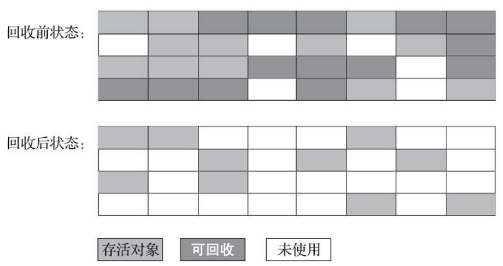
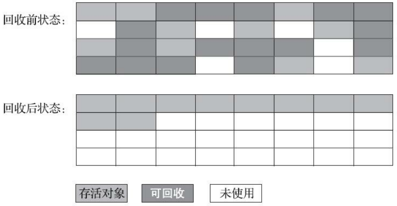

# 深入理解JVM学习笔记

## 1 内存管理

### 1.1 运行时数据区域

#### 1.1.1 程序计数器

**1. 概念**

程序计数器（Program Counter Register），是当前线程所执行的字节码的**行号指示器**。

> 线程私有的内存。

**2. 作用**

它是程序控制流的指示器，作用于以下基础功能：

- 分支
- 循环
- 跳转
- 异常处理
- 线程恢复

**3. 实现细节**

- 线程执行的是 Java 方法时，记录正在执行的虚拟机字节码指令的地址
- 线程执行本地（Native）方法时，计数器值为空（Undefined）

**4. 异常**

程序计数器是**唯一**一个在《Java虚拟机规范》中**没有**规定任何 **OutOfMemory Error** 情况的区域。

#### 1.1.2 Java虚拟机栈

**1. 概念**

Java 虚拟机栈（Java Virtual Machine Stack），是 Java 方法执行的线程内存模型。

> 线程私有的内存，生命周期与线程相同。

**2. 作用**

为 Java 方法（字节码）服务。

每个 Java 方法被执行时，Java 虚拟机栈会同步创建一个栈帧（Stack Frame），用于存储：

- 局部变量表
- 操作数栈
- 动态连接
- 方法出口

> 每个方法被调用至执行完毕的过程，对应一个栈帧在虚拟机中从入栈到出栈的过程。

**3. 异常**

- 抛出 StackOverflow Error 异常：线程请求的栈深度大于虚拟机允许的深度时。
- 抛出 OutOfMemory Error 异常：若 Java 虚拟机栈容量允许动态扩展，栈扩展无法申请到足够内存时。

> HotSpot 虚拟机的栈容量不允许动态扩展，所以它不会由于虚拟机无法扩展而导致 OutOfMemory Error 异常，但是线程申请空间失败会出现 OOM 异常。

##### 局部变量表

1）编译期的存放类型：

- Java 基本数据类型（boolean、byte、char、short、int、float、long、double）
- 对象引用（reference 类型，即【指向对象起始地址的引用指针】或【指向一个代表对象的句柄或与此对象相关的位置】）
- returnAddress 类型（指向字节码指令的地址）

2）编译期的存放方式：

以局部变量槽（Slot）表示

- 占用两个变量槽：long 和 double
- 占用一个变量槽：其余基本类型

> 局部变量表所需的内存空间在编译期间分配完成，确定局部变量槽的数量，方法运行期间不会改变大小。

#### 1.1.3 本地方法栈

**1. 作用**

本地方法栈（Java Virtual Machine Stack），为本地（Native）方法服务。

>  线程私有的内存。

**2. 异常**

- 抛出 StackOverflow Error 异常：栈深度溢出时
- 抛出 OutOfMemory Error 异常：栈扩展失败时

#### 1.1.4 Java堆

**1. 概念**

Java 堆（Java Heap）虚拟机管理的内存中最大的一块，也叫做 GC 堆。

> 线程共享的区域，虚拟机启动时创建。

**2. 作用**

存放对象实例。

- 回收内存：分代回收（新生代、老年代、永久代、Eden 空间、 From Survivor 空间、To Survivor 空间）
- 分配内存：堆中划分多个线程私有的分配缓冲区（Thread Local Allocation Buffer，TLAB）来提升对象分配时的效率

> Java 堆可在物理内存空间上不连续，但是逻辑上是连续的。

**3. 异常**

抛出 OutOfMemory Error 异常：Java 堆没有内存分配实例，且堆也无法再次扩展时。

> Java 堆默认固定大小，但是可以通过参数 `-Xmx` 和 `-Xms` 扩展其大小。

#### 1.1.5 方法区

**1. 概念**

方法区（Method Area），堆的一个逻辑部分。

> 线程共享的区域。它也叫做“非堆”（Non-Heap），目的是与 Java 堆区分。

**2. 作用**

方法区（Method Area）存储虚拟机加载的数据：

- 类型信息
- 常量
- 静态变量
- 即时编译器编译后的代码缓存

**3. 实现方式**

使用永久代来实现方法区。

- 目的：省去了专门为方法区编写内存管理代码的工作，复用 HotSpot 的垃圾收集器管理方法区。
- 缺陷：永久代有 `-XX: MaxPermSize` 上限，默认固定大小，容易导致 Java 程序的内存溢出问题（极少数方法（如 `String::intern()` ）在不同虚拟机下有不同的表现）。

HotSpot虚拟机：

- JDK6 中放弃了永久代，逐步改为本地内存（Native Memory）实现方法区
- JDK7 移除永久代中的字符串常量池和静态变量
- JDK8 完全放弃永久代，本地内存中实现元空间（Metaspace）来代替

BEA JRockit、IBM J9 等其他虚拟机：

- 没有用永久代实现方法区，所以只要不触碰到物理可用内存上限就不会出现 OOM

> 方法区并不等价于“永久代”。

**4. 内存回收**

内存回收主要针对

- 常量池的回收
- 对类型的卸载

> 方法区与 Java 堆一样可在物理内存空间上不连续，但是逻辑上是连续的，甚至可以不实现垃圾收集。
>
> 方法区的回收条件苛刻，回收效果不理想，但有时必须回收。

**5. 异常**

抛出 OutOfMemory Error 异常：方法区无法满足新内存的分配时。

##### 运行时常量池

1）概念

运行时常量池（Runtime Constant Pool），方法区的一部分。

> 编译后的Class文件包含
>
> - 类的版本
> - 字段
> - 方法
> - 接口描述
> - 常量池表（Constant Pool Table）

常量池表用于存放编译期生成的各种

- 字面量
- 符号引用

2）作用

在类加载后存放

- 常量池表
- 符号引用翻译出来的直接引用

3）动态性

在运行期间也能将新的常量放入池中（如 String 类的 `intern()` 方法）。

4）异常

抛出 OutOfMemory Error 异常：受到方法区的限制，常量池无法申请到内存时。

#### 1.1.6 直接内存

**1. 概念**

直接内存（Direct Memory）既不是虚拟机运行时数据区的部分，也不是《Java 虚拟机规范》中定义的内存区域。

**2. 作用**

JDK 1.4的 NIO 类，通过基于通道（Channel）与缓冲区（Buffer）的 I/O 方式使用 Native 函数库直接分配堆外内存，然后通过一个存储在 Java 堆里的 DirectByteBuffer 对象作为这块内存的引用进行操作。

> 此操作能在部分场景中显著提高性能（避免了在 Java 堆 和 Native 堆中来回复制数据）。

**3. 异常**

抛出 OutOfMemory Error 异常：设置的 `-Xmx` 参数信息与各个内存区域总和大于物理内存限制（包括物理和操作系统级的限制），导致动态扩展失败时。

### 1.2 HotSpot虚拟机对象

#### 1.2.1 对象的创建

**1. 创建过程**

Java 虚拟机遇到字节码new指令时：

①检查：先检查指令参数是否能在常量池中定位到一个类的符号引用

- 若有则检查这个符号引用代表的类是否已被加载、解析和初始化过
- 没有则执行类加载过程

②分配：检查通过后为新对象分配内存，类加载完成后完全确定对象所需内存大小

③初始化：Java 虚拟机将分配到的内存空间（不包括对象头）初始化为零值（保证对象的实例字段在 Java 代码中可以不赋初始值即可直接使用）

> 若使用了 TLAB，则此操作提前至使用 TLAB 分配时进行。

④设置：Java 虚拟机对对象头（Object Header）进行必要设置

- 哪个类的实例
- 类的元数据信息寻找方式
- 对象的 Hash 值（实际上对象 Hash 值延后到真正调用 `Object::hashCode()` 时才计算）
- 对象的 GC 分代年龄
- 是否启用偏向锁

⑤构造函数：若字节码 new 指令后跟随 invokespecial指令，则 new 指令执行后立即执行 `<init>()` 方法即构造函数，在 Java 程序层面初始化对象。

> JVM 虚拟机层面：①②③④
>
> Java 程序层面：①②③④⑤

**2. 内存分配**

1）分配方式：

- 指针碰撞（Bump The Point）：Java 堆内存是绝对规整的，被使用过的内存在一边，空闲的内存在另一边，中间则是指针作为分界点的指示器，分配内存时仅需把此指针向空闲内存方向挪动一段与新对象大小相等的距离
- 空闲列表（Free List）：Java 堆内存不规整时，已被使用的内存与空闲内存相互交错，虚拟机维护一个记录可用内存块的列表，分配内存时从列表中划分一块足够大的空间给对象实例，并更新列表上的记录

2）虚拟机的分配实现

- 带空间压缩整理（Compact）能力的收集器 Serial 和 ParNew：采用指针碰撞分配内存（简单高效）。

- 基于清除（Sweep）算法的收集器 CMS：采用空闲列表分配内存（复杂）。

> CMS的实现里，设计了 Linear Allocation Buffer 的分配缓冲区，通过空闲列表拿到一大块分配缓冲区后，在此区域仍然可以使用指针碰撞的方式来分配，提高分配效率。

3）分配时的线程安全性问题解决方式：

- 对分配内存空间的操作进行同步处理，即采用 CAS 配上失败重试机制保证更新的原子性
- 内存分配的操作按线程划分在不同空间处理，即每个线程在 Java 堆中预先分配小块内存，称为本地线程分配缓冲区（TLAB），本地缓冲区用完后分配新的缓存区时再同步锁定

> 设置 `-XX: ±UseTLAB` 参数来设定是否使用 TLAB 。

#### 1.2.2 对象的内存布局

HotSpot 虚拟机里，对象在堆内存中的存储布局划分为三个部分：

- 对象头（Object Header）
- 实例数据（Instance Data）
- 对其填充（Padding）

**1. 对象头**

对象头包含两部分数据：

- 存储对象自身的运行时数据（Mark Word）
  - HashCode
  - GC 分代年龄
  - 锁状态标志
  - 线程持有的锁
  - 偏向线程ID
  - 偏向时间戳
  - 记录数组长度的数据**（对象为 Java 数组时）**
- 类型指针（即对象指向它的类型元数据的指针）

**2. 实例数据**

实例数据存储对象真正的有效信息，即代码中定义的各种类型的字段内容。

1）实例数据的的存储顺序影响因素：

- 虚拟机分配策略参数（`-XX:FieldsAllocationStyle` 参数）
- 字段在 Java 源码中定义的顺序

2）虚拟机默认的分配顺序

longs/doubles -> ints -> shorts/chars -> bytes/booleans -> OOPs（Ordinary Object Pointers）

分配条件（顺序表示优先级）：

- 相同宽度字段分配到一起存放
- 父类定义的变量存放在子类前面
- 子类较窄的变量允许插入父类变量的空隙中（节省少部分空间，前提是 `+XX:CompactFields` 参数值为 true【默认为true】）

**3. 对齐填充**

非必须的数据，仅仅起占位符的作用。

> HotSpot 虚拟机的自动内存管理系统要求对象起始地址必须是8字节的整数倍，若对象实例数据部分没有对齐，则需要通过对齐填充来补全。（对象头已被设计为8字节的数据）

#### 1.2.3 对象的访问定位

对象的访问定位由虚拟机实现，主要有两种访问方式：

- 使用句柄
- 直接指针

**1. 使用句柄**

Java 堆中划分出一块内存作为句柄池，reference 中存储对象的句柄地址，句柄中包含了对象实例数据与类型数据对应的具体内存地址信息。

> 优势：reference 中存储的句柄地址稳定，对象移动时（如常见的垃圾收集时移动对象）只会改变句柄中实例数据指针，无需修改 reference

**2. 直接指针**

Java 堆中的reference 中直接存储对象的内存地址。

> 优势：访问对象本身时速度更快，少了一次的间接访问开销。

HotSpot 虚拟机

- 主要使用直接指针访问对象
- 例外情况下使用句柄访问（使用了 Shenandoah 收集器时会有一次额外的转发）

## 2 垃圾收集器与内存分配策略

Java 堆和方法区的内存分配和回收是动态的，垃圾收集器重点管理此部分内存。

> 程序计数器、虚拟机栈、本地方法栈等区域的内存分配和回收具备确定性，当方法或线程结束时，内存自然跟着回收。

### 2.1 对象回收

#### 2.1.1 引用计数算法

**1. 概念**

对象额外存储一个引用计数器 A，被引用时 A 的值加一，引用失效时 A 的值减一。任意时刻引用计数器为零的对象即为不可使用对象。

**2. 应用案例**

- 微软 COM（Component Object Model）技术
- 使用 ActionScript3 的FlashPlayer
- Python 语言
- 应用于游戏脚本领域的 Squirrel

> 主流的 Java 虚拟机都没有选用引用计数法来管理内存，因为单纯的引用计数法无法解决对象之间相互循环引用的问题。

#### 2.1.2 可达性分析算法

**1. 概念**

可达性分析算法（Reachability Analysis），就是通过一系列“GC Roots”的根对象作为起始节点集，根据引用关系向下搜索，若某个对象到 GC Roots 间没有任何引用链相连，即从 GC Roots 到这个对象不可达，证明此对象不可再被使用。

> 引用链（Reference Chain）：搜索过程锁走过的路径。

实例：

如下图，对象 object 5、object 6、object 7 虽然互有关联，但是它们到GC Roots是不可达的，因此它们将会被判定为可回收的对象。

**2. 组成**

Java 技术体系中，固定可作为 GC Roots 的对象：

- Java 虚拟机栈中引用的对象（栈帧中的局部变量表），如线程被调用的方法堆栈中使用到的参数、局部变量、临时变量等
- 方法区中类静态属性引用的对象，如 Java 类的引用类型静态变量
- 方法区中常量引用的对象，如字符串常量池（String Table）的引用
- 本地方法栈中 JNI 引用的对象
- Java 虚拟机内部的引用，如基本类型的包装类对象，常驻的异常对象（如 NullPointException、OutOfMemory Error），系统类加载器
- 所有被同步锁（synchronized关键字）持有的对象
- 反应 Java 虚拟机内部情况的JMXBean、JVMTI中注册的回调、本地代码缓存
- 其他临时性的对象，如关联区域的对象

#### 2.1.3 引用

四种引用强度依次减弱

- 强引用（Strongly Reference）
- 软引用（Soft Reference）
- 弱引用（Weak Reference）
- 虚引用（Phantom Reference）

**1. 强引用**

实现：new 关键字对应的引用赋值。

回收条件：只要强引用关系存在，垃圾收集器就不会回收被引用的对象。

**2. 软引用**

定义：描述有用但非必须的对象。

实现：`SoftReference` 类实现

回收条件：系统发生内存溢出异常前，会把软引用对象列进回收范围中进行第二次回收。（若这次回收依然内存不足则抛出内存溢出异常）

**3. 弱引用**

定义：描述但非必须的对象。

实现：`WeakReference` 类实现

回收条件：下一次垃圾收集发生时被回收。

**4. 虚引用**

定义：对象的虚引用完全不会影响其生存时间，又称为幽灵引用或幻影引用。（无法通过虚引用获取对象实例）

实现：`PhantomReference` 类实现

目的：在此对象被收集器回收时收到一个系统通知。

#### 2.1.4 对象彻底回收

对象被彻底回收的需要经过两次标记过程：

①可达性分析后发现没有与 GC Roots 相连的引用链，则被第一次标记，随后进行一次筛选。

> 筛选此对象是否有必要执行 `finalize()`，对象没有覆盖  `finalize()` 方法，或者者 `finalize()` 方法已被虚拟机调用过，则没有必要执行。

②有必要执行 `finalize()` 时，会将对象放在 F-Queue 队列中，由一条虚拟机自动建立的低调度优先级的 Finalizer 线程去 “执行” 它们的 `finalize()` 方法，稍后被第二次标记，随后彻底回收。

> 此处的执行只是触发方法开始运行，但不保证等待它运行结束。（因为若对象的 `finalize()` 方法执行缓慢甚至发生死循环时，将导致 F-Queue 队列的其他对象处于永久等待，进而导致整个内存回收子系统崩溃）

※注意：`finalize()` 方法（官方不推荐使用）的效果尽量用 try-finally 或其他方式代替。

#### 2.1.5 回收方法区

**1. 特性**

方法区垃圾回收

- 效率较低
- 回收条件苛刻

> 《Java虚 拟机规范》中可以不要求虚拟机在方法区中实现垃圾收集，如：JDK 11 的 ZGC 收集器不支持类卸载。

**2. 回收内容**

- 废弃的常量
- 不再使用的类型

1）废弃的常量的回收条件

- 没有任何对象引用此常量
- 虚拟机没有其他地方引用此常量
- 此时发生内存回收，且垃圾收集器判断有必要将其回收

2）不再使用的类型的**允许**回收条件

- 该类所有的实例已被回收（即 Java 堆中不存在该类机器任何派生子类的实例）
- 加载该类的类加载器已被回收（如 OSGi、JSP的重加载等）
- 该类对应的 java.lang.Class 对象没有被任何地方引用，且任何地方都无法通过反射访问该类的方法

> 允许回收条件：表示没有引用了不一定会回收。

**3. 操作命令**

HotSpot 虚拟机的 Xnoclassgc 参数控制是否要对类型进行回收。

查看类加载和卸载信息：

- Product 版虚拟机：`verbose: class` `-XX:+TraceClassLoading`
- FastDebug 版虚拟机：`-XX:+TraceClassUnLoading`

### 2.2 追踪式垃圾收集算法

垃圾收集算法分为两类

- 引用计数式垃圾收集（Reference Counting GC）
- 追踪式垃圾收集（Tracing GC）

> 引用计数式垃圾收集又称为直接垃圾收集。（主流 Java 虚拟机均未涉及）
>
> 追踪式垃圾收集又称为间接垃圾收集。

#### 2.2.1 分代收集理论

**1. 背景**

分代收集理论建立在三个分代假说之上：

- 弱分代假说（Weak Generational Hypothesis）：绝大多数对象都是朝生夕灭的
- 强分代假说（Strong Generational Hypothesis）：熬过越多次垃圾收集过程的对象就越难以消灭
- 跨代引用假说（Intergenerational Reference Hypothesis）：跨代引用相对于同代引用来说仅占极少数

**2. 分类**

分代收集的分类：

- 部分收集（Partial GC）：指目标不是完整收集整个 Java 堆的垃圾收集
  - 新生代收集（Minor GC/Young GC）：指目标只是新生代的垃圾收集
  - 老年代收集（Major GC/Old GC）：指目标只是老年代的垃圾收集*（Major GC 有争议）*
  - 混合收集（Mixed GC）：指目标是收集整个新生代以及部分老年代的垃圾收集
- 整堆收集（Full GC）：指收集整个 Java 堆和方法区的垃圾收集

**3. 应用案例**

- 老年代收集：CMS 收集器独有
- 混合收集：G1 收集器独有

#### 2.2.2 标记清除算法

**1. 概念**

标记清除算法分为 “标记” 和 “清除” 两个阶段：

- 方式一：标记回收对象，统一回收所有被标记的对象
- 方式二：标记存货的对象，统一回收所有未被标记的对象

标记清除算法图解

**2. 缺点**

- 执行效率不稳定（Java 堆中大量对象中的大部分是需要回收的对象时，必须进行大量标记和清除的动作，导致这两个过程的执行效率随对象数量增长而降低）
- 会使内存空间碎片化（标记、清除之后会产生大量不连续的内存碎片，导致 JVM 需要分配较大对象时连续内存不足而再次触发垃圾收集动作）

#### 2.2.3 标记复制算法

**1. 背景**

标记复制算法基于1969年 Fenichel 提出的半区复制（Semispace Copyting）。

1）半区复制算法：将可用内存按容量划分为两块大小相等的部分，每次只用其中一块，这块内存快用完时将存活的对象复制到另一块上，然后清理掉之前用过的内存空间

2）半区复制算法特性：

优点：

- 存活对象较少时，资源消耗较少
- 内存分配实现简单，运行高效（没有内存空间碎片的复杂情况，只需移动堆顶指针即可）

缺点：

- 存活对象较多时，会产生大量的内存间复制的开销
- 浪费一半的可用内存

3）标记复制算法图解

**2. Appel 式回收**

1）背景

Appel式回收是在1989年 Andrew Appel 提出的更优化的半区复制分代策略。

2）流程

①把新生代分为一块较大的 Eden 空间和两块较小的 Survivor 空间

②分配内存只使用 Eden 和其中一块 Survivor

③垃圾收集时，将 Eden 和 Survivor 中的存活对象一次性复制到 另外一块 Survivor 上，然后清理掉 Eden 和 Survivor 空间

> HotSpot 虚拟机默认 **Eden 和 Survivor** 的大小比例是**8：1**。

3）逃生门机制

当 Survivor 空间不足以容纳一次 Minor GC 后存活的对象时，依赖其他区域（大多为老年代）进行分配担保（Handle Promotion）。

4）应用案例

- HotSpot 虚拟机的 Serial 收集器
- HotSpot 虚拟机的 ParNew 收集器

#### 2.2.5 标记整理算法

标记整理算法图解

