# IO 总结

## 1 IO 流

### 1.1 概念

**1. I/O 概念**

I/O 是机器获取和交换信息的主要渠道。

**2. 流**

1）概念

在计算机中，流是一种信息的转换。

> 流是完成 I/O 操作的主要方式。

2）分类

- 输入流（InputStream）：机器或者应用程序接收外界的信息
- 输出流（OutputStream）：从机器或者应用程序向外输出的信息

合称为输入 / 输出流（I/O Streams）。

**3. IO 原理**

机器间或程序间在进行信息交换或者数据交换时，先将对象或数据转换为某种形式的流，再通过流的传输，到达指定机器或程序后，再将流转换为对象数据。

**4. 分类**

1）按功能划分

- 网络 IO
- 磁盘 IO

2）按数据划分

- 传统 I/O 的数据读取和写入是从用户空间到内核空间来回复制
- 内核空间的数据是通过操作系统层面的 I/O 接口从磁盘读取或写入

### 1.2  Java 的 IO

**1. IO 操作类**

`java.io` 包下有 4个 IO 操作的基本类（抽象类）：

- 字节流：`InputStream`、`OutputStream`
- 字符流：`Reader`、`Writer`

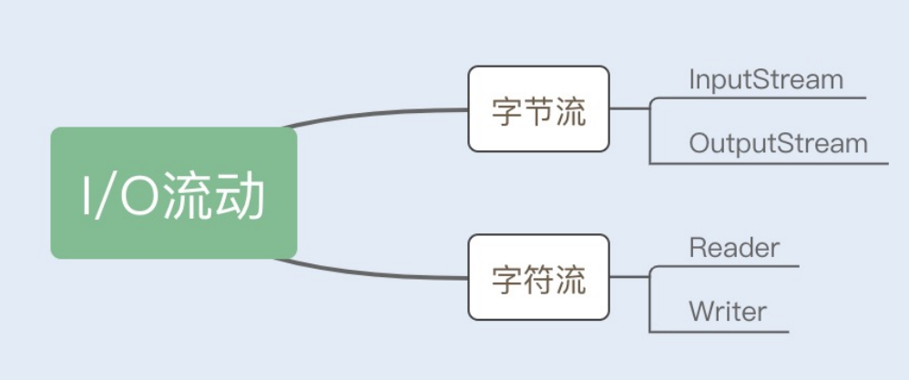

**2.字节流**

字节流的子类，以功能划分：

- 文件的读写操作：`FileInputStream`、`FileOutputStream`
- 字节数组的读写操作：`ByteArrayInputStream`、`ByteArrayOutputStream`
- 普通字符串的读写操作：`BufferedInputStream`、`BufferedOutputStream`

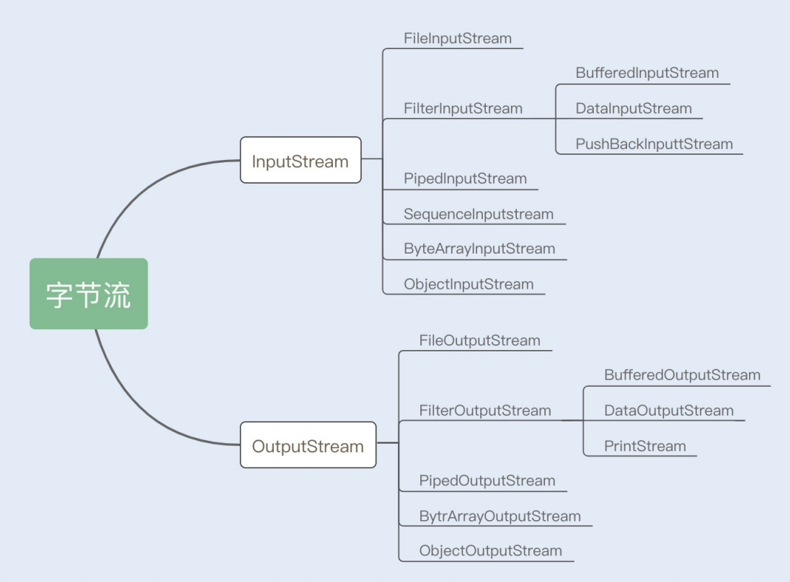

**3. 字符流**

1）分类

字符流的子类，以功能划分：

- 文件的读写操作：`FileReader`、`FileWriter`
- 字符数组的读写操作：`CharArrayReader`、`CharArrayWriter`
- 字节流的读写操作：`InputStreamReader`、`OutputStreamWriter`

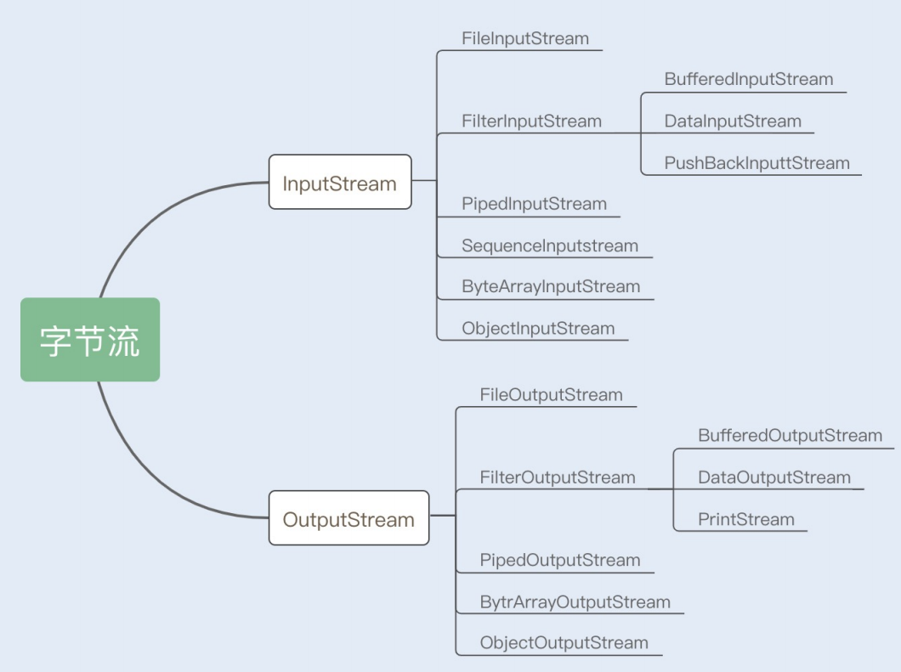

2）需要 IO 字符流的原因

数据读写过程中，字符到字节必须经过转码，此过程非常耗时，如果对编码类型不确定，则容易乱码，所以 IO 流提供了一个直接操作字符的接口，方便代码对字符进行流操作。


## 2 IO 模型

### 2.1 Socket

**1. 分类**

套接字通信可以分为流式套接字（TCP）和数据报套接字（UDP）。

**2. TCP 流程**

TCP 的数据传输比较复杂，存在拆包和装包的可能，下述流程为一次最简单的 TCP 数据传输流程。

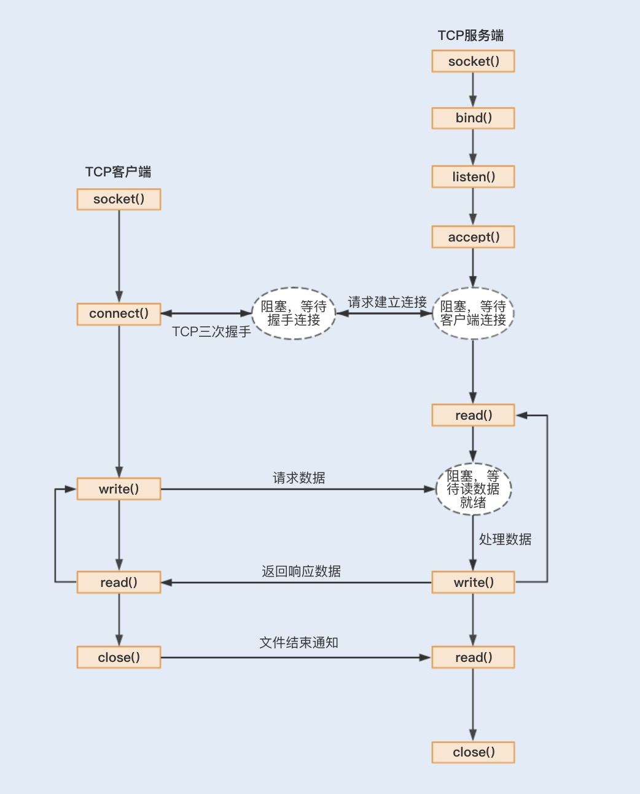

①应用程序通过系统调用 socket 创建一个套接字，它是系统分配给应用程序的一个文件描述符 fd；

②应用程序会通过系统调用 bind，绑定地址和端口号，给套接字命名；

③系统会调用 listen 创建一个队列用于存放客户端进来的连接；

④服务通过系统调用 accept 来监听客户端的连接请求。

当有一个客户端连接到服务端之后，服务端就会调用 fork 创建一个子进程，通过系统调用 read 监听客户端发来的消息，再通过 write 向客户端返回信息。

### 2.2 阻塞式IO

**1. 流程**

在整个 socket 通信工作流程中，socket 的默认状态是阻塞的。

> 当发出一个不能立即完成的套接字调用时，其进程将被阻塞，被系统挂起，进入睡眠状态，一直等待相应的操作响应。

**2. 阻塞点** 

1）connect 阻塞

当客户端发起 TCP 连接请求，通过系统调用 connect 函数，TCP 连接的建立需要完成三次握手过程，客户端需要等待服务端发送回来的 ACK 以及 SYN 信号，同样服务端也需要阻塞等待客户端确认连接的 ACK 信号，也就是说 TCP 的每个 connect 都会阻塞等待，直到确认连接。

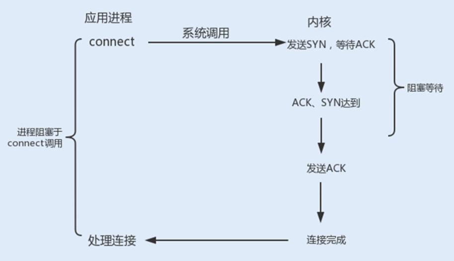

2）accept 阻塞

一个阻塞的 socket 通信的服务端接收外来连接，会调用 accept 函数，如果没有新的连接到达，调用进程将被挂起，进入阻塞状态。

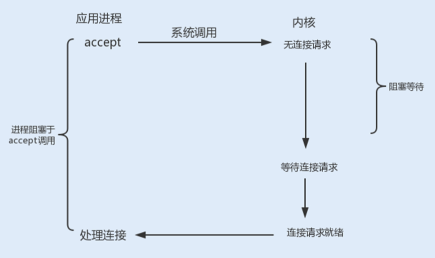

3）read/write 阻塞

当一个 socket 连接创建成功之后，服务端用 fork 函数创建一个子进程， 调用 read 函数等待客户端的数据写入，如果没有数据写入，调用子进程将被挂起，进入阻塞状态。

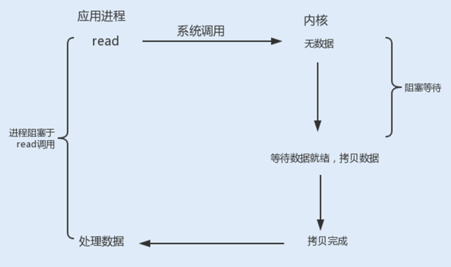

### 2.3 非阻塞式 IO

非阻塞 IO 模型如下图。

> 使用命令 `fcntl` 可以把 BIO 的三种阻塞操作（connect、accept、read/write）都设置为非阻塞操作。如果没有数据返回，则返回一个 EWOULDBLOCK 或 EAGAIN 错误。

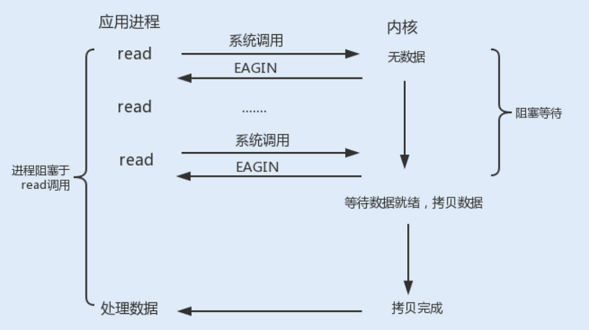

### 2.4 信号驱动式 IO

**1. 流程**

信号驱动式 I/O 类似观察者模式，内核就是一个观察者，信号回调则是通知。流程如下：

①用户进程发起一个 I/O 请求操作，会通过系统调用 sigaction 函数，给对应的套接字注册一个信号回调，此时不阻塞用户进程，进程会继续工作；

②当内核数据就绪时，内核就为该进程生成一个 SIGIO 信号，通过信号回调通知进程进行相关 I/O 操作。

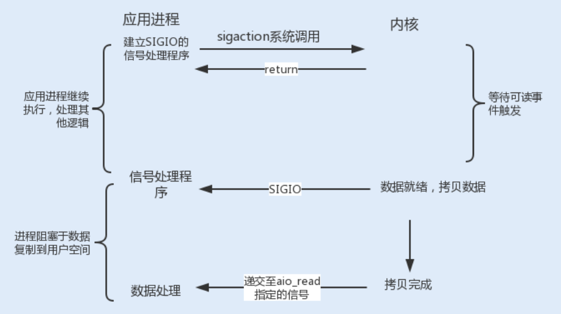

**2. 适用场景**

适用于 UDP 协议（如 NTP 服务器），因为 UDP 只有一个数据请求事件，只要捕获 SIGIO 信号，调用 recvfrom 读取数据报即可。

> SIGIO 信号是一种 Unix 信号，信号没有附加信息，而 TCP socket 生产的信号事件有七种，从而无法区分信号类型。

**3. 特点**

实现了等待数据就绪时，进程不被阻塞，主循环可以继续工作，相比前三种 IO 性能更佳。

> 但在被通知后进行的 I/O 操作还是阻塞的，进程会等待数据从内核空间复制到用户空间中。

### 2.5 异步 IO

**1. 流程**

用户进程发起一个 I/O 请求操作，系统会告知内核启动某个操作（此操作包括等待数据就绪和数据从内核复制到用户空间），并让内核在整个操作完成后通知进程。

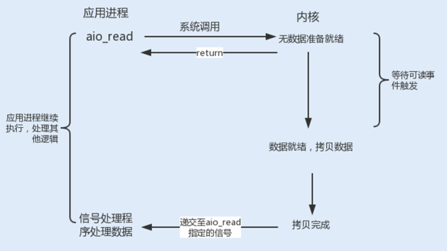

**3. 适用场景**

Windows 环境（Linux 暂不支持）。

**4. 特点**

实现了真正的非阻塞 IO。

## 3 操作系统的 IO 复用机制

Linux 提供了 I/O 复用函数 select/poll/epoll，进程将一个或多个读操作通过系统调用函数，阻塞在函数操作上，系统内核会代替进程侦测多个读操作是否处于就绪状态。

### 3.1 select

**1. 数据结构**

select 底层数据结构是数组，默认限制的最大连接句柄是1024。

> 可通过修改宏定义甚至重新编译内核的方式打破这一限制。

**2. 作用**

在超时时间内，轮询监听用户进程的文件描述符上的可读可写和异常事件的发生。

**3. 实现原理**

1）源码

````C++
int select(int maxfdp1,fd_set *readset,fd_set *writeset,fd_set *exceptset,const struct timeval *timeout)
````

> Linux 操作系统的内核将所有外部设备都看做一个文件来操作，对一个文件的读写操作会调用内核提供的系统命令，返回一个文件描述符（fd）。

select() 函数监视的文件描述符分 3 类：

- writefds（写文件描述符）
- readfds（读文件描述符）
- exceptfds（异常事件文件描述符）

2）流程

①调用 select() 函数后会阻塞，直到有描述符就绪或者超时，函数返回。

②当 select 函数返回后，可以通过函数 FD_ISSET 遍历 fdset，来找到就绪的描述符。

> fd_set 可以理解为一个集合，这个集合中存放的是文件描述符，可通过以下四个宏进行设置：
>
> ````C++
> 	void FD_ZERO(fd_set *fdset);          // 清空集合
> 	void FD_SET(int fd, fd_set *fdset);   // 将一个给定的文件描述符加入集合之中
> 	void FD_CLR(int fd, fd_set *fdset);   // 将一个给定的文件描述符从集合中删除
> 	int FD_ISSET(int fd, fd_set *fdset);  // 检查集合中指定的文件描述符是否可以读写
> ````

3）流程图

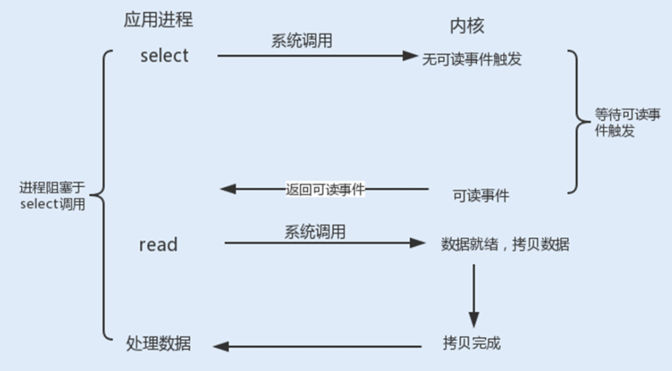

**4. 局限性**

- fd_set 是基于数组实现的，在新增和删除 fd 时，数量过大会导致效率降低；
- 大量文件描述符的数组被整体复制到用户态和内核的地址空间之间，无论这些文件描述符是否就绪，系统开销都会随着文件描述符数量的增加而线性增大。

### 3.2 poll

**1. 数据结构**

poll 底层数据结构是链表，没有最大连接限制。

**2. 作用**

在超时时间内，轮询监听用户进程的文件描述符上的可读可写和异常事件的发生。

**3. 流程图**

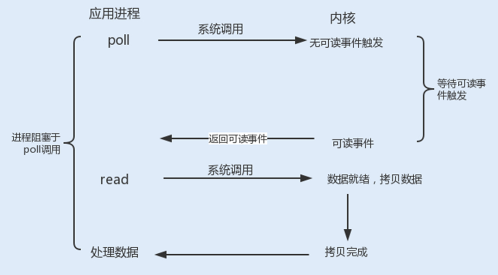

**4. 局限性**

大量文件描述符的数组被整体复制到用户态和内核的地址空间之间，无论这些文件描述符是否就绪，系统开销都会随着文件描述符数量的增加而线性增大。

### 3.3 epoll

**1. 数据结构**

epoll 底层数据结构是红黑树，增删改查的时间复杂度都为 O(logn)。

> Linux 2.6 内核版本所提供。

**2. 作用**

在超时时间内，轮询监听用户进程的文件描述符上的可读可写和异常事件的发生。

**3. 实现原理**

epoll 事先通过 epoll_ctl() 来注册一个文件描述符，将文件描述符存放到内核的一个事件表中，这个事件表是基于红黑树实现的。

````C++
int epoll_ctl(int epfd, int op, int fd, struct epoll_event event)
````

- epfd：由 epoll_create() 函数生成的一个 epoll 专用文件描述符；
- op：代表操作事件类型；
- fd：表示关联文件描述符；
- event：表示指定监听的事件类型。

一旦某个文件描述符就绪时，内核会采用类似 callback 的回调机制，迅速激活这个文件描述符，当进程调用 epoll_wait() 时便得到通知，之后进程将完成相关 I/O 操作。

````C++
int epoll_wait(int epfd, struct epoll_event events,int maxevents,int timeout)
````

3）流程图

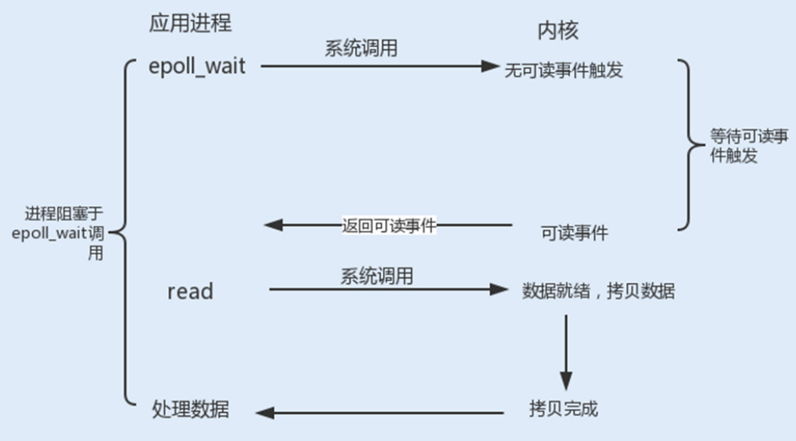

**4. 特性**

- 大量 I/O 请求的场景下，插入和删除的性能比 select/poll 的数组 fd_set 要好；
- 不会受到 fd 数量的限制。

## 4 NIO 的优化

### 4.1 Selector

**1. 概念**

Java 中的 Selector 就是 select/poll/epoll 的外包类。

**2. 作用**

I/O 复用器 Selector 实现了非阻塞 I/O。

**3. 实现原理**

Socket 通信中的 connect、accept、read 以及 write 等4个阻塞操作，在 Selector 中分别对应 SelectionKey 的四个监听事件 OP_ACCEPT、OP_CONNECT、OP_READ 以及 OP_WRITE。

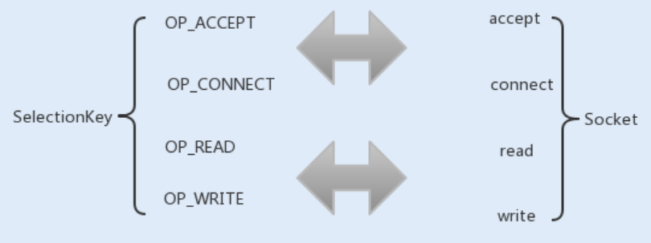

**4. NIO 服务端通信流程**

①首先创建一个 Channel，用于监听客户端连接；

②创建多路复用器 Selector，并将 Channel 注册到 Selector，程序会通过 Selector 来轮询注册在其上的 Channel，当发现一个或多个 Channel 处于就绪状态时，返回就绪的监听事件；

③程序匹配到监听事件，进行相关的 I/O 操作。

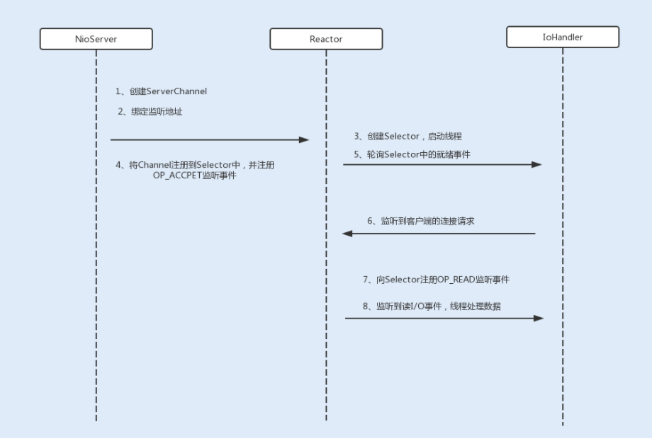

> 在 JDK1.5 版本且程序运行在内核版本在 2.6 以上的 Linux 操作系统时，NIO 中会选择 epoll 来替代传统的 select/poll，极大地提升了 NIO 通信的性能。

### 4.2 零拷贝

**1. 背景**

在网络编程中，通常由 read、write 来完成一次 I/O 读写操作。每一次 I/O 读写操作都需要完成四次内存拷贝，路径是 I/O 设备 -> 内核空间 -> 用户空间 -> 内核空间 -> 其它 I/O 设备。

**2. 概念**

零拷贝是一种避免多次内存复制的技术。

**3. 作用**

优化读写 I/O 操作，减少内存拷贝的性能损耗。

>  传统 I/O 中，在执行读写 I/O 操作时，存在着多次内存拷贝和上下文切换，给系统增加了性能开销。

**4. 实现原理**

1）Linux 内核

Linux 内核中的 mmap 函数代替了 read、write 的 I/O 读写操作，实现用户空间和内核空间共享一个缓存数据，mmap 将用户空间的一块地址和内核空间的一块地址同时映射到相同的一块物理内存地址。

> 不管是用户空间还是内核空间都是虚拟地址，最终要通过地址映射映射到物理内存地址。

2） Java NIO

使用 Direct Buffer 来实现内存的零拷贝。Java 直接在 JVM 内存空间之外开辟了一个物理内存空间，这样内核和用户进程都能共享一份缓存数据。

### 4.3 线程模型优化路线

#### 4.3.1 NIO 组件

NIO 是基于事件驱动模型来实现的 I/O 操作。Reactor 模型是同步 I/O 事件处理的一种常见模型，其核心思想是将 I/O 事件注册到多路复用器上，一旦有 I/O 事件触发，多路复用器就会将事件分发到事件处理器中，执行就绪的 I/O 事件操作。

- 事件接收器 Acceptor：主要负责接收请求连接；
- 事件分离器 Reactor：接收请求后，会将建立的连接注册到分离器中，依赖于循环监听多路复用器 Selector，一旦监听到事件，就会将事件 dispatch 到事件处理器；
- 事件处理器 Handlers：事件处理器主要是完成相关的事件处理，比如读写 I/O 操作。

#### 4.3.2 单线程 Reactor 线程模型

**1. 实现原理**

最开始 NIO 是基于单线程实现的，所有的 I/O 操作都是在一个 NIO 线程上完成。由于 NIO 是非阻塞 I/O，理论上一个线程可以完成所有的 I/O 操作。


**2. 局限性**

目前的 NIO 还不算真正地实现了非阻塞 I/O 操作，因为读写 I/O 操作时用户进程还是处于阻塞状态，这种方式在高负载、高并发的场景下会存在性能瓶颈，一个 NIO 线程如果同时处理上万连接的 I/O 操作，系统是无法支撑这种量级的请求的。

#### 4.3.3 多线程 Reactor 线程模型

**1. 优化手段**

为了解决这种单线程的 NIO 在高负载、高并发场景下的性能瓶颈，后来使用了线程池。

**2. 实现原理**

在 Tomcat 和 Netty 中都使用了一个 Acceptor 线程来监听连接请求事件，当连接成功之后，会将建立的连接注册到多路复用器中，一旦监听到事件，将交给 Worker 线程池来负责处理。

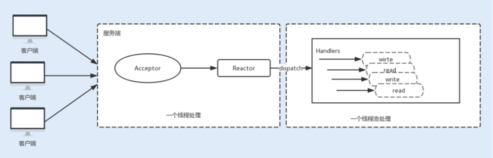

**3. 局限性**

大多数情况下，这种线程模型可以满足性能要求，但如果连接的客户端再上一个量级，一个 Acceptor 线程可能会存在性能瓶颈。

#### 4.3.4 主从 Reactor 线程模型

**1. 优化手段**

使用线程池的方式代替过去单独的 Acceptor NIO 线程。

**2. 实现原理**

Acceptor 接收到客户端的 TCP 连接请求，建立连接之后，后续的 I/O 操作将交给 Worker I/O 线程。

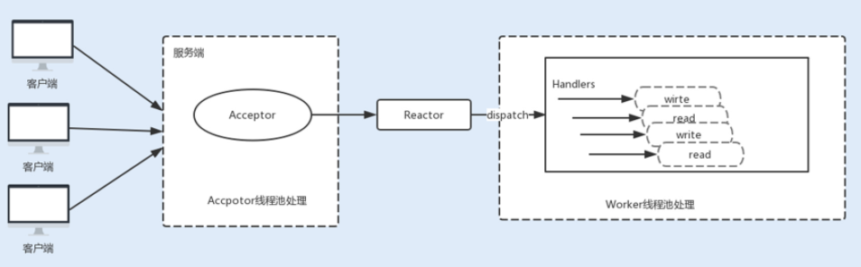

**3. 适用场景**

主流通信框架中的 NIO 通信框架都是基于主从 Reactor 线程模型来实现的。


