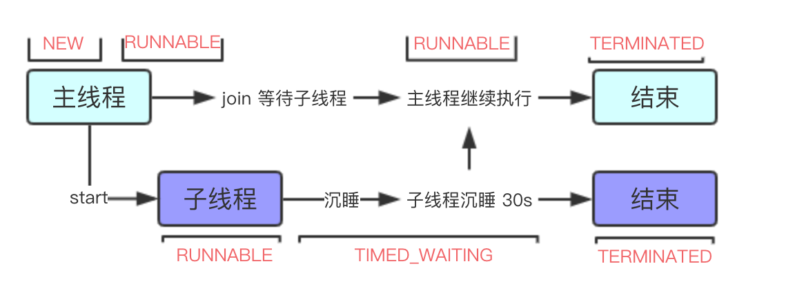

# 多线程源码总结

  * [1 线程](#1-%E7%BA%BF%E7%A8%8B)
    * [1\.1 线程的基本概念](#11-%E7%BA%BF%E7%A8%8B%E7%9A%84%E5%9F%BA%E6%9C%AC%E6%A6%82%E5%BF%B5)
      * [1\.1\.1 线程的状态](#111-%E7%BA%BF%E7%A8%8B%E7%9A%84%E7%8A%B6%E6%80%81)
      * [1\.1\.2 优先级](#112-%E4%BC%98%E5%85%88%E7%BA%A7)
      * [1\.1\.3 守护线程](#113-%E5%AE%88%E6%8A%A4%E7%BA%BF%E7%A8%8B)
      * [1\.1\.4 ClassLoader](#114-classloader)
      * [1\.1\.5 线程初始化方式](#115-%E7%BA%BF%E7%A8%8B%E5%88%9D%E5%A7%8B%E5%8C%96%E6%96%B9%E5%BC%8F)
    * [1\.2 Thread 源码](#12-thread-%E6%BA%90%E7%A0%81)
      * [1\.2\.1 类注释](#121-%E7%B1%BB%E6%B3%A8%E9%87%8A)
      * [1\.2\.2 start 源码](#122-start-%E6%BA%90%E7%A0%81)
      * [1\.2\.3 线程初始化](#123-%E7%BA%BF%E7%A8%8B%E5%88%9D%E5%A7%8B%E5%8C%96)
      * [1\.2\.4 join](#124-join)
      * [1\.2\.5 yield](#125-yield)
      * [1\.2\.6 sleep](#126-sleep)
      * [1\.2\.7 interrupt](#127-interrupt)
    * [1\.3 Future、ExecutorService 源码](#13-futureexecutorservice-%E6%BA%90%E7%A0%81)
      * [1\.3\.1 整体架构](#131-%E6%95%B4%E4%BD%93%E6%9E%B6%E6%9E%84)
      * [1\.3\.2 Callable](#132-callable)
      * [1\.3\.3 FutureTask](#133-futuretask)
      * [1\.3\.4 Future](#134-future)
      * [1\.3\.5 RunnableFuture](#135-runnablefuture)
    * [1\.4 ThreadLoacl](#14-threadloacl)
  * [2 锁](#2-%E9%94%81)
    * [2\.1 AbstractQueuedSynchronizer](#21-abstractqueuedsynchronizer)
      * [2\.1\.1 整体架构](#211-%E6%95%B4%E4%BD%93%E6%9E%B6%E6%9E%84)
    * [2\.2 ReentrantLock](#22-reentrantlock)
    * [2\.3 CountDownLatch](#23-countdownlatch)
  * [3 多线程](#3-%E5%A4%9A%E7%BA%BF%E7%A8%8B)
    * [3\.1 ThreadPoolExecutor](#31-threadpoolexecutor)

## 1 线程

### 1.1 线程的基本概念

#### 1.1.1 线程的状态

源码中一共列举了六种状态，如下图：


①NEW 表示线程创建成功，但没有运行，在 new Thread 之后，没有 start 之前，线程的状态都是 NEW；

②当运行 strat 方法，子线程被创建成功之后，子线程的状态变成 RUNNABLE，RUNNABLE 表示线程正在运行中；

③子线程运行完成、被打断、被中止，状态都会从 RUNNABLE 变成 TERMINATED，TERMINATED 表示线程已经运行结束了；

④如果线程正好在等待获得 monitor lock 锁，比如在等待进入 synchronized 修饰的代码块或方法时，会从 RUNNABLE 变成 BLOCKED，即阻塞；

⑤WAITING 和 TIMED_WAITING 类似，都表示在遇到 Object#wait、Thread#join、LockSupport#park 这些方法时，线程就会等待另一个线程执行完特定的动作之后，才能结束等待，只不过 TIMED_WAITING 是带有等待时间的。

#### 1.1.2 优先级

**1. 概念**

优先级代表线程执行的机会的大小，优先级高的**可能**先执行，低的**可能**后执行。

**2. 源码**

Java 源码中，优先级从低到高分别是 1 到 10，线程默认 new 出来的优先级都是 5。

````java
// 最低优先级
public final static int MIN_PRIORITY = 1;

// 普通优先级，也是默认的
public final static int NORM_PRIORITY = 5;

// 最大优先级
public final static int MAX_PRIORITY = 10;
````

#### 1.1.3 守护线程

**1. 概念**

守护线程的优先级很低，当 JVM 退出时，是不关心有无守护线程的，即使还有很多守护线程，JVM 仍然会退出。

**2. 创建方式**

创建守护线程时，需要将 Thread 的 daemon 属性设置成 true。

> 创建的线程默认都是非守护线程。

**3. 适用场景**

做一些监控的工作的工具，通常用守护子线程去做。

> 因为是子线程，所以也不会影响到业务主线程， JVM 也无需关注监控是否正在运行，该退出就退出，对业务不会产生任何影响。

#### 1.1.4 ClassLoader

ClassLoader 可以简单理解成类加载器，就是把类从文件、二进制数组、URL 等位置加载成可运行 Class。

#### 1.1.5 线程初始化方式

线程初始化有三种方式（其中前两种无返回值，第三种有返回值）：

- 继承 Thread 类
- 继承并实现 Runnable 接口，作为 Thread 的入参
- 通过 FutureTask 和 Callable 实现

**1. 继承 Thread**

①继承 Thread，实现其 run 方法；

②调用 start 方法开启子线程。

**2. 实现 Runnable 接口**

①实现 Runnable 的接口，重写 run 方法；

②作为 Thread 构造器的入参；

③调用 start 方法开启子线程。

> 调用 run 方法表示通过主线程来执行 run 方法内的操作。

**3. 通过 FutureTask 和 Callable 实现**

①实现 Callable 的接口，重写 call 方法；

②Callable 作为 FutureTask 构造器的入参；

③FutureTask 作为 Thread 构造器的入参；

④调用 start 方法开启子线程。

### 1.2 Thread 源码

#### 1.2.1 类注释

- 每个线程都有优先级，高优先级的线程可能会优先执行；
- 父线程创建子线程后，优先级、是否是守护线程等属性父子线程是一致的；
- JVM 启动时，通常都启动 MAIN 非守护线程，以下任意一个情况发生时，线程就会停止：
    - 退出方法被调用，并且安全机制允许这么做（比如调用 Thread.interrupt 方法）；
    - 所有非守护线程都消亡，或者从运行的方法正常返回，或者运行的方法抛出了异常；
- 每个线程都有名字，多个线程可能具有相同的名字，Thread 有的构造器如果没有指定名字，会自动生成一个名字。

#### 1.2.2 start 源码

````java
// 该方法可以创建一个新的线程出来
public synchronized void start() {
    // 如果没有初始化，抛异常
    if (threadStatus != 0)
        throw new IllegalThreadStateException();
    group.add(this);
    // started 是个标识符，我们在做一些事情的时候，经常这么写
    // 动作发生之前标识符是 false，发生完成之后变成 true
    boolean started = false;
    try {
        // 这里会创建一个新的线程，执行完成之后，新的线程已经在运行了，既 target 的内容已经在运行了
        start0();
        // 这里执行的还是主线程
        started = true;
    } finally {
        try {
            // 如果失败，把线程从线程组中删除
            if (!started) {
                group.threadStartFailed(this);
            }
         // Throwable 可以捕捉一些 Exception 捕捉不到的异常，比如说子线程抛出的异常
        } catch (Throwable ignore) {
            /* do nothing. If start0 threw a Throwable then
              it will be passed up the call stack */
        }
    }
}
// 开启新线程使用的是 native 方法
private native void start0();
````

真正开启新线程使用的是名字为 start0 的 native 方法。

#### 1.2.3 线程初始化

线程初始化的部分核心源码如下：

````java
// 无参构造器，线程名字自动生成
public Thread() {
    init(null, null, "Thread-" + nextThreadNum(), 0);
}
// g 代表线程组，线程组可以对组内的线程进行批量的操作，比如批量的打断 interrupt
// target 是我们要运行的对象
// name 我们可以自己传，如果不传默认是 "Thread-" + nextThreadNum()，nextThreadNum 方法返回的是自增的数字
// stackSize 可以设置堆栈的大小
private void init(ThreadGroup g, Runnable target, String name,
                  long stackSize, AccessControlContext acc) {
    if (name == null) {
        throw new NullPointerException("name cannot be null");
    }

    this.name = name.toCharArray();
    // 当前线程作为父线程
    Thread parent = currentThread();
    this.group = g;
    // 子线程会继承父线程的守护属性
    this.daemon = parent.isDaemon();
    // 子线程继承父线程的优先级属性
    this.priority = parent.getPriority();
    // classLoader
    if (security == null || isCCLOverridden(parent.getClass()))
        this.contextClassLoader = parent.getContextClassLoader();
    else
        this.contextClassLoader = parent.contextClassLoader;
    this.inheritedAccessControlContext =
            acc != null ? acc : AccessController.getContext();
    this.target = target;
    setPriority(priority);
    // 当父线程的 inheritableThreadLocals 的属性值不为空时
    // 会把 inheritableThreadLocals 里面的值全部传递给子线程
    if (parent.inheritableThreadLocals != null)
        this.inheritableThreadLocals =
            ThreadLocal.createInheritedMap(parent.inheritableThreadLocals);
    this.stackSize = stackSize;
    /* Set thread ID */
    // 线程 id 自增
    tid = nextThreadID();
}
````

子线程都是直接继承父线程的属性：

- 优先级
- 守护线程
- inheritableThreadLocals

#### 1.2.4 join

**1. 概念**

当前线程等待另一个线程执行完成之后，才能继续操作。

**2. 示例**

1）示例源码

````java
@Test
public void join() throws Exception {
  Thread main = Thread.currentThread();
  log.info("{} is run。",main.getName());
  Thread thread = new Thread(new Runnable() {
    @Override
    public void run() {
      log.info("{} begin run",Thread.currentThread().getName());
      try {
        Thread.sleep(30000L);
      } catch (InterruptedException e) {
        e.printStackTrace();
      }
      log.info("{} end run",Thread.currentThread().getName());
    }
  });
  // 开一个子线程去执行
  thread.start();
  // 当前主线程等待子线程执行完成之后再执行
  thread.join();
  log.info("{} is end", Thread.currentThread());
}
````

2）示例思路

①主线程在执行 thread.join (); 代码后会停住；

②等待子线程沉睡 30 秒后再执行。



**3. 适用场景**

让主线程等待子线程执行完成的场景。

#### 1.2.5 yield

**1. 概念**

当前线程做出让步，放弃当前 cpu，让 cpu 重新选择线程，避免线程过度使用 cpu。

**2. 源码**

yield 是个 native 方法，源码如下：

````java
public static native void yield();
````

**3. 适用场景**

写 while 死循环的时候，预计短时间内 while 死循环可以结束的话，在循环里面使用 yield 方法，防止 cpu 一直被 while 死循环霸占。

#### 1.2.6 sleep

sleep 也是 native 方法，可以接受毫秒的一个入参，也可以接受毫秒和纳秒的两个入参，表示当前线程会沉睡多久，沉睡时不会释放锁资源，所以沉睡时，其它线程是无法得到锁的。

> 接受毫秒和纳秒两个入参时，如果给定纳秒大于等于 0.5 毫秒，算一个毫秒，否则不算。

#### 1.2.7 interrupt

**1. 概念**

可以打断中止正在运行的线程。

**2. 示例**

1）示例源码

````java
@Test
public void testInterrupt() throws InterruptedException {
  Thread thread = new Thread(new Runnable() {
    @Override
    public void run() {
      log.info("{} begin run",Thread.currentThread().getName());
      try {
        log.info("子线程开始沉睡 30 s");
        Thread.sleep(30000L);
      } catch (InterruptedException e) {
        log.info("子线程被打断");
        e.printStackTrace();
      }
      log.info("{} end run",Thread.currentThread().getName());
    }
  });
  // 开一个子线程去执行
  thread.start();
  Thread.sleep(1000L);
  log.info("主线程等待 1s 后，发现子线程还没有运行成功，打断子线程");
  thread.interrupt();
}
````

2）示例思路

①主线程会等待子线程执行 1s，如果 1s 内子线程还没有执行完，就会打断子线程；

②子线程被打断后，会抛出 InterruptedException 异常，执行结束。

执行结果如下图：


**3. 适用场景**

- bject#wait ()、Thread#join ()、Thread#sleep (long) 这些方法运行后，线程的状态是 WAITING 或 TIMED_WAITING，这时候打断这些线程，就会抛出 InterruptedException 异常，使线程的状态直接到 TERMINATED；
- 果 I/O 操作被阻塞了，我们主动打断当前线程，连接会被关闭，并抛出 ClosedByInterruptException 异常。

### 1.3 Future、ExecutorService 源码

#### 1.3.1 整体架构


- Callable 定义线程执行内容，可以有返回值；
- FutureTask 入参是 Callable，是对 Callable 的包装，方便线程池的使用；
- 通过 FutureTask.get() 得到子线程的计算结果

#### 1.3.2 Callable

**1. 概念**

Callable 是一个接口，约定了线程要做的事情，并且可以有返回值。

**2. 源码**

````java
public interface Callable<V> {
    V call() throws Exception;
}
````

返回值是一个泛型，可以定义成任何类型，通常会结合 FutureTask 一起使用。

#### 1.3.3 FutureTask

**1. 概念**

FutureTask 实现了 RunnableFuture 接口，又集合了 Callable（Callable 是 FutureTask 的属性），还提供了两者一系列的转化方法。

**2. 目的**

FutureTask 统一了 Callable 和 Runnable。

**3. 类定义与属性源码**

````java
public class FutureTask<V> implements RunnableFuture<V> {
    // 任务状态
    private volatile int state;
    private static final int NEW          = 0;//线程任务创建
    private static final int COMPLETING   = 1;//任务执行中
    private static final int NORMAL       = 2;//任务执行结束
    private static final int EXCEPTIONAL  = 3;//任务异常
    private static final int CANCELLED    = 4;//任务取消成功
    private static final int INTERRUPTING = 5;//任务正在被打断中
    private static final int INTERRUPTED  = 6;//任务被打断成功

    // 组合了 Callable 
    private Callable<V> callable;
    // 异步线程返回的结果
    private Object outcome; 
    // 当前任务所运行的线程
    private volatile Thread runner;
    // 记录调用 get 方法时被等待的线程
    private volatile WaitNode waiters;
}
````

其中，RunnableFuture 又继承了 Runnable, Future 两个接口。

- 间接实现了 Runnnable 接口：本身可以作为 Runnnable；
- 间接实现了 Future 接口：具备对任务进行管理的功能；
- Callable 是作为 FutureTask 的属性：FutureTask 具备了转化 Callable 和 Runnable 的功能。

**4. 构造器**

1）源码

FutureTask 有两个构造器，分别接受 Callable 和 Runnable，源码如下：

````java
// 使用 Callable 进行初始化
public FutureTask(Callable<V> callable) {
    if (callable == null)
        throw new NullPointerException();
    this.callable = callable;
    // 任务状态初始化
    this.state = NEW;       // ensure visibility of callable
}

// 使用 Runnable 初始化，并传入 result 作为返回结果。
// Runnable 是没有返回值的，所以 result 一般没有用，置为 null 就好了
public FutureTask(Runnable runnable, V result) {
    // Executors.callable 方法把 runnable 适配成 RunnableAdapter，RunnableAdapter 实现了 callable，所以也就是把 runnable 直接适配成了 callable。
    this.callable = Executors.callable(runnable, result);
    this.state = NEW;       // ensure visibility of callable
}
````

入参是 Runnable 的构造器，会使用 Executors.callable 方法来把 Runnnable 转化成 Callable。

原因：Runnnable 和 Callable 两者都是接口，互相是无法进行转化的所以 Java 新建了一个转化类：RunnableAdapter 来进行转化，源码如下：

````java
// 转化 Runnable 成 Callable 的工具类
static final class RunnableAdapter<T> implements Callable<T> {
    final Runnable task;
    final T result;
    RunnableAdapter(Runnable task, T result) {
        this.task = task;
        this.result = result;
    }
    public T call() {
        task.run();
        return result;
    }
}
````

源码思路：

- RunnableAdapter 实现了 Callable，即 RunnableAdapter 可作为 Callable；
- Runnable 是 RunnableAdapter 的一个属性，在构造 RunnableAdapter 的时候会传进来，并且在 call 方法里面调用 Runnable 的 run 方法。

它利用了适配器设计模式，实现 Callable 的接口，接着在 Callable 的 call 方法里面调用被适配对象（Runnable）的方法，从而把 Runnable 适配成 Callable。

2）两个构造器的目的

把入参都转化成 Callable。

> 为什么不都转化成 Runnnable 呢？主要是因为 Callable 的功能比 Runnnable 丰富，Callable 有返回值，而 Runnnable 没有。

**5. get 源码**

get 有无限阻塞和带超时时间两种方法，通常建议使用带超时时间的方法，源码如下：

````java
public V get(long timeout, TimeUnit unit)
    throws InterruptedException, ExecutionException, TimeoutException {
    if (unit == null)
        throw new NullPointerException();
    int s = state;
    // 如果任务已经在执行中了，并且等待一定的时间后，仍然在执行中，直接抛出异常
    if (s <= COMPLETING &&
        (s = awaitDone(true, unit.toNanos(timeout))) <= COMPLETING)
        throw new TimeoutException();
    // 任务执行成功，返回执行的结果
    return report(s);
}

// 等待任务执行完成
private int awaitDone(boolean timed, long nanos)
    throws InterruptedException {
    // 计算等待终止时间，如果一直等待的话，终止时间为 0
    final long deadline = timed ? System.nanoTime() + nanos : 0L;
    WaitNode q = null;
    // 不排队
    boolean queued = false;
    // 无限循环
    for (;;) {
        // 如果线程已经被打断了，删除，抛异常
        if (Thread.interrupted()) {
            removeWaiter(q);
            throw new InterruptedException();
        }
        // 当前任务状态
        int s = state;
        // 当前任务已经执行完了，返回
        if (s > COMPLETING) {
            // 当前任务的线程置空
            if (q != null)
                q.thread = null;
            return s;
        }
        // 如果正在执行，当前线程让出 cpu，重新竞争，防止 cpu 飙高
        else if (s == COMPLETING) // cannot time out yet
            Thread.yield();
            // 如果第一次运行，新建 waitNode，当前线程就是 waitNode 的属性
        else if (q == null)
            q = new WaitNode();
            // 默认第一次都会执行这里，执行成功之后，queued 就为 true，就不会再执行了
            // 把当前 waitNode 当做 waiters 链表的第一个
        else if (!queued)
            queued = UNSAFE.compareAndSwapObject(this, waitersOffset,
                                                 q.next = waiters, q);
            // 如果设置了超时时间，并过了超时时间的话，从 waiters 链表中删除当前 wait
        else if (timed) {
            nanos = deadline - System.nanoTime();
            if (nanos <= 0L) {
                removeWaiter(q);
                return state;
            }
            // 没有过超时时间，线程进入 TIMED_WAITING 状态
            LockSupport.parkNanos(this, nanos);
        }
        // 没有设置超时时间，进入 WAITING 状态
        else
            LockSupport.park(this);
    }
}
````

- 任务还在进行中，没有完成时，就会阻塞当前进程，等待任务完成后再返回结果值；
- 阻塞底层使用的是 LockSupport.park 方法，使当前线程进入 WAITING 或 TIMED_WAITING 状态。

**6. run 源码**

````java
/**
 * run 方法可以直接被调用
 * 也可以开启新的线程进行调用
 */
public void run() {
    // 状态不是任务创建，或者当前任务已经有线程在执行了，直接返回
    if (state != NEW ||
        !UNSAFE.compareAndSwapObject(this, runnerOffset,
                                     null, Thread.currentThread()))
        return;
    try {
        Callable<V> c = callable;
        // Callable 不为空，并且已经初始化完成
        if (c != null && state == NEW) {
            V result;
            boolean ran;
            try {
                // 调用执行
                result = c.call();
                ran = true;
            } catch (Throwable ex) {
                result = null;
                ran = false;
                setException(ex);
            }
            // 给 outcome 赋值
            if (ran)
                set(result);
        }
    } finally {
        runner = null;
        int s = state;
        if (s >= INTERRUPTING)
            handlePossibleCancellationInterrupt(s);
    }
}
````

- run 方法没有返回值，通过给 outcome 属性赋值（set(result)），get 时就能从 outcome 属性中拿到返回值；
- FutureTask 两种构造器，最终都转化成了 Callable，所以在 run 方法执行的时候，只需要执行 Callable 的 call 方法即可，在执行 c.call() 代码时，如果入参是 Runnable 的话， 调用路径为 c.call() -> RunnableAdapter.call() -> Runnable.run()，如果入参是 Callable 的话，直接调用。

**7. cancel 源码**

````java
// 取消任务，如果正在运行，尝试去打断
public boolean cancel(boolean mayInterruptIfRunning) {
    if (!(state == NEW &&//任务状态不是创建 并且不能把 new 状态置为取消，直接返回 false
          UNSAFE.compareAndSwapInt(this, stateOffset, NEW,
              mayInterruptIfRunning ? INTERRUPTING : CANCELLED)))
        return false;
    // 进行取消操作，打断可能会抛出异常，选择 try finally 的结构
    try {    // in case call to interrupt throws exception
        if (mayInterruptIfRunning) {
            try {
                Thread t = runner;
                if (t != null)
                    t.interrupt();
            } finally { // final state
                //状态设置成已打断
                UNSAFE.putOrderedInt(this, stateOffset, INTERRUPTED);
            }
        }
    } finally {
        // 清理线程
        finishCompletion();
    }
    return true;
}
````

#### 1.3.4 Future

**1. 概念**

Future 是一个接口，它定义了对任务进行管理的各种方法。

**2. 接口注释**

- 定义了异步计算的接口，提供了计算是否完成的 check、等待完成和取回等多种方法；
- 如果想得到结果可以使用 get 方法，此方法(无参方法)会一直阻塞到异步任务计算完成；
- 取消可以使用 cancel 方法，但一旦任务计算完成，就无法被取消了

**3. 源码**

````java
// 如果任务已经成功了，或已经取消了，是无法再取消的，会直接返回取消成功(true)
// 如果任务还没有开始进行时，发起取消，是可以取消成功的。
// 如果取消时，任务已经在运行了，mayInterruptIfRunning 为 true 的话，就可以打断运行中的线程
// mayInterruptIfRunning 为 false，表示不能打断直接返回
boolean cancel(boolean mayInterruptIfRunning);

// 返回线程是否已经被取消了，true 表示已经被取消了
// 如果线程已经运行结束了，isCancelled 和 isDone 返回的都是 true
boolean isCancelled();

// 线程是否已经运行结束了
boolean isDone();

// 等待结果返回
// 如果任务被取消了，抛 CancellationException 异常
// 如果等待过程中被打断了，抛 InterruptedException 异常
V get() throws InterruptedException, ExecutionException;

// 等待，但是带有超时时间的，如果超时时间外仍然没有响应，抛 TimeoutException 异常
V get(long timeout, TimeUnit unit)
        throws InterruptedException, ExecutionException, TimeoutException;
````

#### 1.3.5 RunnableFuture

**1. 概念**

RunnableFuture 是一个继承了 Runnable 和 Future 的接口。

**2. 目的**

让 Future 可以对 Runnable 进行管理，可以取消 Runnable，查看 Runnable 是否完成等等。

**3. 源码**

````java
public interface RunnableFuture<V> extends Runnable, Future<V> {
    void run();
}
````

### 1.4 ThreadLoacl

## 2 锁

### 2.1 AbstractQueuedSynchronizer

AbstractQueuedSynchronizer，同步器，简称 AQS，各种锁的底层实现，如 ReentrantLock、CountDownLatch 等。

#### 2.1.1 整体架构


### 2.2 ReentrantLock

### 2.3 CountDownLatch

## 3 线程池

### 3.1 ThreadPoolExecutor

