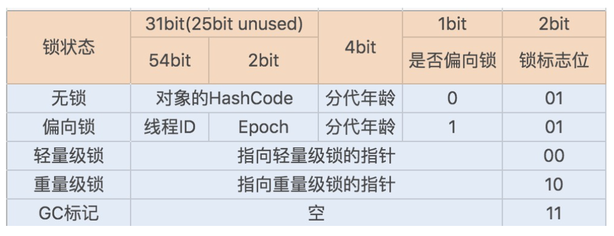

# 多线程源码总结

  * [1 线程](#1-%E7%BA%BF%E7%A8%8B)
    * [1\.1 线程的基本概念](#11-%E7%BA%BF%E7%A8%8B%E7%9A%84%E5%9F%BA%E6%9C%AC%E6%A6%82%E5%BF%B5)
      * [1\.1\.1 线程的状态](#111-%E7%BA%BF%E7%A8%8B%E7%9A%84%E7%8A%B6%E6%80%81)
      * [1\.1\.2 优先级](#112-%E4%BC%98%E5%85%88%E7%BA%A7)
      * [1\.1\.3 守护线程](#113-%E5%AE%88%E6%8A%A4%E7%BA%BF%E7%A8%8B)
      * [1\.1\.4 ClassLoader](#114-classloader)
      * [1\.1\.5 线程初始化方式](#115-%E7%BA%BF%E7%A8%8B%E5%88%9D%E5%A7%8B%E5%8C%96%E6%96%B9%E5%BC%8F)
    * [1\.2 Thread 源码](#12-thread-%E6%BA%90%E7%A0%81)
      * [1\.2\.1 类注释](#121-%E7%B1%BB%E6%B3%A8%E9%87%8A)
      * [1\.2\.2 start 源码](#122-start-%E6%BA%90%E7%A0%81)
      * [1\.2\.3 线程初始化](#123-%E7%BA%BF%E7%A8%8B%E5%88%9D%E5%A7%8B%E5%8C%96)
      * [1\.2\.4 join](#124-join)
      * [1\.2\.5 yield](#125-yield)
      * [1\.2\.6 sleep](#126-sleep)
      * [1\.2\.7 interrupt](#127-interrupt)
    * [1\.3 Future、ExecutorService 源码](#13-futureexecutorservice-%E6%BA%90%E7%A0%81)
      * [1\.3\.1 整体架构](#131-%E6%95%B4%E4%BD%93%E6%9E%B6%E6%9E%84)
      * [1\.3\.2 Callable](#132-callable)
      * [1\.3\.3 FutureTask](#133-futuretask)
      * [1\.3\.4 Future](#134-future)
      * [1\.3\.5 RunnableFuture](#135-runnablefuture)
    * [1\.4 ThreadLocal](#14-threadlocal)
      * [1\.4\.1 整体架构](#141-%E6%95%B4%E4%BD%93%E6%9E%B6%E6%9E%84)
      * [1\.4\.2 ThreadLocalMap](#142-threadlocalmap)
      * [1\.4\.3 ThreadLocal 如何隔离线程之间的数据](#143-threadlocal-%E5%A6%82%E4%BD%95%E9%9A%94%E7%A6%BB%E7%BA%BF%E7%A8%8B%E4%B9%8B%E9%97%B4%E7%9A%84%E6%95%B0%E6%8D%AE)
      * [1\.4\.4  set 方法](#144--set-%E6%96%B9%E6%B3%95)
      * [1\.4\.5 get 方法](#145-get-%E6%96%B9%E6%B3%95)
      * [1\.4\.6 扩容](#146-%E6%89%A9%E5%AE%B9)
  * [2 锁](#2-%E9%94%81)
    * [2\.1 AbstractQueuedSynchronizer](#21-abstractqueuedsynchronizer)
      * [2\.1\.1 整体架构](#211-%E6%95%B4%E4%BD%93%E6%9E%B6%E6%9E%84)
      * [2\.1\.2 类定义](#212-%E7%B1%BB%E5%AE%9A%E4%B9%89)
      * [2\.1\.3 基本属性](#213-%E5%9F%BA%E6%9C%AC%E5%B1%9E%E6%80%A7)
      * [2\.1\.4 Condition](#214-condition)
      * [2\.1\.5 同步器的状态](#215-%E5%90%8C%E6%AD%A5%E5%99%A8%E7%9A%84%E7%8A%B6%E6%80%81)
      * [2\.1\.6 获取锁](#216-%E8%8E%B7%E5%8F%96%E9%94%81)
      * [2\.1\.7 释放锁](#217-%E9%87%8A%E6%94%BE%E9%94%81)
      * [2\.1\.8 条件队列的重要方法](#218-%E6%9D%A1%E4%BB%B6%E9%98%9F%E5%88%97%E7%9A%84%E9%87%8D%E8%A6%81%E6%96%B9%E6%B3%95)
    * [2\.2 ReentrantLock](#22-reentrantlock)
      * [2\.2\.1 整体架构](#221-%E6%95%B4%E4%BD%93%E6%9E%B6%E6%9E%84)
      * [2\.2\.2 构造器](#222-%E6%9E%84%E9%80%A0%E5%99%A8)
      * [2\.2\.3 Sync 同步器](#223-sync-%E5%90%8C%E6%AD%A5%E5%99%A8)
      * [2\.2\.4 FairSync 公平锁](#224-fairsync-%E5%85%AC%E5%B9%B3%E9%94%81)
      * [2\.2\.5 NonfairSync 非公平锁](#225-nonfairsync-%E9%9D%9E%E5%85%AC%E5%B9%B3%E9%94%81)
      * [2\.2\.6 总结](#226-%E6%80%BB%E7%BB%93)
    * [2\.3 CountDownLatch](#23-countdownlatch)
      * [2\.3\.1 基本概念](#231-%E5%9F%BA%E6%9C%AC%E6%A6%82%E5%BF%B5)
      * [2\.3\.2 await](#232-await)
      * [2\.3\.3 countDown](#233-countdown)
    * [2\.4 Atomic 原子类](#24-atomic-%E5%8E%9F%E5%AD%90%E7%B1%BB)
      * [2\.4\.1 概览](#241-%E6%A6%82%E8%A7%88)
      * [2\.4\.2 AtomicInteger](#242-atomicinteger)
      * [2\.4\.3 AtomicReference](#243-atomicreference)
  * [3 线程池](#3-%E7%BA%BF%E7%A8%8B%E6%B1%A0)
    * [3\.1 ThreadPoolExecutor](#31-threadpoolexecutor)
      * [3\.1\.1 整体架构](#311-%E6%95%B4%E4%BD%93%E6%9E%B6%E6%9E%84)
      * [3\.1\.2 重要属性](#312-%E9%87%8D%E8%A6%81%E5%B1%9E%E6%80%A7)
      * [3\.1\.3 线程池的任务提交](#313-%E7%BA%BF%E7%A8%8B%E6%B1%A0%E7%9A%84%E4%BB%BB%E5%8A%A1%E6%8F%90%E4%BA%A4)
      * [3\.1\.4 线程池完成任务后的操作](#314-%E7%BA%BF%E7%A8%8B%E6%B1%A0%E5%AE%8C%E6%88%90%E4%BB%BB%E5%8A%A1%E5%90%8E%E7%9A%84%E6%93%8D%E4%BD%9C)

## 1 线程

### 1.1 线程的基本概念

#### 1.1.1 线程的状态

源码中一共列举了六种状态，如下图：


①NEW 表示线程创建成功，但没有运行，在 new Thread 之后，没有 start 之前，线程的状态都是 NEW；

②当运行 strat 方法，子线程被创建成功之后，子线程的状态变成 RUNNABLE，RUNNABLE 表示线程正在运行中；

③子线程运行完成、被打断、被中止、抛异常，状态都会从 RUNNABLE 变成 TERMINATED，TERMINATED 表示线程已经运行结束了；

④如果线程正好在等待获得 monitor lock 锁，比如在等待进入 synchronized 修饰的代码块或方法时，会从 RUNNABLE 变成 BLOCKED，即阻塞；

⑤WAITING 和 TIMED_WAITING 类似，都表示在遇到 Object#wait、Thread#join、LockSupport#park 这些方法时，线程就会等待另一个线程执行完特定的动作之后，才能结束等待，只不过 TIMED_WAITING 是带有等待时间的。

#### 1.1.2 优先级

**1. 概念**

优先级代表线程执行的机会的大小，优先级高的**可能**先执行，低的**可能**后执行。

**2. 源码**

Java 源码中，优先级从低到高分别是 1 到 10，线程默认 new 出来的优先级都是 5。

````java
// 最低优先级
public final static int MIN_PRIORITY = 1;

// 普通优先级，也是默认的
public final static int NORM_PRIORITY = 5;

// 最大优先级
public final static int MAX_PRIORITY = 10;
````

#### 1.1.3 守护线程

**1. 概念**

守护线程的优先级很低，当 JVM 退出时，是不关心有无守护线程的，即使还有很多守护线程，JVM 仍然会退出。

**2. 创建方式**

创建守护线程时，需要将 Thread 的 daemon 属性设置成 true。

> 创建的线程默认都是非守护线程。

**3. 适用场景**

做一些监控的工作的工具，通常用守护子线程去做。

> 因为是子线程，所以也不会影响到业务主线程， JVM 也无需关注监控是否正在运行，该退出就退出，对业务不会产生任何影响。

#### 1.1.4 ClassLoader

ClassLoader 可以简单理解成类加载器，就是把类从文件、二进制数组、URL 等位置加载成可运行 Class。

#### 1.1.5 线程初始化方式

线程初始化有三种方式（其中前两种无返回值，第三种有返回值）：

- 继承 Thread 类
- 继承并实现 Runnable 接口，作为 Thread 的入参
- 通过 FutureTask 和 Callable 实现

**1. 继承 Thread**

①继承 Thread，实现其 run 方法；

②调用 start 方法开启子线程。

**2. 实现 Runnable 接口**

①实现 Runnable 的接口，重写 run 方法；

②作为 Thread 构造器的入参；

③调用 start 方法开启子线程。

> 调用 run 方法表示通过主线程来执行 run 方法内的操作。

**3. 通过 FutureTask 和 Callable 实现**

①实现 Callable 的接口，重写 call 方法；

②Callable 作为 FutureTask 构造器的入参；

③FutureTask 作为 Thread 构造器的入参；

④调用 start 方法开启子线程。

### 1.2 Thread 源码

#### 1.2.1 类注释

- 每个线程都有优先级，高优先级的线程可能会优先执行；
- 父线程创建子线程后，优先级、是否是守护线程等属性父子线程是一致的；
- JVM 启动时，通常都启动 MAIN 非守护线程，以下任意一个情况发生时，线程就会停止：
    - 退出方法被调用，并且安全机制允许这么做（比如调用 Thread.interrupt 方法）；
    - 所有非守护线程都消亡，或者从运行的方法正常返回，或者运行的方法抛出了异常；
- 每个线程都有名字，多个线程可能具有相同的名字，Thread 有的构造器如果没有指定名字，会自动生成一个名字。

#### 1.2.2 start 源码

````java
// 该方法可以创建一个新的线程出来
public synchronized void start() {
    // 如果没有初始化，抛异常
    if (threadStatus != 0)
        throw new IllegalThreadStateException();
    group.add(this);
    // started 是个标识符，我们在做一些事情的时候，经常这么写
    // 动作发生之前标识符是 false，发生完成之后变成 true
    boolean started = false;
    try {
        // 这里会创建一个新的线程，执行完成之后，新的线程已经在运行了，既 target 的内容已经在运行了
        start0();
        // 这里执行的还是主线程
        started = true;
    } finally {
        try {
            // 如果失败，把线程从线程组中删除
            if (!started) {
                group.threadStartFailed(this);
            }
         // Throwable 可以捕捉一些 Exception 捕捉不到的异常，比如说子线程抛出的异常
        } catch (Throwable ignore) {
            /* do nothing. If start0 threw a Throwable then
              it will be passed up the call stack */
        }
    }
}
// 开启新线程使用的是 native 方法
private native void start0();
````

真正开启新线程使用的是名字为 start0 的 native 方法。

#### 1.2.3 线程初始化

线程初始化的部分核心源码如下：

````java
// 无参构造器，线程名字自动生成
public Thread() {
    init(null, null, "Thread-" + nextThreadNum(), 0);
}
// g 代表线程组，线程组可以对组内的线程进行批量的操作，比如批量的打断 interrupt
// target 是我们要运行的对象
// name 我们可以自己传，如果不传默认是 "Thread-" + nextThreadNum()，nextThreadNum 方法返回的是自增的数字
// stackSize 可以设置堆栈的大小
private void init(ThreadGroup g, Runnable target, String name,
                  long stackSize, AccessControlContext acc) {
    if (name == null) {
        throw new NullPointerException("name cannot be null");
    }

    this.name = name.toCharArray();
    // 当前线程作为父线程
    Thread parent = currentThread();
    this.group = g;
    // 子线程会继承父线程的守护属性
    this.daemon = parent.isDaemon();
    // 子线程继承父线程的优先级属性
    this.priority = parent.getPriority();
    // classLoader
    if (security == null || isCCLOverridden(parent.getClass()))
        this.contextClassLoader = parent.getContextClassLoader();
    else
        this.contextClassLoader = parent.contextClassLoader;
    this.inheritedAccessControlContext =
            acc != null ? acc : AccessController.getContext();
    this.target = target;
    setPriority(priority);
    // 当父线程的 inheritableThreadLocals 的属性值不为空时
    // 会把 inheritableThreadLocals 里面的值全部传递给子线程
    if (parent.inheritableThreadLocals != null)
        this.inheritableThreadLocals =
            ThreadLocal.createInheritedMap(parent.inheritableThreadLocals);
    this.stackSize = stackSize;
    /* Set thread ID */
    // 线程 id 自增
    tid = nextThreadID();
}
````

子线程都是直接继承父线程的属性：

- 优先级
- 守护线程
- inheritableThreadLocals

#### 1.2.4 join

**1. 概念**

当前线程等待另一个线程执行完成之后，才能继续操作。

**2. 示例**

1）示例源码

````java
@Test
public void join() throws Exception {
  Thread main = Thread.currentThread();
  log.info("{} is run。",main.getName());
  Thread thread = new Thread(new Runnable() {
    @Override
    public void run() {
      log.info("{} begin run",Thread.currentThread().getName());
      try {
        Thread.sleep(30000L);
      } catch (InterruptedException e) {
        e.printStackTrace();
      }
      log.info("{} end run",Thread.currentThread().getName());
    }
  });
  // 开一个子线程去执行
  thread.start();
  // 当前主线程等待子线程执行完成之后再执行
  thread.join();
  log.info("{} is end", Thread.currentThread());
}
````

2）示例思路

①主线程在执行 thread.join (); 代码后会停住；

②等待子线程沉睡 30 秒后再执行。


**3. 适用场景**

让主线程等待子线程执行完成的场景。

#### 1.2.5 yield

**1. 概念**

当前线程做出让步，放弃当前 cpu，让 cpu 重新选择线程，避免线程过度使用 cpu。

**2. 源码**

yield 是个 native 方法，源码如下：

````java
public static native void yield();
````

**3. 适用场景**

写 while 死循环的时候，预计短时间内 while 死循环可以结束的话，在循环里面使用 yield 方法，防止 cpu 一直被 while 死循环霸占。

#### 1.2.6 sleep

sleep 也是 native 方法，可以接受毫秒的一个入参，也可以接受毫秒和纳秒的两个入参，表示当前线程会沉睡多久，沉睡时不会释放锁资源，所以沉睡时，其它线程是无法得到锁的。

> 接受毫秒和纳秒两个入参时，如果给定纳秒大于等于 0.5 毫秒，算一个毫秒，否则不算。

#### 1.2.7 interrupt

**1. 概念**

可以打断中止正在运行的线程。

**2. 示例**

1）示例源码

````java
@Test
public void testInterrupt() throws InterruptedException {
  Thread thread = new Thread(new Runnable() {
    @Override
    public void run() {
      log.info("{} begin run",Thread.currentThread().getName());
      try {
        log.info("子线程开始沉睡 30 s");
        Thread.sleep(30000L);
      } catch (InterruptedException e) {
        log.info("子线程被打断");
        e.printStackTrace();
      }
      log.info("{} end run",Thread.currentThread().getName());
    }
  });
  // 开一个子线程去执行
  thread.start();
  Thread.sleep(1000L);
  log.info("主线程等待 1s 后，发现子线程还没有运行成功，打断子线程");
  thread.interrupt();
}
````

2）示例思路

①主线程会等待子线程执行 1s，如果 1s 内子线程还没有执行完，就会打断子线程；

②子线程被打断后，会抛出 InterruptedException 异常，执行结束。

执行结果如下图：


**3. 适用场景**

- Object#wait ()、Thread#join ()、Thread#sleep (long) 这些方法运行后，线程的状态是 WAITING 或 TIMED_WAITING，这时候打断这些线程，就会抛出 InterruptedException 异常，使线程的状态直接到 TERMINATED；
- 果 I/O 操作被阻塞了，我们主动打断当前线程，连接会被关闭，并抛出 ClosedByInterruptException 异常。

### 1.3 Future、ExecutorService 源码

#### 1.3.1 整体架构


- Callable 定义线程执行内容，可以有返回值；
- FutureTask 入参是 Callable，是对 Callable 的包装，方便线程池的使用；
- 通过 FutureTask.get() 得到子线程的计算结果

#### 1.3.2 Callable

**1. 概念**

Callable 是一个接口，约定了线程要做的事情，并且可以有返回值。

**2. 源码**

````java
public interface Callable<V> {
    V call() throws Exception;
}
````

返回值是一个泛型，可以定义成任何类型，通常会结合 FutureTask 一起使用。

#### 1.3.3 FutureTask

**1. 概念**

FutureTask 实现了 RunnableFuture 接口，又集合了 Callable（Callable 是 FutureTask 的属性），还提供了两者一系列的转化方法。

**2. 目的**

FutureTask 统一了 Callable 和 Runnable。

**3. 类定义与属性源码**

````java
public class FutureTask<V> implements RunnableFuture<V> {
    // 任务状态
    private volatile int state;
    private static final int NEW          = 0;//线程任务创建
    private static final int COMPLETING   = 1;//任务执行中
    private static final int NORMAL       = 2;//任务执行结束
    private static final int EXCEPTIONAL  = 3;//任务异常
    private static final int CANCELLED    = 4;//任务取消成功
    private static final int INTERRUPTING = 5;//任务正在被打断中
    private static final int INTERRUPTED  = 6;//任务被打断成功

    // 组合了 Callable 
    private Callable<V> callable;
    // 异步线程返回的结果
    private Object outcome; 
    // 当前任务所运行的线程
    private volatile Thread runner;
    // 记录调用 get 方法时被等待的线程
    private volatile WaitNode waiters;
}
````

其中，RunnableFuture 又继承了 Runnable, Future 两个接口。

- 间接实现了 Runnnable 接口：本身可以作为 Runnnable；
- 间接实现了 Future 接口：具备对任务进行管理的功能；
- Callable 是作为 FutureTask 的属性：FutureTask 具备了转化 Callable 和 Runnable 的功能。

**4. 构造器**

1）源码

FutureTask 有两个构造器，分别接受 Callable 和 Runnable，源码如下：

````java
// 使用 Callable 进行初始化
public FutureTask(Callable<V> callable) {
    if (callable == null)
        throw new NullPointerException();
    this.callable = callable;
    // 任务状态初始化
    this.state = NEW;       // ensure visibility of callable
}

// 使用 Runnable 初始化，并传入 result 作为返回结果。
// Runnable 是没有返回值的，所以 result 一般没有用，置为 null 就好了
public FutureTask(Runnable runnable, V result) {
    // Executors.callable 方法把 runnable 适配成 RunnableAdapter，RunnableAdapter 实现了 callable，所以也就是把 runnable 直接适配成了 callable。
    this.callable = Executors.callable(runnable, result);
    this.state = NEW;       // ensure visibility of callable
}
````

入参是 Runnable 的构造器，会使用 Executors.callable 方法来把 Runnnable 转化成 Callable。

原因：Runnnable 和 Callable 两者都是接口，互相是无法进行转化的所以 Java 新建了一个转化类：RunnableAdapter 来进行转化，源码如下：

````java
// 转化 Runnable 成 Callable 的工具类
static final class RunnableAdapter<T> implements Callable<T> {
    final Runnable task;
    final T result;
    RunnableAdapter(Runnable task, T result) {
        this.task = task;
        this.result = result;
    }
    public T call() {
        task.run();
        return result;
    }
}
````

源码思路：

- RunnableAdapter 实现了 Callable，即 RunnableAdapter 可作为 Callable；
- Runnable 是 RunnableAdapter 的一个属性，在构造 RunnableAdapter 的时候会传进来，并且在 call 方法里面调用 Runnable 的 run 方法。

它利用了适配器设计模式，实现 Callable 的接口，接着在 Callable 的 call 方法里面调用被适配对象（Runnable）的方法，从而把 Runnable 适配成 Callable。

2）两个构造器的目的

把入参都转化成 Callable。

> 为什么不都转化成 Runnnable 呢？主要是因为 Callable 的功能比 Runnnable 丰富，Callable 有返回值，而 Runnnable 没有。

**5. get 源码**

get 有无限阻塞和带超时时间两种方法，通常建议使用带超时时间的方法，源码如下：

````java
public V get(long timeout, TimeUnit unit)
    throws InterruptedException, ExecutionException, TimeoutException {
    if (unit == null)
        throw new NullPointerException();
    int s = state;
    // 如果任务已经在执行中了，并且等待一定的时间后，仍然在执行中，直接抛出异常
    if (s <= COMPLETING &&
        (s = awaitDone(true, unit.toNanos(timeout))) <= COMPLETING)
        throw new TimeoutException();
    // 任务执行成功，返回执行的结果
    return report(s);
}

// 等待任务执行完成
private int awaitDone(boolean timed, long nanos)
    throws InterruptedException {
    // 计算等待终止时间，如果一直等待的话，终止时间为 0
    final long deadline = timed ? System.nanoTime() + nanos : 0L;
    WaitNode q = null;
    // 不排队
    boolean queued = false;
    // 无限循环
    for (;;) {
        // 如果线程已经被打断了，删除，抛异常
        if (Thread.interrupted()) {
            removeWaiter(q);
            throw new InterruptedException();
        }
        // 当前任务状态
        int s = state;
        // 当前任务已经执行完了，返回
        if (s > COMPLETING) {
            // 当前任务的线程置空
            if (q != null)
                q.thread = null;
            return s;
        }
        // 如果正在执行，当前线程让出 cpu，重新竞争，防止 cpu 飙高
        else if (s == COMPLETING) // cannot time out yet
            Thread.yield();
            // 如果第一次运行，新建 waitNode，当前线程就是 waitNode 的属性
        else if (q == null)
            q = new WaitNode();
            // 默认第一次都会执行这里，执行成功之后，queued 就为 true，就不会再执行了
            // 把当前 waitNode 当做 waiters 链表的第一个
        else if (!queued)
            queued = UNSAFE.compareAndSwapObject(this, waitersOffset,
                                                 q.next = waiters, q);
            // 如果设置了超时时间，并过了超时时间的话，从 waiters 链表中删除当前 wait
        else if (timed) {
            nanos = deadline - System.nanoTime();
            if (nanos <= 0L) {
                removeWaiter(q);
                return state;
            }
            // 没有过超时时间，线程进入 TIMED_WAITING 状态
            LockSupport.parkNanos(this, nanos);
        }
        // 没有设置超时时间，进入 WAITING 状态
        else
            LockSupport.park(this);
    }
}
````

- 任务还在进行中，没有完成时，就会阻塞当前进程，等待任务完成后再返回结果值；
- 阻塞底层使用的是 LockSupport.park 方法，使当前线程进入 WAITING 或 TIMED_WAITING 状态。

**6. run 源码**

````java
/**
 * run 方法可以直接被调用
 * 也可以开启新的线程进行调用
 */
public void run() {
    // 状态不是任务创建，或者当前任务已经有线程在执行了，直接返回
    if (state != NEW ||
        !UNSAFE.compareAndSwapObject(this, runnerOffset,
                                     null, Thread.currentThread()))
        return;
    try {
        Callable<V> c = callable;
        // Callable 不为空，并且已经初始化完成
        if (c != null && state == NEW) {
            V result;
            boolean ran;
            try {
                // 调用执行
                result = c.call();
                ran = true;
            } catch (Throwable ex) {
                result = null;
                ran = false;
                setException(ex);
            }
            // 给 outcome 赋值
            if (ran)
                set(result);
        }
    } finally {
        runner = null;
        int s = state;
        if (s >= INTERRUPTING)
            handlePossibleCancellationInterrupt(s);
    }
}
````

- run 方法没有返回值，通过给 outcome 属性赋值（set(result)），get 时就能从 outcome 属性中拿到返回值；
- FutureTask 两种构造器，最终都转化成了 Callable，所以在 run 方法执行的时候，只需要执行 Callable 的 call 方法即可，在执行 c.call() 代码时，如果入参是 Runnable 的话， 调用路径为 c.call() -> RunnableAdapter.call() -> Runnable.run()，如果入参是 Callable 的话，直接调用。

**7. cancel 源码**

````java
// 取消任务，如果正在运行，尝试去打断
public boolean cancel(boolean mayInterruptIfRunning) {
    if (!(state == NEW &&//任务状态不是创建 并且不能把 new 状态置为取消，直接返回 false
          UNSAFE.compareAndSwapInt(this, stateOffset, NEW,
              mayInterruptIfRunning ? INTERRUPTING : CANCELLED)))
        return false;
    // 进行取消操作，打断可能会抛出异常，选择 try finally 的结构
    try {    // in case call to interrupt throws exception
        if (mayInterruptIfRunning) {
            try {
                Thread t = runner;
                if (t != null)
                    t.interrupt();
            } finally { // final state
                //状态设置成已打断
                UNSAFE.putOrderedInt(this, stateOffset, INTERRUPTED);
            }
        }
    } finally {
        // 清理线程
        finishCompletion();
    }
    return true;
}
````

#### 1.3.4 Future

**1. 概念**

Future 是一个接口，它定义了对任务进行管理的各种方法。

**2. 接口注释**

- 定义了异步计算的接口，提供了计算是否完成的 check、等待完成和取回等多种方法；
- 如果想得到结果可以使用 get 方法，此方法(无参方法)会一直阻塞到异步任务计算完成；
- 取消可以使用 cancel 方法，但一旦任务计算完成，就无法被取消了

**3. 源码**

````java
// 如果任务已经成功了，或已经取消了，是无法再取消的，会直接返回取消成功(true)
// 如果任务还没有开始进行时，发起取消，是可以取消成功的。
// 如果取消时，任务已经在运行了，mayInterruptIfRunning 为 true 的话，就可以打断运行中的线程
// mayInterruptIfRunning 为 false，表示不能打断直接返回
boolean cancel(boolean mayInterruptIfRunning);

// 返回线程是否已经被取消了，true 表示已经被取消了
// 如果线程已经运行结束了，isCancelled 和 isDone 返回的都是 true
boolean isCancelled();

// 线程是否已经运行结束了
boolean isDone();

// 等待结果返回
// 如果任务被取消了，抛 CancellationException 异常
// 如果等待过程中被打断了，抛 InterruptedException 异常
V get() throws InterruptedException, ExecutionException;

// 等待，但是带有超时时间的，如果超时时间外仍然没有响应，抛 TimeoutException 异常
V get(long timeout, TimeUnit unit)
        throws InterruptedException, ExecutionException, TimeoutException;
````

#### 1.3.5 RunnableFuture

**1. 概念**

RunnableFuture 是一个继承了 Runnable 和 Future 的接口。

**2. 目的**

让 Future 可以对 Runnable 进行管理，可以取消 Runnable，查看 Runnable 是否完成等等。

**3. 源码**

````java
public interface RunnableFuture<V> extends Runnable, Future<V> {
    void run();
}
````

### 1.4 ThreadLocal

#### 1.4.1 整体架构

**1. 类泛型**

ThreadLocal 定义类时带有泛型，说明 ThreadLocal 可以储存任意格式的数据，源码如下：

````java
public class ThreadLocal<T> {}
````

**2. 关键属性**

````java
// threadLocalHashCode 表示当前 ThreadLocal 的 hashCode，用于计算当前 ThreadLocal 在 ThreadLocalMap 中的索引位置
private final int threadLocalHashCode = nextHashCode();
// 计算 ThreadLocal 的 hashCode 值(就是递增)
private static int nextHashCode() {
    return nextHashCode.getAndAdd(HASH_INCREMENT);
}
// static + AtomicInteger 保证了在一台机器中每个 ThreadLocal 的 threadLocalHashCode 是唯一的
// 被 static 修饰非常关键，因为一个线程在处理业务的过程中，ThreadLocalMap 是会被 set 多个 ThreadLocal 的，多个 ThreadLocal 就依靠 threadLocalHashCode 进行区分
private static AtomicInteger nextHashCode = new AtomicInteger();
````

还有一个重要属性：ThreadLocalMap，当一个线程有多个 ThreadLocal 时，需要一个容器来管理多个 ThreadLocal。

#### 1.4.2 ThreadLocalMap

**1. 结构**

ThreadLocalMap 本身就是一个简单的 Map 结构，key 是 ThreadLocal，value 是 ThreadLocal 保存的值，底层是数组的数据结构。

**2. 源码**

````java
static class ThreadLocalMap {
        // 数组中的每个节点值，WeakReference 是弱引用，当没有引用指向时，会直接被回收
        static class Entry extends WeakReference<ThreadLocal<?>> {
            // 当前 ThreadLocal 关联的值
            Object value;
            // WeakReference 的引用 referent 就是 ThreadLocal
            Entry(ThreadLocal<?> k, Object v) {
                super(k);
                value = v;
            }
        }
        // 数组的初始化大小
        private static final int INITIAL_CAPACITY = 16;
        // 存储 ThreadLocal 的数组
        private Entry[] table;
        // 扩容的阈值，默认是数组大小的三分之二
        private int threshold;
}
````

底层是数组，有初始化大小，也有扩容阈值大小，数组的元素是 Entry，Entry 的 key 就是 ThreadLocal 的引用，value 是 ThreadLocal 的值。

#### 1.4.3 ThreadLocal 如何隔离线程之间的数据

ThreadLocal 是线程安全的，主要因为是 ThreadLocalMap 是线程的属性，线程 Thread 的源码如下：


ThreadLocals.ThreadLocalMap 和 InheritableThreadLocals.ThreadLocalMap 分别是线程的属性，所以每个线程的 ThreadLocals 都是隔离独享的。

父线程在创建子线程的情况下，会拷贝 inheritableThreadLocals 的值，但不会拷贝 threadLocals 的值，源码如下：


在线程创建时，会把父线程的 inheritableThreadLocals 属性值进行拷贝。

#### 1.4.4  set 方法

**1. 作用**

往当前 ThreadLocal 里面 set 值。

**2. 源码**

1）ThreadLocal 的 set 源码

````java
// set 操作每个线程都是串行的，不会有线程安全的问题
public void set(T value) {
    Thread t = Thread.currentThread();
    ThreadLocalMap map = getMap(t);
    // 当前 thradLocal 之前有设置值，直接设置，否则初始化
    if (map != null)
        map.set(this, value);
    // 初始化ThreadLocalMap
    else
        createMap(t, value);
}
````

2）ThreadLocalMap 的 set 源码

````java
private void set(ThreadLocal<?> key, Object value) {
    Entry[] tab = table;
    int len = tab.length;
    // 计算 key 在数组中的下标，其实就是 ThreadLocal 的 hashCode 和数组大小-1取余
    int i = key.threadLocalHashCode & (len-1);

    // 整体策略：查看 i 索引位置有没有值，有值的话，索引位置 + 1，直到找到没有值的位置
    // 这种解决 hash 冲突的策略，也导致了其在 get 时查找策略有所不同，体现在 getEntryAfterMiss 中
    for (Entry e = tab[i];
         e != null;
         // nextIndex 就是让在不超过数组长度的基础上，把数组的索引位置 + 1
         e = tab[i = nextIndex(i, len)]) {
        ThreadLocal<?> k = e.get();
        // 找到内存地址一样的 ThreadLocal，直接替换
        if (k == key) {
            e.value = value;
            return;
        }
        // 当前 key 是 null，说明 ThreadLocal 被清理了，直接替换掉
        if (k == null) {
            replaceStaleEntry(key, value, i);
            return;
        }
    }
    // 当前 i 位置是无值的，可以被当前 thradLocal 使用
    tab[i] = new Entry(key, value);
    int sz = ++size;
    // 当数组大小大于等于扩容阈值(数组大小的三分之二)时，进行扩容
    if (!cleanSomeSlots(i, sz) && sz >= threshold)
        rehash();
}
````

- 通过递增的 AtomicInteger 作为 ThreadLocal 的 hashCode 的；
- 计算数组索引位置的公式是：hashCode 取模数组大小，由于 hashCode 不断自增，所以不同的 hashCode 大概率上会计算到同一个数组的索引位置（但这个不用担心，在实际项目中，ThreadLocal 都很少，基本上不会冲突）；
- 通过 hashCode 计算的索引位置 i 处如果已经有值了，会从 i 开始，通过 +1 不断的往后寻找，直到找到索引位置为空的地方，把当前 ThreadLocal 作为 key 放进去。

#### 1.4.5 get 方法

**1. 作用**

主要是从 ThreadLocalMap 中拿到当前 ThreadLocal 储存的值。

**2. 源码**

1）ThreadLocalMap 的 get 源码

````java
public T get() {
    // 因为 threadLocal 属于线程的属性，所以需要先把当前线程拿出来
    Thread t = Thread.currentThread();
    // 从线程中拿到 ThreadLocalMap
    ThreadLocalMap map = getMap(t);
    if (map != null) {
        // 从 map 中拿到 entry，由于 ThreadLocalMap 在 set 时的 hash 冲突的策略不同，导致拿的时候逻辑也不太一样
        ThreadLocalMap.Entry e = map.getEntry(this);
        // 如果不为空，读取当前 ThreadLocal 中保存的值
        if (e != null) {
            @SuppressWarnings("unchecked")
            T result = (T)e.value;
            return result;
        }
    }
    // 否则给当前线程的 ThreadLocal 初始化，并返回初始值 null
    return setInitialValue();
}
````

2）ThreadLocalMap 的 getEntry 源码

````java
// 得到当前 thradLocal 对应的值，值的类型是由 thradLocal 的泛型决定的
// 由于 thradLocalMap set 时解决数组索引位置冲突的逻辑，导致 thradLocalMap get 时的逻辑也是对应的
// 首先尝试根据 hashcode 取模数组大小-1 = 索引位置 i 寻找，找不到的话，自旋把 i+1，直到找到索引位置不为空为止
private Entry getEntry(ThreadLocal<?> key) {
    // 计算索引位置：ThreadLocal 的 hashCode 取模数组大小-1
    int i = key.threadLocalHashCode & (table.length - 1);
    Entry e = table[i];
    // e 不为空，并且 e 的 ThreadLocal 的内存地址和 key 相同，直接返回，否则就是没有找到，继续通过 getEntryAfterMiss 方法找
    if (e != null && e.get() == key)
        return e;
    else
    // 这个取数据的逻辑，是因为 set 时数组索引位置冲突造成的  
        return getEntryAfterMiss(key, i, e);
}
````

3）ThreadLocalMap 的 getEntryAfterMiss 源码

````java
// 自旋 i+1，直到找到为止
private Entry getEntryAfterMiss(ThreadLocal<?> key, int i, Entry e) {
    Entry[] tab = table;
    int len = tab.length;
    // 在大量使用不同 key 的 ThreadLocal 时，其实还蛮耗性能的
    while (e != null) {
        ThreadLocal<?> k = e.get();
        // 内存地址一样，表示找到了
        if (k == key)
            return e;
        // 删除没用的 key
        if (k == null)
            expungeStaleEntry(i);
        // 继续使索引位置 + 1
        else
            i = nextIndex(i, len);
        e = tab[i];
    }
    return null;
}
````

#### 1.4.6 扩容

**1. 扩容原因**

ThreadLocalMap 中的 ThreadLocal 的个数超过阈值时，ThreadLocalMap 就要开始扩容了。

**2. 源码**

````java
//扩容
private void resize() {
    // 拿出旧的数组
    Entry[] oldTab = table;
    int oldLen = oldTab.length;
    // 新数组的大小为老数组的两倍
    int newLen = oldLen * 2;
    // 初始化新数组
    Entry[] newTab = new Entry[newLen];
    int count = 0;
    // 老数组的值拷贝到新数组上
    for (int j = 0; j < oldLen; ++j) {
        Entry e = oldTab[j];
        if (e != null) {
            ThreadLocal<?> k = e.get();
            if (k == null) {
                e.value = null; // Help the GC
            } else {
                // 计算 ThreadLocal 在新数组中的位置
                int h = k.threadLocalHashCode & (newLen - 1);
                // 如果索引 h 的位置值不为空，往后+1，直到找到值为空的索引位置
                while (newTab[h] != null)
                    h = nextIndex(h, newLen);
                // 给新数组赋值
                newTab[h] = e;
                count++;
            }
        }
    }
    // 给新数组初始化下次扩容阈值，为数组长度的三分之二
    setThreshold(newLen);
    size = count;
    table = newTab;
}
````

- 扩容后数组大小是原来数组的两倍；
- 扩容时是绝对没有线程安全问题的，因为 ThreadLocalMap 是线程的一个属性，一个线程同一时刻只能对 ThreadLocalMap 进行操作，因为同一个线程执行业务逻辑必然是串行的，那么操作 ThreadLocalMap 必然也是串行的。

## 2 锁

### 2.1 AbstractQueuedSynchronizer

AbstractQueuedSynchronizer，同步器，简称 AQS，各种锁的底层实现，如 ReentrantLock、CountDownLatch 等。

#### 2.1.1 整体架构

**1. 概念**

AQS 定义了获得锁和释放锁的代码结构。

**2. AQS 的整体架构图**


- AQS 中队列只有两个：同步队列 + 条件队列，底层数据结构两者都是链表；
- 图中有四种颜色的线代表四种不同的场景，序号代表看的顺序。

**2. 类注释**

AQS 比较重要的注释：

- 提供了一种框架，自定义了先进先出的同步队列，让获取不到锁的线程能进入同步队列中排队；
- 同步器有个状态字段，可以通过状态字段来判断能否得到锁，此时设计的关键在于依赖安全的 atomic value 来表示状态（虽然注释是这个意思，但实际上是通过把状态声明为 volatile，在锁里面修改状态值来保证线程安全的）；
- 子类可以通过给状态 CAS 赋值来决定能否拿到锁，可以定义那些状态可以获得锁，哪些状态表示获取不到锁（比如定义状态值是 0 可以获得锁，状态值是 1 就获取不到锁）；
- 子类可以新建非 public 的内部类，用内部类来继承 AQS，从而实现锁的功能；
- AQS 提供了排它模式和共享模式两种锁模式。排它模式下：只有一个线程可以获得锁，共享模式可以让多个线程获得锁，子类 ReadWriteLock 实现了两种模式；
- 内部类 ConditionObject 可以被用作 Condition，我们通过 new ConditionObject () 即可得到条件队列；
- AQS 实现了锁、排队、锁队列等框架，如何获得锁、释放锁的代码并没有实现，比如 tryAcquire、tryRelease、tryAcquireShared、tryReleaseShared、isHeldExclusively 这些方法，AQS 中默认抛 UnsupportedOperationException 异常，都是需要子类去实现的；
- AQS 继承 AbstractOwnableSynchronizer 是为了方便跟踪获得锁的线程，可以帮助监控和诊断工具识别是哪些线程持有了锁；
- AQS 同步队列和条件队列，获取不到锁的节点在入队时是先进先出，但被唤醒时，可能并不会按照先进先出的顺序执行。

#### 2.1.2 类定义

**1. 源码**

````java
public abstract class AbstractQueuedSynchronizer
    extends AbstractOwnableSynchronizer
    implements java.io.Serializable {
}
````

- AQS 是个抽象类：给各种锁子类继承用的，AQS 定义了很多如何获得锁，如何释放锁的抽象方法，目的就是为了让子类去实现；
- 继承了 AbstractOwnableSynchronizer，AbstractOwnableSynchronizer：为了知道当前是那个线程获得了锁，方便监控用，代码如下：


#### 2.1.3 基本属性

AQS 的属性可简单分为四类：

- 同步器简单属性
- 同步队列属性
- 条件队列属性
- 公用 Node

**1. 同步器简单属性**

````java
// 同步器的状态，子类会根据状态字段进行判断是否可以获得锁
// 比如 CAS 成功给 state 赋值 1 算得到锁，赋值失败为得不到锁， CAS 成功给 state 赋值 0 算释放锁，赋值失败为释放失败
// 可重入锁，每次获得锁 +1，每次释放锁 -1
private volatile int state;

// 自旋超时阀值，单位纳秒
// 当设置等待时间时才会用到这个属性
static final long spinForTimeoutThreshold = 1000L;
````

state 属性：int 类型，所有继承 AQS 的锁都是通过这个字段来判断能不能获得锁，能不能释放锁。

**2. 同步队列属性**

1）概念

当多个线程都来请求锁时，某一时刻有且只有一个线程能够获得锁（排它锁），那么剩余获取不到锁的线程，都会到同步队列中去排队并阻塞自己，当有线程主动释放锁时，就会从同步队列头开始释放一个排队的线程，让线程重新去竞争锁。

2）作用

阻塞获取不到锁的线程，并在适当时机释放这些线程。

Ⅲ. 底层数据结构

同步队列底层数据结构是个双向链表，源码如下：

````java
// 同步队列的头。
private transient volatile Node head;

// 同步队列的尾
private transient volatile Node tail;
````

> 源码中的 Node 是同步队列中的元素，但 Node 被同步队列和条件队列公用。

**3. 条件队列属性**

1）概念

条件队列和同步队列的功能一样，条件队列不直接和锁打交道，但常常和锁配合使用，是一定的场景下，对锁功能的一种补充。

2）作用

管理获取不到锁的线程。

3）底层数据结构

条件队列底层数据结构是双向链表，源码如下：

````java
// 条件队列，从属性上可以看出是链表结构
public class ConditionObject implements Condition, java.io.Serializable {
    private static final long serialVersionUID = 1173984872572414699L;
    // 条件队列中第一个 node
    private transient Node firstWaiter;
    // 条件队列中最后一个 node
    private transient Node lastWaiter;
}  
````

- 使用方式为 new ConditionObject () ；
- ConditionObject 实现了 Condition 接口，Condition 接口相当于 Object 的各种监控方法，比如 Object#wait ()、Object#notify、Object#notifyAll 等。

**4. Node**

1）概念

Node，即是同步队列的节点，又是条件队列的节点。

2）源码

````java
static final class Node {
    /**
     * 同步队列单独的属性
     */
    //node 是共享模式
    static final Node SHARED = new Node();

    //node 是排它模式
    static final Node EXCLUSIVE = null;

    // 当前节点的前节点
    // 节点 acquire 成功后就会变成head
    // head 节点不能被 cancelled
    volatile Node prev;

    // 当前节点的下一个节点
    volatile Node next;

    /**
     * 两个队列共享的属性
     */
    // 表示当前节点的状态，通过节点的状态来控制节点的行为
    // 普通同步节点，就是 0 ，条件节点是 CONDITION -2
    volatile int waitStatus;

    // waitStatus 的状态有以下几种
    // 被取消
    static final int CANCELLED =  1;

    // SIGNAL 状态的意义：同步队列中的节点在自旋获取锁的时候，如果前一个节点的状态是 SIGNAL，那么自己就可以阻塞休息了，否则自己一直自旋尝试获得锁
    static final int SIGNAL    = -1;

    // 表示当前 node 正在条件队列中，当有节点从同步队列转移到条件队列时，状态就会被更改成 CONDITION
    static final int CONDITION = -2;

    // 无条件传播,共享模式下，该状态的进程处于可运行状态
    static final int PROPAGATE = -3;

    // 当前节点的线程
    volatile Thread thread;

    // 在同步队列中，nextWaiter 并不真的是指向其下一个节点，我们用 next 表示同步队列的下一个节点，nextWaiter 只是表示当前 Node 是排它模式还是共享模式
    // 但在条件队列中，nextWaiter 就是表示下一个节点元素
    Node nextWaiter;
}
````

- waitStatus：表示当前节点的状态（具体看上述源码）
- pre、next 属性是同步队列中的链表前后指向字段
- nextWaiter 是条件队列中下一个节点的指向字段，但在同步队列中，nextWaiter 只是一个标识符，表示当前节点是共享还是排它模式。

**5. 共享锁和排它锁的区别**

- 共享锁：允许多个线程获得同一个锁，并且可以设置获取锁的线程数量。
- 排他锁：同一时刻，只能有一个线程可以获得锁，也只能有一个线程可以释放锁。

#### 2.1.4 Condition

**1. 类注释**

- 当 lock 代替 synchronized 来加锁时，Condition 就可以用来代替 Object 中相应的监控方法了，比如 Object#wait ()、Object#notify、Object#notifyAll 这些方法；
- 提供了一种线程协作方式：一个线程被暂停执行，直到被其它线程唤醒；
- Condition 实例是绑定在锁上的，通过 Lock#newCondition 方法可以产生该实例；
- 除特殊说明外，任意空值作为方法的入参，都会抛出空指针；
- Condition 提供了明确的语义和行为，这点和 Object 监控方法不同。

**2. 示例**

假设有一个有界边界的队列，支持 put 和 take 方法，需要满足：
1：如果试图往空队列上执行 take，线程将会阻塞，直到队列中有可用的元素为止；
2：如果试图往满的队列上执行 put，线程将会阻塞，直到队列中有空闲的位置为止。

1、2 中线程阻塞都会到条件队列中去阻塞。

take 和 put 两种操作如果依靠一个条件队列，那么每次只能执行一种操作，所以新建两个条件队列，就可以分别同时执行操作了。

**3. 等待**

1）await 无线等待源码

```java
void await() throws InterruptedException;
```

使当前线程一直等待，直到被 signalled 或被打断。

2）await 超时等待源码

````java
// 返回的 long 值表示剩余的给定等待时间，如果返回的时间小于等于 0 ，说明等待时间过了
// 选择纳秒是为了避免计算剩余等待时间时的截断误差
long awaitNanos(long nanosTimeout) throws InterruptedException;

// 虽然入参可以是任意单位的时间，但底层仍然转化成纳秒
boolean await(long time, TimeUnit unit) throws InterruptedException;
````

**4. 条件队列中线程被唤醒的情况**

条件队列种线程被唤醒的情况有4种：

- 有线程使用了 signal 方法，正好唤醒了条件队列中的当前线程；
- 有线程使用了 signalAll 方法；
- 其它线程打断了当前线程，并且当前线程支持被打断；
- 被虚假唤醒 (即使没有满足以上 3 个条件，wait 也是可能被偶尔唤醒)。

※注意：线程从条件队列中被唤醒时，必须重新获得锁，才能真正被唤醒。

**5. 唤醒**

唤醒线程源码有两种：

````java
// 唤醒条件队列中的一个线程，在被唤醒前必须先获得锁
void signal();

// 唤醒条件队列中的所有线程
void signalAll();
````

#### 2.1.5 同步器的状态

在同步器中，有两个状态：

- state
- waitStatus

**1. state**

1）概念

state 是锁的状态，是 int 类型。

2）作用

子类继承 AQS 时，根据 state 字段来判断有无得到锁。

3）示例

比如当前同步器状态是 0，表示可以获得锁，当前同步器状态是 1，表示锁已经被其他线程持有，当前线程无法获得锁。

**2. waitStatus**

1）概念

waitStatus 是节点（Node）的状态。

2）分类

- 初始化 (0)：表示普通同步节点
- CANCELLED (1)：被取消
- SIGNAL (-1)：同步队列中的节点在自旋获取锁的时候，如果前一个节点的状态是 SIGNAL，那么自己就可以阻塞休息了，否则自己一直自旋尝试获得锁
- CONDITION (-2)：表示当前 node 正在条件队列中，当有节点从同步队列转移到条件队列时，状态就会被更改成 CONDITION
- PROPAGATE (-3)：无条件传播，共享模式下，该状态的进程处于可运行状态

#### 2.1.6 获取锁

**1. 方式**

AQS 种的获取锁的方式有两种：

- acquire：AQS 已实现，制定了获取锁的框架，先尝试使用 tryAcquire 方法获取锁，获取不到时，再入同步队列中等待锁；
- tryAcquire：直接抛出一个异常，表明需要子类去实现（子类可以根据同步器的 state 状态来决定是否能够获得锁）

**2. 分类**

acquire 分为两类：

- 获取排它锁
- 获取共享锁

**3. acquire 获取排它锁**

1）acquire 获取排它锁源码

````java
// 排它模式下，尝试获得锁
public final void acquire(int arg) {
    // tryAcquire 方法是需要实现类去实现的，实现思路一般都是 cas 给 state 赋值来决定是否能获得锁
    if (!tryAcquire(arg) &&
        // addWaiter 入参代表是排他模式
        acquireQueued(addWaiter(Node.EXCLUSIVE), arg))
        selfInterrupt();
}
````

2）acquire 获取排它锁源码思路

①尝试执行一次 tryAcquire，如果成功直接返回，失败走 ②；

②线程尝试进入同步队列，首先调用 addWaiter 方法，把当前线程放到同步队列的队尾；

③接着调用 acquireQueued 方法，两个作用，1：阻塞当前节点，2：节点被唤醒时，使其能够获得锁；

④如果 ②、③ 失败了，打断线程。

3）addWaiter 源码

把新的节点追加到同步队列的队尾。

````java
// 方法主要目的：node 追加到同步队列的队尾
// 入参 mode 表示 Node 的模式（排它模式还是共享模式）
// 出参是新增的 node
// 主要思路：
// 新 node.pre = 队尾
// 队尾.next = 新 node
private Node addWaiter(Node mode) {
    // 初始化 Node
    Node node = new Node(Thread.currentThread(), mode);
    // 这里的逻辑和 enq 一致，enq 的逻辑仅仅多了队尾是空，初始化的逻辑
    // 这个思路在 java 源码中很常见，先简单的尝试放一下，成功立马返回，如果不行，再 while 循环
    // 很多时候，这种算法可以帮忙解决大部分的问题，大部分的入队可能一次都能成功，无需自旋
    Node pred = tail;
    if (pred != null) {
        node.prev = pred;
        if (compareAndSetTail(pred, node)) {
            pred.next = node;
            return node;
        }
    }
    //自旋保证node加入到队尾
    enq(node);
    return node;
}

// 线程加入同步队列中方法，追加到队尾
// 这里需要重点注意的是，返回值是添加 node 的前一个节点
private Node enq(final Node node) {
    for (;;) {
        // 得到队尾节点
        Node t = tail;
        // 如果队尾为空，说明当前同步队列都没有初始化，进行初始化
        // tail = head = new Node();
        if (t == null) {
            if (compareAndSetHead(new Node()))
                tail = head;
        // 队尾不为空，将当前节点追加到队尾
        } else {
            node.prev = t;
            // node 追加到队尾
            if (compareAndSetTail(t, node)) {
                t.next = node;
                return t;
            }
        }
    }
}
````

> 思路借鉴：在 addWaiter 方法中，并没有进入方法后立马就自旋，而是先尝试一次追加到队尾，如果失败才自旋，因为大部分操作可能一次就会成功。

4）acquireQueued 源码

阻塞当前线程。

````java
// 主要做两件事情：
// 1：通过不断的自旋尝试使自己前一个节点的状态变成 signal，然后阻塞自己。
// 2：获得锁的线程执行完成之后，释放锁时，会把阻塞的 node 唤醒,node 唤醒之后再次自旋，尝试获得锁
// 返回 false 表示获得锁成功，返回 true 表示失败
final boolean acquireQueued(final Node node, int arg) {
    boolean failed = true;
    try {
        boolean interrupted = false;
        // 自旋
        for (;;) {
            // 选上一个节点
            final Node p = node.predecessor();
            // 有两种情况会走到 p == head：
            // 1:node 之前没有获得锁，进入 acquireQueued 方法时，才发现他的前置节点就是头节点，于是尝试获得一次锁；
            // 2:node 之前一直在阻塞沉睡，然后被唤醒，此时唤醒 node 的节点正是其前一个节点，也能走到 if
            // 如果自己 tryAcquire 成功，就立马把自己设置成 head，把上一个节点移除
            // 如果 tryAcquire 失败，尝试进入同步队列
            if (p == head && tryAcquire(arg)) {
                // 获得锁，设置成 head 节点
                setHead(node);
                //p被回收
                p.next = null; // help GC
                failed = false;
                return interrupted;
            }

            // shouldParkAfterFailedAcquire 把 node 的前一个节点状态置为 SIGNAL
            // 只要前一个节点状态是 SIGNAL了，那么自己就可以阻塞(park)了
            // parkAndCheckInterrupt 阻塞当前线程
            if (shouldParkAfterFailedAcquire(p, node) &&
                // 线程是在这个方法里面阻塞的，醒来的时候仍然在无限 for 循环里面，就能再次自旋尝试获得锁
                parkAndCheckInterrupt())
                interrupted = true;
        }
    } finally {
        // 如果获得node的锁失败，将 node 从队列中移除
        if (failed)
            cancelAcquire(node);
    }
}
````

源码中的核心方法 shouldParkAfterFailedAcquire，作用是把前一个节点的状态置为 SIGNAL，只要前一个节点的状态是 SIGNAL，当前节点就可以阻塞了（parkAndCheckInterrupt 就是使节点阻塞的方法），源码如下：

````java
// 当前线程可以安心阻塞的标准，就是前一个节点线程状态是 SIGNAL 了。
// 入参 pred 是前一个节点，node 是当前节点。

// 关键操作：
// 1：确认前一个节点是否有效，无效的话，一直往前找到状态不是取消的节点。
// 2: 把前一个节点状态置为 SIGNAL。
// 1、2 两步操作，有可能一次就成功，有可能需要外部循环多次才能成功（外面是个无限的 for 循环），但最后一定是可以成功的
private static boolean shouldParkAfterFailedAcquire(Node pred, Node node) {
    int ws = pred.waitStatus;
    // 如果前一个节点 waitStatus 状态已经是 SIGNAL 了，直接返回，不需要在自旋了
    if (ws == Node.SIGNAL)
        /*
         * This node has already set status asking a release
         * to signal it, so it can safely park.
         */
        return true;
    // 如果当前节点状态已经被取消了。
    if (ws > 0) {
        /*
         * Predecessor was cancelled. Skip over predecessors and
         * indicate retry.
         */
        // 找到前一个状态不是取消的节点，因为把当前 node 挂在有效节点身上
        // 因为节点状态是取消的话，是无效的，是不能作为 node 的前置节点的，所以必须找到 node 的有效节点才行
        do {
            node.prev = pred = pred.prev;
        } while (pred.waitStatus > 0);
        pred.next = node;
    // 否则直接把节点状态置 为SIGNAL
    } else {
        /*
         * waitStatus must be 0 or PROPAGATE.  Indicate that we
         * need a signal, but don't park yet.  Caller will need to
         * retry to make sure it cannot acquire before parking.
         */
        compareAndSetWaitStatus(pred, ws, Node.SIGNAL);
    }
    return false;
}
````

5）acquire 获取排它锁源码思路总结

①使用 tryAcquire 方法尝试获得锁，获得锁直接返回，获取不到锁的走 ②；

②把当前线程组装成节点（Node），追加到同步队列的尾部（addWaiter）；

③自旋，使同步队列中当前节点的前置节点状态为 signal 后，然后阻塞自己。

**4. acquireShared 获取共享锁**

acquireShared 整体流程和 acquire 相同，代码也很相似，下面只贴出不同部分。

1）源码思路不同的部分

①尝试获得锁的地方不同，排它锁使用的是 tryAcquire 方法，共享锁使用的是 tryAcquireShared 方法；


②节点获得排它锁时，仅仅把自己设置为同步队列的头节点即可（setHead 方法），但如果是共享锁的话，还会去唤醒自己的后续节点，一起来获得该锁（setHeadAndPropagate 方法），左边排它锁，右边共享锁：


2）setHeadAndPropagate 源码

````java
// 主要做两件事情
// 1:把当前节点设置成头节点
// 2:看看后续节点有无正在等待，并且也是共享模式的，有的话唤醒这些节点
private void setHeadAndPropagate(Node node, int propagate) {
    Node h = head; // Record old head for check below
    // 当前节点设置成头节点
    setHead(node);
    /*
     * Try to signal next queued node if:
     *   Propagation was indicated(表示指示) by caller,
     *     or was recorded (as h.waitStatus either before
     *     or after setHead) by a previous operation
     *     (note: this uses sign-check of waitStatus because
     *      PROPAGATE status may transition to SIGNAL.)
     * and
     *   The next node is waiting in shared mode,
     *     or we don't know, because it appears null
     *
     * The conservatism(保守) in both of these checks may cause
     * unnecessary wake-ups, but only when there are multiple
     * racing acquires/releases, so most need signals now or soon
     * anyway.
     */
    // propagate > 0 表示已经有节点获得共享锁了
    if (propagate > 0 || h == null || h.waitStatus < 0 ||
        (h = head) == null || h.waitStatus < 0) {
        Node s = node.next;
        //共享模式，还唤醒头节点的后置节点
        if (s == null || s.isShared())
            doReleaseShared();
    }
}

// 释放后置共享节点
private void doReleaseShared() {
    /*
     * Ensure that a release propagates, even if there are other
     * in-progress acquires/releases.  This proceeds in the usual
     * way of trying to unparkSuccessor of head if it needs
     * signal. But if it does not, status is set to PROPAGATE to
     * ensure that upon release, propagation continues.
     * Additionally, we must loop in case a new node is added
     * while we are doing this. Also, unlike other uses of
     * unparkSuccessor, we need to know if CAS to reset status
     * fails, if so rechecking.
     */
    for (;;) {
        Node h = head;
        // 还没有到队尾，此时队列中至少有两个节点
        if (h != null && h != tail) {
            int ws = h.waitStatus;
            // 如果队列状态是 SIGNAL ，说明后续节点都需要唤醒
            if (ws == Node.SIGNAL) {
                // CAS 保证只有一个节点可以运行唤醒的操作
                if (!compareAndSetWaitStatus(h, Node.SIGNAL, 0))
                    continue;            // loop to recheck cases
                // 进行唤醒操作
                unparkSuccessor(h);
            }
            else if (ws == 0 &&
                     !compareAndSetWaitStatus(h, 0, Node.PROPAGATE))
                continue;                // loop on failed CAS
        }
        // 第一种情况，头节点没有发生移动，结束。
        // 第二种情况，因为此方法可以被两处调用，一次是获得锁的地方，一处是释放锁的地方，
        // 加上共享锁的特性就是可以多个线程获得锁，也可以释放锁，这就导致头节点可能会发生变化，
        // 如果头节点发生了变化，就继续循环，一直循环到头节点不变化时，结束循环。
        if (h == head)                   // loop if head changed
            break;
    }
}
````

当一个线程获得锁后，它就会去唤醒排在它后面的其它节点，让其它节点也能够获得锁。

#### 2.1.7 释放锁

**1. 方式**

AQS 种的释放锁的方式有两种：

- 释放排它锁
- 释放共享锁

**2. 分类**

release 分为两类：

- 获取排它锁
- 获取共享锁

**3. release 释放排它锁**

1）源码思路

从队头开始，找它的下一个节点，如果下一个节点是空的，就会从尾开始，一直找到状态不是取消的节点，然后释放该节点。

2）源码

````java
// unlock 的基础方法
public final boolean release(int arg) {
    // tryRelease 交给实现类去实现，一般就是用当前同步器状态减去 arg，如果返回 true 说明成功释放锁。
    if (tryRelease(arg)) {
        Node h = head;
        // 头节点不为空，并且非初始化状态
        if (h != null && h.waitStatus != 0)
            // 从头开始唤醒等待锁的节点
            unparkSuccessor(h);
        return true;
    }
    return false;
}

// 很有意思的方法，当线程释放锁成功后，从 node 开始唤醒同步队列中的节点
// 通过唤醒机制,保证线程不会一直在同步队列中阻塞等待
private void unparkSuccessor(Node node) {
    // node 节点是当前释放锁的节点，也是同步队列的头节点
    int ws = node.waitStatus;
    // 如果节点已经被取消了，把节点的状态置为初始化
    if (ws < 0)
        compareAndSetWaitStatus(node, ws, 0);

    // 拿出 node 节点的后面一个节点
    Node s = node.next;
    // s 为空，表示 node 的后一个节点为空
    // s.waitStatus 大于0，代表 s 节点已经被取消了
    // 遇到以上这两种情况，就从队尾开始，向前遍历，找到第一个 waitStatus 字段不是被取消的
    if (s == null || s.waitStatus > 0) {
        s = null;
        // 这里从尾迭代，而不是从头开始迭代是有原因的。
        // 主要是因为节点被阻塞的时候，是在 acquireQueued 方法里面被阻塞的，唤醒时也一定会在 acquireQueued 方法里面被唤醒，唤醒之后的条件是，判断当前节点的前置节点是否是头节点，这里是判断当前节点的前置节点，所以这里必须使用从尾到头的迭代顺序才行，目的就是为了过滤掉无效的前置节点，不然节点被唤醒时，发现其前置节点还是无效节点，就又会陷入阻塞。
        for (Node t = tail; t != null && t != node; t = t.prev)
            // t.waitStatus <= 0 说明 t 没有被取消，肯定还在等待被唤醒
            if (t.waitStatus <= 0)
                s = t;
    }
    // 唤醒以上代码找到的线程
    if (s != null)
        LockSupport.unpark(s.thread);
}
````

**2.  releaseShared 释放共享锁**

1）源码思路

①tryReleaseShared 尝试释放当前共享锁，失败返回 false，成功走 ②；

②唤醒当前节点的后续阻塞节点，这个方法在上述获取锁部分有解析，线程在获得共享锁的时候，就会去唤醒其后面的节点，方法名称为：doReleaseShared。

2）源码

````java
// 共享模式下，释放当前线程的共享锁
public final boolean releaseShared(int arg) {
    if (tryReleaseShared(arg)) {
        // 这个方法就是线程在获得锁时，唤醒后续节点时调用的方法
        doReleaseShared();
        return true;
    }
    return false;
}
````

#### 2.1.8 条件队列的重要方法

**1. 有了同步队列还需要条件队列的原因**

因为并不是所有场景一个同步队列就可以搞定的，在遇到锁 + 队列结合的场景时，就需要 Lock + Condition 配合才行，先使用 Lock 来决定哪些线程可以获得锁，哪些线程需要到同步队列里面排队阻塞；获得锁的多个线程在碰到队列满或者空的时候，可以使用 Condition 来管理这些线程，让这些线程阻塞等待，然后在合适的时机后，被正常唤醒。

**2. 适用场景**

同步队列 + 条件队列联合使用的场景，最多被使用到锁 + 队列的场景中。

**3. await 入队列等待**

1）前提条件

获得锁的线程，如果在碰到队列满或空的时候，就会阻塞住。

2）作用

使线程入条件队列等待。

3）源码

````java
// 线程入条件队列
public final void await() throws InterruptedException {
    if (Thread.interrupted())
        throw new InterruptedException();
    // 加入到条件队列的队尾
    Node node = addConditionWaiter();
    // 标记位置 A
    // 加入条件队列后，会释放 lock 时申请的资源，唤醒同步队列队列头的节点
    // 自己马上就要阻塞了，必须马上释放之前 lock 的资源，不然自己不被唤醒的话，别的线程永远得不到该共享资源了
    int savedState = fullyRelease(node);
    int interruptMode = 0;
    // 确认node不在同步队列上，再阻塞，如果 node 在同步队列上，是不能够上锁的
    // 目前想到的只有两种可能：
    // 1:node 刚被加入到条件队列中，立马就被其他线程 signal 转移到同步队列中去了
    // 2:线程之前在条件队列中沉睡，被唤醒后加入到同步队列中去
    while (!isOnSyncQueue(node)) {
        // this = AbstractQueuedSynchronizer$ConditionObject
        // 阻塞在条件队列上
        LockSupport.park(this);
        if ((interruptMode = checkInterruptWhileWaiting(node)) != 0)
            break;
    }
    // 标记位置 B
    // 其他线程通过 signal 已经把 node 从条件队列中转移到同步队列中的数据结构中去了
    // 所以这里节点苏醒了，直接尝试 acquireQueued
    if (acquireQueued(node, savedState) && interruptMode != THROW_IE)
        interruptMode = REINTERRUPT;
    if (node.nextWaiter != null) // clean up if cancelled
        // 如果状态不是CONDITION，就会自动删除
        unlinkCancelledWaiters();
    if (interruptMode != 0)
        reportInterruptAfterWait(interruptMode);
}
````

- 上述代码标记位置 A 处，节点在准备进入条件队列之前，一定会先释放当前持有的锁，不然自己进去条件队列了，其余的线程都无法获得锁了；
- 上述代码标记位置 B 处，此时节点是被 Condition.signal 或者 signalAll 方法唤醒的，此时节点已经成功的被转移到同步队列中去了（整体架构图中蓝色流程），所以可以直接执行 acquireQueued 方法；
- Node 在条件队列中的命名，源码喜欢用 Waiter 来命名，所以我们在条件队列中看到 Waiter，其实就是 Node。

4）重要方法

await 方法中有两个重要方法：

- addConditionWaiter
- unlinkCancelledWaiters

5）addConditionWaiter 源码

把节点放到条件队列中。

````java
// 增加新的 waiter 到队列中，返回新添加的 waiter
// 如果尾节点状态不是 CONDITION 状态，删除条件队列中所有状态不是 CONDITION 的节点
// 如果队列为空，新增节点作为队列头节点，否则追加到尾节点上
private Node addConditionWaiter() {
    Node t = lastWaiter;
    // If lastWaiter is cancelled, clean out.
    // 如果尾部的 waiter 不是 CONDITION 状态了，删除
    if (t != null && t.waitStatus != Node.CONDITION) {
        unlinkCancelledWaiters();
        t = lastWaiter;
    }
    // 新建条件队列 node
    Node node = new Node(Thread.currentThread(), Node.CONDITION);
    // 队列是空的，直接放到队列头
    if (t == null)
        firstWaiter = node;
    // 队列不为空，直接到队列尾部
    else
        t.nextWaiter = node;
    lastWaiter = node;
    return node;
}
````

6）unlinkCancelledWaiters 源码

删除掉条件队列中状态不是 CONDITION 的所有节点。

````java
// 会检查尾部的 waiter 是不是已经不是CONDITION状态了
// 如果不是，删除这些 waiter
private void unlinkCancelledWaiters() {
    Node t = firstWaiter;
    // trail 表示上一个状态,这个字段作用非常大，可以把状态都是 CONDITION 的 node 串联起来，即使 node 之间有其他节点都可以
    Node trail = null;
    while (t != null) {
        Node next = t.nextWaiter;
        // 当前node的状态不是CONDITION，删除自己
        if (t.waitStatus != Node.CONDITION) {
            //删除当前node
            t.nextWaiter = null;
            // 如果 trail 是空的，咱们循环又是从头开始的，说明从头到当前节点的状态都不是 CONDITION
            // 都已经被删除了，所以移动队列头节点到当前节点的下一个节点
            if (trail == null)
                firstWaiter = next;
            // 如果找到上次状态是CONDITION的节点的话，先把当前节点删掉，然后把自己挂到上一个状态是 CONDITION 的节点上
            else
                trail.nextWaiter = next;
            // 遍历结束，最后一次找到的CONDITION节点就是尾节点
            if (next == null)
                lastWaiter = trail;
        }
        // 状态是 CONDITION 的 Node
        else
            trail = t;
        // 继续循环，循环顺序从头到尾
        t = next;
    }
}
````

unlinkCancelledWaiters 源码思路流程图如下：


**4. signal 单个唤醒**

1）前提条件

比如之前队列满了，有了一些线程因为 take 操作而被阻塞进条件队列中，突然队列中的元素被线程 A 消费了，线程 A 就会调用 signal 方法，唤醒之前阻塞的线程。

2）signal 单个唤醒源码

从条件队列的头节点开始唤醒。

````java
// 唤醒阻塞在条件队列中的节点
public final void signal() {
    if (!isHeldExclusively())
        throw new IllegalMonitorStateException();
    // 从头节点开始唤醒
    Node first = firstWaiter;
    if (first != null)
        // doSignal 方法会把条件队列中的节点转移到同步队列中去
        doSignal(first);
}
// 把条件队列头节点转移到同步队列去
private void doSignal(Node first) {
    do {
        // nextWaiter为空，说明到队尾了
        if ( (firstWaiter = first.nextWaiter) == null)
            lastWaiter = null;
        // 从队列头部开始唤醒，所以直接把头节点.next 置为 null，这种操作其实就是把 node 从条件队列中移除了
        // 这里有个重要的点是，每次唤醒都是从队列头部开始唤醒，所以把 next 置为 null 没有关系，如果唤醒是从任意节点开始唤醒的话，就会有问题，容易造成链表的割裂
        first.nextWaiter = null;
        // transferForSignal 方法会把节点转移到同步队列中去
        // 通过 while 保证 transferForSignal 能成功
        // 等待队列的 node 不用管他，在 await 的时候，会自动清除状态不是 Condition 的节点(通过 unlinkCancelledWaiters 方法)
        // (first = firstWaiter) != null  = true 的话，表示还可以继续循环， = false 说明队列中的元素已经循环完了
    } while (!transferForSignal(first) &&
             (first = firstWaiter) != null);
}   
````

3）transferForSignal 源码

````java
// 返回 true 表示转移成功， false 失败
// 大概思路：
// 1. node 追加到同步队列的队尾
// 2. 将 node 的前一个节点状态置为 SIGNAL，成功直接返回，失败直接唤醒
// 可以看出来 node 的状态此时是 0 了
final boolean transferForSignal(Node node) {
    /*
     * If cannot change waitStatus, the node has been cancelled.
     */
    // 将 node 的状态从 CONDITION 修改成初始化，失败返回 false
    if (!compareAndSetWaitStatus(node, Node.CONDITION, 0))
        return false;

    // 当前队列加入到同步队列，返回的 p 是 node 在同步队列中的前一个节点
    // 看命名是 p，实际是 pre 单词的缩写
    Node p = enq(node);
    int ws = p.waitStatus;
    // 状态修改成 SIGNAL，如果成功直接返回
    // 把当前节点的前一个节点修改成 SIGNAL 的原因，是因为 SIGNAL 本身就表示当前节点后面的节点都是需要被唤醒的
    if (ws > 0 || !compareAndSetWaitStatus(p, ws, Node.SIGNAL))
        // 如果 p 节点被取消，或者状态不能修改成SIGNAL，直接唤醒
        LockSupport.unpark(node.thread);
    return true;
}
````

**5. signalAll 全部唤醒**

1）作用

唤醒条件队列中的全部节点。

2）源码

````java
public final void signalAll() {
    if (!isHeldExclusively())
        throw new IllegalMonitorStateException();
    // 拿到头节点
    Node first = firstWaiter;
    if (first != null)
        // 从头节点开始唤醒条件队列中所有的节点
        doSignalAll(first);
}
// 把条件队列所有节点依次转移到同步队列去
private void doSignalAll(Node first) {
    lastWaiter = firstWaiter = null;
    do {
        // 拿出条件队列队列头节点的下一个节点
        Node next = first.nextWaiter;
        // 把头节点从条件队列中删除
        first.nextWaiter = null;
        // 头节点转移到同步队列中去
        transferForSignal(first);
        // 开始循环头节点的下一个节点
        first = next;
    } while (first != null);
}
````

其本质就是 for 循环调用 transferForSignal 方法，将条件队列中的节点循环转移到同步队列中去。

### 2.2 ReentrantLock

#### 2.2.1 整体架构

**1. 概念**

ReentrantLock，可重入互斥锁。

**2. 作用**

同一个线程可以对同一个共享资源重复的加锁或释放锁，互斥就是 AQS 中的排它锁的意思，但同一时间只允许一个线程获得锁。

**3. 类注释**

- 可重入互斥锁，和 synchronized 锁具有同样的功能语义，但更有扩展性；
- 构造器接受 fairness 的参数，fairness 是 ture 时，保证获得锁时的顺序，false 不保证；
- 公平锁的吞吐量较低，获得锁的公平性不能代表线程调度的公平性；
- tryLock() 无参方法没有遵循公平性，是非公平的（lock 和 unlock 都有公平和非公平，而 tryLock 只有非公平锁）。

> ReentrantLock 的公平和非公平，是针对获得锁来说的，如果是公平的，可以保证同步队列中的线程从头到尾的顺序依次获得锁，非公平的就无法保证，在释放锁的过程中，是没有公平和非公平的说法的。

**4. 类结构**

ReentrantLock 类本身是不继承 AQS 的，实现了 Lock 接口。

1）ReentrantLock 类结构源码

````java
public class ReentrantLock implements Lock, java.io.Serializable {}
````

2）Lock 接口源码

````java
// 获得锁方法，获取不到锁的线程会到同步队列中阻塞排队
void lock();
// 获取可中断的锁
void lockInterruptibly() throws InterruptedException;
// 尝试获得锁，如果锁空闲，立马返回 true，否则返回 false
boolean tryLock();
// 带有超时等待时间的锁，如果超时时间到了，仍然没有获得锁，返回 false
boolean tryLock(long time, TimeUnit unit) throws InterruptedException;
// 释放锁
void unlock();
// 得到新的 Condition
Condition newCondition();
````

这些方法的底层实现都是交给 Sync 内部类去实现的。

3）Sync 源码

Sync 继承了 AbstractQueuedSynchronizer ，所以 Sync 具有锁的框架，根据 AQS 的框架，Sync 只需要实现 AQS 预留的几个方法即可，但 Sync 也只是实现了部分方法，还有一些交给子类 NonfairSync 和 FairSync 去实现了，NonfairSync 是非公平锁，FairSync 是公平锁。

````java
// 同步器 Sync 的两个子类锁
static final class FairSync extends Sync {}
static final class NonfairSync extends Sync {}
````

4）类结构图


Sync、NonfairSync、FairSync 都是静态内部类的方式实现的，符合 AQS 框架定义的实现标准。

#### 2.2.2 构造器

**1. 分类**

ReentrantLock 构造器有两种:

- 无参数构造器：默认是非公平的
- 有参构造器：传入 true 为公平的，false 则为非公平的

**2. 源码**

````java
// 无参数构造器，相当于 ReentrantLock(false)，默认是非公平的
public ReentrantLock() {
    sync = new NonfairSync();
}

public ReentrantLock(boolean fair) {
    sync = fair ? new FairSync() : new NonfairSync();
}
````

- 公平锁是依靠 FairSync 实现的；
- 非公平锁是依靠 NonfairSync 实现的。

#### 2.2.3 Sync 同步器

Sync 同步器，抽象静态内部类，继承了 AQS。

**1. UML 图**


lock 方法是个抽象方法，留给 FairSync 和 NonfairSync 两个子类去实现。

**2. nonfairTryAcquire 尝试获得非公平锁**

1）nonfairTryAcquire 源码

````java
// 尝试获得非公平锁
final boolean nonfairTryAcquire(int acquires) {
    final Thread current = Thread.currentThread();
    int c = getState();
    // 同步器的状态是 0，表示同步器的锁没有人持有
    if (c == 0) {
        // 当前线程持有锁
        if (compareAndSetState(0, acquires)) {
            // 标记当前持有锁的线程是谁
            setExclusiveOwnerThread(current);
            return true;
        }
    }
    // 如果当前线程已经持有锁了，同一个线程可以对同一个资源重复加锁，代码实现的是可重入锁
    else if (current == getExclusiveOwnerThread()) {
        // 当前线程持有锁的数量 + acquires
        int nextc = c + acquires;
        // int 是有最大值的，<0 表示持有锁的数量超过了 int 的最大值
        if (nextc < 0) // overflow
            throw new Error("Maximum lock count exceeded");
        setState(nextc);
        return true;
    }
    //否则线程进入同步队列
    return false;
}
````

- 通过判断 AQS 的 state 的状态来决定是否可以获得锁，0 表示锁是空闲的；
- else if 的代码体现了可重入加锁，同一个线程对共享资源重入加锁，底层实现就是把 state + 1，并且可重入的次数是有限制的，为 Integer 的最大值；
- 这个方法是非公平的，所以只有非公平锁才会用到，公平锁是另外的实现。

无参的 tryLock 方法调用的就是此方法。

2）tryLock 源码

````java
public boolean tryLock() {
    // 入参数是 1 表示尝试获得一次锁
    return sync.nonfairTryAcquire(1);
}
````

**3. tryRelease 释放锁**

1）源码

````java
// 释放锁方法，非公平和公平锁都使用
protected final boolean tryRelease(int releases) {
    // 当前同步器的状态减去释放的个数，releases 一般为 1
    int c = getState() - releases;
    // 当前线程根本都不持有锁，报错
    if (Thread.currentThread() != getExclusiveOwnerThread())
        throw new IllegalMonitorStateException();
    boolean free = false;
    // 如果 c 为 0，表示当前线程持有的锁都释放了
    if (c == 0) {
        free = true;
        setExclusiveOwnerThread(null);
    }
    // 如果 c 不为 0，那么就是可重入锁，并且锁没有释放完，用 state 减去 releases 即可，无需做其他操作
    setState(c);
    return free;
}
````

- tryRelease 方法是公平锁和非公平锁都公用的；
- 锁最终被释放的标椎是 state 的状态为 0；
- 在重入加锁的情况下，需要重入解锁相应的次数后，才能最终把锁释放（比如线程 A 对共享资源 B 重入加锁 5 次，那么释放锁的话，也需要释放 5 次之后，才算真正的释放该共享资源）。

#### 2.2.4 FairSync 公平锁

FairSync 公平锁只实现了 lock 和 tryAcquire 两个方法。

**1. lock 源码**

````java
// acquire 是 AQS 的方法，表示先尝试获得锁，失败之后进入同步队列阻塞等待
final void lock() {
    acquire(1);
}
````

**2. tryAcquire 源码**

````java
protected final boolean tryAcquire(int acquires) {
    final Thread current = Thread.currentThread();
    int c = getState();
    if (c == 0) {
        // hasQueuedPredecessors 是实现公平的关键
        // 会判断当前线程是不是属于同步队列的头节点的下一个节点(头节点是释放锁的节点)
        // 如果是(返回false)，符合先进先出的原则，可以获得锁
        // 如果不是(返回true)，则继续等待
        if (!hasQueuedPredecessors() &&
            compareAndSetState(0, acquires)) {
            setExclusiveOwnerThread(current);
            return true;
        }
    }
    // 可重入锁
    else if (current == getExclusiveOwnerThread()) {
        int nextc = c + acquires;
        if (nextc < 0)
            throw new Error("Maximum lock count exceeded");
        setState(nextc);
        return true;
    }
    return false;
}
````

代码和 Sync 的 nonfairTryAcquire 方法实现类似，唯一不同的是在获得锁时使用 hasQueuedPredecessors 方法体现了其公平性。

#### 2.2.5 NonfairSync 非公平锁

NonfairSync 底层实现了 lock 和 tryAcquire 两个方法。

**1. lock 源码**

````java
// 加锁
final void lock() {
    // cas 给 state 赋值
    if (compareAndSetState(0, 1))
        // cas 赋值成功，代表拿到当前锁，记录拿到锁的线程
        setExclusiveOwnerThread(Thread.currentThread());
    else
        // acquire 是抽象类AQS的方法,
        // 会再次尝试获得锁，失败会进入到同步队列中
        acquire(1);
}
````

**2. tryAcquire 源码**

````java
// 直接使用的是 Sync.nonfairTryAcquire 方法 
protected final boolean tryAcquire(int acquires) {
    return nonfairTryAcquire(acquires);
}
````

#### 2.2.6 总结

**1. lock 加锁**

1）源码

````java
public void lock() {
    sync.lock();
}
````

2）底层调用关系图


**2. tryLock 尝试加锁**

tryLock 有两个方法，一种是无参的，一种提供了超时时间的入参，两种内部是不同的实现机制。

1）源码

````java
// 无参构造器
public boolean tryLock() {
    return sync.nonfairTryAcquire(1);
}
// timeout 为超时的时间，在时间内，仍没有得到锁，会返回 false
public boolean tryLock(long timeout, TimeUnit unit)
        throws InterruptedException {
    return sync.tryAcquireNanos(1, unit.toNanos(timeout));
}
````

2）无参 tryLock 调用关系图

无参方法底层走的就是非公平锁实现，没有公平锁的实现。


3）有参 tryLock 的调用关系图


**3. unlock 释放锁**

unlock 释放锁的方法，底层调用的是 Sync 同步器的 release 方法，release 是 AQS 的方法。

1）流程

①尝试释放锁，如果释放失败，直接返回 false；

②释放成功，从同步队列的头节点的下一个节点开始唤醒，让其去竞争锁。

> 第一步就是上文中 Sync 的 tryRelease 方法，第二步 AQS 已经实现了。

2）源码

````java
// 释放锁
public void unlock() {
    sync.release(1);
}
````

**4. Condition**

ReentrantLock 对 Condition 并没有改造，直接使用的 AQS 的 ConditionObject。

### 2.6 ReentrantReadWriteLock

#### 2.6.1 整体架构

**1. 概念**

ReentrantReadWriteLock，可重入读写锁。

**2. 作用**

同一时间允许多个**读**线程访问同一个共享资源，进行重复加锁或释放锁，但不允许**写**线程和**读**线程、**写**线程和**写**线程同时访问。

**3. 适用场景**

适用于读多写少的场景。

**4. 类属性**

读写锁内部维护了两个锁，一个是用于读操作的 ReadLock，一个是用于写操作的 WriteLock。

```java
/** 内部类实现的读锁 readlock */
private final ReentrantReadWriteLock.ReadLock readerLock;
/** 内部类实现的写锁 writelock */
private final ReentrantReadWriteLock.WriteLock writerLock;
```

**3. 局限性**

在读取很多、写入很少的情况下，RRW 会使写入线程遭遇饥饿（Starvation）问题，即写入线程会因迟迟无法竞争到锁而一直处于等待状态。

#### 2.6.2 构造器

**1. 分类**

ReentrantReadWriteLock 构造器同 ReentrantLock，有两种:

- 无参数构造器：默认是非公平的
- 有参构造器：传入 true 为公平的，false 则为非公平的

**2. 源码**

````java
// 无参数构造器，相当于 ReentrantReadWriteLock(false)，默认是非公平的
public ReentrantReadWriteLock() {
    this(false);
}

public ReentrantReadWriteLock(boolean fair) {
    sync = fair ? new FairSync() : new NonfairSync();
    readerLock = new ReadLock(this);
    writerLock = new WriteLock(this);
}
````

- 公平锁是依靠 FairSync 实现的；
- 非公平锁是依靠 NonfairSync 实现的。

#### 2.6.3 Sync 同步器

Sync 同步器，抽象静态内部类，继承了 AQS。

**1. 实现**

在同步状态 state 上维护多个读线程和一个写线程的状态，该状态是实现读写锁的关键。

**2. 源码**

一个整型控制两种状态的功能，读写锁将变量切分成了两个部分，高 16 位表示读，低 16位表示写。

````java
	static final int SHARED_SHIFT   = 16;
    static final int SHARED_UNIT    = (1 << SHARED_SHIFT);
    static final int MAX_COUNT      = (1 << SHARED_SHIFT) - 1;
    static final int EXCLUSIVE_MASK = (1 << SHARED_SHIFT) - 1;

    /** 返回持有共享锁（读锁）的数量，高16位  */
    static int sharedCount(int c)    { return c >>> SHARED_SHIFT; }
    /** 返回持有排他锁（写锁）的数量，低16位  */
    static int exclusiveCount(int c) { return c & EXCLUSIVE_MASK; }
````

#### 2.6.4 获取写锁

**1. tryLock**

获取写锁调用的是内部类 WriteLock 的 tryLock() 方法。

````java
// tryWriteLock 是 Sync 的方法，获取读锁
public boolean tryLock() {
    return sync.tryWriteLock();
}
````

**2. tryWriteLock**

````java
final boolean tryWriteLock() {
    Thread current = Thread.currentThread();
    int c = getState();
    // 判断同步状态 state 的低 16 位（写锁）是否为 0
    // 为0，说明其他线程获取了读锁，此时进入 AQS 的 CLH 同步队列进行阻塞等待
    // 不为 0，则说明其它线程获取了写锁
    if (c != 0) {
        int w = exclusiveCount(c);
        // 判断排他锁状态是否为0
        // 如果不为0，则说明其它线程获取了写锁，此时要判断获取了写锁的是不是当前线程，若不是就进入 CLH 队列进行阻塞等待
        if (w == 0 || current != getExclusiveOwnerThread())
            return false;
        if (w == MAX_COUNT)
            throw new Error("Maximum lock count exceeded");
    }
    // 更新同步状态
    if (!compareAndSetState(c, c + 1))
        return false;
    setExclusiveOwnerThread(current);
    return true;
}
````

①先判断同步状态 state 是否为0，state 等于 0，说明暂时没有其它线程获取锁；如果 state 不等于 0，则说明有其它线程获取了锁；

②再判断同步状态 state 的低 16 位（写锁值）是否为 0，如果写锁值为 0，则说明其它线程获取了读锁，此时进入 CLH 队列进行阻塞等待，不为 0 走③；

③ 写锁值不为 0，则说明其它线程获取了写锁，此时要判断获取了写锁的是不是当前线程，若不是就进入 CLH 队列进行阻塞等待；若是，就应该判断当前线程获取写锁是否超过了最大次数，若超过，抛异常，反之更新同步状态。

**3. 流程图**


#### 2.6.5 获取读锁

**1. tryLock**

获取写锁调用的是内部类 ReadLock 的 tryLock() 方法。

````java
// tryReadLock 是 Sync 的方法，获取读锁
public boolean tryLock() {
    return sync.tryReadLock();
}
````

**2. tryReadLock**

````java
final boolean tryReadLock() {
    Thread current = Thread.currentThread();
    // 自旋获取
    for (;;) {
        int c = getState();
        // 会先判断同步状态 state 是否为 0
        // 为0，说明暂时没有其它线程获取锁
        if (exclusiveCount(c) != 0 &&
            getExclusiveOwnerThread() != current)
            return false;
        int r = sharedCount(c);
        if (r == MAX_COUNT)
            throw new Error("Maximum lock count exceeded");
        // CAS 获取读锁，更新状态值（+1）
        if (compareAndSetState(c, c + SHARED_UNIT)) {
            if (r == 0) {
                firstReader = current;
                firstReaderHoldCount = 1;
            } else if (firstReader == current) {
                firstReaderHoldCount++;
            } else {
                HoldCounter rh = cachedHoldCounter;
                if (rh == null || rh.tid != getThreadId(current))
                    cachedHoldCounter = rh = readHolds.get();
                else if (rh.count == 0)
                    readHolds.set(rh);
                rh.count++;
            }
            return true;
        }
    }
}
````

①先判断同步状态 state 是否为0，为0走②，不为0走③；

② state 等于 0，说明暂时没有其它线程获取锁，此时判断是否需要阻塞，如果需要阻塞，则进入 CLH队列进行阻塞等待；如果不需要阻塞，则 CAS 更新同步状态为读状态；

③ state 不等于 0，会判断同步状态低 16 位，如果存在写锁，则获取读锁失败，进入 CLH 阻塞队列；反之，判断当前线程是否应该被阻塞，如果不应该阻塞则尝试 CAS 同步状态，获取成功更新同步锁为读状态。

**3. 流程图**


### 2.7 StampedLock

#### 2.7.1 整体架构

**1. 设计原因**

为了解决 ReentrantReadWriteLock 在读很多、写很少场景下的饥饿问题。

**2. 作用**

StampedLock 控制锁有三种模式: 写、悲观读以及乐观读，并且 StampedLock 在获取锁时会返回一个票据 stamp，获取的 stamp 除了在释放锁时需要校验，在乐观读模式下，stamp 还会作为读取共享资源后的二次校验。

**3. 适用场景**

适用于读多写少且 ReentrantReadWriteLock 会产生饥饿问题的场景。

**4. 特性**

1）优势

- 获取读锁时避免了 CAS 操作带来的高 CPU 占用问题（只使用与或操作进行检验，不涉及 CAS 操作，第一次 CAS 失败后会立马升级为悲观锁）；
- 相比 ReentrantLock 和 ReentrantReadWriteLock，性能上是成倍的提升

2）劣势

- 编码复杂，乐观读的冲突场景需要自己手动解决；
- 不可重入，需手动编码防止重入；
- 线程被中断可能导致 CPU 占用率剧增；
- 不支持 wait/notify 机制。

#### 2.7.2 官方示例

````java
public class Point {
	private double x, y;
	private final StampedLock s1 = new StampedLock();
    void move(double deltaX, double deltaY) {
        // 获取写锁
        long stamp = s1.writeLock();
        try {
            x += deltaX;
            y += deltaY;
        } finally {
            // 释放写锁s1.unlockWrite(stamp);
        }
    }
    
    double distanceFormOrigin() {
        // 乐观读操作
        long stamp = s1.tryOptimisticRead(); 
        // 拷贝变量
        double currentX = x, currentY = y;
        // 判断读期间是否有写操作
        if (!s1.validate(stamp)) {
            // 升级为悲观读
            stamp = s1.readLock();
            try {
                currentX = x;
                currentY = y;
            } finally {
                s1.unlockRead(stamp);
            }
        }
        return Math.sqrt(currentX * currentX + currentY);
    }
}
````

#### 2.7.3 写锁

**1. 获取写锁流程**

一个写线程获取写锁的流程：

①首先通过 WriteLock 获取一个票据 stamp（WriteLock 是一个独占锁，同时只有一个线程可以获取该锁）；

②当一个线程获取该锁后，其它请求的线程必须等待；

③当没有线程持有读锁或者写锁的时候才可以获取到该锁。

④请求该锁成功后会返回一个 stamp 票据变量，用来表示该锁的版本。

**2. 释放写锁流程**

当释放该锁的时候，需要 unlockWrite 并传递参数 stamp。

#### 2.7.4 读锁

**1. 获取读锁流程**

一个读线程获取读锁的的流程：

①首先线程会通过乐观锁 tryOptimisticRead 操作获取票据 stamp；

②如果当前没有线程持有写锁，则返回一个非 0 的 stamp 版本信息；

③线程获取该 stamp 后，将会拷贝一份共享资源到方法栈，在这之前具体的操作都是基于方法栈的拷贝数据；

④之后方法还需要调用 validate，验证之前调用 tryOptimisticRead 返回的 stamp 在当前是否有其它线程持有了写锁，如果是，那么 validate 会返回 0，升级为悲观锁；否则就可以使用该 stamp 版本的锁对数据进行操作。

**2. 释放读锁流程**

当释放该锁的时候，需要 unlockWrite 并传递参数 stamp。

### 2.5 CountDownLatch

#### 2.5.1 基本概念

**1. 概念**

CountDownLatch，中文计数器或计数锁。

**2. 作用**

其最大的作用不是为了加锁，而是通过计数达到等待的功能，有两种形式的等待：

- 让一组线程在全部启动完成之后，再一起执行（先启动的线程需要阻塞等待后启动的线程，直到一组线程全部都启动完成后，再一起执行）；
- 主线程等待另外一组线程都执行完成之后，再继续执行。

**3. 重要 API**

- await：管理线程能否获得锁，对 state 的计数增加
- countDown：锁的释放，对 state 的计数减少

#### 2.5.2 await

**1. 作用**

await 等待，也叫加锁。

**2. await 源码**

await 有两种不同入参的方法：

````java
public void await() throws InterruptedException {
    sync.acquireSharedInterruptibly(1);
}
// 带有超时时间的，最终都会转化成毫秒
public boolean await(long timeout, TimeUnit unit)
    throws InterruptedException {
    return sync.tryAcquireSharedNanos(1, unit.toNanos(timeout));
}
````

- 两个方法底层使用的都是 sync，sync 是一个同步器，是 CountDownLatch 的内部类实现的；
- 无参 await 底层使用的是 acquireSharedInterruptibly 方法，有参的使用的是 tryAcquireSharedNanos 方法，这两个方法都是 AQS 的方法，底层实现很相似。

**3. sync 同步器**

1）源码

````java
private static final class Sync extends AbstractQueuedSynchronizer {}
````

Sync 继承了 AbstractQueuedSynchronizer，具备了同步器的通用功能。

2）acquireSharedInterruptibly 和 tryAcquireSharedNanos 流程

①使用子类的 tryAcquireShared 方法尝试获得锁，如果获取了锁直接返回，获取不到锁走 ②；

②获取不到锁，用 Node 封装一下当前线程，追加到同步队列的尾部，等待在合适的时机去获得锁。

第二步是 AQS 已经实现了，第一步 tryAcquireShared 方法是交给 Sync 实现的，源码如下：

````java
// 如果当前同步器的状态是 0 的话，表示可获得锁
protected int tryAcquireShared(int acquires) {
    return (getState() == 0) ? 1 : -1;
}
````

※注意：

- 获得锁时，state 的值不会发生变化，像 ReentrantLock 在获得锁时，会把 state + 1，但 CountDownLatch 不会；
- CountDownLatch 的 state 并不是 AQS 的默认值 0，而是可以赋值的，是在 CountDownLatch 初始化的时候赋值的，代码如下：

````java
// 初始化,count 代表 state 的初始化值
public CountDownLatch(int count) {
    if (count < 0) throw new IllegalArgumentException("count < 0");
    // new Sync 底层代码是 state = count;
    this.sync = new Sync(count);
}
````

count 表示我们希望等待的线程数，在两种不同的等待场景中，count 有不同的含义：

- 让一组线程在全部**启动**完成之后，再一起执行的等待场景下， count 代表一组线程的个数；
- 主线程等待另外一组线程都**执行**完成之后，再继续执行的等待场景下，count 代表一组线程的个数。

#### 2.5.3 countDown

**1. 作用**

countDown 倒计时，每调用一次，都会使 state 减1。

**2. 源码**

````java
public void countDown() {
    sync.releaseShared(1);
}
````

**3. 源码思路**

````java
public final boolean releaseShared(int arg) {
    if (tryReleaseShared(arg)) {
        doReleaseShared();
        return true;
    }
    return false;
}
````

①尝试释放锁（tryReleaseShared），锁释放失败直接返回，释放成功走 ②；

②释放当前节点的后置等待节点。

第二步 AQS 已经实现了，第一步是 Sync 实现的，tryReleaseShared 方法的实现源码如下：

```java
// 对 state 进行递减，直到 state 变成 0；
// state 递减为 0 时，返回 true，其余返回 false
protected boolean tryReleaseShared(int releases) {
    // 自旋保证 CAS 一定可以成功
    for (;;) {
        int c = getState();
        // state 已经是 0 了，直接返回 false
        if (c == 0)
            return false;
        // 对 state 进行递减
        int nextc = c-1;
        if (compareAndSetState(c, nextc))
            return nextc == 0;
    }
}
```

只有到 count 递减到 0 时，countDown 才会返回 true。

### 2.6 Atomic 原子类

#### 2.6.1 概览

Atomic 开头的原子操作类有很多，涉及到 Java 常用的数字类型的，基本都有相应的 Atomic 原子操作类，如下图所示：


Atomic 打头的原子操作类，在高并发场景下，都是线程安全的。

#### 2.6.2 AtomicInteger

AtomicInteger 源码如下：

````java
private volatile int value;

// 初始化
public AtomicInteger(int initialValue) {
    value = initialValue;
}
// 得到当前值
public final int get() {
    return value;
}
// 自增 1，并返回自增之前的值    
public final int getAndIncrement() {
    return unsafe.getAndAddInt(this, valueOffset, 1);
}
// 自减 1，并返回自增之前的值    
public final int getAndDecrement() {
    return unsafe.getAndAddInt(this, valueOffset, -1);
}
````

线程安全的操作方法，底层都是使用 unsafe 方法实现，以上几个 unsafe 方法都是 native 方法，都是线程安全的。

#### 2.6.3 AtomicReference

AtomicReference 类可操作的对象是个泛型，所以支持自定义类，其底层是没有自增方法的，操作的方法可以作为函数入参传递，源码如下：

````java
// 对 x 执行 accumulatorFunction 操作
// accumulatorFunction 是个函数，可以自定义想做的事情
// 返回老值
public final V getAndAccumulate(V x,
                                BinaryOperator<V> accumulatorFunction) {
    // prev 是老值，next 是新值
    V prev, next;
    // 自旋 + CAS 保证一定可以替换老值
    do {
        prev = get();
        // 执行自定义操作
        next = accumulatorFunction.apply(prev, x);
    } while (!compareAndSet(prev, next));
    return prev;
}
````

#### 2.6.4 LongAdder

**1. 作用**

降低操作共享变量的并发数。

**2. 实现原理**

将对单一共享变量的操作压力分散到多个变量值上，将竞争的每个写线程的 value 值分散到一个数组中，不同线程会命中到数组的不同槽中，各个线程只对自己槽中的 value 值进行 CAS 操作，最后在读取值的时候会将原子操作的共享变量与各个分散在数组的 value 值相加，返回一个近似准确的数值。

**3. 内部属性**

LongAdder 内部由一个 base 变量和一个 cell[] 数组组成。

**4. 线程竞争情况**

当只有一个写线程，没有竞争的情况下，LongAdder 会直接使用 base 变量作为原子操作变量，通过 CAS 操作修改变量；

当有多个写线程竞争的情况下，除了占用 base 变量的一个写线程之外，其它各个线程会将修改的变量写入到自己的槽 cell[] 数组中，最终结果可通过以下公式计算得出：


LongAdder 在操作后的返回值只是一个近似准确的数值，但是 LongAdder 最终返回的是一个准确的数值。

**4. 适用场景**

不要求实时一致性的最终一致性场景。

### 2.7 Synchronized

#### 2.7.1 基本概念

**1. 概念**

Synchronized 是 JVM 实现的一种内置锁，锁的获取和释放是由 JVM 隐式实现。

**2. 作用**

多个线程访问同一个共享资源时，何维护数据的原子性。

**3. 使用方式**

Synchronized 实现同步锁的方式有两种：

- 修饰方法
- 修饰方法块

**4. 优化路线**

1）JDK1.5 版本

在单个线程重复申请锁的情况下，JDK1.5 版本的 Synchronized 锁性能要比 Lock 的性能差很多。

> 每当同一个线程请求锁资源时，都会发生一次用户态和内核态的切换。

2）JDK 1.6 版本

Java 对 Synchronized 同步锁做了充分的优化，在某些场景下，性能超越 Lock 同步锁。

#### 2.7.2 实现原理

**1. 操作系统层面**

Synchronized 是基于底层操作系统的 Mutex Lock 实现的，每次获取和释放锁操作都会带来用户态和内核态的切换，从而增加系统性能开销。

> 在锁竞争激烈的情况下，Synchronized 同步锁在性能较低，被称为重量级锁。

**2. 字节码层面**

 1）修饰同步代码块

由 monitorenter 和 monitorexit 指令来实现同步的，进入 monitorenter 指令后，线程将持有 Monitor 对象，退出 monitorenter 指令后，线程将释放该 Monitor 对象。

**※注意：每个 monitorenter 指令都对应两个 monitorexit 指令，一个是方法返回时的 monitorexit，另一个是方法抛异常时的 monitorexit，防止方法抛异常时无法释放锁。**

2）修饰同步方法

JVM 使用 ACC_SYNCHRONIZED 访问标志来区分一个方法是否是同步方法。如果设置了该标志，执行线程将先持有 Monitor 对象，然后再执行方法。在该方法运行期间，其它线程将无法获取到该 Mointor 对象，当方法执行完成后，再释放该 Monitor 对象。

**3. JVM 层面**

JVM 中的同步是基于进入和退出管程（Monitor）对象实现的，每个对象实例都会有一个 Monitor，Monitor 可以和对象一起创建、销毁。

1）Monitor

Monitor 是由 C++ 的 ObjectMonitor.hpp 文件 ObjectMonitor 实现，代码如下：

````C++
ObjectMonitor() {
   _header = NULL;
   _count = 0; // 记录个数
   _waiters = 0,
   _recursions = 0;
   _object = NULL;
   _owner = NULL;
   _WaitSet = NULL; // 处于 wait 状态的线程，会被加入到 _WaitSet
   _WaitSetLock = 0 ;
   _Responsible = NULL ;
   _succ = NULL ;
   _cxq = NULL ;
   FreeNext = NULL ;
   _EntryList = NULL ; // 处于等待锁 block 状态的线程，会被加入到该列表
   _SpinFreq = 0 ;
   _SpinClock = 0 ;
   OwnerIsThread = 0 ;
}
````

2）EntryList

当多个线程同时访问一段同步代码时，多个线程会先被存放在 EntryList 集合中，处于 block 状态的线程，都会被加入到该列表。

3）流程

①当线程获取到对象的 Monitor 时，Monitor 是依靠底层操作系统的 Mutex Lock 来实现互斥的，线程申请 Mutex 成功，则持有该 Mutex，其它线程将无法获取到该 Mutex。

②如果线程调用 wait() 方法，就会释放当前持有的 Mutex，并且该线程会进入 WaitSet 集合中，等待下一次被唤醒；如果当前线程顺利执行完方法，也将释放 Mutex。

③如果当前线程顺利执行完方法，也将释放 Mutex。


#### 2.7.3 锁的升级优化

**1. 优化点**

JDK1.6 引入了偏向锁、轻量级锁、重量级锁概念，来减少锁竞争带来的上下文切换。

**2. 实现原理**

新增了 Java 对象头实现锁升级的功能。

**3. Java 对象头**

1）概念

JVM 中，对象实例在堆内存中被分为了三个部分：

- 对象头（Object Header）
- 实例数据（Instance Data）
- 对其填充（Padding）

2）组成

Java 对象头由三部分组成：

- Mark Word
- 指向类的指针
- 数组长度

3）存储结构



**4. 锁的升级路线**

无锁 → 偏向锁 → 轻量级锁 → 重量级锁，且锁的升级不可逆。

#### 2.7.4 偏向锁

**1. 目的**

偏向锁主要用来优化同一线程多次申请同一个锁的竞争。

**2. 作用**

当一个线程再次访问这个同步代码或方法时，该线程只需去对象头的 Mark Word 中去判断一下是否有偏向锁指向它的 ID，无需再进入 Monitor 去竞争对象，从而减少不必要的获取和释放锁的步骤，避免频繁的用户态与内核态之间的切换。

**3. 实现原理**

当对象被当做同步锁并有一个线程抢到了锁时，锁标志位还是 01，“是否偏向锁”标志位设置为 1，并且记录抢到锁的线程 ID，表示进入偏向锁状态。

**4. 偏向锁获取和撤销流程**

其它线程竞争锁资源时，偏向锁就会被撤销。偏向锁的撤销需要等待全局安全点，暂停持有该锁的线程，同时检查该线程是否还在执行该方法，如果是，则升级锁，反之则被其它线程抢占。


#### 2.7.5 轻量级锁

**1. 升级条件**

当有另外一个线程竞争获取这个锁时，由于该锁已经是偏向锁，当发现对象头 Mark Word 中的线程 ID 不是自己的线程 ID，就会进行 CAS 操作获取锁，如果获取成功，直接替换 Mark Word 中的线程 ID 为自己的 ID，该锁会保持偏向锁状态；如果获取锁失败，代表当前锁有一定的竞争，偏向锁将升级为轻量级锁。

**2. 适用场景**

轻量级锁适用于线程交替执行同步块的场景，绝大部分的锁在整个同步周期内都不存在长时间的竞争。

**3. 升级轻量级锁及操作流程**


#### 2.7.6 自旋锁

**1. 原因**

轻量级锁 CAS 抢锁失败，线程将会被挂起进入阻塞状态。如果正在持有锁的线程在很短的时间内释放资源，那么进入阻塞状态的线程又要申请锁资源，浪费服务器资源。

**2. 作用**

通过自旋方式不断尝试获取锁，从而避免线程被挂起阻塞。

> 大多数情况下，线程持有锁的时间都不会太长，此时线程被挂起阻塞会得不偿失。

**3. 适用场景**

在锁竞争不激烈且锁占用时间非常短的场景下，自旋锁可以提高系统性能。

> 锁竞争激烈或锁占用的时间过长，自旋锁将会导致大量的线程一直处于 CAS 重试状态，占用 CPU 资源，反而会增加系统性能开销。

#### 2.7.7 重量级锁

**1. 升级条件**

自旋锁重试之后如果抢锁依然失败，同步锁就会升级至重量级锁，锁标志位改为 10。

**2. 流程**

在重量级锁状态下，未抢到锁的线程都会进入 Monitor，之后会被阻塞在 _WaitSet 队列中。


#### 2.7.8 动态编译实现锁消除和锁粗化

**1. 锁消除**

Java 使用了 JIT 编译器，在动态编译同步块的时候，借助逃逸分析，来判断同步块使用的锁对象是否只能够被一个线程访问，而没有被发布到其它线程，如果是，则在编译这个同步块的时候不会生成 synchronized 所表示的锁的申请与释放的机器码，即消除了锁的使用。

> JDK 1.7 后的版本默认自动实现，无需配置。

**2. 锁粗化**

在 JIT 编译器动态编译时，如果发现几个相邻的同步块使用的是同一个锁实例，那么 JIT 编译器将会把这几个同步块合并为一个大的同步块，从而避免一个线程“反复申请、释放同一个锁“所带来的性能开销。

### 2.8 乐观锁

#### 2.8.1 概念

**1. 作用**

保证对变量修改操作的原子性。

**2. 特性**

1）优点

- 没有死锁、饥饿线程等活性故障问题；
- 线程间的相互影响程度较小；
- 没有锁竞争，性能更高。

2）缺点

- 读多于写场景下，CAS 失败的可能性增加，可能导致 CPU 飙高。

#### 2.8.2 实现

**1. 实现方式**

乐观锁的核心算法是 CAS。

 **2. CAS 实现原理**

CAS 包含3个参数： 

- V（需要更新的变量）
- E（预期值）
- N（最新值）

只有当需要更新的变量 V 等于预期值 E 时，需要更新的变量 V 才会被设置为最新值，返回 true；如果需要更新的变量 V 和预期值 E 不同，则说明已经有其他线程更新了此变量，此时当前线程不操作，返回 false。

**3. 源码**

sun.misc 包下的 Unsafe 类中的 compareAndSwapInt 方法。

````java
public final native boolean compareAndSwapInt(Object var1, long var2, int var4, int var5);
````

- var1：当前对象实例
- var2：对象的字段偏移量
- var4：预期值
- var5：最新值

> CAS 调用处理器底层指令来实现原子操作。

#### 2.8.3 CPU 底层指令

**1. 单核处理器**

单核处理器能自行保证基本的内存操作是原子性的，当一个线程读取一个字节时，所有进程和线程看到的字节都是同一个缓存里的字节，其它线程不能访问这个字节的内存地址。

**2. 多核处理器**

1）缓存不一致问题


多核处理器下，每个处理器维护了一块字节的内存，每个内核维护了一块字节的缓存，这时候多线程并发就会存在缓存不一致的问题，从而导致数据不一致。

2）解决方案

处理器提供了**总线锁定**和**缓存锁定**两个机制来保证复杂内存操作的原子性。

**3. 总线锁定**

当处理器要操作一个共享变量的时候，其在总线上会发出一个 Lock 信号，这时其它处理器就不能操作共享变量了，该处理器会独享此共享内存中的变量。

> 总线锁定在阻塞其它处理器获取该共享变量的操作请求时，可能会导致大量阻塞，从而增加系统的性能开销。

**4. 缓存锁定**

当某个处理器对缓存中的共享变量进行了操作，就会通知其它处理器放弃存储该共享资源或者重新读取该共享资源。

#### 2.8.4 ABA 问题

**1. 问题**

两个线程同时对共享变量 i 进行 CAS 操作，线程 A 将 i 为0更新为1，然后又更新为0，线程 B 获取到 i，认为 i 没有发生变化，但实际上已经被改过2次。

**2. 解决方案**

加版本号，操作前校验版本号是否改变，改变则不执行 CAS。

## 3 线程池

### 3.1 ThreadPoolExecutor

#### 3.1.1 整体架构

**1. 作用**

请求量较大时，使用线程池可充分利用机器资源，增加请求的处理速度。

**2. 线程池执行流程图**


**3. 类结构**


1）Executor

定义 execute 方法来执行任务，入参是 Runnable，无出参。


2）ExecutorService

由于 Executor 的功能太少，ExecutorService 丰富了对任务的执行和管理的功能，主要代码如下：

````java
// 关闭，不会接受新的任务，也不会等待未完成的任务
// 如果需要等待未完成的任务，可以使用 awaitTermination 方法
void shutdown();
// executor 是否已经关闭了，返回值 true 表示已关闭
boolean isShutdown();
// 所有的任务是否都已经终止，是的话，返回 true
boolean isTerminated();
// 在超时时间内，等待剩余的任务终止
boolean awaitTermination(long timeout, TimeUnit unit)
    throws InterruptedException;
// 提交有返回值的任务，使用 get 方法可以阻塞等待任务的执行结果返回
<T> Future<T> submit(Callable<T> task);
// 提交没有返回值的任务，如果使用 get 方法的话，任务执行完之后得到的是 null 值
Future<?> submit(Runnable task);
// 给定任务集合，返回已经执行完成的 Future 集合，每个返回的 Future 都是 isDone = true 的状态
<T> List<Future<T>> invokeAll(Collection<? extends Callable<T>> tasks)
    throws InterruptedException;
// 给定任务中有一个执行成功就返回，如果抛异常，其余未完成的任务将被取消
<T> T invokeAny(Collection<? extends Callable<T>> tasks)
    throws InterruptedException, ExecutionException;
````

3）AbstractExecutorService

AbstractExecutorService 是一个抽象类，封装了 Executor 的很多通用功能，比如：

````java
// 把 Runnable 转化成 RunnableFuture
// RunnableFuture 是一个接口，实现了 Runnable 和 Future
// FutureTask 是 RunnableFuture 的实现类，主要是对任务进行各种管理
// Runnable + Future => RunnableFuture => FutureTask
protected <T> RunnableFuture<T> newTaskFor(Runnable runnable, T value) {
    return new FutureTask<T>(runnable, value);
}
protected <T> RunnableFuture<T> newTaskFor(Callable<T> callable) {
    return new FutureTask<T>(callable);
}
// 提交无返回值的任务
public Future<?> submit(Runnable task) {
    if (task == null) throw new NullPointerException();
    // ftask 其实是 FutureTask
    RunnableFuture<Void> ftask = newTaskFor(task, null);
    execute(ftask);
    return ftask;
}
// 提交有返回值的任务
public <T> Future<T> submit(Callable<T> task) {
    if (task == null) throw new NullPointerException();
    // ftask 其实是 FutureTask
    RunnableFuture<T> ftask = newTaskFor(task);
    execute(ftask);
    return ftask;
}
````

4）总结

- FutureTask 具备对任务管理的功能，比如可以通过 get 方法拿到任务的执行结果；
- submit 方法用于使用线程池时提交任务的方法，支持 Runable 和 Callable 两种任务的提交，方法中 execute 方法是其子类 ThreadPoolExecutor 实现的，不管是那种任务入参，execute 方法最终执行的任务都是 FutureTask；
- ThreadPoolExecutor 继承了 AbstractExecutorService 抽象类，具备以上三个类的所有功能。

**4. 类注释**

- ExecutorService 使用线程池中的线程执行提交的任务，线程池可以使用 Executors 进行配置；
- 线程池解决两个问题：①通过减少任务间的调度开销 (主要是通过线程池中的线程被重复使用的方式)，来提高大量任务时的执行性能；②提供了一种方式来管理线程和消费，维护基本数据统计等工作，比如统计已完成的任务数；
- Executors 为常用的场景设定了可直接初始化线程池的方法，如 newCachedThreadPool 无界的线程池，并且可以自动回收；newFixedThreadPool 固定大小线程池；newSingleThreadExecutor 单个线程的线程池；
- 为了在各种上下文中使用线程池，线程池提供可供扩展的参数设置：①coreSize：当新任务提交时，发现运行的线程数小于 coreSize，一个新的线程将被创建，即使这时候其它工作线程是空闲的，可以通过 getCorePoolSize 方法获得 coreSize；②maxSize: 当任务提交时，coreSize < 运行线程数 <= maxSize，但队列没有满时，任务提交到队列中，如果队列满了，在 maxSize 允许的范围内新建线程；
- coreSize 和 maxSize 在线程池初始化时已经设定，通过 setCorePoolSize、setMaximumPoolSize 方法可以动态的修改这两个值；
- 默认的，core threads 需要到任务提交后才创建的，但我们可以分别使用 prestartCoreThread、prestartAllCoreThreads 两个方法来提前创建一个、所有的 core threads；
- 新的线程被默认 ThreadFactory 创建时，优先级会被限制成 NORM_PRIORITY，默认会被设置成非守护线程，这个和新建线程的继承是不同的；
- Keep-alive times 参数的作用：①如果当前线程池中有超过 coreSize 的线程；②并且线程空闲的时间超过 keepAliveTime，当前线程就会被回收，这样可以避免线程没有被使用时的资源浪费；
- 通过 setKeepAliveTime 方法可以动态的设置 keepAliveTime 的值；
- 如果设置 allowCoreThreadTimeOut 为 ture，当 core thread 空闲时间超过 keepAliveTime 时，也会被回收；
- 线程池新建时，有多种队列可供选择，如：①SynchronousQueue，为了避免任务被拒绝，要求线程池的 maxSize 无界，缺点是当任务提交的速度超过消费的速度时，可能出现无限制的线程增长；②LinkedBlockingQueue，无界队列，未消费的任务可以在队列中等待；③ArrayBlockingQueue，有界队列，可以防止资源被耗尽；
- 队列的维护：提供了 getQueue () 方法进行监控和调试，严禁用于其他目的，remove 和 purge 两个方法可以对队列中的元素进行操作；
- 在 Executor 已经关闭或对最大线程和最大队列都使用饱和时，可以使用 RejectedExecutionHandler 类进行异常捕捉，有如下四种处理策略：ThreadPoolExecutor.AbortPolicy、ThreadPoolExecutor.DiscardPolicy、ThreadPoolExecutor.CallerRunsPolicy、ThreadPoolExecutor.DiscardOldestPolicy；
- 线程池提供了很多可供扩展的钩子函数，如：①提供在每个任务执行之前 beforeExecute 和执行之后 afterExecute 的钩子方法，主要用于操作执行环境，如初始化 ThreadLocals、收集统计数据、添加日志条目等；②如果在执行器执行完成之后想干一些事情，可以实现 terminated 方法，如果钩子方法执行时发生异常，工作线程可能会失败并立即终止。

#### 3.1.2 重要属性

**1. 源码**

 ThreadPoolExecutor 的重要属性，源码如下：

````java
//ctl 线程池状态控制字段，由两部分组成：
//1:workerCount  wc 工作线程数，我们限制 workerCount 最大到(2^29)-1，大概 5 亿个线程
//2:runState rs 线程池的状态，提供了生命周期的控制，源码中有很多关于状态的校验，状态枚举如下：
//RUNNING（-536870912）：接受新任务或者处理队列里的任务。
//SHUTDOWN（0）：不接受新任务，但仍在处理已经在队列里面的任务。
//STOP（536870912）：不接受新任务，也不处理队列中的任务，对正在执行的任务进行中断。
//TIDYING（1073741824）： 所以任务都被中断，workerCount 是 0，整理状态
//TERMINATED（1610612736）： terminated() 已经完成的时候

//runState 之间的转变过程：
//RUNNING -> SHUTDOWN：调用 shutdown(),finalize()
//(RUNNING or SHUTDOWN) -> STOP：调用shutdownNow()
//SHUTDOWN -> TIDYING -> workerCount ==0
//STOP -> TIDYING -> workerCount ==0
//TIDYING -> TERMINATED -> terminated() 执行完成之后
private final AtomicInteger ctl = new AtomicInteger(ctlOf(RUNNING, 0));
private static final int COUNT_BITS = Integer.SIZE - 3;// 29
private static final int CAPACITY   = (1 << COUNT_BITS) - 1;// =(2^29)-1=536870911

// Packing and unpacking ctl
private static int ctlOf(int rs, int wc) { return rs | wc; }
private static int workerCountOf(int c)  { return c & CAPACITY; }
private static int runStateOf(int c)     { return c & ~CAPACITY; }

// runState is stored in the high-order bits
private static final int RUNNING    = -1 << COUNT_BITS;//-536870912
private static final int SHUTDOWN   =  0 << COUNT_BITS;//0
private static final int STOP       =  1 << COUNT_BITS;//536870912
private static final int TIDYING    =  2 << COUNT_BITS;//1073741824
private static final int TERMINATED =  3 << COUNT_BITS;//1610612736

// 已完成任务的计数
volatile long completedTasks;
// 线程池最大容量
private int largestPoolSize;
// 已经完成的任务数
private long completedTaskCount;
// 用户可控制的参数都是 volatile 修饰的
// 可以使用 threadFactory 创建 thread
// 创建失败一般不抛出异常，只有在 OutOfMemoryError 时候才会
private volatile ThreadFactory threadFactory;
// 饱和或者运行中拒绝任务的 handler 处理类
private volatile RejectedExecutionHandler handler;
// 线程存活时间设置
private volatile long keepAliveTime;
// 设置 true 的话，核心线程空闲 keepAliveTime 时间后，也会被回收
private volatile boolean allowCoreThreadTimeOut;
// coreSize
private volatile int corePoolSize;
// maxSize 最大限制 (2^29)-1
private volatile int maximumPoolSize;
// 默认的拒绝策略
private static final RejectedExecutionHandler defaultHandler =
    new AbortPolicy();

// 队列会 hold 住任务，并且利用队列的阻塞的特性，来保持线程的存活周期
private final BlockingQueue<Runnable> workQueue;

// 大多数情况下是控制对 workers 的访问权限
private final ReentrantLock mainLock = new ReentrantLock();
private final Condition termination = mainLock.newCondition();

// 包含线程池中所有的工作线程
private final HashSet<Worker> workers = new HashSet<Worker>();
````

**2. 线程状态转换图**


**3. worker**

Worker 是线程池中任务运行的最小单元，Worker 的大致结构如下：

````java
// 线程池中任务执行的最小单元
// Worker 继承 AQS，具有锁功能
// Worker 实现 Runnable，本身是一个可执行的任务
private final class Worker
    extends AbstractQueuedSynchronizer
    implements Runnable
{
    // 任务运行的线程
    final Thread thread;

    // 需要执行的任务
    Runnable firstTask;

    // 非常巧妙的设计,Worker本身是个 Runnable,把自己作为任务传递给 thread
    // 内部有个属性又设置了 Runnable
    Worker(Runnable firstTask) {
        setState(-1); // inhibit interrupts until runWorker
        this.firstTask = firstTask;
        // 把 Worker 自己作为 thread 运行的任务
        this.thread = getThreadFactory().newThread(this);
    }

   /** Worker 本身是 Runnable，run 方法是 Worker 执行的入口， runWorker 是外部的方法 */
    public void run() {
        runWorker(this);
    }

    private static final long serialVersionUID = 6138294804551838833L;

    // Lock methods
    // 0 代表没有锁住，1 代表锁住
    protected boolean isHeldExclusively() {
        return getState() != 0;
    }
    // 尝试加锁，CAS 赋值为 1，表示锁住
    protected boolean tryAcquire(int unused) {
        if (compareAndSetState(0, 1)) {
            setExclusiveOwnerThread(Thread.currentThread());
            return true;
        }
        return false;
    }
    // 尝试释放锁，释放锁没有 CAS 校验，可以任意的释放锁
    protected boolean tryRelease(int unused) {
        setExclusiveOwnerThread(null);
        setState(0);
        return true;
    }

    public void lock()        { acquire(1); }
    public boolean tryLock()  { return tryAcquire(1); }
    public void unlock()      { release(1); }
    public boolean isLocked() { return isHeldExclusively(); }

    void interruptIfStarted() {
        Thread t;
        if (getState() >= 0 && (t = thread) != null && !t.isInterrupted()) {
            try {
                t.interrupt();
            } catch (SecurityException ignore) {
            }
        }
    }
}
````

- Worker 很像是任务的代理，在线程池中，最小的执行单位就是 Worker，所以 Worker 实现了 Runnable 接口，实现了 run 方法；
- 在 Worker 初始化时 this.thread = getThreadFactory ().newThread (this) 这行代码比较关键，它把当前 Worker 作为线程的构造器入参，我们在后续的实现中会发现这样的代码：Thread t = w.thread;t.start ()，此时的 w 是 Worker 的引用申明，此处 t.start 实际上执行的就是 Worker 的 run 方法；
- Worker 本身也实现了 AQS，所以其本身也是一个锁，其在执行任务的时候，会锁住自己，任务执行完成之后，会释放自己。

#### 3.1.3 线程池的任务提交

**1. submit**

submit 方法是 AbstractExecutorService 抽象类定义的，主要做了两件事情：

- 把 Runnable 和 Callable 都转化成 FutureTask；
- 使用 execute 方法执行 FutureTask。

**2. execute**

1）execute 源码

execute 方法是 ThreadPoolExecutor 中的方法，源码如下：

````java
public void execute(Runnable command) {
    if (command == null)
        throw new NullPointerException();
    int c = ctl.get();
    // 工作的线程小于核心线程数，创建新的线程，成功返回，失败不抛异常
    if (workerCountOf(c) < corePoolSize) {
        if (addWorker(command, true))
            return;
        // 线程池状态可能发生变化
        c = ctl.get();
    }
    // 工作的线程大于等于核心线程数，或者新建线程失败
    // 线程池状态正常，并且可以入队的话，尝试入队列
    if (isRunning(c) && workQueue.offer(command)) {
        int recheck = ctl.get();
        // 如果线程池状态异常 尝试从队列中移除任务，可以移除的话就拒绝掉任务
        if (!isRunning(recheck) && remove(command))
            reject(command);
        // 发现可运行的线程数是 0，就初始化一个线程，这里是个极限情况，入队的时候，突然发现
        // 可用线程都被回收了
        else if (workerCountOf(recheck) == 0)
            // Runnable是空的，不会影响新增线程，但是线程在 start 的时候不会运行
            // Thread.run() 里面有判断
            addWorker(null, false);
    }
    // 队列满了，开启线程到 maxSize，如果失败直接拒绝,
    else if (!addWorker(command, false))
        reject(command);
}
````

2）addWorker

execute 方法多次调用 addWorker 方法，addWorker 方法的作用是新建一个 Worker，源码如下：

````java
// 结合线程池的情况看是否可以添加新的 worker
// firstTask 不为空可以直接执行，为空执行不了，Thread.run()方法有判断，Runnable为空不执行
// core 为 true 表示线程最大新增个数是 coresize，false 表示最大新增个数是 maxsize
// 返回 true 代表成功，false 失败
// break retry 跳到retry处，且不再进入循环
// continue retry 跳到retry处，且再次进入循环
private boolean addWorker(Runnable firstTask, boolean core) {
    retry:
    // 先是各种状态的校验
    for (;;) {
        int c = ctl.get();
        int rs = runStateOf(c);
        // Check if queue empty only if necessary.
        // rs >= SHUTDOWN 说明线程池状态不正常
        if (rs >= SHUTDOWN &&
            ! (rs == SHUTDOWN &&
               firstTask == null &&
               ! workQueue.isEmpty()))
            return false;

        for (;;) {
            int wc = workerCountOf(c);
            // 工作中的线程数大于等于容量，或者大于等于 coreSize or maxSize
            if (wc >= CAPACITY ||
                wc >= (core ? corePoolSize : maximumPoolSize))
                return false;
            if (compareAndIncrementWorkerCount(c))
                // break 结束 retry 的 for 循环
                break retry;
            c = ctl.get();  // Re-read ctl
            // 线程池状态被更改
            if (runStateOf(c) != rs)
                // 跳转到retry位置
                continue retry;
            // else CAS failed due to workerCount change; retry inner loop
        }
    }

    boolean workerStarted = false;
    boolean workerAdded = false;
    Worker w = null;
    try {
        // 巧妙的设计，Worker 本身是个 Runnable.
        // 在初始化的过程中，会把 worker 丢给 thread 去初始化
        w = new Worker(firstTask);
        final Thread t = w.thread;
        if (t != null) {
            final ReentrantLock mainLock = this.mainLock;
            mainLock.lock();
            try {
                // Recheck while holding lock.
                // Back out on ThreadFactory failure or if
                // shut down before lock acquired.
                int rs = runStateOf(ctl.get());
                if (rs < SHUTDOWN ||
                    (rs == SHUTDOWN && firstTask == null)) {
                    if (t.isAlive()) // precheck that t is startable
                        throw new IllegalThreadStateException();
                    workers.add(w);
                    int s = workers.size();
                    if (s > largestPoolSize)
                        largestPoolSize = s;
                    workerAdded = true;
                }
            } finally {
                mainLock.unlock();
            }
            if (workerAdded) {
                // 启动线程，实际上去执行 Worker.run 方法
                t.start();
                workerStarted = true;
            }
        }
    } finally {
        if (! workerStarted)
            addWorkerFailed(w);
    }
    return workerStarted;
}
````

addWorker 方法首先执行了一堆校验，然后使用 new Worker (firstTask) 新建了 Worker，最后使用 t.start () 执行 Worker，上文我们说了 Worker 在初始化时的关键代码：this.thread = getThreadFactory ().newThread (this)，Worker（this） 是作为新建线程的构造器入参的，所以 t.start () 会执行到 Worker 的 run 方法上，源码如下：

````java
public void run() {
    runWorker(this);
}
````

3）runWorker

````java
final void runWorker(Worker w) {
    Thread wt = Thread.currentThread();
    Runnable task = w.firstTask;
    //帮助gc回收
    w.firstTask = null;
    w.unlock(); // allow interrupts
    boolean completedAbruptly = true;
    try {
        // task 为空的情况：
        // 1：任务入队列了，极限情况下，发现没有运行的线程，于是新增一个线程；
        // 2：线程执行完任务执行，再次回到 while 循环。
        // 如果 task 为空，会使用 getTask 方法阻塞从队列中拿数据，如果拿不到数据，会阻塞住
        while (task != null || (task = getTask()) != null) {
            //锁住 worker
            w.lock();
            // 线程池 stop 中,但是线程没有到达中断状态，帮助线程中断
            if ((runStateAtLeast(ctl.get(), STOP) ||
                 (Thread.interrupted() &&
                  runStateAtLeast(ctl.get(), STOP))) &&
                !wt.isInterrupted())
                wt.interrupt();
            try {
                //执行 before 钩子函数
                beforeExecute(wt, task);
                Throwable thrown = null;
                try {
                    //同步执行任务
                    task.run();
                } catch (RuntimeException x) {
                    thrown = x; throw x;
                } catch (Error x) {
                    thrown = x; throw x;
                } catch (Throwable x) {
                    thrown = x; throw new Error(x);
                } finally {
                    //执行 after 钩子函数,如果这里抛出异常，会覆盖 catch 的异常
                    //所以这里异常最好不要抛出来
                    afterExecute(task, thrown);
                }
            } finally {
                //任务执行完成，计算解锁
                task = null;
                w.completedTasks++;
                w.unlock();
            }
        }
        completedAbruptly = false;
    } finally {
        //做一些抛出异常的善后工作
        processWorkerExit(w, completedAbruptly);
    }
}
````

这个方法执行的逻辑是架构图中的标红部分：


4）FutureTask 类的 run () 方法

````java
/**
 * run 方法可以直接被调用
 * 也可以由线程池进行调用
 */
public void run() {
    // 状态不是任务创建，或者当前任务已经有线程在执行了
    if (state != NEW ||
        !UNSAFE.compareAndSwapObject(this, runnerOffset,
                                     null, Thread.currentThread()))
        return;
    try {
        Callable<V> c = callable;
        // Callable 不为空，并且已经初始化完成
        if (c != null && state == NEW) {
            V result;
            boolean ran;
            try {
                // 调用执行
                result = c.call();
                ran = true;
            } catch (Throwable ex) {
                result = null;
                ran = false;
                setException(ex);
            }
            // 给 outcome 赋值
            if (ran)
                set(result);
        }
    } finally {
        // runner must be non-null until state is settled to
        // prevent concurrent calls to run()
        runner = null;
        // state must be re-read after nulling runner to prevent
        // leaked interrupts
        int s = state;
        if (s >= INTERRUPTING)
            handlePossibleCancellationInterrupt(s);
    }
}
````

- result = c.call () 这行代码是真正执行业务代码的地方；
- set (result) 这里是给 outCome 赋值，这样 Future.get 方法执行时，就可以从 outCome 中拿值。

**3. 任务提交流程图**


#### 3.1.4 线程池完成任务后的操作

线程执行完任务之后，会继续执行 ThreadPoolExecutor 的 runWorker 方法中的 while 循环，源码截图如下：


这个 while 循环有个 getTask 方法，getTask 的主要作用是阻塞从队列中拿任务出来，如果队列中有任务，那么就可以拿出来执行，如果队列中没有任务，这个线程会一直阻塞到有任务为止（或者超时阻塞），getTask 方法源码如下：

````java
// 从阻塞队列中拿任务
private Runnable getTask() {
    boolean timedOut = false; // Did the last poll() time out?

    for (;;) {
        int c = ctl.get();
        int rs = runStateOf(c);

        //线程池关闭 && 队列为空，不需要在运行了，直接放回
        if (rs >= SHUTDOWN && (rs >= STOP || workQueue.isEmpty())) {
            decrementWorkerCount();
            return null;
        }

        int wc = workerCountOf(c);

        // Are workers subject to culling?
        // true  运行的线程数大于 coreSize || 核心线程也可以被灭亡
        boolean timed = allowCoreThreadTimeOut || wc > corePoolSize;

        // 队列以 LinkedBlockingQueue 为例，timedOut 为 true 的话说明下面 poll 方法执行返回的是 null
        // 说明在等待 keepAliveTime 时间后，队列中仍然没有数据
        // 说明此线程已经空闲了 keepAliveTime 了
        // 再加上 wc > 1 || workQueue.isEmpty() 的判断
        // 所以使用 compareAndDecrementWorkerCount 方法使线程池数量减少 1
        // 并且直接 return，return 之后，此空闲的线程会自动被回收
        if ((wc > maximumPoolSize || (timed && timedOut))
            && (wc > 1 || workQueue.isEmpty())) {
            if (compareAndDecrementWorkerCount(c))
                return null;
            continue;
        }

        try {
            // 从队列中阻塞拿 worker
            Runnable r = timed ?
                workQueue.poll(keepAliveTime, TimeUnit.NANOSECONDS) :
                workQueue.take();
            if (r != null)
                return r;
            // 设置已超时，说明此时队列没有数据
            timedOut = true;
        } catch (InterruptedException retry) {
            timedOut = false;
        }
    }
}
````

- 使用队列的 poll 或 take 方法从队列中拿数据，根据队列的特性，队列中有任务可以返回，队列中无任务会阻塞；
- 方法中的第二个 if 判断，说的是在满足一定条件下（条件看注释），会减少空闲的线程，减少的手段是使可用线程数减一，并且直接 return，直接 return 后，该线程就执行结束了，JVM 会自动回收该线程。