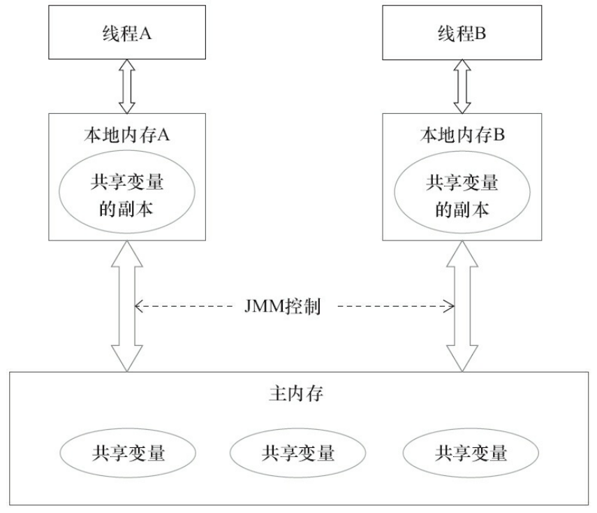
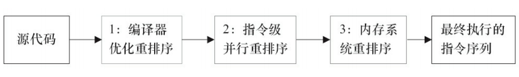
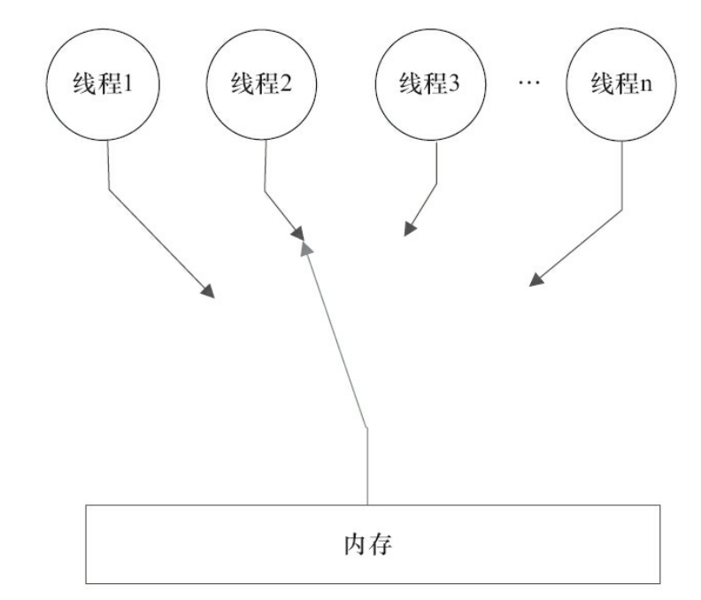

# java并发编程学习笔记

  * [1 影响线程并发性的因素](#1-%E5%BD%B1%E5%93%8D%E7%BA%BF%E7%A8%8B%E5%B9%B6%E5%8F%91%E6%80%A7%E7%9A%84%E5%9B%A0%E7%B4%A0)
    * [1\.1 上下文切换](#11-%E4%B8%8A%E4%B8%8B%E6%96%87%E5%88%87%E6%8D%A2)
    * [1\.2 死锁](#12-%E6%AD%BB%E9%94%81)
    * [1\.3 资源限制](#13-%E8%B5%84%E6%BA%90%E9%99%90%E5%88%B6)
  * [2 并发机制的底层实现原理](#2-%E5%B9%B6%E5%8F%91%E6%9C%BA%E5%88%B6%E7%9A%84%E5%BA%95%E5%B1%82%E5%AE%9E%E7%8E%B0%E5%8E%9F%E7%90%86)
    * [2\.1 volatile](#21-volatile)
    * [2\.2 synchronized](#22-synchronized)
      * [2\.2\.1 Java对象头](#221-java%E5%AF%B9%E8%B1%A1%E5%A4%B4)
      * [2\.2\.2 锁的升级与对比](#222-%E9%94%81%E7%9A%84%E5%8D%87%E7%BA%A7%E4%B8%8E%E5%AF%B9%E6%AF%94)
    * [2\.3 原子操作](#23-%E5%8E%9F%E5%AD%90%E6%93%8D%E4%BD%9C)
      * [2\.3\.1 处理器实现原子操作](#231-%E5%A4%84%E7%90%86%E5%99%A8%E5%AE%9E%E7%8E%B0%E5%8E%9F%E5%AD%90%E6%93%8D%E4%BD%9C)
      * [2\.3\.2 Java实现原子操作](#232-java%E5%AE%9E%E7%8E%B0%E5%8E%9F%E5%AD%90%E6%93%8D%E4%BD%9C)
  * [3 Java内存模型](#3-java%E5%86%85%E5%AD%98%E6%A8%A1%E5%9E%8B)
    * [3\.1 Java内存模型基础](#31-java%E5%86%85%E5%AD%98%E6%A8%A1%E5%9E%8B%E5%9F%BA%E7%A1%80)
      * [3\.1\.1 并发模型的两个关键问题](#311-%E5%B9%B6%E5%8F%91%E6%A8%A1%E5%9E%8B%E7%9A%84%E4%B8%A4%E4%B8%AA%E5%85%B3%E9%94%AE%E9%97%AE%E9%A2%98)
      * [3\.1\.2 Java内存模型的抽象结构](#312-java%E5%86%85%E5%AD%98%E6%A8%A1%E5%9E%8B%E7%9A%84%E6%8A%BD%E8%B1%A1%E7%BB%93%E6%9E%84)
      * [3\.1\.3 源代码到指令序列的重排序](#313-%E6%BA%90%E4%BB%A3%E7%A0%81%E5%88%B0%E6%8C%87%E4%BB%A4%E5%BA%8F%E5%88%97%E7%9A%84%E9%87%8D%E6%8E%92%E5%BA%8F)
      * [3\.1\.4 并发编程模型的分类](#314-%E5%B9%B6%E5%8F%91%E7%BC%96%E7%A8%8B%E6%A8%A1%E5%9E%8B%E7%9A%84%E5%88%86%E7%B1%BB)
      * [3\.1\.5 happens\-before简介](#315-happens-before%E7%AE%80%E4%BB%8B)
    * [3\.2 重排序](#32-%E9%87%8D%E6%8E%92%E5%BA%8F)
      * [3\.2\.1 数据依赖性](#321-%E6%95%B0%E6%8D%AE%E4%BE%9D%E8%B5%96%E6%80%A7)
      * [3\.2\.2 as\-if\-serial语义](#322-as-if-serial%E8%AF%AD%E4%B9%89)
      * [3\.2\.3 程序顺序规则](#323-%E7%A8%8B%E5%BA%8F%E9%A1%BA%E5%BA%8F%E8%A7%84%E5%88%99)
      * [3\.2\.4 重排序对多线程的影响](#324-%E9%87%8D%E6%8E%92%E5%BA%8F%E5%AF%B9%E5%A4%9A%E7%BA%BF%E7%A8%8B%E7%9A%84%E5%BD%B1%E5%93%8D)
    * [3\.3 顺序一致性](#33-%E9%A1%BA%E5%BA%8F%E4%B8%80%E8%87%B4%E6%80%A7)
      * [3\.3\.1 数据竞争与顺序一致性](#331-%E6%95%B0%E6%8D%AE%E7%AB%9E%E4%BA%89%E4%B8%8E%E9%A1%BA%E5%BA%8F%E4%B8%80%E8%87%B4%E6%80%A7)
      * [3\.3\.2 顺序一致性内存模型](#332-%E9%A1%BA%E5%BA%8F%E4%B8%80%E8%87%B4%E6%80%A7%E5%86%85%E5%AD%98%E6%A8%A1%E5%9E%8B)

## 1 影响线程并发性的因素

### 1.1 上下文切换

**1. 概念**

CPU在执行A任务后且在切换到B任务前，会保存A任务的状态，以便下次切回A任务时可以加载到这个任务的状态，这个从保存到再加载的过程就是上下文切换。

**2. 测试工具**

- Lmbench3 可以测量上下文切换的时长（工具）
- vmstat 可以测量上下文切换的次数（linux 命令）

**3. 优化方案**

减少上下文切换的优化方案：

- 无锁并发编程（如将数据的ID按照Hash算法取模分段，不同线程处理不同段的数据）
- CAS 算法（Atomic包使用CAS算法更新数据，无需加锁）
- 使用最少线程，避免创建不需要的线程
- 使用协程：单线程里实现多任务的调度，并再单线程里维持多个任务间的切换

### 1.2 死锁

**1. 概念**

两个或两个以上的线程在执行过程中，由于竞争资源或者由于彼此通信而造成的一种循环阻塞的现象。

**2. 优化方案**

避免死锁的方式：

- 避免一个线程同时获取多个锁
- 避免一个线程在锁内同时占用多个资源，尽量保证每个锁只占用一个资源
- 使用定时锁时，用 lock.tryLock(timeout)来替代使用内部锁机制
- 数据库锁的加锁和解锁必须在一个数据库连接里，否则会出现解锁失败的情况

### 1.3 资源限制

**1. 概念**

程序的执行速度受限于计算机硬件资源或软件资源。

**2. 优化方案**

- 硬件资源限制：搭建服务器集群或使用ODPS、Hadoop，不同机器处理不同数据
- 软件资源限制：使用资源池将资源复用

## 2 并发机制的底层实现原理

### 2.1 volatile

**1. 概念**

Java 线程内存模型将确保所有线程看到 volatile 修饰的变量的值是一致的。

**2. 底层实现原理**

- 被 volatile 修饰的共享变量进行写操作时汇编代码中会额外增加 lock 前缀指令。
- lock 前缀指令在多处理器下的作用：
  - 将当前处理器缓存行的数据写回到系统内存
  - 此写回内存操作会使其他CPU里缓存的该内存地址数据失效（缓存一致性协议 MESI）

> 缓存一致性协议：每个处理器通过嗅探在总线上传播的数据来检查自己缓存的值是否过期，当处理器发现自己缓存行对应的内存地址被修改，就会将当前处理器的缓存行设置成无效状态，当处理器对这个数据进行修改操作的时候，会重新从系统内存中把数据读到处理器缓存里。
>
> - M（modified）：代表该缓存行中的内容被修改了，并且该缓存行只被缓存在该CPU中；
> - E（exclusive）：代表该缓存行对应内存中的内容只被该CPU缓存，其他CPU没有缓存该缓存对应内存行中的内容；
> - S（shared）：该状态意味着数据不止存在本地CPU缓存中，还存在别的CPU的缓存中；
> - I（invalid）：代表该缓存行中的内容时无效的。

**3. 优化方案**

- 追加到64字节优化队列出队和入队的性能

> 不能使用此方案的两个场景：
>
> ①缓存行非64字节宽的处理器下
>
> ②共享变量不会被频繁地写

### 2.2 synchronized

**1. 表现形式**

- 对普通同步方法：锁是当前实例对象
- 对静态同步方法：锁是当前类的Class对象
- 对同步方法块：锁是Synchronized括号里配置的对象

**2. synchronized底层实现原理**

JVM 中的实现原理：

进入和退出 monitor 对象来实现方法同步和代码块同步。

- 代码块同步：使用 monitorenter 和 monitorexit 指令实现
- 方法同步：**（实现细节待补充）**但同样可用代码块同步指令来实现

> 代码编译后，monitorenter 指令插入到同步代码块的开始位置，monitorexit 插入到方法结束处和异常处，JVM 保证每个 monitorenter 都有对应的 monitorexit 与之配对。
>
> 每个对象关联一个 monitor，monitor被持有表示对象处于锁定状态。所以线程执行到 monitorenter 指令时会尝试获得对象对应的 monitor 的所有权，即尝试获得对象锁。

#### 2.2.1 Java对象头

**1. 结构**

对象头长度：

- 数组类型：3字宽（word）
- 非数组类型：2字宽

> 1字宽在32位系统中为4字节，在64位系统中为8字节。

| 长度     | 内容                   | 说明                           |
| -------- | ---------------------- | ------------------------------ |
| 32/64bit | Mark Word              | 存储对象的 HashCode 或锁信息等 |
| 32/64bit | Class Metadata Address | 存储对象类型数据的指针         |
| 32/64bit | Array length           | 数组的长度（对象是数组时）     |

**2. Mark Word**

1）存储结构：

- 对象的 HashCode
- 分代年龄
- 锁标记位

Mark Word 在32位系统下，默认存储结构如下表：

| 锁状态   | 25bit           | 4bit         | 1bit 是否为偏向锁 | 2bit 锁标志位 |
| -------- | --------------- | ------------ | ----------------- | ------------- |
| 无锁状态 | 对象的 HashCode | 对象分代年龄 | 0                 | 01            |

Mark Word 在64位系统下，默认存储结构如下表：

| 锁状态 | 25bit             | 31bit         | 1bit     | 4bit     | 1bit         | 2bit     |
| ------ | ----------------- | ------------- | -------- | -------- | ------------ | -------- |
| 描述   |                   |               | cms_free | 分代年龄 | 是否为偏向锁 | 锁标志位 |
| 无锁   | unused            | HashCode      |          |          | 0            | 01       |
| 偏向锁 | ThreadID（54bit） | Epoch（2bit） |          |          | 1            | 01       |

2）状态变化

Mark Word 可变化为存储以下4种数据：

| 锁状态   | 29bit                                            | 1bit 是否为偏向锁 | 2bit 锁标志位 |
| -------- | ------------------------------------------------ | ----------------- | ------------- |
| 轻量级锁 | 指向栈中锁记录的指针（30bit）                    |                   | 00            |
| 重量级锁 | 指向互斥量（重量级锁）的指针（30bit）            |                   | 10            |
| GC 标记  | 空（30bit）                                      |                   | 11            |
| 偏向锁   | 线程ID（23bit）、Epoch（2bit）、分代年龄（4bit） | 1                 | 01            |

#### 2.2.2 锁的升级与对比

JDK 1.6 后锁有4种状态：

**无锁状态 → 偏向锁状态 → 轻量级锁状态 → 重量级锁状态**

**锁只能升级不能降级，目的时提高获得锁和释放锁的效率。**

**1. 偏向锁**

1）流程

线程1表示偏向锁的初始化流程，线程2表示偏向锁撤销流程。

2）偏向锁初始化

①检查对象头：线程访问同步代码块时，检查对象头的 Mark Word 中是否存储了当前线程的偏向锁，是则初始化锁

②检查偏向锁标识：否则检查 Mark Word 中的偏向锁标识是否为1，即是否表示当前为偏向锁，是则初始化锁

③CAS：否则使用 CAS 竞争替换 Mark Word

> 线程访问同步代码块成功时，会使对象头和栈帧中的所记录里存储偏向锁指向当前线程 ID，以后再次进入时则无需 CAS 来加锁和解锁。

3）偏向锁的撤销

**前置条件：其他线程竞争偏向锁时，持有偏向锁的线程才会释放锁。**

①暂停线程：等待全局安全点（此刻无正在执行的字节码）暂停持有偏向锁的线程

②检查并解锁线：程检查此线程是否存活，不存活则将对象头设置为无锁状态；存活则解锁，将线程 ID 设为空

③恢复线程：恢复暂停的线程

**2. 轻量级锁**

1）流程

自旋会消耗 CPU，为避免无用的自旋（如获得锁的线程被阻塞）升级为重量级锁。

> 重量级锁状态下，其他线程试图获取锁时会被阻塞，等持有锁的线程释放锁后会唤醒这些线程。

2）轻量级加锁

①创建并复制：线程访问同步代码块时，JVM 在当前线程的栈帧中创建存储锁记录的空间，复制 Mark Word：复制对象头中的 Mark Word 到锁记录中（Displaced Mark Word）

②CAS：线程使用 CAS 将对象头中的 Mark Word 替换为指向锁记录的指针，成功则加锁

③自旋：失败则使用自旋来获取锁

3）轻量级锁解锁

①使用原子的 CAS 操作将 Displaced Mark Word 替换回对象头，成功则解锁

②失败则膨胀成重量级锁

**3. JVM 参数**

- `-XX:BiasedLokcingStartupDelay=0` 关闭启动偏向锁时的延迟激活时间
- `-XX:-UseBiasedLocking=false` 关闭偏向锁，程序默认进入轻量级锁状态

**4. 锁对比**

| 锁       | 优点                                                         | 缺点                                           | 适用场景                             |
| -------- | ------------------------------------------------------------ | ---------------------------------------------- | ------------------------------------ |
| 偏向锁   | 加锁和解锁无需额外消耗，和执行非同步方法相比仅存在纳秒级差距 | 若线程间存在锁竞争，则会带来额外的锁撤销的消耗 | 只有一个线程访问同步块的场景         |
| 轻量级锁 | 竞争的线程不会阻塞，提高程序的响应速度                       | 若始终得不到锁竞争的线程，使用自旋会消耗 CPU   | 追求响应时间。同步块执行速度个非常快 |
| 重量级锁 | 线程竞争不使用自旋，不会消耗 CPU                             | 线程阻塞，响应时间缓慢                         | 追求吞吐量，同步块执行时间较长       |

### 2.3 原子操作

**1. 概念**

不可被中断的一个或一系列操作。

**2. 术语**

- 缓存行（Cache line）：缓存的最小操作单位

- 比较并交换（CAS，Compare and Swap）：操作时需要输入一个旧值（操作前的期望值）和一个新值，操作前先比较旧值是否变化，无变化则替换成新值；有变化则不交换

- CPU 流水线（CPU pipeline）：CPU 中5 ~ 6个不同功能的电路单元组成一条流水线，将一条 X86 指令分成5 ~ 6步后再由这些电路分别执行，实现在一个 CPU 时钟周期完成一条指令，以此来提高 CPU 运算速度

- 内存顺序冲突（Memory order violation）：通常由假共享引起，假共享是指多个 CPU 同时修改一同一个缓存行的不同部分而引起其中一个 CPU 的操作无效

  > 出现内存顺序冲突时，CPU 必须清空流水线。

#### 2.3.1 处理器实现原子操作

**1. 实现方式**

32位 IA-32 处理器：

> 处理器会自动保证基本的内存操作的原子性，因为处理器读取一个字节时，其他处理器则不能访问这个字节的内存地址。
>
> 无法保证原子性的操作，如跨总线宽度、跨多个缓存行和跨页表的访问。

**2. 实现原理**

1）总线锁定机制

处理器提供一个 LOCK# 信号，当一个处理器在总线上输出此信号时，其他处理器的请求将被阻塞，此时当前处理器可以独占共享内存。

> i++ 问题：经典的读改写操作，即多个处理器同时对共享变量进行读改写操作，操作完导致共享变量的值与期望不一致，如两个处理器同时读到 i 的值为1，然后同时处理 i = i  + 1，期望结果是3，结果处理完是2。

2）缓存锁定机制

内存区域如果被缓存在处理器的缓存行中，且在 Lock 操作期间被锁定，当它执行锁操作回写到内存时，处理器不在总线上声明 LOCK# 信号，而是修改内部的内存地址，并允许它的缓存一致性机制来保证操作的原子性

> 频繁使用的内存会缓存在处理器的 L1、L2 和 L3 高速缓存里。
>
> 缓存一致性机制会阻止同时修改由两个以上处理器缓存的内存区域数据，当其他处理器回写已被锁定的缓存行数据时，会使缓存行无效。

**3. 特殊场景**

不使用缓存锁定，而使用总线锁定的场景：

- 操作数据不能被缓存在处理器内部，或操作的数据跨多个缓存行时
- 处理器不支持缓存锁定情况（如 Intel 486 和 Pentium 处理器）

**4. 实现 Lock 前缀的指令**

这些指令操作的内存区域会加锁，其他处理器无法同时访问：

- 位测试和修改指令：BTS、BTR、BTC
- 交换指令：XADD、CMPXCHG
- 操作数和逻辑指令：ADD、OR

#### 2.3.2 Java实现原子操作

**1. 实现方式**

- 循环 CAS
- 锁机制

**2. 循环 CAS**

1）实现原理

JVM 中的 CAS 底层是利用处理器的 CMPXCHG指令实现的，原理是循环进行 CAS 操作直到成功为止。

2）CAS 三大问题

- ABA 问题（  一个值A变为B后再变为A，CAS 检查此操作值时，视为无变化）
- 循环时间长开销大（长时间的自旋 CAS 不成功会消耗大量 CPU 资源）
- 只能保证一个共享变量的原子操作（多个共享变量无法同时循环 CAS）

3）问题解决方案

①ABA问题：

加版本号。

> JDK1.5 后 Atomic 包中提供 AtomicStampedReference 类来解决 ABA 问题，此类的 compareAndSet 方法会同时检查新旧引用和预期标志值，全部相等则更新。

②循环时间长开销大：

pause指令。

> pause 指令作用：①延迟流水线执行指令（de-pipeline）使 CPU 不会消耗过多的执行资源；②避免再退出循环时因内存顺序冲突而引起 CPU 流水线被清空（CPU pipeline Flush），提高 CPU 的执行效率。

③只能保证一个共享变量的原子操作：

- 多个共享变量合并为一个共享变量来操作

> JDK1.5 后提供了 AtomicReference 类，多个共享变量可放入一个对象里来 CAS。

- 锁

> 只有获得锁的线程才能操作锁定的内存区域。
>
> **除了偏向锁**，JVM 实现锁的方式都采用了循环 CAS（进入同步块时 CAS 获得锁，退出时 CAS 释放锁）。

**3. 锁机制**

见章节 2.2.2 锁的升级与对比。

## 3 Java内存模型

### 3.1 Java内存模型基础

#### 3.1.1 并发模型的两个关键问题

**1. 问题**

- 线程间的通信（线程之间交换信息的机制）
- 线程间的同步（控制不同线程间操作发生相对顺序的机制）

**2. 解决方案**

1）共享内存

线程之间共享程序的公共状态，通过写-读内存中的公共状态进行

- 隐式通信
- 显式同步

2）消息传递

线程之间没有公共状态，通过发送消息进行

- 显式通信
- 隐式同步（因为消息的发送必须在消息的接收之前）

#### 3.1.2 Java内存模型的抽象结构

**1. 概念**

Java 内存模型（JMM）定义了线程和主内存之间的抽象关系。

**2. 结构**

- 主内存：存储线程之间的共享变量
- 线程私有内存（抽象概念，非真实存在）：存储该线程读/写共享变量的副本

> 线程私有内存涵盖了缓存、写缓冲区、寄存器、其他硬件和编译器优化。

**3. 作用对象**

堆内存中的：

- 实例域
- 静态域
- 数组元素

> 局部变量、方法定义参数和异常处理器参数不会在线程之间共享，即没有内存可见性问题。

**4. 作用**

决定一个线程对共享变量的写入结果，何时对另一个线程可见，提供内存可见性保证。

#### 3.1.3 源代码到指令序列的重排序

**1. 目的**

提高程序的执行性能。

> 编译器和处理器对指令做重排序。

**2. 分类**

- 编译器优化的重排序：编译器不改变单线程程序语义的前提下，重新安排语句的执行顺序
- 指令级并行的重排序：现代处理器采用指令级并行技术（Instruction-Level Parallelism，ILP）来将多条指令重叠执行（不存在数据依赖性时，处理器可以重排序机器指令）
- 内存系统的重排序：处理器使用缓存和读/写缓冲区，使得加载和存储操作看上去可能是乱序执行

**3. 源码重排序流程**

- 1 属于编译器重排序
- 2、3 属于处理器重排序
- 重排序会导致多线程程序出现内存可见性问题
- JMM 提供一致的内存可见性保证
  - 对于编译器，JMM 禁止特定类型的编译器重排序
  - 对于处理器，JJMM 要求 Java 编译器在生成指令序列时，插入特定类型的内存屏障（Memory Barriers）指令，来禁止特定类型的处理器重排序

#### 3.1.4 并发编程模型的分类

**1. 写缓冲区**

1）作用

- 临时保存向内存写入的数据
- 保证指令流水线持续运行

2）优点

- 避免由于处理器停顿，等待向内存写入数据而产生的延迟
- 减少对内存总线的占用：以批处理的方式刷新写缓冲区，合并写缓冲区中对同意内存地址的多次写

3）缺点

- 处理器对内存的读/写顺序可能与实际不一致：每个处理器的写缓冲区，仅对该处理器可见

**2. 重排序规则**

- 常见处理器都允许写/读重排序
- 常见处理器都不允许对存在数据依赖的操作重排序
- 使用写缓冲区的处理器，仅语序写/读重排序

**3. 内存屏障**

| 屏障类型           | 指令示例                 | 说明                                                         |
| ------------------ | ------------------------ | ------------------------------------------------------------ |
| LoadLoad Barries   | Load1;LoadLoad;Load2     | 确保 Load1 数据的装载先于 Load2 及所有后续装载指令的装载     |
| StoreStore Barries | Store1;StoreStore;Store2 | 确保 Store1 数据对其他处理器可见（刷新到内存）先于 Store2 及所有后续存储指令的存储 |
| LoadStore Barries  | Load1;LoadStore;Store2   | 确保 Load1 数据装载先于 Store2 及所有后续的存储指令刷新到内存 |
| StoreLoad Barries  | Store1;StoreLoad;Load2   | 确保 Store1 数据对其他处理器变得可见（刷新到内存） 先于 Load2 及所有后续装载指令的装载；StoreLoad Barries 会使该屏障之前的所有内存访问指令（存储和装载指令）完成之后，再执行该屏障之后的内存访问指令 |

StoreLoad Barries 是 “全能型” 屏障，同时具有其他三个屏障的效果。

> 现代大部分处理器支持 StoreLoad Barries  屏障，但是执行该屏障的开销较大，因为处理器需要把写缓冲区中的数据全部刷新到内存中（Buffer Fully Flush）。

#### 3.1.5 happens-before简介

**1. 概念**

JMM 中，如果一个操作执行的结果需要对另一个操作可见，那么这两个操作之间必须存在 happens-before 关系。

> 这两个操作可在一个线程内，也可以在不同线程间。

**2. 特性**

- 程序顺序规则：一个线程中的每个操作，happens-before 于该线程中的人一后续操作
- 监视器规则：一个锁的解锁，happens-before 于随后对找个锁的加锁
- volatile变量规则：一个volatile 域的写，happens-before 于人一后续对找个 volatile 域的读
- 传递性：若 A happens-before B，且 B happens-before C，那么 A happens-before C

> 两个操作间具有 happens-before 关系，不代表前一个操作必须在后一个操作之前执行，而仅仅要求前一个操作的执行结果对后一个操作可见，且前一个操作按顺序排在第二个操作之前。
>
> 一个 happens-before 规则对应一个或多个编译器和处理器重排序规则。

### 3.2 重排序

重排序是指编译器和处理器为优化程序性能，对指令序列进行重新排序的一种手段。

#### 3.2.1 数据依赖性

**1. 概念**

如果两个操作访问同一个变量，且这两个操作中有一个为写操作，则这两个操作之间存在数据依赖性。

**2. 分类**

- 写后读
- 写后写
- 读后写

> 这三种操作，只要重排序，程序的执行结果就会改变。
>
> 数据依赖性只针对单个处理器中执行的指令序列、单个线程中执行的操作；而不同处理器之间、不同的数据依赖性不被编译器和处理器考虑。

#### 3.2.2 as-if-serial语义

as-if-serial语义指，无论怎么重排序，单线程中的执行结果都不能被改变。

> 编译器、runtime和处理器必须遵守 as-if-serial 语义，即不会对存在数据依赖关系的操作做重排序。

#### 3.2.3 程序顺序规则

在计算机中，软件技术和硬件技术有一个共同的目标：在不改变程序执行结果的前提下，尽可能提高并行度。

#### 3.2.4 重排序对多线程的影响

编译器和处理器会采用猜测（Speculation）执行，来克服控制相关性对并行度的影响。

> 多线程程序中，对存在控制依赖的操作重排序，可能会改变程序的执行结果

### 3.3 顺序一致性

#### 3.3.1 数据竞争与顺序一致性

**1. 概念**

顺序一致性：程 序的执行结果与该程序在顺序一致性内存模型中的执行结果相同。

**2. 常用同步原语**

- synchronized
- volatile
- final

#### 3.3.2 顺序一致性内存模型

**1. 概念**

顺序一致性模型有一个单一的全局内存，这个内存通过一个左右摆动的开关，可以连接到任意一个线程，同时每一个线程必须按照程序的顺序来执行内存读/写操作。

**2. 特性**

- 一个线程中的所有操作必须按照程序的顺序来执行
- 所有线程都只能看到一个单一的操作执行顺序

> 顺序一致性内存模型中，每个操作都必须原子执行，且立刻对所有线程可见。

