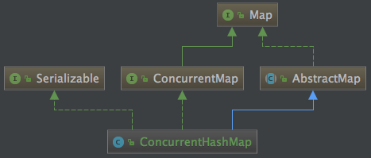
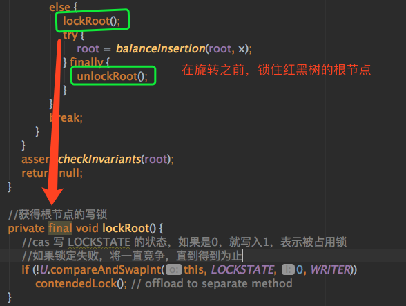
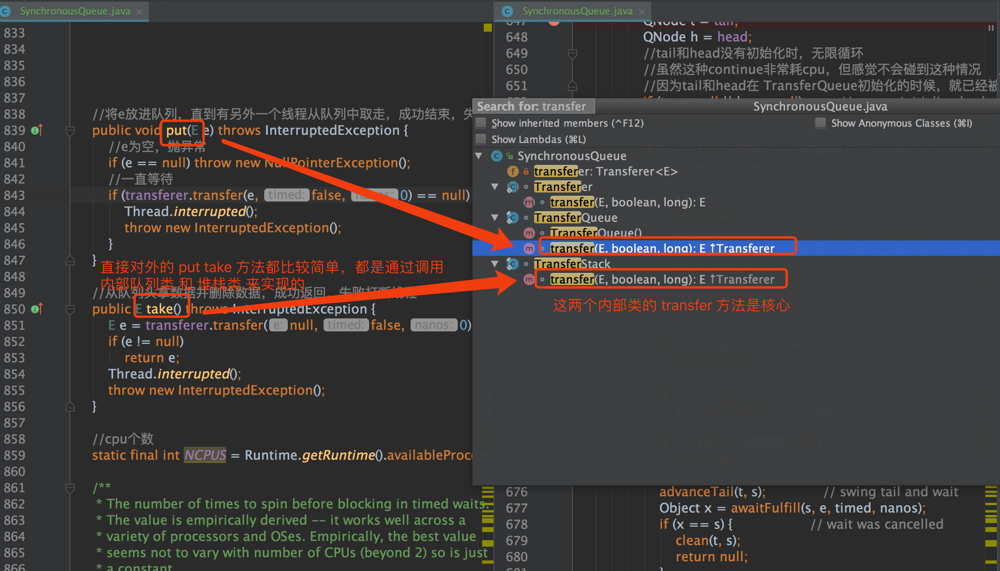
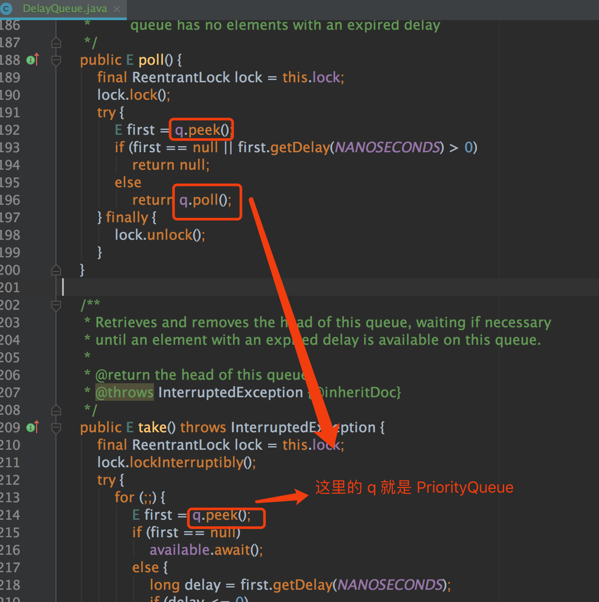
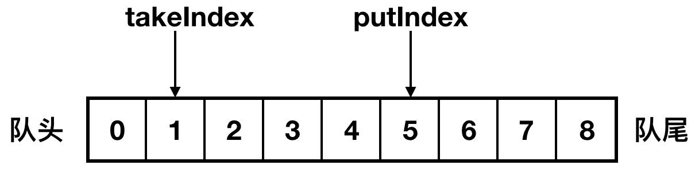
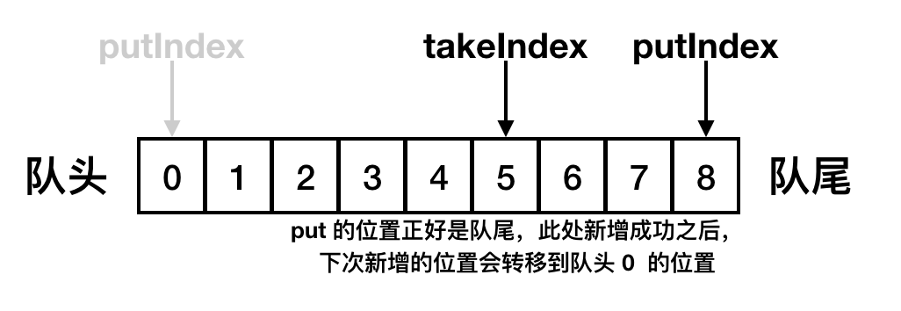
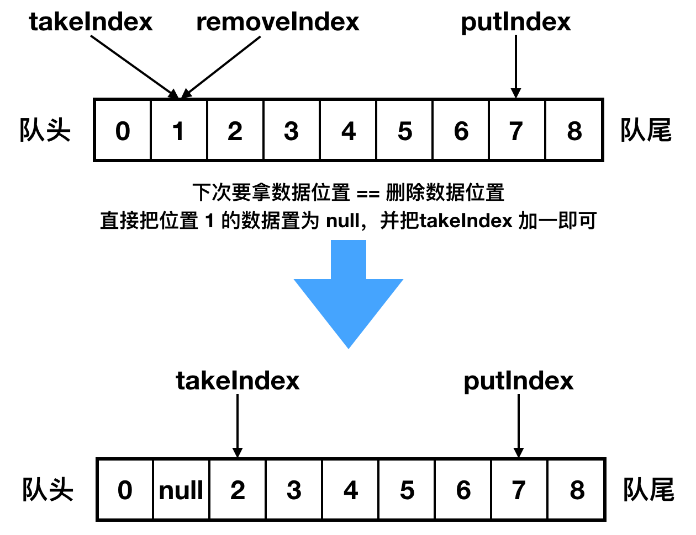
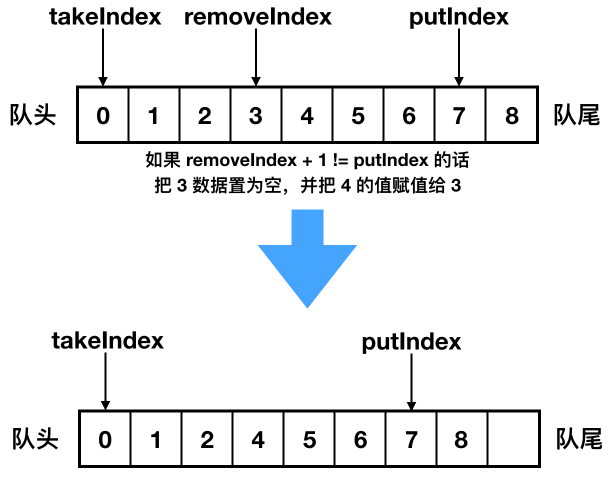
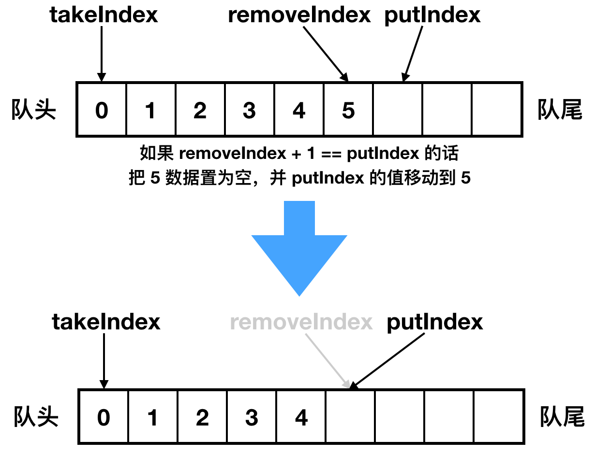

# 并发集合和队列总结

  * [1 List](#1-list)
    * [1\.1 CopyOnWriteArrayList](#11-copyonwritearraylist)
      * [1\.1\.1 整体架构](#111-%E6%95%B4%E4%BD%93%E6%9E%B6%E6%9E%84)
      * [1\.1\.2 新增数据](#112-%E6%96%B0%E5%A2%9E%E6%95%B0%E6%8D%AE)
      * [1\.1\.3 删除数据](#113-%E5%88%A0%E9%99%A4%E6%95%B0%E6%8D%AE)
      * [1\.1\.4 其他方法](#114-%E5%85%B6%E4%BB%96%E6%96%B9%E6%B3%95)
  * [2 Map](#2-map)
    * [2\.1 ConcurrentHashMap](#21-concurrenthashmap)
      * [2\.1\.1 整体架构](#211-%E6%95%B4%E4%BD%93%E6%9E%B6%E6%9E%84)
      * [2\.1\.2 新增节点](#212-%E6%96%B0%E5%A2%9E%E8%8A%82%E7%82%B9)
      * [2\.1\.3 获取节点数据](#213-%E8%8E%B7%E5%8F%96%E8%8A%82%E7%82%B9%E6%95%B0%E6%8D%AE)
  * [3 Queue](#3-queue)
    * [3\.1 LinkedBlockingQueue](#31-linkedblockingqueue)
      * [3\.1\.1 整体架构](#311-%E6%95%B4%E4%BD%93%E6%9E%B6%E6%9E%84)
      * [3\.1\.2 阻塞新增](#312-%E9%98%BB%E5%A1%9E%E6%96%B0%E5%A2%9E)
      * [3\.1\.3 阻塞删除](#313-%E9%98%BB%E5%A1%9E%E5%88%A0%E9%99%A4)
      * [3\.1\.4 适用场景](#314-%E9%80%82%E7%94%A8%E5%9C%BA%E6%99%AF)
    * [3\.2 SynchronousQueue](#32-synchronousqueue)
      * [3\.2\.1 整体架构](#321-%E6%95%B4%E4%BD%93%E6%9E%B6%E6%9E%84)
      * [3\.2\.2 结构细节](#322-%E7%BB%93%E6%9E%84%E7%BB%86%E8%8A%82)
      * [3\.2\.3 非公平的堆栈](#323-%E9%9D%9E%E5%85%AC%E5%B9%B3%E7%9A%84%E5%A0%86%E6%A0%88)
      * [3\.2\.4 公平的队列](#324-%E5%85%AC%E5%B9%B3%E7%9A%84%E9%98%9F%E5%88%97)
    * [3\.3 DelayQueue](#33-delayqueue)
      * [3\.3\.1 整体架构](#331-%E6%95%B4%E4%BD%93%E6%9E%B6%E6%9E%84)
      * [3\.3\.2 演示demo](#332-%E6%BC%94%E7%A4%BAdemo)
      * [3\.3\.3 放数据](#333-%E6%94%BE%E6%95%B0%E6%8D%AE)
      * [3\.3\.4 取数据](#334-%E5%8F%96%E6%95%B0%E6%8D%AE)
    * [3\.4 ArrayBlockingQueue](#34-arrayblockingqueue)
      * [3\.4\.1 整体架构](#341-%E6%95%B4%E4%BD%93%E6%9E%B6%E6%9E%84)
      * [3\.4\.2 新增数据](#342-%E6%96%B0%E5%A2%9E%E6%95%B0%E6%8D%AE)
      * [3\.4\.3 获取数据](#343-%E8%8E%B7%E5%8F%96%E6%95%B0%E6%8D%AE)
      * [3\.4\.4 删除数据](#344-%E5%88%A0%E9%99%A4%E6%95%B0%E6%8D%AE)

## 1 List

### 1.1 CopyOnWriteArrayList

CopyOnWriteArrayList 底层数据结构是个数组。

#### 1.1.1 整体架构

**1. 特征**

- 线程安全的，多线程环境下可以直接使用，无需加锁
- 通过锁 + 数组拷贝 + volatile 关键字保证了线程安全
- 每次数组操作，都会把数组拷贝一份出来，在新数组上进行操作，操作成功之后再赋值回去

**2. 对数组的操作步骤**

①加锁；

②从原数组中拷贝出新数组；

③在新数组上进行操作，并把新数组赋值给数组容器；

④解锁。

**3. 实现**

1）实现方式

CopyOnWriteArrayList 利用锁 + 数组拷贝 + volatile 关键字保证了 List 的线程安全。

> CopyOnWriteArrayList 的底层数组被 volatile 关键字修饰，即一旦数组被修改，其它线程立马能够感知到。`private transient volatile Object[] array;`

2）实现原理

- 加锁：保证同一时刻数组只能被一个线程操作；
- 数组拷贝：保证数组的内存地址被修改，修改后触发 volatile 的可见性，其它线程可以立马知道数组已经被修改；
- volatile：值被修改后，其它线程能够立马感知最新值。

**4. 类注释**

- 所有的操作都是线程安全的，因为操作都是在新拷贝数组上进行的；
- 数组的拷贝虽然有一定的成本，但往往比一般的替代方案效率高；
- 迭代过程中，不会影响到原来的数组，也不会抛出 ConcurrentModificationException 异常。

#### 1.1.2 新增数据

**1. add 尾部源码**

1）具体源码

操作的思路按照上述的四步，将元素添加到数组的尾部。

````java
// 添加元素到数组尾部
public boolean add(E e) {
    final ReentrantLock lock = this.lock;
    // 加锁
    lock.lock();
    try {
        // 得到所有的原数组
        Object[] elements = getArray();
        int len = elements.length;
        // 拷贝到新数组里面，新数组的长度是 + 1 的，因为新增会多一个元素
        Object[] newElements = Arrays.copyOf(elements, len + 1);
        // 在新数组中进行赋值，新元素直接放在数组的尾部
        newElements[len] = e;
        // 替换掉原来的数组
        setArray(newElements);
        return true;
    // finally 里面释放锁，保证即使 try 发生了异常，仍然能够释放锁   
    } finally {
        lock.unlock();
    }
}
````

2）源码思路

整个 add 过程都是在持有锁的状态下进行的，通过加锁，来保证同一时刻只能有一个线程能够对同一个数组进行 add 操作。

除了加锁之外，还会从老数组中创建出一个新数组，然后把老数组的值拷贝到新数组上。

3）加锁了仍然拷贝数组的原因

- volatile 关键字修饰的是数组，如果我们简单的在原来数组上修改其中某几个元素的值，是无法触发可见性的，我们必须通过修改数组的内存地址才行，也就说要对数组进行重新赋值才行。
- 在新的数组上进行拷贝，对老数组没有任何影响，只有新数组完全拷贝完成之后，外部才能访问到，降低了在赋值过程中，老数组数据变动的影响。

**2. add 指定位置源码**

1）指定位置添加元素的关键源码

````java
// len：数组的长度、index：插入的位置
int numMoved = len - index;
// 如果要插入的位置正好等于数组的末尾，直接拷贝数组即可
if (numMoved == 0)
    newElements = Arrays.copyOf(elements, len + 1);
else {
// 如果要插入的位置在数组的中间，就需要拷贝 2 次
// 第一次从 0 拷贝到 index。
// 第二次从 index+1 拷贝到末尾。
    newElements = new Object[len + 1];
    System.arraycopy(elements, 0, newElements, 0, index);
    System.arraycopy(elements, index, newElements, index + 1,
         numMoved);
}
// index 索引位置的值是空的，直接赋值即可。
newElements[index] = element;
// 把新数组的值赋值给数组的容器中
setArray(newElements);
````

2）源码思路

当插入的位置正好处于末尾时，只需要拷贝一次，当插入的位置处于中间时，此时我们会把原数组一分为二，进行两次拷贝操作。

最后还有个批量新增操作，底层也是拷贝数组的操作。

#### 1.1.3 删除数据

**1. 删除源码**

1）具体源码

````java
// 删除某个索引位置的数据
public E remove(int index) {
    final ReentrantLock lock = this.lock;
    // 加锁
    lock.lock();
    try {
        Object[] elements = getArray();
        int len = elements.length;
        // 先得到老值
        E oldValue = get(elements, index);
        int numMoved = len - index - 1;
        // 如果要删除的数据正好是数组的尾部，直接删除
        if (numMoved == 0)
            setArray(Arrays.copyOf(elements, len - 1));
        else {
            // 如果删除的数据在数组的中间，分三步走
            // 1. 设置新数组的长度减一，因为是减少一个元素
            // 2. 从 0 拷贝到数组新位置
            // 3. 从新位置拷贝到数组尾部
            Object[] newElements = new Object[len - 1];
            System.arraycopy(elements, 0, newElements, 0, index);
            System.arraycopy(elements, index + 1, newElements, index,
                             numMoved);
            setArray(newElements);
        }
        return oldValue;
    } finally {
        lock.unlock();
    }
}
````

2）源码思路

①加锁；

②判断删除索引的位置，从而进行不同策略的拷贝；

③解锁。

**2. 批量删除源码**

1）具体源码

````java
// 批量删除包含在 c 中的元素
public boolean removeAll(Collection<?> c) {
    if (c == null) throw new NullPointerException();
    final ReentrantLock lock = this.lock;
    lock.lock();
    try {
        Object[] elements = getArray();
        int len = elements.length;
        // 说明数组有值，数组无值直接返回 false
        if (len != 0) {
            // newlen 表示新数组的索引位置，新数组中存在不包含在 c 中的元素
            int newlen = 0;
            Object[] temp = new Object[len];
            // 循环，把不包含在 c 里面的元素，放到新数组中
            for (int i = 0; i < len; ++i) {
                Object element = elements[i];
                // 不包含在 c 中的元素，从 0 开始放到新数组中
                if (!c.contains(element))
                    temp[newlen++] = element;
            }
            // 拷贝新数组，变相的删除了不包含在 c 中的元素
            if (newlen != len) {
                setArray(Arrays.copyOf(temp, newlen));
                return true;
            }
        }
        return false;
    } finally {
        lock.unlock();
    }
}
````

2）源码思路

删除源码并不会直接对数组中的元素进行挨个删除，而是先对数组中的值进行循环判断，把不需要删除的数据放到临时数组中，最后临时数组中的数据就是我们不需要删除的数据。

#### 1.1.4 其他方法

**1. indexOf 源码**

indexOf 方法的主要用处是查找元素在数组中的下标位置，如果元素存在就返回元素的下标位置，元素不存在的话返回 -1，不但支持 null 值的搜索，还支持正向和反向的查找。

1）indexOf 正向查找源码

````java
// o：我们需要搜索的元素
// elements：我们搜索的目标数组
// index：搜索的开始位置
// fence：搜索的结束位置
private static int indexOf(Object o, Object[] elements,
                           int index, int fence) {
    // 支持对 null 的搜索
    if (o == null) {
        for (int i = index; i < fence; i++)
            // 找到第一个 null 值，返回下标索引的位置
            if (elements[i] == null)
                return i;
    } else {
        // 通过 equals 方法来判断元素是否相等
        // 如果相等，返回元素的下标位置
        for (int i = index; i < fence; i++)
            if (o.equals(elements[i]))
                return i;
    }
    return -1;
}
````

2）indexOf 使用场景

- 判断元素是否存在时（contains）
- 在删除元素方法中校验元素是否存在时
- indexOf 方法通过一次 for 循环来查找元素

**2. 迭代**

即使 CopyOnWriteArrayList 的结构发生变动了，也不会抛出 ConcurrentModificationException 异常。

1）迭代源码


2）实现原理

CopyOnWriteArrayList 迭代持有的是老数组的引用，而 CopyOnWriteArrayList 每次的数据变动，都会产生新的数组，对老数组的值不会产生影响，所以迭代也可以正常进行。

## 2 Map

### 2.1 ConcurrentHashMap

#### 2.1.1 整体架构

**1. 类注释**

- 所有的操作都是线程安全的，使用时无需再加锁；
- 多个线程同时进行 put、remove 等操作时并不会阻塞，可以同时进行，和 HashTable 不同，HashTable 在操作时，会锁住整个 Map；
- 迭代过程中，即使 Map 结构被修改，也不会抛 ConcurrentModificationException 异常；
- 除了数组 + 链表 + 红黑树的基本结构外，新增了转移节点，是为了保证扩容时的线程安全的节点；
- 提供了很多 Stream 流式方法，如 forEach、search、reduce 等等。

**2. 结构**



ConcurrentHashMap 和 HashMap 两者的相同之处：

- 数组、链表结构几乎相同，底层对数据结构的操作思路是相同的（只是思路相同，底层实现不同）；
- 都实现了 Map 接口，继承了 AbstractMap 抽象类，所以大多数的方法也都是相同的，HashMap 有的方法，ConcurrentHashMap 几乎都有，所以当我们需要从 HashMap 切换到 ConcurrentHashMap 时，无需关心两者之间的兼容问题。

不同之处：

- 红黑树结构略有不同，HashMap 的红黑树中的节点叫做 TreeNode，TreeNode 不仅仅有属性，还维护着红黑树的结构，比如说查找，新增等等；ConcurrentHashMap 中红黑树被拆分成两块，TreeNode 仅仅维护的属性和查找功能，新增了 TreeBin，来维护红黑树结构，并负责根节点的加锁和解锁；
- ConcurrentHashMap 新增了 ForwardingNode （转移）节点，扩容的时候会使用到，通过使用该节点，来保证扩容时的线程安全。

#### 2.1.2 新增节点

**1. put 源码**

1）源码思路

①如果数组为空，初始化，初始化完成之后，走 ②；

②计算当前槽点有没有值，没有值的话，cas 创建，失败继续自旋（for 死循环），直到成功，槽点有值的话，走③；

③如果槽点是转移节点(正在扩容)，就会一直自旋等待扩容完成之后再新增，不是转移节点走④；

④槽点有值的，先锁定当前槽点，保证其余线程不能操作，如果是链表，新增值到链表的尾部，如果是红黑树，使用红黑树新增的方法新增；

⑤新增完成之后 check 需不需要扩容，需要的话去扩容。

2）具体源码

````java
final V putVal(K key, V value, boolean onlyIfAbsent) {
    if (key == null || value == null) throw new NullPointerException();
    //计算hash
    int hash = spread(key.hashCode());
    int binCount = 0;
    for (Node<K,V>[] tab = table;;) {
        Node<K,V> f; int n, i, fh;
        //table是空的，进行初始化
        if (tab == null || (n = tab.length) == 0)
            tab = initTable();
        //如果当前索引位置没有值，直接创建
        else if ((f = tabAt(tab, i = (n - 1) & hash)) == null) {
            //cas 在 i 位置创建新的元素，当 i 位置是空时，即能创建成功，结束for自循，否则继续自旋
            if (casTabAt(tab, i, null,
                         new Node<K,V>(hash, key, value, null)))
                break;                   // no lock when adding to empty bin
        }
        //如果当前槽点是转移节点，表示该槽点正在扩容，就会一直等待扩容完成
        //转移节点的 hash 值是固定的，都是 MOVED
        else if ((fh = f.hash) == MOVED)
            tab = helpTransfer(tab, f);
        //槽点上有值的
        else {
            V oldVal = null;
            //锁定当前槽点，其余线程不能操作，保证了安全
            synchronized (f) {
                //这里再次判断 i 索引位置的数据没有被修改
                //binCount 被赋值的话，说明走到了修改表的过程里面
                if (tabAt(tab, i) == f) {
                    //链表
                    if (fh >= 0) {
                        binCount = 1;
                        for (Node<K,V> e = f;; ++binCount) {
                            K ek;
                            //值有的话，直接返回
                            if (e.hash == hash &&
                                ((ek = e.key) == key ||
                                 (ek != null && key.equals(ek)))) {
                                oldVal = e.val;
                                if (!onlyIfAbsent)
                                    e.val = value;
                                break;
                            }
                            Node<K,V> pred = e;
                            //把新增的元素赋值到链表的最后，退出自旋
                            if ((e = e.next) == null) {
                                pred.next = new Node<K,V>(hash, key,
                                                          value, null);
                                break;
                            }
                        }
                    }
                    //红黑树，这里没有使用 TreeNode,使用的是 TreeBin，TreeNode 只是红黑树的一个节点
                    //TreeBin 持有红黑树的引用，并且会对其加锁，保证其操作的线程安全
                    else if (f instanceof TreeBin) {
                        Node<K,V> p;
                        binCount = 2;
                        //满足if的话，把老的值给oldVal
                        //在putTreeVal方法里面，在给红黑树重新着色旋转的时候
                        //会锁住红黑树的根节点
                        if ((p = ((TreeBin<K,V>)f).putTreeVal(hash, key,
                                                       value)) != null) {
                            oldVal = p.val;
                            if (!onlyIfAbsent)
                                p.val = value;
                        }
                    }
                }
            }
            //binCount不为空，并且 oldVal 有值的情况，说明已经新增成功了
            if (binCount != 0) {
                // 链表是否需要转化成红黑树
                if (binCount >= TREEIFY_THRESHOLD)
                    treeifyBin(tab, i);
                if (oldVal != null)
                    return oldVal;
                //这一步几乎走不到。槽点已经上锁，只有在红黑树或者链表新增失败的时候
                //才会走到这里，这两者新增都是自旋的，几乎不会失败
                break;
            }
        }
    }
    //check 容器是否需要扩容，如果需要去扩容，调用 transfer 方法去扩容
    //如果已经在扩容中了，check有无完成
    addCount(1L, binCount);
    return null;
}
````

**2. put 种保证线程安全的几种方式**

数组初始化时保证线程安全的两种方式：

- 通过自旋来保证一定可以初始化成功；

- 通过 CAS 设置 SIZECTL 变量的值，来保证同一时刻只能有一个线程对数组进行初始化，CAS 成功之后，还会再次判断当前数组是否已经初始化完成，如果已经初始化完成，就不会再次初始化

即通过自旋 + CAS + 双重 check 等手段保证了数组初始化时的线程安全。

````java
//初始化 table，通过对 sizeCtl 的变量赋值来保证数组只能被初始化一次
private final Node<K,V>[] initTable() {
    Node<K,V>[] tab; int sc;
    //通过自旋保证初始化成功
    while ((tab = table) == null || tab.length == 0) {
        // 小于 0 代表有线程正在初始化，释放当前 CPU 的调度权，重新发起锁的竞争
        if ((sc = sizeCtl) < 0)
            Thread.yield(); // lost initialization race; just spin
        // CAS 赋值保证当前只有一个线程在初始化，-1 代表当前只有一个线程能初始化
        // 保证了数组的初始化的安全性
        else if (U.compareAndSwapInt(this, SIZECTL, sc, -1)) {
            try {
                // 很有可能执行到这里的时候，table 已经不为空了，这里是双重 check
                if ((tab = table) == null || tab.length == 0) {
                    // 进行初始化
                    int n = (sc > 0) ? sc : DEFAULT_CAPACITY;
                    @SuppressWarnings("unchecked")
                    Node<K,V>[] nt = (Node<K,V>[])new Node<?,?>[n];
                    table = tab = nt;
                    sc = n - (n >>> 2);
                }
            } finally {
                sizeCtl = sc;
            }
            break;
        }
    }
    return tab;
}
````

**3. 新增槽点值时的线程安全**

为了保证线程安全，做了四处优化：

①通过自旋死循环保证一定可以新增成功。

> 在新增之前，通过 `for (Node<K,V>[] tab = table;;)` 这样的死循环来保证新增一定可以成功，一旦新增成功，就可以退出当前死循环，新增失败的话，会重复新增的步骤，直到新增成功为止。

②当前槽点为空时，通过 CAS 新增。

> 这里的写法非常严谨，没有在判断槽点为空的情况下直接赋值，因为在判断槽点为空和赋值的瞬间，很有可能槽点已经被其他线程赋值了，所以我们采用 CAS 算法，能够保证槽点为空的情况下赋值成功，如果恰好槽点已经被其他线程赋值，当前 CAS 操作失败，会再次执行 for 自旋，再走槽点有值的 put 流程，这里就是自旋 + CAS 的结合。

③当前槽点有值，锁住当前槽点。


> put 时，如果当前槽点有值，就是 key 的 hash 冲突的情况，此时槽点上可能是链表或红黑树，我们通过锁住槽点，来保证同一时刻只会有一个线程能对槽点进行修改。

④红黑树旋转时，锁住红黑树的根节点，保证同一时刻，当前红黑树只能被一个线程旋转。



通过自旋 + CAS + 锁的方式，保证了在各种情况下的新增（不考虑扩容的情况下），都是线程安全的。

**4. 扩容时的线程安全**

ConcurrentHashMap 的扩容时机和 HashMap 相同，都是在 put 方法的最后一步检查是否需要扩容，如果需要则进行扩容。

1）扩容思路

ConcurrentHashMap 的扩容方法是 transfer（从 put 方法的 addCount 方法进去）：

①首先需要把老数组的值全部拷贝到扩容之后的新数组上，先从数组的队尾开始拷贝；

②拷贝数组的槽点时，先把原数组槽点锁住，保证原数组槽点不能操作，成功拷贝到新数组时，把原数组槽点赋值为转移节点；

③此时如果有新数据正好需要 put 到此槽点时，发现槽点为转移节点，就会一直等待，所以在扩容完成之前，该槽点对应的数据是不会发生变化的；

④从数组的尾部拷贝到头部，每拷贝成功一次，就把原数组中的节点设置成转移节点；

⑤直到所有数组数据都拷贝到新数组时，直接把新数组整个赋值给数组容器，拷贝完成。

2）关键源码

````java
// 扩容主要分 2 步，第一新建新的空数组，第二移动拷贝每个元素到新数组中去
// tab：原数组，nextTab：新数组
private final void transfer(Node<K,V>[] tab, Node<K,V>[] nextTab) {
    // 老数组的长度
    int n = tab.length, stride;
    if ((stride = (NCPU > 1) ? (n >>> 3) / NCPU : n) < MIN_TRANSFER_STRIDE)
        stride = MIN_TRANSFER_STRIDE; // subdivide range
    // 如果新数组为空，初始化，大小为原数组的两倍，n << 1
    if (nextTab == null) {            // initiating
        try {
            @SuppressWarnings("unchecked")
            Node<K,V>[] nt = (Node<K,V>[])new Node<?,?>[n << 1];
            nextTab = nt;
        } catch (Throwable ex) {      // try to cope with OOME
            sizeCtl = Integer.MAX_VALUE;
            return;
        }
        nextTable = nextTab;
        transferIndex = n;
    }
    // 新数组的长度
    int nextn = nextTab.length;
    // 代表转移节点，如果原数组上是转移节点，说明该节点正在被扩容
    ForwardingNode<K,V> fwd = new ForwardingNode<K,V>(nextTab);
    boolean advance = true;
    boolean finishing = false; // to ensure sweep before committing nextTab
    // 无限自旋，i 的值会从原数组的最大值开始，慢慢递减到 0
    for (int i = 0, bound = 0;;) {
        Node<K,V> f; int fh;
        while (advance) {
            int nextIndex, nextBound;
            // 结束循环的标志
            if (--i >= bound || finishing)
                advance = false;
            // 已经拷贝完成
            else if ((nextIndex = transferIndex) <= 0) {
                i = -1;
                advance = false;
            }
            // 每次减少 i 的值
            else if (U.compareAndSwapInt
                     (this, TRANSFERINDEX, nextIndex,
                      nextBound = (nextIndex > stride ?
                                   nextIndex - stride : 0))) {
                bound = nextBound;
                i = nextIndex - 1;
                advance = false;
            }
        }
        // if 任意条件满足说明拷贝结束了
        if (i < 0 || i >= n || i + n >= nextn) {
            int sc;
            // 拷贝结束，直接赋值，因为每次拷贝完一个节点，都在原数组上放转移节点，所以拷贝完成的节点的数据一定不会再发生变化。
            // 原数组发现是转移节点，是不会操作的，会一直等待转移节点消失之后在进行操作。
            // 也就是说数组节点一旦被标记为转移节点，是不会再发生任何变动的，所以不会有任何线程安全的问题
            // 所以此处直接赋值，没有任何问题。
            if (finishing) {
                nextTable = null;
                table = nextTab;
                sizeCtl = (n << 1) - (n >>> 1);
                return;
            }
            if (U.compareAndSwapInt(this, SIZECTL, sc = sizeCtl, sc - 1)) {
                if ((sc - 2) != resizeStamp(n) << RESIZE_STAMP_SHIFT)
                    return;
                finishing = advance = true;
                i = n; // recheck before commit
            }
        }
        else if ((f = tabAt(tab, i)) == null)
            advance = casTabAt(tab, i, null, fwd);
        else if ((fh = f.hash) == MOVED)
            advance = true; // already processed
        else {
            synchronized (f) {
                // 进行节点的拷贝
                if (tabAt(tab, i) == f) {
                    Node<K,V> ln, hn;
                    if (fh >= 0) {
                        int runBit = fh & n;
                        Node<K,V> lastRun = f;
                        for (Node<K,V> p = f.next; p != null; p = p.next) {
                            int b = p.hash & n;
                            if (b != runBit) {
                                runBit = b;
                                lastRun = p;
                            }
                        }
                        if (runBit == 0) {
                            ln = lastRun;
                            hn = null;
                        }
                        else {
                            hn = lastRun;
                            ln = null;
                        }
                        // 如果节点只有单个数据，直接拷贝，如果是链表，循环多次组成链表拷贝
                        for (Node<K,V> p = f; p != lastRun; p = p.next) {
                            int ph = p.hash; K pk = p.key; V pv = p.val;
                            if ((ph & n) == 0)
                                ln = new Node<K,V>(ph, pk, pv, ln);
                            else
                                hn = new Node<K,V>(ph, pk, pv, hn);
                        }
                        // 在新数组位置上放置拷贝的值
                        setTabAt(nextTab, i, ln);
                        setTabAt(nextTab, i + n, hn);
                        // 在老数组位置上放上 ForwardingNode 节点
                        // put 时，发现是 ForwardingNode 节点，就不会再动这个节点的数据了
                        setTabAt(tab, i, fwd);
                        advance = true;
                    }
                    // 红黑树的拷贝
                    else if (f instanceof TreeBin) {
                        // 红黑树的拷贝工作，同 HashMap 的内容，代码忽略
                        …………
                        // 在老数组位置上放上 ForwardingNode 节点
                        setTabAt(tab, i, fwd);
                        advance = true;
                    }
                }
            }
        }
    }
}
````

3）保证线程安全的方式

- 拷贝槽点时，锁住原数组的槽点；
- 拷贝成功后，会把原数组的槽点设置成转移节点，这样如果有数据需要 put 到该节点时，发现该槽点是转移节点，会一直等待，直到扩容成功之后，才能继续 put（参考 put 方法中的 helpTransfer 方法）；
- 从尾到头进行拷贝，拷贝成功就把原数组的槽点设置成转移节点；
- 等扩容拷贝都完成之后，直接把新数组的值赋值给数组容器，之前等待 put 的数据才能继续 put。

#### 2.1.3 获取节点数据

**1. get 源码**

1）源码思路

①先获取数组的下标，然后通过判断数组下标的 key 是否和我们的 key 相等，相等的话直接返回；

②如果下标的槽点是链表或红黑树的话，分别调用相应的查找数据的方法。

2）具体源码

````java
public V get(Object key) {
    Node<K,V>[] tab; Node<K,V> e, p; int n, eh; K ek;
    //计算hashcode
    int h = spread(key.hashCode());
    //不是空的数组 && 并且当前索引的槽点数据不是空的
    //否则该key对应的值不存在，返回null
    if ((tab = table) != null && (n = tab.length) > 0 &&
        (e = tabAt(tab, (n - 1) & h)) != null) {
        //槽点第一个值和key相等，直接返回
        if ((eh = e.hash) == h) {
            if ((ek = e.key) == key || (ek != null && key.equals(ek)))
                return e.val;
        }
        //如果是红黑树或者转移节点，使用对应的find方法
        else if (eh < 0)
            return (p = e.find(h, key)) != null ? p.val : null;
        //如果是链表，遍历查找
        while ((e = e.next) != null) {
            if (e.hash == h &&
                ((ek = e.key) == key || (ek != null && key.equals(ek))))
                return e.val;
        }
    }
    return null;
}
````

## 3 Queue

### 3.1 LinkedBlockingQueue

#### 3.1.1 整体架构

LinkedBlockingQueue，链表阻塞队列，底层数据结构是**链表**，且队列可阻塞。

**1. 类图**


图为 LinkedBlockingQueue 的类图，可以出看大概有两条路径：

- AbstractQueue -> AbstractCollection -> Collection ->Iterable，主要是复用 Collection 和 迭代器的操作
- BlockingQueue -> Queue -> Collection，BlockingQueue 和 Queue，实现队列的操作

**2. Queue 接口**

Queue 接口定义了队列的三大类操作：

1）新增

- add 队列满的时候抛异常
- offer 队列满的时候返回 false

2）查看并删除

- remove 队列空的时候抛异常
- poll 队列空的时候返回 null

3）只查看不删除

- element 队列空的时候抛异常
- peek 队列空的时候返回null

**3. BlockingQueue**

BlockingQueue 接口在 Queue 接口的基础上加了阻塞概念（一直阻塞和阻塞一段时间）。

|                     | 抛异常  | 特殊值           | 一直阻塞 | 阻塞一段时间             |
| ------------------- | ------- | ---------------- | -------- | ------------------------ |
| 新增-队列满         | add     | offer 返回 false | put      | offer 超过时间返回 false |
| 查看并删除-队列空   | remove  | poll 返回 null   | take     | poll 超过时间返回 null   |
| 只查看不删除-队列空 | element | peek 返回 null   | 无       | 无                       |

> remove 方法，BlockingQueue 类注释中定义的是抛异常，但 LinkedBlockingQueue 中 remove 方法实际是返回 false。

**4. 类注释**

- 基于链表的阻塞队列，其底层的数据结构是链表
- 链表维护先入先出队列，新元素被放在队尾，获取元素从队头部拿
- 表大小在初始化的时候可以设置，默认是 Integer 的最大值
- 可以使用 Collection 和 Iterator 两个接口的所有操作，因为实现了两者的接口

**5. 内部构成**

LinkedBlockingQueue 内部构成：

- 链表存储
- 锁
- 迭代器

````java
// 链表结构 begin
// 链表的元素
static class Node<E> {
    E item;

    //当前元素的下一个，为空表示当前节点是最后一个
    Node<E> next;

    Node(E x) { item = x; }
}

//链表的容量，默认 Integer.MAX_VALUE
private final int capacity;

//链表已有元素大小，使用 AtomicInteger，所以是线程安全的
private final AtomicInteger count = new AtomicInteger();

//链表头
transient Node<E> head;

//链表尾
private transient Node<E> last;
// 链表结构 end

// 锁 begin
//take 时的锁
private final ReentrantLock takeLock = new ReentrantLock();

// take 的条件队列，condition 可以简单理解为基于 ASQ 同步机制建立的条件队列
private final Condition notEmpty = takeLock.newCondition();

// put 时的锁，设计两把锁的目的，主要为了 take 和 put 可以同时进行
private final ReentrantLock putLock = new ReentrantLock();

// put 的条件队列
private final Condition notFull = putLock.newCondition();
// 锁 end

// 迭代器 
// 实现了自己的迭代器
private class Itr implements Iterator<E> {
………………
}
````

说明：

- 链表的作用是为了保存当前节点，节点中的数据可以是任意东西，是一个泛型（比如说队列被应用到线程池时，节点就是线程，比如队列被应用到消息队列中，节点就是消息，节点的含义主要看队列被使用的场景）
- 锁有 take 锁和 put 锁，是为了保证队列操作时的线程安全，设计两种锁，是为了 take 和 put 两种操作可以同时进行，互不影响

**6. 初始化**

- 指定链表容量大小
- 不指定链表容量大小，默认是 Integer 的最大值
- 已有集合数据进行初始化

````java
// 不指定容量，默认 Integer 的最大值
public LinkedBlockingQueue() {
    this(Integer.MAX_VALUE);
}
// 指定链表容量大小，链表头尾相等，节点值（item）都是 null
public LinkedBlockingQueue(int capacity) {
    if (capacity <= 0) throw new IllegalArgumentException();
    this.capacity = capacity;
    last = head = new Node<E>(null);
}

// 已有集合数据进行初始化
public LinkedBlockingQueue(Collection<? extends E> c) {
    this(Integer.MAX_VALUE);
    final ReentrantLock putLock = this.putLock;
    putLock.lock(); // Never contended, but necessary for visibility
    try {
        int n = 0;
        for (E e : c) {
            // 集合内的元素不能为空
            if (e == null)
                throw new NullPointerException();
            // capacity 代表链表的大小，在这里是 Integer 的最大值
            // 如果集合类的大小大于 Integer 的最大值，就会报错
            // 其实这个判断完全可以放在 for 循环外面，这样可以减少 Integer 的最大值次循环(最坏情况)
            if (n == capacity)
                throw new IllegalStateException("Queue full");
            enqueue(new Node<E>(e));
            ++n;
        }
        count.set(n);
    } finally {
        putLock.unlock();
    }
}
````

说明：

- 初始化时，容量大小不影响性能，只在后面的使用时影响，因为初始化队列太小，容易导致没有放多少就会报队列已满的错误
- 在对给定集合数据进行初始化时，源码给了一个不优雅的示范，我们不反对在每次 for 循环的时候，都去检查当前链表的大小是否超过容量，但我们希望在 for 循环开始之前就做一步这样的工作。举个列子，给定集合大小是 1 w，链表大小是 9k，按照现在代码实现，只能在 for 循环 9k 次时才能发现，原来给定集合的大小已经大于链表大小了，导致 9k 次循环都是在浪费资源，还不如在 for 循环之前就 check 一次，如果 1w > 9k，直接报错即可

#### 3.1.2 阻塞新增

**1. 新增方法**

- add
- put
- offer

**2. put 方法源码**

````java
// 把e新增到队列的尾部。
// 如果有可以新增的空间的话，直接新增成功，否则当前线程陷入等待
public void put(E e) throws InterruptedException {
    // e 为空，抛出异常
    if (e == null) throw new NullPointerException();
    // 预先设置 c 为 -1，约定负数为新增失败
    int c = -1;
    Node<E> node = new Node<E>(e);
    final ReentrantLock putLock = this.putLock;
    final AtomicInteger count = this.count;
    // 设置可中断锁
    putLock.lockInterruptibly();
    try {
        // 队列满了
        // 当前线程阻塞，等待其他线程的唤醒(其他线程 take 成功后就会唤醒此处被阻塞的线程)
        while (count.get() == capacity) {
            // await 无限等待
            notFull.await();
        }

        // 队列没有满，直接新增到队列的尾部
        enqueue(node);

        // 新增计数赋值,注意这里 getAndIncrement 返回的是旧值
        // 这里的 c 是比真实的 count 小 1 的
        c = count.getAndIncrement();

        // 如果链表现在的大小 小于链表的容量，说明队列未满
        // 可以尝试唤醒一个 put 的等待线程
        if (c + 1 < capacity)
            notFull.signal();

    } finally {
        // 释放锁
        putLock.unlock();
    }
    // c==0，代表队列里面有一个元素
    // 会尝试唤醒一个take的等待线程
    if (c == 0)
        signalNotEmpty();
}
// 入队，把新元素放到队尾
private void enqueue(Node<E> node) {
    last = last.next = node;
}
````

- 队列新增数据，第一步是上锁，所以新增数据是线程安全的
- 队列新增数据，简单的追加到链表的尾部即可
- 新增时，如果队列满了，当前线程是会被阻塞的，阻塞的底层使用是锁的能力，底层实现其它也和队列相关
- 新增数据成功后，在适当时机，会唤起 put 的等待线程（队列不满时），或者 take 的等待线程（队列不为空时），这样保证队列一旦满足 put 或者 take 条件时，立马就能唤起阻塞线程，继续运行，保证了唤起的时机不被浪费

**3. offer 方法源码**

offer 方法阻塞超过一端时间后，仍未成功，就会直接返回默认值的实现，和 put 方法相比只修改了几行代码。


#### 3.1.3 阻塞删除

**1. 查看并删除**

1）take 方法源码

以 take 方法为例，说明一下查看并删除的底层源码：

````java
// 阻塞拿数据
public E take() throws InterruptedException {
    E x;
    // 默认负数，代表失败
    int c = -1;
    // count 代表当前链表数据的真实大小
    final AtomicInteger count = this.count;
    final ReentrantLock takeLock = this.takeLock;
    takeLock.lockInterruptibly();
    try {
        // 空队列时，阻塞，等待其他线程唤醒
        while (count.get() == 0) {
            notEmpty.await();
        }
        // 非空队列，从队列的头部拿一个出来
        x = dequeue();
        // 减一计算，注意 getAndDecrement 返回的值是旧值
        // c 比真实的 count 大1
        c = count.getAndDecrement();
        
        // 如果队列里面有值，从 take 的等待线程里面唤醒一个。
        // 意思是队列里面有值啦,唤醒之前被阻塞的线程
        if (c > 1)
            notEmpty.signal();
    } finally {
        // 释放锁
        takeLock.unlock();
    }
    // 如果队列空闲还剩下一个，尝试从 put 的等待线程中唤醒一个
    if (c == capacity)
        signalNotFull();
    return x;
}
// 队头中取数据
private E dequeue() {
    Node<E> h = head;
    Node<E> first = h.next;
    h.next = h; // help GC
    head = first;
    E x = first.item;
    first.item = null;// 头节点指向 null，删除
    return x;
}
````

2）take 方法流程

整体流程和 put 很相似，都是先上锁，然后从队列的头部拿出数据，如果队列为空，会一直阻塞到队列有值为止。

**2. 只查看不删除**

查看不删除元素，直接把队列头的数据拿出来即可。

1）peek 方法源码

peek 为例，源码如下：

````java
// 查看并不删除元素，如果队列为空，返回 null
public E peek() {
    // count 代表队列实际大小，队列为空，直接返回 null
    if (count.get() == 0)
        return null;
    final ReentrantLock takeLock = this.takeLock;
    takeLock.lock();
    try {
        // 拿到队列头
        Node<E> first = head.next;
        // 判断队列头是否为空，并返回
        if (first == null)
            return null;
        else
            return first.item;
    } finally {
        takeLock.unlock();
    }
}
````

查看并删除的实现，和查看不删除两者从队头拿数据的逻辑不太一致，从而导致一个会删除，一个不会删除队头数据。

#### 3.1.4 适用场景

队列适用于各种阻塞场景：

- 线程池（线程池跑满时，可以把心的请求放到阻塞队列中等待）
- 消息队列（当消费者处理能力有限时，把消息放到队列中等待，让消费者慢慢消费）

### 3.2 SynchronousQueue

SynchronousQueue 其本身没有容量大小，如一个数据扔队列中，不会立马返回，必须等消费者消费了数据，才会返回。

#### 3.2.1 整体架构

**1. 特性**

内部抽象了两种算法实现：

- 先入先出的队列
- 后入先出的堆栈

这两种算法被两个内部类实现，直接对外的 put，take 方法的实现，都是直接调用两个内部类的 transfer 方法进行实现。



**2. 类注释**

- 队列不存储数据，所以没有大小，也无法迭代
- 插入操作的返回必须等待另一个线程完成对应数据的删除操作，反之亦然
- 队列由两种数据结构组成，分别是后入先出的堆栈和先入先出的队列，堆栈是非公平的，队列是公平的

**3. 类图**

SynchronousQueue 整体类图和 LinkedBlockingQueue 相似，都实现了 BlockingQueue 接口，但其不储存数据结构。

> 部分方法是没有实现的，比如说 isEmpty、size、contains、remove 和迭代等方法，这些方法都是默认实现，如下截图：

#### 3.2.2 结构细节

SynchronousQueue 底层结构由两种数据结构组成：队列和堆栈

````java
	// 堆栈和队列共同的接口
    // 负责执行 put or take
    abstract static class Transferer<E> {
        // e 为空的，会直接返回特殊值，不为空会传递给消费者
        // timed 为 true，说明会有超时时间
        abstract E transfer(E e, boolean timed, long nanos);
    }

    // 堆栈 后入先出 非公平
    // Scherer-Scott 算法
    static final class TransferStack<E> extends Transferer<E> {
    }

    // 队列 先入先出 公平
    static final class TransferQueue<E> extends Transferer<E> {
    }

    private transient volatile Transferer<E> transferer;

    // 无参构造器默认为非公平的
    public SynchronousQueue(boolean fair) {
        transferer = fair ? new TransferQueue<E>() : new TransferStack<E>();
    }
````

- 堆栈和队列都有一个共同的接口，叫做 Transferer，该接口有个方法：transfer，该方法很神奇，会承担 take 和 put 的双重功能
- 在队列初始化的时候，可选择使用堆栈还是队列的（默认是堆栈，堆栈的效率比队列更高）

#### 3.2.3 非公平的堆栈

**1. 堆栈结构**


- put ：往堆栈池中放数据
- take：从堆栈池中拿数据

> 两者操作都是在堆栈头上操作数据，后入先出，也就是非公平的。

**2. 堆栈源码**

````java
static final class SNode {
    // 栈的下一个，就是被当前栈压在下面的栈元素
    volatile SNode next;
    // 节点匹配，用来判断阻塞栈元素能被唤醒的时机
    // 比如我们先执行 take，此时队列中没有数据，take 被阻塞了，栈元素为 SNode1
    // 当有 put 操作时，会把当前 put 的栈元素赋值给 SNode1 的 match 属性，并唤醒 take 操作
    // 当 take 被唤醒，发现 SNode1 的 match 属性有值时，就能拿到 put 进来的数据，从而返回
    volatile SNode match;
    // 栈元素的阻塞是通过线程阻塞来实现的，waiter 为阻塞的线程
    volatile Thread waiter;
    // 未投递的消息，或者未消费的消息
    Object item;             
} 
````

**3. 入栈和出栈源码**

- 入栈：使用 put 等方法，把数据放到堆栈池中
- 出栈：使用 take 等方法，把数据从堆栈池中拿出来

虽然入栈是从堆栈头拿数据，出栈是放数据，但是底层实现的方法是同一个，transter方法。

````java
// transfer 方法思路比较复杂，因为 take 和 put 两个方法都揉在了一起
@SuppressWarnings("unchecked")
E transfer(E e, boolean timed, long nanos) {
    SNode s = null; // constructed/reused as needed
    // e 为空，说明是 take 方法，不为空是 put 方法
    int mode = (e == null) ? REQUEST : DATA;
    // 自旋
    for (;;) {
        // 拿出头节点，有几种情况
        // 1：头节点为空，说明队列中还没有数据
        // 2：头节点不为空，并且是 take 类型的，说明头节点线程正等着拿数据。
        // 3：头节点不为空，并且是 put 类型的，说明头节点线程正等着放数据。
        SNode h = head;
        // 栈头为空，说明队列中还没有数据。
        // 栈头不为空，并且栈头的类型和本次操作一致，比如都是 put，那么就把
        // 本次 put 操作放到该栈头的前面即可，让本次 put 能够先执行
        if (h == null || h.mode == mode) {  // empty or same-mode
            // 设置了超时时间，并且 e 进栈或者出栈要超时了，
            // 就会丢弃本次操作，返回 null 值。
            // 如果栈头此时被取消了，丢弃栈头，取下一个节点继续消费
            if (timed && nanos <= 0) {      // can't wait
                // 栈头操作被取消
                if (h != null && h.isCancelled())
                    // 丢弃栈头，把栈头后一个元素作为栈头
                    casHead(h, h.next);     // pop cancelled node
                //栈头是空的，直接返回 null
                else
                    return null;
            // 没有超时，直接把 e 作为新的栈头
            } else if (casHead(h, s = snode(s, e, h, mode))) {
                // e 等待出栈，一种是空队列 take，一种是 put
                SNode m = awaitFulfill(s, timed, nanos);
                if (m == s) {               // wait was cancelled
                    clean(s);
                    return null;
                }
                // 本来 s 是栈头的，现在 s 不是栈头了，s 后面又来了一个数，把新的数据作为栈头
                if ((h = head) != null && h.next == s)
                    casHead(h, s.next);     // help s's fulfiller
                return (E) ((mode == REQUEST) ? m.item : s.item);
            }
        // 栈头正在等待其他线程 put 或 take
        // 比如栈头正在阻塞，并且是 put 类型，而此次操作正好是 take 类型，走此处
        } else if (!isFulfilling(h.mode)) { // try to fulfill
            // 栈头已经被取消，把下一个元素作为栈头
            if (h.isCancelled())            // already cancelled
                casHead(h, h.next);         // pop and retry
            // snode 方法第三个参数 h 代表栈头，赋值给 s 的 next 属性
            else if (casHead(h, s=snode(s, e, h, FULFILLING|mode))) {
                for (;;) { // loop until matched or waiters disappear
                    // m 就是栈头，通过上面 snode 方法刚刚赋值
                    SNode m = s.next;       // m is s's match
                    if (m == null) {        // all waiters are gone
                        casHead(s, null);   // pop fulfill node
                        s = null;           // use new node next time
                        break;              // restart main loop
                    }
                    SNode mn = m.next;
                     // tryMatch 非常重要的方法，两个作用：
                     // 1 唤醒被阻塞的栈头 m，2 把当前节点 s 赋值给 m 的 match 属性
                     // 这样栈头 m 被唤醒时，就能从 m.match 中得到本次操作 s
                     // 其中 s.item 记录着本次的操作节点，也就是记录本次操作的数据
                    if (m.tryMatch(s)) {
                        casHead(s, mn);     // pop both s and m
                        return (E) ((mode == REQUEST) ? m.item : s.item);
                    } else                  // lost match
                        s.casNext(m, mn);   // help unlink
                }
            }
        } else {                            // help a fulfiller
            SNode m = h.next;               // m is h's match
            if (m == null)                  // waiter is gone
                casHead(h, null);           // pop fulfilling node
            else {
                SNode mn = m.next;
                if (m.tryMatch(h))          // help match
                    casHead(h, mn);         // pop both h and m
                else                        // lost match
                    h.casNext(m, mn);       // help unlink
            }
        }
    }
}
````

源码流程：

①判断是 put 方法还是 take 方法

②判断栈头数据是否为空，如果为空或者栈头的操作和本次操作一致，是的话走 ③，否则走 ⑤

③判断操作有无设置超时时间，如果设置了超时时间并且已经超时，返回 null，否则走 ④

④如果栈头为空，把当前操作设置成栈头，或者栈头不为空，但栈头的操作和本次操作相同，也把当前操作设置成栈头，并看看其它线程能否满足自己，不能满足则阻塞自己。比如当前操作是 take，但队列中没有数据，则阻塞自己

⑤如果栈头已经是阻塞住的，需要别人唤醒的，判断当前操作能否唤醒栈头，可以唤醒走⑥，否则走 ④

⑥把自己当作一个节点，赋值到栈头的 match 属性上，并唤醒栈头节点

⑦栈头被唤醒后，拿到 match 属性，就是把自己唤醒的节点的信息，返回

4）节点阻塞源码

````java
SNode awaitFulfill(SNode s, boolean timed, long nanos) {
    // deadline 死亡时间，如果设置了超时时间的话，死亡时间等于当前时间 + 超时时间，否则就是 0
    final long deadline = timed ? System.nanoTime() + nanos : 0L;
    Thread w = Thread.currentThread();
    // 自旋的次数，如果设置了超时时间，会自旋 32 次，否则自旋 512 次。
    // 比如本次操作是 take 操作，自选次数后，仍没有其他线程 put 数据进来
    // 就会阻塞，有超时时间的，会阻塞固定的时间，否则一致阻塞下去
    int spins = (shouldSpin(s) ?
                 (timed ? maxTimedSpins : maxUntimedSpins) : 0);
    for (;;) {
        // 当前线程有无被打断，如果过了超时时间，当前线程就会被打断
        if (w.isInterrupted())
            s.tryCancel();

        SNode m = s.match;
        if (m != null)
            return m;
        if (timed) {
            nanos = deadline - System.nanoTime();
            // 超时了，取消当前线程的等待操作
            if (nanos <= 0L) {
                s.tryCancel();
                continue;
            }
        }
        // 自选次数减少 1
        if (spins > 0)
            spins = shouldSpin(s) ? (spins-1) : 0;
        // 把当前线程设置成 waiter，主要是通过线程来完成阻塞和唤醒
        else if (s.waiter == null)
            s.waiter = w; // establish waiter so can park next iter
        else if (!timed)
            // 通过 park 进行阻塞，这个我们在锁章节中会说明
            LockSupport.park(this);
        else if (nanos > spinForTimeoutThreshold)
            LockSupport.parkNanos(this, nanos);
    }
}
````

阻塞的策略：自旋一定次数后，仍然没有其它线程来满足自己的要求时，才会真正的阻塞。

#### 3.2.4 公平的队列

**1. 队列元素组成**

````java
/** 队列头 */
transient volatile QNode head;
/** 队列尾 */
transient volatile QNode tail;

// 队列的元素
static final class QNode {
    // 当前元素的下一个元素
    volatile QNode next;         
    // 当前元素的值，如果当前元素被阻塞住了，等其他线程来唤醒自己时，其他线程
    // 会把自己 set 到 item 里面
    volatile Object item;         // CAS'ed to or from null
    // 可以阻塞住的当前线程
    volatile Thread waiter;       // to control park/unpark
    // true 是 put，false 是 take
    final boolean isData;
}  
````

**2. 放入队列源码**

````java
E transfer(E e, boolean timed, long nanos) {

    QNode s = null; // constructed/reused as needed
    // true 是 put，false 是 get
    boolean isData = (e != null);

    for (;;) {
        // 队列头和尾的临时变量,队列是空的时候，t=h
        QNode t = tail;
        QNode h = head;
        // tail 和 head 没有初始化时，无限循环
        // 虽然这种 continue 非常耗cpu，但感觉不会碰到这种情况
        // 因为 tail 和 head 在 TransferQueue 初始化的时候，就已经被赋值空节点了
        if (t == null || h == null)
            continue;
        // 首尾节点相同，说明是空队列
        // 或者尾节点的操作和当前节点操作一致
        if (h == t || t.isData == isData) {
            QNode tn = t.next;
            // 当 t 不是 tail 时，说明 tail 已经被修改过了
            // 因为 tail 没有被修改的情况下，t 和 tail 必然相等
            // 因为前面刚刚执行赋值操作： t = tail
            if (t != tail)
                continue;
            // 队尾后面的值还不为空，t 还不是队尾，直接把 tn 赋值给 t，这是一步加强校验。
            if (tn != null) {
                advanceTail(t, tn);
                continue;
            }
            //超时直接返回 null
            if (timed && nanos <= 0)        // can't wait
                return null;
            //构造node节点
            if (s == null)
                s = new QNode(e, isData);
            //如果把 e 放到队尾失败，继续递归放进去
            if (!t.casNext(null, s))        // failed to link in
                continue;

            advanceTail(t, s);              // swing tail and wait
            // 阻塞住自己
            Object x = awaitFulfill(s, e, timed, nanos);
            if (x == s) {                   // wait was cancelled
                clean(t, s);
                return null;
            }

            if (!s.isOffList()) {           // not already unlinked
                advanceHead(t, s);          // unlink if head
                if (x != null)              // and forget fields
                    s.item = s;
                s.waiter = null;
            }
            return (x != null) ? (E)x : e;
        // 队列不为空，并且当前操作和队尾不一致
        // 也就是说当前操作是队尾是对应的操作
        // 比如说队尾是因为 take 被阻塞的，那么当前操作必然是 put
        } else {                            // complementary-mode
            // 如果是第一次执行，此处的 m 代表就是 tail
            // 也就是这行代码体现出队列的公平，每次操作时，从头开始按照顺序进行操作
            QNode m = h.next;               // node to fulfill
            if (t != tail || m == null || h != head)
                continue;                   // inconsistent read

            Object x = m.item;
            if (isData == (x != null) ||    // m already fulfilled
                x == m ||                   // m cancelled
                // m 代表栈头
                // 这里把当前的操作值赋值给阻塞住的 m 的 item 属性
                // 这样 m 被释放时，就可得到此次操作的值
                !m.casItem(x, e)) {         // lost CAS
                advanceHead(h, m);          // dequeue and retry
                continue;
            }
            // 当前操作放到队头
            advanceHead(h, m);              // successfully fulfilled
            // 释放队头阻塞节点
            LockSupport.unpark(m.waiter);
            return (x != null) ? (E)x : e;
        }
    }
}
````

假设线程 1 往队列中 take 数据 ，被阻塞了，变成阻塞线程 A ，然后线程 2 开始往队列中 put 数据 B，大致的流程是：

①线程 1 从队列中拿数据，发现队列中没有数据，于是被阻塞，成为 A

②线程 2 往队尾 put 数据，会从队尾往前找到第一个被阻塞的节点，假设此时能找到的就是节点 A，然后线程 B 把将 put 的数据放到节点 A 的 item 属性里面，并唤醒线程 1

③程 1 被唤醒后，就能从 A.item 里面拿到线程 2 put 的数据了，线程 1 成功返回

> 公平主要体现在，每次 put 数据的时候，都 put 到队尾上，而每次拿数据时，并不是直接从堆头拿数据，而是从队尾往前寻找第一个被阻塞的线程，这样就会按照顺序释放被阻塞的线程。

### 3.3 DelayQueue

#### 3.3.1 整体架构

**1. 类注释**

- 队列中元素将在过期时被执行，越靠近队头，越早过期
- 未过期的元素不能够被 take
- 不允许空元素

**2. 类图**

DelayQueue 的类图和之前的队列一样，但是 DelayQueue 类上是有泛型。

````java
public class DelayQueue<E extends Delayed> extends AbstractQueue<E>
    implements BlockingQueue<E> {
    ……
}
````

Delayed 是表达延迟能力的关键接口，其继承了 Comparable 接口，并定义了还剩多久过期的方法，如下：

````java
public interface Delayed extends Comparable<Delayed> {
    long getDelay(TimeUnit unit);
}
````

**DelayQueue 队列中的元素必须是实现 Delayed 接口和 Comparable 接口的，并覆写了 getDelay 方法和 compareTo 的方法。**

其中，DelayQueue 大量使用了 PriorityQueue 队列的大量功能，这个和 SynchronousQueue 队列很像，大量复用了其它基础类的逻辑，代码示例如下：



> PriorityQueue 是优先级队列，作用是可以根据过期时间做优先级排序，让先过期的可以先执行。

复用思想：

- 需要把能遇见可复用的功能尽量抽象，并开放出可扩展的地方，比如说 HashMap 在操作数组的方法中，都给 LinkedHashMap 开放出很多 after 开头的方法，便于 LinkedHashMap 进行排序、删除等等；
- 采用组合或继承两种手段进行复用，比如 LinkedHashMap 采用的继承、 Set 和 DelayQueue 采用的组合，组合的意思就是把可复用的类给依赖进来。

#### 3.3.2 演示demo

**1. 演示源码**

DealayQueue 的演示 demo 源码：

````java
public class DelayQueueDemo {
	// 队列消息的生产者
  static class Product implements Runnable {
    private final BlockingQueue queue;
    public Product(BlockingQueue queue) {
      this.queue = queue;
    }
    
    @Override
    public void run() {
      try {
        log.info("begin put");
        long beginTime = System.currentTimeMillis();
        queue.put(new DelayedDTO(System.currentTimeMillis() + 2000L,beginTime));//延迟 2 秒执行
        queue.put(new DelayedDTO(System.currentTimeMillis() + 5000L,beginTime));//延迟 5 秒执行
        queue.put(new DelayedDTO(System.currentTimeMillis() + 1000L * 10,beginTime));//延迟 10 秒执行
        log.info("end put");
      } catch (InterruptedException e) {
        log.error("" + e);
      }
    }
  }
	// 队列的消费者
  static class Consumer implements Runnable {
    private final BlockingQueue queue;
    public Consumer(BlockingQueue queue) {
      this.queue = queue;
    }

    @Override
    public void run() {
      try {
        log.info("Consumer begin");
        ((DelayedDTO) queue.take()).run();
        ((DelayedDTO) queue.take()).run();
        ((DelayedDTO) queue.take()).run();
        log.info("Consumer end");
      } catch (InterruptedException e) {
        log.error("" + e);
      }
    }
  }

  @Data
  // 队列元素，实现了 Delayed 接口
  static class DelayedDTO implements Delayed {
    Long s;
    Long beginTime;
    public DelayedDTO(Long s,Long beginTime) {
      this.s = s;
      this.beginTime =beginTime;
    }

    @Override
    public long getDelay(TimeUnit unit) {
      return unit.convert(s - System.currentTimeMillis(), TimeUnit.MILLISECONDS);
    }

    @Override
    public int compareTo(Delayed o) {
      return (int) (this.getDelay(TimeUnit.MILLISECONDS) - o.getDelay(TimeUnit.MILLISECONDS));
    }

    public void run(){
      log.info("现在已经过了{}秒钟",(System.currentTimeMillis() - beginTime)/1000);
    }
  }
	// demo 运行入口
  public static void main(String[] args) throws InterruptedException {
    BlockingQueue q = new DelayQueue();
    DelayQueueDemo.Product p = new DelayQueueDemo.Product(q);
    DelayQueueDemo.Consumer c = new DelayQueueDemo.Consumer(q);
    new Thread(c).start();
    new Thread(p).start();
  }
}
````

打印结果如下：

````java
06:57:50.544 [Thread-0] Consumer begin
06:57:50.544 [Thread-1] begin put
06:57:50.551 [Thread-1] end put
06:57:52.554 [Thread-0] 延迟了2秒钟才执行
06:57:55.555 [Thread-0] 延迟了5秒钟才执行
06:58:00.555 [Thread-0] 延迟了10秒钟才执行
06:58:00.556 [Thread-0] Consumer end
````

**2. 思路**

1）新建队列的元素，如 DelayedDTO，必须实现 Delayed 接口，在 getDelay 方法中实现了现在离过期时间还剩多久的功能

2）定义队列元素的生产者和消费者，对应代码中的 Product 和 Consumer

3）对生产者和消费者就行初始化和管理，对应着 main 方法

#### 3.3.3 放数据

**1. put 方法**

放数据的方法以 put 方法为例，它调用的是 offer 方法，源码如下：

````java
public boolean offer(E e) {
    final ReentrantLock lock = this.lock;
    // 上锁
    lock.lock();
    try {
        // 使用 PriorityQueue 的扩容，排序等能力
        q.offer(e);
        // 如果恰好刚放进去的元素正好在队列头
        // 立马唤醒 take 的阻塞线程，执行 take 操作
        // 如果元素需要延迟执行的话，可以使其更快的沉睡计时
        if (q.peek() == e) {
            leader = null;
            available.signal();
        }
        return true;
    } finally {
        // 释放锁
        lock.unlock();
    }
}
````

其实底层使用到的是 PriorityQueue 的 offer 方法，源码如下：

````java
// 新增元素
public boolean offer(E e) {
    // 如果是空元素的话，抛异常
    if (e == null)
        throw new NullPointerException();
    modCount++;
    int i = size;
    // 队列实际大小大于容量时，进行扩容
    // 扩容策略是：如果老容量小于 64，2 倍扩容，如果大于 64，50 % 扩容
    if (i >= queue.length)
        grow(i + 1);
    size = i + 1;
    // 如果队列为空，当前元素正好处于队头
    if (i == 0)
        queue[0] = e;
    else
    // 如果队列不为空，需要根据优先级进行排序
        siftUp(i, e);
    return true;
}
// 按照从小到大的顺序排列
private void siftUpComparable(int k, E x) {
    Comparable<? super E> key = (Comparable<? super E>) x;
    // k 是当前队列实际大小的位置
    while (k > 0) {
        // 对 k 进行减倍
        int parent = (k - 1) >>> 1;
        Object e = queue[parent];
        // 如果 x 比 e 大，退出，把 x 放在 k 位置上
        if (key.compareTo((E) e) >= 0)
            break;
        // x 比 e 小，继续循环，直到找到 x 比队列中元素大的位置
        queue[k] = e;
        k = parent;
    }
    queue[k] = key;
}
````

PriorityQueue 的 offer 方法主要做了三件事情：

1）对新增元素进行判空

2）对队列进行扩容，扩容策略和集合的扩容策略很相近

3）根据元素的 compareTo 方法进行排序，我们希望最终排序的结果是从小到大的，因为我们想让队头的都是过期的数据，我们需要在 compareTo 方法里面实现：通过每个元素的过期时间进行排序，如下：

````java
(int) (this.getDelay(TimeUnit.MILLISECONDS) - o.getDelay(TimeUnit.MILLISECONDS));
````

这样便可实现越快过期的元素越能排到队头。

#### 3.3.4 取数据

取数据时，如果发现有元素的过期时间到了，就拿出数据来，如果没有过期元素，那么线程就会一直阻塞。以 take 方法为例，核心源码如下：

````java
for (;;) {
    // 从队头中拿数据出来
    E first = q.peek();
    // 如果为空，说明队列中，没有数据，阻塞住
    if (first == null)
        available.await();
    else {
        // 获取队头数据的过期时间
        long delay = first.getDelay(NANOSECONDS);
        // 如果过期了，直接返回队头数据
        if (delay <= 0)
            return q.poll();
        // 引用置为 null ，便于 gc，这样可以让线程等待时，回收 first 变量
        first = null;
        // leader 不为空的话，表示当前队列元素之前已经被设置过阻塞时间了
        // 直接阻塞当前线程等待。
        if (leader != null)
            available.await();
        else {
          // 之前没有设置过阻塞时间，按照一定的时间进行阻塞
            Thread thisThread = Thread.currentThread();
            leader = thisThread;
            try {
                // 进行阻塞
                available.awaitNanos(delay);
            } finally {
                if (leader == thisThread)
                    leader = null;
            }
        }
    }
}
````

阻塞等待的功能底层使用的是锁的能力。

> take 方法会无限阻塞，直到队头的过期时间到了才会返回。
>
> poll 方法可以设置超时时间，在超时时间内，队头元素还没有过期的话，就会返回 null。

### 3.4 ArrayBlockingQueue

#### 3.4.1 整体架构

**1. 类注释**

- 有界的阻塞数组，容量一旦创建，后续大小无法修改
- 元素是有顺序的，按照先入先出进行排序，从队尾插入数据数据，从队头拿数据
- 队列满时，往队列中 put 数据会被阻塞，队列空时，往队列中拿数据也会被阻塞

> 不能够动态扩容的，如果队列满了或者空时，take 和 put 都会被阻塞。

**2. 数据结构**

````java
// 队列存放在 object 的数组里面
// 数组大小必须在初始化的时候手动设置，没有默认大小
final Object[] items;

// 下次拿数据的时候的索引位置
int takeIndex;

// 下次放数据的索引位置
int putIndex;

// 当前已有元素的大小
int count;

// 可重入的锁
final ReentrantLock lock;

// take的队列
private final Condition notEmpty;

// put的队列
private final Condition notFull;
````

**3. 初始化**

1）源码

初始化方法有两个入参：数组的大小、是否是公平。

````java
public ArrayBlockingQueue(int capacity, boolean fair) {
    if (capacity <= 0)
        throw new IllegalArgumentException();
    this.items = new Object[capacity];
    lock = new ReentrantLock(fair);
    // 队列不为空 Condition，在 put 成功时使用
    notEmpty = lock.newCondition();
    // 队列不满 Condition，在 take 成功时使用
    notFull =  lock.newCondition();
}
````

源码中第二个参数，主要用于读写锁是否公平，如果是公平锁，那么在锁竞争时，就会按照先来先到的顺序，如果是非公平锁，锁竞争则是随机的。

> 对于锁公平和非公平，举个例子：比如说现在队列是满的，还有很多线程执行 put 操作，必然会有很多线程阻塞等待，当有其它线程执行 take 时，会唤醒等待的线程，如果是公平锁，会按照阻塞等待的先后顺序，依次唤醒阻塞的线程，如果是非公平锁，会随机唤醒沉睡的线程。

ArrayBlockingQueue 通过锁的公平和非公平，轻松实现了数组元素的插入顺序的问题。

#### 3.4.2 新增数据

**1. 源码**

数据新增都会按照 putIndex 的位置进行新增，源码如下：

````java
// 新增，如果队列满，无限阻塞
public void put(E e) throws InterruptedException {
    // 元素不能为空
    checkNotNull(e);
    final ReentrantLock lock = this.lock;
    lock.lockInterruptibly();
    try {
        // 队列如果是满的，就无限等待
        // 一直等待队列中有数据被拿走时，自己被唤醒
        while (count == items.length)
            notFull.await();
        enqueue(e);
    } finally {
        lock.unlock();
    }
}

private void enqueue(E x) {
    // assert lock.getHoldCount() == 1; 同一时刻只能一个线程进行操作此方法
    // assert items[putIndex] == null;
    final Object[] items = this.items;
    // putIndex 为本次插入的位置
    items[putIndex] = x;
    // ++ putIndex 计算下次插入的位置
    // 如果下次插入的位置，正好等于队尾，下次插入就从 0 开始
    if (++putIndex == items.length)
        putIndex = 0;
    count++;
    // 唤醒因为队列空导致的等待线程
    notEmpty.signal();
}
````

新增分为两种情况：

①本次新增的位置居中，直接新增，下图演示的是 putIndex 在数组下标为 5 的位置，还不到队尾，那么可以直接新增，计算下次新增的位置应该是 6；



②新增的位置到队尾了，那么下次新增时就要从头开始了，示意图如下：



上图演示的这行代码：`if (++putIndex == items.length) putIndex = 0;`，当新增到队尾时，下次新增会重新从队头重新开始。

#### 3.4.3 获取数据

**源码**

从队头开始拿数据，源码如下：

````java
public E take() throws InterruptedException {
    final ReentrantLock lock = this.lock;
    lock.lockInterruptibly();
    try {
        // 如果队列为空，无限等待
        // 直到队列中有数据被 put 后，自己被唤醒
        while (count == 0)
            notEmpty.await();
        // 从队列中拿数据
        return dequeue();
    } finally {
        lock.unlock();
    }
}

private E dequeue() {
    final Object[] items = this.items;
    // takeIndex 代表本次拿数据的位置，是上一次拿数据时计算好的
    E x = (E) items[takeIndex];
    // 帮助 gc
    items[takeIndex] = null;
    // ++ takeIndex 计算下次拿数据的位置
    // 如果正好等于队尾的话，下次就从 0 开始拿数据
    if (++takeIndex == items.length)
        takeIndex = 0;
    // 队列实际大小减 1
    count--;
    if (itrs != null)
        itrs.elementDequeued();
    // 唤醒被队列满所阻塞的线程
    notFull.signal();
    return x;
}
````

每次拿数据的位置都是 takeIndex 的位置，在找到本次该拿的数据之后，会把 takeIndex 加 1，计算下次拿数据时的索引位置，但是有个特殊情况，如果本次拿数据的位置已经是队尾了，那么下次拿数据的位置就要从头开始，即从 0 开始。

#### 3.4.4 删除数据

**源码**

````java
// 一共有两种情况：
// 1：删除位置和 takeIndex 的关系：删除位置和 takeIndex 一样，比如 takeIndex 是 2， 而要删除的位置正好也是 2，那么就把位置 2 的数据置为 null ,并重新计算 takeIndex 为 3。
// 2：找到要删除元素的下一个，计算删除元素和 putIndex 的关系
// 如果下一个元素不是 putIndex，就把下一个元素往前移动一位
// 如果下一个元素是 putIndex，把 putIndex 的值修改成删除的位置
void removeAt(final int removeIndex) {
    final Object[] items = this.items;
    // 情况1 如果删除位置正好等于下次要拿数据的位置
    if (removeIndex == takeIndex) {
        // 下次要拿数据的位置直接置空
        items[takeIndex] = null;
        // 要拿数据的位置往后移动一位
        if (++takeIndex == items.length)
            takeIndex = 0;
        // 当前数组的大小减一
        count--;
        if (itrs != null)
            itrs.elementDequeued();
    // 情况 2
    } else {
        final int putIndex = this.putIndex;
        for (int i = removeIndex;;) {
            // 找到要删除元素的下一个
            int next = i + 1;
            if (next == items.length)
                next = 0;
            // 下一个元素不是 putIndex
            if (next != putIndex) {
                // 下一个元素往前移动一位
                items[i] = items[next];
                i = next;
            // 下一个元素是 putIndex
            } else {
                // 删除元素
                items[i] = null;
                // 下次放元素时，应该从本次删除的元素放
                this.putIndex = i;
                break;
            }
        }
        count--;
        if (itrs != null)
            itrs.removedAt(removeIndex);
    }
    notFull.signal();
}
````

删除数据分两种情况：

①第一种情况是 takeIndex == removeIndex 时，处理方式如下：



②第二种情况又分为两种：

Ⅰ. removeIndex + 1 != putIndex 时，把下一个元素往前移动一位，如下图：



Ⅱ. removeIndex + 1 == putIndex 时，把 putIndex 的值修改成删除的位置，如下图：

