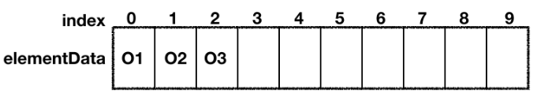
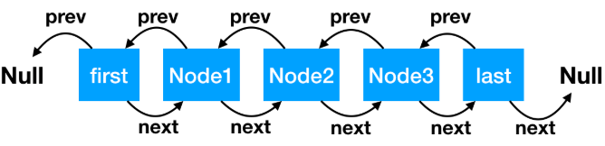
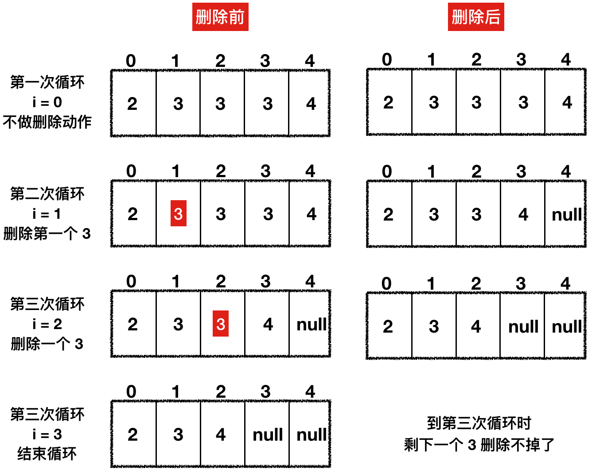
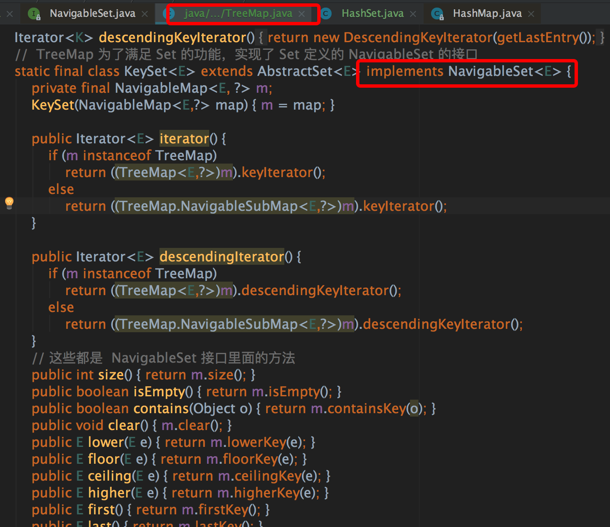
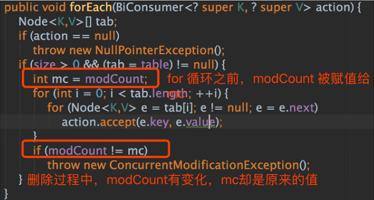
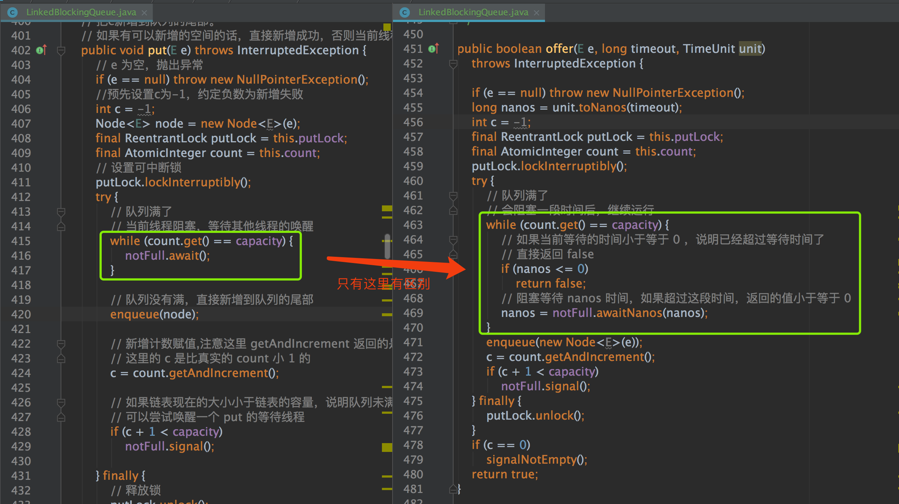

# 集合源码总结

## 1 List

### 1.1 ArrayList

#### 1.1.1 整体架构



ArrayList 底层数据结构为**数组**。

- 查询和修改速度很快（仅需根据数组下标直接获取当前元素进行修改）
- 增加删除速度较慢（添加触发扩容时会拷贝整个数组，删除时会拷贝删除元素后的部分数组）

**1. 重点属性**

- elementData 表示数组本身
- DEFAULT_CAPACITY 表示数组初始大小，默认值为10
- 扩容为原数组大小的1.5倍
- size 表示当前数组大小
- modCount 表示当前数组被修改的版本次数，若数组结构变动则 +1

**2. 类注释**

- 允许添加 null 值，会自动扩容
- size()、isEmpty()、get()、set()、add() 等方法的时间复杂度都是O（1）
- 非线程安全的（多线程下推荐使用线程安全类：Collection#synchronizedList）
- 使用增强 for 循环，或迭代器迭代过程中，如果数组大小被改变，会快速失败，抛异常

#### 1.1.2 初始化

- 无参初始化：数组大小默认为空

  > 第一次调用 add 进行扩容时，才会使数组长度为 10

- 指定大小初始化

- 指定初始数据初始化

指定初始数据初始化源码：

````java
private static final Object[] DEFAULTCAPACITY_EMPTY_ELEMENTDATA = {};

//无参数直接初始化，数组大小为空
public ArrayList() {
    this.elementData = DEFAULTCAPACITY_EMPTY_ELEMENTDATA;
}

//指定初始数据初始化
public ArrayList(Collection<? extends E> c) {
    //elementData 是保存数组的容器，默认为 null
    elementData = c.toArray();
    //如果给定的集合（c）数据有值
    if ((size = elementData.length) != 0) {
        // c.toArray might (incorrectly) not return Object[] (see 6260652)
        //如果集合元素类型不是 Object 类型，我们会转成 Object
        if (elementData.getClass() != Object[].class) {
            elementData = Arrays.copyOf(elementData, size, Object[].class);
        }
    } else {
        // 给定集合（c）无值，则默认空数组
        this.elementData = EMPTY_ELEMENTDATA;
    }
}
````

#### 1.1.3 新增和扩容

**1. 新增流程**

①判断是否需要扩容，需要则扩容

②赋值

**2. 新增源码**

````java
public boolean add(E e) {
  //确保数组大小是否足够，不够执行扩容，size 为当前数组的大小
  ensureCapacityInternal(size + 1);  // Increments modCount!!
  //直接赋值，线程不安全的
  elementData[size++] = e;
  return true;
}
````

**3. 扩容特性**

- 扩容大小是原来容量的**1.5倍**
- 数组长度最大值为 `Integer.MAX_VALUE` 即2^32
- 新增时允许 null 值

**4. 扩容源码**

````java
private void ensureCapacityInternal(int minCapacity) {
  //如果初始化数组大小时，有给定初始值，以给定的大小为准，不走 if 逻辑
  if (elementData == DEFAULTCAPACITY_EMPTY_ELEMENTDATA) {
    minCapacity = Math.max(DEFAULT_CAPACITY, minCapacity);
  }
  //确保容积足够
  ensureExplicitCapacity(minCapacity);
}

private void ensureExplicitCapacity(int minCapacity) {
  //记录数组被修改
  modCount++;
  // 如果我们期望的最小容量大于目前数组的长度，那么就扩容
  if (minCapacity - elementData.length > 0)
    grow(minCapacity);
}

//扩容，并把现有数据拷贝到新的数组里面去
private void grow(int minCapacity) {
  int oldCapacity = elementData.length;
  // oldCapacity >> 1 是把 oldCapacity 除以 2 的意思
  int newCapacity = oldCapacity + (oldCapacity >> 1);

  // 如果扩容后的值 < 我们的期望值，扩容后的值就等于我们的期望值
  if (newCapacity - minCapacity < 0)
    newCapacity = minCapacity;

  // 如果扩容后的值 > jvm 所能分配的数组的最大值，那么就用 Integer 的最大值
  if (newCapacity - MAX_ARRAY_SIZE > 0)
    newCapacity = hugeCapacity(minCapacity);
 
  // 通过复制进行扩容
  elementData = Arrays.copyOf(elementData, newCapacity);
}
````

#### 1.1.4 扩容底层实现

通过 `System.arrayCopy` 方法，新建一个预期容量的数组，将旧数组的数据与新增数据一并拷贝到新数组中。

````java
/**
 * @param src     被拷贝的数组
 * @param srcPos  从数组那里开始
 * @param dest    目标数组
 * @param destPos 从目标数组那个索引位置开始拷贝
 * @param length  拷贝的长度 
 * 此方法是没有返回值的，通过 dest 的引用进行传值
 */
public static native void arraycopy(Object src, int srcPos,
                                    Object dest, int destPos,
                                    int length);
````

#### 1.1.5 删除

**1. 删除特性**

- 新增允许 null 值
- 通过 equals 获取元素的索引位置，**非基本类型必须重写 equals 方法**
- 删除某个元素后，只会把数组后面的元素向前移动

**2. 删除源码**

````java
public boolean remove(Object o) {
  // 如果要删除的值是 null，找到第一个值是 null 的删除
  if (o == null) {
    for (int index = 0; index < size; index++)
      if (elementData[index] == null) {
        fastRemove(index);
        return true;
      }
  } else {
    // 如果要删除的值不为 null，找到第一个和要删除的值相等的删除
    for (int index = 0; index < size; index++)
      // 这里是根据  equals 来判断值相等的，相等后再根据索引位置进行删除
      if (o.equals(elementData[index])) {
        fastRemove(index);
        return true;
      }
  }
  return false;
}

private void fastRemove(int index) {
  // 记录数组的结构要发生变动了
  modCount++;
  // numMoved 表示删除 index 位置的元素后，需要从 index 后移动多少个元素到前面去
  // 减 1 的原因，是因为 size 从 1 开始算起，index 从 0开始算起
  int numMoved = size - index - 1;
  if (numMoved > 0)
    // 从 index +1 位置开始被拷贝，拷贝的起始位置是 index，长度是 numMoved
    System.arraycopy(elementData, index+1, elementData, index, numMoved);
  //数组最后一个位置赋值 null，帮助 GC
  elementData[--size] = null;
}
````

#### 1.1.6 迭代器

**1. 迭代器重要参数**

````java
int cursor;// 迭代过程中，下一个元素的位置，默认从 0 开始。
int lastRet = -1; // 新增场景：表示上一次迭代过程中，索引的位置；删除场景：为 -1。
int expectedModCount = modCount;// expectedModCount 表示迭代过程中，期望的版本号；modCount 表示数组实际的版本号。
````

**2. 迭代器的三个方法**

- `hasNext()` 还有没有值可以迭代
- `next()` 如果有值可以迭代，迭代的值是多少
- `remove()` 删除当前迭代的值

**3. 迭代器的方法源码**

1）hasNext()

````java
public boolean hasNext() {
  return cursor != size;//cursor 表示下一个元素的位置，size 表示实际大小，如果两者相等，说明已经没有元素可以迭代了，如果不等，说明还可以迭代
}
````

2）next()

```java
public E next() {
  //迭代过程中，判断版本号有无被修改，有被修改，抛 ConcurrentModificationException 异常
  checkForComodification();
  //本次迭代过程中，元素的索引位置
  int i = cursor;
  if (i >= size)
    throw new NoSuchElementException();
  Object[] elementData = ArrayList.this.elementData;
  if (i >= elementData.length)
    throw new ConcurrentModificationException();
  // 下一次迭代时，元素的位置，为下一次迭代做准备
  cursor = i + 1;
  // 返回元素值
  return (E) elementData[lastRet = i];
}
// 版本号比较
final void checkForComodification() {
  if (modCount != expectedModCount)
    throw new ConcurrentModificationException();
}
```

3）remove()

```java
public void remove() {
  // 如果上一次操作时，数组的位置已经小于 0 了，说明数组已经被删除完了
  if (lastRet < 0)
    throw new IllegalStateException();
  //迭代过程中，判断版本号有无被修改，有被修改，抛 ConcurrentModificationException 异常
  checkForComodification();

  try {
    ArrayList.this.remove(lastRet);
    cursor = lastRet;
    // -1 表示元素已经被删除，这里也防止重复删除
    lastRet = -1;
    // 删除元素时 modCount 的值已经发生变化，在此赋值给 expectedModCount
    // 这样下次迭代时，两者的值是一致的了
    expectedModCount = modCount;
  } catch (IndexOutOfBoundsException ex) {
    throw new ConcurrentModificationException();
  }
}
```

- `lastRet = -1` 的操作目的，是防止重复删除操作
- 删除元素成功时，数组当前 `modCount` 就会发生变化，这里会把 `expectedModCount` 重新赋值，下次迭代时两者的值就会一致了

### 1.2 LinkedList

#### 1.2.1 整体架构



LinkedList 底层数据结构为**双向链表**，实现了 Queue 接口。

- 新增和删除速度很快（仅需修改前后节点的指向）
- 查询和修改速度较慢（查询采用二分法，但仍然需要从头部或尾部遍历到指定节点，修改同理）

**1. 双向链表特性**

- 链表的节点叫 Node，Node 有 prev 和 next 属性，分别表示前节点和后节点
- 链表头节点（first）的前节点是 null
- 链表尾节点（last）的后节点是 null
- 链表无数据时，first 和 last 为同一个节点，前后指向均为 null
- 系统内存足够大时，链表大小不限制

**2. Node 源码**

````java
private static class Node<E> {
    E item;// 节点值
    Node<E> next; // 指向的下一个节点
    Node<E> prev; // 指向的前一个节点

    // 初始化参数顺序分别是：前一个节点、本身节点值、后一个节点
    Node(Node<E> prev, E element, Node<E> next) {
        this.item = element;
        this.next = next;
        this.prev = prev;
    }
}
````

#### 1.2.2 追加节点

- 追加到链表尾部，`add()` 方法
- 追加到链表头部，`addFirst()` 方法

**1. add() 源码**

````java
// 从尾部开始追加节点
void linkLast(E e) {
    // 把尾节点数据暂存
    final Node<E> l = last;
    // 新建新的节点，初始化入参含义：
    // l 是新节点的前一个节点，当前值是尾节点值
    // e 表示当前新增节点，当前新增节点后一个节点是 null
    final Node<E> newNode = new Node<>(l, e, null);
    // 新建节点追加到尾部
    last = newNode;
    //如果链表为空（l 是尾节点，尾节点为空，链表即空），头部和尾部是同一个节点，都是新建的节点
    if (l == null)
        first = newNode;
    //否则把前尾节点的下一个节点，指向当前尾节点。
    else
        l.next = newNode;
    //大小和版本更改
    size++;
    modCount++;
}
````

**2. addFirst() 源码**

````java
// 从头部追加
private void linkFirst(E e) {
    // 头节点赋值给临时变量
    final Node<E> f = first;
    // 新建节点，前一个节点指向null，e 是新建节点，f 是新建节点的下一个节点，目前值是头节点的值
    final Node<E> newNode = new Node<>(null, e, f);
    // 新建节点成为头节点
    first = newNode;
    // 头节点为空，就是链表为空，头尾节点是一个节点
    if (f == null)
        last = newNode;
    //上一个头节点的前一个节点指向当前节点
    else
        f.prev = newNode;
    size++;
    modCount++;
}
````

#### 1.2.3 删除节点

- 从头部删除元素，`unlinkFirst()` 方法
- 从尾部删除元素，`unlinkLast()` 方法

> 删除操作会把节点的值，前后指向节点都置为 null，帮助 GC 进行回收。

**1. unlinkFirst() 方法**

````java
// 从头删除节点 f 是链表头节点
private E unlinkFirst(Node<E> f) {
    // 拿出头节点的值，作为方法的返回值
    final E element = f.item;
    // 拿出头节点的下一个节点
    final Node<E> next = f.next;
    //帮助 GC 回收头节点
    f.item = null;
    f.next = null;
    // 头节点的下一个节点成为头节点
    first = next;
    //如果 next 为空，表明链表为空
    if (next == null)
        last = null;
    //链表不为空，头节点的前一个节点指向 null
    else
        next.prev = null;
    //修改链表大小和版本
    size--;
    modCount++;
    return element;
}
````

**2. unlinkLast() 方法**

````java
// 从尾部删除节点 f 是链表尾节点
private E unlinkLast(Node<E> l) {
        // assert l == last && l != null;
        final E element = l.item;
        final Node<E> prev = l.prev;
        l.item = null;
        l.prev = null; // help GC
        last = prev;
        if (prev == null)
            first = null;
        else
            prev.next = null;
        size--;
        modCount++;
        return element;
    }
````

#### 1.2.4 查询节点

**1. 查询流程**

采取**简单二分法**：

①判断索引在链表的前半部分，还是后半部分

②在前半部分则从头开始遍历，否则从尾部开始遍历

**2. 查询源码**

````java
// 根据链表索引位置查询节点
Node<E> node(int index) {
    // 如果 index 处于队列的前半部分，从头开始找，size >> 1 是 size 除以 2 的意思。
    if (index < (size >> 1)) {
        Node<E> x = first;
        // 直到 for 循环到 index 的前一个 node 停止
        for (int i = 0; i < index; i++)
            x = x.next;
        return x;
    } else {// 如果 index 处于队列的后半部分，从尾开始找
        Node<E> x = last;
        // 直到 for 循环到 index 的后一个 node 停止
        for (int i = size - 1; i > index; i--)
            x = x.prev;
        return x;
    }
}
````

#### 1.2.5 方法对比

LinkedList 实现了 Deque 接口（Deque 接口继承 Queue 接口）

| 方法 | 返回异常  | 返回特殊值 | 底层实现                                     |
| ---- | --------- | ---------- | -------------------------------------------- |
| 新增 | add(e)    | offer(e)   | 底层实现相同                                 |
| 删除 | remove()  | poll(e)    | 链表为空时，remove 会抛异常，poll 返回 null  |
| 查找 | element() | peek()     | 链表为空时，element 会抛异常，peek 返回 null |

> Queue 接口注释建议 add 方法操作失败时抛异常，但 LinkedList 实现的 add 方法一直返回 true。

#### 1.2.6 迭代器

通过继承 ListIterator 接口来实现双向迭代访问。

> LinkedList 需要实现双向迭代访问，无法通过继承 Iterator 来实现。

| 迭代顺序         | 方法                                 |
| ---------------- | ------------------------------------ |
| 从头到尾迭代方法 | hasNext、next、nextIndex             |
| 从尾到头迭代方法 | hasPrevious、previous、previousIndex |

**1. 迭代器源码**

````java
// 双向迭代器
private class ListItr implements ListIterator<E> {
    private Node<E> lastReturned;//上一次执行 next() 或者 previos() 方法时的节点位置
    private Node<E> next;//下一个节点
    private int nextIndex;//下一个节点的位置
    //expectedModCount：期望版本号；modCount：目前最新版本号
    private int expectedModCount = modCount;
    …………
}
````

**2. 从头到尾迭代方法**

````java
// 判断还有没有下一个元素
public boolean hasNext() {
    return nextIndex < size;// 下一个节点的索引小于链表的大小，就有
}

// 取下一个元素
public E next() {
    //检查期望版本号有无发生变化
    checkForComodification();
    if (!hasNext())//再次检查
        throw new NoSuchElementException();
    // next 是当前节点，在上一次执行 next() 方法时被赋值的。
    // 第一次执行时，是在初始化迭代器的时候，next 被赋值的
    lastReturned = next;
    // next 是下一个节点了，为下次迭代做准备
    next = next.next;
    nextIndex++;
    return lastReturned.item;
}
````

从头部遍历时，直接取当前节点的下一个节点即可。

**3. 从尾到头迭代方法**

````java
// 如果上次节点索引位置大于 0，就还有节点可以迭代
public boolean hasPrevious() {
    return nextIndex > 0;
}
// 取前一个节点
public E previous() {
    checkForComodification();
    if (!hasPrevious())
        throw new NoSuchElementException();
    // next 为空场景：1:说明是第一次迭代，取尾节点(last);2:上一次操作把尾节点删除掉了
    // next 不为空场景：说明已经发生过迭代了，直接取前一个节点即可(next.prev)
    lastReturned = next = (next == null) ? last : next.prev;
    // 索引位置变化
    nextIndex--;
    return lastReturned.item;
}
````

从尾部开始遍历时，需要判断 next 不为空和为空的场景（见代码注释）。

**4. 迭代器删除**

````java
public void remove() {
    checkForComodification();
    // lastReturned 是本次迭代需要删除的值，分以下空和非空两种情况：
    // lastReturned 为空，说明调用者没有主动执行过 next() 或者 previos()，直接报错
    // lastReturned 不为空，是在上次执行 next() 或者 previos()方法时赋的值
    if (lastReturned == null)
        throw new IllegalStateException();
    Node<E> lastNext = lastReturned.next;
    //删除当前节点
    unlink(lastReturned);
    // next == lastReturned 的场景分析：从尾到头递归顺序，并且是第一次迭代，并且要删除最后一个元素的情况下
    // 这种情况下，previous() 方法里面设置了 lastReturned = next = last,所以 next 和 lastReturned会相等
    if (next == lastReturned)
        // 这时候 lastReturned 是尾节点，lastNext 是 null，所以 next 也是 null，这样在 previous() 执行时，发现 next 是 null，就会把尾节点赋值给 next
        next = lastNext;
    else
        nextIndex--;
    lastReturned = null;
    expectedModCount++;
}
````

迭代过程中需要删除的值，需要判断空和非空两种情况（见代码注释）。

### 1.3 List面试总结

#### 1.3.1 扩容类问题

**1. ArrayList 无参数构造器构造，现在 add 一个值进去，此时数组的大小是多少，下一次扩容前最大可用大小是多少？**

答：此处数组的大小是 1，下一次扩容前最大可用大小是 10，因为 ArrayList 第一次扩容时，是有默认值的，默认值是 10，在第一次 add 一个值进去时，数组的可用大小被扩容到 10 了。


**2. 如果我连续往 list 里面新增值，增加到第 11 个的时候，数组的大小是多少？**

答：这里的考查点就是扩容的公式，当增加到 11 的时候，此时我们希望数组的大小为 11，但实际上数组的最大容量只有 10，不够了就需要扩容，扩容的公式是：oldCapacity + (oldCapacity>> 1)，oldCapacity 表示数组现有大小，目前场景计算公式是：10 + 10 ／2 = 15，然后我们发现 15 已经够用了，所以数组的大小会被扩容到 15。


**3. 数组初始化，被加入一个值后，如果我使用 addAll 方法，一下子加入 15 个值，那么最终数组的大小是多少？**

答：第一题中我们已经计算出来数组在加入一个值后，实际大小是 1，最大可用大小是 10 ，现在需要一下子加入 15 个值，那我们期望数组的大小值就是 16，此时数组最大可用大小只有 10，明显不够，需要扩容，扩容后的大小是：10 + 10 ／2 = 15，这时候发现扩容后的大小仍然不到我们期望的值 16，这时候源码中有一种策略如下：

```java
// newCapacity 本次扩容的大小，minCapacity 我们期望的数组最小大小
// 如果扩容后的值 < 我们的期望值，我们的期望值就等于本次扩容的大小
if (newCapacity - minCapacity < 0)
    newCapacity = minCapacity;
```

所以最终数组扩容后的大小为 16。


**4. 现在我有一个很大的数组需要拷贝，原数组大小是 5k，请问如何快速拷贝？**

答：因为原数组比较大，如果新建新数组的时候，不指定数组大小的话，就会频繁扩容，频繁扩容就会有大量拷贝的工作，造成拷贝的性能低下，所以回答说新建数组时，指定新数组的大小为 5k 即可。


**5.  为什么说扩容会消耗性能？**

答：扩容底层使用的是 System.arraycopy 方法，会把原数组的数据全部拷贝到新数组上，所以性能消耗比较严重。


**6. 源码扩容过程有什么值得借鉴的地方？**

答：有两点：

- 是扩容的思想值得学习，通过自动扩容的方式，让使用者不用关心底层数据结构的变化，封装得很好，1.5 倍的扩容速度，可以让扩容速度在前期缓慢上升，在后期增速较快，大部分工作中要求数组的值并不是很大，所以前期增长缓慢有利于节省资源，在后期增速较快时，也可快速扩容。
- 扩容过程中，有数组大小溢出的意识，比如要求扩容后的数组大小，不能小于 0，不能大于 Integer 的最大值。

这两点在我们平时设计和写代码时都可以借鉴。


#### 1.3.2 删除类问题

**1. 有一个 ArrayList，数据是 2、3、3、3、4，中间有三个 3，现在我通过 for (int i=0;i<list.size ();i++) 的方式，想把值是 3 的元素删除，请问可以删除干净么？最终删除的结果是什么，为什么？删除代码如下：**

````java
List<String> list = new ArrayList<String>() {{
  add("2");
  add("3");
  add("3");
  add("3");
  add("4");
}};
for (int i = 0; i < list.size(); i++) {
  if (list.get(i).equals("3")) {
    list.remove(i);
  }
}
````

答：不能删除干净，最终删除的结果是 2、3、4，有一个 3 删除不掉，原因看下图：



从图中我们可以看到，每次删除一个元素后，该元素后面的元素就会往前移动，而此时循环的 i 在不断地增长，最终会使每次删除 3 的后一个 3 被遗漏，导致删除不掉。


**2. 还是上面的 ArrayList 数组，我们通过增强 for 循环进行删除，可以么？**

答：不可以，会报错。因为增强 for 循环过程其实调用的就是迭代器的 next () 方法，当你调用 list#remove () 方法进行删除时，modCount 的值会 +1，而这时候迭代器中的 expectedModCount 的值却没有变，导致在迭代器下次执行 next () 方法时，expectedModCount != modCount 就会报 ConcurrentModificationException 的错误。


**3. 还是上面的数组，如果删除时使用 Iterator.remove () 方法可以删除么，为什么？**

答：可以的，因为 Iterator.remove () 方法在执行的过程中，会把最新的 modCount 赋值给 expectedModCount，这样在下次循环过程中，modCount 和 expectedModCount 两者就会相等。


**4. 以上三个问题对于 LinkedList 也是同样的结果么？**

答：是的，虽然 LinkedList 底层结构是双向链表，但对于上述三个问题，结果和 ArrayList 是一致的。


#### 1.3.3 对比类问题

**1. ArrayList 和 LinkedList 区别？**

答：可以先从底层数据结构开始说起，然后以某一个方法为突破口深入，比如：最大的不同是两者底层的数据结构不同，ArrayList 底层是数组，LinkedList 底层是双向链表，两者的数据结构不同也导致了操作的 API 实现有所差异，拿新增实现来说，ArrayList 会先计算并决定是否扩容，然后把新增的数据直接赋值到数组上，而 LinkedList 仅仅只需要改变插入节点和其前后节点的指向位置关系即可。


**2. ArrayList 和 LinkedList 应用场景有何不同？**

ArrayList 更适合于快速的查找匹配，不适合频繁新增删除，像工作中经常会对元素进行匹配查询的场景比较合适，LinkedList 更适合于经常新增和删除，对查询反而很少的场景。


**3. ArrayList 和 LinkedList 两者有没有最大容量？**

答：ArrayList 有最大容量的，为 Integer 的最大值，大于这个值 JVM 是不会为数组分配内存空间的，LinkedList 底层是双向链表，理论上可以无限大。但源码中，LinkedList 实际大小用的是 int 类型，这也说明了 LinkedList 不能超过 Integer 的最大值，不然会溢出。


**4. ArrayList 和 LinkedList 是如何对 null 值进行处理的？**

答：ArrayList 允许 null 值新增，也允许 null 值删除。删除 null 值时，是从头开始，找到第一值是 null 的元素删除；LinkedList 新增删除时对 null 值没有特殊校验，是允许新增和删除的。


**5. ArrayList 和 LinedList 是线程安全的么，为什么？**

答：当两者作为非共享变量时，比如说仅仅是在方法里面的局部变量时，是没有线程安全问题的，只有当两者是共享变量时，才会有线程安全问题。主要的问题点在于多线程环境下，所有线程任何时刻都可对数组和链表进行操作，这会导致值被覆盖，甚至混乱的情况。

如果有线程安全问题，在迭代的过程中，会频繁报 ConcurrentModificationException 的错误，意思是在我当前循环的过程中，数组或链表的结构被其它线程修改了。


**6. 如何解决线程安全问题？**

Java 源码中推荐使用 Collections#synchronizedList 进行解决，Collections#synchronizedList 的返回值是 List 的每个方法都加了 synchronized 锁，保证了在同一时刻，数组和链表只会被一个线程所修改，或者采用 CopyOnWriteArrayList 并发 List 来解决。


#### 1.3.4 链表类问题

**1. 你能描述下双向链表么？**

答：如果和面试官面对面沟通，可以把 《LinkedList 源码解析》中的 LinkedList 的结构画出来，如果是电话面试，可以这么描述：双向链表中双向的意思是说前后节点之间互相有引用，链表的节点我们称为 Node。Node 有三个属性组成：其前一个节点，本身节点的值，其下一个节点，假设 A、B 节点相邻，A 节点的下一个节点就是 B，B 节点的上一个节点就是 A，两者互相引用，在链表的头部节点，我们称为头节点。头节点的前一个节点是 null，尾部称为尾节点，尾节点的后一个节点是 null，如果链表数据为空的话，头尾节点是同一个节点，本身是 null，指向前后节点的值也是 null。


**2. 描述下双向链表的新增和删除**

答：如果是面对面沟通，最好可以直接画图，如果是电话面试，可以这么描述：

新增：我们可以选择从链表头新增，也可以选择从链表尾新增，如果是从链表尾新增的话，直接把当前节点追加到尾节点之后，本身节点自动变为尾节点。

删除：把删除节点的后一个节点的 prev 指向其前一个节点，把删除节点的前一个节点的 next 指向其后一个节点，最后把删除的节点置为 null 即可。

## 2 Set

### 2.1 HashSet

#### 2.1.1 整体架构

HashSet 底层实现基于 **HashMap**。

> HashMap 底层数据结构是：**数组 + 链表 + 红黑树**。

**1. 类注释**

- 底层实现基于 HashMap，所以迭代时不能保证按照插入顺序，或者其它顺序进行迭代
- add、remove、contanins、size 等方法的耗时性能，是不会随着数据量的增加而增加的，这个主要跟 HashMap 底层的数组数据结构有关，不管数据量多大，不考虑 hash 冲突的情况下，时间复杂度都是 O (1)
- 线程不安全的，如果需要安全请自行加锁，或者使用 Collections.synchronizedSet
- 迭代过程中，如果数据结构被改变，会快速失败的，会抛出 ConcurrentModificationException 异常

>  List、Map、 Set 三者的共同点可以说上述最后三点。

**2. 重点属性**

````java
// 把 HashMap 组合进来，key 是 Hashset 的 key，value 是下面的 PRESENT
private transient HashMap<E,Object> map;
// HashMap 中的 value
private static final Object PRESENT = new Object();
````

#### 2.2.2 初始化

**1. 无参初始化**

````java
public HashSet() {
	map = new HashMap<>();
}
````

**2. 有参初始化**

当有原始集合数据进行初始化的情况下，会对 HashMap 的初始容量进行计算：

````java
// 对 HashMap 的容量进行了计算
public HashSet(Collection<? extends E> c) {
    map = new HashMap<>(Math.max((int) (c.size()/.75f) + 1, 16));
    addAll(c);
}
````

- 若给定 HashMap 初始容量小于 16 ，就按 HashMap 默认的 16 初始化好，若大于 16，就按照给定值初始化
- HashMap 扩容的伐值的计算公式是：Map 的容量 * 0.75f，一旦达到阀值就会扩容，此处用 `(int) (c.size ()/.75f) + 1` 来表示初始化的值，这样使我们期望的大小值正好比扩容的阀值还大 1，就不会扩容

### 2.2 TreeSet

#### 2.2.1 整体架构

TreeSet 底层实现基于 **TreeMap**。

> TreeMap 底层的数据结构是**红黑树**。

- 底层实现基于 TreeMap
- 可以按照 key 的排序顺序进行迭代

#### 2.2.2 实现思路

- TreeSet 直接使用 TreeMap 的某些功能，自己包装成新的 api
- TreeSet 定义自己想要的 api，自己定义接口规范，让 TreeMap 去实现

**1. 复用 TreeMap 的简单API**

1）TreeSet 的 add 方法

````java
public boolean add(E e) {
    return m.put(e, PRESENT)==null;
}
````

2）需要迭代 TreeSet 中的元素，那应该也是像 add 那样，直接使用 HashMap 已有的迭代能力

````java
// 模仿思路一的方式实现
public Iterator<E> descendingIterator() {
    // 直接使用 HashMap.keySet 的迭代能力
    return m.keySet().iterator();
}
````

**2. 定义 TreeMap 需要实现的接口规范**

TreeMap 实现了 TreeSet 定义的各种特殊方法：

````java
// NavigableSet 接口，定义了迭代的一些规范，和一些取值的特殊方法
// TreeSet 实现了该方法，也就是说 TreeSet 本身已经定义了迭代的规范
public interface NavigableSet<E> extends SortedSet<E> {
    Iterator<E> iterator();
    E lower(E e);
}  
// m.navigableKeySet() 是 TreeMap 写了一个子类实现了 NavigableSet
// 接口，实现了 TreeSet 定义的迭代规范
public Iterator<E> iterator() {
    return m.navigableKeySet().iterator();
}
````

TreeMap 中对 NavigableSet 接口的实现源码截图如下：



**3. 实现两种复用思路的原因**

- 思路 1中，add 这些方法实现比较简单，没有复杂逻辑，所以 TreeSet 自己实现起来比较简单
- 思路 2 主要适用于复杂场景，比如说迭代场景，TreeSet 的场景复杂，比如要能从头开始迭代，比如要能取第一个值，比如要能取最后一个值，再加上 TreeMap 底层结构比较复杂，TreeSet 可能并不清楚 TreeMap 底层的复杂逻辑，这时候让 TreeSet 来实现如此复杂的场景逻辑，TreeSet 就搞不定了，不如接口让 TreeSet 来定义，让 TreeMap 去负责实现，TreeMap 对底层的复杂结构非常清楚，实现起来既准确又简单

### 2.3 Set面试总结

**1. TreeSet 有用过么，平时都在什么场景下使用？**

答：有木有用过如实回答就好了，我们一般都是在需要把元素进行排序的时候使用 TreeSet，使用时需要我们注意元素最好实现 Comparable 接口，这样方便底层的 TreeMap 根据 key 进行排序。


**2. 追问，如果我想实现根据 key 的新增顺序进行遍历怎么办？**

答：要按照 key 的新增顺序进行遍历，首先想到的应该就是 LinkedHashMap，而 LinkedHashSet 正好是基于 LinkedHashMap 实现的，所以我们可以选择使用 LinkedHashSet。


**3. 追问，如果我想对 key 进行去重，有什么好的办法么？**

答：我们首先想到的是 TreeSet，TreeSet 底层使用的是 TreeMap，TreeMap 在 put 的时候，如果发现 key 是相同的，会把 value 值进行覆盖，所有不会产生重复的 key ，利用这一特性，使用 TreeSet 正好可以去重。


**4. 说说 TreeSet 和 HashSet 两个 Set 的内部实现结构和原理？**

答： HashSet 底层对 HashMap 的能力进行封装，比如说 add 方法，是直接使用 HashMap 的 put 方法，比较简单，但在初始化的时候，我看源码有一些感悟：说一下 HashSet 小结的四小点：

- 对组合还是继承的分析和把握；
- 对复杂逻辑进行一些包装，使吐出去的接口尽量简单好用
- 组合其他 api 时，尽量多对组合的 api 多些了解，这样才能更好的使用 api
- HashMap 初始化大小值的模版公式：取括号内两者的最大值（期望的值 / 0.75+1，默认值 16）


## 3 Map

### 3.1 HashMap

#### 3.1.1 整体架构


HashMap 底层数据结构是：**数组 + 链表 + 红黑树**

- 链表长度 >= 8且数组大小 > 64时，链表转化为红黑树
- 红黑树大小 <= 6时，红黑树转化为链表

**1. 类注释**

- 允许 null 值
- load factor（负载因子）默认值是 0.75，均衡了时间和空间损耗算出来的值，较高的值会减少空间开销（扩容减少，数组大小增长速度变慢），但增加了查找成本（hash 冲突增加，链表长度变长），不扩容的条件：数组容量 > 需要的数组大小 / load factor
- 如果有大量数据存储到 HashMap 中，建议初始化时设定足够大小，防止在添加元素过程中不断扩容，影响性能
- HashMap 非线程安全，可自行在外部加锁，或者通过 Collections#synchronizedMap 来实现线程安全，Collections#synchronizedMap 的实现是在每个方法上加上了 synchronized 锁
- 在迭代过程中，如果 HashMap 的结构被修改，会快速失败

**2. 重点属性**

````java
//初始容量为 16
 static final int DEFAULT_INITIAL_CAPACITY = 1 << 4;

 //最大容量
 static final int MAXIMUM_CAPACITY = 1 << 30;

 //负载因子默认值
 static final float DEFAULT_LOAD_FACTOR = 0.75f;
 
 //桶上的链表长度大于等于8时，链表转化成红黑树
 static final int TREEIFY_THRESHOLD = 8;

 //桶上的红黑树大小小于等于6时，红黑树转化成链表
 static final int UNTREEIFY_THRESHOLD = 6;

 //当数组容量大于 64 时，链表才会转化成红黑树
 static final int MIN_TREEIFY_CAPACITY = 64;

 //记录迭代过程中 HashMap 结构是否发生变化，如果有变化，迭代时会 fail-fast
 transient int modCount;

 //HashMap 的实际大小，可能不准(因为当你拿到这个值的时候，可能又发生了变化)
 transient int size;

 //存放数据的数组
 transient Node<K,V>[] table;

 // 扩容的门槛，有两种情况
 // 如果初始化时，给定数组大小的话，通过 tableSizeFor 方法计算，数组大小永远接近于 2 的幂次方，比如你给定初始化大小 19，实际上初始化大小为 32，为 2 的 5 次方。
 // 如果是通过 resize 方法进行扩容，大小 = 数组容量 * 0.75
 int threshold;

 //链表的节点
 static class Node<K,V> implements Map.Entry<K,V> {
 
 //红黑树的节点
 static final class TreeNode<K,V> extends LinkedHashMap.Entry<K,V> {
     ……
 }
````

- 初始容量为 16
- 负载因子默认值 0.75f
- 最大容量为 2^30
- 扩容场景（扩容大小为2倍）
  - 初始化扩容时，给定数组大小的话，通过 tableSizeFor 方法计算，数组大小永远接近于 2 的幂次方
  - 通过 resize 方法进行扩容，当前数组大小 = 数组容量 * 0.75时
- 链表长度 >= 8且数组大小 > 64时，链表会转化为红黑树
- 数组大小 < 64时，链表长度 >= 8也不会转化为红黑树
- 红黑树大小 <= 6时，红黑树退化为链表

#### 3.1.2 新增节点

**1. 新增流程**

1）流程图


2）流程描述

①判断空数组是否初始化，没有则初始化

②判断通过 key 的 hash 能否直接获取值，能则到⑥，否则到③

③判断 hash 冲突，冲突则追加到链表 or 红黑树

④如果是链表，递归循环，把新元素追加到队尾

⑤如果是红黑树，调用红黑树新增的方法

⑥通过②④⑤将新元素追加成功，再根据 onlyIfAbsent 判断是否需要覆盖

⑦判断是否需要扩容，需要扩容则扩容

3）流程源码

````java
// 入参 hash：通过 hash 算法计算出来的值。
// 入参 onlyIfAbsent：false 表示即使 key 已经存在了，仍然会用新值覆盖原来的值，默认为 false
final V putVal(int hash, K key, V value, boolean onlyIfAbsent,
               boolean evict) {
    // n 表示数组的长度，i 为数组索引下标，p 为 i 下标位置的 Node 值
    Node<K,V>[] tab; Node<K,V> p; int n, i;
    //如果数组为空，使用 resize 方法初始化
    if ((tab = table) == null || (n = tab.length) == 0)
        n = (tab = resize()).length;
    // 如果当前索引位置是空的，直接生成新的节点在当前索引位置上
    if ((p = tab[i = (n - 1) & hash]) == null)
        tab[i] = newNode(hash, key, value, null);
    // 如果当前索引位置有值的处理方法，即我们常说的如何解决 hash 冲突
    else {
        // e 当前节点的临时变量
        Node<K,V> e; K k;
        // 如果 key 的 hash 和值都相等，直接把当前下标位置的 Node 值赋值给临时变量
        if (p.hash == hash &&
            ((k = p.key) == key || (key != null && key.equals(k))))
            e = p;
        // 如果是红黑树，使用红黑树的方式新增
        else if (p instanceof TreeNode)
            e = ((TreeNode<K,V>)p).putTreeVal(this, tab, hash, key, value);
        // 是个链表，把新节点放到链表的尾端
        else {
            // 自旋
            for (int binCount = 0; ; ++binCount) {
                // e = p.next 表示从头开始，遍历链表
                // p.next == null 表明 p 是链表的尾节点
                if ((e = p.next) == null) {
                    // 把新节点放到链表的尾部 
                    p.next = newNode(hash, key, value, null);
                    // 当链表的长度大于等于 8 时，链表转红黑树
                    if (binCount >= TREEIFY_THRESHOLD - 1)
                        treeifyBin(tab, hash);
                    break;
                }
                // 链表遍历过程中，发现有元素和新增的元素相等，结束循环
                if (e.hash == hash &&
                    ((k = e.key) == key || (key != null && key.equals(k))))
                    break;
                //更改循环的当前元素，使 p 在遍历过程中，一直往后移动。
                p = e;
            }
        }
        // 说明新节点的新增位置已经找到了
        if (e != null) {
            V oldValue = e.value;
            // 当 onlyIfAbsent 为 false 时，才会覆盖值 
            if (!onlyIfAbsent || oldValue == null)
                e.value = value;
            afterNodeAccess(e);
            // 返回老值
            return oldValue;
        }
    }
    // 记录 HashMap 的数据结构发生了变化
    ++modCount;
    //如果 HashMap 的实际大小大于扩容的门槛，开始扩容
    if (++size > threshold)
        resize();
    afterNodeInsertion(evict);
    return null;
}
````

**2. 链表的新增**

1）新增方式

插入尾部，新增原理同 LinkedList。

2）新增条件

当链表长度大于等于 8 时，此时的链表就会转化成红黑树，转化的方法是：treeifyBin，此方法有一个判断：

- **当链表长度大于等于 8，并且整个数组大小大于 64 时，才会转成红黑树**
- **当数组大小小于 64 时，只会触发扩容，不会转化成红黑树**

3）为什么边界值是 8

这个答案在源码中注释有解释：

链表查询的时间复杂度是 O (n)，红黑树的查询复杂度是 O (log (n))。在链表数据不多的时候，使用链表进行遍历也比较快，只有当链表数据比较多的时候，才会转化成红黑树，但红黑树需要的占用空间是链表的 2 倍，考虑到转化时间和空间损耗，所以我们需要定义出转化的边界值。

在考虑设计 8 这个值的时候，我们参考了泊松分布概率函数，由泊松分布中得出结论，链表各个长度的命中概率为：

````
* 0:    0.60653066
* 1:    0.30326533
* 2:    0.07581633
* 3:    0.01263606
* 4:    0.00157952
* 5:    0.00015795
* 6:    0.00001316
* 7:    0.00000094
* 8:    0.00000006
````

意思是，当链表的长度是 8 的时候，出现的概率是 0.00000006，不到千万分之一，所以说正常情况下，链表的长度不可能到达 8 ，而一旦到达 8 时，肯定是 hash 算法出了问题，所以在这种情况下，为了让 HashMap 仍然有较高的查询性能，所以让链表转化成红黑树，我们正常写代码，使用 HashMap 时，几乎不会碰到链表转化成红黑树的情况，毕竟概念只有千万分之一。

**3. 红黑树新增**

1）流程

①先判断新增的节点在红黑树上是否存在，判断方式有两种：

- 如果节点没有实现 Comparable 接口，使用 equals 进行判断
- 如果节点自己实现了 Comparable 接口，使用 compareTo 进行判断

②新增的节点如果已经在红黑树上，直接返回；不在的话，判断新增节点是在当前节点的左边还是右边，左边值小，右边值大

③自旋递归 ① 和 ② 步，直到当前节点的左边或者右边的节点为空时，停止自旋，当前节点即为我们新增节点的父节点

④把新增节点放到当前节点的左边或右边为空的地方，并于当前节点建立父子节点关系

⑤进行着色和旋转

2）新增源码

````java
//入参 h：key 的hash值
final TreeNode<K,V> putTreeVal(HashMap<K,V> map, Node<K,V>[] tab,
                               int h, K k, V v) {
    Class<?> kc = null;
    boolean searched = false;
    //找到根节点
    TreeNode<K,V> root = (parent != null) ? root() : this;
    //自旋
    for (TreeNode<K,V> p = root;;) {
        int dir, ph; K pk;
        // p hash 值大于 h，说明 p 在 h 的右边
        if ((ph = p.hash) > h)
            dir = -1;
        // p hash 值小于 h，说明 p 在 h 的左边
        else if (ph < h)
            dir = 1;
        //要放进去key在当前树中已经存在了(equals来判断)
        else if ((pk = p.key) == k || (k != null && k.equals(pk)))
            return p;
        //自己实现的Comparable的话，不能用hashcode比较了，需要用compareTo
        else if ((kc == null &&
                  //得到key的Class类型，如果key没有实现Comparable就是null
                  (kc = comparableClassFor(k)) == null) ||
                  //当前节点pk和入参k不等
                 (dir = compareComparables(kc, k, pk)) == 0) {
            if (!searched) {
                TreeNode<K,V> q, ch;
                searched = true;
                if (((ch = p.left) != null &&
                     (q = ch.find(h, k, kc)) != null) ||
                    ((ch = p.right) != null &&
                     (q = ch.find(h, k, kc)) != null))
                    return q;
            }
            dir = tieBreakOrder(k, pk);
        }

        TreeNode<K,V> xp = p;
        //找到和当前hashcode值相近的节点(当前节点的左右子节点其中一个为空即可)
        if ((p = (dir <= 0) ? p.left : p.right) == null) {
            Node<K,V> xpn = xp.next;
            //生成新的节点
            TreeNode<K,V> x = map.newTreeNode(h, k, v, xpn);
            //把新节点放在当前子节点为空的位置上
            if (dir <= 0)
                xp.left = x;
            else
                xp.right = x;
            //当前节点和新节点建立父子，前后关系
            xp.next = x;
            x.parent = x.prev = xp;
            if (xpn != null)
                ((TreeNode<K,V>)xpn).prev = x;
            //balanceInsertion 对红黑树进行着色或旋转，以达到更多的查找效率，着色或旋转的几种场景如下
            //着色：新节点总是为红色；如果新节点的父亲是黑色，则不需要重新着色；如果父亲是红色，那么必须通过重新着色或者旋转的方法，再次达到红黑树的5个约束条件
            //旋转： 父亲是红色，叔叔是黑色时，进行旋转
            //如果当前节点是父亲的右节点，则进行左旋
            //如果当前节点是父亲的左节点，则进行右旋
          
            //moveRootToFront 方法是把算出来的root放到根节点上
            moveRootToFront(tab, balanceInsertion(root, x));
            return null;
        }
    }
}
````

3）红黑树的5个原则

- 节点是红色或黑色
- 根是黑色
- 所有叶子都是黑色
- 从任一节点到其每个叶子的所有简单路径都包含相同数目的黑色节点
- 从每个叶子到根的所有路径上不能有两个连续的红色节点

#### 3.1.3 查找节点

**1. 查找流程**

①根据 hash 算法定位数组的索引位置，equals 判断当前节点是否是我们需要寻找的 key，是则返回，否则往下

②判断当前节点有无 next 节点，有的话判断是链表类型，还是红黑树类型

③分别走链表和红黑树不同类型的查找方法

**2. 流程代码**

````java
// 采用自旋方式从链表中查找 key，e 初始为为链表的头节点
do {
    // 如果当前节点 hash 等于 key 的 hash，并且 equals 相等，当前节点就是我们要找的节点
    // 当 hash 冲突时，同一个 hash 值上是一个链表的时候，我们是通过 equals 方法来比较 key 是否相等的
    if (e.hash == hash &&
        ((k = e.key) == key || (key != null && key.equals(k))))
        return e;
    // 否则，把当前节点的下一个节点拿出来继续寻找
} while ((e = e.next) != null);
````

**3. 红黑树查找步骤**

①从根节点递归查找

②根据 hashcode，比较查找节点，左边节点，右边节点之间的大小，根本红黑树左小右大的特性进行判断

③判断查找节点在第 2 步有无定位节点位置，有的话返回，没有的话重复 2，3 两步

④一直自旋到定位到节点位置为止

### 3.2 TreeMap

#### 3.2.1 整体架构

TreeMap 底层的数据结构是**红黑树**（和 HashMap 的红黑树结构一样）。

> TreeMap 利用了红黑树左节点小，右节点大的性质，根据 key 进行排序，使每个元素能够插入到红黑树大小适当的位置，维护了 key 的大小关系，适用于 key 需要排序的场景。

- containsKey、get、put、remove 等方法的时间复杂度都是 O（log(n)）
- 不允许 key 为 null

**1. 重点属性**

````java
//比较器，如果外部有传进来 Comparator 比较器，首先用外部的
//如果外部比较器为空，则使用 key 自己实现的 Comparable#compareTo 方法
//比较手段和上面日常工作中的比较 demo 是一致的
private final Comparator<? super K> comparator;

//红黑树的根节点
private transient Entry<K,V> root;

//红黑树的已有元素大小
private transient int size = 0;

//树结构变化的版本号，用于迭代过程中的快速失败场景
private transient int modCount = 0;

//红黑树的节点
static final class Entry<K,V> implements Map.Entry<K,V> {}
````

#### 3.2.2 新增节点

**1. 流程**

①判断红黑树的节点是否为空，为空的话，新增的节点直接作为根节点

````java
Entry<K,V> t = root;
//红黑树根节点为空，直接新建
if (t == null) {
    // compare 方法限制了 key 不能为 null
    compare(key, key); // type (and possibly null) check
    // 成为根节点
    root = new Entry<>(key, value, null);
    size = 1;
    modCount++;
    return null;
}
````

②根据红黑树左小右大的特性，进行判断，找到应该新增节点的父节点

````java
Comparator<? super K> cpr = comparator;
if (cpr != null) {
    //自旋找到 key 应该新增的位置，就是应该挂载那个节点的头上
    do {
        //一次循环结束时，parent 就是上次比过的对象
        parent = t;
        // 通过 compare 来比较 key 的大小
        cmp = cpr.compare(key, t.key);
        //key 小于 t，把 t 左边的值赋予 t，因为红黑树左边的值比较小，循环再比
        if (cmp < 0)
            t = t.left;
        //key 大于 t，把 t 右边的值赋予 t，因为红黑树右边的值比较大，循环再比
        else if (cmp > 0)
            t = t.right;
        //如果相等的话，直接覆盖原值
        else
            return t.setValue(value);
        // t 为空，说明已经到叶子节点了
    } while (t != null);
}
````

③在父节点的左边或右边插入新增节点

````java
//cmp 代表最后一次对比的大小，小于 0 ，代表 e 在上一节点的左边
if (cmp < 0)
    parent.left = e;
//cmp 代表最后一次对比的大小，大于 0 ，代表 e 在上一节点的右边，相等的情况第二步已经处理了。
else
    parent.right = e;
````

④着色旋转，达到平衡

**2. 新增要点**

- 新增节点利用了红黑树左小右大的特性，从根节点不断往下查找，直到找到节点是 null 为止，节点为 null 说明到达了叶子结点
- 查找过程中，发现 key 值已经存在，则直接覆盖
- TreeMap 不允许 key 为 null

### 3.3 LinkedHashMap

#### 3.3.1 整体架构

LinkedHashMap 继承 HashMap，底层数据结构是：**链表**（链表中元素底层数据结构是**数组 + 链表 + 红黑树）**

**1. 特性**

- 按插入顺序进行访问
- 实现了访问最少最先删除功能（自动删除很久没有访问的 key）

**2. 重点属性**

````java
// 链表头
transient LinkedHashMap.Entry<K,V> head;

// 链表尾
transient LinkedHashMap.Entry<K,V> tail;

// 继承 Node，为数组的每个元素增加了 before 和 after 属性
static class Entry<K,V> extends HashMap.Node<K,V> {
    Entry<K,V> before, after;
    Entry(int hash, K key, V value, Node<K,V> next) {
        super(hash, key, value, next);
    }
}

// 控制两种访问模式的字段，默认 false
// true 按照访问顺序，会把经常访问的 key 放到队尾
// false 按照插入顺序提供访问
final boolean accessOrder;
````

#### 3.3.2 新增节点

LinkedHashMap 初始化时，默认 accessOrder 为 false，就是会按照插入顺序提供访问，插入方法使用的是父类 HashMap 的 put 方法，不过覆写了 put 方法执行中调用的 newNode/newTreeNode 和 afterNodeAccess 方法。

newNode/newTreeNode 方法，控制新增节点追加到链表的尾部，这样每次新节点都追加到尾部，即可保证插入顺序了，以 newNode 源码为例：

````java
// 新增节点，并追加到链表的尾部
Node<K,V> newNode(int hash, K key, V value, Node<K,V> e) {
    // 新增节点
    LinkedHashMap.Entry<K,V> p =
        new LinkedHashMap.Entry<K,V>(hash, key, value, e);
    // 追加到链表的尾部
    linkNodeLast(p);
    return p;
}
// link at the end of list
private void linkNodeLast(LinkedHashMap.Entry<K,V> p) {
    LinkedHashMap.Entry<K,V> last = tail;
    // 新增节点等于位节点
    tail = p;
    // last 为空，说明链表为空，首尾节点相等
    if (last == null)
        head = p;
    // 链表有数据，直接建立新增节点和上个尾节点之间的前后关系即可
    else {
        p.before = last;
        last.after = p;
    }
}
````

LinkedHashMap 通过新增头节点、尾节点，给每个节点增加 before、after 属性，每次新增时，都把节点追加到尾节点等手段，在新增的时候，就已经维护了按照插入顺序的链表结构了。

#### 3.3.3 访问节点

LinkedHashMap 只能按从头到尾的顺序单向访问。

> 不能像 LinkedList 那样可以双向访问。

**1. 访问方式**

通过迭代器进行访问，迭代器初始化的时候，默认从头节点开始访问，在迭代的过程中，不断访问当前节点的 after 节点即可。

**2. 源码解析**

Map 对 key、value 和 entry（节点） 都提供出了迭代的方法，假设我们需要迭代 entry，就可使用 `LinkedHashMap.entrySet().iterator()` 这种写法直接返回 LinkedHashIterator ，LinkedHashIterator 是迭代器，我们调用迭代器的 nextNode 方法就可以得到下一个节点，迭代器的源码如下：

````java
// 初始化时，默认从头节点开始访问
LinkedHashIterator() {
    // 头节点作为第一个访问的节点
    next = head;
    expectedModCount = modCount;
    current = null;
}

final LinkedHashMap.Entry<K,V> nextNode() {
    LinkedHashMap.Entry<K,V> e = next;
    if (modCount != expectedModCount)// 校验
        throw new ConcurrentModificationException();
    if (e == null)
        throw new NoSuchElementException();
    current = e;
    next = e.after; // 通过链表的 after 结构，找到下一个迭代的节点
    return e;
}
````

#### 3.3.4 访问最少删除策略

LRU（Least recently used,最近最少使用）策略，是指经常访问的元素会被追加到队尾，很少访问的元素则靠近队首，通过设置删除策略，比如当 Map 元素个数大于多少时，把头节点删除。

**1. 元素被转移到队尾**

````java
public V get(Object key) {
    Node<K,V> e;
    // 调用 HashMap  get 方法
    if ((e = getNode(hash(key), key)) == null)
        return null;
    // 如果设置了 LRU 策略
    if (accessOrder)
    // 这个方法把当前 key 移动到队尾
        afterNodeAccess(e);
    return e.value;
}
````

不仅是 get 方法，执行 getOrDefault、compute、computeIfAbsent、computeIfPresent、merge 方法时，也会通过 afterNodeAccess 方法，把当前访问节点移动到了队尾，通过不断的把经常访问的节点移动到队尾，那么靠近队头的节点，自然就是很少被访问的元素了。

**2. 删除策略**

LinkedHashMap 实现了 put 方法中的调用 afterNodeInsertion 方法，这个方式实现了删除策略，源码如下：

````java
// 删除很少被访问的元素，被 HashMap 的 put 方法所调用
void afterNodeInsertion(boolean evict) { 
    // 得到元素头节点
    LinkedHashMap.Entry<K,V> first;
    // removeEldestEntry 来控制删除策略，如果队列不为空，并且删除策略允许删除的情况下，删除头节点
    if (evict && (first = head) != null && removeEldestEntry(first)) {
        K key = first.key;
        // removeNode 删除头节点
        removeNode(hash(key), key, null, false, true);
    }
}
````

### 3.4 Map面试总结

#### 3.4.1 整体数据结构类问题

**1. 说一说 HashMap 底层数据结构**

答：HashMap 底层是数组 + 链表 + 红黑树的数据结构，数组的主要作用是方便快速查找，时间复杂度是 O(1)，默认大小是 16，数组的下标索引是通过 key 的 hashcode 计算出来的，数组元素叫做 Node，当多个 key 的 hashcode 一致，但 key 值不同时，单个 Node 就会转化成链表，链表的查询复杂度是 O(n)，当链表的长度大于等于 8 并且数组的大小超过 64 时，链表就会转化成红黑树，红黑树的查询复杂度是 O(log(n))，简单来说，最坏的查询次数相当于红黑树的最大深度。


**2. HashMap、TreeMap、LinkedHashMap 三者有啥相同点，有啥不同点？**

答：相同点：

1. 三者在特定的情况下，都会使用红黑树；
2. 底层的 hash 算法相同；
3. 在迭代的过程中，如果 Map 的数据结构被改动，都会报 ConcurrentModificationException 的错误。

不同点：

1. HashMap 数据结构以数组为主，查询非常快，TreeMap 数据结构以红黑树为主，利用了红黑树左小右大的特点，可以实现 key 的排序，LinkedHashMap 在 HashMap 的基础上增加了链表的结构，实现了插入顺序访问和最少访问删除两种策略;
2. 由于三种 Map 底层数据结构的差别，导致了三者的使用场景的不同，TreeMap 适合需要根据 key 进行排序的场景，LinkedHashMap 适合按照插入顺序访问，或需要删除最少访问元素的场景，剩余场景我们使用 HashMap 即可，我们工作中大部分场景基本都在使用 HashMap；
3. 由于三种 map 的底层数据结构的不同，导致上层包装的 api 略有差别。


**3. 说一下 Map 的 hash 算法**

````java
static final int hash(Object key) {
    int h;
    return (key == null) ? 0 : (h = key.hashCode()) ^ (h >>> 16);
}
````

> key 在数组中的位置公式：`tab[(n - 1) & hash]`

这其实是一个数学问题，源码中就是通过以上代码来计算 hash 的，首先计算出 key 的 hashcode，因为 key 是 Object，所以会根据 key 的不同类型进行 hashcode 的计算，接着计算 h ^ (h >>> 16) ，这么做的好处是使大多数场景下，算出来的 hash 值比较分散。

一般来说，hash 值算出来之后，要计算当前 key 在数组中的索引下标位置时，可以采用取模的方式，就是索引下标位置 = hash 值 % 数组大小，这样做的好处，就是可以保证计算出来的索引下标值可以均匀的分布在数组的各个索引位置上，但取模操作对于处理器的计算是比较慢的，数学上有个公式，当 b 是 2 的幂次方时，a % b = a &（b-1），所以此处索引位置的计算公式我们可以更换为： (n-1) & hash。

此问题可以延伸出四个小问题：

1）为什么不用 key % 数组大小，而是需要用 key 的 hash 值 % 数组大小。

答：如果 key 是数字，直接用 key % 数组大小是完全没有问题的，但我们的 key 还有可能是字符串，是复杂对象，这时候用 字符串或复杂对象 % 数组大小是不行的，所以需要先计算出 key 的 hash 值。

2）计算 hash 值时，为什么需要右移 16 位？

答：hash 算法是 h ^ (h >>> 16)，为了使计算出的 hash 值更分散，所以选择先将 h 无符号右移 16 位，然后再与 h 异或时，就能达到 h 的高 16 位和低 16 位都能参与计算，减少了碰撞的可能性。

3）为什么把取模操作换成了 & 操作？

答：key.hashCode() 算出来的 hash 值还不是数组的索引下标，为了随机的计算出索引的下表位置，我们还会用 hash 值和数组大小进行取模，这样子计算出来的索引下标比较均匀分布。

取模操作处理器计算比较慢，处理器对 & 操作就比较擅长，换成了 & 操作，是有数学上证明的支撑，为了提高了处理器处理的速度。

4）为什么提倡数组大小是 2 的幂次方？

答：因为只有大小是 2 的幂次方时，才能使 hash 值 % n(数组大小) == (n-1) & hash 公式成立。


**4.解决 hash 冲突的办法有哪些？**

答：1：好的 hash 算法，细问的话复述一下上题的 hash 算法;

2：自动扩容，当数组大小快满的时候，采取自动扩容，可以减少 hash 冲突;

3：hash 冲突发生时，采用链表来解决;

4：hash 冲突严重时，链表会自动转化成红黑树，提高遍历速度。


#### 3.4.2 扩容类问题

**1. HashMap 是如何扩容的？**

答：扩容的时机：

1. put 时，发现数组为空，进行初始化扩容，默认扩容大小为 16;
2. put 成功后，发现现有数组大小大于扩容的阈值时，进行扩容，扩容为旧数组大小的 2 倍;

扩容的负载因子是 threshold，每次扩容时 threshold 都会被重新计算，阈值等于数组的大小 * 影响因子（0.75）。

新数组初始化之后，需要将旧数组的值拷贝到新数组上，链表和红黑树都有自己拷贝的方法。


**2. 怎么解决 hash 冲突？**

答：hash 冲突指的是 key 值的 hashcode 计算相同，但 key 值不同的情况。

如果桶中元素原本只有一个或已经是链表了，新增元素直接追加到链表尾部；

如果桶中元素已经是链表，并且链表个数大于等于 8 时，此时有两种情况：

1. 如果此时数组大小小于 64，数组再次扩容，链表不会转化成红黑树;
2. 如果数组大小大于 64 时，链表就会转化成红黑树。

这里不仅仅判断链表个数大于等于 8，还判断了数组大小，数组容量小于 64 没有立即转化的原因，猜测主要是因为红黑树占用的空间比链表大很多，转化也比较耗时，所以数组容量小的情况下冲突严重，我们可以先尝试扩容，看看能否通过扩容来解决冲突的问题。


**3. 为什么链表个数大于等于 8 时，链表要转化成红黑树了？**

答：当链表个数太多了，遍历可能比较耗时，转化成红黑树，可以使遍历的时间复杂度降低，但转化成红黑树，有空间和转化耗时的成本，我们通过泊松分布公式计算，正常情况下，链表个数出现 8 的概念不到千万分之一，所以说正常情况下，链表都不会转化成红黑树，这样设计的目的，是为了防止非正常情况下，比如 hash 算法出了问题时，导致链表个数轻易大于等于 8 时，仍然能够快速遍历。

延伸问题：红黑树什么时候转变成链表。

答：当节点的个数小于等于 6 时，红黑树会自动转化成链表，主要还是考虑红黑树的空间成本问题，当节点个数小于等于 6 时，遍历链表也很快，所以红黑树会重新变成链表。


**4. HashMap 在 put 时，如果数组中已经有了这个 key，我不想把 value 覆盖怎么办？取值时，如果得到的 value 是空时，想返回默认值怎么办？**

答：如果数组有了 key，但不想覆盖 value ，可以选择 putIfAbsent 方法，这个方法有个内置变量 onlyIfAbsent，内置是 true ，就不会覆盖，我们平时使用的 put 方法，内置 onlyIfAbsent 为 false，是允许覆盖的。

取值时，如果为空，想返回默认值，可以使用 getOrDefault 方法，方法第一参数为 key，第二个参数为你想返回的默认值，如 map.getOrDefault(“2”,“0”)，当 map 中没有 key 为 2 的值时，会默认返回 0，而不是空。


**5. 通过以下代码进行删除，是否可行？**

````java
HashMap<String,String > map = Maps.newHashMap();
map.put("1","1");
map.put("2","2");
map.forEach((s, s2) -> map.remove("1"));
````



答：不行，会报错误 ConcurrentModificationException。


#### 3.4.3 其他问题

**1. DTO 作为 Map 的 key 时，有无需要注意的点？**

答：DTO 就是一个数据载体，可以看做拥有很多属性的 Java 类，我们可以对这些属性进行 get、set 操作。

- HashMap：一定需要覆写 equals 和 hashCode 方法，因为在 get 和 put 的时候，需要通过 equals 方法进行相等的判断
- TreeMap：DTO 需要实现 Comparable 接口，因为 TreeMap 会使用 Comparable 接口进行判断 key 的大小
- LinkedHashMap：同HashMap


**2. LinkedHashMap 中的 LRU 是什么意思，是如何实现的？**

答：LRU ，英文全称：Least recently used，中文叫做最近最少访问，在 LinkedHashMap 中，也叫做最少访问删除策略，我们可以通过 removeEldestEntry 方法设定一定的策略，使最少被访问的元素，在适当的时机被删除，原理是在 put 方法执行的最后，LinkedHashMap 会去检查这种策略，如果满足策略，就删除头节点。

保证头节点就是最少访问的元素的原理是：LinkedHashMap 在 get 的时候，都会把当前访问的节点，移动到链表的尾部，慢慢的，就会使头部的节点都是最少被访问的元素。


**3. 为什么推荐 TreeMap 的元素最好都实现 Comparable 接口？但 key 是 String 的时候，我们却没有额外的工作呢？**

答：因为 TreeMap 的底层就是通过排序来比较两个 key 的大小的，所以推荐 key 实现 Comparable 接口，是为了往你希望的排序顺序上发展， 而 String 本身已经实现了 Comparable 接口，所以使用 String 时，我们不需要额外的工作，不仅仅是 String ，其他包装类型也都实现了 Comparable 接口，如 Long、Double、Short 等等。

## 4 Queue

### 4.1 LinkedBlockingQueue

#### 4.1.1 整体架构

LinkedBlockingQueue，链表阻塞队列，底层数据结构是**链表**，且队列可阻塞。

**1. 类图**


图为 LinkedBlockingQueue 的类图，可以出看大概有两条路径：

- AbstractQueue -> AbstractCollection -> Collection ->Iterable，主要是复用 Collection 和 迭代器的操作
- BlockingQueue -> Queue -> Collection，BlockingQueue 和 Queue，实现队列的操作

**2. Queue 接口**

Queue 接口定义了队列的三大类操作：

1）新增

- add 队列满的时候抛异常
- offer 队列满的时候返回 false

2）查看并删除

- remove 队列空的时候抛异常
- poll 队列空的时候返回 null

3）只查看不删除

- element 队列空的时候抛异常
- peek 队列空的时候返回null

**3. BlockingQueue**

BlockingQueue 接口在 Queue 接口的基础上加了阻塞概念（一直阻塞和阻塞一段时间）。

|                     | 抛异常  | 特殊值           | 一直阻塞 | 阻塞一段时间             |
| ------------------- | ------- | ---------------- | -------- | ------------------------ |
| 新增-队列满         | add     | offer 返回 false | put      | offer 超过时间返回 false |
| 查看并删除-队列空   | remove  | poll 返回 null   | take     | poll 超过时间返回 null   |
| 只查看不删除-队列空 | element | peek 返回 null   | 无       | 无                       |

> remove 方法，BlockingQueue 类注释中定义的是抛异常，但 LinkedBlockingQueue 中 remove 方法实际是返回 false。

**4. 类注释**

- 基于链表的阻塞队列，其底层的数据结构是链表
- 链表维护先入先出队列，新元素被放在队尾，获取元素从队头部拿
- 表大小在初始化的时候可以设置，默认是 Integer 的最大值
- 可以使用 Collection 和 Iterator 两个接口的所有操作，因为实现了两者的接口

**5. 内部构成**

LinkedBlockingQueue 内部构成：

- 链表存储
- 锁
- 迭代器

````java
// 链表结构 begin
// 链表的元素
static class Node<E> {
    E item;

    //当前元素的下一个，为空表示当前节点是最后一个
    Node<E> next;

    Node(E x) { item = x; }
}

//链表的容量，默认 Integer.MAX_VALUE
private final int capacity;

//链表已有元素大小，使用 AtomicInteger，所以是线程安全的
private final AtomicInteger count = new AtomicInteger();

//链表头
transient Node<E> head;

//链表尾
private transient Node<E> last;
// 链表结构 end

// 锁 begin
//take 时的锁
private final ReentrantLock takeLock = new ReentrantLock();

// take 的条件队列，condition 可以简单理解为基于 ASQ 同步机制建立的条件队列
private final Condition notEmpty = takeLock.newCondition();

// put 时的锁，设计两把锁的目的，主要为了 take 和 put 可以同时进行
private final ReentrantLock putLock = new ReentrantLock();

// put 的条件队列
private final Condition notFull = putLock.newCondition();
// 锁 end

// 迭代器 
// 实现了自己的迭代器
private class Itr implements Iterator<E> {
………………
}
````

说明：

- 链表的作用是为了保存当前节点，节点中的数据可以是任意东西，是一个泛型（比如说队列被应用到线程池时，节点就是线程，比如队列被应用到消息队列中，节点就是消息，节点的含义主要看队列被使用的场景）
- 锁有 take 锁和 put 锁，是为了保证队列操作时的线程安全，设计两种锁，是为了 take 和 put 两种操作可以同时进行，互不影响

**6. 初始化**

- 指定链表容量大小
- 不指定链表容量大小，默认是 Integer 的最大值
- 已有集合数据进行初始化

````java
// 不指定容量，默认 Integer 的最大值
public LinkedBlockingQueue() {
    this(Integer.MAX_VALUE);
}
// 指定链表容量大小，链表头尾相等，节点值（item）都是 null
public LinkedBlockingQueue(int capacity) {
    if (capacity <= 0) throw new IllegalArgumentException();
    this.capacity = capacity;
    last = head = new Node<E>(null);
}

// 已有集合数据进行初始化
public LinkedBlockingQueue(Collection<? extends E> c) {
    this(Integer.MAX_VALUE);
    final ReentrantLock putLock = this.putLock;
    putLock.lock(); // Never contended, but necessary for visibility
    try {
        int n = 0;
        for (E e : c) {
            // 集合内的元素不能为空
            if (e == null)
                throw new NullPointerException();
            // capacity 代表链表的大小，在这里是 Integer 的最大值
            // 如果集合类的大小大于 Integer 的最大值，就会报错
            // 其实这个判断完全可以放在 for 循环外面，这样可以减少 Integer 的最大值次循环(最坏情况)
            if (n == capacity)
                throw new IllegalStateException("Queue full");
            enqueue(new Node<E>(e));
            ++n;
        }
        count.set(n);
    } finally {
        putLock.unlock();
    }
}
````

说明：

- 初始化时，容量大小不影响性能，只在后面的使用时影响，因为初始化队列太小，容易导致没有放多少就会报队列已满的错误
- 在对给定集合数据进行初始化时，源码给了一个不优雅的示范，我们不反对在每次 for 循环的时候，都去检查当前链表的大小是否超过容量，但我们希望在 for 循环开始之前就做一步这样的工作。举个列子，给定集合大小是 1 w，链表大小是 9k，按照现在代码实现，只能在 for 循环 9k 次时才能发现，原来给定集合的大小已经大于链表大小了，导致 9k 次循环都是在浪费资源，还不如在 for 循环之前就 check 一次，如果 1w > 9k，直接报错即可

#### 4.1.2 阻塞新增

**1. 新增方法**

- add
- put
- offer

**2. put 方法源码**

````java
// 把e新增到队列的尾部。
// 如果有可以新增的空间的话，直接新增成功，否则当前线程陷入等待
public void put(E e) throws InterruptedException {
    // e 为空，抛出异常
    if (e == null) throw new NullPointerException();
    // 预先设置 c 为 -1，约定负数为新增失败
    int c = -1;
    Node<E> node = new Node<E>(e);
    final ReentrantLock putLock = this.putLock;
    final AtomicInteger count = this.count;
    // 设置可中断锁
    putLock.lockInterruptibly();
    try {
        // 队列满了
        // 当前线程阻塞，等待其他线程的唤醒(其他线程 take 成功后就会唤醒此处被阻塞的线程)
        while (count.get() == capacity) {
            // await 无限等待
            notFull.await();
        }

        // 队列没有满，直接新增到队列的尾部
        enqueue(node);

        // 新增计数赋值,注意这里 getAndIncrement 返回的是旧值
        // 这里的 c 是比真实的 count 小 1 的
        c = count.getAndIncrement();

        // 如果链表现在的大小 小于链表的容量，说明队列未满
        // 可以尝试唤醒一个 put 的等待线程
        if (c + 1 < capacity)
            notFull.signal();

    } finally {
        // 释放锁
        putLock.unlock();
    }
    // c==0，代表队列里面有一个元素
    // 会尝试唤醒一个take的等待线程
    if (c == 0)
        signalNotEmpty();
}
// 入队，把新元素放到队尾
private void enqueue(Node<E> node) {
    last = last.next = node;
}
````

- 队列新增数据，第一步是上锁，所以新增数据是线程安全的
- 队列新增数据，简单的追加到链表的尾部即可
- 新增时，如果队列满了，当前线程是会被阻塞的，阻塞的底层使用是锁的能力，底层实现其它也和队列相关
- 新增数据成功后，在适当时机，会唤起 put 的等待线程（队列不满时），或者 take 的等待线程（队列不为空时），这样保证队列一旦满足 put 或者 take 条件时，立马就能唤起阻塞线程，继续运行，保证了唤起的时机不被浪费

**3. offer 方法源码**

offer 方法阻塞超过一端时间后，仍未成功，就会直接返回默认值的实现，和 put 方法相比只修改了几行代码。



#### 4.1.3 阻塞删除

**1. 查看并删除**

1）take 方法源码

以 take 方法为例，说明一下查看并删除的底层源码：

````java
// 阻塞拿数据
public E take() throws InterruptedException {
    E x;
    // 默认负数，代表失败
    int c = -1;
    // count 代表当前链表数据的真实大小
    final AtomicInteger count = this.count;
    final ReentrantLock takeLock = this.takeLock;
    takeLock.lockInterruptibly();
    try {
        // 空队列时，阻塞，等待其他线程唤醒
        while (count.get() == 0) {
            notEmpty.await();
        }
        // 非空队列，从队列的头部拿一个出来
        x = dequeue();
        // 减一计算，注意 getAndDecrement 返回的值是旧值
        // c 比真实的 count 大1
        c = count.getAndDecrement();
        
        // 如果队列里面有值，从 take 的等待线程里面唤醒一个。
        // 意思是队列里面有值啦,唤醒之前被阻塞的线程
        if (c > 1)
            notEmpty.signal();
    } finally {
        // 释放锁
        takeLock.unlock();
    }
    // 如果队列空闲还剩下一个，尝试从 put 的等待线程中唤醒一个
    if (c == capacity)
        signalNotFull();
    return x;
}
// 队头中取数据
private E dequeue() {
    Node<E> h = head;
    Node<E> first = h.next;
    h.next = h; // help GC
    head = first;
    E x = first.item;
    first.item = null;// 头节点指向 null，删除
    return x;
}
````

2）take 方法流程

整体流程和 put 很相似，都是先上锁，然后从队列的头部拿出数据，如果队列为空，会一直阻塞到队列有值为止。

**2. 只查看不删除**

查看不删除元素，直接把队列头的数据拿出来即可。

1）peek 方法源码

peek 为例，源码如下：

````java
// 查看并不删除元素，如果队列为空，返回 null
public E peek() {
    // count 代表队列实际大小，队列为空，直接返回 null
    if (count.get() == 0)
        return null;
    final ReentrantLock takeLock = this.takeLock;
    takeLock.lock();
    try {
        // 拿到队列头
        Node<E> first = head.next;
        // 判断队列头是否为空，并返回
        if (first == null)
            return null;
        else
            return first.item;
    } finally {
        takeLock.unlock();
    }
}
````

查看并删除的实现，和查看不删除两者从队头拿数据的逻辑不太一致，从而导致一个会删除，一个不会删除队头数据。

#### 4.1.4 适用场景

队列适用于各种阻塞场景：

- 线程池（线程池跑满时，可以把心的请求放到阻塞队列中等待）
- 消息队列（当消费者处理能力有限时，把消息放到队列中等待，让消费者慢慢消费）

### 4.2 SynchronousQueue

SynchronousQueue 其本身没有容量大小，如一个数据扔队列中，不会立马返回，必须等消费者消费了数据，才会返回。

#### 4.2.1 整体架构

**1. 特性**

内部抽象了两种算法实现：

- 先入先出的队列
- 后入先出的堆栈

这两种算法被两个内部类实现，直接对外的 put，take 方法的实现，都是直接调用两个内部类的 transfer 方法进行实现。


**2. 类注释**

- 