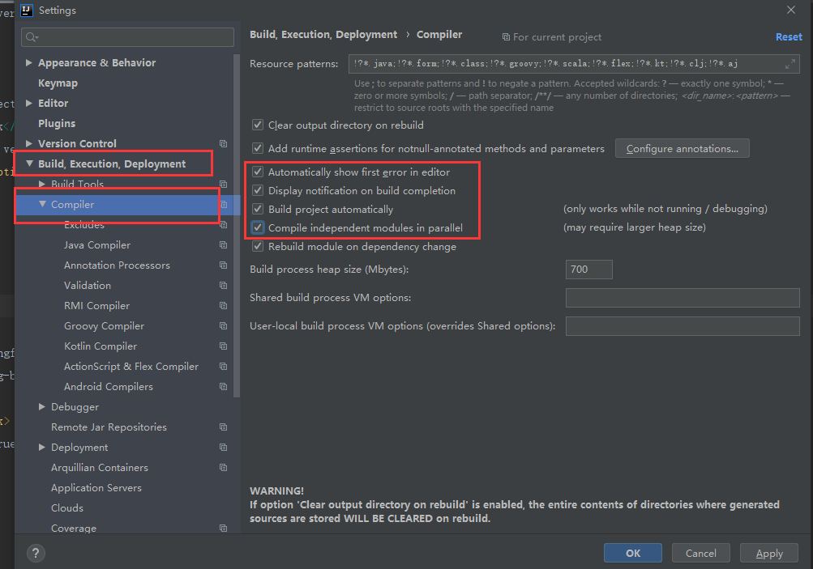
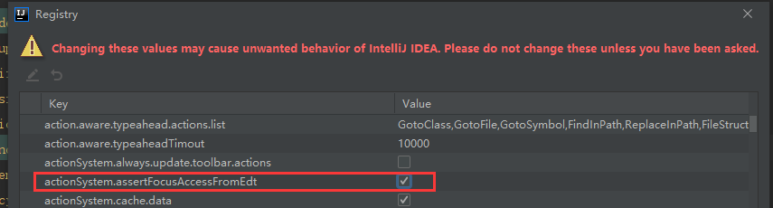
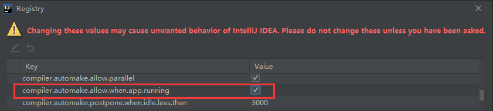
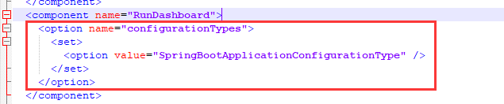
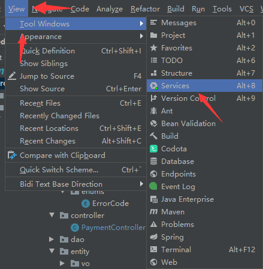
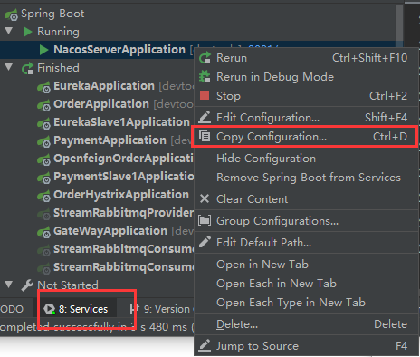
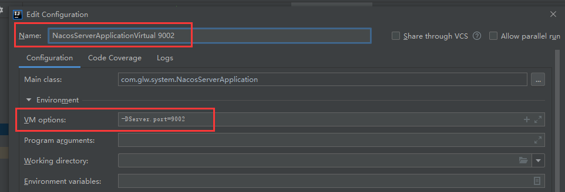

# 常用项目操作

## 1 常规操作

### 1.1 开启springboot项目热部署

1）pom 文件中引入依赖

````xml
<dependency>
    <groupId>org.springframework.boot</groupId>
    <artifactId>spring-boot-devtools</artifactId>
    <!--scope=runtime,只在运行时生效，编译部署不会将此依赖复制到到jar包中-->
    <scope>runtime</scope>
    <!--optional=true,依赖不会往下传递，若有项目依赖本项目且想使用devtools，则需要重新引入-->
    <optional>true</optional>
</dependency>
````

2）pom 文件中配置 maven 插件

````xml
<build>
    <plugins>
        <plugin>
            <groupId>org.springframework.boot</groupId>
            <artifactId>spring-boot-maven-plugin</artifactId>
            <configuration>
                <fork>true</fork><!-- 使热部署的devtools生效 -->
                <addResources>true</addResources>
            </configuration>
        </plugin>
    </plugins>
</build>
````

3）IDEA 编译设置（ADBC 打勾）



4）快捷键 `Ctrl + Alt + Shift + /` 打开 Regitry 设置框，勾选图中两处红框的选项





5）重启 IDEA

### 1.2 手动打开IDEA的RunDashboard

1）进入项目文件夹下的 `.idea` 文件夹

2）编辑 `workspace.xml` 文件，添加如下代码到 `<component name="RunDashboard">` 下



````xml
<option name="configurationTypes">
    <set>
        <option value="SpringBootApplicationConfigurationType" />
    </set>
</option>
````

3）在 IDEA 的菜单中开启 `Run Dashboard`，依次点击 View -> Tool Windows -> Services（老版本为 Run Dashboard）



### 1.3 拷贝虚拟端口映射服务

1）在 IDEA 的下方启动菜单中选择需要拷贝的服务，右键选择 Copy Configuration



2）修改以下服务启动时显示的名称，并在 Configuration 标签栏下的 Environment 中的 VM options 加上启动命令（自定义指定端口号）

````shell
-DServer.port=9002
````

