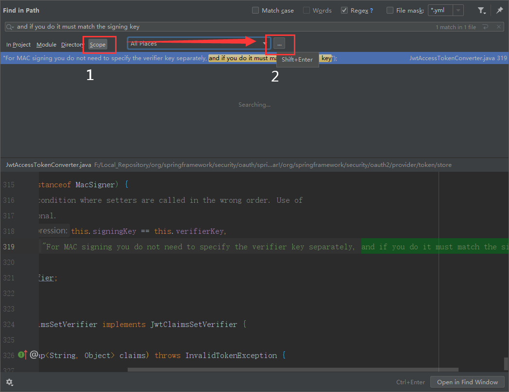
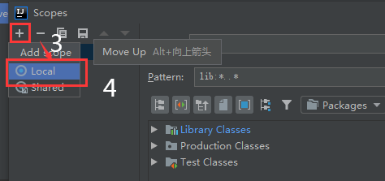
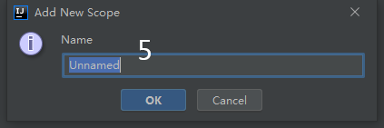
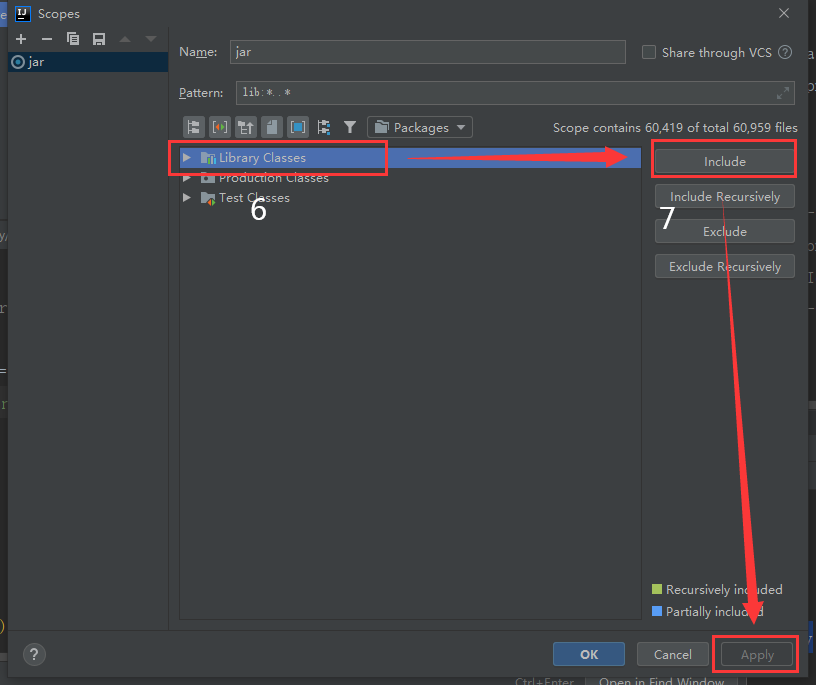
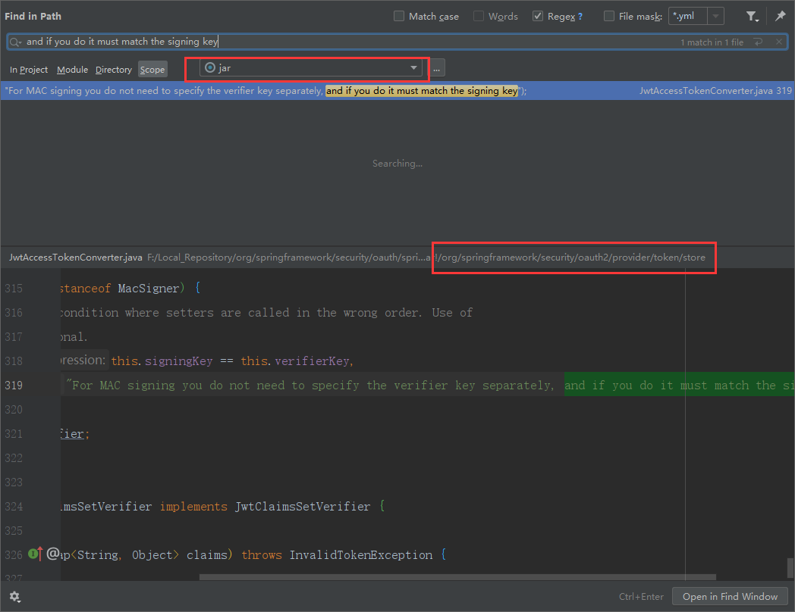

# 常用项目操作

## 1 常规操作

### 1.1 开启springboot项目热部署

1）pom 文件中引入依赖

````xml
<dependency>
    <groupId>org.springframework.boot</groupId>
    <artifactId>spring-boot-devtools</artifactId>
    <!--scope=runtime,只在运行时生效，编译部署不会将此依赖复制到到jar包中-->
    <scope>runtime</scope>
    <!--optional=true,依赖不会往下传递，若有项目依赖本项目且想使用devtools，则需要重新引入-->
    <optional>true</optional>
</dependency>
````

2）pom 文件中配置 maven 插件

````xml
<build>
    <plugins>
        <plugin>
            <groupId>org.springframework.boot</groupId>
            <artifactId>spring-boot-maven-plugin</artifactId>
            <configuration>
                <fork>true</fork><!-- 使热部署的devtools生效 -->
                <addResources>true</addResources>
            </configuration>
        </plugin>
    </plugins>
</build>
````

3）IDEA 编译设置（ADBC 打勾）


4）快捷键 `Ctrl + Alt + Shift + /` 打开 Regitry 设置框，勾选图中两处红框的选项


5）重启 IDEA

### 1.2 手动打开IDEA的RunDashboard

1）进入项目文件夹下的 `.idea` 文件夹

2）编辑 `workspace.xml` 文件，添加如下代码到 `<component name="RunDashboard">` 下


````xml
<option name="configurationTypes">
    <set>
        <option value="SpringBootApplicationConfigurationType" />
    </set>
</option>
````

3）在 IDEA 的菜单中开启 `Run Dashboard`，依次点击 View -> Tool Windows -> Services（老版本为 Run Dashboard）


### 1.3 拷贝虚拟端口映射服务

1）在 IDEA 的下方启动菜单中选择需要拷贝的服务，右键选择 Copy Configuration


2）修改以下服务启动时显示的名称，并在 Configuration 标签栏下的 Environment 中的 VM options 加上启动命令（自定义指定端口号）

````shell
-DServer.port=9002
````


### 1.4 使用 java 的 keytool 生成证书

#### 1.4.1 生成公钥和私钥

1）打开控制台窗口，输入命令生成证书

````shell
keytool -genkey -alias certificate -keyalg RSA -keystore F:\DevProject\keytool\certificate.jks -dname CN=localhost,OU=localhost,O=localhost,L=SZ,ST=GD,C=CN -keypass 123456 -storepass 123456 -validity 36500
````

参数：

- alias：别名，可任意修改
- keyalg：加密方式，默认 DSA
- keystore：证书存储地址
- dname：证书信息
    - CN：名字
    - OU：组织单位名
    - O：组织机构名
    - L：城市
    - ST：省份
    - C：国家
- keypass：证书加密密码
- storepass：证书解密密码
- validity：有效期，单位（天）

2）提取私钥前，需要把证书转成 pfx 格式

```shell
keytool -v -importkeystore -srckeystore F:\DevProject\keytool\certificate.jks -srcstoretype jks -srcstorepass 123456 -destkeystore F:\DevProject\keytool\private_certificate.pfx -deststoretype pkcs12 -deststorepass 123456 -destkeypass 123456
```

3）提取私钥到文件

````shell
openssl pkcs12 -in F:\DevProject\keytool\private_certificate.pfx -nocerts -nodes -out F:\DevProject\keytool\private_certificate.key
````

4）提取公钥为 public key 格式

````shell
keytool -list -rfc --keystore F:\DevProject\keytool\certificate.jks | openssl x509 -inform pem -pubkey
````

4）导出公钥证书到指定项目资源文件夹

````shell
keytool -exportcert -alias certificate -keystore F:\DevProject\keytool\certificate.jks -file F:\DevProject\easy-cloud\oauth2\oauth2-server\src\main\resources\public_certificate.cert -storepass 123456
````

参数：

- file：指定导出的证书位置及证书名称

#### 1.4.2 查看操作

1）查看证书信息

````shell
keytool -list -v -keystore F:\DevProject\keytool\certificate.jks -storepass 123456
````

2）查看 cert 格式的公钥

````shell
keytool -list -rfc -keystore F:\DevProject\keytool\certificate.jks -storepass 123456
````

3）通过 openssl 查看 public key 格式的公钥（Windows 环境下需要下载 openssl，官网下载地址：http://slproweb.com/products/Win32OpenSSL.html）

````shell
keytool -list -rfc --keystore certificate.jks | openssl x509 -inform pem -pubkey
````

4）查看 pfx 格式的私钥

````shell
openssl pkcs12 -in F:\DevProject\keytool\private_certificate.pfx -nocerts -nodes
````

### 1.5 配置 IDEA 全局搜索 jar 包内容

1）Ctrl + Shift + F 快捷键打开全局搜索，点击 Scope，然后点击右边红框的三个点菜单按钮；



2）点击加号，选择 Local ；



3）在弹出框中输入任意一个名字；



4）选择 Library Classes，然后点击右边的 Include，最后确定即可。



6）此时全局搜索即可搜索依赖 jar 包中的内容。

