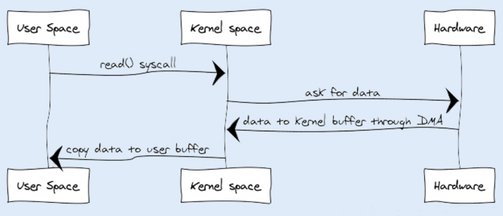
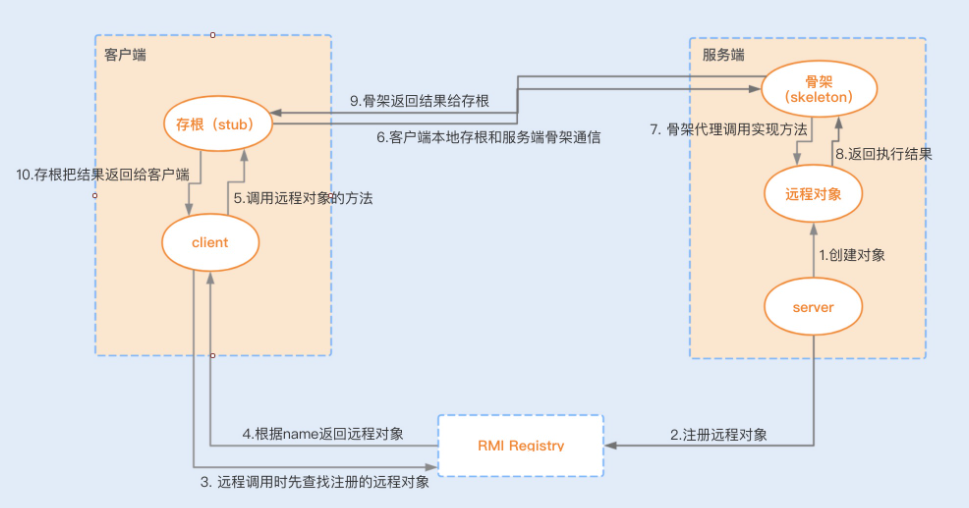
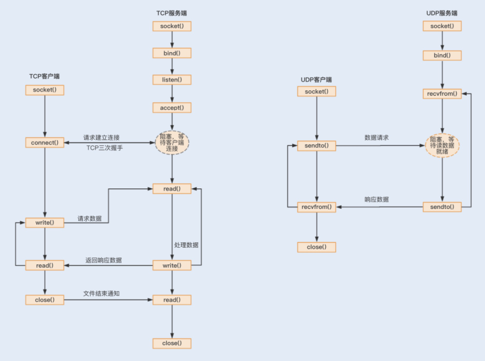
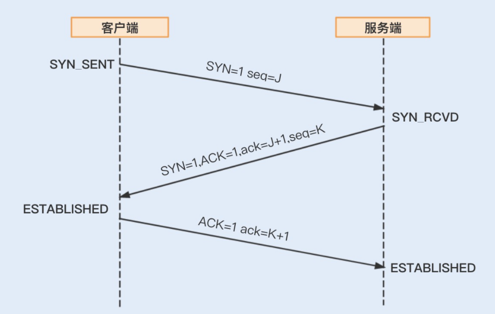
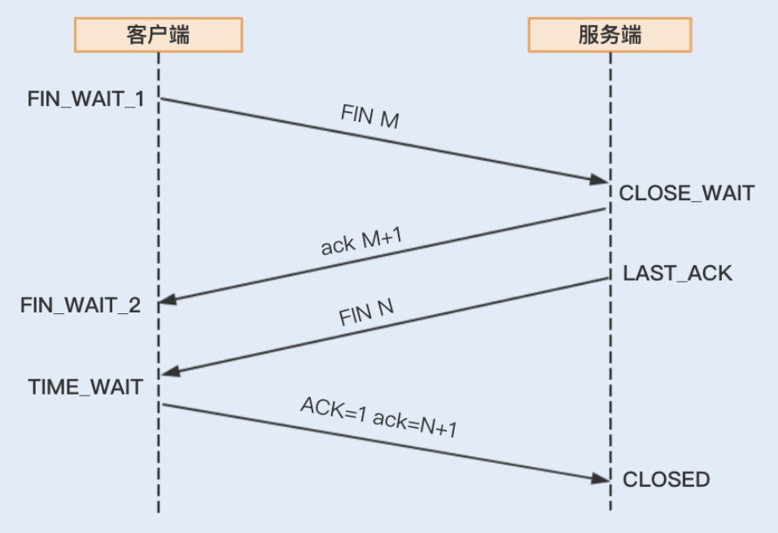
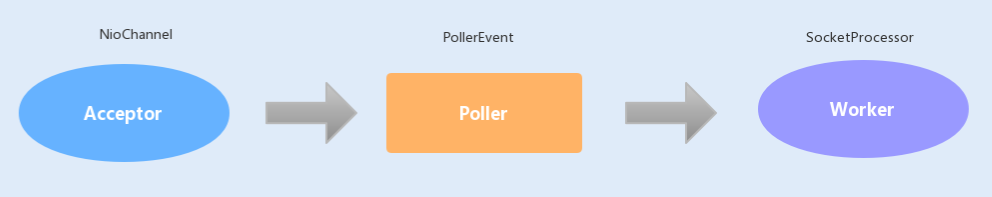

# 项目性能调优

## 1 性能调优概念

### 1.1 调优原因及目的

**1. 原因**

没有经过性能测试的系统，访问量急剧上升时，会导致系统不稳定甚至宕机。

**2. 目的**

- 提高系统性能；
- 节省公司成本。

### 1.2 调优时机

**1. 项目开发初期**

代码层面保证规范的编码：

- 减少磁盘 I/O 操作；
- 降低竞争锁的使用
- 使用低复杂度算法；
- 合理使用设计模式实现业务代码（如商品折扣红包等业务使用装饰模式）。

**2. 项目开发完成**

- 根据性能测试结果种的不足指标定向调优；
- 对日志进行分析及时修复问题。

### 1.3 调优指标

**1. CPU**

减少 CPU 占用过高的操作，占用 CPU 资源的操作：

- 代码递归导致的无限循环
- 正则表达式引起的回溯
- JVM 频繁的 Full GC
- 多线程编程造成的大量上下文切换

**2. 内存**

内存成本较高，在有限的内存中，降低内存溢出、内存泄漏等风险。

**3. 磁盘 I/O**

磁盘 I/O 读写速度较慢，尽量减少磁盘 I/O 访问次数。

**4. 网络**

提高网络带宽大小。

**5. 异常**

Java 项目中，抛出异常需要构建异常栈，对异常进行捕获和处理，此过程非常消耗系统性能。

**6. 数据库**

大量写操作的系统，优化数据库是整个系统的核心工作。

**7. 锁竞争**

减少锁竞争带来的上下文切换，降低系统性能消耗。

**8. 响应时间 RT**

响应时间（Response Time）越短越好，分为四种：

- 数据库响应时间（最耗时）：主要是写入数据到磁盘的时间消耗；
- 服务端响应时间（包含 Nginx 转发请求时间）：主要是服务端业务逻辑的时间消耗；
- 网络响应时间：主要是对传输请求及响应进行解析的时间消耗；
- 客户端响应时间：客户端含有大量逻辑处理的时间消耗（几乎没有逻辑处理的 Web、APP 客户端时间消耗可忽略不计）。

**9. 吞吐量 TPS**

吞吐量（Transaction per second）越高越好，即每秒事务处理，可分为两种：

- 磁盘吞吐量
- 网络吞吐量

1）磁盘吞吐量

磁盘吞吐量有两个关键指标：

- IOPS（Input/Output Per Second），即每秒的读写次数，主要是随机读写的场景，如小文件存储、OLTP 数据库、邮件服务器等；
- 数据吞吐量，即单位时间内可以成功传输的数据量，主要是顺序读写的场景，如电视台的视频编辑、音频/视频点播等。

2）网络吞吐量 

网络吞吐量指在不丢帧的情况下，设备能够接受的最大数据速率，影响因素如下：

- CPU
- 网卡处理能力
- 网络带宽大小
- 防火墙
- 外部接口响应时间 RT
- 磁盘 I/O

**10. 计算机资源分配使用率**

计算机资源分配使用率就像木桶效应，最高性能取决于木桶中的最短短板，有4个指标：

- CPU 占用率
- 内存使用率
- 磁盘 I/O
- 网络 I/O

**11. 负载承受能力**

负载承受能力有两个指标：

- 系统压力上升时，系统响应时间曲线变化是否平缓；
- 系统压力的上限（压力增长到系统大量抛出错误时）。

### 1.4 微基准性能测试

**1. 目标**

精准定位到某个模块或方法的性能问题。

**2. 适用场景**

适用于做一个功能模块或一个方法在不同实现方式下的性能对比，如方法加锁和不加锁的性能对比。

### 1.5 宏基准性能测试

**1. 测试环境**

需要模拟线上真实环境，包括部署方案、真实数据等。

**2. 测试场景**

测试接口时需要排除其他业务接口的干扰。

**3. 测试目标**

- 吞吐量、响应时间是否达标
- 观察最大 TPS 时各个服务器的 CPU、内存及 I/O 使用率的变化

**4. 干扰因素**

- 热身问题
- 性能测试结果不稳定
- 多 JVM 情况下的影响

1）热身问题

- 问题状况：性能测试时，系统运行的越来越快，同一接口或方法的运行速度比第一次访问快上几倍；
- 产生原因：①随着某个方法或代码块的执行次数增多，JVM 会通过即时编译器（JIT compiler，just-in-time compiler）对程序中的热点代码编译成平台相关机器码，并进行各层次的优化，并存储在内存中；②刚开始的运行阶段，JVM 会花费很长时间来全面优化代码，后续则以最高性能执行。

2）性能测试结果不稳定

- 问题状况：每次测试所用数据集都是相同的，但是测试结果确有差异；
- 产生原因：①其他进程的影响；②网络波动；③每个阶段的 JVM 垃圾回收内存分配效率的不同。

3）多 JVM 情况下的影响

- 问题状况：多个 Java 应用部署在不同的 tomcat 下，其中任意一个 JVM 都拥有整个系统的资源使用权，互相争夺抢占资源；
- 解决方案：尽量避免线上环境中一台机器部署多个 JVM 的情况。

### 1.6 调优策略

从应用层到操作系统层的几种调优策略：

- 优化代码
- 优化设计
- 优化算法
- 时间换空间
- 空间换时间
- 参数调优
- 兜底策略，确保系统稳定性

**1. 优化代码**

- 避免内存溢出等问题代码
- 优化非问题代码，如使用合适场景的集合类

**2. 优化设计**

使用合适的设计模式。

**3. 优化算法**

使用较低的时间复杂度的算法。

**4. 时间换空间**

系统对时间的要求比空间重要的场景，如 String 的 `intern()` 方法，将重复率较高的数据集存储在常量池，节省空间。

**5. 空间换时间**

系统对空间的要求比时间重要的场景，提升系统访问速度，如分库分表。

**6. 参数调优**

可进行参数调优的层面：

- JVM（内存空间及垃圾回收算法）
- Web 容器（线程池的设置）
- 操作系统（内核参数设置）

**7. 兜底策略**

系统优化的再好也有承受极限，为保证系统稳定性，必须提供兜底策略：

- 限流（达到最大范围采取熔断，返回友好提示，而不是崩溃信息）
- 实现智能横向扩容（超过指定请求阈值时，系统根据需求自动横向扩容，如 Kubernetes）
- 提前扩容（适用于秒杀、抢购等高并发系统）

## 2 代码性能调优

### 2.1 字符串性能优化

String 对象是 Java 程序中，内存占用空间率最大的一个对象。

#### 2.1.1 String 的 JDK 优化路线


**1. JDK 1.6 及以前版本**

String 对象对 char 数组进行了封装实现的对象，主要有4个成员变量：

- char 数组
- 偏移量 offset
- 字符数量 count
- 哈希值 hash

String 对象通过 offset 和 count 两个属性来定位 char[] 数组，获取字符串。

1）优势

- 高效、快速的共享数组对象
- 节省内存空间

2）劣势

可能导致内存泄漏（`String.substring()` 方法共享 char[] 数组）。

**2. JDK 1.7 至 JDK 1.8**

去掉了 offset 和 count 两个属性变量。

优势：

- String 对象的内存占用减少
- 解决了内存泄漏问题（`String.substring()` 方法不再共享 char[] 数组）

**3. JDK 1.9 及以后**

将 char[] 属性变量更改为 byte[] 字段，并添加了一个新的属性 coder（编码格式的标识）。

1）修改原因

因为 char 字节占16位，即2个字节，存储单字节编码内的字符（如 Latin1 字符）比较浪费内存空间，于是采用占用8位，即1个字节的 byte[] 数组来存放字符串。

2）coder 属性作用

计算字符串长度或者调用 `indexOf()` 方法时，需要根据此字段，计算字符串长度，coder 字段默认有0和1两个值：

- 0表示 Latin1（单字节编码）
- 1表示 UTF-16

3）优势

进一步节省 String 对象的内存占用。

#### 2.1.2 String 对象的不可变性

**1. 实现**

- String 类被 final 修饰，表示该类不可被继承；
- char[] 属性变量被 final + private 修饰，表示 String 对象不看被更改。

**2. 优势**

- 保证 String 对象的安全性，防止恶意修改；
- 保证 hash 属性值不会频繁变更，确保唯一性（如 HashMap 等容器以此才能实现 key-value 缓存功能）；
- 可实现字符串常量池。

**3. 创建字符串对象的两种方式**

①通过字符串常量的方式创建，如 `String str = "str";`，此时 JVM 会先检查该对象是否存在于字符串常量池中，如果存在则返回该对象引用，否则将其在字符串常量池中创建。

优势：减少同值字符串对象的重复创建，节约内存。

②通过新建对象的方式创建，如 `String str = new String("str");`，首先在编译类文件时，将此字符串常量放入到 class 字节码文件的常量池结构中，类加载时 `"str"` 会在常量池中创建，其次，在调用 new 时，JVM 会调用 String 的构造函数，同时将引用常量池中的 `"str"` 字符串，在堆内存中创建一个 String 对象，最后 `"str"` 引用此对象。

#### 2.1.3 String 对象的优化方案

- 字符串拼接尽量用 `StringBuilder` 代替 `+` 号
- 项目内产生大量字符串的场景下，使用 `String.intern()` 节省内存
- 字符串分割时，尽量使用 `String.indexOf()` 方法代替 `split()` 方法

**1. 字符串拼接**

字符串拼接尽量用 `StringBuilder` 代替 `+` 号。

1）编译器优化

用 `+` 号作为字符串的拼接，会被编译器优化成新建 `StringBuilder` 对象，并调用它的 `append()` 方法的方式，但是如果在循环中用 `+` 号拼接，则会循环创建 `StringBuilder` 对象，浪费资源。

2）线程安全问题

多线程中使用 `StringBuffer` 来拼接字符串，此方法被 synchronized 修饰。

> 但是如果 JVM 通过逃逸分析发现此方法并没有锁竞争，则会进行锁消除。

**2. 节省内存**

项目内产生大量字符串的场景下，使用 `String.intern()` 节省内存。

1）`intern()` 实现原理

①首先会去查看字符串常量池是否存在该对象的字符串，有则返回常量池中的字符串引用，没有则②；

②在常量池中新增该对象，并返回该对象引用。

③堆内存中原有的对象如果没有引用指向它，后续将会通过 gc 回收该引用。

2）`intern()` 优点

- 节省内存

3）`intern()` 缺点

- 数据存储过大时，遍历的时间复杂度会增加，导致效率低下（常量池内部实现类似于 HashTable）

**3. 字符串分割**

字符串分割时，尽量使用 `String.indexOf()` 方法代替 `split()` 方法。

> `split()` 方法底层通过正则表达式实现的字符串分割，使用不当可能导致回溯问题，从而引起 CPU 使用率居高不下。

### 2.2 正则表达式

正则表达式是一个用正则符号写出的公式，程序对此公式进行语法分析，建立一个语法分析书，再根据整个分析书结合正则表达式的引擎生成执行程序（状态机），用于字符匹配。

#### 2.2.1 正则表达式引擎

**1. 作用**

用于建立状态机。

**2. 分类**

实现正则表达式引擎的方式有两种：

- DFA 自动机（Deterministic Final Automata）：确定有限状态自动机
- NFA 自动机（Non deterministic Finite Automaton）：非确定有限状态自动机

**3. DFA 与 NFA 的区别**

- 构造 DFA 自动机的代价远大于 NFA 自动机
- DFA 自动机的执行效率高于 NFA 自动机
- 匹配长度为 n 的字符串，DFA 自动机的时间复杂度为 O(n)；假设 NFA 自动机的状态数为 s，则它的时间复杂度为 O(ns)（因为 NFA 自动机在匹配过程中存在大量分支和回溯）

#### 2.2.2 NFA 自动机

**1. 匹配模式**

NFA 自动机拥有三种匹配模式：

- 贪婪模式（Greedy）：在数量匹配中，如果单独使用 `+`、`?`、`*` 或 `{min,max}` 等量词时，它会匹配尽可能多的内容
- 懒惰模式（Reluctant）：尽可能少的重复匹配字符，即首先选择最小的匹配范围，匹配成功后会继续匹配剩余的字符串，用法是在 `{min,max}` 后加一个 `?`
- 独占模式（Possessive）：最大限度的匹配更多内容，匹配失败就结束匹配，用法是在 `{min,max}` 后加一个 `+`

**2. 回溯问题**

1）问题

在 NFA 自动机的贪婪模式下，匹配每发生一次失败，就引起一次回溯。

2）解决方案

使用懒惰模式或独占模式。

#### 2.2.3 正则表达式的优化

- 少用贪婪模式，多用独占模式

- 减少分支选择
- 减少捕获嵌套

**1. 少用贪婪模式，多用独占模式**

贪婪模式会引起会说问题，使用独占模式避免回溯。

**2. 减少分支选择**

分支选择类型 `(X|Y|Z)` 的正则表达式会降低性能，有几种优化方案：

- 常用的选项放前面，可以被较快匹配
- 提取共用模式，如 `(abcd|abef)` 替换为 `ab(cd|ef)`
- 简单的分支选择类型，可以使用三次 index 代替  `(X|Y|Z)`

**3. 减少捕获嵌套**

1）捕获组

概念捕获组是指把正则表达式中，子表达式匹配的内容保存到以数字编号或显示命名的数组中，方便后面引用。

用法：一般一个 `()` 就是一个捕获组，可以嵌套，如 `(X)(Y)(Z)`，匹配时可以根据 `group(0)` 直接获取到 `(X)` 匹配的子串。

2）非捕获组

概念：非捕获组是指参与匹配却不进行氛组编号的捕获组。

用法：表达式一般由 `(?:exp)` 组成，如 `(?:X)(Y)`，匹配时会直接丢弃 `X` 子串，直接匹配 `Y`。

3）优化

减少不需要获取的分组，可提高正则表达式性能。

### 2.3 List 集合类优化

#### 2.3.1 ArrayList 与 LinkedList 的性能对比

**1. 新增元素**

| 操作                   | 时间消耗时长对比    |
| ---------------------- | ------------------- |
| 从集合头部位置新增元素 | LinkedList 耗时较短 |
| 从集合中间位置新增元素 | ArrayList 耗时较短  |
| 从集合尾部位置新增元素 | ArrayList 耗时较短  |

- ArrayList 是数组实现的，而数组是一块连续的内存空间，在添加元素到数组头部的时候，需要对头部以后的数据进行复制重排，所以效率很低；LinkedList 是基于链表实现，在添加元素的时候，首先会通过循环查找到添加元素的位置，如果要添加的位置处于 List 的前半段，就从前往后找；若其位置处于后半段，就从后往前找。因此 LinkedList 添加元素到头部是非常高效的。
- ArrayList 在添加元素到数组中间时，同样有部分数据需要复制重排，效率也不是很高；LinkedList 将元素添加到中间位置，是添加元素最低效率的，因为靠近中间位置，在添加元素之前的循环查找是遍历元素最多的操作。
- 添加元素到尾部的操作中，在没有扩容的情况下，ArrayList 的效率要高于 LinkedList。因为 ArrayList 在添加元素到尾部的时候，不需要复制重排数据，效率非常高。而 LinkedList 虽然也不用循环查找元素，但 LinkedList 中多了 new 对象以及变换指针指向对象的过程，所以效率要低于 ArrayList。

> 此份结果是基于 ArrayList 初始化容量足够，排除动态扩容数组容量的情况下进行的测试，如有动态扩容的情况，ArrayList 的效率也会降低。

**2. 删除元素**

| 操作                   | 时间消耗时长对比    |
| ---------------------- | ------------------- |
| 从集合头部位置删除元素 | LinkedList 耗时较短 |
| 从集合中间位置删除元素 | ArrayList 耗时较短  |
| 从集合尾部位置删除元素 | ArrayList 耗时较短  |

原理同上（新增元素）。

**3. 遍历元素**

| 操作         | 时间消耗时长对比   |
| ------------ | ------------------ |
| for(;;) 循环 | ArrayList 耗时较短 |
| 迭代器循环   | 耗时相当           |

LinkedList 基于链表实现的，在使用 for 循环的时候，每一次 for 循环都会去遍历半个 List，所以严重影响了遍历的效率；ArrayList 则是基于数组实现的，并且实现了 RandomAccess 接口标志，意味着 ArrayList 可以实现快速随机访问，所以for(;;)  循环效率非常高。

#### 2.3.2 ArrayList 与 LinkedList 的优化方案

- 使用 ArrayList 时，如果集合长度固定，提前初始化初始容量，防止添加时扩容消耗性能；
- 使用 LinkedList 时，遍历时使用迭代器遍历，而不是 for 循环；
- 对集合头部结点增删操作频繁的场景优先使用 LinkedList，其他场景使用 ArrayList。

### 2.4 Stream 优化

#### 2.4.1 性能对比

将常规迭代、Stream 串行迭代、Stream 并行迭代的性能进行对比，迭代循环中，对数据进行过滤、氛组操作的，测试结果如下：

| 测试方案                                     | 时间消耗时长排名                             |
| -------------------------------------------- | -------------------------------------------- |
| 多核 CPU，操作长度为 100 的 int 数组         | 常规迭代 < Stream 并行迭代 < Stream 串行迭代 |
| 多核 CPU，操作长度为 10^8 的 int 数组        | Stream 并行迭代 < 常规迭代 < Stream 串行迭代 |
| 多核 CPU，操作长度为 10^8 的对象数组过滤分组 | Stream 并行迭代 < 常规迭代 < Stream 串行迭代 |
| 单核 CPU，操作长度为 10^8 的对象数组过滤分组 | 常规迭代 < Stream 串行迭代 < Stream 并行迭代 |

#### 2.4.2 优化方案

- 尽量将服务部署在多核 CPU，并使用 Stream 并行迭代的方式处理大量数据的迭代分组等操作（如分库分表的查询操作）；
- 服务部署在单核 CPU 下时，优先使用常规迭代。

### 2.5 HashMap 优化

- 预知存储数据大小时，提前设置初始容量（初始容量 = 数据大小 / 加载因子）且数值必须为 2 的整数次幂，减少 `resize()` 操作，提高效率
- 查询操作较为频繁时，适当减少负载因子
- 希望提高堆内存利用率时，适当增加负载因子

### 2.6 IO 优化

#### 2.6.1 IO 性能缺陷

**1. 多次内存复制**

1）问题

传统 I/O 中，通过 InputStream 从源数据中读取数据流输入到缓冲区里，通过 OutputStream 将数据输出到外部设备（包括磁盘、网络），这两个过程中存在用户态到内核态之间的多次数据拷贝问题。

2）拷贝原理



①JVM 发出 read() 系统调用，并通过 read 系统调用向内核发起读请求；

②内核（kernel）向硬件发送读指令，并等待读就绪；

③内核把将要读取的数据复制到指向的内核缓存中；

④操作系统内核将数据复制到用户空间缓冲区，然后 read 系统调用返回。

在这个过程中，数据先从外部设备复制到内核空间，再从内核空间复制到用户空间，发生了两次内存复制操作。这种操作导致不必要的数据拷贝和上下文切换，从而降低 I/O 的性能。

**2. 阻塞**

1）问题

在发生大量连接请求时，就需要创建大量监听线程，这时如果线程没有数据就绪就会被挂起，然后进入阻塞状态。一旦发生线程阻塞，这些线程将会不断地抢夺 CPU 资源，从而导致大量的 CPU 上下文切换，大大增加系统的性能开销。

2）阻塞原理

在传统 I/O 中，InputStream 的 read() 是一个 while 循环操作，它会一直等待数据读取，直到数据就绪才会返回。

#### 2.6.2 IO 优化路线

JDK 1.4 以前传统 BIO（同步阻塞 IO），JDK1.4 发布了 java.nio 包（new I/O，同步非阻塞 IO），JDK1.7 发布了 NIO2（AIO，异步非阻塞 IO），提出了从操作系统层面实现的异步 I/O。

**1. 使用缓冲区优化读写流操作**

1）BIO

BIO 是基于流的 I/O 实现，即 InputStream 和 OutputStream，以字节为单位处理数据，效率低。

2）NIO

NIO 以块（Block）为基本单位处理数据，它有两个重要组件：

- 缓冲区（Buffer）：是一块连续的内存块，是 NIO 读写数据的中转地；
- 通道（Channel）：缓冲数据的源头或者目的地，它用于读取缓冲或者写入数据，是访问缓冲的接口。

3）区别

- BIO 面向流，NIO 面向 Buffer
- BIO 是边读文件边处理数据，NIO 的 Buffer 可以将文件一次性读入内存再做后续处理

> NIO 处理效率高于 BIO。

**2. 使用 DirectBuffer 减少内存复制**

1）实现原理

NIO 提供了一个可以直接访问物理内存的类 DirectBuffer。普通的 Buffer 分配的是 JVM 堆内存，而 DirectBuffer 是直接分配物理内存。

2）作用

数据要输出到外部设备，必须先从用户空间复制到内核空间，再复制到输出设备，而 DirectBuffer 则是直接将步骤简化为从内核空间复制到外部设备，减少了数据拷贝。

3）缺陷

由于 DirectBuffer 申请的是非 JVM 的物理内存，所以创建和销毁的代价很高。

> DirectBuffer 包装类被回收时，会通过 Java Reference 机制来释放该内存块。

**3. 避免阻塞，优化 IO 操作**

NIO 的通道（Channel）和多路复用器（Selector），这两个基本组件实现了 NIO 的非阻塞。

1）通道（Channel）

Channel 拥有自己的处理器，可以完成内核空间和磁盘之间的 I/O 操作（解决了 DMA 总线冲突问题）。Channel 是双向的，读、写可以同时进行。

> 传统 IO 中操作系统引入了 DMA（直接存储器存储），内核空间与磁盘之间的存取完全由 DMA 负责。但是 DMA 依然需要向 CPU 申请权限，且需要借助 DMA 总线来完成数据的复制操作，如果 DMA 总线过多，就会造成总线冲突。

2）多路复用器（Selector）

Ⅰ. 概念

Selector 用于检查一个或多个 NIO Channel 的状态是否处于可读、可写。

Ⅱ. 实现原理

Selector 基于事件驱动实现的，在 Selector 中注册 accpet、read 监听事件，Selector 会不断轮询注册在其上的 Channel，如果某个 Channel 上面发生监听事件，这个 Channel 就处于就绪状态，然后进行 I/O 操作。

#### 2.6.3 优化方案

- 使用 tio、disruptor、netty等框架（NIO）代替传统 BIO

### 2.7 序列化优化

#### 2.7.1 Java 序列化

Java 的序列化缺陷：

- 无法跨语言
- 易被攻击
- 序列化后的流太大
- 序列化性能较差

**1. 无法跨语言**

Java 序列化目前只适用基于 Java 语言实现的框架，其它语言大部分都没有使用 Java 的序列化框架，也没有实现 Java 序列化这套协议。

**2. 易被攻击**

反序列化是调用 ObjectInputStream 上的 readObject() 方法，它可以将类路径上几乎所有实现了 Serializable 接口的对象都实例化，也就是说，在反序列化字节流的过程中，该方法可以执行任意类型的代码。

> 攻击者可以创建循环对象链，然后将序列化后的对象传输到服务中反序列化，这种情况会导致 hashCode 方法被调用次数呈次方爆发式增长, 从而引发栈溢出异常。

**3. 序列化后的流太大**

序列化后的二进制数组越大，占用的存储空间就越多，存储硬件的成本就越高。如果进行网络传输，则占用的带宽就更多，影响系统的吞吐量。

**4. 序列化性能较差**

Java 序列化中的编码耗时要比 ByteBuffer 长很多。

#### 2.7.2 优化方案

使用 Protobuf、FastJson、Kryo、Protobuf、Hessian 等序列化替换 Java 序列化。

### 2.8 RPC 通信优化

#### 2.8.1 SpringCloud 与 Dubbo 对比

**1.  实现对比**

|          | Spring Cloud        | Dubbo                                                   |
| -------- | ------------------- | ------------------------------------------------------- |
| 服务通信 | 基于 Feign 组件实现 | 基于 SPI 扩展多个 RPC 通信框架（RMI、Dubbo、Hessian等） |
| 序列化   | Json 序列化         | 默认 Hessian 序列化                                     |
| 通信协议 | Http                | Dubbo 协议                                              |

**2. 性能对比**

|          | Spring Cloud                                | Dubbo                    |
| -------- | ------------------------------------------- | ------------------------ |
| 数据包   | http 请求头臃肿（http 1.1），导致数据包过大 | 数据包较小               |
| 连接     | 短链接，一个请求对应一个响应                | 单一 tcp 长连接          |
| 响应时间 | 高并发场景下响应时间较长                    | 高并发场景下响应时间较短 |

#### 2.8.2 RMI

**1. 概念**

RMI（Remote Method Invocation）是 JDK 中自带的 RPC 通信框架（Dubbo 框架也是基于 RMI 框架实现的），RMI 实现了一台虚拟机应用对远程方法的调用可以同对本地方法的调用。

**2 实现原理**

RMI 远程代理对象是 RMI 中最核心的组件，除了对象本身所在的虚拟机，其它虚拟机也可以调用此对象的方法，RMI 远程调用通信过程如图：



**2. RMI 的性能瓶颈**

- Java 默认序列化，序列化效率低，数据包过大
- TCP 短链接，高并发场景下，大量连接的创建和销毁，严重拖慢系统性能
- 阻塞 IO，高并发场景下，容易阻塞，降低性能

#### 2.8.3 优化方案

- 选择合适的通信协议
- 服务间通信使用单一长连接
- 优化 Socket 通信
- 根据业务定制合适的报文结构
- 选择合适的编码解码技术（序列化）
- 优化 Linux 的 TCP 参数设置选项

**1. 选择合适的通信协议**

基于 Socket 编程接口的通信协议有两个，TCP 和 UDP。

1）数据传输过程对比



2）特点

- TCP 基于三次握手实现了数据传输的可靠性，数据无边界，采用字节流模式传输数据；
- UDP 无需建立连接，只需要创建一个 Socket 发送数据报文给服务，不保证数据的可靠性，采用数据报模式传输数据（数据报头中自带报文长度）。

3）适用场景

- 消息可靠场景：TCP
- 对消息传输效率要求高且消息丢失可容忍场景：UDP

**2. 服务间通信使用单一长连接**

1）服务间通信

服务之间的通信连接不会太多，基于长连接实现，可以省去大量的 TCP 建立和关闭连接的操作，从而减少系统的性能消耗，节省时间。

2）客户端与服务端通信

客户端与服务端由于客户端数量多，基于短连接实现请求可以避免长时间地占用连接，节省系统资源。

**3. 优化 Socket 通信**

使用成熟的 IO 通信框架，如 Disruptor、tio、Netty 等。

1）netty 实现原理

| 优化手段                | 实现原理                                                     |
| ----------------------- | ------------------------------------------------------------ |
| 非阻塞 IO               | 底层基于 NIO 实现                                            |
| 高效的 Reactor 线程模型 | Netty 使用主从 Reactor 多线程模型，服务端接收客户端请求连接是用了一个主线程，主线程用于客户端的连接请求操作，连接建立成功时会监听 I/O 事件，监听到事件后会创建一个链路请求。链路请求将会注册到负责 I/O 操作的 I/O 工作线程上，由 I/O 工作线程负责后续的 I/O 操作。（解决了单个 NIO 线程无法监听海量客户端和满足大量 I/O 操作造成的问题，提高系统性能） |
| 串行设计                | 服务端接收消息后的编码、解码、读取和发送等链路操作，采用了串行无锁化完成链路操作（Pipeline 用于实现链路的各个操作在运行期间不进行线程切换，解决了这些操作并行实现的锁竞争问题，提高系统性能） |
| 零拷贝                  | NIO 提供的 ByteBuffer 可以使用 Direct Buffers 模式，直接开辟一个非堆物理内存，不需要进行字节缓冲区的二次拷贝，可以直接将数据写入到内核空间 |
| TCP 参数配置项          | 基于 ChannelOption 设置参数（如下描述）                      |

TCP 参数配置项：

①TCP_NODELAY，控制是否开启 Nagle 算法，延时敏感的场景下需要将其关闭。

> Nagle 算法通过缓存的方式将小的数据包组成一个大的数据包，从而避免大量的小数据包发送阻塞网络，提高网络传输的效率。

②SO_BACKLOG，指定了客户端连接请求缓冲队列的大小。

> 服务端处理客户端连接请求是按顺序处理的，所以同一时间只能处理一个客户端连接，当有多个客户端进来的时候，服务端就会将不能处理的客户端连接请求放在队列中等待处理。

③SO_KEEPALIVE：设置该选项以后，连接会检查长时间没有发送数据的客户端的连接状态，检测到客户端断开连接后，服务端将回收该连接（将该时间设置得短一些，来提高回收连接的效率）。

**4. 根据业务定制合适的报文结构**

根据具体业务场景定制合适的报文结构，实现报体小、满足功能、易解析等特性。

1）数据报文结构表

| 魔数(0xCAFEBABA) | 版本号(1) | 序列化算法 | 指令  | 数据长度 | 数据  |
| ---------------- | --------- | ---------- | ----- | -------- | ----- |
| 4字节            | 1字节     | 1字节      | 1字节 | 1字节    | n字节 |

2）字段含义

| 字段       | 字段含义                                                     |
| ---------- | ------------------------------------------------------------ |
| 魔数       | 占用4字节，协议头标识，区分这组二进制数据是否属于当前协议    |
| 版本号     | 占用1字节，预留字段                                          |
| 序列化算法 | 占用1字节，对数据编码和节码的方式                            |
| 指令       | 占用1字节，每个指令对应一个处理逻辑，最高支持256种指令，如 HTTP 中的增删改查指令 |
| 数据长度   | 占用4字节，标识数据长度，截取数据                            |
| 数据       | 存储编码后的数据                                             |

**5. 选择合适的编码解码技术**

（同 [2.7.2 优化方案](#2.7.2-优化方案)）使用 Protobuf、FastJson、Kryo、Protobuf、Hessian 等序列化替换 Java 序列化。

**6. 优化 Linux 的 TCP 参数设置选项**

首先从 TCP 连接的三次握手和关闭 TCP 连接的四次握手开始。

1）TCP 三次握手



2）四次挥手



3）优化操作

①通过下方命令运行查看 Linux 系统默认的的 TCP 参数设置。

````shell
sysctl -a | grep net.xxx
````

②需要修改某项配置时，执行命令编辑配置文件。

````shell
vim /etc/sysctl.conf
````

③使修改后的配置生效

````shell
sysctl -p
````

4）可优化的配置项

| 配置项                       | 说明                                                         | 优化方法                                                     |
| ---------------------------- | ------------------------------------------------------------ | ------------------------------------------------------------ |
| file-max/ulimit              | ulimit 表示 Linux 默认单个进程用户打开 fd（socket）的数量为1024（java 应用超过限制时会报 `java.io.IOException: 打开文件过多` 的错误），file-max 表示系统总的打开 fd 数量 | 设置 ulimit 来增加单个用户的fd 数量，如果单个进程的 fd 数量超过 file-max，也需要修改 file-max |
| net.ipv4.tcp_keepalive_time  | 此配置项与 Netty 的 SO_KEEPALIVE 配置项作用相同，检查客户端的连接状态 | 减少检查状态的时间，提高连接的回收频率                       |
| net.ipv4.tcp_max_syn_backlog | 该配置项表示 SYN 队列的长度，默认1024                        | 加大队列长度，可容纳更多等待连接的网络连接数                 |
| net.ipv4.tcp_syncookies      | 当出现 SYN 等待队列溢出时，开启该配置项                      | 启用 cookies 处理，防御少量 SYN 攻击                         |
| net.ipv4.ip_local_port_range | 客户端连接服务端时，需要动态分配源端口号，该配置项表示用于向外连接的端口范围 | 默认端口范围是32768~61000，可以扩充其范围                    |
| net.ipv4.tcp_max_tw_buckets  | 当一个连接关闭时，TCP 会通过四次挥手来完成关闭连接操作，请求量大的情况下，消费端会产生大量的 TIME_WAIT 状态的连接。如果此状态的连接数量超过该参数，则 TIME_WAIT 会被立刻清除并打印警告信息 | 减小该参数，可以限制 TIME_WAIT 状态的连接数量                |
| net.ipv4.tcp_tw_reuse        | k客户端每次连接服务端时，会获得一个新的源端口以实现连接的唯一性。在 TIME_WAIT 状态的连接数量过大的情况下，会增加端口号的占用时间 | 开启后，处于 TIME_WAIT 状态的连接属于关闭连接，创建新连接时则复用该端口号 |

### 2.9 Tomcat 调优

- 修改线程模型
- 参数调优

**1. 修改线程模型**

Tomcat 8.5 之前的版本，可以修改线程的 IO 模型为 NIO 模型。

> Tomcat 8.5 版本之前，默认情况下使用的是 BIO 线程模型。在高负载、高并发的场景下，可以通过设置  NIO 线程模型，来提高系统的网络通信性能。

**2. 参数调优**

1）原理

Tomcat 中，BIO、NIO 是基于主从 Reactor 线程模型实现的。

-  在 BIO 中，Tomcat 中的 Acceptor 只负责监听新的连接，一旦连接建立监听到 I/O 操作，将会交给 Worker 线程中，Worker 线程专门负责 I/O 读写操作；
- 在 NIO 中，Tomcat 新增了一个 Poller 线程池，Acceptor 监听到连接后，不是直接使用 Worker 中的线程处理请求，而是先将请求发送给了 Poller 缓冲队列。在 Poller 中，维护了一个 Selector 对象，当 Poller 从队列中取出连接后，注册到该 Selector 中；然后通过遍历 Selector，找出其中就绪的 I/O 操作，并使用 Worker 中的线程处理相应的请求。



2）设置 Acceptor 线程池和 Worker 线程池的配置项

- acceptorThreadCount：该参数代表 Acceptor 的线程数量，在请求客户端的数据量非常巨大的情况下，可以适当地调大该线程数量来提高处理请求连接的能力，默认值为 1；
- maxThreads：专门处理 I/O 操作的 Worker 线程数量，默认是 200，可以根据实际的环境来调整该参数，但不是越大越好；
- acceptCount：Tomcat 的 Acceptor 线程是负责从 accept 队列中取出该 connection，然后交给工作线程去执行相关操作，这里的 acceptCount 指的是 accept 队列的大小。当 Http 关闭 keep alive，在并发量比较大时，可以适当地调大这个值。而在 Http 开启 keep alive 时，因为 Worker 线程数量有限，Worker 线程就可能因长时间被占用，而连接在 accept 队列中等待超时。如果 accept 队列过大，就容易浪费连接；
- maxConnections：表示有多少个 socket 连接到 Tomcat 上。在 BIO 模式中，一个线程只能处理一个连接，一般 maxConnections 与 maxThreads 的值大小相同；在 NIO 模式中，一个线程同时处理多个连接，maxConnections 应该设置得比 maxThreads 要大的多，默认是 10000。

## 3 多线程性能调优

### 3.1 Synchronized 优化

- 减少锁竞争
- 减小锁粒度
- 减少锁的持有时间

#### 3.1.1 偏向锁优化

**1. 优化手段**

添加 JVM 参数关闭偏向锁（任选其一即可）：

- `-XX:-UseBiasedLocking`：关闭偏向锁（默认打开）
- `-XX:+UseHeavyMonitors`：设置重量级锁

**2. 适用场景**

大量线程同时竞争同一个锁资源的高并发场景。

**3. 调优原理**

当大量线程同时竞争同一个锁资源时，偏向锁就会被撤销，发生 stop the word 后， 开启偏向锁会带来巨大的性能开销。

#### 3.1.2 自旋锁优化

**1. 优化手段**

添加 JVM 参数关闭自旋锁：

- `-XX:-UseSpinning `：关闭自旋锁优化 (默认打开) 
- `-XX:PreBlockSpin`：修改默认的自旋次数（JDK1.7 后，移除了此参数，由 jvm 控制）

**2. 适用场景**

锁竞争激烈或锁占用的时间过长的高并发场景。

#### 3.1.3 减小锁粒度

**1. 优化手段**

当锁对象是一个数组或队列时，将其拆分为多个小对象，降低锁竞争，提升并行度。

**2. 案例**

JDK 1.8 的 ConcurrentHashMap，相比于 JDK 1.7 版本的实现，将分段锁 Segement 的实现，粒度细化为锁住每个数组槽，进一步提升了并发性能。

## 4 JVM 性能调优


## 5 代码设计模式优化


## 6 MySQL 调优


