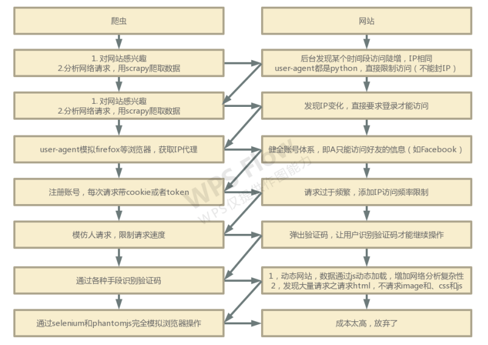

# Python项目笔记

## 1 创建项目

### 1.1 创建爬虫项目

​	**1. 输入命令创建 `scrapy` 项目模板**

````
scrapy startproject [项目名]

实例：
scrapy startproject SpiderDemo
````

​	**2. 进入 `spiders` 文件夹输入命令生成爬虫代码模板**

````
scrapy genspider [文件名] [被爬网址]

实例：
scrapy genspider winner xxx.com
````

## 2 项目解决方案

### 2.1 爬虫与反爬虫技术

