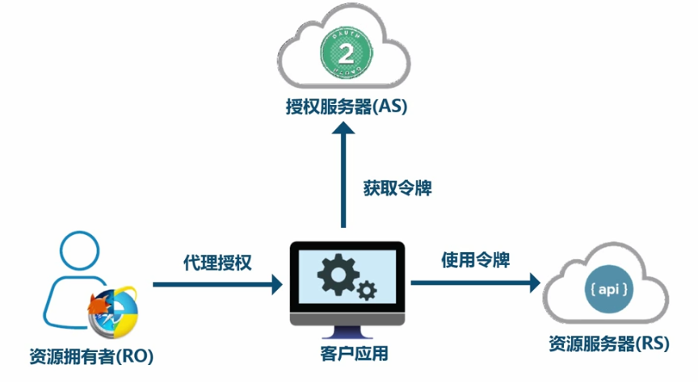
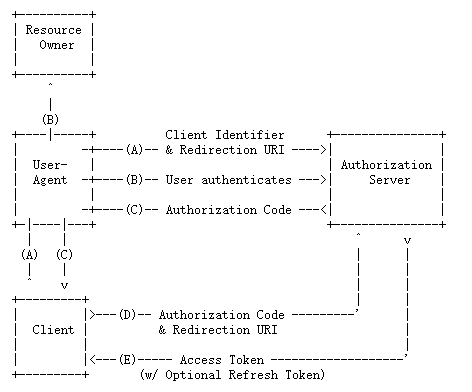
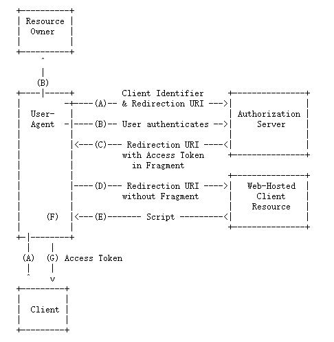
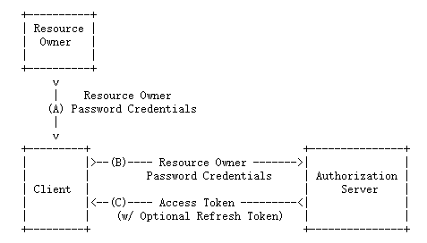
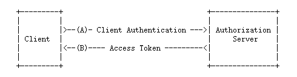
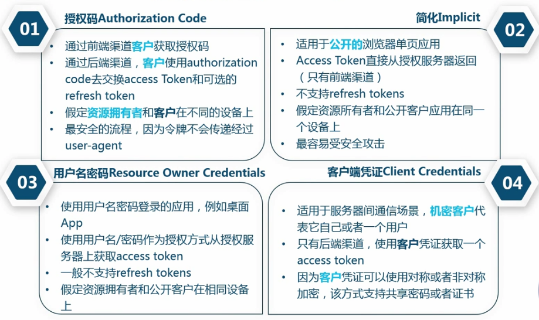
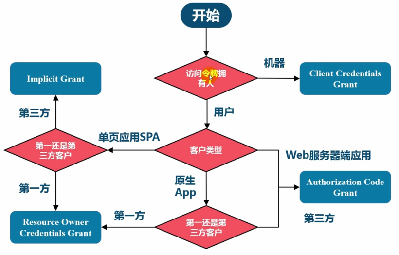

# 微服务架构实战学习笔记

  * [1 微服务安全](#1-%E5%BE%AE%E6%9C%8D%E5%8A%A1%E5%AE%89%E5%85%A8)
    * [1\.1 OAuth 2\.0](#11-oauth-20)
      * [1\.1\.1 基本概念](#111-%E5%9F%BA%E6%9C%AC%E6%A6%82%E5%BF%B5)
      * [1\.1\.2 适用场景](#112-%E9%80%82%E7%94%A8%E5%9C%BA%E6%99%AF)
      * [1\.1\.3 主要角色与术语](#113-%E4%B8%BB%E8%A6%81%E8%A7%92%E8%89%B2%E4%B8%8E%E6%9C%AF%E8%AF%AD)
      * [1\.1\.4 注意事项](#114-%E6%B3%A8%E6%84%8F%E4%BA%8B%E9%A1%B9)
      * [1\.1\.5 授权模式](#115-%E6%8E%88%E6%9D%83%E6%A8%A1%E5%BC%8F)
    * [1\.2 JWT](#12-jwt)

## 1 微服务安全

### 1.1 OAuth 2.0

#### 1.1.1 基本概念

**1. 概念**

OAuth 2.0 适用于 REST/APIs 的代理授权框架（delegated authorization framework），基于令牌 token 的授权，在无需暴露用户密码的情况下，使应用能获取对用户数据的有限权限访问。

**2. 作用**

解耦认证和授权。

**3. 优势**

- OAuth 2.0 比 OAuth 1.0 易于实现
- 更安全，客户端无需接触用户密码，服务器端更易于几种保护
- 广泛传播并被持续采用
- 短寿命和封装的 token
- 资源服务器和授权服务器解耦
- 集中式授权，简化客户端
- 支持 HTTP/JSON 格式，易于请求和传递 token
- 考虑多种客户端架构场景
- 客户端可以具有不同的信任级别

#### 1.1.2 适用场景

- 开放系统间授权
    - 社交联合登录
    - 开放 API 平台
- 现代微服务安全
    - 单页浏览器 App（HTML5/JS/无状态）
    - 无线原生 App
    - 服务器端 WebApp
    - 微服务和 API 间调用
- 企业内部应用认证授权（IAM/SSO）

#### 1.1.3 主要角色与术语

**1. 角色**

- 授权服务器：在客户应用成功认证并获得授权后，向客户应用办法访问令牌
- 资源拥有者：想要分享某些资源给第三方应用的资源的拥有人
- 客户应用：通常是一个 Web 或无线应用，它需要访问用户的受保护资源
- 资源服务器：一个 Web 站点或者 web service API，用户的受保护数据保存于此

**2. 术语**

- 客户凭证（Client Credentials）：客户的 clientId 和密码用于认证客户
- 令牌（Tokens）：授权服务器在接收到客户请求后，颁发的访问令牌
- 作用域（Scopes）：客户请求访问令牌时，由资源拥有者额外指定的细分权限（permission）

1）令牌类型

- 授权码（Authorization Code Token）：仅用于授权码授权类型，用于交换获取访问令牌和刷新令牌
- 刷新令牌（Refresh Token）：用于去授权服务器获取一个新的访问令牌
- 访问令牌（Access Token）：用于代表一个用户或服务直接去访问受保护的资源
- Bearer Token：无论谁拿到 Token 都可以访问资源，类似钞票
- Proof of Possession Token（PoP）：可以校验 client 是否对 Token 有明确的拥有权

#### 1.1.4 注意事项

**1. 误区**

- OAuth 2.0 不支持 HTTP 以外的协议
- OAuth 2.0 不是一个认证协议
- OAuth 2.0 没有定义授权处理机制
- OAuth 2.0 没有定义 token 格式
- OAuth 2.0 没有定义加密方法
- OAuth 2.0 不是单个协议
- OAuth 2.0 只是授权框架，仅仅用于授权代理

**2. 总结**

- OAuth 本质是如何获取 token 和如何使用 token
- OAuth 是一种在系统之间的代理授权协议
- OAuth 提供了一个宽泛的协议框架，具体安全场景需要定制
- OAuth 使用代理协议的方式解决密码共享密码反模式问题

#### 1.1.5 授权模式

**1. 授权码模式**

1）概念

第三方应用先申请一个授权码，然后再用该码获取令牌。

> 授权码模式基于重定向的流程，会同时获得两个令牌，访问权限令牌和刷新令牌。

2）流程

（A）客户端通过指示资源所有者的身份来启动流程授权端点的用户代理。客户包括它的客户标识符，请求的范围，本地状态和一个授权服务器将重定向到的重定向 URI，一旦授予（或拒绝）访问权限，用户代理就会返回。

（B）授权服务器对资源所有者进行身份验证（通过用户代理），并确定资源所有者是否授予或拒绝客户端的访问请求。

（C）假设资源所有者授予访问权限，则授权服务器使用以下命令将用户代理重定向回客户端先前提供的重定向URI（在请求中或期间客户注册）。重定向URI包含一个授权代码和客户端提供的任何本地状态较早。

（D）客户端从授权中请求访问令牌服务器的令牌端点（包括授权代码）在上一步中收到。提出要求时，客户端通过授权服务器进行身份验证。客户端包括用于获得授权的重定向URI验证码。

（E）授权服务器验证客户端身份，验证授权码，并确保重定向URI收到的用于重定向客户端的URI匹配步骤（C）。如果有效，授权服务器将以以下方式回复访问令牌和（可选）刷新令牌。

3）适用场景

最常用的流程，安全性也最高，它适用于那些有后端的 Web 应用。

**2. 隐藏/简化模式**

1）流程

（A）客户端通过将资源所有者的用户代理定向到授权端点来启动该流程。客户端包括其客户端标识符，请求的范围，本地状态和重定向 URI，一旦授予（或拒绝）访问权限，授权服务器便会将用户代理发送回该重定向URI。

（B）授权服务器（通过用户代理）对资源所有者进行身份验证，并确定资源所有者是授予还是拒绝客户端的访问请求。

（C）假设资源所有者授予访问权限，授权服务器使用前面提供的重定向URI 将用户代理重定向回客户端。重定向 URI，在 URI 片段中包含访问令牌。

（D）用户代理通过对 Web 托管的客户端资源（不包括 Fragment）进行请求来遵循重定向指令。用户代理在本地保留片段信息。

（E）由网络托管的客户端资源返回能够访问以下内容的网页（通常是带有嵌入式脚本的 HTML 文档）完整的重定向 URI，包括由用户代理保留的片段，并提取片段中包含的访问令牌（和其他参数）。

（F）用户代理在本地执行由Web托管的客户端资源提供的脚本，该脚本提取访问令牌。

（G）用户代理将访问令牌传递给客户端。

2）适用场景

适用于纯前端或单页浏览器 App 等没有后端的 Web 应用。

**3. 密码模式**

1）流程

（A）资源所有者向客户端提供其用户名和密码。

（B）客户端通过包含从资源所有者接收的凭据，从授权服务器的令牌端点请求访问令牌。发出请求时，客户端向授权服务器进行身份验证。

（C）授权服务器对客户端进行身份验证并验证资源所有者凭证，如果有效，则颁发访问令牌。

2）适用场景

适用于企业内部的系统之间互相授权，此时密码安全性较高。

**4. 客户端模式**

1）流程

（A）客户端通过授权服务器进行身份验证，并从令牌端点请求访问令牌。

（B）授权服务器对客户端进行身份验证，如果有效，则颁发访问令牌。

2）适用场景

适用于两台服务端之间的授权场景，如没有前端的命令行应用。

**5. 四种授权模式总结**

**6. 授权类型选择流程图**

### 1.2 JWT

