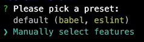
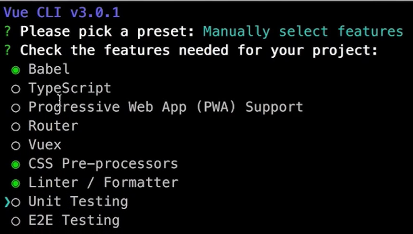
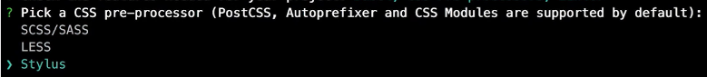
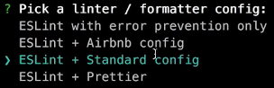
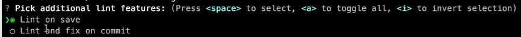
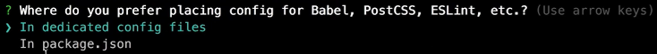
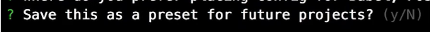

<h1 style="font-weight:bold;"><center>前端总结笔记</center></h1>
# Vue

## 1. 环境搭建

​		※注意： 命令在Windows环境下需要去掉开头的 `sudo` 。

​		1）全局安装 `vue-cli` 

````shell
sudo npm install -g vue-cli
````

​		2）使用 `webpack` 模板构建项目

````
vue init webpack [项目名称]

实例：
vue init webpack mall
````

​		3）安装项目依赖

````shell
sudo npm install
````

​		4）以开发环境运行项目

````shell
sudo npm run dev
````

## 2. 创建模板项目

​		1）使用vue命令创建项目

````
vue create [项目名称]

实例：
vue create vue-demo
````

​		2）选择手动选择功能



​		3）选择需要的功能



​		4）选择CSS的预处理器



​		5）选择ES6的处理规则



​		6）选择索引方式（保存文件时索引）



​		7）Babel、CSS预处理器、ES6处理规则等放在哪个文件中（对应文件中）



​		8）是否保存当前预设（保存后下次创建会自动跳过前面7步配置，直接使用上次保存的预设）



# Css

## 1. 开发规范

​		1）不可继承的属性尽量写在前面（如 `display、width、height` 等），可被继承的属性尽量写在后面（如 `font-size、color` 等）

````css
.tab
    display: flex
    width: 100%
    height: 40px
    line-height: 40px
    .tab-item
      flex: 1
      text-align: center
      & > a
        display: block
        font-size: 14px
        color: rgb(77, 85, 93)
````

## 2. 样式笔记

### 2.1 样式模板

​		1）触摸区域撑满

````css
	display: block
````

​		2）去掉下划线

````css
	text-decoration: none;
````

### 2.2 样式概念

​		1）`margin` 和 `padding` 的区别

- `margin` 是指从自身边框到另一个容器边框之间的距离，就是**容器外距离**。

- `padding` 是指自身边框到自身内部另一个容器边框之间的距离，就是**容器内距离**。

  2）`margin` 和 `padding` 的用法

- `margin` **语法结构**
  - `margin-left:10px; ` 左外边距
  - `margin-right:10px;` 右外边距
  - `margin-top:10px;` 上外边距
  - `margin-bottom:10px;` 下外边距
  - `margin：10px;` 四边统一外边距
  - `margin:10px 20px;` 上下、左右外边距
  - `margin:10px 20px 30px;` 上、左右、下外边距
  - `margin:10px 20px 30px 40px;` 上、右、下、左外边距
- `padding` **语法结构**
  - `padding-left:10px; ` 左内边距
  - `padding-right:10px;` 右内边距
  - `padding-top:10px;` 上内边距
  - `padding-bottom:10px;` 下内边距
  - `padding：10px;` 四边统一内边距
  - `padding:10px 20px;` 上下、左右内边距
  - `padding:10px 20px 30px;` 上、左右、下内边距
  - `padding:10px 20px 30px 40px;` 上、右、下、左内边距
- **两者可能的取值**
  - `length` 规定具体单位记的内/外边距长度
  - `%`  基于父元素的宽度的内/外边距的长度
  - `auto`  浏览器计算内/外边距
  - `inherit` 规定应该从父元素继承内/外边距
- **浏览器兼容问题**
  - 所有浏览器都支持`margin` 和 `padding` 属性
  - 任何版本IE都不支持属性值 `inherit`

