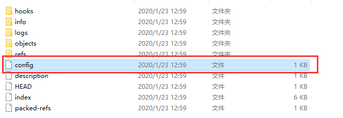
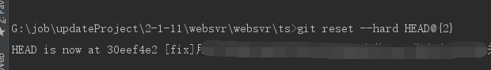
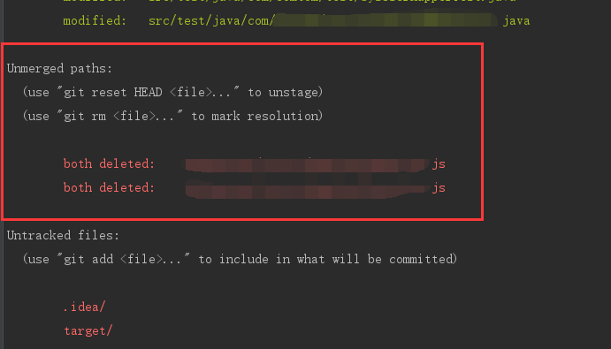
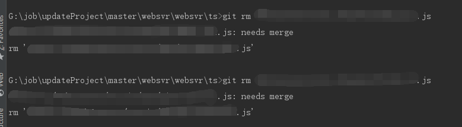
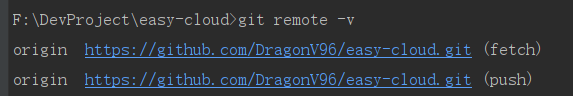
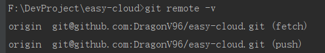

# git笔记

  * [1 基础概念](#1-%E5%9F%BA%E7%A1%80%E6%A6%82%E5%BF%B5)
    * [1\.1 git的区域](#11-git%E7%9A%84%E5%8C%BA%E5%9F%9F)
  * [2 常用命令](#2-%E5%B8%B8%E7%94%A8%E5%91%BD%E4%BB%A4)
    * [1\.1 配置本地ssh](#11-%E9%85%8D%E7%BD%AE%E6%9C%AC%E5%9C%B0ssh)
    * [1\.2 git的基本操作流程](#12-git%E7%9A%84%E5%9F%BA%E6%9C%AC%E6%93%8D%E4%BD%9C%E6%B5%81%E7%A8%8B)
      * [1\.2\.1 克隆远程仓库的代码](#121-%E5%85%8B%E9%9A%86%E8%BF%9C%E7%A8%8B%E4%BB%93%E5%BA%93%E7%9A%84%E4%BB%A3%E7%A0%81)
      * [1\.2\.2 本地代码提交流程](#122-%E6%9C%AC%E5%9C%B0%E4%BB%A3%E7%A0%81%E6%8F%90%E4%BA%A4%E6%B5%81%E7%A8%8B)
    * [1\.3 tag的使用](#13-tag%E7%9A%84%E4%BD%BF%E7%94%A8)
    * [1\.4 reset的使用](#14-reset%E7%9A%84%E4%BD%BF%E7%94%A8)
  * [3 高级操作](#3-%E9%AB%98%E7%BA%A7%E6%93%8D%E4%BD%9C)
    * [2\.1 电脑同时配置gitlab、github和gitee](#21-%E7%94%B5%E8%84%91%E5%90%8C%E6%97%B6%E9%85%8D%E7%BD%AEgitlabgithub%E5%92%8Cgitee)
      * [2\.1\.1 生成密钥](#211-%E7%94%9F%E6%88%90%E5%AF%86%E9%92%A5)
      * [2\.1\.2 添加config配置](#212-%E6%B7%BB%E5%8A%A0config%E9%85%8D%E7%BD%AE)
      * [2\.1\.3 配置git仓库](#213-%E9%85%8D%E7%BD%AEgit%E4%BB%93%E5%BA%93)
    * [2\.2 配置项目同时提交到github和gitee](#22-%E9%85%8D%E7%BD%AE%E9%A1%B9%E7%9B%AE%E5%90%8C%E6%97%B6%E6%8F%90%E4%BA%A4%E5%88%B0github%E5%92%8Cgitee)
      * [2\.2\.1 本地只有一个ssh\-key的情况](#221-%E6%9C%AC%E5%9C%B0%E5%8F%AA%E6%9C%89%E4%B8%80%E4%B8%AAssh-key%E7%9A%84%E6%83%85%E5%86%B5)
      * [2\.2\.2 本地有多个ssh\-key的情况](#222-%E6%9C%AC%E5%9C%B0%E6%9C%89%E5%A4%9A%E4%B8%AAssh-key%E7%9A%84%E6%83%85%E5%86%B5)
  * [4 常见问题](#4-%E5%B8%B8%E8%A7%81%E9%97%AE%E9%A2%98)
    * [4\.1 误操作reset后恢复本地代码](#41-%E8%AF%AF%E6%93%8D%E4%BD%9Creset%E5%90%8E%E6%81%A2%E5%A4%8D%E6%9C%AC%E5%9C%B0%E4%BB%A3%E7%A0%81)
    * [4\.2 提交时报未合并代码错误](#42-%E6%8F%90%E4%BA%A4%E6%97%B6%E6%8A%A5%E6%9C%AA%E5%90%88%E5%B9%B6%E4%BB%A3%E7%A0%81%E9%94%99%E8%AF%AF)

## 1 基础概念

### 1.1 git的区域

- 工作区：代码的编写及修改
- 暂存区：`git add` 将本地修改添加至此
- 本地仓库：`git commit` 将暂存区的代码提交至此
- 远程仓库：`git push` 将本地仓库的代码提交至此

## 2 常用命令


### 1.1 配置本地ssh

（1）设置git的用户名和邮箱（第一次安装git的情况下）

````shell
$ git config --global user.name "xxx"
$ git config --global user.email "xxxxx@xxx"
````

（2）生成密钥

````shell
$ ssh-keygen -t rsa -C "xxxxx@xx"
````

（3）连续3个回车，其中第三个回车前需要输入对应的登陆密码，完成后 `C:\Users\Administrator\\.ssh` 文件夹下会生成两个文件：`id_rsa` 和 `id_rsa.pub`

（4）将 `id_rsa.pub` 用记事本打开，复制里面的全部内容粘贴到 git 服务器上的添加 ssh 配置中即可。

### 1.2 git的基本操作流程

#### 1.2.1 克隆远程仓库的代码

（1）克隆到本地

````shell
$ git clone https://xxx.github.com/xxx/xxx.git 
````

（2）克隆到本地指定文件夹 `project`

```shell
$ git clone https://xxx.github.com/xxx/xxx.git project
```

#### 1.2.2 本地代码提交流程

（1）拉取远程仓库最新代码

````shell
$ git pull
````

（2）将本地新建的文件添加到远程仓库

```shell
$ git add .
```

（3）将本地修改后的文件提交到远程仓库

```shell
$ git commit -m "这里是注释"
```

（4）将本地修改后的文件推送到远程仓库

```shell
$ git push
```

### 1.3 tag的使用

（1）查看tag

```shell
$ git tag
```

（2）查看指定版本的tag（如查看v1.0开头的所有tag）

```shell
$ git tag -l 'v1.0*'
```

（3）显示tag信息

```shell
$ git show v1.0.0
```

（4）指定commit创建tag（如创建名为v1.0.1的tag）

```shell
$ git tag v1.0.1
```

（5）创建tag（如指定`54642b6204fa5714fa81dbe744f0ae6353977cd0`的commit创建名为`v1.0.1`的tag）

```shell
$ git tag -a v1.0.1 54642b6204fa5714fa81dbe744f0ae6353977cd0
```

- 查看commit使用命令 `$ git log`

（6）删除tag（如删除名为v1.0.1的tag）

```shell
$ git tag -d v1.0.1
```

（7）删除远程仓库的指定tag（如删除名为v1.0.1的tag）

```shell
$ git tag -d v1.0.1
$ git push origin :refs/tags/v1.0.1
```

（8）推送指定tag到远程仓库（如名为v1.0.1的tag）

```shell
$ git push origin v1.0.1
```

（9）推送本地所有tag到远程仓库

```shell
$ git push origin --tags
```

### 1.4 reset的使用

1）soft

````shell
# 回退到 git commit 前，处在暂存区
git reset --soft HEAD
````

2）mixed

````shell
# 回退到 git add前 
git reset --soft HEAD
````

3）hard

````shell
# 工作区、暂存区、本地仓库的改变内容全部丢失
git reset --soft HEAD
````


## 3 高级操作

### 2.1 电脑同时配置gitlab、github和gitee

#### 2.1.1 生成密钥

（1）生成gitee密钥（指定文件名后缀防止覆盖）

````shell
ssh-keygen -t rsa -C "xxx@xx.com" -f ~/.ssh/id_rsa_gitee
````

（2）生成github密钥（指定文件名后缀防止覆盖）

````
ssh-keygen -t rsa -C "xxx@xx.com" -f ~/.ssh/id_rsa_github
````

（3）生成gitlab密钥（指定文件名后缀防止覆盖）

```
ssh-keygen -t rsa -C "xxx@xx.com" -f ~/.ssh/id_rsa_gitlab
```

（4）在`~/.ssh/`目录（.ssh在用户文件夹下）会分别生成`id_rsa_gitee`和`id_rsa_gitee.pub`私钥和公钥（还有github与gitlab对应私钥和公钥）。将`id_rsa_gitee.pub`中的全部内容复制粘帖到公司gitlab服务器的SSH-key的配置中。

#### 2.1.2 添加config配置

（1）在`~/.ssh/`下添加config配置文件

````
cd ~/.ssh
touch config
````

（2）添加如下内容：

````
# gitlab                                                                       
Host gitlab
   Port 22
    User git
    HostName gitlab.com
    PreferredAuthentications publickey
    IdentityFile ~/.ssh/id_rsa_gitlab
# github                                                                           
Host github
    Port 22
    User git
    HostName github.com
    PreferredAuthentications publickey
    IdentityFile ~/.ssh/id_rsa_github
# gitee                                                                           
Host gitee
    Port 22
    User git
    HostName gitee.com
    PreferredAuthentications publickey
    IdentityFile ~/.ssh/id_rsa_gitee
````

配置文件字段对应解释：

````
Host 
它涵盖了下面一个段的配置，我们可以通过他来替代将要连接的服务器地址。这里可以使用任意字段或通配符。 
当ssh的时候如果服务器地址能匹配上这里Host指定的值，则Host下面指定的HostName将被作为最终的服务器地址使用，并且将使用该Host字段下面配置的所有自定义配置来覆盖默认的/etc/ssh/ssh_config配置信息。 
Port 
自定义的端口。默认为22，可不配置 
User 
自定义的用户名，默认为git，可不配置 
HostName 
真正连接的服务器地址 
PreferredAuthentications 
指定优先使用哪种方式验证，支持密码和秘钥验证方式 
IdentityFile 
指定本次连接使用的密钥文件
````

#### 2.1.3 配置git仓库

由于公司使用gitlab进行代码管理，所以将gitlab设置为`global`全局配置（可根据自身情况选择设置）。

示例：

gitlba本地仓库文件夹为`F:/gitlab`，github本地仓库文件夹为`F:/github`，gitee本地仓库文件夹为`F:/gitee`。

则配置如下：

（1）先配置gitlab（防止把gitee和github本地仓库覆盖）

````
cd F:/gitlab
git init
git config --global user.name 'xxx'
git config --global user.email 'xxx@xx.com'
````

（2）配置github

```
cd F:/github
git init
git config --local user.name 'xxx'
git config --local user.email 'xxx@xx.com'
```

（3）配置gitee

```
cd F:/gitee
git init
git config --local user.name 'xxx'
git config --local user.email 'xxx@xx.com'
```

### 2.2 配置项目同时提交到github和gitee

**前提：已经在gitee上导入github项目。**


#### 2.2.1 本地只有一个ssh-key的情况

**方法一：多次推送**

| 优点                           | 缺点                           |
| ------------------------------ | ------------------------------ |
| 可推送到指定的一个或多个仓库   | 推送仓库数量较多时，时间成本高 |
| 可不推送到指定的一个或多个仓库 |                                |

（1）通过执行过命令将本地项目和gitee项目关联**（步骤一和步骤二选一个执行即可）**

````
git remote add [name] [码云/github项目地址]

实例：
git remote add github https://github.com/DragonV96/order-system-seller.git
````

（2）通过修改本地项目的配置文件将本地项目和gitee项目关联**（步骤一和步骤二选一个执行即可）**

- 进入本地git项目文件夹


- 进入 `.git` 隐藏文件夹



- 编辑 `.git` 目录下的 `config` 文件（可以看到git给远程库起的默认名称是 `origin` ，但如果有多个远程库，则需要不同的名称来标识不同的远程库）


(3）执行命令查看配置的两个仓库

````shell
git remote
````

（4）推送代码时，需要**对两个仓库分别执行一次push命令**

````
git push github master
git push gitee master
````

**方法二：一次推送**

（1）通过命令将码云项目地址添加到本地已有的remote下**（步骤一和步骤二选一个执行即可）**

````
git remote set-url --add origin [码云项目地址]

实例：
git remote set-url --add origin https://gitee.com/glwsource/order-system-seller.git
````

（2）通过修改本地项目的配置文件**（步骤一和步骤二选一个执行即可）**


（3）推送只需一条命令

````
git push
````

（4）推送的时候可能会出现错误 `[rejected] master -> master (fetch first)`，此时执行强制推送命令

````
git push -f
````

（5）若步骤4仍然无法解决错误，则输入命令

````
git pull --rebase origin master
git push
````

#### 2.2.2 本地有多个ssh-key的情况

## 4 常见问题

### 4.1 误操作reset后恢复本地代码

将本地git版本用 hard 模式回退到历史某一版本时，想要恢复原来的版本。

分三种情况：

1）没有 commit ，也没有 add

- IEAD 中挨个右键文件，在 local history 中查看并恢复
- 不行则直接找磁盘数据恢复工具或者大佬
- 再不行就加班重新写一遍

2）没有 commit ，但是 add 了

①执行命令，找回文件

````shell
git fsck --lost-found
````

②进入项目git目录下的 /.git/lost-found/other ，这里有你 add 过的文件，挨个文件恢复。

③找回本地仓库里边最近add的60个文件

````shell
find .git/objects -type f | xargs ls -lt | sed 60q
````

3）有过 commit

①执行命令，查看历史 commit 过的记录

````
git reflog
````


②选择需要恢复的节点，执行即可恢复，如 HEAD@{2} 

````shell
git reset --hard HEAD@{2} 
````



### 4.2 提交时报未合并代码错误

报错原因：Committing is not possible because you have unmerged files.（因为你没有合并代码，所以不允许提交）

1）查看未提交代码文件

````shell
git diff
````

2）查看git状态

```shell
git status
```



3）如果不需要的话，移除未合并代码（xxx表示上图整个路径+文件名）即可

```shell
git rm xxx.js
git rm xxx.js
```



### 4.3 本地已配置ssh但push时仍需输账号密码

1）查看本地项目远程地址 url 版本

````shell
git remote -v
````



2）设置为新的 ssh 地址

````shell
git remote set-url origin [你的项目 ssh 地址]

# 实例
git remote set-url origin git@github.com:DragonV96/easy-cloud.git
````

3）再次查看本地项目远程地址 url 版本，已经更改正确，即可无账号密码推送

````shell
git remote -v
````

