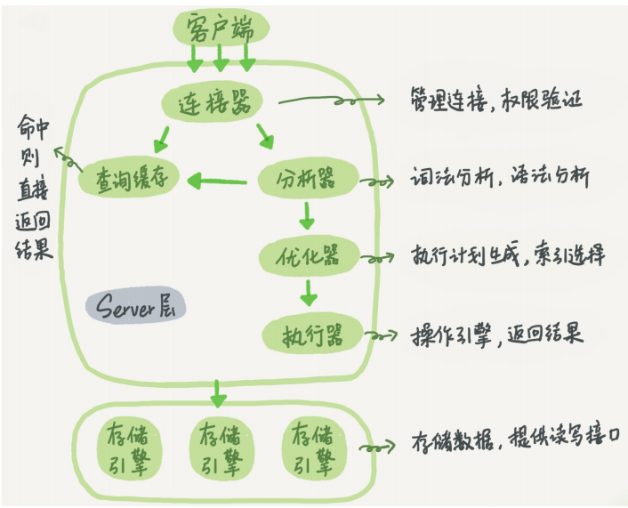
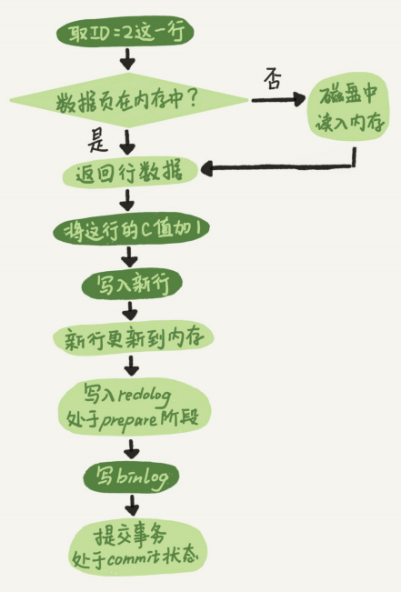
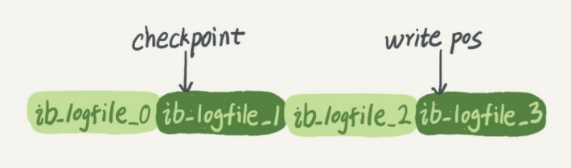

# MySQL实战笔记

  * [1 基础概念](#1-%E5%9F%BA%E7%A1%80%E6%A6%82%E5%BF%B5)
    * [1\.1 基础特性](#11-%E5%9F%BA%E7%A1%80%E7%89%B9%E6%80%A7)
    * [1\.2 锁](#12-%E9%94%81)
    * [1\.3 事务](#13-%E4%BA%8B%E5%8A%A1)
    * [1\.4 多版本并发控制](#14-%E5%A4%9A%E7%89%88%E6%9C%AC%E5%B9%B6%E5%8F%91%E6%8E%A7%E5%88%B6)
    * [1\.5 优化与执行](#15-%E4%BC%98%E5%8C%96%E4%B8%8E%E6%89%A7%E8%A1%8C)
      * [1\.5\.1 一条查询 SQL 的执行流程](#151-%E4%B8%80%E6%9D%A1%E6%9F%A5%E8%AF%A2-sql-%E7%9A%84%E6%89%A7%E8%A1%8C%E6%B5%81%E7%A8%8B)
      * [1\.5\.2 一条更新 SQL 的执行流程](#152-%E4%B8%80%E6%9D%A1%E6%9B%B4%E6%96%B0-sql-%E7%9A%84%E6%89%A7%E8%A1%8C%E6%B5%81%E7%A8%8B)
  * [2 基础架构](#2-%E5%9F%BA%E7%A1%80%E6%9E%B6%E6%9E%84)
    * [2\.1 Server 层](#21-server-%E5%B1%82)
      * [2\.1\.1 连接器](#211-%E8%BF%9E%E6%8E%A5%E5%99%A8)
      * [2\.1\.2 查询缓存](#212-%E6%9F%A5%E8%AF%A2%E7%BC%93%E5%AD%98)
      * [2\.1\.3 分析器](#213-%E5%88%86%E6%9E%90%E5%99%A8)
      * [2\.1\.4 优化器](#214-%E4%BC%98%E5%8C%96%E5%99%A8)
      * [2\.1\.5 执行器](#215-%E6%89%A7%E8%A1%8C%E5%99%A8)
    * [2\.2 存储引擎](#22-%E5%AD%98%E5%82%A8%E5%BC%95%E6%93%8E)
  * [3 日志](#3-%E6%97%A5%E5%BF%97)
    * [3\.1 redo log](#31-redo-log)
      * [3\.1\.1 WAL 技术](#311-wal-%E6%8A%80%E6%9C%AF)
      * [3\.1\.2 配置](#312-%E9%85%8D%E7%BD%AE)
      * [3\.1\.3 crash\-safe](#313-crash-safe)
    * [3\.2 binlog](#32-binlog)
      * [3\.2\.2 两阶段提交](#322-%E4%B8%A4%E9%98%B6%E6%AE%B5%E6%8F%90%E4%BA%A4)
      * [3\.2\.3 binlog 与 redo log 对比](#323-binlog-%E4%B8%8E-redo-log-%E5%AF%B9%E6%AF%94)
    * [3\.3 undo log](#33-undo-log)
    * [3\.4 slow log](#34-slow-log)
  * [4 索引](#4-%E7%B4%A2%E5%BC%95)
  * [5 查询优化](#5-%E6%9F%A5%E8%AF%A2%E4%BC%98%E5%8C%96)
  * [6 MySQL 高可用](#6-mysql-%E9%AB%98%E5%8F%AF%E7%94%A8)
  * [7 备份与恢复](#7-%E5%A4%87%E4%BB%BD%E4%B8%8E%E6%81%A2%E5%A4%8D)

## 1 基础概念

### 1.1 基础理论

#### 1.1.1 四大特性

数据库四大特性 ACID：

- Atomicity（原子性）
- Consistency（一致性）
- Isolation（隔离性）
- Durability（持久性）

#### 1.1.2 数据库设计三范式

第一范式：

第二范式：

第三范式：

#### 1.1.3 常见概念

**1. 回表**

普通索引查询方式，需要先搜索索引树，得到 ID 的值，再到 ID 索引树搜索一次的过程。


### 1.2 锁

根据加锁范围，分为三类：

- 全局锁
- 表级锁
- 行锁

#### 1.2.1 全局锁

**1. 概念**

全局锁对整个数据库实例加锁。

**2. 命令**

````mysql
Flush tables with read lock;
````

**3. 作用**

- 使整个库处于只读状态
- 其他线程的如下语句均被阻塞：数据更新语句（增删改）、数据定义语句（包括建表、修改表结构）和更新类事务的提交语句。

**4. 适用场景**

适用于非事务存储引擎做（如 MyISAM）全库逻辑备份的场景。

> InnoDB 可以在可重复读隔离级别下开启一个事务，来获取整库的一致性视图做备份（使用 mysqldump 工具的 `-single-transaction` 参数）。

**5. 风险**

- 主库备份的场景下，备份期间无法更新，业务停摆；
- 从库备份的场景下，从库不能执行主库同步过来的 binlog，导致主从延迟。

**6. 问题**

为什么不使用 `set global readonly=true` 的方式来替代全局锁？

两个原因：

- 部分系统中 `readonly` 的值可能用来判断是主库还是备库，修改此变量影响巨大；
- 一旦客户端异常断开，全局锁会自动被释放，整库正常更新，但是设置 `readonly` 后异常断开后会继续保持 `readonly` 状态，导致数据库无法写入。

#### 1.2.2 表锁

**1. 分类**

表锁分为两类：

- 表锁
- 元数据锁（meta data lock，MDL）

**2. 表锁**

1）命令

加锁：

````mysql
lock tables ... read/write;
````

主动释放锁（客户端断开连接时会自动释放）：

````mysql
unlock tables;
````

2）作用

- 限制其他线程的读写操作；
- 限制本线程接下来的操作对象。

**3. MDL 锁**

1）使用

MDL 无需显示使用，在线程访问表的时候会自动加上。

2）作用

防止表结构在线程读写的时候被更改，保证读写的正确性。

3）分类

MDL 锁分为 MDL 读锁和 MDL 写锁：

- 读锁之间不互斥，即多个线程可同时对同一张表加读锁；
- 读写锁之间和写锁之间互斥，保证表结构变更操作的安全性。

4）加锁场景

- 加 MDL 读锁：当对一个表做增删改查操作时；
- 加 MDL 写锁：当对表做表结构变更操作时。

5）踩坑

- 大表加/改字段或者加索引，会引起全表扫描，影响线上服务；
- 小表加/改字段或者加索引，下面两种情况也可能引起业务系统崩溃：
  - 在此表有长事务存在的情况下会一直占用 MDL 锁（解决方案是先等长事务执行完，或者在执行 DDL 前 kill 掉长事务）
  - 在此表请求频繁的情况下，客户端有重试机制，此时会导致整个库的线程爆满（为 MDL 锁指定超时时间）。

#### 1.2.3 行锁


### 1.3 事务

#### 1.3.1 隔离级别

数据库的隔离性具有4种隔离级别：

- 未提交读（READ UNCOMMITED）：事务中的修改即使没有提交，对其他事务也是可见的；
- 已提交读（READ COMMITED）：一个事务从开始到提交这个过程中所做的任何修改对其他事务都是不可见的**（也称作不可重复读，SQL Server、Oracle的默认级别）**；
- 可重复读（REPEATABLE READ）：保证在同一个事务中多次读取相同数据的结果是一致的**（MYSQL的默认级别）**；
- 可串行化（SERIALIZABLE）：强制事务串行执行。

#### 1.3.2 场景问题

当数据库上有多个事务同时执行的时候，就可能出现下方3种场景问题：

- 脏读（dirty read）
- 不可重复读（non- repeatable read）
- 幻读（phantomread）

| 场景问题   | 描述                                                         | 影响隔离级别                 |
| ---------- | ------------------------------------------------------------ | ---------------------------- |
| 脏读       | 事务可以读取未提交的数据                                     | 未提交读                     |
| 不可重复读 | 两次同样的查询，可能结果不一致                               | 未提交读、已提交读           |
| 幻读       | A事务在读取某个范围内的记录时，B事务立即在该范围内插入新数据，此时A事务再次读取该范围记录时，产生幻行 | 未提交读、已提交读、可重复读 |

### 1.4 多版本并发控制MVCC

**1. 概念**

同一条记录在系统中可以存在多个版本，即数据库的多版本并发控制（MVCC）。

**2. 实现原理**

每个事务在启动的那一刻，会对整个库进行快照，生成一个 read-view。

### 1.5 优化与执行

#### 1.5.1 一条查询 SQL 的执行流程

**1. 流程图解**



**2. 流程描述**

①客户端发起查询请求；

②连接器进行权限验证后建立连接；

③分析器进行词法/语法分析；

④进入查询缓存，命中则直接返回结果；

⑤否则进入优化器，生成执行计划，选择合适的索引；

⑥执行器请求存储引擎接口；

⑦存储引擎读出数据，返回结果。

#### 1.5.2 一条更新 SQL 的执行流程

前置步骤基本同查询语句，区别一个是查询，一个是更新。更新语句涉及到 redo log（重做日志）和 binlog（归档日志）。

**1. 流程描述**

①客户端发起查询请求；

②连接器进行权限验证后建立连接；

③分析器进行词法/语法分析；

④**清空**查询缓存；

⑤执行 update 语句时的内部流程（见下方图流程及描述）;

⑥返回结果。

**2. 执行 update 语句时的内部流程图解**



**3. 执行 update 语句时的内部流程描述**

①如果需要更新的数据行所在的数据页原本在内存中，就直接返回给执行器；否则，需要先从磁盘读入内存，然后再返回。

②执行器拿到引擎给的行数据，把这个值加上1，比如原来是 N，现在就是 N+1，得到新的一行数据，再调用引擎接口写入这行新数据。

③引擎将这行新数据更新到内存中，同时将这个更新操作记录到 redo log 里面，此时 redo log 处于 prepare 状态。

④执行器生成这个操作的 binlog，并把 binlog 写入磁盘

⑤执行器调用引擎的提交事务接口，引擎把刚刚写入的 redo log 改成提交（commit）状态，更新完成

⑥同时 InnoDB 引擎在系统比较空闲的时候，将这个操作记录更新到磁盘里面

> redo log的写入，即"两阶段提交"：prepare 和 commit。
>

## 2 基础架构

MySQL 分为 Server 层和存储引擎部分。

### 2.1 Server 层

Server 层：

- 包括连接器、查询缓存、分析器、优化器和执行器等
- 所有内置函数（如日期、时间、数学和加密函数等）
- 所有跨存储引擎的功能实现（如存储过程、触发器、视图等）

#### 2.1.1 连接器

**1. 作用**

负责与客户端：

- 建立连接
- 获取权限
- 维持和管理连接

> 生产环境中，禁止在 -p 后接密码来连接 MySQL。

**2. 流程**

①建立连接

判断用户名密码是否匹配，不匹配则返回“Access denied for user”错误。

②权限认证

用户名密码匹配，则到权限列表中查出当前用户的权限。

③维持和管理连接

> 管理员账号修改了某用户权限后，不会影响修改前已经连接的用户，只有新建立连接的用户权限会被修改。
>
> 客户端的连接超时时间参数是 wait_timeout ，默认值为8小时，客户端超时后再次请求会收到 “Lost connection to MySQL server during query”，此时需要重连再操作。

**3. 分类**

- 长连接：持续请求使用同一个连接；
- 短连接：每次执行完很少的操作就断开连接，下次操作则重连。

> 建立长连接的过程复杂，尽量减少建立连接的动作，即多使用长连接。

**4. 问题**

1）长连接异常重启

长连接过多时，MySQL 内存占用较高，因为 MySQL 在执行过程中临时使用的连接对象是管理在内存中的，这些资源在连接断开时才会释放，所以积累一段时间后，内存占用过大，被系统强杀（OOM），从而导致异常重启。

2）解决方案

- 定期断开长连接
- 执行过占用内存大的操作后断开长连接
- 每次执行一个较大开销的操作后，执行 mysql_reset_connection 来重新初始化连接资源（MySQL 5.7及以后版本）

#### 2.1.2 查询缓存

**1. 作用**

以 key-value 的形式缓存查询语句和查询结果，下一次相同的查询过来则直接返回查询结果。

**2. 问题**

只要执行对一张表的更新 ，此表上所有的查询缓存都被会清空，所以**不建议使用查询缓存。**

> 很长时间才更新一次的静态表才适合使用查询缓存，如系统配置表。
>
> MySQL 8.0 后彻底放弃查询缓存功能。

**3. SQL**

1）不使用查询缓存

设置参数 `query_cache_type` 为 DEMAND。

2）按需使用查询缓存

````sql
-- 查询语句加上 SQL_CACHE 参数
select SQL_CACHE * from T
````

#### 2.1.3 分析器

**1. 作用**

- 词法分析
- 语法分析

**2. 流程**

①词法分析

识别 SQL 的关键字、表名、列名和字段值等。

②语法分析

语法分析器根据语法规则，判断语句是否满足 MySQL 语法。

> 一般语法错误会提示第一个出现错误的位置，所以关注点在紧接“use near”的内容。

#### 2.1.4 优化器

**1. 作用**

- 表中有多个索引时，决定使用哪个索引
- 多表关联时，决定各个表的连接顺序
- 选择 SQL 语句执行效率最高的方案


#### 2.1.5 执行器

**1. 作用**

- 权限校验
- 引擎选择
- 返回查询结果

**2. 流程**

1）权限校验

执行时，校验用户是否有查询此表的权限，没有则返回无权限错误。

2）引擎选择

根据表的引擎定义，选择对应的存储引擎提供的接口。

3）查询并返回结果集

- 无索引的表

①调用 InnoDB 引擎接口，取**表**的第一行，判断是否满足条件，不满足则跳过；满足则将这行放入结果集中。

②调用引擎接口取下一行，重复同样的判断逻辑，直到取到表的最后一行。

③执行器将上述所有满足条件的行组成的记录作为结果集，返回给客户端。

- 有索引的表

①调用 InnoDB 引擎接口，取**满足条件**的第一行，不满足则跳过；满足则将这行放入结果集中。

②调用引擎接口取满足条件的下一行，重复同样的判断逻辑，直到取到表的最后一行。

③执行器将上述所有满足条件的行组成的记录作为结果集，返回给客户端。

### 2.2 存储引擎

**1. 作用**

负责数据的存储和提取。

**2. 组成**

存储引擎的架构模式是插件式的，支持InnoDB、MyISAM、Memory等多个存储引擎。

> InnoDB，从MySQL 5.5.5 后成为默认存储引擎。

## 3 日志

### 3.1 redo log

InnoDB 引擎特有的日志，又称重做日志。

#### 3.1.1 WAL 技术

**1. 概念**

WAL 的全称是 Write Ahead Logging，它的关键点就是先写日志，再写磁盘。

**2. 作用**

- 减少磁盘 IO
- 内存中执行更快

#### 3.1.2 配置

InnoDB 的 redo log 是固定大小的，比如可以配置为一组4个文件，每个文件大小是 1GB，总共就可以记录 4GB的操作。从头开始写，写到末尾时又回到开头循环写，如图所示。



- write pos 表示当前记录的位置，一边写一边后移，并且循环
- checkpoint 表示当前要擦除的位置，也是往后推移并且循环的，擦除记录前要把记录更新到数据文件
- write pos 和 checkpoint 之间的空余部分，用来记录新的操作

#### 3.1.3 crash-safe

**1. 概念**

InnoDB 可以通过 redo log 保证即使数据库发生异常重启，之前提交的记录都不会丢失。

**2. 原理**

### 3.2 binlog

Server 层实现的日志，所有引擎均可使用，又称归档日志。

#### 3.2.2 两阶段提交

**1. 流程**

①写入 redo log，处于 prepare 状态；

②写入 binlog，提交事务，处于 commit 状态。

**2. 作用**

数据库宕机时，保证库中数据与日志恢复的数据一致性。

#### 3.2.3 binlog 与 redo log 对比

| 日志对比 | redo log                   | binlog                                         |
| -------- | -------------------------- | ---------------------------------------------- |
| 实现层面 | InnoDB 引擎                | Server 层                                      |
| 记录方式 | 循环写入                   | 追加写入                                       |
| 记录内容 | 在某个数据页上做了什么修改 | 语句的原始逻辑                                 |
| 记录空间 | 空间固定会用完             | 写到一定大小后切换到下一个，不会覆盖以前的日志 |

### 3.3 undo log

### 3.4 slow log

rows_examined 字段表示查询语句执行过程中扫描了多少行。

> 引擎扫描行数跟 rows_examined 并不是完全相同的。

## 4 索引

### 4.1 索引模型

索引模型以下5种常见的数据结构：

- 哈希表
- 有序数组
- 搜索树
- 跳表
- LSM 树

#### 4.1.1 哈希表

**1. 概念**

哈希表是一种以键-值（key-value）存储数据的结构。

**2. 特性**

- 单个数据查询时间复杂度为 O(1)
- 区间查询很慢
- key 冲突时，采用链表法解决冲突

**3. 适用场景**

适用于只有等值查询的场景，如 Memcached、Redis 等 NoSQL 引擎。

#### 4.1.2 有序数组

**1. 特性**

- 随机访问及修改的时间复杂度为 O(1)
- 增加及删除的时间复杂度为 O(n)
- 顺序存储，范围查询性能较高

**2. 适用场景**

- 适用于等值查询和范围查询的场景；
- 只适用于静态存储引擎。

 #### 4.1.3 搜索树

**1. 特性**

- 增删改查的时间复杂度均为 O(n)；
- 顺序存储
- N 叉树。使查询过程访问尽量少的数据块（磁盘随机访问）

**2. 适用场景**

适用于范围查询的场景。

#### 4.1.4 InnoDB 的索引模型

**1. 索引组织表**

在 InnoDB 中，表都是根据主键顺序以索引的形式存放的，叫做索引组织表。

> InnoDB 使用了 B+ 树索引模型，每一个索引在 InnoDB 里面对应一棵 B+ 树。

**2. 索引分类**

1）索引按类型分类

- 主键索引：又叫聚簇索引（clustered index），主键索引的叶子节点存的是整行数据。
- 非主键索引：又叫二级索引（secondary index），非主键索引的叶子节点内容是主键的值。

2）索引按数据结构分类

- 哈希索引
- B+ 树索引

**3. 基于主键索引和普通索引的查询区别**

- 主键查询方式，只需要搜索主键 ID 索引树；

- 普通索引查询方式，则需要先搜索索引树，拿到主键 ID 的值，再到 ID 索引树搜索一次（回表）。

**4. 索引维护**

B+ 树为了维护索引有序性，在插入新值的时候需要做必要的维护，可能出现页分裂与页合并的场景。

1）页分裂

插入数据时，此数据所在的数据页已满，根据 B+ 树的算法，这时候需要申请一个新的数据页，然后挪动部分数据过去的过程。

2）页合并

当相邻两个页由于删除了数据，利用率很低之后，将数据页做合并的过程。

## 5 查询优化

## 6 MySQL 高可用

## 7 备份与恢复

