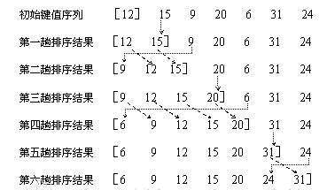
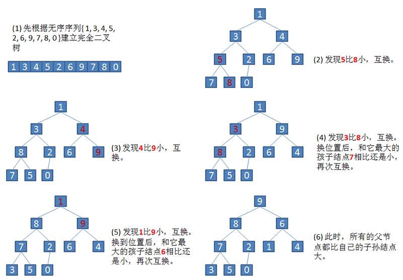
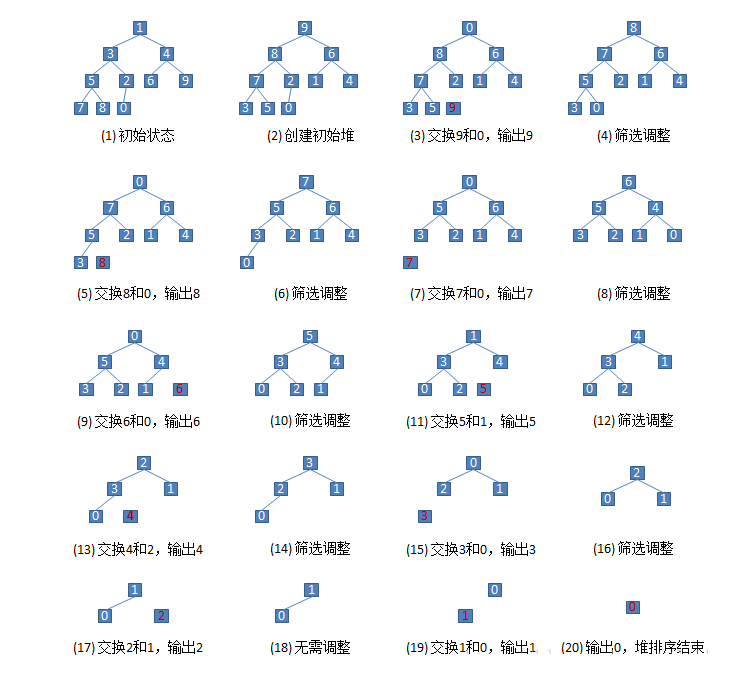
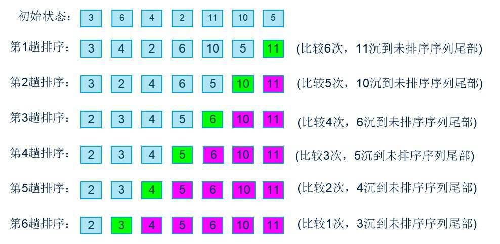

<h1 style="font-weight:bold;"><center>数据结构与算法笔记</center></h1>

# 第一章 经典八大排序算法

​		八大排序思维导图


## 1.1 插入排序

### 1.1.1 直接插入排序

​		直接插入排序是一种简单插入排序。

​		基本思想是：把n个待排序的元素看成为一个有序表和一个无序表。开始时有序表中只包含1个元素，无序表中包含有n-1个元素，排序过程中每次从无序表中取出第一个元素，将它插入到有序表中的适当位置，使之成为新的有序表，重复n-1次可完成排序过程。（生活例子：斗地主摸牌操作。）

​		直接插入排序图解：



​		java代码如下：

```java
public static void directInsertionSort(int arr[]) {
    int length = arr.length;
    int i = 1, j = 0;
    for (i = 1; i < length; i++) { // 向已排序的数组中插arr[i]
        for (j = i - 1; j >= 0 && arr[i] < arr[j]; j--) {   // 当arr[i]小于arr[j]时，j继续向前移动，直到arr[i]大于arr[j]
        }
        int temp = arr[i];      // 临时存放arr[i]
        // 将j到i范围的数组元素整体向后移动一个位置
        for (int k = i; k > j + 1; k--) {
            arr[k] = arr[k - 1];
        }
        // 将arr[i]插在j的下一个位置
        arr[j + 1] = temp;
    }
}
```

​		输出结果：

````xml
排序前：2593178, 1103575, 8159371, 667718, 4951828, 9978960, 7899422, 1983719, 16387, 6028326, ... , 7351013, 2538041, 405807, 5241840, 9739, 5473739, 6214065, 9870375, 3318583, 6494414, 7187283, 
排序后：256, 430, 677, 1011, 1451, 1679, 2249, 2376, 2495, 3041, ... , 9996138, 9996638, 9996818, 9996845, 9997064, 9997290, 9997526, 9997859, 9998020, 9998750, 9999278, 
排序用时：156毫秒
````

### 1.1.2 希尔排序

​		希尔排序是一种时间效率比较高的插入排序。

​		基本思想是：先将整个待排元素序列分割成若干个子序列（由相隔某个“增量”的元素组成的）分别进行直接插入排序，然后依次缩减增量再进行排序，待整个序列中的元素基本有序（增量足够小）时，再对全体元素进行一次直接插入排序。

​		※因为直接插入排序在元素基本有序的情况下（接近最好情况），效率很高，因此希尔排序在时间效率上比前两种方法有较大提高。 

​		希尔排序图解：


​		java代码如下：

```java
public static void shell(int arr[]) {
    int length = arr.length;
    int block = 3;      // 分块大小（大于1即可）
    int h = 1;          // 分块后每块元素数量
    while (h < length / block) {     // 取分块后每块最大元素数量
        h = block * h + 1;      // 分块大小为3时，h分别为1, 4, 13, 40...
    }
    while (h >= 1) {
        int n, i, j, k;
        // 分块后产生n个子块
        for (n = 0; n < h; n++) {
            for (i = n + h; i < length; i += h) {
                for (j = i - h; j >= 0 && arr[i] < arr[j]; j -= h) {
                }
                int temp = arr[i];
                for (k = i; k > j + h; k -= h) {
                    arr[k] = arr[k - h];
                }
                arr[j + h] = temp;
            }
        }
        // 直接插入排序完后，减少每块中的元素，即增大块区的数量，直到h为1，即每个块区只有一个元素时排序结束
        h = h / block;
    }
}
```

​		输出结果：

````xml
排序前：7105088, 775376, 1215533, 3739904, 6733899, 4496179, 7045404, 7674762, 1079551, 7537321, ... , 5068656, 4667158, 6581548, 2876893, 4830631, 6608999, 8051115, 8750221, 9102154, 6623748, 2896094, 
排序后：1, 263, 649, 733, 857, 1271, 1376, 1598, 1785, 2015, ... , 9998086, 9998158, 9998177, 9998197, 9998291, 9998844, 9999410, 9999532, 9999544, 9999948, 9999961, 
排序用时：10毫秒
````

## 1.2 选择排序

### 1.2.1 简单选择排序

​		从待排序序列中，找到关键字最小的元素，如果最小元素不是待排序序列的第一个元素，将其和第一个元素互换。从余下的 N - 1 个元素中，找出关键字最小的元素，重复(1)、(2)步，直到排序结束。 

​		排序图解：


​		java代码如下：

```java
public static void simpleSelection(int arr[]) {
    int length = arr.length;
    // 循环比较，若数组长度为5，则循环4次。
    // 第一次循环有5个数，将其中的最小值位置与第一位交换。
    // 第二次循环有4个数，将其中的最小值位置与第一位交换，以此类推。
    for (int i = 0; i < length; i++) {
        // 保存每次循环最小值数组索引，第一次循环设第一个数字为最小值
        int minIndex = i;
        // 循环取出最小值
        for (int j = i + 1; j < length; j ++) {
            // 保存这波循环的最小值索引
            if (arr[j] < arr[minIndex]) {
                minIndex = j;
            }
        }
        // 第一个元素与最小值的元素交换位置
        NumUtils.exchange(arr, i, minIndex);
        NumUtils.printResult(arr, false);
    }
}
```

​		输出结果：

```xml
排序前：4755111, 2100744, 1161464, 6938919, 3605283, 635194, 9389432, 1519929, 1735342, 3331253, ... , 6554174, 588082, 7420508, 8574246, 777446, 1675917, 8543658, 513102, 9938032, 8932511, 6558690, 
排序后：131, 2261, 2264, 2584, 3331, 5111, 5847, 5872, 6172, 6681, ... , 9994773, 9995008, 9995201, 9995257, 9996775, 9997002, 9997879, 9998303, 9998342, 9998731, 9998879, 
排序用时：541毫秒
```

### 1.2.2 堆排序

​		**堆**是一棵**顺序存储**的**完全二叉树**。


​		小根堆：每个结点的关键字都不大于其子结点的关键字。(堆顶是最小关键字)
​		大根堆：每个结点的关键字都不小于其子结点的关键字。(堆顶是最大关键字)

​		对于n个元素的序列{R0, R1, … , Rn}当且仅当满足下列关系之一时，称之为堆：

​		(1) Ri <= R2i+1 且 Ri <= R2i+2 (小根堆)

​		(2) Ri >= R2i+1 且 Ri >= R2i+2 (大根堆)

​		利用大顶堆(小顶堆)堆顶记录的是最大关键字(最小关键字)这一特性，使得每次从无序中选择最大记录(最小记录)变得简单。

​		基本思想(大顶堆)：

​		1)将初始待排序关键字序列(R1,R2….Rn)构建成大顶堆，此堆为初始的无序区；

​		2)将堆顶元素R[1]与最后一个元素R[n]交换，此时得到新的无序区(R1,R2,……Rn-1)和新的有序区(Rn),且满足R[1,2…n-1]<=R[n]; 

​		3)由于交换后新的堆顶R[1]可能违反堆的性质，因此需要对当前无序区(R1,R2,……Rn-1)调整为新堆，然后再次将R[1]与无序区最后一个元素交换，得到新的无序区(R1,R2….Rn-2)和新的有序区(Rn-1,Rn)。不断重复此过程直到有序区的元素个数为n-1，则整个排序过程完成。 

​		排序图解：





​		java代码如下：

```java
// 交换堆中第一个与最后一个元素，返回最后一个元素（最大值元素），然后把其余部分重新调整为大根堆
public static void heapSort(int arr[], int parent, int length) {
    int temp = arr[parent];     // 保存当前父节点
    int child = parent * 2 + 1; // 取左子节点
    while (child < length) {
        // 若有右子节点，且右子节点值大于左子节点，则取右子节点
        if (child + 1 < length && arr[child + 1] > arr[child]) {
            child++;
        }
        // 若父节点的值大于子节点的值，跳出循环
        if (temp >= arr[child]) {
            break;
        }
        // 把子节点的值赋给父节点
        arr[parent] = arr[child];
        // 取子节点的左子节点，然后继续向下循环筛选
        parent = child;
        child = 2 * child + 1;
    }
    arr[parent] = temp;
}

// 堆排序开始入口
public static void heap(int heap[]) {
    if (!NumUtils.isNotNull(heap)) return;
    int length = heap.length;
    // 建立初始堆
    for (int i = length / 2; i >= 0; i--) {
        heapSort(heap, i, length);
    }
    // 进行n-1次循环，完成排序
    for (int i = length - 1; i > 0; i--) {
        // 最后一个元素和第一元素进行交换
        NumUtils.exchange(heap, 0, i);
        // 筛选根节点，得到i-1个节点的堆
        heapSort(heap, 0, i);
    }
}
```

​		输出结果：

```xml
排序前：8554234, 1906645, 748706, 9012218, 2406917, 2263825, 2755878, 6460260, 1049728, 9439048, ... , 7347557, 1959722, 4350053, 7937420, 2541600, 2813527, 3926605, 8232296, 4925126, 6801224, 4131731, 
排序后：310, 484, 584, 665, 793, 831, 1186, 1228, 1238, 1478, ... , 9997444, 9997489, 9998078, 9998133, 9998201, 9999239, 9999382, 9999452, 9999683, 9999736, 9999842, 
排序用时：5毫秒
```

## 1.3 交换排序

### 1.3.1 冒泡排序

​		冒泡排序适合**数据**规模很**小**的情景，而且它的**效率**也比较**低**。（入门级排序）

​		顾名思义，像水里吐的泡泡一样，因为水越深压强越大，而泡泡的在水里的由深变浅。所以，同样的气体体积，同一时刻第一个出来的泡泡比第二个出来的要大，即数组数值从小到大。

​		排序图解：



​		java代码如下：

```java
public static void bubble(int arr[]) {
    int length = arr.length - 1;
    for (int i = 0; i < length; i++) {
        // 每次循环找出最大值,则下一次循环无需再遍历上一次的最大值
        for (int j = 0; j < length - i; j++) {
            if (arr[j] > arr[j + 1]) {      // 前面的数比后面的数大则交换位置
                NumUtils.exchange(arr, j, j + 1);
            }
        }
    }
}
```

​		输出结果：

```xml
排序前：6439828, 4343816, 732895, 5517878, 5348546, 8627433, 2687606, 9360919, 9776498, 6823086, ... , 7924984, 7031474, 6822811, 2919885, 342171, 9959897, 2253927, 563481, 3288380, 2991981, 7194035, 
排序后：24, 48, 65, 386, 651, 1078, 2331, 2488, 2777, 3103, ... , 9996750, 9997109, 9997753, 9998078, 9998440, 9998834, 9998952, 9999050, 9999082, 9999101, 9999697, 
排序用时：1762毫秒
```

### 1.3.2 快速排序

​		设要排序的数组是A[0]……A[N-1]，首先任意选取一个数据（通常选用数组的第一个数）作为关键数据，然后将所有比它小的数都放到它前面，所有比它大的数都放到它后面，这个过程称为一趟快速排序。

​		快速排序不是一种稳定的排序算法，也就是说，多个相同的值的相对位置也许会在算法结束时产生变动。 

​		排序流程：

​		1）设置两个变量i、j，排序开始的时候：i=0，j=N-1；

​		2）以第一个数组元素作为关键数据，赋值给**key**，即**key**=A[0]；

​		3）从j开始向前搜索，即由后开始向前搜索(j--)，找到第一个小于**key**的值A[j]，将A[j]和A[i]的值交换；

​		4）从i开始向后搜索，即由前开始向后搜索(i++)，找到第一个大于**key**的A[i]，将A[i]和A[j]的值交换；

​		5）重复第3、4步，直到i=j； (3,4步中，没找到符合条件的值，即3中A[j]不小于**key**,4中A[i]不大于**key**的时候改变j、i的值，使得j=j-1，i=i+1，直至找到为止。找到符合条件的值，进行交换的时候i， j指针位置不变。另外，i==j这一过程一定正好是i+或j-完成的时候，此时令循环结束）。

​		java代码如下：

```java
public static void quick(int arr[], int left, int right) {
    if (left > right) return;   // 左索引大于右索引时直接返回
    int i = left;       // 左索引
    int j = right;      // 右索引
    int temp = arr[left];           // 左索引的值作为标准值
    while (i != j) {
        // 右索引对应元素大于标准值则索引左移,继续寻找小于它的值
        while (i < j && arr[j] >= temp) {
            j--;
        }
        // 左索引对应元素大于标准值则索引右移,继续寻找大于它的值
        while (i < j && arr[i] <= temp) {
            i++;
        }
        // 找到后交换位置
        if (i < j) {
            NumUtils.exchange(arr, i, j);
        }
    }
    // 左索引与右索引相遇时交换位置
    NumUtils.exchange(arr, left, i);
    // 进入下一个循环
    quick(arr, left, i - 1);
    quick(arr, j + 1, right);
}
```

​		输出结果：

````xml
排序前：1954928, 6194186, 1391434, 2498104, 5346764, 5451186, 7633290, 3056601, 4382577, 2872803, ... , 2478325, 5910049, 2922033, 6279212, 2389106, 5354554, 2370989, 3767329, 3876115, 319325, 8296273, 
排序后：327, 739, 761, 1922, 2098, 2616, 2783, 3140, 3350, 3763, ... , 9997421, 9997871, 9998099, 9998244, 9998245, 9998660, 9998993, 9999461, 9999655, 9999831, 9999948, 
排序用时：9毫秒
````

## 1.4 归并排序

​		归（递归）并（合并）排序采用了**分治策略（divide-and-conquer）**，就是将原问题分解为一些规模较小的相似子问题，然后递归解决这些子问题，最后合并其结果作为原问题的解。

​		归并排序将待排序数组A[1..n]分成两个各含n/2个元素的子序列，然后对这个两个子序列进行递归排序，最后将这两个已排序的子序列进行合并，即得到最终排好序的序列。

​		排序图解：


​		java代码如下：

```java
public  static int[] merge(int[] arr, int left, int right) {
    // 左索引等于右索引直接返回
    if (left == right) return new int[] {arr[left]};
    int mid = left + (right - left) / 2;  // 取中间点
    int[] leftArr = merge(arr, left, mid);// 左有序数组递归
    int[] rightArr = merge(arr, mid + 1, right);      // 右有序数组递归
    int[] newArr = new int[leftArr.length + rightArr.length];      // 暂存新有序数组

    int m = 0, i = 0, j = 0;
    // 循环中，两个序列之间左有序数组i的值比右有序数组j的值小则交换位置
    while (i < leftArr.length && j < rightArr.length) {
        newArr[m++] = leftArr[i] < rightArr[j] ? leftArr[i++] : rightArr[j++];
    }
    // 如果第一个序列未检测完，直接将后面所有元素加到合并的序列中，下同
    while (i < leftArr.length) newArr[m++] = leftArr[i++];
    while (j < rightArr.length) newArr[m++] = rightArr[j++];
    return newArr;
}
```

​		输出结果：

````xml
排序前：3690035, 2662740, 7460723, 8138142, 1850589, 4541323, 7746213, 2336518, 9084968, 2709948, ... , 5804535, 3282336, 9515493, 8503806, 4727173, 4140560, 8238173, 4611160, 6419121, 1349676, 4112881, 
排序后：62, 535, 825, 1225, 2031, 2547, 2706, 2706, 2988, 3212, ... , 9994647, 9995417, 9996711, 9996938, 9997135, 9998916, 9999384, 9999460, 9999522, 9999710, 9999856, 
排序用时：7毫秒
````

## 1.5 基数排序

​		基数排序(radix sort)又称桶排序（bucket sort），基数排序是一种分配式排序（distribution sort），即通过将所有数字分配到应在的位置最后再覆盖到原数组完成排序的过程。

​		它是一种稳定的排序算法，但有一定的局限性： 

- 关键字可分解；
- 记录的关键字位数较少，如果密集更好；
- 如果是数字时，最好是无符号的，否则将增加相应的映射复杂度，可先将其正负分开排序

​		排序流程：

​		初始化：构造一个10*n的二维数组，一个长度为n的数组用于存储每次位排序时每个桶子里有多少个元素。 

​		循环操作：从低位开始（我们采用LSD的方式），将所有元素对应该位的数字存到相应的桶子里去（对应二维数组的那一列）。然后将所有桶子里的元素按照桶子标号从小到大取出，对于同一个桶子里的元素，先放进去的先取出，后放进去的后取出（保证排序稳定性）。这样原数组就按该位排序完毕了，继续下一位操作，直到最高位排序完成。 

​		java代码如下：

```java
public  static int[] radix(int[] arr, int d) {// d表示最大位数
    if (!NumUtils.isNotNull(arr)) return null;
    int length = arr.length;
    int n = 1;      // 代表位数对应的数值（个十百千）
    int k = 0;      // 保存每一位排序后的结果用于下一位的输入
    // 排序桶用于保存每次排序后的结果，这一位上排序结果相同的数字放在同一个桶里
    int[][] bucket = new int[10][length];
    int[] order = new int[length];  // 用于保存每个桶里有多少个值
    while (n < d) {
        for (int num : arr) {  // 将数组里的每个数字放在相应的桶里
            int digit = (num / n) % 10;
            bucket[digit][order[digit]] = num;
            order[digit]++;
        }
        // 将上一个循环生成的桶里的数据覆盖到原数组中用于保存这一位的排序结果
        for (int i = 0;i < length; i++) {
            if (order[i] != 0) {    // 若桶里有数据则遍历此桶保存到原数组中
                for (int j = 0; j < order[i]; j++) {
                    arr[k] = bucket[i][j];
                    k++;
                }
            }
            order[i] = 0; // 将桶里的计时器置为0，用作下一次位排序
        }
        n *= 10;    // 位数右移，即个位右移到十位
        k = 0;      // 将k置为0，用作下一次位排序
    }
    return arr;
}
```

​		输出结果：

````xml
排序前：5342347, 3242046, 3511114, 2266759, 9389816, 6196273, 2491858, 5223134, 1270208, 9068390, ... , 3023541, 9158353, 7556954, 3786891, 9864736, 3794912, 6295789, 9319006, 8091657, 1643538, 6896542, 
排序后：525, 690, 726, 1322, 2009, 2176, 3130, 3325, 3592, 3624, ... , 9996534, 9997417, 9998038, 9998169, 9998503, 9998562, 9998585, 9998602, 9998805, 9999068, 9999113, 
排序用时：7毫秒
````

## 1.6 总结

| 排序方法     | 平均情况  | 最好情况   | 最坏情况  | 空间复杂度 | 稳定性 |
| :----------- | :-------- | ---------- | --------- | ---------- | ------ |
| 直接插入排序 | O(n²)     | O(n)       | O(n²)     | O(1)       | 稳定   |
| 希尔排序     | O(n²)     | O(n)       | O(n²)     | O(1)       | 不稳定 |
| 直接选择排序 | O(n²)     | O(n²)      | O(n²)     | O(1)       | 不稳定 |
| 堆排序       | O(nlog2n) | O(nlog2n)  | O(nlog2n) | O(1)       | 不稳定 |
| 冒泡排序     | O(n²)     | O(n)       | O(n²)     | O(1)       | 稳定   |
| 快速排序     | O(nlog2n) | O(nlog2n)  | O(n²)     | O(nlog2n)  | 不稳定 |
| 归并排序     | O(nlog2n) | O(nlog2n)  | O(nlog2n) | O(n)       | 稳定   |
| 基数排序     | O(d(r+n)) | O(d(n+rd)) | O(d(r+n)) | O(rd+n)    | 稳定   |

​		※注意：基数排序的复杂度中，r表示关键字的基数，d表示长度，n表示关键字的个数。

# 第二章 数据结构