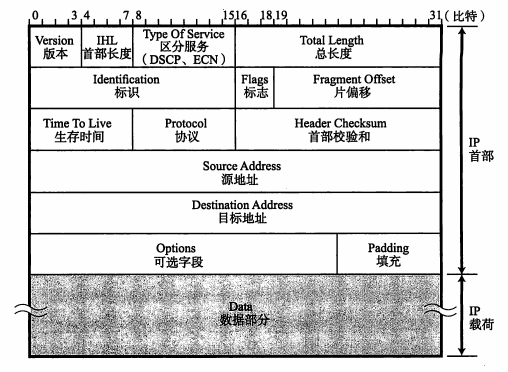
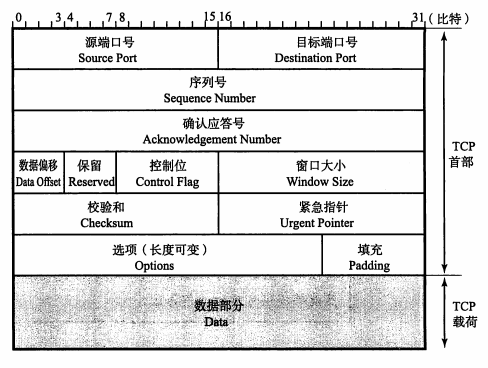
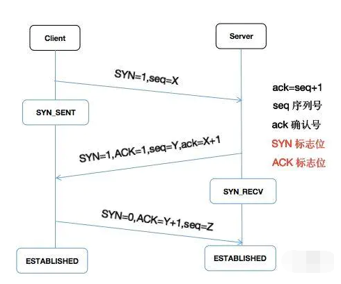

- [1 IP协议](#1-IP协议)
  - [1.1 IP地址](#11-IP地址)
  - [1.2 IP协议首部结构](#12-IP协议首部结构)
- [2 TCP协议](#2-TCP协议)
  - [2.1 TCP协议特点](#21TCP协议特点)
  - [2.2 可靠性实现原理](#22-可靠性实现原理)
  - [2.2 可靠性实现原理](#22-可靠性实现原理)
- [3 流程](#3-流程)
  - [3.1 建立连接（三次握手）](#31-建立连接（三次握手）)
  - [3.2 关闭连接（四次挥手）](#32-关闭连接（四次挥手）)

# TCP/IP协议

## 1 IP协议

IP协议对应OSI模型的**网络层**。

### 1.1 IP地址

**1. 概念**

用于在连接到网络中所有主机中识别出进行通信的目标地址。

**2. 定义**

IP地址由32位二进制正整数表示，每8位一组，分成4组，以 “.” 隔开，再将每组数转换为十进制数。

实例：

| 2^8       | 2^8       | 2^8      | 2^8     |        |
| --------- | --------- | -------- | ------- | ------ |
| 10101100  | 00010100  | 0000001  | 0000001 | 二进制 |
| 10101100. | 00010100. | 0000001. | 0000001 | 二进制 |
| 172.      | 20.       | 1.       | 1       | 十进制 |

**3. 组成**

- 网络标识（网络地址）
- 主机标识（主机地址）

**4. 分类**

- A类：首位以 “0” 开头的地址（二进制）
  - 网络标识：前8位（即0.0.0.0 ~ 127.0.0.0）
  - 主机标识：后24位（可容纳主机上限为16，777，214个）
- B类：前两位为 “10” 的地址（二进制）
  - 网络标识：前16位（即128.0.0.1 ~ 191.255.0.0）
  - 主机标识：后16位（可容纳主机上限为65，534个）
- C类：前三位为 “110” 的地址（二进制）
  - 网络标识：前24位（即192.168.0.0 ~ 239.255.255.0）
  - 主机标识：后8位（可容纳主机上限为254个）
- D类：前四位为 “1110” 的地址（二进制）
  - 网络标识：32位（即224.0.0.0 ~ 239.255.255.255）
  - 主机标识：无

※注意：IP地址不可全为 ”0“ 或全为 ”1“，因为全为 ”0“ 表示对应的网络地址或IP不可获知，全为 ”1“ 的主机地址通常作为广播地址。

### 1.2 IP协议首部结构

IP协议组成：

- IP首部
- IP载荷（包含TCP数据包）

## 2 TCP协议

### 2.1 TCP协议特点

- 实现可靠性传输（解决数据破坏、丢包、重复及分片顺序混乱问题）
- 面向连接的协议

### 2.2 可靠性实现原理

- 校验和
- 序列号
- 确认应答
- 重发控制
- 连接管理
- 窗口控制机制

### 2.3 TCP协议首部结构

TCP协议组成：

- TCP首部
- TCP载荷

## 3 流程

### 3.1 建立连接（三次握手）

**第一次握手**

客户端发送SYN同步序列编号包（seq=X）到服务器，同时进入SYN_SENT状态

**第二次握手**

服务器收到客户端的SYN包，校验客户端的SYN（ack=X+1）包，同时也发送SYN + ACK包（seq=Y,ack=X+1）到客户端，并进入SYN_RECV状态

**第三次握手**

客户端收到服务器的SYN + ACK包，向服务器发送确认包ACK（ack=Y+1），此时双方进入ESTABLISHED状态，连接建立成功

### 3.2 关闭连接（四次挥手）

**第一次挥手**

客户端发送FIN包（seq=j），关闭客户端到服务器的数据传送，并进入FIN_WAIT_1状态

**第二次挥手**

服务器收到FIN包，回发一个ACK（seq=j+1）确认包，并进入CLOSE_WAIT状态

**第三次挥手**

服务器关闭客户端的连接，发送一个FIN包（seq=k）给客户端，并进入LAST_ACK状态

**第四次挥手**

客户端收到FIN包后进入TIME_WAIT状态，立即回发ACK确认包（seq=k+1）给服务器，服务器校验序号后进入CLOSED状态，连接关闭成功

