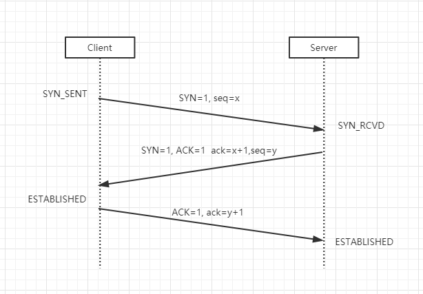
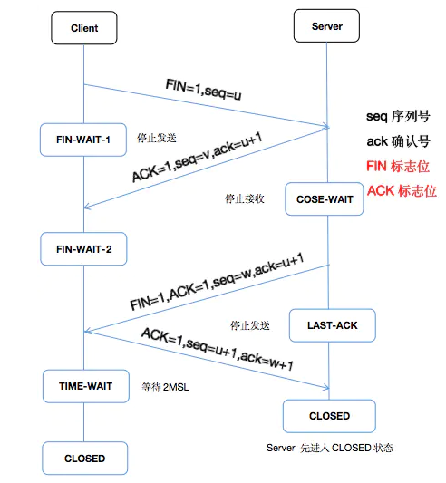

# TCP/IP协议

  * [1 IP协议](#1-ip%E5%8D%8F%E8%AE%AE)
    * [1\.1 IP地址](#11-ip%E5%9C%B0%E5%9D%80)
    * [1\.2 IP协议首部结构](#12-ip%E5%8D%8F%E8%AE%AE%E9%A6%96%E9%83%A8%E7%BB%93%E6%9E%84)
  * [2 TCP协议](#2-tcp%E5%8D%8F%E8%AE%AE)
    * [2\.1 TCP协议特点](#21-tcp%E5%8D%8F%E8%AE%AE%E7%89%B9%E7%82%B9)
    * [2\.2 可靠性实现原理](#22-%E5%8F%AF%E9%9D%A0%E6%80%A7%E5%AE%9E%E7%8E%B0%E5%8E%9F%E7%90%86)
    * [2\.3 TCP协议首部结构](#23-tcp%E5%8D%8F%E8%AE%AE%E9%A6%96%E9%83%A8%E7%BB%93%E6%9E%84)
    * [2\.4 SYN攻击](#24-syn%E6%94%BB%E5%87%BB)
  * [3 流程](#3-%E6%B5%81%E7%A8%8B)
    * [3\.1 建立连接（三次握手）](#31-%E5%BB%BA%E7%AB%8B%E8%BF%9E%E6%8E%A5%E4%B8%89%E6%AC%A1%E6%8F%A1%E6%89%8B)
    * [3\.2 关闭连接（四次挥手）](#32-%E5%85%B3%E9%97%AD%E8%BF%9E%E6%8E%A5%E5%9B%9B%E6%AC%A1%E6%8C%A5%E6%89%8B)
    * [3\.3 为什么是三次握手](#33-%E4%B8%BA%E4%BB%80%E4%B9%88%E6%98%AF%E4%B8%89%E6%AC%A1%E6%8F%A1%E6%89%8B)
    * [3\.4 为什么是四次挥手](#34-%E4%B8%BA%E4%BB%80%E4%B9%88%E6%98%AF%E5%9B%9B%E6%AC%A1%E6%8C%A5%E6%89%8B)

## 1 IP协议

IP协议对应OSI模型的**网络层**。

### 1.1 IP地址

**1. 概念**

用于在连接到网络中所有主机中识别出进行通信的目标地址。

**2. 定义**

IP地址由32位二进制正整数表示，每8位一组，分成4组，以 “.” 隔开，再将每组数转换为十进制数。

实例：

| 2^8       | 2^8       | 2^8      | 2^8     |        |
| --------- | --------- | -------- | ------- | ------ |
| 10101100  | 00010100  | 0000001  | 0000001 | 二进制 |
| 10101100. | 00010100. | 0000001. | 0000001 | 二进制 |
| 172.      | 20.       | 1.       | 1       | 十进制 |

**3. 组成**

- 网络标识（网络地址）
- 主机标识（主机地址）

**4. 分类**

- A类：首位以 “0” 开头的地址（二进制）
  - 网络标识：前8位（即0.0.0.0 ~ 127.0.0.0）
  - 主机标识：后24位（可容纳主机上限为16，777，214个）
- B类：前两位为 “10” 的地址（二进制）
  - 网络标识：前16位（即128.0.0.1 ~ 191.255.0.0）
  - 主机标识：后16位（可容纳主机上限为65，534个）
- C类：前三位为 “110” 的地址（二进制）
  - 网络标识：前24位（即192.168.0.0 ~ 239.255.255.0）
  - 主机标识：后8位（可容纳主机上限为254个）
- D类：前四位为 “1110” 的地址（二进制）
  - 网络标识：32位（即224.0.0.0 ~ 239.255.255.255）
  - 主机标识：无

※注意：IP地址不可全为 ”0“ 或全为 ”1“，因为全为 ”0“ 表示对应的网络地址或IP不可获知，全为 ”1“ 的主机地址通常作为广播地址。

### 1.2 IP协议首部结构


IP协议组成：

- IP首部
- IP载荷（包含TCP数据包）

## 2 TCP协议

### 2.1 TCP协议特点

- 实现可靠性传输（解决数据破坏、丢包、重复及分片顺序混乱问题）
- 面向连接的协议

### 2.2 可靠性实现原理

- 校验和
- 序列号
- 确认应答
- 重发控制
- 连接管理
- 窗口控制机制

### 2.3 TCP协议首部结构


TCP协议组成：

- TCP首部
  - 序列号：seq，长度32位，标识从TCP源端口向目标端口发送的字节流，发起方发送数据时标记它
  - 确认应答号：ack，长度32位，只有ACK的标志位为1时，确认应答号才有效，ack=seq+1
  - 控制位（常称为“标志位”）：长度8位**（以下标志位值为1的含义）**
    - CWR：通知对方将拥塞窗口缩小
    - ECE：通知对方，对方到主机的网络有阻塞
    - URG：紧急指针，表示包中有紧急处理的数据
    - ACK：确认应答的字段有效（除了第一次建立连接时的SYN包中ACK为0以外该位必须为1）
    - PSH：接收方应尽快将这个报文交给应用层（0表示将数据先缓存起来）
    - RST：连接出现异常必须强制断开连接
    - SYN：发起一个新连接，同时设置序列号 `seq` 的初始值
    - FIN：断开当前连接（每个主机对对方的FIN包进行确认应答之后才能断开连接），主机收到FIN为1的包时缓冲区仍有数据发送的情况下，可等待缓冲区所有数据成功发送完且被自动删除后再发FIN包
- TCP载荷

> ack是确认应答号，是一种随机生成的数字序号
>
> ACK是标志位，值为1表示确认应答号有效

### 2.4 SYN攻击

在三次握手过程中，Server发送 SYN-ACK 之后，收到Client的ACK之前的TCP连接称为半连接（half-open connect），此时Server处于 SYN_RCVD 状态，当收到ACK后，Server转入 ESTABLISHED 状态。

SYN攻击就是Client在短时间内伪造大量不存在的IP地址，并向Server不断地发送SYN包，Server回复确认包，并等待Client的确认，由于源地址是不存在的，因此，Server需要不断重发直至超时，这些伪造的SYN包将产时间占用未连接队列，导致正常的SYN请求因为队列满而被丢弃，从而引起网络堵塞甚至系统瘫痪。

SYN攻击是一种典型的DDOS攻击，检测SYN攻击的方式非常简单，即当Server上有大量半连接状态且源IP地址是随机的，则可以断定遭到SYN攻击了，使用如下命令可以让之现行：

````shell
netstat -nap | grep SYN_RECV
````

## 3 流程

### 3.1 建立连接（三次握手）



**第一次握手**

客户端发送 `SYN=1,seq=x` 的数据包到服务器，客户端进入 SYN_SENT 状态，等待Server确认

**第二次握手**

服务器收到客户端的数据包，校验客户端的 SYN 标志位为1后，将 `ack` 的值设置为x+1，发送 `SYN=1,ACK=1 ack=x+1,seq=y` 的数据包到客户端，服务器进入 SYN_RECV 状态

**第三次握手**

客户端收到服务器的数据包，校验服务器的 SYN 标志位为1后，将 `ack` 的值设置为y+1，向服务器发送确认包 `ACK=1,ack=y+1` ，此时双方进入 ESTABLISHED 状态，连接建立成功

### 3.2 关闭连接（四次挥手）



> 四次挥手可由客户端或服务器端任意一方发起。

**第一次挥手**

客户端主动发送 `FIN=1,seq=u` 的数据包，关闭客户端→服务器的数据传送，客户端进入 FIN_WAIT_1 状态

**第二次挥手**

服务器收到FIN包，校验客户端的 FIN 标志位为1后，将 `ack` 的值设置为u+1，回发一个 `ACK=1 seq=v,ack=u+1` 数据包，服务器进入 CLOSE_WAIT 状态，此时客户端进入 FIN_WAIT_2 状态

**第三次挥手**

服务器被动关闭客户端的连接，发送一个 `FIN=1 seq=w,ack=u+1` 数据包给客户端，服务器进入 LAST_ACK 状态

**第四次挥手**

客户端收到FIN包，校验服务器的 FIN 标志位为1后，将 `ack` 的值设置为w+1，回发 `ACK=1 seq=u+1,ack=w+1` 数据包给服务器，客户端进入 TIME_WAIT 状态，服务器校验序号后双方进入 CLOSED 状态，连接关闭成功

### 3.3 为什么是三次握手

如果是一次握手，客户端随意就能连接了不发数据，那将会导致服务器浪费大量的资源保持这些无用连接。

如果是两次握手，客户端发的连接请求因为网络波动导致很久后才到服务器，服务器确认后开启连接但是此时客户端已经没有数据要发，那同样将会导致服务器浪费大量的资源保持这些无用连接。

四次握手则是多一个冗余的步骤。

> client发出的第一个连接请求报文段并没有丢失，而是在某个网络结点长时间的滞留了，以致延误到连接释放以后的某个时间才到达server。本来这是一个早已失效的报文段。但server收到此失效的连接请求报文段后，就误认为是client再次发出的一个新的连接请求。于是就向client发出确认报文段，同意建立连接。假设不采用三次握手，那么只要server发出确认，新的连接就建立了。由于现在client并没有发出建立连接的请求，因此不会理睬server的确认，也不会向server发送数据。但server却以为新的运输连接已经建立，并一直等待client发来数据。这样，server的很多资源就白白浪费掉了。采用三次握手的办法可以防止上述现象发生

### 3.4 为什么是四次挥手

因为TCP连接是全双工的，每个方向必须单独进行关闭，

> 原则是当A完成数据发送任务后，A发送一个FIN来终止 A→B 的连接，B收到FIN后只是意味着 A→B 的方向上没有数据流动了，即不会再收到数据了，但是在这个 B→A 的TCP连接上仍然能够发送数据，直到B也发送了FIN给A。首先进行关闭的一方将执行主动关闭，而另一方则执行被动关闭。