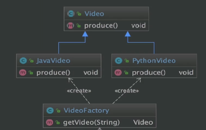

# 设计模式学习笔记

  * [1 UML](#1-uml)
    * [1\.1 基本概念](#11-%E5%9F%BA%E6%9C%AC%E6%A6%82%E5%BF%B5)
    * [1\.2 UML 2\.2 分类](#12-uml-22-%E5%88%86%E7%B1%BB)
    * [1\.3 UML语法](#13-uml%E8%AF%AD%E6%B3%95)
  * [2 设计原则](#2-%E8%AE%BE%E8%AE%A1%E5%8E%9F%E5%88%99)
    * [2\.1 开闭原则](#21-%E5%BC%80%E9%97%AD%E5%8E%9F%E5%88%99)
    * [2\.2 依赖倒置原则](#22-%E4%BE%9D%E8%B5%96%E5%80%92%E7%BD%AE%E5%8E%9F%E5%88%99)
    * [2\.3 单一职责原则](#23-%E5%8D%95%E4%B8%80%E8%81%8C%E8%B4%A3%E5%8E%9F%E5%88%99)
    * [2\.4 接口隔离原则](#24-%E6%8E%A5%E5%8F%A3%E9%9A%94%E7%A6%BB%E5%8E%9F%E5%88%99)
    * [2\.5 迪米特原则](#25-%E8%BF%AA%E7%B1%B3%E7%89%B9%E5%8E%9F%E5%88%99)
    * [2\.6 里氏替换原则](#26-%E9%87%8C%E6%B0%8F%E6%9B%BF%E6%8D%A2%E5%8E%9F%E5%88%99)
    * [2\.7 合成复用原则](#27-%E5%90%88%E6%88%90%E5%A4%8D%E7%94%A8%E5%8E%9F%E5%88%99)
  * [3 二十三种设计模式](#3-%E4%BA%8C%E5%8D%81%E4%B8%89%E7%A7%8D%E8%AE%BE%E8%AE%A1%E6%A8%A1%E5%BC%8F)
    * [3\.1 创建型模式](#31-%E5%88%9B%E5%BB%BA%E5%9E%8B%E6%A8%A1%E5%BC%8F)
      * [工厂方法模式](#%E5%B7%A5%E5%8E%82%E6%96%B9%E6%B3%95%E6%A8%A1%E5%BC%8F)
      * [抽象工厂模式](#%E6%8A%BD%E8%B1%A1%E5%B7%A5%E5%8E%82%E6%A8%A1%E5%BC%8F)
      * [单例模式](#%E5%8D%95%E4%BE%8B%E6%A8%A1%E5%BC%8F)
      * [原型模式](#%E5%8E%9F%E5%9E%8B%E6%A8%A1%E5%BC%8F)
      * [建造者模式](#%E5%BB%BA%E9%80%A0%E8%80%85%E6%A8%A1%E5%BC%8F)
    * [3\.2 结构型模式](#32-%E7%BB%93%E6%9E%84%E5%9E%8B%E6%A8%A1%E5%BC%8F)
      * [适配器模式](#%E9%80%82%E9%85%8D%E5%99%A8%E6%A8%A1%E5%BC%8F)
      * [桥接模式](#%E6%A1%A5%E6%8E%A5%E6%A8%A1%E5%BC%8F)
      * [装饰者模式](#%E8%A3%85%E9%A5%B0%E8%80%85%E6%A8%A1%E5%BC%8F)
      * [组合模式](#%E7%BB%84%E5%90%88%E6%A8%A1%E5%BC%8F)
      * [代理模式](#%E4%BB%A3%E7%90%86%E6%A8%A1%E5%BC%8F)
      * [享元模式](#%E4%BA%AB%E5%85%83%E6%A8%A1%E5%BC%8F)
      * [外观模式](#%E5%A4%96%E8%A7%82%E6%A8%A1%E5%BC%8F)
    * [3\.3 行为型模式](#33-%E8%A1%8C%E4%B8%BA%E5%9E%8B%E6%A8%A1%E5%BC%8F)
      * [策略模式](#%E7%AD%96%E7%95%A5%E6%A8%A1%E5%BC%8F)
      * [观察者模式](#%E8%A7%82%E5%AF%9F%E8%80%85%E6%A8%A1%E5%BC%8F)
      * [责任链模式](#%E8%B4%A3%E4%BB%BB%E9%93%BE%E6%A8%A1%E5%BC%8F)
      * [备忘录模式](#%E5%A4%87%E5%BF%98%E5%BD%95%E6%A8%A1%E5%BC%8F)
      * [模板方法模式](#%E6%A8%A1%E6%9D%BF%E6%96%B9%E6%B3%95%E6%A8%A1%E5%BC%8F)
      * [迭代器模式](#%E8%BF%AD%E4%BB%A3%E5%99%A8%E6%A8%A1%E5%BC%8F)
      * [中介者模式](#%E4%B8%AD%E4%BB%8B%E8%80%85%E6%A8%A1%E5%BC%8F)
      * [命令模式](#%E5%91%BD%E4%BB%A4%E6%A8%A1%E5%BC%8F)
      * [访问者模式](#%E8%AE%BF%E9%97%AE%E8%80%85%E6%A8%A1%E5%BC%8F)
      * [解释器模式](#%E8%A7%A3%E9%87%8A%E5%99%A8%E6%A8%A1%E5%BC%8F)
      * [状态模式](#%E7%8A%B6%E6%80%81%E6%A8%A1%E5%BC%8F)
  * [4 其他设计模式](#4-%E5%85%B6%E4%BB%96%E8%AE%BE%E8%AE%A1%E6%A8%A1%E5%BC%8F)
    * [4\.1 创建型](#41-%E5%88%9B%E5%BB%BA%E5%9E%8B)
      * [简单工厂模式](#%E7%AE%80%E5%8D%95%E5%B7%A5%E5%8E%82%E6%A8%A1%E5%BC%8F)

## 1 UML

### 1.1 基本概念

**1.定义**

统一建模语言（英语：Unified Modeling Language，缩写 *UML*）是非专利的第三代建模和规约语言。

**2.特点**

- UML是一种开放的方法。
- 用于说明、可视化、构建和编写一个正在开发的、面向对象的、软件密集系统的制品的开放方法。
- UML展现了一系列最佳工程实践，这些最佳实践在对大规模，复杂系统进行建模方面，特别是在软件架构层次已经被验证有效。

### 1.2 UML 2.2 分类

UML 2.2 中一共定义了14种图示，分三类：

- 结构式图形
- 行为式图形
- 交互式图形

**1. 结构式图形**

1）概念

强调的是系统式的建模

2）分类

- 静态图（类图，对象图，包图）
- 实现图（组件图，部署图）
- 剖面图
- 复合结构图

**2. 行为式图形**

1）概念

强调系统模型种触发的事件

2）分类

- 活动图
- 状态图
- 用例图

**3. 交互式图形**

1）概念

属于行为式图形子集合，强调系统模型中资料流程

2）分类

- 通信图
- 交互概述图（UML 2.2）
- 时序图（UML 2.2）
- 时间图（UML 2.2）

### 1.3 UML语法

**1. 符号**

- UML箭头方向：从子类指向父类。
- 实线表示继承
- 虚线表示实现
- 实线表示关联（如企鹅和气候的关系）
- 虚线表示依赖（如动物依赖水、氧气的关系）
- 空心菱形表示聚合（如大雁群和大雁的关系）
- 实心菱形表示组合（如鸟和翅膀的关系）
- 常见数字表达及含义

> 数字表达示例：假设有A类和B类，数字标记在A类侧。
>
> - 0..1表示0或1个实例
> - 0..*表示0或多个实例
> - 1..1表示1个实例
> - 1表示只有一个实例
> - 1..*表示至少有一个实例

**2. 时序图种**

时序图种包括的建模元素主要有：对象（Actor）、生命线（Lifeline）、控制焦点（Focus of control）、消息（Message）等。

**3. 类图分类**

- 斜体类名表示抽象类或方法
- `<<>>`表示接口
- `+`表示public
- `-`表示private
- `#`表示protected
- `~`表示default
- `_____`表示static属性或方法

## 2 设计原则

设计模式中有7大设计原则：

- 开闭原则
- 依赖倒置原则
- 单一职责原则
- 接口隔离原则
- 迪米特法则
- 里氏替换原则
- 合成复用原则

### 2.1 开闭原则

**1. 定义**

一个软件实体如类、模块和函数应该对扩展开放，对修改关闭。

**2. 约束条件**

用抽象构建框架，用实现扩展细节。

**3. 优点**

提高软件系统的可复用性及可维护性。

### 2.2 依赖倒置原则

**1. 定义**

高层模块不应该依赖底层模块，二者都应该依赖其抽象。

**2. 约束条件**

- 抽象不应该依赖细节，细节应该依赖抽象。

- 针对接口编程，不针对实现编程。

**3. 优点**

- 减少类间的耦合性。
- 提高系统稳定性。
- 提高代码可读性和维护性。
- 降低修改程序造成的风险。

### 2.3 单一职责原则

**1. 定义**

不要存在多于一个导致类变更的原因。

**2. 约束条件**

一个类/接口/方法只负责一项职责。

**3. 优点**

- 降低类的复杂度。
- 提高类的可读性。
- 提高系统的可维护性。
- 降低变更引起的风险。

### 2.4 接口隔离原则

**1. 定义**

用多个专门的接口，而不使用单一的总接口，客户端不应该依赖它不需要的接口。

**2. 约束条件**

- 一个类对一个类的依赖应该建立在最小的接口上。
- 建立单一接口，不要建立庞大臃肿的接口。
- 尽量细化接口，接口中的方法尽量少。

**3. 优点**

符合高内聚低耦合的设计思想，使得类具有很好的可读性、可扩展性和可维护性。

### 2.5 迪米特法则

**1. 定义**

一个对象应该对其他对象保持最少的了解。（又叫最少知道原则）

**2. 约束条件**

尽量降低类与类之间的耦合。

> 如 boss、leader 和 staff 之间，boss 只需要联系 leader，不和 staff 有直接联系，而让 leader 来联系 staff。

**3. 优点**

降低类之间的耦合。

### 2.6 里氏替换原则

**1. 定义**

基类可以出现的地方，子类一定可以出现。

### 2.7 合成复用原则

**1. 定义**

要求在对象的复用时，要尽量先使用组合或者聚合等关联关系来实现，其次才考虑使用继承关系来实现。

> 如果要使用继承关系，则必须严格遵循里氏替换原则。

## 3 二十三种设计模式

### 3.1 创建型模式

#### 工厂方法模式

**1. 定义**

定义一个创建对象的接口，但让实现整个接口的类来决定实例化哪个类，工厂方法让类的实例化推迟到子类中进行。

**2. 作用**

。

**3. 特性**

1）优点

- 用户只需关心所需产品对应的工厂，无需关心创建细节。

- 加入新产品符合开闭原则，提高可扩展性。

2）缺点

- 类的个数容易过多，增加复杂度。

- 增加了系统的抽象性和理解难度。

**4. 适用场景**

- 创建对象需要大量重复的代码。
- 客户端（应用层）不依赖于产品类实例如何被创建、实现等细节。
- 一个类通过其子类来制定创建哪个对象。

**5. 源码实例**

- JDK 源码中 java.util.Collection\<E> 接口（集合）的实现。
- JDK 源码中 java.net.URLStreamHandlerFactory 接口（URL 协议扩展）的实现。
- logback 源码中 ILoggerFactory 接口的实现。
- Spring 中的 BeanFactory、ApplicationContext 的实现。

**6. 示例代码**

1）UML 图

2）源码

（未完待续）

#### 抽象工厂模式

**1. 定义**

抽象工厂模式提供一个创建一系列相关或相互依赖对象的接口，无需指定它们具体的类。

**2. 作用**

。

**3. 特性**

1）优点

- 具体产品在应用层代码隔离，无需关心创建细节。
- 将一个系列的产品族统一到一起创建。

2）缺点

- 规定了所有可能被创建的产品集合，产品族中扩展新的产品困难，需要修改抽象工厂的接口。
- 增加了系统的抽象性和理解难度。

**4. 适用场景**

- 客户端（应用层）不依赖于产品类实例如何被创建、实现等细节。
- 强调一系列相关的产品对象（属于同一产品族）一起使用创建对象需要大量重复的代码。
- 提供一个产品类的库，所有的产品以同样的接口出现，从而使客户端不依赖于具体实现。

**5. 源码实例**

- JDK 源码中 java.sql.Connection 接口（数据库连接）的实现。
- JDK 源码中 java.sql.Statement 接口（返回静态 SQL 语句结果）的实现。
- Mybatis 源码中 SqlSessionFactory 接口（创建 SqlSession 对象操作数据库）的实现。

**6. 示例代码**

1）UML 图

2）源码

（未完待续）

#### 单例模式

**1. 定义**

保证一个类仅有一个实例，并提供一个全局访问点。

**2. 作用**

。

**3. 特性**

1）优点

- 内存中只有一个实例，减少内存开销。
- 避免对资源的多重占用。
- 设置全局访问点，严格控制访问。

2）缺点

- 没有接口，扩展困难。

**4. 适用场景**

确保任何情况下都绝对只有一个实例。

**4. 约束条件**

- 私有构造器
- 线程安全
- 延迟加载
- 保证序列化和反序列化安全
- 防止反射机制破坏单例

**5. 源码实例**

。

**6. 示例代码**

1）UML 图

。

2）源码

（未完待续）

#### 原型模式

**1. 定义**

指原型实例指定创建对象的种类，并且通过拷贝这些原型创建新的对象。

> 不需要知道任何创建的细节，不调用构造函数。

**2. 作用**

。

**3. 特性**

1）优点

- 原型模式性能比直接 new 一个对象性能高。
- 简化创建过程。

2）缺点

- 必须配备克隆对象。
- 对克隆复杂对象或对克隆出的对象进行复杂改造时，容易引入风险。
- 深拷贝、浅拷贝要运用得当。

**4. 适用场景**

- 类初始化消耗较多资源。
- new 产生的一个对象需要非常繁琐的过程（数据准备、访问权限等）。
- 构造函数比较复杂。
- 循环体中产生大量对象时。

**5. 源码实例**

- JDK 源码中 java.lang.Object 类 clone() 方法的实现。
- JDK 源码中实现了 Cloneable 接口的类（如集合中的 HashMap、ArrayList 等）并重写的 clone() 方法。

**6. 示例代码**

1）UML 图

2）源码

（未完待续）

#### 建造者模式

**1. 定义**

将一个复杂对象的构建与它的表示分离，使得同样的构建过程可以创建不同的表示。

> 用户只需指定建造的类型即可得到它们，而不需要了解其建造过程。

**2. 作用**

。

**3. 特性**

1）优点

- 封装性好，创建和使用分离。
- 扩展性好，建造类之间独立、一定程度上解耦。

2）缺点

- 产生多余的 Builder 对象。
- 若产品内部发生变化，建造者都要修改，成本较高。

**4. 适用场景**

- 适用于具有非常复杂的内部结构（很多属性）的一个对象。
- 把复杂对象的创建和使用分离的场景。

**5. 源码实例**

- JDK 源码中 java.lang.StringBuilder（final）类（单线程下操作可变 String 字符串）的实现。
- JDK 源码中 java.lang.StringBuffer（final）类（多线程下操作可变 String 字符串）的实现。
- Guava 源码中的 ImmutableSet 抽象类（不可变 Set 集合）的实现。
- Spring 源码中的 BeanDefinitionBuilder（final）类（构建 BeanDefinitions 对象）的实现。
- Mybatis 源码中 SqlSessionFactoryBuilder 类（构建 SqlSessionFactory 对象）的实现。

**6. 示例代码**

1）UML 图

2）源码

（未完待续）

### 3.2 结构型模式

#### 适配器模式

**1. 定义**

将一个类的接口转换成客户期望的另一个接口。

**2. 作用**

使原本接口不兼容的类可以一起工作。

**3. 特性**

1）优点

- 提高类的透明性和复用性，现有的类复用但不需要改变。
- 目标类和适配器类解耦，提高程序扩展性。
- 符合开闭原则。

2）缺点

- 适配器编写过程需要全面考虑，可能会增加系统的复杂性。
- 增加系统代码可读的难度。

**4. 适用场景**

- 已存在的类，它的方法和需求不匹配时（方法结果相同或近似）。
- 不是软件设计阶段考虑的设计模式，是随着软件维护，由于不同产品、不同厂家造成功能类似而接口不同情况下的解决方案。

**5. 源码实例**

- JDK 源码中 javax.xml.bind.annotation.adapters.XmlAdapter 抽象类（xml 序列化与反序列化）的实现。
- Spring 源码中的 AdvisorAdapter 接口（AOP 通知）的实现。
- Spring Data JPA 源码中的 JpaVendorAdapter 接口（SPI接口，用于配置 JPA 相关属性）的实现。
- SpringMVC 源码中的 HandlerAdapter 接口（AOP 通知）的实现。

**6. 示例代码**

1）UML 图

2）源码

（未完待续）

#### 桥接模式

**1. 定义**

将抽象部分与它的具体实现部分分离，使它们都可以独立的变化。

**2. 实现思路**

通过组合的方式建立两个类之间的联系，而不是继承。

**3. 特性**

1）优点

- 分离抽象部分及其具体实现部分。
- 提高了系统的可扩展性。
- 符合开闭原则。
- 符合合成符永远在

2）缺点

- 增加系统的理解与设计难度。
- 需要正确地识别出系统中两个独立变化的维度。

**4. 适用场景**

- 抽象和具体实现之间增加更多的灵活性。
- 一个类存在两个（或多个）独立变化的维度，且这两个维度都需要独立进行扩展。
- 不希望使用继承，或因为多层继承导致系统类的个数剧增。

**5. 源码实例**

- JDK 源码中 java.sql.Driver 接口的实现。

**6. 示例代码**

1）UML 图

2）源码

（未完待续）

#### 装饰者模式

**1. 定义**

在不改变原有对象的基础上，将功能附加到对象上。

**2. 作用**

提供了比继承更有弹性的替代方案（扩展原有对象功能）。

**3. 特性**

1）优点

- 继承的有力补充，比继承灵活，不改变原有对象的情况下给一个对象扩展功能。
- 通过使用不同装饰类以及这些装饰类的排列组合，可以实现不同效果。
- 符合开闭原则。

2）缺点

- 会出现更多的代码，更多的类，增加程序复杂性。
- 动态装饰时，多层装饰会更复杂。

**4. 适用场景**

- 扩展一个类的功能或给一个类添加附加职责。
- 动态的给一个对象添加功能，这些功能可以再动态的撤销。

**5. 源码实例**

- JDK 源码中 java.io.BufferedReader 类（从字符输入流中读取文本、缓冲字符）的实现。
- JDK 源码中 java.io.BufferedInputStream/BufferedOutputStream  类（使 FilterInputStream/FilterOutputStream 类额外支持缓冲输入/输出）的实现。
- Spring 源码中 SessionRepositoryRequestWrapper （final）类（扩展 servlet 中 HttpServletRequestWrapper 的功能）的实现。
- Mybatis 源码中 org.apche.ibatis.cache.decorators 包下的各类对 Cache 接口的功能扩充类（如 LruCache、BockingCache、SynchronizedCache 等）的实现。

**6. 示例代码**

1）UML 图

2）源码

（未完待续）

#### 组合模式

**1. 定义**

将对象组合成树形结构以表示“部分-整体”的层次结构。

**2. 作用**

使客户端对单个对象和组合对象保持一致的方式处理。

**3. 特性**

1）优点

- 清楚的定义分层次的复杂对象，表示对象的全部或部分层次。
- 让客户的忽略了层次的差异，方便对整个层次结构进行控制。
- 简化客户端代码。
- 符合开闭原则。

2）缺点

- 限制类型时会较为复杂。
- 使设计变得更加抽象。

**4. 适用场景**

- 希望客户端可以忽略组合对象与单个对象的差异时。
- 处理一个树形结构时。

**5. 源码实例**

。

**6. 示例代码**

1）UML 图

2）源码

（未完待续）

#### 代理模式

**1. 定义**

为其他对象提供一种代理，以控制对这个对象的访问。

**2. 作用**

代理对象在客户端和目标对象之间起到中介的作用。

**3. 特性**

1）优点

- 代理模式能将代理对象与真是被调用的目标对象分离。
- 一定程度上降低了系统的耦合度，扩展性好。
- 保护目标对象。
- 增强目标对象。

2）缺点

- 造成系统设计中类的数目增加。
- 在客户端和目标对象增加一个代理对象，会造成请求处理速度变慢。
- 增加系统的复杂度。

3）扩展

- Spring 代理中，Bean 实现接口时，Spring 使用 JDK 的动态代理
- Spring 代理中，Bean 没有实现接口时，Spring 使用 CGLib
- 强制使用 CGLib（在 Spring 配置中加入 `<aop:aspectj-autoproxy proxy-target-class="true" />`）

**4. 适用场景**

- 保护目标对象。
- 增强目标对象。

**5. 源码实例**

- 。

**6. 示例代码**

1）UML 图

2）源码

（未完待续）

#### 享元模式

**1. 定义**

提供了减少对象数量从而改善应用所需的对象结构的方式。

**2. 作用**

运用共享技术有效的支持大量细粒度的对象。

**3. 特性**

1）优点

- 减少对象的创建，降低内存中对象的数量，降低系统的内存，提高内存利用率。
- 减少内存之外的其他资源的占用。

2）缺点

- 关注内/外部状态。
- 关注线程安全问题。
- 使系统、程序的逻辑复杂化。

**4. 适用场景**

- 常用于系统底层的开发，一边解决系统的性能问题。
- 系统有大量相似对象，需要缓冲池的场景。

**5. 源码实例**

- JDK 源码中 java.lang.Integer/Long （final）类（int/long 的包装类型）中内部静态类 IntegerCache/LongCache 的实现。
- Tomcat 源码中 GenericKeyedObjectPool 类（键对象缓存池）的实现。

**6. 示例代码**

1）UML 图

2）源码

（未完待续）

#### 外观模式

**1. 定义**

又叫做门面模式，提供了一个统一的接口，用来访问子系统中的一些接口。

**2. 作用**

外观模式定义了一个高层接口，让子系统更加容易使用。

**3. 特性**

1）优点

- 简化调用过程，无需深入了解子系统，防止风险。
- 减少系统依赖，松散耦合。
- 更好的划分访问层次。
- 符合迪米特法则（最少知道原则）。

2）缺点

- 增加子系统、扩展子系统行为容易引入风险。
- 不符合开闭原则。

**4. 适用场景**

- 子系统越来越复杂，增加外观模式提供简单调用的接口。
- 构建多层系统结构，利用外观对象作为每层的入口，简化层间调用。

**5. 源码实例**

- Spring 源码中 JdbcUtils 抽象类（封装 JDBC 的接口）的实现。
- Mybatis 源码中 Configuration 类（配置）的实现。
- Tomcat 源码中 RequestFacade/ResponseFacade 类（对 HttpServletRequest/HttpServleResponse 接口操作的封装）的实现。
- Tomcat 源码中 StandardSessionFacade 类（对 HttpSession 接口操作的封装）的实现。

**6. 示例代码**

1）UML 图

2）源码

（未完待续）

### 3.3 行为型模式

#### 策略模式

**1. 定义**

定义了算法家族，分别封装起来，让它们之间可以互相替换，此模式让算法的变化不会影响到使用算法的用户。

**2. 作用**

。

**3. 特性**

1）优点

- 避免使用多重条件转移语句。
- 提高算法的保密性和安全性。
- 符合开闭原则。

2）缺点

- 客户端必须知道所有的策略类，并自行决定使用哪一个策略类。
- 产生很多策略类。

**4. 适用场景**

- 系统有很多类，而它们的区别仅仅在于它们的行为不同。
- 一个系统需要动态的在几种算法中选择一种。
- 大量 if...else... 的代码

**5. 源码实例**

。

**6. 示例代码**

1）UML 图

2）源码

（未完待续）

#### 观察者模式

**1. 定义**

定义了对象之间的一对多依赖，让多个观察者对象同时监听某个主体对象，当主体对象发生变化时，它的所有依赖者（观察者）都会收到通知并更新。

**2. 作用**

。

**3. 特性**

1）优点

- 观察者和被观察者之间建立一个抽象的耦合。
- 支持广播通信。

2）缺点

- 观察者之间有过多的细节依赖、提高了时间复杂度和程序复杂度。
- 使用要得当，需要避免循环调用。

**4. 适用场景**

- 关联行为场景，建立一套触发机制。

**5. 源码实例**

。

**6. 示例代码**

1）UML 图

2）源码

（未完待续）

#### 责任链模式

**1. 定义**

为请求创建一个接受此次请求对象的链。

**2. 作用**

。

**3. 特性**

1）优点

- 请求的发送者和接收者解耦。
- 责任链可以动态组合。

2）缺点

- 责任链太长或者处理时间过长，影响性能。
- 责任链过多。

**4. 适用场景**

- 一个请求的处理需要多个对象当中的一个或几个协作处理。

**5. 源码实例**

。

**6. 示例代码**

1）UML 图

2）源码

（未完待续）

#### 备忘录模式

**1. 定义**

保存一个对象的某个状态，以便在适当的时候恢复对象。

**2. 作用**

“后悔药”。

**3. 特性**

1）优点

- 为用户提供一种可恢复机制。
- 存档信息的封装。

2）缺点

- 资源占用。

**4. 适用场景**

- 保存及恢复数据相关业务场景。
- 后悔的时候，即想恢复到之前的状态。

**5. 源码实例**

。

**6. 示例代码**

1）UML 图

2）源码

（未完待续）

#### 模板方法模式

**1. 定义**

定义了一个算发的骨架，并允许子类为一个或多个步骤提供实现。

**2. 作用**

使得子类可以在不改变算法结构的情况下，重新定义算法的某些步骤。

**3. 特性**

1）优点

- 提高复用性。
- 提高扩展性。
- 符合开闭原则。

2）缺点

- 类数目增加。
- 增加了系统实现的复杂度。
- 集成关系自身缺点，如果父类添加薪的抽象方法，所有子类都要改一遍。

**4. 适用场景**

- 一次性实现一个算法的不变的部分，并将可变的行为留给子类来实现。
- 各子类中公共的行为被提取出来并几种到一个公共父类中，从而避免代码重复。

**5. 源码实例**

。

**6. 示例代码**

1）UML 图

2）源码

（未完待续）

#### 迭代器模式

**1. 定义**

提供一种方法，顺序访问一个集合对象中的各个元素，而又不暴露该对象的内部表示。

**2. 特性**

1）优点

- 分离了集合对象的遍历行为。

2）缺点

- 类的个数成对增加。

**3. 适用场景**

- 访问一个集合对象的内容而无需暴露它的内部表示。
- 为遍历不同的集合结构提供一个统一的接口。

**4. 源码实例**

。

**5. 示例代码**

1）UML 图

2）源码

（未完待续）

#### 中介者模式

**1. 定义**

定义一个封装一组对象如何交互的对象。

**2. 作用**

通过使对象明确的相互引用来促进松散耦合，并允许独立的改变它们的交互。

**3. 特性**

1）优点

- 将一对多转化成了一对一，降低程序复杂度。
- 类之间解耦。

2）缺点

- 中介者过多，导致系统复杂。

**4. 适用场景**

- 系统中对象之间存在复杂的引用关系，产生的相互依赖关系结构混乱且难以理解。
- 交互的公共行为，如果需要改变行为则可以增加薪的中介者类。

**5. 源码实例**

。

**6. 示例代码**

1）UML 图

2）源码

（未完待续）

#### 命令模式

**1. 定义**

将请求封装成对象，以便使用不同的请求。

**2. 作用**

解决了应用程序中对象的职责以及它们之间的通信方式。

**3. 特性**

1）优点

- 降低耦合。
- 容易扩展新命令或一组命令。

2）缺点

- 命令的五险扩展会增加类的数量，提高系统实现复杂度。

**4. 适用场景**

- 请求调用者和接收者需要解耦，使得调用者和接收者不直接交互。
- 需要抽象出等待执行的行为。

**5. 源码实例**

。

**6. 示例代码**

1）UML 图

2）源码

（未完待续）

#### 访问者模式

**1. 定义**

封装作用于某数据结构（如 List、Set、Map 等）中的个元素的操作。

**2. 作用**

可以在不改变个元素的类的前提下，定义作用于这些元素的操作。

**3. 特性**

1）优点

- 增加新的操作很容易，即增加一个新的访问者。

2）缺点

- 增加新的数据结构困难。
- 具体元素变更比较麻烦。

**4. 适用场景**

- 一个数据结构（如 List、Set、Map 等）包含很多类型对象。
- 数据结构于数据操作分离。

**5. 源码实例**

。

**6. 示例代码**

1）UML 图

2）源码

（未完待续）

#### 解释器模式

**1. 定义**

给定一个语言，定义它的文法的一种表示，并定义一个解释器，这个解释器使用该表示来解释语言中的句子。

**2. 作用**

为了解释一种语言，而为语言创建的解释器。

**3. 特性**

1）优点

- 语法很多类表示，容易改变及扩展此语言。

2）缺点

- 当语法规则数目太多时，增加系统复杂度。

**4. 适用场景**

- 某个特定类型问题发生频率足够高。

**5. 源码实例**

。

**6. 示例代码**

1）UML 图

2）源码

（未完待续）

#### 状态模式

**1. 定义**

允许一个对象在其内部状态改变时，改变它的行为。

**2. 作用**

。

**3. 特性**

1）优点

- 将不同的状态隔离。
- 把各种状态的转换逻辑，分布到 State 的子类中，减少相互间依赖。
- 增加新的状态很容易。

2）缺点

- 状态多的业务场景导致类数目增加，增加了系统复杂度。

**4. 适用场景**

- 一个对象存在多个状态（不同状态下行为不同），且状态可互相转换。

**5. 源码实例**

。

**6. 示例代码**

1）UML 图

2）源码

（未完待续）

## 4 其他设计模式

### 4.1 创建型

#### 简单工厂模式

**1. 定义**

由一个工厂对象决定创建出哪一种产品的实例。

**2. 作用**

。

**3. 特性**

1）优点

- 只需传入一个正确的参数，即可获取所需的对象，而无需知道其创建细节。

2）缺点

- 工厂类的职责相对过重，增加新的产品，需要修改工厂类的判断逻辑，违背开闭原则。

**4. 适用场景**

- 工厂负责创建的对象较少。
- 客户端（应用层）只需知道传入工厂类的参数，而对于如何创建对象（逻辑）不关心。

**5. 源码实例**

- JDK 源码中 java.util.Calendar 抽象类（时间转换）的实现。
- logback 源码中 LoggerFactory （final）类的实现。

**6. 示例代码**

1）UML 图

2）源码

https://github.com/DragonV96/MyBasicDemo/tree/master/design-pattern/src/main/java/com/glw/design/pattern/creational/simple_factory

