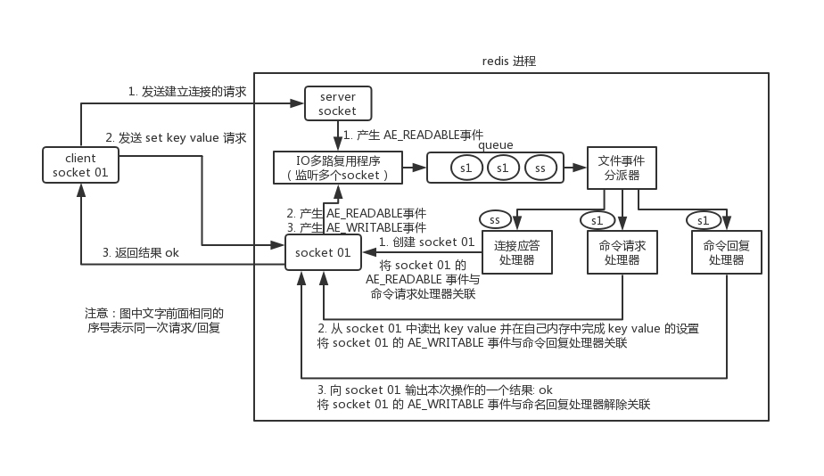
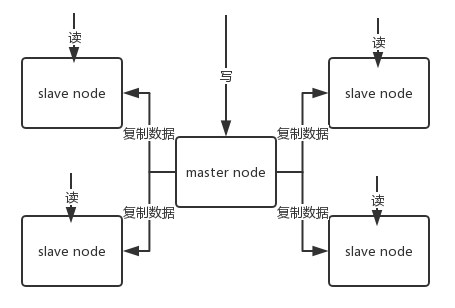
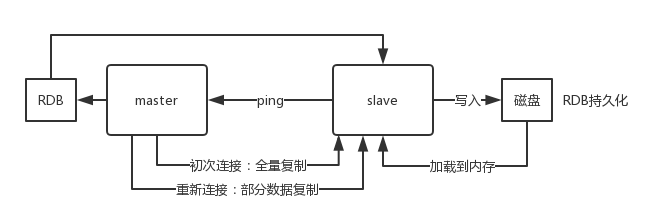
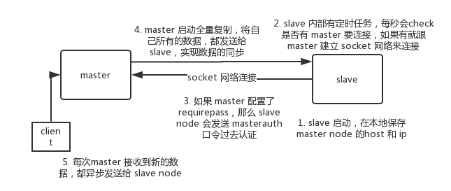
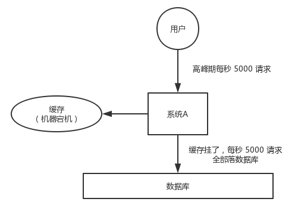

# Redis面试总结

  * [1 缓存](#1-%E7%BC%93%E5%AD%98)
    * [1\.1 缓存作用](#11-%E7%BC%93%E5%AD%98%E4%BD%9C%E7%94%A8)
    * [1\.2 缓存带来的问题](#12-%E7%BC%93%E5%AD%98%E5%B8%A6%E6%9D%A5%E7%9A%84%E9%97%AE%E9%A2%98)
  * [2 Redis基础](#2-redis%E5%9F%BA%E7%A1%80)
    * [2\.1 Redis与Memcached区别](#21-redis%E4%B8%8Ememcached%E5%8C%BA%E5%88%AB)
    * [2\.2 Redis数据结构](#22-redis%E6%95%B0%E6%8D%AE%E7%BB%93%E6%9E%84)
    * [2\.3 Redis线程模型](#23-redis%E7%BA%BF%E7%A8%8B%E6%A8%A1%E5%9E%8B)
  * [3 Redis内存机制](#3-redis%E5%86%85%E5%AD%98%E6%9C%BA%E5%88%B6)
    * [3\.1 Redis过期策略](#31-redis%E8%BF%87%E6%9C%9F%E7%AD%96%E7%95%A5)
    * [3\.2 Redis内部淘汰机制](#32-redis%E5%86%85%E9%83%A8%E6%B7%98%E6%B1%B0%E6%9C%BA%E5%88%B6)
    * [3\.3 LRU算法](#33-lru%E7%AE%97%E6%B3%95)
  * [4 Redis持久化](#4-redis%E6%8C%81%E4%B9%85%E5%8C%96)
    * [4\.1 RDB](#41-rdb)
    * [4\.2 AOF](#42-aof)
    * [4\.3 RDB与AOF对比](#43-rdb%E4%B8%8Eaof%E5%AF%B9%E6%AF%94)
  * [5 Redis主从架构](#5-redis%E4%B8%BB%E4%BB%8E%E6%9E%B6%E6%9E%84)
    * [5\.1 redis replication的核心机制](#51-redis-replication%E7%9A%84%E6%A0%B8%E5%BF%83%E6%9C%BA%E5%88%B6)
    * [5\.2 主从复制的核心原理](#52-%E4%B8%BB%E4%BB%8E%E5%A4%8D%E5%88%B6%E7%9A%84%E6%A0%B8%E5%BF%83%E5%8E%9F%E7%90%86)
      * [5\.2\.1 复制流程概述](#521-%E5%A4%8D%E5%88%B6%E6%B5%81%E7%A8%8B%E6%A6%82%E8%BF%B0)
      * [5\.2\.2 主从复制的断点续传](#522-%E4%B8%BB%E4%BB%8E%E5%A4%8D%E5%88%B6%E7%9A%84%E6%96%AD%E7%82%B9%E7%BB%AD%E4%BC%A0)
      * [5\.2\.3 无磁盘化复制](#523-%E6%97%A0%E7%A3%81%E7%9B%98%E5%8C%96%E5%A4%8D%E5%88%B6)
      * [5\.2\.4 过期key处理](#524-%E8%BF%87%E6%9C%9Fkey%E5%A4%84%E7%90%86)
    * [5\.3 复制的完整流程](#53-%E5%A4%8D%E5%88%B6%E7%9A%84%E5%AE%8C%E6%95%B4%E6%B5%81%E7%A8%8B)
      * [5\.3\.1 全量复制](#531-%E5%85%A8%E9%87%8F%E5%A4%8D%E5%88%B6)
      * [5\.3\.2 增量复制](#532-%E5%A2%9E%E9%87%8F%E5%A4%8D%E5%88%B6)
      * [5\.3\.3 心跳](#533-%E5%BF%83%E8%B7%B3)
      * [5\.3\.4 异步复制](#534-%E5%BC%82%E6%AD%A5%E5%A4%8D%E5%88%B6)
    * [5\.4 Redis如何做到高可用](#54-redis%E5%A6%82%E4%BD%95%E5%81%9A%E5%88%B0%E9%AB%98%E5%8F%AF%E7%94%A8)
  * [6 Redis Cluster](#6-redis-cluster)
    * [6\.1 介绍](#61-%E4%BB%8B%E7%BB%8D)
    * [6\.2 节点间的内部通信机制](#62-%E8%8A%82%E7%82%B9%E9%97%B4%E7%9A%84%E5%86%85%E9%83%A8%E9%80%9A%E4%BF%A1%E6%9C%BA%E5%88%B6)
    * [6\.3 分布式寻址算法](#63-%E5%88%86%E5%B8%83%E5%BC%8F%E5%AF%BB%E5%9D%80%E7%AE%97%E6%B3%95)
    * [6\.4 高可用与主备切换原理](#64-%E9%AB%98%E5%8F%AF%E7%94%A8%E4%B8%8E%E4%B8%BB%E5%A4%87%E5%88%87%E6%8D%A2%E5%8E%9F%E7%90%86)
  * [7 Redis哨兵集群](#7-redis%E5%93%A8%E5%85%B5%E9%9B%86%E7%BE%A4)
    * [7\.1 哨兵集群核心概念](#71-%E5%93%A8%E5%85%B5%E9%9B%86%E7%BE%A4%E6%A0%B8%E5%BF%83%E6%A6%82%E5%BF%B5)
    * [7\.2 数据丢失问题及解决方案](#72-%E6%95%B0%E6%8D%AE%E4%B8%A2%E5%A4%B1%E9%97%AE%E9%A2%98%E5%8F%8A%E8%A7%A3%E5%86%B3%E6%96%B9%E6%A1%88)
    * [7\.3 宕机判断机制](#73-%E5%AE%95%E6%9C%BA%E5%88%A4%E6%96%AD%E6%9C%BA%E5%88%B6)
    * [7\.4 哨兵集群的自动发现机制](#74-%E5%93%A8%E5%85%B5%E9%9B%86%E7%BE%A4%E7%9A%84%E8%87%AA%E5%8A%A8%E5%8F%91%E7%8E%B0%E6%9C%BA%E5%88%B6)
    * [7\.5 slave\-&gt;master 选举算法](#75-slave-master-%E9%80%89%E4%B8%BE%E7%AE%97%E6%B3%95)
    * [7\.6 quorum 和 majority](#76-quorum-%E5%92%8C-majority)
    * [7\.7 configuration epoch](#77-configuration-epoch)
    * [7\.8 configuration 传播](#78-configuration-%E4%BC%A0%E6%92%AD)
  * [8 常见的Redis场景问题](#8-%E5%B8%B8%E8%A7%81%E7%9A%84redis%E5%9C%BA%E6%99%AF%E9%97%AE%E9%A2%98)
    * [8\.1 缓存雪崩](#81-%E7%BC%93%E5%AD%98%E9%9B%AA%E5%B4%A9)
    * [8\.2 缓存穿透](#82-%E7%BC%93%E5%AD%98%E7%A9%BF%E9%80%8F)
    * [8\.3 缓存击穿](#83-%E7%BC%93%E5%AD%98%E5%87%BB%E7%A9%BF)

## 1 缓存

缓存指数据交换的缓冲区。

### 1.1 缓存作用

- **高性能**：预加载复杂、耗时且极少修改的查询，用户体验丝滑流畅
- **高并发**：内存中key-value式操作，单机支撑并发量达到几万十几万，是mysql的几十倍（因为缓存走内存，mysql走磁盘I/O）

### 1.2 缓存带来的问题

- 缓存与数据库双写不一致
- 缓存雪崩、缓存穿透、缓存击穿
- 缓存并发竞争

## 2 Redis基础

### 2.1 Redis与Memcached区别

| 区别     | Redis                                                        | Memcached              |
| -------- | ------------------------------------------------------------ | ---------------------- |
| 数据结构 | 支持string、hash、list、set、sorted set、bitmap、hyperloglog和geospatial等8种数据结构(5.0引入了stream) | 只支持String和整数     |
| 线程模型 | 单线程处理                                                   | 多线程处理             |
| 性能对比 | 100k以上数据性能较低，100k以下性能较高                       | 与其相反               |
| 部署模式 | 原生支持集群模式                                             | 原生仅支持单机部署模式 |
| 同步方式 | 支持主从同步                                                 | 不支持复制             |

### 2.2 Redis数据结构

**1. 基础数据结构**

- String
- hash
- list
- set
- sorted set

1）String

最简单的KV存储（效率比Memcached高）。

> value也可以存数字，如：数字类型（数字类型可用Long表示时）。

````
set name JeasonBourne
````

2）hash

类似map的数据结构。

> 可存储结构化数据的同时只修改其中的部分属性，如：一个对象（对象中不能嵌套对象）。

````
hset person name JeasonBourne
hset person age 25
hset person sex man
hget person age
````

````
person = {
	"name": "JeasonBourne",
	"age": 25,
	"sex": "man"
}
````

3）list

有序列表。

> 可利用list存储列表型的数据结构，实现如存储粉丝列表、文章评论列表等。

> 可通过lrange命令实现高性能分页，如微博下拉刷新的分页操作。

````shell
# 0表示开始位置，-1表示结束位置，结束位置为-1时，表示列表的最后一个位置，即查看所有
lrange pageList 0 -1
````

> 可利用list存储的顺序结构，实现如简易版消息队列

````
lpush mqDemo 1
lpush mqDemo 2

rpop mqDemo
````

4）set

无序集合，自动去重。

> 可利用set的交集、并集和差集操作，实现如两个好友间的共同好友、可能认识的人等。

````shell
# 操作单个set
# 添加元素
sadd hisSet 1

# 查看全部元素
smembers hisSet

# 判断是否包含某个元素
sismember hisSet 1

# 删除某个/多个元素
srem hisSet 1
srem hisSet 2 4

# 查看元素个数
scard hisSet

# 随机删除一个元素
spop hisSet
````

````shell
# 操作多个set
# 将一个set的元素移动到另外一个set
smove yourSet hisSet 2

# 求两set的交集
sinter yourSet hisSet

# 求两set的并集
sunion yourSet hisSet

# 求在yourSet中而不在mySet中的元素
sdiff yourSet hisSet
````

5）sorted set

排序且去重的set（写入操作时给一个分数，自动根据分数排序，分数可重复，值会被去重）。

> 可利用sorted set的排序去重特性，实现如排行榜、成绩排名等功能。

````
zadd actors 85 JeasonBourne
zadd actors 72 MichaelScofield
zadd actors 96 TBAG
zadd actors 63 LincolnBurrows

# 获取排名前三的用户（默认是升序，所以需要 rev 改为降序）
zrevrange actors 0 3

# 获取某用户的排名
zrank actors TBAG
````

**2. 高级数据结构**

- bitmap
- hyperloglog
- GEO
- stream（Redis5.0+）

### 2.3 Redis线程模型

Redis的内部文件事件处理器 `file event handler` 是**单线程**的，所以Redis是单线程模型。

**1. 原理**

Redis的内部文件事件处理器采用 I/O 多路服用机制，同时监听多个 socket ，将产生时间的 socket 压入内存队列中，时间分派器根据 socket 上的事件类型来选择对应的事件处理器进行处理。

**2. 文件事件处理器组成**

- 多个socket
- I/O 多路复用程序
- 文件事件分派器
- 事件处理器（连接应答处理器、命令请求处理器、命令恢复处理器）

**3. Redis与客户端的通信过程**



①Redis 服务端进程初始化的时候，会将 server socket 的 `AE_READABLE` 事件与连接应答处理器关联。

②客户端 socket01 向 redis 进程的 server socket 请求建立连接，此时 server socket 会产生一个 `AE_READABLE` 事件，IO 多路复用程序监听到 server socket 产生的事件后，将该 socket 压入队列中。文件事件分派器从队列中获取 socket，交给**连接应答处理器**。连接应答处理器会创建一个能与客户端通信的 socket01，并将该 socket01 的 `AE_READABLE` 事件与命令请求处理器关联。

③假设此时客户端发送了一个 `set key value` 请求，此时 redis 中的 socket01 会产生 `AE_READABLE` 事件，IO 多路复用程序将 socket01 压入队列，此时事件分派器从队列中获取到 socket01 产生的 `AE_READABLE` 事件，由于前面 socket01 的 `AE_READABLE` 事件已经与命令请求处理器关联，因此事件分派器将事件交给命令请求处理器来处理。命令请求处理器读取 socket01 的 `key value` 并在自己内存中完成 `key value` 的设置。操作完成后，它会将 socket01 的 `AE_WRITABLE` 事件与命令回复处理器关联。

④如果此时客户端准备好接收返回结果了，那么 redis 中的 socket01 会产生一个 `AE_WRITABLE` 事件，同样压入队列中，事件分派器找到相关联的命令回复处理器，由命令回复处理器对 socket01 输入本次操作的一个结果，比如 `ok`，之后解除 socket01 的 `AE_WRITABLE` 事件与命令回复处理器的关联。

这就是Redis与客户端的一次通信过程。

**4. Redis单线程模型效率高的原因**

- 纯内存操作
- 核心是基于非阻塞的 I/O 多路复用机制
- C语言实现，执行速度快
- 单线程避免了多线程的频繁上下文切换的问题和多线程之间的竞争问题

## 3 Redis内存机制

### 3.1 Redis过期策略

- 定期删除
- 惰性删除

> Redis 同时使用 定期删除和惰性删除 两种方式的过期策略。

**1. 定期删除**

Redis 默认每隔 100ms 会随机抽取一些设置过期时间的 key，检查其是否过期，过期则删除。

**2. 惰性删除**

Redis在获取key的时候会事先判断这个 key 是否过期，过期则删除，且没有任何返回。

### 3.2 Redis内部淘汰机制

6种淘汰机制：

> 前提：当机器内存不足以容纳新写入的数据时。

- noeviction：写入报错
- **allkeys-lru**：所有key中，移除最近最少使用的key**（最常用）**
- allkeys-random：所有key中，随机移除某个key
- volatile-lru：设置过期时间的key中，移除最近最少使用的key
- volatile-random：设置过期时间的key中，随机移除某个key
- volatile-ttl：设置过期时间的key中，优先移除更早过期的key

### 3.3 LRU算法

利用 JDK 已有的数据结构实现一个 Java 版的 LRU。

> LRU算法指最近最少使用，是一种常用的页面置换算法。

````java
public class LRUCache<K, V> extends LinkedHashMap<K, V> {
	private final int MAX_SIZE;
    
    /**
     * 传递进来最多能缓存的数据大小
     * @param maxSize 缓存大小
     */
    public LRUCache(int maxSize) {
        super((int) Math.ceil(maxSize / 0.75) + 1, 0.75f, true);
        MAX_SIZE = maxSize;
    }

    @Override
    protected boolean removeEldestEntry(Map.Entry<K, V> eldest) {
        // 当 map中的数据量大于指定的缓存个数的时候，就自动删除最老的数据。
        return size() > MAX_SIZE;
    }
}
````

## 4 Redis持久化

Redis若只是将数据放在内存中，一旦宕机重启，数据就全没了。所以Redis提供了持久化机制，在数据写入内存的同时，异步的慢慢将数据写入磁盘文件中，进行持久化。

>  Redis宕机重启后可以重新加载宕机前的持久化数据，迅速恢复可用状态，但是会丢失少许数据。

Redis持久化机制有两种：

- RDB
- AOF

> 同时使用 RDB 和 AOF 两种持久化机制，那么Redis重启时，会使用 AOF 来重新构建数据，因为 AOF 中的数据更完整。

### 4.1 RDB

**1. 概念**

RDB 机制是对Redis中的数据进行**周期性**的持久化。

**2. 特性**

- 优点：
  - 生成多个数据文件，每个文件都是某时刻的数据快照，非常适合冷备
  - 有利于保持redis的高性能，因为 Redis 额外fork子进程进行磁盘I/O持久化，对redis对外提供读写服务的影响较小
  - Redis重启时恢复速度更快
- 缺点：
  - 故障时丢失数据较多，因为一般每隔5分钟或更长时间生成一次数据快照
  - 数据文件过大则会导致 redis 服务暂停数毫秒，或者甚至数秒，因为fork子进程执行持久化快照数据时会占用大量服务器资源

### 4.2 AOF

**1. 概念**

AOF 机制是对每条写入命令作为日志，以 `append-only` 的模式写入一个日志文件中。

> 在Redis重启时，可以通过回放 AOF 日志中的写入命令来重新构建整个数据集。

**2. 特性**

- 优点：

  - 故障时数据丢失少，因为一般每隔1秒后台线程执行一次fsync操作，最多丢失1秒的数据
  - 写入性能高，文件不易损坏且易修复，因为以append-only模式写入，无任何磁盘寻址开销
  - 日志文件过大时不影响redis读写性能，因为在rewrite log时，会压缩指令，创建出一份需要恢复数据的最小日志。在创建新日志文件的时候，老的日志文件照常写入。当新的 merge 后的日志文件 ready 的时候，再交换新老日志文件
  - 日志文件的命令具有可读性，非常**适合做灾难性的误删除的紧急恢复**，如某人不小心用 `flushall` 命令清空了所有数据，只要这个时候后台 `rewrite` 还没有发生，那么就可以立即拷贝 AOF 文件，将最后一条 `flushall` 命令给删了，然后再将该 `AOF` 文件放回去，就可以通过恢复机制，自动恢复所有数据

- 缺点：

  - 日志文件磁盘占用空间大

  - 开启AOF后会降低redis写数据的QPS，因为 AOF 一般会配置成每秒 `fsync` 一次日志文件，当然，每秒一次 `fsync`，性能也还是很高的（如果实时写入，那么 QPS 会大降，redis 性能会大大降低）

  - rewrite过程较为复杂，恢复数据可能出现bug

    > 以前 AOF 发生过 bug，就是通过 AOF 记录的日志，进行数据恢复的时候，没有恢复一模一样的数据出来。所以说，类似 AOF 这种较为复杂的基于命令日志 `merge` 回放的方式，比基于 RDB 每次持久化一份完整的数据快照文件的方式，更加脆弱一些，容易有 bug。不过 AOF 就是为了避免 rewrite 过程导致的 bug，因此每次 rewrite 并不是基于旧的指令日志进行 merge 的，而是**基于当时内存中的数据进行指令的重新构建**，这样健壮性会好很多。

### 4.3 RDB与AOF对比

|    区别     |             RDB              |              AOF               |
| :---------: | :--------------------------: | :----------------------------: |
|  文件备份   |         多个数据文件         |            单个文件            |
|  备份方式   | 周期性持久化，即内存数据快照 | 以日志形式记录每一次的操作命令 |
|  文件大小   |          占用空间小          |           占用空间大           |
| 对Redis影响 |            非常小            |     会降低Redis写数据的QPS     |
|  恢复速度   |              快              |               慢               |
| 恢复完整性  |     丢失数据较多（5min）     |       丢失数据极少（1s）       |
|  适用场景   |             冷备             |            紧急容灾            |

## 5 Redis主从架构

**概念**

主从架构(master-slave)，一主多从，主负责写，并且将数据复制到其它的 slave 节点，从节点负责读。

> 所有的**读请求全部走从节点**，可以很轻松实现水平扩容，**支撑读高并发**。



### 5.1 redis replication的核心机制

- 采用异步方式复制数据到slave节点（Redis 2.8开始 slave node 会周期性地确认自身每次复制的数据量）
- 一个 master node 可配置多个 slave node
- slave node 之间可互通
- slave node复制时不会阻塞 master node 的正常读写
- slave node 复制时不会阻塞自身的读操作（因为旧的数据集提供读服务，复制完成时会删除旧数据集然后加载新数据集，但此时会短暂暂停对外服务）
- slave node 主要用来横向扩容，做读写分离，提高读的吞吐量

※注意：主从架构中必须开启 master node 的持久化，master 的各种备份方案也需要同时开启。

> 不建议用 slave node 作为 master node 的数据热备，因为若关掉 master 的持久化，可能在 master 宕机重启的时候数据是空的，一经复制， slave node 的数据也随之丢失。

### 5.2 主从复制的核心原理

#### 5.2.1 复制流程概述

当启动一个 slave node 的时候，它会发送一个 `PSYNC` 命令给 master node。

如果这是 slave node 初次连接到 master node，那么会触发一次 `full resynchronization` 全量复制。此时 master 会启动一个后台线程，开始生成一份 `RDB` 快照文件，同时还会将从客户端 client 新收到的所有写命令缓存在内存中。`RDB` 文件生成完毕后， master 会将这个 `RDB` 发送给 slave，slave 会先**写入本地磁盘，然后再从本地磁盘加载到内存**中，接着 master 会将内存中缓存的写命令发送到 slave，slave 也会同步这些数据。slave node 如果跟 master node 有网络故障，断开了连接，会自动重连，连接之后 master node 仅同步给 slave 部分缺少的数据。



#### 5.2.2 主从复制的断点续传

redis2.8 开始支持主从复制的断点续传，如果主从复制过程中，网络连接断开，那么可以接着上次复制的地方，继续复制下去，而不是从头开始复制一份。

master node 会在内存中维护一个 backlog，master 和 slave 都会保存一个 replica offset 还有一个 master run id，offset 就是保存在 backlog 中的。若 master 和 slave 网络连接断开，slave 会让 master 从上次 replica offset 开始继续复制，如果没有找到对应的 offset，那么就会执行一次 `resynchronization`。

> 根据 host+ip 定位 master node 是不靠谱的，如果 master node 重启或者数据出现了变化，那么 slave node 应根据不同的 run id 区分。

#### 5.2.3 无磁盘化复制

master 在内存中直接创建 `RDB` 后发送给 slave，不在自己本地写入磁盘。

> 只需要在配置文件中开启 `repl-diskless-sync yes` 即可。

````
repl-diskless-sync yes

# 等待 5s 后再开始复制，因为要等更多 slave 重新连接过来
repl-diskless-sync-delay 5
````

#### 5.2.4 过期key处理

slave 不会过期 key，只会等待 master 过期 key。

> 如果 master 过期了一个 key，或者通过 LRU 淘汰了一个 key，那么会模拟一条 del 命令发送给 slave。

### 5.3 复制的完整流程

slave node 启动时，会保存 master node 的信息到本地，包括 master node 的`host`和`ip`。

slave node 内部有个定时任务，每秒检查是否有新的 master node 要连接和复制，如果发现，就跟 master node 建立 socket 网络连接。然后 slave node 发送 `ping` 命令给 master node。如果 master 设置了 requirepass，那么 slave node 必须发送 masterauth 的口令过去进行认证。master node **第一次执行全量复制**，将所有数据发给 slave node。然后 master node 将持续发送写命令，异步复制给 slave node。



#### 5.3.1 全量复制

- master 执行 `bgsave` ，在本地生成一份 rdb 快照文件

- master node 将 rdb 快照文件发送给 slave node，如果 rdb 复制时间超过 60秒（repl-timeout），那么 slave node 就会认为复制失败

  > 可以适当调大这个参数(对于千兆网卡的机器，一般每秒传输 100MB，6G 文件，很可能超过 60s)

- master node 在生成 rdb 时，会将所有新的写命令缓存在内存中，在 slave node 保存了 rdb 之后，再将新的写命令复制给 slave node

- 如果在复制期间，内存缓冲区持续消耗超过 64MB，或者一次性超过 256MB，那么停止复制，复制失败

  ```
  client-output-buffer-limit slave 256MB 64MB 60
  ```

- slave node 收到 rdb 后，清空自己的旧数据，然后重新加载 rdb 到自己的内存中，同时**基于旧的数据版本**对外提供服务

- 如果 slave node 开启了 AOF，会立即执行 BGREWRITEAOF，重写 AOF

#### 5.3.2 增量复制

- 如果全量复制过程中，master-slave 网络连接断开，那么 slave 重新连接 master 时，会触发增量复制
- master 直接从自己的 backlog 中获取部分丢失的数据，发送给 slave node（默认 backlog 就是 1MB）
- master 就是根据 slave 发送的 psync 中的 offset 来从 backlog 中获取数据的

#### 5.3.3 心跳

主从节点互相都会发送 heartbeat 信息。

> master 默认每隔 10秒 发送一次 heartbeat，slave node 每隔 1秒 发送一个 heartbeat

#### 5.3.4 异步复制

master 每次接收到写命令之后，先在内部写入数据，然后异步发送给 slave node。

### 5.4 Redis如何做到高可用

redis 的高可用架构，叫做 `failover` **故障转移**，又叫做主备切换。

> 如果系统在 365 天内，有 99.99% 的时间，都是可以对外提供服务的，那么就说系统是高可用的。

主备切换指 master node 在故障时，自动检测，并且将某个 slave node 自动切换为 master node 的过程。这个过程实现了 redis 的主从架构下的高可用。

## 6 Redis Cluster

### 6.1 介绍

**1. 功能**

Redis Cluster 实现的功能：

- 自动将数据进行分片，每个 master 上放一部分数据
- 提供内置的高可用支持，部分 master 不可用时，仍然可以继续工作

**2. 前提条件**

在 Redis cluster 架构下，要求每个 Redis 要放开两个端口号，比如一个是 6379，另外一个就是 加1w 的端口号，比如 16379。

16379 端口号是用来进行节点间通信的，也就是 cluster bus 的通信，用来进行故障检测、配置更新、故障转移授权。cluster bus 使用的是 `gossip` 协议，一种二进制的一致性协议，占用更少的网络带宽和处理时间，用于节点间进行高效的数据交换。

**3. 适用场景**

针对海量数据+高并发+高可用的场景。

> Redis cluster 支撑 N 个 Redis master node，每个 master node 都可以挂载多个 slave node。其中每个 master node 存储一部分的数据，master node 用来写，slave node 用来读。

### 6.2 节点间的内部通信机制

**1. 通信原理**

Redis cluster 节点间采用 gossip 协议进行通信。

> 集群元数据的维护有两种方式：集中式和 Gossip 协议。

**2. 集中式**

1）原理


集中式是将集群元数据（节点信息、故障等等）几种存储在某个节点上。

> 大数据领域的 `storm` 就是采用集中式通信机制，它是分布式的大数据实时计算引擎，是集中式的元数据存储的结构，底层基于 zookeeper（分布式协调的中间件）对所有元数据进行存储维护。

2）优缺点

- 优点：元数据的读取和更新，时效性非常好（元数据出现变更时，会立即更新到集中式的存储中，其它节点读取的时候立马能读到最新的数据）。
- 缺点：所有的元数据的更新压力全部集中在一个地方，可能会导致元数据的存储有压力。

3）实现方式

- 10000 端口：每个节点都有一个专门用于节点间通信的端口，就是自己提供服务的端口号+10000（比如 7001，那么节点间通信的端口则是 17001）每个节点每隔一段时间都会往另外几个节点发送 `ping` 消息，同时其它几个节点接收到 `ping` 之后返回 `pong` 。
- 交换的信息：信息包括故障信息，节点的增加和删除，hash slot 信息等等。

**3. Gossip 协议**

1）原理


Gossip 协议，所有节点都持有一份元数据，不同的节点如果出现了元数据的变更，就不断将元数据发送给其它的节点，让其它节点也进行元数据的变更。

2）优缺点

- 优点：元数据的更新比较分散，更新和存储的压力较小。
- 缺点：元数据的更新有延时，可能导致集群中的一些操作会有一些滞后。

3）实现方式

gossip 协议包含多种消息：

- meet：某个节点发送 meet 给新加入的节点，让新节点加入集群中，然后新节点就会开始与其它节点进行通信。（`Redis-trib.rb add-node`）
- ping：每个节点都会频繁给其它节点发送 ping，其中包含自己的状态还有自己维护的集群元数据，互相通过 ping 交换元数据。
- pong：返回 ping 和 meet，包含自己的状态和其它信息，也用于信息广播和更新。
- fail：某个节点判断另一个节点 fail 之后，就发送 fail 给其它节点，通知某个节点已宕机。

3）ping 消息的深入理解

ping 时要携带一些元数据，如果很频繁，可能会加重网络负担。

每个节点每秒会执行 10 次 ping，每次会选择 5 个最久没有通信的其它节点。当然如果发现某个节点通信延时达到了 `cluster_node_timeout / 2` ，那么立即发送 ping，避免数据交换延时过长。

> 比如，两个节点之间都 10 分钟没有交换数据，那么整个集群处于严重的元数据不一致的情况。所以 `cluster_node_timeout` 如果调得比较大，那么会降低 ping 的频率。

每次 ping，会带上自己节点的信息和 1/10 其它节点的信息，发送出去，进行交换。至少包含 `3` 个其它节点的信息，最多包含 `总节点数减 2` 个其它节点的信息。

### 6.3 分布式寻址算法

**1. 实现方式**

分布式寻址算法有三种实现方式：

- hash 算法（大量缓存重建）
- 一致性 hash 算法（自动缓存迁移）+ 虚拟节点（自动负载均衡）
- Redis cluster 的 hash slot 算法

**2. hash 算法**

1）实现原理

计算 key 的 hash 值，然后对节点数取模，然后打在不同的 master 节点上。

2）master 宕机场景问题

一旦某一个 master 节点宕机，所有请求过来，都会基于最新的剩余 master 节点数去取模，尝试去取数据，取不到。这会导致**大部分的请求过来，全部无法拿到有效的缓存**，导致大量的流量涌入数据库，数据库被当场打死。

**3. 一致性 hash 算法**

1）实现原理


①将整个 hash 值空间组织成一个虚拟的圆环，整个空间按顺时针方向组织；

②将各个 master 节点（使用服务器的 ip 或主机名）进行 hash；

③设置 key 时，先计算其 hash 值，并确定此数据在环上的位置，从此位置沿环**顺时针“行走”**，遇到的第一个 master 节点就是 key 所在位置；

经过上述三个步骤，就能确定每个节点在其哈希环上的位置。

2）master 宕机场景问题

> 一致性哈希算法中，如果一个 master 节点挂了，受影响的数据仅仅是此节点到环空间前一个节点（沿着逆时针方向行走遇到的第一个节点）之间的数据，其它不受影响。增加一个节点也同理。

一致性哈希算法在节点太少时，容易因为节点分布不均匀而造成**缓存热点**的问题。

为了解决这种热点问题，一致性 hash 算法引入了虚拟节点机制，即对每一个节点计算多个 hash，每个计算结果位置都放置一个虚拟节点。这样就实现了数据的均匀分布，负载均衡。

**4. hash slot 算法**

1）实现原理

Redis cluster 有固定的 `16384` 个 hash slot，对每个 `key` 计算 `CRC16` 值，然后对 `16384` 取模，可以获取 key 对应的 hash slot。

2）特点

edis cluster 中每个 master 都会持有部分 slot，比如有 3 个 master，那么可能每个 master 持有 5000 多个 hash slot。hash slot 让 node 的增加和移除很简单，增加一个 master，就将其他 master 的 hash slot 移动部分过去，减少一个 master，就将它的 hash slot 移动到其他 master 上去。移动 hash slot 的成本是非常低的。

客户端的 api，可以对指定的数据，让他们走同一个 hash slot，通过 `hash tag` 来实现。

任何一台机器宕机，不影响其他节点。因为 key 找的是 hash slot，不是机器。

### 6.4 高可用与主备切换原理

Redis cluster 的高可用的原理，几乎跟哨兵是类似的。

**1. 判断节点宕机**

1）判断机制

判断节点宕机有两种类型（同哨兵机制）：

- pfail（主观宕机）：自身一个节点认为另外一个节点宕机
- fail（客观宕机）：多个节点都认为另外一个节点宕机

2）实现原理

在 `cluster-node-timeout` 内，某个节点一直没有返回 `pong` ，那么就被认为 `pfail` 。

如果一个节点认为某个节点 `pfail`，那么会在 `gossip ping` 消息中， `ping` 给其他节点，如果**超过半数**的节点都认为 `pfail` 了，那么就会变成 `fail` 。

**2. 从节点过滤**

对宕机的 master node，从其所有的 slave node 中，选择一个切换成 master node。

检查每个 slave node 与 master node 断开连接的时间，如果超过了 `cluster-node-timeout * cluster-slave-validity-factor` ，那么就不会切换成 `master` 。

**3. 从节点选举**

从节点选举流程：

①每个从节点，都根据自己对 master 复制数据的 offset，来设置一个选举时间，offset 越大（复制数据越多）的从节点，选举时间越靠前，优先进行选举；

②所有的 master node 开始 slave 选举投票，给要进行选举的 slave 进行投票，如果大部分 master node `（N/2 + 1）` 都投票给了某个从节点，那么选举通过，那个从节点可以切换成 master；

③从节点执行主备切换，从节点切换为主节点。

**4. 对比哨兵集群**

整个流程跟哨兵相比，非常类似。

> Redis cluster 功能强大，直接集成了 replication 和 sentinel 的功能。

## 7 Redis哨兵集群

### 7.1 哨兵集群核心概念

哨兵（sentinel）是 Redis 集群架构中非常重要的一个**组件**。

**1. 功能**

- 集群监控：负责监控 Redis master 和 slave 进程是否正常工作。
- 消息通知：若某个 Redis 实例有故障，那么哨兵负责发送消息作为报警通知给管理员。
- 故障转移：若 master 节点挂了，会自动转移到 slave 节点上。
- 配置中心：若故障转移发生，通知 client 客户端新的 master 地址。

> 故障转移时，判断一个 master 节点是否宕机了，需要大部分的哨兵都同意才行，这就涉及到了**分布式选举的问题**。

**2. 核心机制**

1）哨兵集群的基本要求

- 哨兵至少需要 3 个实例，来保证自己的健壮性。
- 哨兵 + Redis 主从的部署架构，是**不保证数据零丢失**的，只能保证 Redis 集群的高可用性。
- 对于哨兵 + Redis 主从这种复杂的部署架构，尽量在测试环境和生产环境，都进行充足的测试和演练。

2）2个哨兵集群场景示例

哨兵集群必须部署 2 个以上节点，如果哨兵集群仅仅部署了 2 个哨兵实例，quorum = 1。

````
+----+         +----+
| M1 |---------| R1 |
| S1 |         | S2 |
+----+         +----+
````

配置 `quorum=1` ，如果 master 宕机， s1 和 s2 中只要有 1 个哨兵认为 master 宕机了，就可以进行切换，同时 s1 和 s2 会选举出一个哨兵来执行故障转移。但是同时这个时候，需要 majority，也就是大多数哨兵都是运行的。

````
2 个哨兵，majority=2
3 个哨兵，majority=2
4 个哨兵，majority=2
5 个哨兵，majority=3
...
````

如果此时仅仅是 M1 进程宕机了，哨兵 s1 正常运行，那么故障转移是 OK 的。但是如果是整个 M1 和 S1 运行的机器宕机了，那么哨兵只有 1 个，此时就没有 majority 来允许执行故障转移，虽然另外一台机器上还有一个 R1，但是故障转移不会执行。

3）三个哨兵集群场景示例

````
       +----+
       | M1 |
       | S1 |
       +----+
          |
+----+    |    +----+
| R2 |----+----| R3 |
| S2 |         | S3 |
+----+         +----+
````

配置 `quorum=2` ，如果 M1 所在机器宕机了，那么三个哨兵还剩下 2 个，S2 和 S3 可以一致认为 master 宕机了，然后选举出一个来执行故障转移，同时 3 个哨兵的 majority 是 2，所以还剩下的 2 个哨兵运行着，就可以允许执行故障转移。

### 7.2 数据丢失问题及解决方案

**1. 问题场景**

Redis 哨兵主备切换时导致数据丢失的两种情况：

- 异步复制导致的数据丢失
- 脑裂导致的数据丢失

**2. 异步复制导致的数据丢失**


master->slave 的复制是异步的，所以可能有部分数据还没复制到 slave，master 就宕机了，此时这部分数据就丢失了。

**3. 脑裂导致的数据丢失**

脑裂，指某个 master 所在机器突然**脱离了正常的网络**，跟其他 slave 机器不能连接，但是实际上 master 还运行着。


脑裂时，哨兵可能会**认为** master 宕机了，然后开启选举，将其他 slave 切换成了 master。这个时候，集群里就会有两个 master ，也就是所谓的**脑裂**。

此时虽然某个 slave 被切换成了 master，但是可能 client 还没来得及切换到新的 master，还继续向旧 master 写数据。因此旧 master 再次恢复的时候，会被作为一个 slave 挂到新的 master 上去，自己的数据会清空，重新从新的 master 复制数据。而新的 master 并没有后来 client 写入的数据，因此，这部分数据也就丢失了。

**4. 解决方案**

进行如下配置：

```
min-slaves-to-write 1
min-slaves-max-lag 10
```

表示，要求至少有 1 个 slave，数据复制和同步的延迟不能超过 10 秒。

> 如果所有的 slave，数据复制和同步的延迟都超过了 10 秒钟，那么 master 就不会再接收任何请求了。

- 对于异步复制导致的数据丢失

slave 复制数据和 ack 延时太长时，则认为可能 master 宕机后损失的数据太多了，那么拒绝写请求，这样可以把 master 宕机时由于部分数据未同步到 slave 导致的数据丢失降低的可控范围内，即最多就丢失 10 秒的数据。

- 对于脑裂导致的数据丢失

如果一个 master 出现了脑裂，跟其他 slave 丢了连接，那么上面两个配置可以确保说，如果不能继续给指定数量的 slave 发送数据，而且 slave 超过 10 秒没有给自己 ack 消息，那么就直接拒绝客户端的写请求。因此在脑裂场景下，最多就丢失 10 秒的数据。

### 7.3 宕机判断机制

**1. 机制**

宕机判断机制分为两种：

- sdown（主观宕机）：只有一个哨兵自己觉得一个 master 宕机了，那么就是主观宕机
- odown（客观宕机）：大于或等于 quorum 数量的哨兵都认为一个 master 宕机了，那么就是客观宕机

**2. 判断原理**

1）sdown（主观宕机）

如果一个哨兵 ping 一个 master，超过了 `is-master-down-after-milliseconds` 指定的毫秒数之后，就主观认为 master 宕机。

2）odown（客观宕机）

如果一个哨兵在指定时间内，收到了 quorum 数量的其它哨兵也认为那个 master 是 sdown 的，那么就认为是 odown 。

### 7.4 哨兵集群的自动发现机制

**1. 实现原理**

哨兵互相之间的发现，是通过 Redis 的 `pub/sub` 系统实现的。

**2. 实现流程**

①每个哨兵都会往 `__sentinel__:hello` 这个 channel 里发送一个消息，这时候所有其他哨兵都可以消费到这个消息，并感知到其他的哨兵的存在。

②每隔2秒钟，每个哨兵都会往自己监控的某个 master+slaves 对应的 `__sentinel__:hello` channel 里**发送一个消息**，内容是自己的 host、ip 和 runid 还有对这个 master 的监控配置。

③每个哨兵也会去**监听**自己监控的每个 master+slaves 对应的 `__sentinel__:hello` channel，然后去感知到同样在监听这个 master+slaves 的其他哨兵的存在。

④每个哨兵还会跟其他哨兵交换对 `master` 的监控配置，互相进行监控配置的同步。

**3. slave 配置的自动纠正**

哨兵会负责自动纠正 slave 的一些配置，比如 slave 如果要成为潜在的 master 候选人，哨兵会确保 slave 复制现有 master 的数据；如果 slave 连接到了一个错误的 master 上，比如故障转移之后，那么哨兵会确保它们连接到正确的 master 上。

### 7.5 slave->master 选举算法

**1. 选举前提条件**

master 被认为 odown，且 majority 数量的哨兵都允许主备切换，某个哨兵就会执行主备切换操作，此时首先要选举一个 slave。

**2. slave 的选举条件**

- 跟 master 断开连接的时长
- slave 优先级
- 复制 offset
- run id

**3. 选举流程**

①如果一个 slave 跟 master 断开连接的时间已经超过了 `down-after-milliseconds` 的 10 倍，外加 master 宕机的时长，那么 slave 就被认为不适合选举为 master。

````
(down-after-milliseconds * 10) + milliseconds_since_master_is_in_SDOWN_state
````

②接下来会对 slave 进行排序

- 按照 slave 优先级进行排序，slave priority 越低，优先级越高。
- 如果 slave priority 相同，那么对比 replica offset，哪个 slave 复制了越多的数据，offset 越靠后，优先级就越高。
- 如果上面两个条件都相同，那么选择一个 run id 比较小的 slave。

### 7.6 quorum 和 majority

**1. 概念**

- quorum：满足判断为 odown 的哨兵数量
- majority：满足主备切换条件时，需要授权的哨兵数量

每次一个哨兵要做主备切换，首先需要 quorum 数量的哨兵认为 odown，然后选举出一个哨兵来做切换，这个哨兵还需要得到 majority 个哨兵的授权，才能正式执行切换。

**2. 示例**

如果 quorum < majority，比如 5 个哨兵，majority 就是 3，quorum 设置为 2，那么就 3 个哨兵授权就可以执行切换。

如果 quorum >= majority，那么必须 quorum 数量的哨兵都授权，比如 5 个哨兵，quorum 是 5，那么必须 5 个哨兵都同意授权，才能执行切换。

### 7.7 configuration epoch

**1. 概念**

configuration epoch，即发生 master 宕机后，选举进行 salve->master 切换时，这个 slave 的唯一版本号。

**2. 场景**

执行切换的那个哨兵，会从要切换到的新 master（salve->master）那里得到一个 configuration epoch，这就是一个 version 号，每次切换的 version 号都必须是唯一的。

如果第一个选举出的哨兵切换失败了，那么其他哨兵，会等待 failover-timeout 时间，然后接替继续执行切换，此时会重新获取一个新的 configuration epoch，作为新的 version 号。

### 7.8 configuration 传播

**1. 概念** 

哨兵完成切换之后，会在自己本地更新生成最新的 master 配置，然后同步给其他的哨兵，就是通过之前说的 `pub/sub` 消息机制。

**2. 流程**

一个哨兵完成一次新的切换之后，新的 master 配置是跟着新的 version 号的。其他的哨兵都是根据版本号的大小来更新自己的 master 配置的。

## 8 常见的Redis场景问题

### 8.1 缓存雪崩

**1. 概念**



缓存雪崩是指，在高峰期，缓存服务器意外宕机，大量流量全部涌入数据库（如5000个请求/s）将数据库打死。

**2. 解决方案**

- 事发前：Redis 高可用，主从+哨兵，Redis cluster，避免全盘崩溃
- 事发时：本地 ehcache 缓存 + hystrix 限流&降级，避免 MySQL 被打死
- 事发后：Redis 持久化 RDB + AOF，一旦重启，先从磁盘上加载 RDB 数据，快速恢复缓存数据，然后通过 AOF 进行增量更新

**3. 事发时的方案详述**


1）流程

用户发送一个请求，系统 A 收到请求后，先查本地 ehcache 缓存，如果没查到再查 Redis。如果 ehcache 和 Redis 都没有，再查数据库，将数据库中的结果，写入 ehcache 和 Redis 中。

限流组件，可以设置每秒的请求，有多少能通过组件，剩余的未通过**走降级**。可以返回一些默认的值，或者友情提示，或者空值。

2）优势

- 数据库稳如老狗，限流组件确保了每秒只有多少个请求能通过
- 数据库不挂，虽有只处理 2/5 的请求，但都是可以被接受的
- 只要有 2/5 的请求可以被处理，就意味着系统还能正常提供服务，对用户来说，可能就是点击几次刷不出来页面，但是多点几次，就可以刷出来了

### 8.2 缓存穿透

**1. 概念**


缓存穿透是指，大量异常或伪造的请求过来，请求在缓存中查不到，直接查询数据库，然后也可能在数据库中也查不到，导致数据库宕机。

**2. 解决方案**

有两种实现方案：

- 每次系统 A 从数据库中只要没查到，就写一个空值到缓存里去，比如 `set -999 UNKNOWN` 。然后设置一个过期时间，这样的话，下次有相同的 key 来访问的时候，在缓存失效之前，都可以直接从缓存中取数据。

- 用 bitmap（布隆过滤器）或布谷鸟过滤器来实现。

### 8.3 缓存击穿

**1. 概念**

缓存击穿是指，某个 key 非常热点，访问非常频繁，处于集中式高并发访问的情况，当这个 key 在失效的瞬间，大量的请求就击穿了缓存，直接请求数据库，导致数据库宕机。

**2. 解决方案**

- 若缓存的数据很少更新，则可将该热点数据设置为永不过期
- 若缓存的数据更新不频繁，且缓存刷新的整个流程耗时较少的情况下，则可以采用基于 Redis、zookeeper 等分布式中间件的分布式互斥锁，或者本地互斥锁以保证仅少量的请求能请求数据库并重新构建缓存，其余线程则在锁释放后能访问到新缓存
- 若缓存的数据更新频繁或者在缓存刷新的流程耗时较长的情况下，可以利用定时线程在缓存过期前主动地重新构建缓存或者延后缓存的过期时间，以保证所有的请求能一直访问到对应的缓存