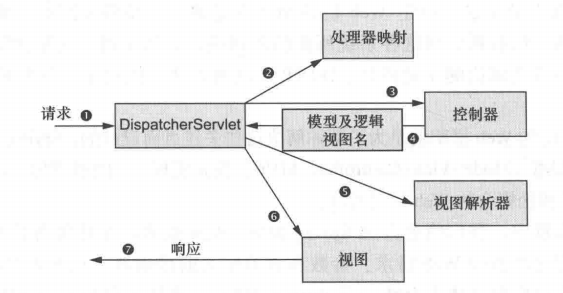
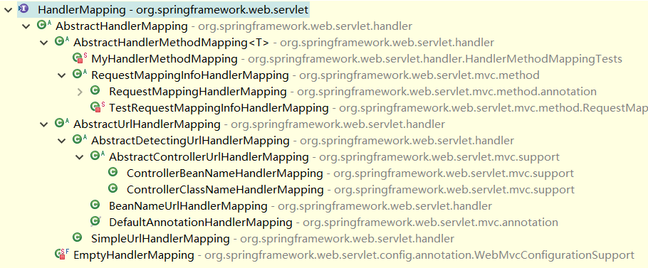

# 面试错题集合

## 1 Java

### 1.1 基础

​	1.【不合格】说说 JDK 和 JRE 分别是什么？还有它们的区别？

答：JDK 是 java 开发工具包；JRE 是 java 运行时环境。

区别：

- JRE 包含了 java 虚拟机，java 基础类库；
- JDK 包含 JRE，同时还包含了编译 java 源码的编译器 javac，还包含了很多 java 程序调试和分析的工具：jconsole，jvisualvm 等工具软件，还包含了 java 程序编写所需的文档和 demo 例子程序。


​	2.【不合格】equals 底层怎么实现的？你自定义一个类如何去重写 equals ？

答：底层实现如下（Object 类中）：

````java
public boolean equals(Object obj) {
    return (this == obj);
}
````

拿 HashMap 来举例，HashMap 的 equals 方法实现如下（先比较入参对象是否等于当前对象 this，再判断对象 instanceof 当前类后，比较内部属性，一样返回 true，不一样则返回 false）：

````java
public final boolean equals(Object o) {
    if (o == this)
        return true;
    if (o instanceof Map.Entry) {
        Map.Entry<?,?> e = (Map.Entry<?,?>)o;
        if (Objects.equals(key, e.getKey()) &&
            Objects.equals(value, e.getValue()))
            return true;
    }
    return false;
}
````


​	3.【不合格】说一下 final 关键字的作用。

答：①被 final 修饰的类，表明该类是无法继承的；

​		②被 final 修饰的方法，表明该方法是无法覆写的；

​		③被 final 修饰的变量，说明该变量在声明的时候，必须初始化完成，而且以后也不能修改其内存地址。


​	4.【盲区】static 是线程安全的吗？

答：①当 static 修饰类变量时，线程不安全；

​		②当 static 修饰方法时，static 方法内部的变量在执行时，线程安全（方法执行时，数据运行在栈里面，栈的数据每个线程都是隔离开的，所以不会有线程安全的问题）；

​		③当 static 修饰代码块时，线程安全。


​	5.【盲区】枚举是线程安全的吗？如果是，那是如何保证线程安全的？

答：枚举是线程安全的。

简单一个枚举类：

````java
public enum t {
    SPRING,SUMMER,AUTUMN,WINTER;
}
````

枚举类生成的字节码文件反编译后：

````java
public final class T extends Enum {
    private T(String s, int i)  {
        super(s, i);
    }
    public static T[] values() {
        T at[];
        int i;
        T at1[];
        System.arraycopy(at = ENUM$VALUES, 0, at1 = new T[i = at.length], 0, i);
        return at1;
    }
 
    public static T valueOf(String s) {
        return (T)Enum.valueOf(demo/T, s);
    }
 
    public static final T SPRING;
    public static final T SUMMER;
    public static final T AUTUMN;
    public static final T WINTER;
    private static final T ENUM$VALUES[];
    static {
        SPRING = new T("SPRING", 0);
        SUMMER = new T("SUMMER", 1);
        AUTUMN = new T("AUTUMN", 2);
        WINTER = new T("WINTER", 3);
        ENUM$VALUES = (new T[] {
            SPRING, SUMMER, AUTUMN, WINTER
        });
    }
}
````

枚举类编译后的类是继承了 Enum 类，且被 final 修饰，不可被继承，属性和其创建类的方式都是 static 修饰的，当一个 Java 类第一次被真正使用到的时候静态资源被初始化、Java类的加载和初始化过程都是线程安全的，所以创建一个 enum 类型是线程安全的。


### 1.2 集合

​	1.【记错】HashMap 的键和值能不能为 null？

答：都能。


​	2.【盲区】HashMap 从红黑树退化为链表的临界值为什么是6，而不是7？

答：抖动问题，可能会频繁转换，因为转换会消耗资源，导致性能下降。


​	3.【盲区】哪些集合类是线程安全的？

答：Collections.synchronized* 开头的类、HashTable、Vector 、CopyOnwriteArrayList 和 ConcurrentHashMap 等等。


​	4.【盲区】从设计层面说一下迭代器的设计原理。

答：使用了迭代器模式的设计模式，提供一种方法访问一个容器（container）对象中各个元素，而又不需暴露该对象的内部细节。


​	5.【记错】Iterator 和 ListIterator 有什么区别？

答：区别：

- Iterator\<E> 和 ListIterator\<E> 都是接口，只是ListIterator继承Iterator接口；
- Iterator 可用来遍历 Set 和 List 集合，但是 ListIterator 只能用来遍历 List；
- Iterator 对集合只能是前向遍历， ListIterator 既可以前向也可以后向；
- Iterator 只有 `hasNext()` 、`Next()` 和 `remove()` 方法，而 ListIterator 有更多针对 list 集合的方法。


​	6.【盲区】HashMap 扩容倍数为什么是2倍？

答：

### 1.3 多线程

​	1.【不合格】线程和进程的区别？CPU 调度和分派主要关注哪一个？

答：区别：

- 线程在进程内运行，一个进程可以包含多个线程
- 不同进程间数据很难共享，但是同一进程下不同线程间数据很易共享
- 进程比线程消耗更多的计算机资源
- 进程间不会相互影响，一个线程挂掉将导致整个进程挂掉
- 进程可以拓展到多机，线程最多适合多核
- 进程使用的内存地址可以上锁，即一个线程使用某些共享内存时，其他线程必须等它结束，才能使用这一块内存
- 进程使用的内存地址可以限定使用量

线程是被 CPU 调度和分派的基本单位。


​	2.【不合格】解释一下多线程的概念。

答：多线程是实现多任务的一种方式。


​	3.【记错】并行和并发有什么区别？

答：并行是多个线程同时被多个 CPU 执行，并发是多个线程被一个 CPU 轮流切换着执行。


​	4.【盲区】解释一下守护线程的概念。常见的守护线程有哪些？举几个例子。

答：守护线程是指为其他线程服务的线程。在JVM中，所有非守护线程都执行完毕后，无论有没有守护线程，虚拟机都会自动退出。

常见的守护线程有垃圾回收线程（GC）和 Docker 的 Daemon 线程。


​	5.【不合格】说一下创建线程有哪几种方式？

答：三种创建线程的方式：

- 继承 Thread 类本身

- 实现 Runnable 接口

- 通过 Callable 和 Future 创建线程


​	6.【盲区】说一下有哪几类线程池？分别用在什么场景？

答：有四种线程池：

①newCachedThreadPool：创建一个可缓存线程池，如果线程池长度超过处理需要，可灵活回收空闲线程，若无可回收，则新建线程（线程池为无限大，当执行第二个任务时第一个任务已经完成，会复用执行第一个任务的线程，而不用每次新建线程）；

②newFixedThreadPool：创建一个定长线程池，可控制线程最大并发数，超出的线程会在队列中等待（定长线程池的大小最好根据系统资源进行设置。如 `Runtime.getRuntime().availableProcessors()`）；

③newScheduledThreadPool：创建一个定长线程池，支持定时及周期性任务执行；

④newSingleThreadExecutor：创建一个单线程的线程池，它只会用唯一的工作线程来执行任务，保证所有任务按照指定顺序(FIFO, LIFO, 优先级)执行。


​	7.【盲区】为什么阿里巴巴手册禁止线程池使用 Excutor 的默认实现？

答：建议通过 ThreadPoolExecutor 的方式创建线程池，禁止原因如下：

- newFixedThreadPool 和 newSingleThreadExecutor:

允许的请求队列长度为 Integer.MAX_VALUE，可能会堆积大量的请求，从而导致 OOM。 

- newCachedThreadPool 和 newScheduledThreadPool:

允许的创建线程数量为 Integer.MAX_VALUE，可能会创建大量的线程，从而导致 OOM。


​	8.【盲区】线程池有哪几种状态？说一下分别表示什么含义。

答：RUNNING、SHUTDOWN、STOP、TIDYING 和 TERMINATED。

含义：

- RUNNING（-536870912）：接受新任务或者处理队列里的任务
- SHUTDOWN（0）：不接受新任务，但仍在处理已经在队列里面的任务
- STOP（-536870912）：不接受新任务，也不处理队列中的任务，对正在执行的任务进行中断
- TIDYING（1073741824）： 所以任务都被中断，workerCount 是 0，整理状态
- TERMINATED（1610612736）： `terminated()` 已经完成的时候


​	9.【盲区】说一下线程池的7个参数及其作用是什么？

答：线程池的7个参数及其作用：

- corePoolSize：核心线程数

- maximumPoolSize：最大线程数

- keepAliveTime：线程空闲的最大时间

- unit：时间单位

- workQueue：等待线程存放的队列

    > queue 有多种队列可供选择，比如：1：SynchronousQueue，为了避免任务被拒绝，要求线程池的 maxSize 无界，缺点是当任务提交的速度超过消费的速度时，可能出现无限制的线程增长；2：LinkedBlockingQueue，无界队列，未消费的任务可以在队列中等待；3：ArrayBlockingQueue，有界队列，可以防止资源被耗尽

- threadFactory：创建新线程时要使用的工厂

    > 线程新建的 ThreadFactory 可以自定义，也可以使用默认的 DefaultThreadFactory，DefaultThreadFactory 创建线程时，优先级会被限制成 NORM_PRIORITY，默认会被设置成非守护线程

- handler：在 Executor 已经关闭或对最大线程和最大队列都使用饱和时的拒绝策略

    > 可以使用 RejectedExecutionHandler 类进行异常捕捉，有如下四种处理策略：①ThreadPoolExecutor.AbortPolicy：抛出 RejectedExecutionException 异常；
    >
    > ②ThreadPoolExecutor.DiscardPolicy：啥也不干；
    >
    > ③ThreadPoolExecutor.CallerRunsPolicy：直接在调用 execute() 方法的调用线程种执行被拒绝的任务（若线程池关闭，则该任务被丢弃）；
    >
    > ④ThreadPoolExecutor.DiscardOldestPolicy：删除队列中第一个任务（即时间最久的未处理的任务），然后重新尝试执行 execute() 方法（若线程池关闭，则该任务被丢弃）。


​	10.【盲区】线程池一般根据什么样的规则来设置是最佳的？

答：最佳线程数目 = （线程等待时间与线程占用 CPU 时间之比 + 1）\* CPU数目


​	11.【盲区】怎么防止线程死锁？

答：保证加锁的顺序性；超时释放锁并尝试重新获取锁。


​	12.【盲区】ThreadLocal 了解吗？都用在什么场景？

答：ThreadLocal 提供了一种方式，让在多线程环境下，每个线程都可以拥有自己独特的数据，并且可以在整个线程执行过程中，从上而下的传递。

适用场景：变量在线程间隔离，而在方法或类间共享的场景。


​	13.【盲区】悲观锁对多线程的竞争性有什么影响？

答：悲观锁竞争激烈的情况下会升级，即锁粗化，顺序是：偏向锁 → 轻量级锁 → 重量级锁。


​	14.【盲区】说一下线程逐渐增大到超过队列最大值的情况下，线程池内部的处理流程。

答：见下图。


①如果线程池的状态是RUNNING，线程池的大小小于配置的核心线程数，则启动新的线程执行这个任务；否则放入提前声明的等待队列中；

②如果线程池的状态是RUNNING ，线程池的大小小于配置的最大线程数，并且任务队列已经满了，说明现有线程已经不能支持当前的任务了，并且线程池还有继续扩充的空间，就可以创建一个新的线程来处理提交的任务；

③如果线程池的状态是RUNNING ，线程池的大小等于配置的最大线程数，并且任务队列已经满了，则执行拒绝策略，任务拒绝入队；

④当线程池已经关闭或者上面的条件都不能满足时，则进行拒绝策略，拒绝策略在 RejectedExecutionHandler 接口中定义，可以有多种不同的实现。


​	15.【盲区】如何停止线程池？

答：`ExecutorService` 接口中有两种停止的方法：

- `void shutdown();` 有序的停止线程池，继续执行已提交的任务，但不再接受新的任务；
- `List<Runnable> shutdownNow();` 立即停止线程池，立即停止所有正在执行的任务，暂停所有等待执行的任务，并返回等待执行的任务列表。


​	16.【不合格】说一下 Synchronized 和 Lock 的区别。

答：区别：

- Synchronized 是 Java 关键字，Lock 是一个接口；
- Synchronized 只能修饰方法和代码块，而 Lock 只能在方法内部使用；
- 

> Synchronized 在 JDK 1.6 之后进行了优化，性能得到了很大的提升。


​	17.【不合格】说一下线程的状态有哪些？它们之间是怎么转换的？

答：如下图：


- NEW 表示线程创建成功，但没有运行，在 new Thread 之后，没有 start 之前，线程的状态都是 NEW；
- 当我们运行 strat 方法，子线程被创建成功之后，子线程的状态变成 RUNNABLE，RUNNABLE 表示线程正在运行中；
- 子线程运行完成、被打断、被中止，状态都会从 RUNNABLE 变成 TERMINATED，TERMINATED 表示线程已经运行结束了；
- 如果线程正好在等待获得 monitor lock 锁，比如在等待进入 synchronized 修饰的代码块或方法时，会从 RUNNABLE 变成 BLOCKED，BLOCKED 表示阻塞的意思；
- WAITING 和 TIMED_WAITING 类似，都表示在遇到 Object#wait、Thread#join、LockSupport#park 这些方法时，线程就会等待另一个线程执行完特定的动作之后，才能结束等待，只不过 TIMED_WAITING 是带有等待时间的（可以看下面的 join 方法的 demo）。


​	18.【不合格】多线程情况下，线程同步的方式有哪些?

答：有以下几种（未完待续）：

- synchronized
- 可重入锁 ReentrantLock
- wait() 和 notify()
- ThreadLocal 局部变量
- volatile
- 原子变量如 AtomicInteger
- 阻塞队列
- CountDownLatch、Semaphore 和 CyclicBarrier


​	19.【盲区】什么情况下线程会发生死锁？

答：死锁的四个条件：

- 互斥条件：线程(进程)对于所分配到的资源具有排它性，即一个资源只能被一个线程(进程)占用，直到被该线程(进程)释放；
- 请求与保持条件：一个线程(进程)因请求被占用资源而发生阻塞时，对已获得的资源保持不放；
- 不剥夺条件：线程(进程)已获得的资源在末使用完之前不能被其他线程强行剥夺，只有自己使用完毕后才释放资源；
- 循环等待条件：当发生死锁时，所等待的线程(进程)必定会形成一个环路（类似于死循环），造成永久阻塞。

### 1.4 并发

​	1.【盲区】你知道 ConcurrentHashMap 的最大并发数是多少吗？

答：2的30次方个。


​	2.【不合格】说一下 Synchronized 和 Lock 的区别。

答：Synchronized 和 Lock 的区别：

- 性能不一样：资源竞争激励的情况下，lock 性能比 synchronized 好，竞争不激励的情况下，synchronized 比 lock 性能好，synchronize 会根据锁的竞争情况，从偏向锁-->轻量级锁-->重量级锁升级；
- 锁机制不一样：synchronize 是在 JVM 层面实现的，系统会监控锁的释放与否。lock 是由 JDK 实现，需要手动释放，在finally块中释放，可以采用非阻塞的方式获取锁；
- Synchronized 的代码更简洁，lock的功能更多更灵活，缺点是必须在 finally 里面 unlock() 释放锁；
- 用法不一样：synchronized 可以用在代码块上，方法上。lock 只能写在代码里，不能直接修改方法。


​	3.【不合格】什么是 CAS ？什么是自旋？

答：CAS（Compare and swap），即比较并交换；

自旋，不断循环重试尝试特定操作。


​	4.【不合格】用 CAS 的好处在哪里？

答：


### 1.5 I/O

​	1.【不合格】分别说一下 BIO、NIO 和 AIO 以及他们的区别。

答：BIO：全称 Blocking IO，是 JDK1.4 之前的传统 IO 模型，本身是同步阻塞模式。 线程发起 IO 请求后，一直阻塞 IO，直到缓冲区数据就绪后，再进入下一步操作。针对网络通信都是一请求一应答的方式，虽然简化了上层的应用开发，但在性能和可靠性方面存在着巨大瓶颈，在高并发的场景下，机器资源很快就会被耗尽。

NIO：NIO 也叫 Non-Blocking IO，是同步非阻塞的 IO 模型。线程发起 IO 请求后，立即返回（非阻塞 IO）。同步指的是必须等待 IO 缓冲区内的数据就绪，而非阻塞指的是，用户线程不原地等待 IO 缓冲区，可以先做一些其他操作，但是要定时轮询检查 IO 缓冲区数据是否就绪。Java中的 NIO 是 new IO 的意思。其实是 NIO 加上 IO 多路复用技术。普通的 NIO 是线程轮询查看一个 IO 缓冲区是否就绪，而 Java 中的 new IO 指的是线程轮询地去查看一堆 IO 缓冲区中哪些就绪，这是一种 IO 多路复用的思想。IO 多路复用模型中，将检查 IO 数据是否就绪的任务，交给系统级别的 select 或 epoll 模型，由系统进行监控，减轻用户线程负担。

> NIO 主要有 buffer、channel、selector 三种技术的整合，通过零拷贝的 buffer 获取数据，每一个客户端通过channel 在 selector（多路复用器）上进行注册。服务端不断轮询 channel 来获取客户端的信息。channel 上有 connect、accept（阻塞）、read（可读）、write（可写）四种状态标识。根据标识来进行后续操作。所以一个服务端可接收无限多的 channel，不需要新开一个线程，大大提升了性能。

AIO 是真正意义上的异步非阻塞 IO 模型。 上述 NIO 实现中，需要用户线程定时轮询，去检查 IO 缓冲区数据是否就绪，占用应用程序线程资源，其实轮询相当于还是阻塞的，并非真正解放当前线程，因为它还是需要去查询哪些 IO 就绪。而真正的理想的异步非阻塞 IO 应该让内核系统完成，用户线程只需要告诉内核，当缓冲区就绪后，通知我或者执行我交给你的回调函数。

> AIO 可以做到真正的异步的操作，但实现起来比较复杂，支持纯异步 IO 的操作系统非常少，目前也就 windows 是 IOCP 技术实现了，而在 Linux 上，底层还是是使用的 epoll 实现的。

### 1.6 JVM

​	1.【盲区】JVM 是如何运行的？

答：JVM 运行分为三个步骤：加载 → 连接 → 初始化。

其中连接步骤分为三个阶段：验证 → 准备 → 解析。

总的就是：加载 → 验证 → 准备 → 解析 → 初始化。


​	2.【盲区】将 CMS 回收器切换为 G1 的 JVM 参数是什么？

答：`-XX:+UseG1GC`


​	3.【不合格】CMS 和 G1 有什么区别？哪一个好？为什么？知道 CMS 的全称吗？

答：区别：

- G1 支持支持类卸载，CMS 不支持
- G1 不会产生内存碎片，垃圾收集完成后能提供规整的可用内存，CMS 会产生内存碎片，收集结束时产生大量空间碎片，导致触发 Full GC，所以 G1 垃圾收集效果更好
- G1 资源占用高，性能相对更好，CMS 资源占用低，性能稍微弱点

> 官方建议：内存分配超过 6G 的情况下，G1 好；内存分配在 6G 以内，CMS 好。

CMS（全称 Concurrent Mark Sweep）并发标记收集器。


​	4.【记错】方法区在 jdk 不同版本的实现方式有什么不一样？

答：JDK6 中放弃了永久代，逐步改为本地内存（Native Memory）实现方法区；

JDK7 移除永久代中的字符串常量池和静态变量；

JDK8 完全放弃永久代，本地内存中实现元空间（Metaspace）来代替。


​	5.【遗忘】类的静态全局变量和非静态全局变量，分别存在 JVM 哪个结构里？

答：类的静态全局变量存储在方法区；类的非静态全局变量存储在堆。

> ①方法体中的引用变量和基本类型的变量都在栈上，其他都在堆上；
>
> ②对于局部变量，如果是基本类型，会把值直接存储在栈；如果是引用类型，比如 `String s = new String("william");` 会把其对象存储在堆，而把这个对象的引用（指针）存储在栈。


​	6.【不合格】Java 虚拟机栈中的栈帧的作用是什么？

答：每个方法被调用至执行完毕的过程，对应一个栈帧在虚拟机中从入栈到出栈的过程。用于存储数据：局部变量表、操作数栈、动态连接和方法出口。


​	7.【模糊】年轻代回收（Minor GC/Young GC）和老年代（Major GC/Old GC）的默认回收算法是什么？

答：年轻代默认使用标记复制算法；老年代默认使用标记整理算法。


​	8.【记错】数组在内存中是怎么分配的？

答：实例存在堆区，引用存在 Java 虚拟机栈中。


​	9.【盲区】JDK8 默认的垃圾收集器是什么？如何用命令查看？

答：`-XX:+PrintCommandLineFlags` 可打印出 JDK8 默认的垃圾收集器。

JDK 7和8 的默认垃圾收集器都是 Parallel Scavenge（新生代）+Parallel Old（老年代）。

JDK 9 的默认垃圾收集器是 G1。


​	10.【盲区】哪些情况下会发生 OOM？

答：递归使用不当，如递归退出条件不完整也会产生 OOM（未完待续）


​	11.【盲区】针对 CMS 垃圾收集器，有哪些 JVM 相关的优化参数？

答：JVM 相关的调优参数如下表：

| 参数                                              | 描述                                                         |
| ------------------------------------------------- | ------------------------------------------------------------ |
| -XX：+UseConcMarkSweepGC                          | 激活 CMS 收集器（默认 HotSpot JVM 使用的是 Parallel收集器）。 |
| -XX：UseParNewGC                                  | 激活年轻代使用多线程并行执行垃圾回收。                       |
| -XX：+CMSConcurrentMTEnabled                      | 并发的 CMS 阶段将以多线程并行执行(多个 GC 线程会与用户线程并行工作，默认开启)。 |
| -XX：ConcGCThreads=n                              | 定义并发 CMS 周期的所有阶段运行时的线程数均为 n。            |
| -XX:CMSInitiatingOccupancyFraction=n              | 第一次 CMS 垃圾收集会在老年代占用率达到 n% 后触发（默认值为68）。 |
| -XX：+UseCMSInitiatingOccupancyOnly               | 命令 JVM 不基于运行时收集的数据来启动 CMS 垃圾收集周期，JVM 通过 CMSInitiatingOccupancyFraction 的值进行每一次的 CMS 收集，而不仅仅是第一次。 |
| -XX:+CMSClassUnloadingEnabled                     | 开启对永久代进行垃圾回收。                                   |
| -XX:+CMSIncrementalMode                           | 开启CMS收集器的增量模式（当正常 CMS 周期对应用程序线程干扰太大时，才应该使用增量模式）。 |
| -XX:+ExplicitGCInvokesConcurrent                  | JVM 无论何时调用系统 GC，都执行 CMS GC，而不是 Full GC（防止出现”stop-the-world”的系统GC）。 |
| -XX:+ExplicitGCInvokesConcurrentAndUnloadsClasses | 当有系统 GC 调用时，永久代也被包括进 CMS 垃圾回收的范围内（防止出现”stop-the-world”的系统GC）。 |
| -XX:+DisableExplicitGC                            | JVM 将完全忽略系统的 GC 调用(不管使用的收集器是什么类型)     |


​	12.【遗忘】可达性分析算法中，可以作为 GC Roots 的对象有哪些?

答：Java 技术体系中，固定可作为 GC Roots 的对象：

- Java 虚拟机栈中引用的对象（栈帧中的局部变量表），如线程被调用的方法堆栈中使用到的参数、局部变量、临时变量等
- 方法区中类静态属性引用的对象，如 Java 类的引用类型静态变量
- 方法区中常量引用的对象，如字符串常量池（String Table）的引用
- 本地方法栈中 JNI 引用的对象
- Java 虚拟机内部的引用，如基本类型的包装类对象，常驻的异常对象（如 NullPointException、OutOfMemory Error），系统类加载器
- 所有被同步锁（synchronized关键字）持有的对象
- 反应 Java 虚拟机内部情况的JMXBean、JVMTI中注册的回调、本地代码缓存
- 其他临时性的对象，如关联区域的对象


13. 【盲区】Eden 区、S0 和 S1 的默认配置比例是什么？

答：Eden 区：S0：S1 = 8：1：1。


14. 【盲区】触发 Full GC 的条件有哪些？

答：

- 调用 `System.gc()`（只是通知 JVM 进行 Full GC，但不保证一定发生）
- 每次晋升到老年代的对象平均大小>老年代剩余空间
- Minor GC 后存活的对象超过了老年代剩余空间
- 永久代空间不足
- CMS 的 GC 过程发生 Concurrent mode failure 时
- G1 进行垃圾回收时，收集速度小于内存分配速度时
- 堆内存分配过大的对象

## 2 框架

### 2.1 Spring

​	1.【盲区】Spring 有哪几种通知类型（advice）？

答：五类通知类型（advice）：

- 前置通知（Before advice）：在连接点前面执行，前置通知不会影响连接点的执行，除非此处抛出异常；（通过 `@Before` 注解来使用）
- 正常返回通知（After returning advice）：在连接点正常执行完成后执行，若连接点抛出异常，则不会执行；（通过 `@AfterReturning` 注解来使用）
- 异常返回通知（After throwing advice）：在连接点抛出异常后执行；（通过 `@AfterThrowing` 注解来使用）
- 返回通知（After (finally) advice）：在连接点执行完成后执行，不管是正常执行完成，还是抛出异常，都会执行返回通知中的内容；（通过 `@After` 注解来使用）
- 环绕通知（Around advice）：环绕通知围绕在连接点前后，比如一个方法调用的前后。这是最强大的通知类型，能在方法调用前后自定义一些操作。环绕通知还需要负责决定是继续处理 join point (调用ProceedingJoinPoint 的 proceed 方法)还是中断执行。（通过 `@Around` 注解来使用）


​	2.【不合格】Spring 的原理说一下。

答：从 IOC 和 AOP 来分析：

IOC（控制反转）：是一种编程范式，可以在一定程度上解决复杂系统对象耦合度太高的问题。IOC 最常见的方式是 DI（依赖注入），可以通过一个容器，将 Bean 维护起来，方便在其他地方直接使用，而不是重新 new；

AOP（面向切面编程）：让编程人员在不修改对象代码的情况下，为这个对象添加额外的功能或者限制。运用了代理模式来实现，适用场景如日志打印、权限控制和事务处理。


​	3.【盲区】Spring 的 @Autowired 是如何工作的？

答：@Autowired 注解的作用是由 AutowiredAnnotationBeanPostProcessor 实现的，查看该类的源码会发现它实现了 MergedBeanDefinitionPostProcessor 接口，进而实现了接口中的postProcessMergedBeanDefinition 方法，@Autowired 注解正是通过这个方法实现注入类型的预解析，将需要依赖注入的属性信息封装到 InjectionMetadata 类中，InjectionMetadata 类中包含了哪些需要注入的元素及元素要注入到哪个目标类中。


​	4.【不合格】说一下 Spring 的几大核心组件。

答：Spring 核心组件有三个 Bean、Context 和 Core（未完待续）：


​	5.【不合格】说一下 IOC 和 AOP 的区别和它们的实现原理。

答：区别：IOC 是将对象的控制权交给 Spring 管理，AOP 面向切面编程。

实现原理：

- IOC 是基于依赖注入（DI），有三种注入方式：①构造器注入；②setter 注入；③接口注入。
- AOP 的实现原理是基于代理模式，有两种代理方式：①代理对象实现了接口时，使用 JDK 反射机制实现；②代理对象未实现接口时，使用 Cglib 生成对象子类字节码的方式实现。


​	6.【盲区】Spring 的单例 bean 是线程安全的吗？

答：


​	7.【盲区】Spring 中 bean 的五种作用域有哪些？

答：bean 的五种作用域：

- singleton：单例 bean 实例
- prototype：每次请求会创建一个新的 bean 实例
- request：每次 HTTP 请求会创建一个新的 bean， 该 bean 仅在当前 HTTP request 内有效
- session：每次 HTTP 请求会创建一个新的 bean， 该 bean 仅在当前 HTTP session 内有效
- global-session：全局 session 作用域（Spring5 已弃用）


​	8.【不合格】注解 `@Service` 和 `@Componet` 的区别？

答：区别：

- `@Service` 用于标注业务层组件，`@Component` 泛指组件，当组件不好归类的时候，我们可以使用这个注解进行标注。
- `@Service` 的内部实现引用了 `@component` 注解，即 `@component` 实现的功能 `@Service` 都能实现


​	9.【不合格】Spring 中运用了哪些设计模式？

答：用到了如下几种设计模式：

- 工厂模式：通过 BeanFactory、ApplicationContext 创建 Bean
- 代理模式：AOP 的实现
- 单例模式：Bean 的默认实现（Singleton）
- 模板方法模式：JDBCTemplate、HibernateTemplate等对数据操作的模板类
- 装饰模式：连接数据库时根据不同的需求动态切换不同的数据源
- 观察者模式：Spring 事件驱动模型
- 适配器模式：AOP的增强或通知（Advice）


### 2.2 SpringMVC

​	1.【不合格】SpringMVC 的注解有哪些？

答：常见的基础注解如下表：

| 注解              | 描述                                                         |
| ----------------- | ------------------------------------------------------------ |
| @RestController   | @Controller 和 @ResponseBody 的组合注解                      |
| @ResponseBody     | 将 controller 返回的对象转换为指定格式（常为 json 或 xml）后，写入到响应的 body 数据中，而不是返回页面 |
| @RequestMapping   | 将 Web 请求映射到请求处理类中，类上使用表示将所有请求以该地址作为父路径 |
| @PathVariable     | 将URI 上的模板变量映射为方法参数（常用在 GET 请求方法上）    |
| @RequestParam     | 在 controller 层方法上获取参数                               |
| @RequestBody      | 将 Content-Type 为 application/json, application/xml 等参数的请求 body 中的数据转换为对象（常用在 POST、PUT 和 DELETE 等请求方法上） |
| @CrossOrigin      | 允许在指定 controller 或指定方法上的请求进行跨域请求         |
| @ControllerAdvice | 全局异常处理                                                 |
| @GetMapping       | 请求方法类型为 GET 的 @RequestMapping                        |
| @PostMapping      | 请求方法类型为 POST 的 @RequestMapping                       |
| @PutMapping       | 请求方法类型为 PUT 的 @RequestMapping                        |
| @DeleteMapping    | 请求方法类型为 DELETE 的 @RequestMapping                     |
| @PatchMapping     | 请求方法类型为 PATCH 的 @RequestMapping                      |


​	2.【遗忘】简单描述一下一个请求经过 SpringMVC 到返回一个响应的流程。

答：流程图如下：



①用户请求先通过前端控制器 DispatcherServlet；

②DispatcherServlet 查询一个或多个处理器映射（Handler mapping），处理器映射根据 URL 信息选择对应的控制器信息返回给 DispatcherServlet；

③DispatcherServlet 将请求发给选中的控制器，控制器拿到请求数据，交给 Service 层去执行业务逻辑；

④控制器将处理完返回的模型和逻辑视图名发送到 DispatcherServlet；

⑤DispatcherServlet 使用视图解析器（View resolver）将逻辑视图名匹配对应的视图实现；

⑥渲染视图；

⑦返回响应到用户。


​	3.【盲区】说一下 SpringMVC 的 RequestMapping 的原理。

答：原理：

在 SpringMVC 框架初始化完成时，上下文环境中已定义的所有 HandlerMapping 都已经被加载，这些加载的 handlerMappings 被放在一个 List 中并被排序，存储着 HTTP请求对应的映射数据。

这些 List 中的每一个元素都对应着一个具体 handlerMapping 的配置，，一般每一个 handlerMapping 可以持有一系列从 URL请求到 Controller 的映射，SpringMVC 提供了一系列的 HandlerMapping 实现，如下图。




​	4.【盲区】SpringMVC 默认返回数据类型是什么？我想要返回其他数据类型要怎么处理？它返回响应数据时底层是如何处理的？

答：SpringMVC 默认返回数据类型是 XML。

返回其他数据类型，可以通过设置 `@RequestMapping` 上的  `produces` 属性的值为 `application/json`。

底层实现：（未完待续）


### 2.3 SpringBoot

​	1.【盲区】说一下 SpringBoot 自动装配原理。

答：


​	2.【不合格】说一下 SpringBoot 相比传统的 Spring、SpringMVC 有哪些优势？

答：


### 2.4 Mybatis

​	1.【不合格】用 Mybatis 如何实现批量更新？

答：


​	2.【遗忘】Mybatis 如何实现类似 if else 的需求？

答：xml 代码如下：（choose 是一个整体，when 对应 if，otherwise 对应 else）

````xml
<choose>
    <when test="">
        //...
    </when>
    <otherwise>
        //...
    </otherwise>
</choose>
````


​	3.【盲区】Mybatis 如何将 xml 解析成一个完整的 DAO 对象去被使用的？

答：底层原理：

①Mybatis 初始化时会调用 SqlSessionFactoryBuilder 的 build() 方法，加载并解析 mybatis-config.xml 配置文件、映射配置文件以及相关的注解信息；

②其中，mybatis-config.xml 配置文件中的每个节点都被封装成了一个个相应的解析方法，BaseBuilder 的一个子类 XMLConfigBuilder 通过调用 parseConfiguration() 方法依次调用这些解析方法来解析 mybatis-config.xml 配置文件；

③XMLConfigBuilder 的 mapperElement(XNode parent) 方法就是用来解析 `<mapper>` 标签的，方法内部根据指定的配置解析成对应的对象。


### 2.5 OAuth2

​	1.【盲区】OAuth2 如何实现权限控制的？

答：


​	2.【盲区】说一下 OAuth2 有哪几种授权模式？分别适用于什么场景？

答：四种授权模式及其适用场景如下表（未完待续）：

| 授权模式                                        | 适用场景 |
| ----------------------------------------------- | -------- |
| 授权码模式（authorization code）                |          |
| 简化模式（implicit）                            |          |
| 密码模式（resource owner password credentials） |          |
| 客户凭证模式（client credentials）              |          |


​	3.【盲区】OAuth2 和 JWT 的区别？

答：


### 2.6 Netty

​	1.【不合格】为什么 Netty 要提供这四种编解码器？

答：


​	2.【不合格】Netty 如何处理半包、粘包和拆包？

答：


​	3.【盲区】Netty 是如何解决多线程之间通信问题的？

答：


​	4.【盲区】Netty 里如何监听一个线程执行完成的?

答：


​	5.【盲区】说一下 Netty 的多路复用 IO 模型。

答：


​	6.【盲区】说一下 select poll 和 epoll 的区别及其实现原理。

答：


​	7.【盲区】Netty 是怎么实现零拷贝的？

答：


### 2.7 Redis

​	1.【记错】Redis 基本数据类型有哪些？分别适用于什么场景？

答：基本数据类型有5种：

- string，适用于key-value形式的场景，如用户token信息等
- hash，适用于带属性的对象信息，如热点订单
- list，适用于粉丝列表、文章评论，如微博下拉加载
- set，适用场景：交集（sinter x y），如共同好友；差集（sdiff x y），如可能认识的好友
- sorted set，适用于各类排行榜

高级数据类型有4种：

- bitmap：
- hyperloglog：
- GEO：
- stream：


​	2.【不合格】都说 Redis 快，Redis 为什么这么快？

答：


​	3.【不合格】怎样把数据一张表一次性加载到 redis 内存里？

答：加载方式：两种方式，一种是 Redis 提供的管道（Pipeline）方式 `--pipe`，还有一种是 Lua 脚本方式。

数据存放方式：适合存储行的数据结构有两种：string 和 hash。以 string 类型存储的话需要把数据库每行都转换为 json，比较节省内存；以 hash 存储的话对里面的部分字段进行操作会比较方便。


​	4.【盲区】说一下缓存雪崩、缓存穿透和缓存击穿的含义和对应的解决方案。

答：详见 `面试专题\缓存中间件\Redis总结.md` 的 `7 常见的Redis场景问题` 章节。


​	5.【盲区】如果让你来写一个 Redis 哨兵集群的选举算法，你会怎么实现？说一下你的思路。

答：


​	6.【记错】说一下 RDB 和 AOF 的区别。

答：区别：

|    区别     |                 RDB                  |              AOF               |
| :---------: | :----------------------------------: | :----------------------------: |
|  文件备份   |             多个数据文件             |            单个文件            |
|  备份方式   | 周期性持久化（5min），即内存数据快照 | 以日志形式记录每一次的操作命令 |
|  文件大小   |              占用空间小              |           占用空间大           |
| 对Redis影响 |                非常小                |     会降低Redis写数据的QPS     |
|  恢复速度   |                  快                  |               慢               |
| 恢复完整性  |         丢失数据较多（5min）         |       丢失数据极少（1s）       |
|  适用场景   |                 冷备                 |            紧急容灾            |


​	7.【不合格】为什么要同时开启 RDB 和 AOF？只开其中一个不行吗？

答：原因：

- 只开 RDB：会丢失较多数据，因为 RDB 持久化间隔时间较长
- 只开 AOF：做冷备恢复速度较慢，恢复时有较低概率出现 bug

同时开启两种持久化方式时，用 AOF 来保证数据不丢失，作为数据恢复的第一选择; 用 RDB 来做不同程度的冷备，在 AOF 文件都丢失或损坏不可用的时候，还可以使用 RDB 来进行快速的数据恢复。


​	8.【遗忘】你用的 Redis Java 客户端是哪个？

答：主流的有 Redisson、Jedis、lettuce，其中官方推荐使用 Redisson。


​	9.【遗忘】如果我要用 Redis 的 zset 来保存一个10人排行榜 tops，在这个排行榜底部再增加第11人的数据，命令是怎样的？

答：`zadd tops 11 JeasonBourne`


​	10.【盲区】Redis 分布式锁怎么实现的？使用的时候有哪些需要注意的地方？

答：


### 2.8 RabbitMQ

​	1.【盲区】说一下 RabbitMQ 的4种路由方式。

答：有4种不同的交换机类型：直连交换机（Direct exchange）、扇形交换机（Fanout exchange）、主题交换机（Topic exchange）和首部交换机（Headers exchange）


​	2.【盲区】说一下 RabbitMQ 的消息确认机制。

答：


​	3.【盲区】RabbitMQ 的生产者发送消息后，消费者收到消息时报异常，这时它是怎么处理的？这条消息会被丢失吗？

答：


​	4.【盲区】描述一下 RabbitMQ 的一条消息从生产者开始到消费者消费完这期间的流程。

答：生产者流程：

①连接 RabbitMQ，生产者服务与 RabbitMQ 建立连接（Connection）；

②获取信道（Channel）；

③声明交换器（Exchange），设置相关属性（交换器类型，是否持久化等）；

④声明队列（Queue），设置相关属性（是否排他，是否持久化，是否自动删除等）；

⑤发布消息，此时 RabbitMQ 会自动根据消息中的路由键（Routing Key）和交换器属性投递至指定队列；

⑥关闭信道；

⑦关闭连接。

消费者流程：

①连接 RabbitMQ，生产者服务与 RabbitMQ 建立连接（Connection）；

②获取信道（Channel）；

③声明需要监听并消费的队列；

④消费消息；

⑤确认（ack）接收到的消息；

⑥RabbitMQ 删除被确认的消息；

⑦关闭信道；

⑧关闭连接。


​	5.【不合格】你是如何保证消息不被重复消费的？

答：


​	6.【盲区】说一下 RabbitMQ 的延迟消费队列。

答：


​	7.【盲区】说一下 RabbitMQ 的工作原理。

答：


​	8.【不合格】说一下 RabbitMQ 和 Kafka 的区别。

答:


​	9.【盲区】说一下 RabbitMQ 是如何保证它的顺序性的？

答：


### 2.9 FastDFS

​	1.【盲区】我想从一个服务去访问 storage 集群上的某几个 storage 服务的文件，那么 tracker 和 storage 要如何来配置？

答：


​	2.【盲区】说一下 FastDFS 的底层结构和原理。

答：


​	3.【盲区】 FastDFS 是如何实现负载均衡的？

答：


### 2.10 日志框架

​	1.【盲区】你觉得 slf4j 的优势在哪里？

答：


### 2.11 Swagger

​	1.【盲区】feign 里面配置了一个 controller ，我想把这个 controller 公开到 swagger 里面去，我需要在 feign 里面加标签还是 swagger 里面加配置？

答：


### 2.12 Shiro

​	1.【盲区】说一下 Shiro 的认证原理。

答：


## 3 网络

### 3.1 网络基础

​	1.【记错】描述一下当今的网络模型分类？

答：可以分为4层：应用层、传输层、网络层和网络接口层。每层对应的协议如下：

- 应用层：TELNET，SSH，HTTP，SMTP，POP，SSL/TLS，FTP，MIME，HTML，SNMP，MIB，SIP，RTP
- 传输层：TCP，UDP，UDP-Lite，SCTP，DCCP
- 网络层：ARP，IPv4，IPv6，ICMP，IPsec
- 网络接口层：以太网，无线LAN，PPP


​	2.【不合格】说一下 TCP 四次挥手过程。

答：详见 `计算机网络\TCPIP协议\TCPIP协议.md` 的 `3 流程 —— 3.2 关闭连接（四次挥手）` 章节，[点击跳转]([https://github.com/DragonV96/study-notes/blob/master/%E8%AE%A1%E7%AE%97%E6%9C%BA%E7%BD%91%E7%BB%9C/TCPIP%E5%8D%8F%E8%AE%AE/TCPIP%E5%8D%8F%E8%AE%AE.md#32-%E5%85%B3%E9%97%AD%E8%BF%9E%E6%8E%A5%E5%9B%9B%E6%AC%A1%E6%8C%A5%E6%89%8B](https://github.com/DragonV96/study-notes/blob/master/计算机网络/TCPIP协议/TCPIP协议.md#32-关闭连接四次挥手))。


​	3.【遗忘】说一下 cookie 和 session 的区别。

答：cookie数据保存在客户端，session数据保存在服务器端。


### 3.2 REST ful 接口

​	1.【盲区】REST ful 含义及规范（除了GET、PUT、POST 和 DELETE 那些）？

答：


​	2.【盲区】单接口多实现怎么解决的？

答：使用 SPI（service provider interface）机制，即**根据指定的配置**或者是**默认的配置**，去**找到对应的实现类**加载进来，然后用这个实现类的实例对象（如 JDBC 的设计思想）。


### 3.3 TCP

​	1.【盲区】说一下 TCP 底层的滑动窗口机制原理。

答：


​	2.【不合格】说一下 TCP 的三次握手流程，具体到状态码。

答：流图如下：


①第一次握手

客户端发送 `SYN=1,seq=x` 的数据包到服务器，客户端进入 SYN_SENT 状态，等待Server确认；

②第二次握手

服务器收到客户端的数据包，校验客户端的 SYN 标志位为1后，将 `ack` 的值设置为x+1，发送 `SYN=1,ACK=1 ack=x+1,seq=y` 的数据包到客户端，服务器进入 SYN_RECV 状态；

③第三次握手

客户端收到服务器的数据包，校验服务器的 SYN 标志位为1后，将 `ack` 的值设置为y+1，向服务器发送确认包 `ACK=1,ack=y+1` ，此时双方进入 ESTABLISHED 状态，连接建立成功。


### 3.4 UDP


### 3.5 HTTP

​	1.【盲区】响应状态码301和302有什么区别？

答：概念：

301（Moved Permanently）被请求的资源已永久移动到新位置，并且将来任何对此资源的引用都应该使用本响应返回的若干个URI之一。

302（Found）请求的资源现在临时从不同的URI响应请求。

区别：

①301是永久重定向，302用来做临时跳转；

②301请求是可以缓存的， 即通过看 status code，后面显示 from cache；302只有在 Cache-Control 或 Expires 中进行了指定的情况下，这个响应才是可缓存的；

③301比较常用的场景是使用域名跳转，302比较常用的是未登陆的用户访问用户中心重定向到登录页面，或访问404页面会重新定向到首页。


### 3.6 HTTPS

​	1.【盲区】说一下 Https 的底层原理。

答：


## 4 数据结构与算法

### 4.1 算法

​	1.【遗忘】快速排序的基本实现？

答：设要排序的数组是A[0]……A[N-1]，首先任意选取一个数据（通常选用数组的第一个数）作为关键数据，然后将所有比它小的数都放到它前面，所有比它大的数都放到它后面，这个过程称为一趟快速排序。


## 5 分布式

### 5.1 分布式session

​	1.【盲区】分布式session如何实现？

答：


### 5.2 分布式事务

### 5.3 分布式锁

### 5.4 其他分布式问题

​	1.【盲区】分布式系统里面，我如何去定位某个日志在哪台机器上？如果我只知道关键字呢？

答：


## 6 微服务

### 6.1 SpringCloud

​	1.【盲区】SpringCloud 的配置中心如何进行加密？

答：**①安装 JCE**

JDK下的JCR默认是有长度限制的，需要替换没有长度限制的JCE版本。

````
http://www.oracle.com/technetwork/java/javase/downloads/jce-7-download-432124.html
````

把下载包里面的两个jar文件复制替换到JAVA_HOME/jre/lib/security目录下。

​		**②添加加密 KEY**

配置中心配置文件中加入加密密钥。

````yaml
encrypt: 
  key: 0e010e17-2529-4581-b907-c8edcfd6be09
````

​		**③验证加密功能状态**

````
http://192.168.1.158:7100/encrypt/status
````

功能正常会显示 `{"status":"OK"}` 。

​		**④加解密**

对 `develop` 字符串加密：

````shell
curl http://192.168.1.158:7100/encrypt -d  develop -u config-user:99282424-5939-4b08-a40f-87b2cbc403f6
````

对 `develop `字符串解密：

````shell
curl http://192.168.1.158:7100/decrypt -d  0fb593294187a31f35dea15e8bafaf77745328dcc20d6d6dd0dfa5ae753d6836 -u config-user:99282424-5939-4b08-a40f-87b2cbc403f6
````

> `-u username:password` 为 basic 认证。

​		**⑤配置yml文件**

````yaml
spring: 
  datasource: 
    username: '{cipher}0fb593294187a31f35dea15e8bafaf77745328dcc20d6d6dd0dfa5ae753d6836'
````

需要加密的内容以 `{cipher}` 开头，并注意要使节单引号包起来，不然报错。

​		**⑥读取配置**

这样客户端读取出来的配置是自动解密了的，如果要关闭自动解密功能通过客户端自己来解密，同时也要保留加解密的端点可以通过关闭以下配置即可。

````xml
spring.cloud.config.server.encrypt.enabled=false
````

总结就是：

①下载并安装加密所需的 Oracle JCE JAR 包

②设置加密密钥

③加密和解密属性

④配置微服务使用加密的客户端


​	2.【盲区】说一下 spring cloud 的请求链路。

答：链路流程：

①请求首先经过 nginx 反向代理；

②经过 nginx 转发到网关 gateway，gateway 通过配置好的 route、predicate 和 filter 对请求进行过滤，匹配，最后路由到指定的 A 服务集群；

③请求通过 Ribbon 配置好的负载均衡策略，路由到 A 服务集群中的某个实例 A1 上；

④在 A1 上执行一系列对数据库、缓存和消息队列操作的业务逻辑后，返回指定的数据格式（一般为 json）的响应数据；

⑤响应数据原路返回。


​	3.【盲区】熔断 Hystrix 的超时时间根据什么规则去设置的？

答：根据业务要求设置。


​	4.【盲区】注册中心如何去维持心跳的？

答：注册中心 eureka 提供了一个服务续约接口（Renew），业务服务进行服务注册后会定时（默认30秒）发起PUT 类型的服务续约请求，调用 eureka 的服务续约接口，服务续约成功后当前 eureka 节点会用异步的方式同步状态到其它 `Eureka Server` 节上。

注册中心 eureka 后台有一个守护线程 evictionTimer ，它会定期（默认60秒）检测并判断一次服务是否超过90秒没有进行服务续约，超过则认为该服务失效，将其剔除。


​	5.【盲区】Spring cloud netflix 和 spring cloud alibaba 有什么区别？

答：


​	6.【盲区】网关如何实现限流的？

答：


​	7.【盲区】网关的作用是什么？网关的策略有哪些？

答：


​	8.【盲区】gateway 怎样配置去增加一个项目？

答：


​	9.【盲区】说一下 Hystrix 的熔断机制。

答：


​	10.【盲区】你们项目里网关容错性是怎么做的？

答：


​	11.【盲区】说一下负载均衡的几种策略。

答：


​	12.【盲区】Ribbon 跟 openFeign 有什么联系和区别？

答：openFeign 内置了 Ribbon（未完待续）。


​	13.【盲区】服务调用高峰期，被服务意外下线了，这时 Eureka 的延时问题怎么解决？

答：有三种方式：

①降低延迟时间

- 中小型的项目建议关闭自我保护 `eureka.server.enableSelfPreservation=false`
- 清理无效节点的时间间隔 `evictionIntervalTimerInMs=5000`
- 降低心跳间隔，默认为30 秒 `LeaseRenewalIntervalInSeconds`
- 降低无效判断时间 `leaseExpirationDurationInSeconds`（Eureka服务器在接收到实例的最后一次发出的心跳后，需要等待多久才可以将此实例删除，默认为90秒）
- 禁用 Eureka 的 ReadOnlyMap 缓存，解决 eureka 的双缓存问题
- 降低 Ribbon 缓存时间

②增加重试机制

在网关、Fegin 或者 Ribbon 上面添加请求重试机制（最好使用 Ribbon 来实现，让它重试其它节点）

③切换注册中心为 zookeeper 或者 nacos 等（若对一致性要求较高的话）


​	14.【盲区】说一下注册中心的实现原理。

答：


​	15.【盲区】服务注册到 Eureka 后，这些数据是以什么方式存储的？服务间调的时候每次都要去注册中心查询服务对应的实例数据吗？

答：


### 6.2 Dubbo

### 6.3 Zookeeper

​	1.【盲区】Zookeeper 有哪几种选举模式？

答：


## 7 数据库

### 7.1 MySQL

​	1.【记错】MySQL 中 varchar 类型的字段，长度为50，分别能存多少个中文和英文？

答：MySQL 4.0版本以下，varchar(50)表示50字节，如果存放UTF8汉字时，只能存16个（每个汉字3字节）；MySQL 5.0版本以上，varchar(50)表示50字符，无论存放的是数字、字母还是UTF8汉字（每个汉字3字节），都可以存放50个，只是实际字节长度有所区别。


​	2.【不合格】有一条 SQL 查询语句，明明建了对应查询条件的字段索引，但是它却没有走索引，可能的原因是什么？

答：


​	3.【盲区】SQL 查询语句如何强制走索引？

答：SQL 语句后接下方代码（示例为强制走主键索引，走其他索引可以将 `PRIMARY` 改为对应索引名）：

````mysql
FORCE INDEX(PRIMARY)
````


​	4.【记错】MySQL 的 MyISAM 存储引擎与 InnoDB 的区别？

答：区别：

- InnoDB 支持事务，MyISAM 不支持事务
- InnoDB 支持行级锁、表级锁、间隙锁，MyISAM 只支持表级锁
- InnoDB 性能相对 MyISAM 要低


​	5.【遗忘】说一下 MySQL 查询语句在 Server 层的执行流程。

答：


​	6.【不合格】说一下 MySQL 事务里一致性、隔离性和原子性的含义。

答：一致性：一致性是指事务将数据库从一种一致性状态转换到另外一种一致性状态，在事务开始之前和事务结束后数据库中数据的完整性没有被破坏。

​		隔离性：隔离性要求一个事务对数据库中的数据的修改，在未提交完成前对于其他事务是不可见的。

​		SQL标准中定义的四种隔离级别：

- 未提交读（READ UNCOMMITED）（也称作脏读：通常不建议使用）

- 已提交读（READ COMMITED）（SQL Server、Oracle的默认级别，也称作不可重复读）

- 可重复读（REPEATABLE READ）（MYSQL的默认级别）

- 可串行化（SERIALIZABLE）

​		**隔离性由低到高，并发性由高到低。**

​		原子性：一个事务必须被视为一个不可分割的最小工作单元，整个事务中的所有操作要么全部提交成功，要么全部失败，对于一个事务来说，不可能只执行其中的一部分操作。


​	7.【不合格】MySQL 哪些场景下索引不会生效？哪些场景下索引会生效？

答：


​	8.【盲区】MySQL 有哪几种语句类型？分别是干啥的？

答：DDL（数据库定义语句）、DML（数据操纵语句）、DCL（数据控制语句）和 TCL（事务控制语句）。


​	9.【不合格】分别说一下脏读、不可重复读和幻读的概念。

答：脏读：事务可以读取未提交的数据，影响的隔离级别是未提交读；

​		不可重复读：两次同样的查询，可能结果不一致，影响的隔离级别是未提交读和已提交读；

​		幻读：A事务在读取某个范围内的记录时，B事务立即在该范围内插入新数据，此时A事务再次读取该范围记录时，产生幻行，影响的隔离级别是未提交读、已提交读和可重复读。


​	10.【记错】说一下 char 和 varchar 的区别。

答：①存储：

- VARCHAR类型用于存储变长字符串，只占用必要的存储空间**（单位是字符而不是字节）**；CHAR类型定长，单位是字节
- VARCHAR类型列的最大长度小于255则只占用一个额外字节用于记录字符串长度，大于则占用2个额外字节；CHAR类型最大宽度为255，且字符串存储在CHAR类型的列中会删除末尾的空格

​		②适用场景：

- VARCHAR类型适用于字符串列的最大长度比平均长度大很多、字符串列很少被更新或使用了多字节字符集存储字符串的场景
- CHAR类型适用于存储长度近似的值、短字符串或经常更新的字符串列


​	11.【遗忘】查询计划中，什么关键字表示全表扫描？

答：


​	12.【不合格】哪些业务场景不适合建索引？

答：


​	13.【不合格】Mysql 读写分离有哪些实现方式？

答：①代码层面多数据源方式；②采用中间件，如 MyCat、Sharding-jdbc。


​	14.【盲区】用 sql 语句查询出下表中用户（name）购买两种及两种以上（goods）商品的数据行。

| name | goods  | count |
| ---- | ------ | ----- |
| A    | 足球   | 2     |
| B    | 篮球   | 3     |
| C    | 足球   | 1     |
| A    | 排球   | 2     |
| B    | 排球   | 3     |
| A    | 乒乓球 | 4     |

答：`select name,count(distinct t.goods) n from t_order t group by name having n >=2`


​	15.【盲区】如果我有个查询要求条件字段前后均有 `%` 的模糊匹配查询，怎么提高查询效率？

答：有两种方式：①MySQL 建全文索引；②使用 Elasticsearch。


​	16.【盲区】MySQL 错误日志了解过吗？

答：


​	17.【不合格】MySQL 索引有哪些类型？

答：


​	18.【不合格】B+ 树索引和 hash 索引有什么区别？

答：


​	19.【盲区】分页查询一百万条数据后的10条数据时，怎么保证性能？

答：几种方式（未完待续）：

- 利用主键索引+索引覆盖的方式： `select id,name from table where id>=(select id from table order by id limit 1000000,1) limit 10;`


## 10 设计模式

​	1.【遗忘】说一下观察者模式怎么实现的？

答：


## 9 运维

### 9.1 jenkins

​	1.【盲区】描述一下 jenkins 的自动构建部署流程？

答：


### 9.2 Linux

​	1.【盲区】linux 下一切皆文件，这是与 windows 的最大区别，你是怎么理解这句话的？

答：linux为了实现一切皆文件的设计哲学，不仅将数据抽象成了文件，也将一切操作和资源抽象成了文件，比如说硬件设备，socket，磁盘，进程，线程等，这样的设计将系统的所有动作都统一起来，实现了对系统的原子化操作，大大降低了维护和操作的难度。


​	2.【盲区】说一下 linux 的 fd，文件描述符（file descriptor）的作用。

答：fd 在系统里面是一个非负的整数。每打开或创建一个文件，内核就会向进程返回一个fd，第一个打开文件是0,第二个是1,依次递增，即文件的脚标。


​	3.【不合格】在某个日志目录下，有多个日志文件，我要在这些日志文件中统计某个关键字如“success”出现了多少次，用命令怎么来统计？

答：


​	4.【遗忘】如何用进程的端口号去查询进程的PID？

答：`netstat -lnp|grep 8080`


​	5.【盲区】awk 命令是干什么的？

答：awk 是一种处理文本文件的语言，是一个强大的文本分析工具。


​	6.【记错】怎样给一个文件末尾追加一行记录？

答：`echo '记录' >> 1.txt`


​	7.【遗忘】nohup 命令怎样后台输出日志？

答：


​	8.【遗忘】Linux 下切换用户的命令是什么？

答：①切换到普通用户使用`su [username]`；②切换到 root 用户使用 `sudo su [username]`。


### 9.3 Docker

​	1.【盲区】如何搭建 docker 集群？

答：用 Swarm 或者 k8s。


​	2.【盲区】docker 底层原理了解吗？用了 linux 一些什么命令框架？

答：


​	3.【盲区】Dockerfile 中的 CMD 和 ENTERPOINT 有什么区别？

答：


​	4.【盲区】Docker-compose 和 k8s 的最大区别体现在哪些方面？

答：


### 9.4 nginx

​	1.【盲区】说一下 nginx 的常用的配置命令。

答：


​	2.【盲区】说一下 nginx 的四种负载均衡策略。

答：


## 10 开发工具

### 10.1 git

​	1.【不合格】说一下 git 代码存储的结构。

答：工作区：代码的编写及修改；

​		暂存区：`git add` 将本地修改添加至此；

​		本地仓库：`git commit` 将暂存区的代码提交至此；

​		远程仓库：`git push` 将本地仓库的代码提交至此。


## 11 解决方案

​	1.【盲区】公司的核心业务，如果让你去设计一个 API 对内和对外，你会怎么定规范。

答：比如从安全、防刷、大流量熔断方面考虑。


​	2.【不合格】验证码的作用？

答：


​	3.【不合格】我前端请求时要带一个验证码过来，请求方式是 POST，你如何设计一个 filter 来获请求里的取验证码？这里面会有一些什么问题。

答：


​	4.【不合格】如何使用 AOP 的方式来统一处理分页响应数据？

答：


​	5.【不合格】为什么选用 FastDFS 作为你们项目里的文件服务器？

答：


## 12 工作积累

### 12.1 项目积累

​	1.【不合格】说一下你这个项目中有哪些亮点？

答：


​	2.【不合格】说一下你项目中哪些场景分别用到了什么设计模式？

答：云广播项目：

- 单例模式：
- 策略模式：不同的配置指令类继承同一个配置抽象类，不同的配置流程通过具体子类实现；
- 模板方法模式：对接 C++ 程序的指令下发，下发的行为是一样的，封装成一个特定的数据包，采用一个抽象类来定义，子类只需要实现父类中固定的配置方法即可；
- 装饰模式：一些音频工具类的操作，比如音频格式转换；
- 观察者模式：每个用户都可以订阅固定的内容文件库，文件库中有新建一些的内容文件时，会广播给所有订阅的用户；
- 享元模式：部分服务内部会有一些系统配置字段，提前加载到自定义内存缓存中；


### 12.2 开发规范积累

​	1.【盲区】说一下你们公司的微服务方面的开发规范，举几个例子。

答：


### 12.3 工作经验积累

​	1.【不合格】你说一下你为什么能拿到这个薪酬？上家你是这么多，你为什么能有这样的增幅？

答：开箱即用，上手就能工作，现有的技术和经验能够相比我刚进上家公司创造更大的价值，省略了刚毕业应届生刚毕业的培训期，行业业务相似，给我一把扳手我就能开始拧螺丝，给我一台电脑，我能快速的搭环境，进入工作状态，还能为公司搭建 k8s + docker 集群，改善公司运维环境。


