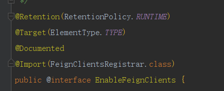
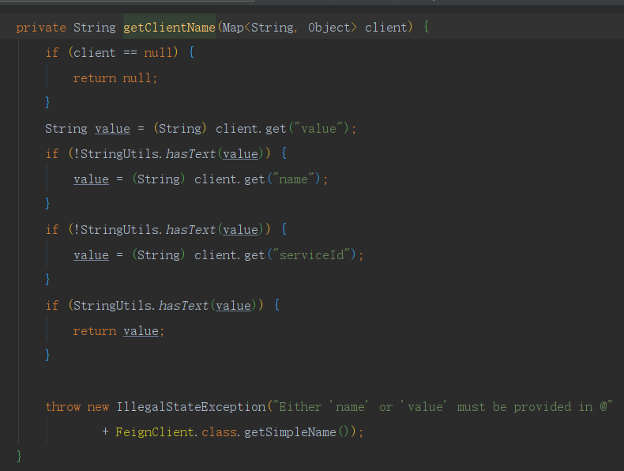

# 面试错题集合

## 1 Java

### 1.1 基础

​	1.【不合格】说说 JDK 和 JRE 分别是什么？还有它们的区别？

答：JDK 是 java 开发工具包；JRE 是 java 运行时环境。

区别：

- JRE 包含了 java 虚拟机，java 基础类库；
- JDK 包含 JRE，同时还包含了编译 java 源码的编译器 javac，还包含了很多 java 程序调试和分析的工具：jconsole，jvisualvm 等工具软件，还包含了 java 程序编写所需的文档和 demo 例子程序。


​	2.【不合格】equals 底层怎么实现的？你自定义一个类如何去重写 equals ？

答：底层实现如下（Object 类中）：

````java
public boolean equals(Object obj) {
    return (this == obj);
}
````

拿 HashMap 来举例，HashMap 的 equals 方法实现如下（先比较入参对象是否等于当前对象 this，再判断对象 instanceof 当前类后，比较内部属性，一样返回 true，不一样则返回 false）：

````java
public final boolean equals(Object o) {
    if (o == this)
        return true;
    if (o instanceof Map.Entry) {
        Map.Entry<?,?> e = (Map.Entry<?,?>)o;
        if (Objects.equals(key, e.getKey()) &&
            Objects.equals(value, e.getValue()))
            return true;
    }
    return false;
}
````


​	3.【不合格】说一下 final 关键字的作用。

答：①被 final 修饰的类，表明该类是无法继承的；

​		②被 final 修饰的方法，表明该方法是无法覆写的；

​		③被 final 修饰的变量，说明该变量在声明的时候，必须初始化完成，而且以后也不能修改其内存地址。


​	4.【盲区】static 是线程安全的吗？

答：①当 static 修饰类变量时，线程不安全；

​		②当 static 修饰方法时，static 方法内部的变量在执行时，线程安全（方法执行时，数据运行在栈里面，栈的数据每个线程都是隔离开的，所以不会有线程安全的问题）；

​		③当 static 修饰代码块时，线程安全。


​	5.【盲区】枚举是线程安全的吗？如果是，那是如何保证线程安全的？

答：枚举是线程安全的。

简单一个枚举类：

````java
public enum t {
    SPRING,SUMMER,AUTUMN,WINTER;
}
````

枚举类生成的字节码文件反编译后：

````java
public final class T extends Enum {
    private T(String s, int i)  {
        super(s, i);
    }
    public static T[] values() {
        T at[];
        int i;
        T at1[];
        System.arraycopy(at = ENUM$VALUES, 0, at1 = new T[i = at.length], 0, i);
        return at1;
    }
 
    public static T valueOf(String s) {
        return (T)Enum.valueOf(demo/T, s);
    }
 
    public static final T SPRING;
    public static final T SUMMER;
    public static final T AUTUMN;
    public static final T WINTER;
    private static final T ENUM$VALUES[];
    static {
        SPRING = new T("SPRING", 0);
        SUMMER = new T("SUMMER", 1);
        AUTUMN = new T("AUTUMN", 2);
        WINTER = new T("WINTER", 3);
        ENUM$VALUES = (new T[] {
            SPRING, SUMMER, AUTUMN, WINTER
        });
    }
}
````

枚举类编译后的类是继承了 Enum 类，且被 final 修饰，不可被继承，属性和其创建类的方式都是 static 修饰的，当一个 Java 类第一次被真正使用到的时候静态资源被初始化、Java类的加载和初始化过程都是线程安全的，所以创建一个 enum 类型是线程安全的。


​	6.【不合格】你经常遇到的异常有哪些？

答：经常遇到的异常：

- NullPointerException（空指针）
- SQLException（数据库错误）
- DuplicateKeyException（数据库主键冲突异常）
- DataIntegrityViolationException（数据库字段约束异常）
- PersistenceException（数据库 SQL 异常）
- IllegalArgumentException（参数校验不通过，常见于接口请求字段的类型错误）
- IndexOutOfBoundsException（数组越界）
- NumberFormatException（数值转换）
- ClassNotFoundException（常见于漏掉引入相关的依赖包，或者是版本引入错误）
- MissingServletRequestParameterException（非法请求参数）
- OutOfMemoryException（内存溢出）

等等。


​	7.【不合格】JDK 7 和 8 的区别？

答：**总结**

| 特性                   | JDK 7            | JDK 8                      |
| ---------------------- | ---------------- | -------------------------- |
| Lambda 表达式          | ❌ 不支持         | ✅ 支持                     |
| Stream API             | ❌ 不支持         | ✅ 支持                     |
| 接口默认方法           | ❌ 不支持         | ✅ 支持                     |
| 时间 API               | `java.util.Date` | `java.time`                |
| `Optional` 处理 `null` | ❌ 不支持         | ✅ 支持                     |
| 并发改进               | `ForkJoinPool`   | `CompletableFuture`        |
| JavaScript 引擎        | Rhino            | Nashorn                    |
| GC 机制                | G1 引入          | `Metaspace` 取代 `PermGen` |

**结论**：

- **JDK 7 主要是语法优化（如 `try-with-resources`），性能提升**。
- **JDK 8 是一次重大升级，引入了函数式编程、流式处理，提升了开发效率和可读性** 。


​	8.【盲区】说一下 equals 和 hashcode 的联系。

答：联系：

1. **`equals()` 和 `hashCode()` 应该一起重写**，保证对象一致性。
2. **如果 `equals()` 返回 `true`，则 `hashCode()` 必须相同**。
3. **`hashCode()` 仅用于加速查找，不代表对象一定相等**。
4. **推荐使用 `Objects.hash()` 实现 `hashCode()`，避免手动计算错误**。


​	9.【盲区】如果只重写 equals，不重写 hashcode 会报错吗？

答：**只重写 `equals()` 而不重写 `hashCode()` 不会导致编译错误或运行时错误**，但是会违反 Java 的契约，可能导致在集合（如 `HashSet`、`HashMap`）中出现不可预知的行为。

**推荐：如果重写 `equals()`，一定要重写 `hashCode()`**，确保它们的一致性，避免在哈希结构中出现问题。


### 1.2 集合

​	1.【记错】HashMap 的键和值能不能为 null？

答：都能。


​	2.【盲区】HashMap 从红黑树退化为链表的临界值为什么是6，而不是7？

答：抖动问题，可能会频繁转换，因为转换会消耗资源，导致性能下降。


​	3.【盲区】哪些集合类是线程安全的？

答：Collections.synchronized* 开头的类、HashTable、 Stack、Vector 、BlockingQueue、CopyOnwriteArrayList 和 ConcurrentHashMap 等等。


​	4.【盲区】从设计层面说一下迭代器的设计原理。

答：使用了迭代器模式的设计模式，提供一种方法访问一个容器（container）对象中各个元素，而又不需暴露该对象的内部细节。


​	5.【记错】Iterator 和 ListIterator 有什么区别？

答：区别：

- Iterator\<E> 和 ListIterator\<E> 都是接口，只是ListIterator继承Iterator接口；
- Iterator 可用来遍历 Set 和 List 集合，但是 ListIterator 只能用来遍历 List；
- Iterator 对集合只能是前向遍历， ListIterator 既可以前向也可以后向；
- Iterator 只有 `hasNext()` 、`Next()` 和 `remove()` 方法，而 ListIterator 有更多针对 list 集合的方法。


​	6.【盲区】HashMap 扩容倍数为什么是2倍？

答：为了扩容性能优化，将哈希运算由 % 运算化简为 & 运算，提高计算效率，降低哈希冲突，散列分布均匀。


​	7.【盲区】ArrayList 的数组元素对象为什么用 transient 修饰？

答：因为当 ArrayList 内部数组长度大于实际元素个数时，空的元素槽会占用不必要的网络带宽资源，而 ArrayList 

继承了 Serializable 接口，重写了 writeObject() 和 readObject() 方法（序列化和反序列化）。


​	8.【不合格】HashMap 是怎么扩容的？

答：业务代码调用 HashMap 的 put() 方法的时候，有两种扩容情况：

​	①Entry 数组为空或长度为0时，调用 resize() 方法进行初始化数组大小，默认为16；

​	②put 元素后，数组长度达到负载因子（默认0.75）与当前数组最大长度的乘积时，调用 resize() 方法，新建一个2倍长度的 Entry 数组，并将其中的元素进行 rehash，分散元素，减少冲突。


​	9.【遗忘】ConcurrentHashMap 是怎么扩容的？

答：ConcurrentHashMap 新增了 ForwardingNode （转移）节点，扩容的时候通过使用该节点，来保证扩容时的线程安全。ConcurrentHashMap 的扩容方法是 transfer（从 put 方法的 addCount 方法进去），流程如下：

​	①首先需要把老数组的值全部拷贝到扩容之后的新数组上，先从数组的队尾开始拷贝；

​	②拷贝数组的槽点时，先把原数组槽点锁住，保证原数组槽点不能操作，成功拷贝到新数组时，把原数组槽点赋值为转移节点；

​	③此时如果有新数据正好需要 put 到此槽点时，发现槽点为转移节点，就会一直等待，所以在扩容完成之前，该槽点对应的数据是不会发生变化的；

​	④从数组的尾部拷贝到头部，每拷贝成功一次，就把原数组中的节点设置成转移节点；

​	⑤直到所有数组数据都拷贝到新数组时，直接把新数组整个赋值给数组容器，拷贝完成。


​	10.【盲区】说一下 HashMap 的 hash 方法的实现。

答：将 key 值 hashcode 的低16位和它的高16位都参与进行异或运算，代码如下：

````java
static final int hash(Object key) {
    int h;
    return (key == null) ? 0 : (h = key.hashCode()) ^ (h >>> 16);
}
````


​	11.【盲区】说一下 HashMap 的数组索引的实现原理。

答：将 key 的 hashCode 值与数组长度进行取模运算，即 `hash 值 % n(数组大小)`，此时如果数组长度为2的n次幂，则可以换算成与（&）运算，即 `(n-1) & hash`。


​	12.【盲区】HashMap 初始值为什么是16？

答：选择16作为默认的初始容量是为了在处理碰撞、哈希函数运算效率和内存占用之间取得一个平衡，适用于大多数场景。


​	13.【不合格】HashMap 1.7 和 1.8 的区别？

答：JDK 1.7 中的 HashMap：

1. **数据结构：** JDK 1.7中的HashMap使用的是数组+链表的数据结构。当发生哈希冲突时，即多个键映射到同一个槽位时，采用链表存储冲突的键值对，头插法，有可能出现逆序造成链表死循环的情况。
2. **性能问题：** 在高并发的情况下，由于多个线程可能同时访问HashMap，可能会导致链表成为热点，性能下降。

JDK 1.8 中的 HashMap：

1. **数据结构优化：** JDK 1.8对HashMap进行了优化，引入了红黑树（Red-Black Tree）来替代链表，以提高在哈希冲突时的查找性能。当链表长度超过为8且数组长度超过64时，链表将被转换为红黑树。
2. **性能提升：** 引入红黑树后，在一些特定场景下，HashMap的性能有所提升。对于普通的小型HashMap，链表的开销可能更小，但是在大型HashMap中，红黑树可以提供更好的查找性能。
3. **并发性改善：** JDK 1.8对HashMap的并发性进行了改进，引入了Node的`next`字段的CAS（Compare and Swap）操作，以提高并发性。
4. **扩容机制：** 扩容时，JDK 1.8的HashMap采用了一种更为懒惰的扩容机制。在JDK 1.7中，扩容是一次性完成的，而在JDK 1.8中，扩容是分段进行的，减小了扩容时对系统的影响。

总体而言，JDK 1.8中对HashMap的改进主要集中在对哈希冲突的处理上，通过引入红黑树，提高了在冲突时的查找性能，同时对并发性进行了一些改进。这些优化使得HashMap在更多场景下都能够提供更好的性能。


​	14.【不合格】为什么 Hash Map 是线程不安全的？

答：`HashMap` 在多线程环境中是线程不安全的主要原因是其内部数据结构以及操作的非原子性。以下是一些导致线程不安全的主要因素：

1. **非同步操作：**
    - `HashMap` 的基本操作，例如 `put`、`get` 等，都不是原子性的。这意味着多个线程可以同时对 `HashMap` 进行修改，而不会受到同步机制的限制。
2. **链表结构和扩容问题：**
    - `HashMap` 使用链表解决哈希冲突，而在链表结构中，如果两个线程同时进行修改，可能导致链表的结构被破坏。同时，在扩容时，如果多个线程同时进行扩容操作，可能会导致数据结构异常。
3. **不是线程安全的容器：**
    - `HashMap` 是设计为非线程安全的容器，因此没有内置的同步措施。在多线程环境中使用 `HashMap`，必须显式地进行外部同步，否则会出现竞态条件和不确定的行为。
4. **迭代器异常：**
    - 如果一个线程在迭代 `HashMap` 的同时另一个线程对其进行修改（例如添加或删除元素），可能会导致 `ConcurrentModificationException` 异常，因为迭代器无法正确地同步遍历过程。


​	15.【盲区】ArrayList 的长度最大值是多少？为什么这么设置？

答：ArrayList 的长度最大值是 `Integer.MAX_VALUE - 8`，因为有些虚拟机可能会在数组头结构保留一些数据，如果分配长度过大会导致 OOM。


​	16.【不合格】ConcurrentHashMap 1.7 和 1.8 的区别？

答：JDK 1.7 中的 ConcurrentHashMap：

1. **分段锁设计：**
    - JDK 1.7 中的 `ConcurrentHashMap` 使用了分段锁的设计。整个哈希表被分为一定数量的段，每个段都拥有一个独立的锁。这样，当多个线程操作哈希表时，不同的段之间可以并发进行，提高了并发性。
2. **Segment + HashEntry：**
    - 每个段内部使用 `HashEntry` 数组存储键值对，`HashEntry` 是一个链表节点。在 JDK 1.7 中，每个段内的操作是线程安全的，但不同段之间的操作是串行化的，可能会引起一些性能瓶颈。
3. **Rehashing 问题：**
    - 在 JDK 1.7 中，当进行扩容（rehashing）时，需要锁住整个 `ConcurrentHashMap`，这可能导致在扩容期间的短时间内所有的写操作都被阻塞。

JDK 1.8 中的 ConcurrentHashMap：

1. **CAS + Synchronized：**
    - JDK 1.8 中的 `ConcurrentHashMap` 使用 CAS（Compare and Swap）操作和更细粒度的锁设计来提高并发性能。不再使用分段锁，而是使用更轻量级的锁机制。
2. **Node + TreeBin：**
    - JDK 1.8 引入了 `Node` 节点和红黑树的概念。在链表长度超过一定阈值时，链表会转化为红黑树，提高了查询性能。
3. **扩容优化：**
    - JDK 1.8 中对扩容操作进行了优化，使用无锁算法来进行并发扩容，减小了扩容带来的性能开销。
4. **优化的操作和算法：**
    - JDK 1.8 中采用了一些优化的算法，如使用无锁的 `compute` 方法，减少了对整个哈希表的锁定，提高了并发性。
5. **KeySet 和 Values 视图：**
    - JDK 1.8 中引入了基于视图的方法，如 `keySet()` 和 `values()` 方法，它们的迭代不会阻塞其他线程的操作。

总体来说，JDK 1.8 中的 `ConcurrentHashMap` 在并发性能上相较于 JDK 1.7 有显著的提升，采用了更先进的锁策略、数据结构和算法，使得在高并发情况下更为高效。


### 1.3 多线程

​	1.【不合格】线程和进程的区别？CPU 调度和分派主要关注哪一个？

答：区别：

- 线程在进程内运行，一个进程可以包含多个线程
- 不同进程间数据很难共享，但是同一进程下不同线程间数据很易共享
- 进程比线程消耗更多的计算机资源
- 进程间不会相互影响，一个线程挂掉将导致整个进程挂掉
- 进程可以拓展到多机，线程最多适合多核
- 线程使用的内存地址可以上锁，即一个线程使用某些共享内存时，其他线程必须等它结束，才能使用这一块内存
- 进程使用的内存地址可以限定使用量

线程是被 CPU 调度和分派的基本单位，进程是操作系统分配资源的基本单位。


​	2.【不合格】解释一下多线程的概念。

答：多线程是实现多任务的一种方式。


​	3.【记错】并行和并发有什么区别？

答：并行是多个线程同时被多个 CPU 执行，并发是多个线程被一个 CPU 轮流切换着执行。


​	4.【盲区】解释一下守护线程的概念。常见的守护线程有哪些？举几个例子。

答：守护线程是指为其他线程服务的线程。在JVM中，所有非守护线程都执行完毕后，无论有没有守护线程，虚拟机都会自动退出。

常见的守护线程有垃圾回收线程（GC）和 Docker 的 Daemon 线程。


​	5.【不合格】说一下创建线程有哪几种方式？

答：5种创建线程的方式：

- 继承 Thread 类本身

- 实现 Runnable 接口

- 通过 Callable + FutureTask 创建线程

- 线程池（`Executors`）

- CompletableFuture

| 创建方式                  | 适用场景                   | 是否支持返回值 | 是否适合多线程 |
| ------------------------- | -------------------------- | -------------- | -------------- |
| **继承 `Thread`**         | 简单任务，无法继承其他类时 | ❌              | ❌              |
| **实现 `Runnable`**       | 适用于共享任务             | ❌              | ✅              |
| **实现 `Callable`**       | 需要返回值的任务           | ✅              | ✅              |
| **线程池（`Executors`）** | 高并发、多任务             | 可选           | ✅              |
| **`CompletableFuture`**   | 异步编程（Java 8+）        | ✅              | ✅              |

如果你的任务**不需要返回值**，推荐使用 **`Runnable + 线程池`**。
如果你的任务**需要返回值**，推荐 **`Callable + 线程池`** 或 **`CompletableFuture`**。 


​	6.【盲区】线程池工厂有哪些线程池类型？分别用在什么场景？其线程池参数是什么？分别有什么致命缺陷？

答：有五种线程池：

1. **`Executors.newFixedThreadPool(int nThreads)` 定长线程池：**
    - **场景：** 适用于需要固定数量线程的场景，例如执行固定数量的任务或维护固定大小的连接池。
    - **参数：** 线程池大小（固定线程数量，定长线程池的大小最好根据系统资源进行设置。如 `Runtime.getRuntime().availableProcessors()`）。
    - **致命缺陷：** 如果任务量超过线程池大小，任务会进入队列排队等待执行。如果任务过多，可能导致队列溢出，影响系统稳定性。
2. **`Executors.newCachedThreadPool()` 可缓存线程池：**
    - **场景：** 适用于需要根据任务数量自动调整线程数量的场景，例如执行大量短时任务的情况。
    - **参数：** 无。线程数根据任务数量动态调整。
    - **致命缺陷：** 由于线程数不受限制，可能导致系统资源耗尽，因此需要谨慎使用。
3. **`Executors.newSingleThreadExecutor()` 单线程的线程池：**
    - **场景：** 适用于需要单个工作线程的场景，例如按顺序执行任务或维护单个后台线程的情况。
    - **参数：** 无。只有一个工作线程。
    - **致命缺陷：** 由于只有一个线程，如果该线程因为异常终止，会导致整个应用的任务无法执行。
4. **`Executors.newScheduledThreadPool(int corePoolSize)` 定时任务线程池：**
    - **场景：** 适用于需要定时执行任务的场景，例如定时任务调度。
    - **参数：** 核心线程数，可动态调整。
    - **致命缺陷：** 任务的执行时间过长可能导致后续任务无法按时执行。
5. **`Executors.newWorkStealingPool(int parallelism)`事件驱动线程池：**
    - **场景：** 适用于需要处理大量异步任务的场景，例如事件驱动的应用。
    - **参数：** 并行度（Parallelism），表示线程池中并行执行任务的线程数。
    - **致命缺陷：** 对于某些场景，可能存在线程数超出系统资源的情况，需要谨慎配置并行度。


​	7.【盲区】为什么阿里巴巴手册禁止线程池使用 Excutor 的默认实现？

答：建议通过 ThreadPoolExecutor 的方式创建线程池，禁止原因如下：

- newFixedThreadPool、 newSingleThreadExecutor 和 newScheduledThreadPool :

允许的请求队列长度为 Integer.MAX_VALUE，可能会堆积大量的请求任务，从而导致 OOM。 

- newCachedThreadPool :

允许的创建线程数量为 Integer.MAX_VALUE，可能会创建大量的线程，造成线程堆积问题，耗尽 CPU 和内存从而导致 OOM。


​	8.【盲区】线程池有哪几种状态？说一下分别表示什么含义。

答：RUNNING、SHUTDOWN、STOP、TIDYING 和 TERMINATED。

含义：

- RUNNING（-536870912）：接受新任务或者处理队列里的任务
- SHUTDOWN（0）：不接受新任务，但仍在处理已经在队列里面的任务
- STOP（-536870912）：不接受新任务，也不处理队列中的任务，对正在执行的任务进行中断
- TIDYING（1073741824）： 所以任务都被中断，workerCount 是 0，整理状态
- TERMINATED（1610612736）： `terminated()` 已经完成的时候


​	9.【盲区】说一下线程池的7个参数及其作用是什么？

答：线程池的7个参数及其作用：

- corePoolSize：核心线程数

- maximumPoolSize：最大线程数

- keepAliveTime：线程空闲的最大时间

- unit：时间单位

- workQueue：等待线程存放的队列

    > queue 有多种队列可供选择，比如：1：SynchronousQueue，为了避免任务被拒绝，要求线程池的 maxSize 无界，缺点是当任务提交的速度超过消费的速度时，可能出现无限制的线程增长；2：LinkedBlockingQueue，无界队列，未消费的任务可以在队列中等待；3：ArrayBlockingQueue，有界队列，可以防止资源被耗尽

- threadFactory：创建新线程时要使用的工厂

    > 线程新建的 ThreadFactory 可以自定义，也可以使用默认的 DefaultThreadFactory，DefaultThreadFactory 创建线程时，优先级会被限制成 NORM_PRIORITY，默认会被设置成非守护线程

- handler：在 Executor 已经关闭或对最大线程和最大队列都使用饱和时的拒绝策略

    > 可以使用 RejectedExecutionHandler 类进行异常捕捉，有如下四种处理策略：①ThreadPoolExecutor.AbortPolicy（默认）：抛出 RejectedExecutionException 异常；
    >
    > ②ThreadPoolExecutor.DiscardPolicy：直接丢弃任务，不抛异常；
    >
    > ③ThreadPoolExecutor.CallerRunsPolicy：直接在调用 execute() 方法的调用线程种执行被拒绝的任务（若线程池关闭，则该任务被丢弃）；
    >
    > ④ThreadPoolExecutor.DiscardOldestPolicy：删除队列中第一个任务（即时间最久的未处理的任务），然后重新尝试执行 execute() 方法（若线程池关闭，则该任务被丢弃）。


​	10.【盲区】线程池核心线程数一般根据什么样的规则来设置是最佳的？

答：CPU 密集型的，即需要较多的计算资源，可以考虑设置核心线程数与处理器核心数相近。如果任务是 I/O 密集型的，即涉及大量的 I/O 操作，可以考虑设置更多的核心线程数，以充分利用等待 I/O 的时间

- **CPU 密集型任务（计算类任务）**：

  - `核心线程数 = CPU 核心数`

  - `最大线程数 = CPU 核心数 + 1`

  - **示例**：

    ```java
    int coreSize = Runtime.getRuntime().availableProcessors();
    ThreadPoolExecutor cpuThreadPool = new ThreadPoolExecutor(
        coreSize, coreSize + 1, 60L, TimeUnit.SECONDS,
        new LinkedBlockingQueue<>(100),
        new ThreadPoolExecutor.CallerRunsPolicy() // 拒绝策略
    );
    ```

- **IO 密集型任务（数据库、网络 IO）**：

  - `核心线程数 = 2 * CPU 核心数`

  - `最大线程数 = 2 * CPU 核心数`

  - **示例**：

    ```java
    int coreSize = Runtime.getRuntime().availableProcessors();
    ThreadPoolExecutor ioThreadPool = new ThreadPoolExecutor(
        2 * coreSize, 2 * coreSize, 60L, TimeUnit.SECONDS,
        new LinkedBlockingQueue<>(500),
        new ThreadPoolExecutor.CallerRunsPolicy()
    );
    ```


​	11.【盲区】怎么防止线程死锁？

答：可以采取以下策略：

1. **按顺序获取锁：**
    - 确保所有线程按照相同的顺序获取锁。这样可以减少死锁的可能性，因为不同线程获取锁的顺序一致，就不会出现互相等待对方释放锁的情况。
2. **使用 tryLock() 避免长时间等待：**
    - 使用 `tryLock()` 方法而不是 `lock()` 方法来获取锁，可以设置一个超时时间，当在指定时间内无法获取到锁时，线程可以放弃对资源的请求，避免长时间等待导致的死锁。
3. **使用锁的超时机制：**
    - 在获取锁的时候，使用带有超时参数的 `tryLock()` 方法，避免线程无限期地等待锁资源。如果等待超时，可以执行相应的逻辑以避免死锁。
4. **使用锁的顺序：**
    - 确保在所有的线程中，获取锁的顺序是一致的。例如，按照资源的唯一标识顺序来获取锁，这有助于减少死锁的可能性。
5. **使用更高级别的并发工具：**
    - 使用 Java 并发包中提供的更高级别的工具，如 `ReentrantLock`、`Condition`、`Semaphore` 等，它们提供了更为灵活的锁管理机制，有助于防止死锁。
6. **定期检测和处理死锁：**
    - 定期检测系统中是否存在死锁，可以通过工具或代码进行检测。一旦检测到死锁，可以通过强制释放锁、中断线程等方式来解除死锁。
7. **避免嵌套锁：**
    - 避免在持有一个锁的同时去获取另一个锁，这可能导致死锁。如果确实需要多个锁，尽量按照相同的顺序获取，避免循环等待。
8. **使用事务：**
    - 对于数据库等资源的操作，使用事务可以避免一些潜在的死锁问题，因为事务机制能够更好地管理锁的释放和获取。


​	12.【盲区】ThreadLocal 了解吗？都用在什么场景？

答：ThreadLocal 提供了一种方式，让在多线程环境下，每个线程都可以拥有自己独特的数据，并且可以在整个线程执行过程中，从上而下的传递。

适用场景：变量在线程间隔离，而在方法或类间共享的场景。


​	13.【盲区】悲观锁对多线程的竞争性有什么影响？

答：悲观锁竞争激烈的情况下会升级，即锁粗化，顺序是：偏向锁 → 轻量级锁 → 重量级锁。


​	14.【盲区】说一下线程逐渐增大到超过队列最大值的情况下，线程池内部的处理流程。

答：见下图。


①如果线程池的状态是RUNNING，线程池的大小小于配置的核心线程数，则启动新的线程执行这个任务；否则放入提前声明的等待队列中；

②如果线程池的状态是RUNNING ，线程池的大小小于配置的最大线程数，并且任务队列已经满了，说明现有线程已经不能支持当前的任务了，并且线程池还有继续扩充的空间，就可以创建一个新的线程来处理提交的任务；

③如果线程池的状态是RUNNING ，线程池的大小等于配置的最大线程数，并且任务队列已经满了，则执行拒绝策略，任务拒绝入队；

④当线程池已经关闭或者上面的条件都不能满足时，则进行拒绝策略，拒绝策略在 RejectedExecutionHandler 接口中定义，可以有多种不同的实现。


​	15.【盲区】如何停止线程池？

答：`ExecutorService` 接口中有两种停止的方法：

- `void shutdown();` 有序的停止线程池，继续执行已提交的任务，但不再接受新的任务；
- `List<Runnable> shutdownNow();` 立即停止线程池，立即停止所有正在执行的任务，暂停所有等待执行的任务，并返回等待执行的任务列表。


​	16.【不合格】说一下线程的状态有哪些？它们之间是怎么转换的？

答：如下图：


- NEW 表示线程创建成功，但没有运行，在 new Thread 之后，没有 start 之前，线程的状态都是 NEW；
- 当我们运行 strat 方法，子线程被创建成功之后，子线程的状态变成 RUNNABLE，RUNNABLE 表示线程正在运行中；
- 子线程运行完成、被打断、被中止，状态都会从 RUNNABLE 变成 TERMINATED，TERMINATED 表示线程已经运行结束了；
- 如果线程正好在等待获得 monitor lock 锁，比如在等待进入 synchronized 修饰的代码块或方法时，会从 RUNNABLE 变成 BLOCKED，BLOCKED 表示阻塞的意思；
- WAITING 和 TIMED_WAITING 类似，都表示在遇到 Object#wait、Thread#join、LockSupport#park 这些方法时，线程就会等待另一个线程执行完特定的动作之后，才能结束等待，只不过 TIMED_WAITING 是带有等待时间的（可以看下面的 join 方法的 demo）。


​	17.【不合格】多线程情况下，线程同步的方式有哪些?

答：有以下几种（未完待续）：

- synchronized
- 可重入锁 ReentrantLock
- 可重入读写锁 ReentrantReadWriteLock
- ThreadLocal 局部变量
- volatile
- CountDownLatch
- Semaphore

| 方法                     | 适用场景       | 优势               | 劣势                     |
| :----------------------- | -------------- | ------------------ | ------------------------ |
| `synchronized`           | 适用于简单同步 | 代码简洁           | 性能低，可能造成线程阻塞 |
| `ReentrantLock`          | 复杂同步需求   | 支持超时、可中断   | 代码复杂，需要手动释放锁 |
| `ReentrantReadWriteLock` | 读多写少的场景 | 读写分离，提高性能 | 只适用于读写分离的情况   |
| `volatile`               | 状态标记变量   | 内存可见性         | 不能保证原子性           |
| `ThreadLocal`            | 线程私有变量   | 避免共享，性能高   | 可能导致内存泄漏         |
| `CountDownLatch`         | 线程同步等待   | 多线程协调         | 只能使用一次             |
| `Semaphore`              | 限制并发数     | 控制访问量         | 适用场景较少             |

🔹 **推荐**：高并发场景下，`ReentrantLock` + `tryLock()` + `ThreadLocal` 是最佳选择！ 


​	18.【盲区】什么情况下线程会发生死锁？

答：死锁的四个条件：

- 互斥条件：线程(进程)对于所分配到的资源具有排它性，即一个资源只能被一个线程(进程)占用，直到被该线程(进程)释放；
- 请求与保持条件：一个线程(进程)因请求被占用资源而发生阻塞时，对已获得的资源保持不放；
- 不剥夺条件：线程(进程)已获得的资源在末使用完之前不能被其他线程强行剥夺，只有自己使用完毕后才释放资源；
- 循环等待条件：当发生死锁时，所等待的线程(进程)必定会形成一个环路（类似于死循环），造成永久阻塞。


​	19.【盲区】如何分析堆栈信息中的线程是否含有死锁信息？

答：分析堆栈信息：

- **使用 `jstack -l <pid>`**，搜索 `Found one Java-level deadlock` 关键字
- **手动分析**，查找 `BLOCKED` 状态的线程，找出循环锁依赖
- **使用 `jconsole` 或 `VisualVM`** 进行可视化分析
- **`jcmd <pid> Thread.print`** 也可以用于死锁检测

**避免死锁的最佳实践**：

- 保持**固定的加锁顺序**
- 使用 **`tryLock()`** 避免死锁
- 尽量减少锁的使用范围


​	20.【遗忘】java 中线程切换使用的是什么算法？

答：CPU 的时间片轮转算法。


​	21.【盲区】多线程间会进行上下文切换，这里的上文和下文指的是什么？

答：上文是保存当前执行线程切换前的现场数据，下文是将要执行线程上一次保存的现场数据。现场数据包括 CPU 寄存器的存储内容以及程序计数器存储的指令内容。

> CPU 寄存器负责存储已经、正在和将要执行的任务，程序计数器负责存储 CPU 正在执行的指令位置以及即将执行的吓一跳指令的位置。


​	22.【盲区】sleep(0) 的作用？

答：当前线程释放剩余 CPU 时间片，此线程立即进入就绪队列而不是等待队列，提升执行效率。


​	23.【盲区】java多线程和并发流的区别？

答：Java 多线程更接近“线程级别的控制”，适合复杂任务的**底层并发编排**；而并发流（`parallelStream`）是 JDK8 引入的**函数式数据并行工具**，封装度更高、适合简单并行计算场景。

区别如下：

| 对比维度   | 多线程（Thread/Runnable）           | 并发流（parallelStream）                   |
| ---------- | ----------------------------------- | ------------------------------------------ |
| 本质       | 线程级别控制                        | 使用 `ForkJoinPool` 做数据并行             |
| 控制粒度   | 粒度细，可控制线程生命周期          | 封装度高，不可控线程                       |
| 编程复杂度 | 高，需要手动管理线程池、同步等      | 低，函数式风格，一行代码并行处理           |
| 通用性     | 通用，适用于所有类型任务            | 专用于 **集合流式处理**                    |
| 使用方式   | Thread / ExecutorService            | `stream().parallel()` / `parallelStream()` |
| 性能调优   | 可调线程池、线程数、调度策略        | 使用公共 `ForkJoinPool.commonPool()`       |
| 可控性     | ✅ 高（线程池、回调、异常处理）      | ❌ 低（不推荐做复杂业务流程）               |
| 适用场景   | 复杂并发任务，定时任务、网络/IO操作 | 数据处理、CPU密集型计算                    |


### 1.4 并发

​	1.【盲区】你知道 ConcurrentHashMap 的最大并发数是多少吗？

答：16，对应字段为 `DEFAULT_CONCURRENCY_LEVEL`。


​	2.【不合格】说一下 Synchronized 和 Lock 的区别。

答：Synchronized 和 Lock 的区别：

- 概念不一样：Synchronized 是 Java 关键字，Lock 是一个接口；
- 锁的状态不一样：Synchronized 不可中断，Lock 可中断；
- 性能不一样：资源竞争激励的情况下，Lock 性能比 synchronized 好，竞争不激励的情况下，synchronized 比 Lock 性能好（因为 synchronize 会根据锁的竞争情况，从偏向锁-->轻量级锁-->重量级锁升级，竞争激烈的情况下，容易产生大量重量级锁，性能不稳定）；
- 锁的机制不一样：synchronized 是在 JVM 层面实现的，隐式获取和释放，系统会监控锁（monitor）的释放与否（enter 和 exit）。Lock 是由 JDK 底层实现，需要手动加锁和释放，在finally块中释放，可以采用非阻塞的方式获取锁；
- 特点不一样：Synchronized 的代码更简洁，Lock 的功能更多更灵活，缺点是必须在 finally 里面 unlock() 释放锁；
- 用法不一样：synchronized 可以用在代码块上，方法上。Lock 只能写在代码里，不能直接修改方法。

> Synchronized 在 JDK 1.6 之后进行了优化，性能得到了很大的提升。
>
> Lock 锁的基本操作是通过乐观锁来实现的，但由于 Lock 锁也会在阻塞时被挂起，因此它依然属于悲观锁。


​	3.【不合格】什么是 CAS ？什么是自旋？

答：CAS（Compare and swap），即比较并交换；

自旋，不断循环重试尝试特定操作。


​	4.【不合格】用 CAS 的好处在哪里？坏处呢？

答：①CAS 优点：

- 并发量较小时效率高；
- 保证变量的原子性操作；

    ②缺点：

- 消耗 CPU 资源较大；
- 不保证代码块的原子性；
- 容易引发 ABA 问题（加版本号解决）。


​	5.【不合格】说一下 Synchronized 和 ReentrantLock 的区别。

答：Synchronized 和 ReentrantLock 的区别：

- 概念不一样：Synchronized 是 Java 关键字，ReentrantLock 是一个类；
- 功能不一样：Synchronized 只能实现非公平锁，ReentrantLock 实现了公平锁和非公平锁；
- 锁的状态不一样：Synchronized 不可中断，ReentrantLock 可中断；
- 性能不一样：资源竞争激励的情况下，ReentrantLock 性能比 synchronized 好，竞争不激励的情况下，synchronized 比 ReentrantLock 性能好（因为 synchronize 会根据锁的竞争情况，从偏向锁-->轻量级锁-->重量级锁升级，竞争激烈的情况下，容易产生大量重量级锁，性能不稳定）；
- 锁的机制不一样：synchronized 是在 JVM 层面实现的，隐式获取和释放，系统会监控锁（monitor）的释放与否（enter 和 exit）。Lock 是由 JDK 底层实现，需要手动加锁和释放，在finally块中释放，可以采用非阻塞的方式获取锁；
- 特点不一样：Synchronized 的代码更简洁，ReentrantLock 的功能更多更灵活，缺点是必须在 finally 里面 unlock() 释放锁；
- 用法不一样：synchronized 可以用在代码块上，方法上。Lock 只能写在代码里，不能直接修改方法。


​	6.【不合格】说一下 ReentrantLock 和 ReentrantReadWriteLock 的区别。

答：ReentrantLock 和 ReentrantReadWriteLock 的区别：

- ReentrantLock 同一时间只允许一个线程访问，ReentrantReadWriteLock 同一时间允许多个读线程访问，但不允许写线程和读线程、写线程和写线程同时访问；
- ReentrantLock 保证数据的强一致性，ReentrantReadWriteLock 只保证数据的最终一致性；


​	7.【不合格】volatile 是如何保证线程安全的（原理）？

答：被 volatile 修饰的共享变量进行写操作时汇编代码中会额外增加 lock 前缀指令。

lock 前缀指令在多处理器下的作用：

- 将当前处理器缓存行的数据写回到系统内存
- 此写回内存操作会使其他CPU里缓存的该内存地址数据失效（缓存一致性协议 MESI）

> 缓存一致性协议 MESI：
>
> - M（modified）：代表该缓存行中的内容被修改了，并且该缓存行只被缓存在该CPU中；
> - E（exclusive）：代表该缓存行对应内存中的内容只被该CPU缓存，其他CPU没有缓存该缓存对应内存行中的内容；
> - S（shared）：该状态意味着数据不止存在本地CPU缓存中，还存在别的CPU的缓存中；
> - I（invalid）：代表该缓存行中的内容时无效的。


​	8.【遗忘】什么是指令重排？根据什么原则进行指令重排的？

答：指令重排是指编译器和处理器为优化程序性能，对指令序列进行重新排序的一种手段。

原则：

- as-if-serial：无论怎么重排序，单线程中的执行结果都不能被改变（编译器、runtime和处理器都遵守 as-if-serial 语义）
- 在不改变程序执行结果的前提下，尽可能提高并行度。


​	9.【遗忘】说一下 Java 的内存模型？

答：Java 内存模型（JMM）定义了线程和主内存之间的抽象关系，它分为两个部分：

- 主内存：存储线程之间的共享变量；
- 线程私有内存（抽象概念，非真实存在）：存储该线程读/写共享变量的副本；

JMM 决定一个线程对共享变量的写入结果，何时对另一个线程可见，提供内存可见性保证。


​	10.【不合格】说一下 ArrayBlockingQueue 和 LinkedBlockingQueue 底层锁实现的区别。

答：**锁实现的区别对比**

| 特性             | `ArrayBlockingQueue`                               | `LinkedBlockingQueue`                    |
| ---------------- | -------------------------------------------------- | ---------------------------------------- |
| **底层数据结构** | 数组                                               | 链表                                     |
| **容量**         | 固定容量                                           | 可以固定容量，也可以无界                 |
| **锁的数量**     | 只有一个锁（保护整个队列）                         | 两个锁（分别保护队列头部和尾部）         |
| **并发性能**     | 在高并发场景下可能性能较差，因为队列的操作是互斥的 | 高并发性能较好，因为头尾部分可以同时操作 |
| **适用场景**     | 适用于队列大小已知并且不需要动态扩展的场景         | 适用于队列大小不固定或需要动态扩展的场景 |

**总结**

- **`ArrayBlockingQueue`** 使用一个锁保护整个队列，这使得它在高并发环境下的性能较差，特别是当多个线程同时进行 `put` 或 `take` 操作时，它们需要相互等待。
- **`LinkedBlockingQueue`** 使用两个锁，分别保护队列的头部和尾部，允许多个线程同时进行 `put` 和 `take` 操作，因此它在高并发场景下表现更好。


### 1.5 I/O

​	1.【不合格】分别说一下 BIO、NIO 和 AIO 以及他们的区别。

答：BIO：全称 Blocking IO，是 JDK1.4 之前的传统 IO 模型，本身是同步阻塞模式。 线程发起 IO 请求后，一直阻塞 IO，直到缓冲区数据就绪后，再进入下一步操作。针对网络通信都是一请求一应答的方式，虽然简化了上层的应用开发，但在性能和可靠性方面存在着巨大瓶颈，在高并发的场景下，机器资源很快就会被耗尽。

NIO：NIO 也叫 Non-Blocking IO，是同步非阻塞的 IO 模型。线程发起 IO 请求后，立即返回（非阻塞 IO）。同步指的是必须等待 IO 缓冲区内的数据就绪，而非阻塞指的是，用户线程不原地等待 IO 缓冲区，可以先做一些其他操作，但是要定时轮询检查 IO 缓冲区数据是否就绪。Java中的 NIO 是 new IO 的意思。其实是 NIO 加上 IO 多路复用技术。普通的 NIO 是线程轮询查看一个 IO 缓冲区是否就绪，而 Java 中的 new IO 指的是线程轮询地去查看一堆 IO 缓冲区中哪些就绪，这是一种 IO 多路复用的思想。IO 多路复用模型中，将检查 IO 数据是否就绪的任务，交给系统级别的 select 或 epoll 模型，由系统进行监控，减轻用户线程负担。

> NIO 主要有 buffer、channel、selector 三种技术的整合，通过零拷贝的 buffer 获取数据，每一个客户端通过channel 在 selector（多路复用器）上进行注册。服务端不断轮询 channel 来获取客户端的信息。channel 上有 connect、accept（阻塞）、read（可读）、write（可写）四种状态标识。根据标识来进行后续操作。所以一个服务端可接收无限多的 channel，不需要新开一个线程，大大提升了性能。

AIO 是真正意义上的异步非阻塞 IO 模型。 上述 NIO 实现中，需要用户线程定时轮询，去检查 IO 缓冲区数据是否就绪，占用应用程序线程资源，其实轮询相当于还是阻塞的，并非真正解放当前线程，因为它还是需要去查询哪些 IO 就绪。而真正的理想的异步非阻塞 IO 应该让内核系统完成，用户线程只需要告诉内核，当缓冲区就绪后，通知我或者执行我交给你的回调函数。

> AIO 可以做到真正的异步的操作，但实现起来比较复杂，支持纯异步 IO 的操作系统非常少，目前也就 windows 是 IOCP 技术实现了，而在 Linux 上，底层还是是使用的 epoll 实现的。


### 1.6 JVM

​	1.【盲区】说一下类在 JVM 中的加载过程。

答：JVM 运行分为三个步骤：加载 → 链接 → 初始化 → 使用 → 卸载。

其中连接步骤分为三个阶段：验证 → 准备 → 解析。

总的就是：加载 → 验证 → 准备 → 解析 → 初始化 → 使用 → 卸载。

①加载：通过类加载器将字节码加载到内存。

②链接：包括验证、准备和解析，确保类的结构和引用的正确性。

- 验证：确保字节码文件符合 JVM 规范，并且没有恶意代码，验证的内容包括类的文件结构、字节码流的合法性、类的继承结构等
- 准备：JVM 会为类中的静态变量分配内存，并初始化默认值
- 解析：将类中的符号引用（例如方法、字段等）替换为直接引用

③初始化：初始化类的静态变量和静态代码块。

④使用：类的成员可以被访问和调用。

⑤卸载：类不再使用时被卸载（由垃圾回收机制管理）。


​	2.【盲区】将 CMS 回收器切换为 G1 的 JVM 参数是什么？

答：`-XX:+UseG1GC`


​	3.【不合格】CMS 和 G1 有什么区别？哪一个好？为什么？知道 CMS 的全称吗？

答：区别：

- G1 支持支持类卸载，CMS 不支持
- G1 不会产生内存碎片，垃圾收集完成后能提供规整的可用内存，CMS 会产生内存碎片，收集结束时产生大量空间碎片，导致触发 Full GC，所以 G1 垃圾收集效果更好
- G1 资源占用高，性能相对更好，CMS 资源占用低，性能稍微弱点

**CMS 和 G1 的特性对比**

| **特性**         | **CMS**                                                      | **G1**                                                       |
| ---------------- | ------------------------------------------------------------ | ------------------------------------------------------------ |
| **停顿时间**     | 通过并发标记和清扫尽量减少停顿，但不可控，可能发生长时间的 Full GC | 可控停顿时间，可以通过 `-XX:MaxGCPauseMillis` 设置目标停顿时间 |
| **CPU 消耗**     | 高 CPU 消耗，因为并发进行标记和清扫                          | CPU 消耗相对较低，标记和清理阶段更高效                       |
| **Full GC**      | 可能频繁发生，且 Full GC 的停顿时间较长                      | 减少 Full GC 的发生，并且停顿时间较短                        |
| **内存回收效率** | 适用于堆内存较小的应用                                       | 适用于大内存应用，能够高效处理大堆内存                       |
| **适用场景**     | 对 GC 停顿时间敏感、内存较小的应用                           | 对停顿时间可控、内存较大的应用                               |
| **调优复杂性**   | 较为复杂，需要调整多个参数                                   | 调优较简单，能够自动调整回收策略                             |

> 官方建议：内存分配超过 8G 的情况下，G1 好；内存分配在 8G 以内，CMS 好。

CMS（全称 Concurrent Mark Sweep）并发标记收集器。


​	4.【记错】方法区在 jdk 不同版本的实现方式有什么不一样？

答：JDK6 中放弃了永久代，逐步改为本地内存（Native Memory）实现方法区；

JDK7 移除永久代中的字符串常量池和静态变量；

JDK8 完全放弃永久代，本地内存中实现元空间（Metaspace）来代替。


​	5.【遗忘】类的静态全局变量和非静态全局变量，分别存在 JVM 哪个结构里？

答：类的静态全局变量存储在方法区；类的非静态全局变量存储在堆。

> ①方法体中的引用变量和基本类型的变量都在栈上，其他都在堆上；
>
> ②对于局部变量，如果是基本类型，会把值直接存储在栈；如果是引用类型，比如 `String s = new String("william");` 会把其对象存储在堆，而把这个对象的引用（指针）存储在栈。


​	6.【不合格】Java 虚拟机栈中的栈帧的作用是什么？

答：每个方法被调用至执行完毕的过程，对应一个栈帧在虚拟机中从入栈到出栈的过程。用于存储数据：局部变量表、操作数栈、动态连接和方法出口。


​	7.【模糊】年轻代回收（Minor GC/Young GC）和老年代（Major GC/Old GC）的默认回收算法是什么？

答：年轻代默认使用标记复制算法；老年代默认使用标记清除/标记整理算法。


​	8.【记错】数组在内存中是怎么分配的？

答：实例存在堆区，引用存在 Java 虚拟机栈中。


​	9.【盲区】JDK8 默认的垃圾收集器是什么？如何用命令查看？

答：`-XX:+PrintCommandLineFlags` 可打印出 JDK8 默认的垃圾收集器。

JDK 7和8 的默认垃圾收集器都是 Parallel Scavenge（新生代）+Parallel Old（老年代）。

JDK 9 的默认垃圾收集器是 G1。


​	10.【盲区】哪些情况下会发生内存溢出？举几个例子，如何解决？

答：有三种情况：

①`java.lang.OutOfMemoryError: Java heap space`：**堆内存溢出**（常见）

| 溢出原因                                    | 常见案例                                      | 解决方案                                                 |
| ------------------------------------------- | --------------------------------------------- | -------------------------------------------------------- |
| 请求创建一个超大对象                        | 创建超大数组                                  | 检查其合理性，限制最大值，增加 JVM 堆的最大值            |
| 超负荷的请求                                | 促销、秒杀活动                                | 横向扩容加机器，限流降级熔断，增加 JVM 堆的最大值        |
| 过多的使用 finalize，导致对象没有被立即回收 |                                               | 优化代码，增加 JVM 堆的最大值                            |
| 内存泄漏，大量对象引用没有被释放            | ①使用 File 等资源没有及时回收；②循环 new 对象 | 找到泄漏的类及原因，针对性优化代码，如及时释放连接或资源 |

> 启动 jar 包时通过设置 JVM 参数 -XX:+HeapDumpOnOutOfMemoryError  -XX:HeapDumpPath=./dump.hprof，开启虚拟机内存溢出时自动 Dump 当前内存快照到指定文件。

②`java.lang.OutOfMemoryError: PermGen space`：**永久代溢出**（即方法区）

| 溢出原因                            | 常见案例                                                     | 解决方案         |
| ----------------------------------- | ------------------------------------------------------------ | ---------------- |
| 加载的 class 数目太多或占用内存太大 | ①大量 Jsp 页面；②cglib 反射动态生成大量 class                | 扩充方法区的大小 |
| 项目中存在过多的常量，尤其字符串    | ①大量声明字符串常量；②循环调用 String.intern() 方法来写入常量池 | 优化代码         |

> 启动 jar 包时通过设置 JVM 参数 -XX:PermSize=64m -XX:MaxPermSize=256m，修改方法区的初始化和最大内存大小。

③`java.lang.StackOverflowError`：**栈溢出**

| 溢出原因                                                     | 常见案例           | 解决方案 |
| ------------------------------------------------------------ | ------------------ | -------- |
| 线程请求的栈深度大于虚拟机所允许的最大深度，无法压入新的栈帧 | ①死循环；②递归调用 | 检查代码 |


​	11.【盲区】针对 CMS 垃圾收集器，有哪些 JVM 相关的优化参数？

答：JVM 相关的调优参数如下表：

| 参数                                              | 描述                                                         |
| ------------------------------------------------- | ------------------------------------------------------------ |
| -XX：+UseConcMarkSweepGC                          | 激活 CMS 收集器（默认 HotSpot JVM 使用的是 Parallel收集器）。 |
| -XX：UseParNewGC                                  | 激活年轻代使用多线程并行执行垃圾回收。                       |
| -XX：+CMSConcurrentMTEnabled                      | 并发的 CMS 阶段将以多线程并行执行(多个 GC 线程会与用户线程并行工作，默认开启)。 |
| -XX：ConcGCThreads=n                              | 定义并发 CMS 周期的所有阶段运行时的线程数均为 n。            |
| -XX:CMSInitiatingOccupancyFraction=n              | 第一次 CMS 垃圾收集会在老年代占用率达到 n% 后触发（默认值为68）。 |
| -XX：+UseCMSInitiatingOccupancyOnly               | 命令 JVM 不基于运行时收集的数据来启动 CMS 垃圾收集周期，JVM 通过 CMSInitiatingOccupancyFraction 的值进行每一次的 CMS 收集，而不仅仅是第一次。 |
| -XX:+CMSClassUnloadingEnabled                     | 开启对永久代进行垃圾回收。                                   |
| -XX:+CMSIncrementalMode                           | 开启CMS收集器的增量模式（当正常 CMS 周期对应用程序线程干扰太大时，才应该使用增量模式）。 |
| -XX:+ExplicitGCInvokesConcurrent                  | JVM 无论何时调用系统 GC，都执行 CMS GC，而不是 Full GC（防止出现”stop-the-world”的系统GC）。 |
| -XX:+ExplicitGCInvokesConcurrentAndUnloadsClasses | 当有系统 GC 调用时，永久代也被包括进 CMS 垃圾回收的范围内（防止出现”stop-the-world”的系统GC）。 |
| -XX:+DisableExplicitGC                            | JVM 将完全忽略系统的 GC 调用(不管使用的收集器是什么类型)     |


​	12.【遗忘】可达性分析算法中，可以作为 GC Roots 的对象有哪些?

答：Java 技术体系中，固定可作为 GC Roots 的对象：

- Java 虚拟机栈中引用的对象（栈帧中的局部变量表），如线程被调用的方法堆栈中使用到的参数、局部变量、临时变量等
- 方法区中类静态属性引用的对象，如 Java 类的引用类型静态变量
- 方法区中常量引用的对象，如字符串常量池（String Table）的引用
- 本地方法栈中 JNI 引用的对象
- Java 虚拟机内部的引用，如基本类型的包装类对象，常驻的异常对象（如 NullPointException、OutOfMemory Error），系统类加载器
- 所有被同步锁（synchronized关键字）持有的对象
- 反应 Java 虚拟机内部情况的JMXBean、JVMTI中注册的回调、本地代码缓存
- 其他临时性的对象，如关联区域的对象


​	13.【盲区】Eden 区、S0 和 S1 的默认配置比例是什么？

答：Eden 区：S0：S1 = 8：1：1。


​	14.【盲区】触发 Full GC 的条件有哪些？

答：触发 Full GC 的条件：

- 调用 `System.gc()`（只是通知 JVM 进行 Full GC，但不保证一定发生）
- 每次晋升到老年代的对象平均大小>老年代剩余空间
- Minor GC 后存活的对象大小超过了老年代剩余空间
- 永久代空间不足
- CMS 的 GC 过程发生 Concurrent mode failure 时
- G1 进行垃圾回收时，收集速度小于内存分配速度时
- 堆内存分配超大的对象时（常见于创建一个超大数组或者数据库查询出一个超大 List 对象）


​	15.【盲区】JVM 的启动参数 -Xms 和 -Xmx 默认值是多少？Linux 下 JVM 栈的默认值是多少？

答： -Xms 默认值是物理内存的1/64大小（但最小值为 **1 GB**），-Xmx 默认值是物理内存的1/4大小（但最大为 **2 GB**）。

Linux 下 JVM 栈的默认值是1MB（可以通过 **`-Xss`** 参数进行调整）。


​	16.【遗忘】JVM 中一个对象是如何完整地度过生命周期的？

答：分为对象创建和对象回收两个部分：

1）对象创建

①检查：先检查指令参数是否能在常量池中定位到一个类的符号引用（若有则检查这个符号引用代表的类是否已被加载、解析和初始化过，没有则执行类加载过程）；

②分配：检查通过后为新对象分配内存，类加载完成后完全确定对象所需内存大小;

③初始化：Java 虚拟机将分配到的内存空间（不包括对象头）初始化为零值;

④设置：Java 虚拟机对对象头（Object Header）进行必要设置；

⑤构造函数：若字节码 new 指令后跟随 invokespecial指令，则 new 指令执行后立即执行 `<init>()` 方法即构造函数，在 Java 程序层面初始化对象。

2）对象回收

①可达性分析后发现没有与 GC Roots 相连的引用链，则被第一次标记，随后进行一次筛选；

②有必要执行 `finalize()` 时，会将对象放在 F-Queue 队列中，由一条虚拟机自动建立的低调度优先级的 Finalizer 线程去 “执行” 它们的 `finalize()` 方法，稍后被第二次标记，随后彻底回收。


​	17.【盲区】怎么用命令看 JVM 堆中新生代/老年代内存占用情况、GC 等实时数据？

答：用 jstat 命令，`jstat -gc [PID] [INTERVAL] [COUNT]`。


​	18.【不合格】说一下 class 字节码文件结构。

答：class 字节码文件是一组以8个字节为基础单位的二进制流，结构如下：

- 魔数（0xCAFEBABE），占用4个字节
- Class 文件的版本，次版本号+主版本号（都是2个字节），占用4个字节
- 常量池（占用 Class 文件空间最大的数据项目之一，表类型数据）
- 访问标志
- 类索引、父类索引与接口索引集合
- 字段表集合
- 方法表集合
- 属性表集合


​	19.【不合格】什么情况下使用 CMS 作为老年代垃圾收集器？

答：使用条件：

- 堆内存小于4G~6G以内时
- 服务承载的并发较大且要求低延迟的场景，如交易系统。


​	20.【不合格】如何判断一个对象是垃圾？

答：判断一个对象是否为垃圾，主要通过 **可达性分析** 来实现。如果对象无法通过任何引用链从 **GC Roots** 可达，那么它就是垃圾，将在下次垃圾回收时被回收。该方法能处理各种引用类型，包括循环引用等。

**GC Roots：** 垃圾回收器通过从一组“GC Roots”开始，进行可达性分析。这些 GC Roots 是程序运行期间不可回收的对象，它们是可达性分析的起点。常见的 GC Roots 包括：

- **栈上的本地变量**（Local Variables in Stack）
- **静态字段**（Static Fields）
- **活动的线程**（Active Threads）
- **方法区中的类引用**（Class References in Method Area）
- **JNI 引用**（Java Native Interface）


​	21.【盲区】CMS 为什么不用标记整理？

答：


​	22.【盲区】JDK 8 默认收集器 Parallel 的优势？

答：


​	23.【遗忘】G1 和 ZGC 的区别？

答：


​	24.【盲区】说一下 minor GC 流程。

答：


​	25.【遗忘】说一下对象再可达性分析算法中如何区分对象是否可达？误标记怎么解决？

答：三色标记法：

- 白色：对象未被垃圾收集器访问过，分析开始阶段，均为白色，结束阶段仍然为白色的表示不可达。等待被回收；
- 黑色：对象已被垃圾收集器访问过，且此对象的所有引用都已扫描，表示安全存活对象，若有其他对象指向黑色对象，无需重新扫描（黑色对象在扫描开始后不可能不经过灰色对象直接指向白色对象）
- 灰色：对象已被垃圾收集器访问过，但此对象至少存在一个引用未被扫描。

误标记解决方案：

- 增量更新（Incremental Update）
- 原始快照（Snapshot At The Beginning，SATB）


## 2 框架

### 2.1 Spring

​	1.【盲区】Spring 有哪几种通知类型（advice）？

答：五类通知类型（advice）：

- 前置通知（Before advice）：在连接点前面执行，前置通知不会影响连接点的执行，除非此处抛出异常；（通过 `@Before` 注解来使用）
- 正常返回通知（After returning advice）：在连接点正常执行完成后执行，若连接点抛出异常，则不会执行；（通过 `@AfterReturning` 注解来使用）
- 异常返回通知（After throwing advice）：在连接点抛出异常后执行；（通过 `@AfterThrowing` 注解来使用）
- 返回通知（After (finally) advice）：在连接点执行完成后执行，不管是正常执行完成，还是抛出异常，都会执行返回通知中的内容；（通过 `@After` 注解来使用）
- 环绕通知（Around advice）：环绕通知围绕在连接点前后，比如一个方法调用的前后。这是最强大的通知类型，能在方法调用前后自定义一些操作。环绕通知还需要负责决定是继续处理 join point (调用ProceedingJoinPoint 的 proceed 方法)还是中断执行。（通过 `@Around` 注解来使用）


​	2.【不合格】Spring 的原理说一下。

答：从 IOC 和 AOP 来分析：

IOC（控制反转）：是一种编程范式，可以在一定程度上解决复杂系统对象耦合度太高的问题。IOC 最常见的方式是 DI（依赖注入），可以通过一个容器，将 Bean 维护起来，方便在其他地方直接使用，而不是重新 new；

AOP（面向切面编程）：让编程人员在不修改对象代码的情况下，为这个对象添加额外的功能或者限制。运用了代理模式来实现，适用场景如日志打印、权限控制和事务处理。


​	3.【盲区】Spring 的 @Autowired 是如何工作的？

答：@Autowired 注解的作用是由 AutowiredAnnotationBeanPostProcessor 实现的，查看该类的源码会发现它实现了 MergedBeanDefinitionPostProcessor 接口，进而实现了接口中的postProcessMergedBeanDefinition 方法，@Autowired 注解正是通过这个方法实现注入类型的预解析，将需要依赖注入的属性信息封装到 InjectionMetadata 类中，InjectionMetadata 类中包含了哪些需要注入的元素及元素要注入到哪个目标类中。


​	4.【不合格】说一下 Spring 的几大核心组件。

答：Spring 核心组件有三个 Bean、Context 和 Core（未完待续）：


​	5.【不合格】说一下 IOC 和 AOP 的区别和它们的实现原理。

答：区别：IOC 是将对象的控制权交给 Spring 管理，AOP 面向切面编程。

实现原理：

- IOC 是基于依赖注入（DI），有三种注入方式：①构造器注入；②setter 注入；③接口注入。
- AOP 的实现原理是基于代理模式，有两种代理方式：①代理对象实现了接口时，使用 JDK 反射机制实现；②代理对象未实现接口时，使用 Cglib 生成对象子类字节码的方式实现，Cglib 底层基于字节码框架 ASM 实现的。


​	6.【盲区】Spring 的单例 bean 是线程安全的吗？

答：Spring 框架自身并没有对单例的 bean 做线程安全处理，属于线程不安全，但是大部分业务中的 bean 并没有可变的状态，如 Service、Mapper 等类，在这种无改变的情况下是线程安全的。


​	7.【盲区】Spring 中 bean 的五种作用域有哪些？

答：bean 的五种作用域：

- singleton：单例 bean 实例，适用于无状态对象，如Controller、Service、Mapper。
- prototype：每次注入 bean 时会创建一个新的 bean 实例，适用于有状态对象，如工具类。
- request：每次 HTTP 请求会创建一个新的 bean， 该 bean 仅在当前 HTTP request 内有效。
- session：每次 HTTP Session 会创建一个新的 bean， 该 bean 仅在当前 HTTP session 内有效。
- application：每个 ServletContext 会创建一个新的 bean，类似于单例，但在集群中是每台机器一个。

> FastDFS 的 `StorageClient` 是连接性、状态性、非线程安全对象，适合“短生命周期 + 多线程安全”场景，建议使用 `@Scope("prototype")`。


​	8.【不合格】注解 `@Service` 和 `@Componet` 的区别？

答：区别：

- `@Service` 用于标注业务层组件，`@Component` 泛指组件，当组件不好归类的时候，我们可以使用这个注解进行标注。
- `@Service` 的内部实现引用了 `@component` 注解，即 `@component` 实现的功能 `@Service` 都能实现

`@Service` 和 `@Component` 在 Spring 机制上没有区别，但按照 Spring 的分层架构，正确使用这些注解能 **提高代码的可读性和可维护性**。


​	9.【不合格】Spring 中运用了哪些设计模式？

答：用到了如下几种设计模式：

- 工厂模式：通过 BeanFactory、ApplicationContext 创建 Bean
- 代理模式：AOP 的实现
- 单例模式：Bean 的默认实现（Singleton）
- 模板方法模式：JDBCTemplate、HibernateTemplate等对数据操作的模板类
- 装饰模式：连接数据库时根据不同的需求动态切换不同的数据源
- 观察者模式：Spring 事件驱动模型
- 适配器模式：AOP的增强或通知（Advice）


​	10.【盲区】注解 `@Service` 和 `@Componet` 的区别？

答：


​	11.【盲区】注解 `@Autowired` 和 `@Resource` 的区别？

答：**`@Autowired` vs `@Resource` 的主要区别**

|                  | `@Autowired`                                         | `@Resource`                              |
| ---------------- | ---------------------------------------------------- | ---------------------------------------- |
| **来源**         | Spring 提供                                          | JDK 提供（`javax.annotation.Resource`）  |
| **匹配方式**     | **默认按类型（byType）**，可配合 `@Qualifier` 按名称 | **默认按名称（byName）**，找不到时按类型 |
| **可用于**       | **构造方法、字段、Setter 方法**                      | **字段、Setter 方法**（不支持构造方法）  |
| **是否必须注入** | 默认 **必须**（可用 `required = false` 设为非必须）  | 默认 **必须**（没有 `required` 参数）    |
| **推荐场景**     | **Spring 框架内部推荐**，适合 Spring 生态            | **JDK 标准注解，兼容 Spring & J2EE**     |


​	12.【不合格】Spring 内部怎么解决循环依赖的？

答：**Spring 通过 "三级缓存" 解决单例 Bean 的循环依赖**：

- **一级缓存**：存放完全初始化的 Bean。
- **二级缓存**：存放提前暴露的半成品 Bean。
- **三级缓存**：存放 ObjectFactory，可返回代理对象。

**三级缓存的数据结构**

```java
// 1. 一级缓存（存放完全初始化后的单例 Bean）
private final Map<String, Object> singletonObjects = new ConcurrentHashMap<>();

// 2. 二级缓存（存放提前暴露的半成品 Bean）
private final Map<String, Object> earlySingletonObjects = new ConcurrentHashMap<>();

// 3. 三级缓存（存放 ObjectFactory，用于创建 Bean 的代理对象）
private final Map<String, ObjectFactory<?>> singletonFactories = new ConcurrentHashMap<>();
```

**三级缓存的流程**

| 步骤 | 操作                                                     |
| ---- | -------------------------------------------------------- |
| 1    | 先创建 A，放入**三级缓存**（ObjectFactory）              |
| 2    | 发现 A 依赖 B，去创建 B                                  |
| 3    | 发现 B 依赖 A，去 **三级缓存** 获取 A 的 `ObjectFactory` |
| 4    | A 进入 **二级缓存**（半成品状态），并返回引用            |
| 5    | B 继续创建，最终放入 **一级缓存**                        |
| 6    | A 继续创建，最终放入 **一级缓存**                        |
| 7    | **循环依赖解决，A 和 B 都完成初始化！**                  |

**三级缓存不能解决的情况**：

- **原型（Prototype）Bean 不能循环依赖，因为 `prototype` Bean **不会被缓存**，每次 `getBean()` 都是新对象。**。
- **构造器注入的循环依赖需要改为 Setter 注入或 `@Lazy` 处理**。


​	13.【盲区】Spring 中 bean 容器的单例和常用设计模式中的单例在实现方式上有什么区别？

答：**Spring 单例 vs 经典单例模式**

|              | **Spring 单例（容器级单例）**            | **经典单例模式（JVM 级单例）** |
| ------------ | ---------------------------------------- | ------------------------------ |
| **管理方式** | 由 **Spring 容器** 统一管理              | 由 **JVM 直接管理**            |
| **生命周期** | **随 Spring 容器存活**，容器关闭后销毁   | **随 JVM 存活**，直到进程终止  |
| **作用范围** | **Spring 容器级**，不同容器可有多个单例  | **JVM 级别**，整个进程只有一个 |
| **实现方式** | 使用 **`singletonObjects` 缓存**         | 直接使用 `static` 变量         |
| **可扩展性** | **支持代理、依赖注入、AOP**              | **不支持**                     |
| **创建方式** | **`@Component` + `@Scope("singleton")`** | **私有构造方法 + 静态变量**    |

**什么时候用 Spring 单例，什么时候用经典单例？**

| **场景**                    | **推荐使用** |
| --------------------------- | ------------ |
| 业务 Bean，如 Service、DAO  | Spring 单例  |
| 配置类，如 `@Configuration` | Spring 单例  |
| 需要 AOP 代理的 Bean        | Spring 单例  |
| 需要全局唯一的工具类        | 经典单例     |
| 需要控制对象生命周期        | 经典单例     |


​	14.【不合格】Spring 是如何开启一个事务的？

答：Spring 通过 **AOP（Aspect-Oriented Programming，面向切面编程）+ 事务管理器（Transaction Manager）** 来管理事务，核心是 `@Transactional` 注解的使用。

**Spring 事务开启的完整流程**

1. **AOP 代理拦截 `@Transactional` 方法**
   - Spring 使用 **JDK 动态代理**（如果是接口）或 **CGLIB 代理**（如果是类）创建代理对象，拦截 `@Transactional` 方法的调用。
2. **调用 `TransactionInterceptor` 事务拦截器**
   - 代理对象调用 `TransactionInterceptor`，这个拦截器负责事务管理逻辑。
3. **获取 `TransactionManager` 事务管理器**
   - `TransactionInterceptor` 调用 `TransactionManager`（如 `DataSourceTransactionManager`），创建数据库事务。
4. **绑定事务到当前线程**
   - `TransactionSynchronizationManager.bindResource()` 绑定事务到当前线程，保证后续数据库操作都在同一个事务中。
5. **执行目标方法（业务逻辑）**
   - 目标方法执行数据库操作（`INSERT`、`UPDATE`、`DELETE` 等）。
6. **提交或回滚事务**
   - **如果方法正常执行完毕**，`TransactionInterceptor` 调用 `commit()` 提交事务。
   - **如果方法抛出异常**，`TransactionInterceptor` 调用 `rollback()` 进行事务回滚。
7. **清理事务**
   - 事务结束后，`TransactionSynchronizationManager.unbindResource()` 解除事务绑定，防止内存泄漏。


​	15.【不合格】什么情况下 Spring 事务不会生效？发生 IOException 事务会回滚吗？

答：Spring 事务不会生效的5种情况：

1. **方法是 `private` 的**

   - `@Transactional` 需要通过 **AOP 代理**，如果方法是 `private`，代理无法拦截。
   - **解决方案**：方法必须是 `public`。

2. **方法是同类内部调用**

   - AOP 代理只能拦截**外部调用**，如果 `A.methodA()` 在 `A` 内部调用 `A.methodB()`，事务不会生效。

   - **解决方案**：

     ```
     java
     
     
     复制编辑
     @Autowired
     private A a;  // 通过 Spring 注入代理对象
     a.methodB();
     ```

3. **未使用 Spring 管理的 Bean**

   - `@Transactional` 只能在 Spring 管理的 Bean 上生效。
   - **解决方案**：确保 `@Component`、`@Service`、`@Repository` 等注解正确。

4. **数据库不支持事务**

   - 例如 **MyISAM** 不支持事务，而 **InnoDB** 支持事务。

5. **`@Transactional` 作用于接口**

   - Spring 默认使用 **JDK 动态代理**，如果 `@Transactional` 标注在**接口**而非实现类，可能会失效。
   - **解决方案**：
     - 标注在实现类上，或者
     - `@EnableTransactionManagement(proxyTargetClass = true)` 强制使用 CGLIB 代理。

默认情况下：

- **Spring 只会对 `RuntimeException`（如 `NullPointerException`、`IllegalArgumentException`）和 `Error` 触发回滚**。
- **`CheckedException`（如 `IOException`）不会触发回滚**，需要手动配置：

```java
@Transactional(rollbackFor = Exception.class)  // 让所有异常都触发回滚
```


### 2.2 SpringMVC

​	1.【不合格】SpringMVC 的注解有哪些？

答：常见的基础注解如下表：

| 注解              | 描述                                                         |
| ----------------- | ------------------------------------------------------------ |
| @RestController   | @Controller 和 @ResponseBody 的组合注解                      |
| @ResponseBody     | 将 controller 返回的对象转换为指定格式（常为 json 或 xml）后，写入到响应的 body 数据中，而不是返回页面 |
| @RequestMapping   | 将 Web 请求映射到请求处理类中，类上使用表示将所有请求以该地址作为父路径 |
| @PathVariable     | 将URI 上的模板变量映射为方法参数（常用在 GET 请求方法上）    |
| @RequestParam     | 在 controller 层方法上获取参数                               |
| @RequestBody      | 将 Content-Type 为 application/json, application/xml 等参数的请求 body 中的数据转换为对象（常用在 POST、PUT 和 DELETE 等请求方法上） |
| @CrossOrigin      | 允许在指定 controller 或指定方法上的请求进行跨域请求         |
| @ControllerAdvice | 全局异常处理                                                 |
| @GetMapping       | 请求方法类型为 GET 的 @RequestMapping                        |
| @PostMapping      | 请求方法类型为 POST 的 @RequestMapping                       |
| @PutMapping       | 请求方法类型为 PUT 的 @RequestMapping                        |
| @DeleteMapping    | 请求方法类型为 DELETE 的 @RequestMapping                     |
| @PatchMapping     | 请求方法类型为 PATCH 的 @RequestMapping                      |


​	2.【遗忘】简单描述一下一个请求经过 SpringMVC 到返回一个响应的流程。

答：流程图如下：


①用户请求先通过前端控制器 DispatcherServlet；

②DispatcherServlet 查询一个或多个处理器映射（Handler mapping），处理器映射根据 URL 信息选择对应的控制器信息返回给 DispatcherServlet；

③DispatcherServlet 将请求发给选中的控制器，控制器拿到请求数据，交给 Service 层去执行业务逻辑；

④控制器将处理完返回的模型和逻辑视图名发送到 DispatcherServlet；

⑤DispatcherServlet 使用视图解析器（View resolver）将逻辑视图名匹配对应的视图实现；

⑥渲染视图；

⑦返回响应到用户。


​	3.【盲区】说一下 SpringMVC 的 RequestMapping 的原理。

答：原理：

在 SpringMVC 框架初始化完成时，上下文环境中已定义的所有 HandlerMapping 都已经被加载，这些加载的 handlerMappings 被放在一个 List 中并被排序，存储着 HTTP请求对应的映射数据。

这些 List 中的每一个元素都对应着一个具体 handlerMapping 的配置，，一般每一个 handlerMapping 可以持有一系列从 URL请求到 Controller 的映射，SpringMVC 提供了一系列的 HandlerMapping 实现，如下图。


​	4.【盲区】SpringMVC 默认返回数据类型是什么？我想要返回其他数据类型要怎么处理？它返回响应数据时底层是如何处理的？

答：SpringMVC 默认返回的数据类型取决于 **方法的返回值类型和 `@RequestMapping` 配置**。默认情况下：

- 如果返回的是 `String`，SpringMVC 认为它是 **视图名称**，会使用 `ViewResolver` 解析为 JSP、Thymeleaf 等视图模板。
- 如果返回的是 **对象或集合**，并且方法上有 `@ResponseBody` 或 `@RestController`，则返回 JSON 或 XML（默认 JSON）。
- 如果是 `void`，SpringMVC 可能会返回 `204 No Content` 或者依赖于 `HttpServletResponse` 进行处理。

底层实现：

当 Controller 方法返回数据时，SpringMVC 通过 **`HandlerAdapter` -> `HttpMessageConverter`** 处理并返回响应。

1. **SpringMVC 处理请求**
   - `DispatcherServlet` 拦截请求，交给 `HandlerMapping` 查找 `@RequestMapping` 对应的方法。
2. **执行 Controller 方法**
   - 方法返回 `Object`，SpringMVC 需要确定返回类型。
3. **调用 `HandlerAdapter`**
   - SpringMVC 调用 `RequestMappingHandlerAdapter` 处理返回数据。
4. **选择合适的 `HttpMessageConverter`**
   - SpringMVC 遍历 `HttpMessageConverters`：
     - **如果返回对象是 JSON**，使用 `MappingJackson2HttpMessageConverter`。
     - **如果返回对象是 XML**，使用 `MappingJackson2XmlHttpMessageConverter`。
     - **如果返回对象是文件或二进制流**，使用 `ByteArrayHttpMessageConverter`。
5. **转换数据并返回**
   - `HttpMessageConverter` 解析数据，写入 `HttpServletResponse` 并返回给客户端。


​	5.【盲区】让你来实现一个 `@Transactional` 注解，你会怎么实现？

答：实现流程如下：

1. **拦截 `@Transactional` 方法**
   - 通过 AOP 代理 `placeOrder()` 方法，在调用方法前后插入事务管理逻辑。
2. **开启事务**
   - 代理方法调用 `TransactionManager` 开启事务（底层调用数据库事务，如 MySQL 的 `BEGIN TRANSACTION`）。
3. **执行业务逻辑**
4. **提交或回滚事务**
   - **正常执行** → **提交事务**（`COMMIT`）。
   - **异常发生** → **回滚事务**（`ROLLBACK`）。


### 2.3 SpringBoot

​	1.【盲区】说一下 SpringBoot 自动装配原理。

答： @SpringBootApplication 注解中包含了 @SpringBootConfiguration、@EnableAutoConfiguration、@ComponentScan

- @ComponentScan：没有指定扫描包，因此它默认扫描的是与该类同级的类或者同级包下的所有类；
- @SpringBootConfiguration：底层就是一个 @Configuration；
- @EnableAutoConfiguration：开启自动装配功能，实现原理是在 Classpath 下找到所有配置的 Bean 然后进行装配，装配时根据指定的 @Conditional 定制规则进行初始化；

所以 @SpringBootApplication 注解等同于 @Configuration、@EnableAutoConfiguration、@ComponentScan


​	2.【不合格】说一下 SpringBoot 相比传统的 Spring、SpringMVC 有哪些优势（即哪些新特性）？

答：优势：

- 自动装配：针对 Spring 常见的应用功能 xml，提供相关自动化配置；
- starter 依赖：简化依赖配置与开发过程中版本号选择问题；
- CLI 命令行界面
- Actuator：服务运行时监控
    - CPU、内存磁盘等指标监控：/actuator/metrics
    - 健康状态检测：/actuator/health
    - 外部配置：/actuator/configprops
- 内嵌 Tomcat、Jetty 和 Undertow 等容器
- 支持热启动


### 2.4 Mybatis

​	1.【不合格】用 Mybatis 如何实现批量更新？

答：XML 中使用  \<foreach> 标签。


​	2.【遗忘】Mybatis 如何实现类似 if else 的需求？

答：xml 代码如下：（choose 是一个整体，when 对应 if，otherwise 对应 else）

````xml
<choose>
    <when test="">
        //...
    </when>
    <otherwise>
        //...
    </otherwise>
</choose>
````


​	3.【盲区】Mybatis 如何将 xml 解析成一个完整的 DAO 对象去被使用的？

答：底层原理：

①Mybatis 初始化时会调用 SqlSessionFactoryBuilder 的 build() 方法，加载并解析 mybatis-config.xml 配置文件、映射配置文件以及相关的注解信息；

②其中，mybatis-config.xml 配置文件中的每个节点都被封装成了一个个相应的解析方法，BaseBuilder 的一个子类 XMLConfigBuilder 通过调用 parseConfiguration() 方法依次调用这些解析方法来解析 mybatis-config.xml 配置文件；

③XMLConfigBuilder 的 mapperElement(XNode parent) 方法就是用来解析 `<mapper>` 标签的，方法内部根据指定的配置解析成对应的对象。


### 2.5 OAuth2

​	1.【盲区】OAuth2 如何实现权限控制的？

答：OAuth2 的核心流程包括 **授权、令牌颁发、资源访问**，主要涉及四种角色：

| 角色                                   | 说明                                                 |
| -------------------------------------- | ---------------------------------------------------- |
| **资源所有者（Resource Owner）**       | 拥有受保护资源的用户（如 GitHub 账号）               |
| **客户端（Client）**                   | 需要访问资源的应用（如 GitHub 登录的第三方网站）     |
| **授权服务器（Authorization Server）** | 负责认证用户并颁发访问令牌（如 GitHub OAuth 服务器） |
| **资源服务器（Resource Server）**      | 存放受保护资源的服务器（如 GitHub API）              |

OAuth2 通过 **访问令牌（Access Token）** 控制资源访问，令牌包含权限范围（Scopes）。

- Scopes（权限范围）：令牌可以包含多个权限，服务器可以根据 `scope` **限制 API 访问权限**。
- 角色与权限控制：OAuth2 结合 **JWT（JSON Web Token）** 或 **数据库角色控制** 实现精细化权限管理


​	2.【盲区】说一下 OAuth2 有哪几种授权模式？分别适用于什么场景？

答：四种授权模式及其适用场景如下表：

| 授权模式                                              | 适用场景                         | 安全性           | 令牌存储位置  |
| ----------------------------------------------------- | -------------------------------- | ---------------- | ------------- |
| **授权码模式**（authorization code） ✅                | **第三方授权（如 GitHub 登录）** | 推荐，最安全     | 后端          |
| **简化模式**（implicit） ❌                            | **无后端页面，SPA（已被淘汰）**  | 易被劫持         | URL（不安全） |
| **密码模式**（resource owner password credentials） ⚠️ | **自家 App，企业内部系统**       | 不推荐，暴露密码 | 客户端        |
| **客户端模式**（client credentials） ✅                | **微服务、服务器间通信**         | 无用户           | 服务器        |


​	3.【盲区】OAuth2 和 JWT 的区别？

答：区别：

- OAuth2 **是一种授权框架**，用于 **用户授权第三方应用访问资源**，而不暴露用户的用户名和密码。
- JWT（JSON Web Token）**是一种 Token 令牌格式**，用于 **身份认证**，常用于 **前后端分离**的项目中。

**OAuth2**

流程：

1）**用户授权** → 访问 GitHub 授权页面
2）**获取授权码** → GitHub 重定向到 `client.com` 并返回 `code`
3）**换取 Access Token** → 后端向 GitHub 申请 `access_token`
4）**使用 Token 访问 API** → 用 `access_token` 访问 GitHub API

Access Token 是 OAuth2 的核心，但它可以是 **JWT 形式**，也可以是 **其他格式**。

**JWT**

JWT 结构由 **Header（头部）+ Payload（载荷）+ Signature（签名）** 组成：

```
eyJhbGciOiJIUzI1NiIsInR5cCI6IkpXVCJ9. 
eyJ1c2VySWQiOiIxMjM0NSIsInJvbGUiOiJ1c2VyIiwiZXhwIjoxNjkzNDAzNjAwfQ. 
s3cr3tS1gn4tur3
```

- **Header（头部）**：声明 JWT 类型和签名算法
- **Payload（载荷）**：存储用户信息（如 userId、role）
- **Signature（签名）**：保证数据未被篡改

**JWT 验证流程**

1）**用户登录** → 后端生成 JWT，返回给客户端
2）**前端存储 JWT**（如 `localStorage` 或 `cookie`）
3）**每次请求携带 JWT**（放入 `Authorization: Bearer <JWT>`）
4）**后端解析 JWT**，验证签名，解析用户信息


### 2.6 Netty

​	1.【不合格】为什么 Netty 要提供这四种编解码器？

答：Netty 提供了四种编解码器（**Encoder** 和 **Decoder**）来支持各种网络通信协议的处理，这四种编解码器分别是：

1. **ByteToMessageDecoder**：**解码器**，从网络传输的 **字节流（ByteBuf）** 解码成消息对象（如 Java 对象）
2. **MessageToByteEncoder**：**编码器**，将 **消息对象** 编码成 **字节流（ByteBuf）**，供网络传输
3. **MessageToMessageDecoder**： **解码器**，它将传入的 **消息对象** 转换为另一种消息对象
4. **MessageToMessageEncoder**：**编码器**，它将 **消息对象** 编码为另一种类型的消息对象

它们的设计目的是为了

- 方便高效地处理不同类型的数据转换需求
- 适应不同的场景和协议类型
- 避免硬编码，简化开发
- 性能优化


​	2.【不合格】Netty 如何处理粘包和拆包问题的？

答：粘包和拆包的定义：

**粘包**：发送端分多次发送的数据包被接收端一次性读到，导致接收到的数据包含了多个包的数据。

**拆包**：发送端一次性发送的数据包被接收端拆分成多个包，导致接收到的数据包不完整。

Netty 通过以下4种方式提供了强大的工具来处理粘包和拆包问题：

- **分隔符解码器（Delimiter-based Framing）** 适合协议中有明显分隔符的场景。
- **固定长度解码器（Fixed Length Framing）** 适合消息长度固定的场景。
- **基于长度字段解码器（Length-based Framing）** 适合变长消息的场景。
- **自定义解码器（Custom Decoder）** 适合复杂协议或特定需求的场景。


​	3.【盲区】Netty 是如何解决多线程之间通信问题的？

答：Netty 通过以下机制解决了多线程之间的通信问题：

- **事件循环模型**（EventLoop）保证每个线程只处理特定的任务，避免线程之间的直接竞争。
- **ChannelHandlerContext** 确保事件处理顺序和线程隔离，使得事件的传递在单线程内安全进行。
- **Boss 和 Worker 线程模型** 分离了连接管理和数据处理任务，确保线程间的负载分配和通信。
- **EventLoop 和 Channel 绑定** 确保每个 Channel 的事件处理都在相同线程中进行，避免跨线程操作。
- **回调机制和 ChannelFuture** 确保异步操作的线程安全和正确的执行顺序。
- **线程安全的数据结构和存储机制** 保证跨线程的数据共享安全。


​	4.【盲区】Netty 里如何监听一个线程执行完成的?

答：在 Netty 中，监听一个线程的执行完成通常依赖于 **`ChannelFuture`** 和 **`ChannelFutureListener`**。Netty 使用 **`ChannelFuture`** 来表示异步操作的结果，并提供了监听操作完成的方法，并在操作完成时注册回调函数来处理任务的成功或失败。


​	5.【盲区】说一下 Netty 的多路复用 IO 模型。

答：Netty 基于 Java NIO 提供的 **选择器（Selector）** 和 **非阻塞 I/O** 来实现多路复用 I/O 模型。它使用这一机制使得多个网络连接可以在少量线程中被高效地处理，特别适用于高并发场景。

**多路复用 I/O 模型的工作原理：**

在传统的阻塞 I/O 模型中，每个客户端连接需要独立的线程来处理，线程会阻塞直到 I/O 操作完成（如数据的读写）。而在多路复用 I/O 模型中，多个连接的 I/O 操作可以通过 **一个线程**（或几个线程）同时进行管理，具体工作流程如下：

- **Selector**：负责监听多个通道（Channel）上是否有 I/O 事件发生（如连接请求、数据可读、数据可写等）。通过 `select()` 方法，`Selector` 会阻塞并等待直到至少一个 I/O 事件发生，或者某些事件发生时立刻返回，避免了每个连接都创建一个线程的开销。
- **Non-blocking I/O**：Netty 使用 **非阻塞 I/O** 来避免线程因等待 I/O 操作而被阻塞。每个 `Channel` 在进行读写操作时，并不会阻塞当前线程，线程可以继续处理其他事件，直到某个操作完成。

**Netty 多路复用 I/O 模型的实现：**

Netty 的 **多路复用 I/O 模型** 基于 Java NIO 的 `Selector`，它提供了以下几个关键组成部分来实现多路复用：

**(1) Selector**

Selector 是 Java NIO 中的一个核心组件，它允许单个线程监控多个 `Channel` 的 I/O 事件。当有 I/O 操作可以执行时，Selector 会将这些操作通知线程。Selector 可以监听以下类型的事件：

- **OP_CONNECT**：用于监听连接请求的事件。
- **OP_READ**：用于监听通道可读事件。
- **OP_WRITE**：用于监听通道可写事件。

**(2) Channel**

在 Netty 中，**Channel** 是一个抽象表示网络连接的接口，`Channel` 可以绑定到 **Selector** 上，用于接受连接或进行读写操作。Netty 提供了多种类型的 Channel 实现，如 **NioSocketChannel**、**NioServerSocketChannel** 等，它们基于 Java NIO 提供的 **SocketChannel** 和 **ServerSocketChannel**。

**(3) EventLoopGroup 和 EventLoop**

在 Netty 中，`EventLoopGroup` 和 `EventLoop` 负责处理事件驱动的模型。每个 **EventLoop** 管理着一组 **Channel** 和它们的 I/O 操作（如连接、读取、写入）。它会使用 NIO 选择器来监听多个连接的 I/O 事件，并在这些事件发生时调度相应的处理器来处理。

**(4) Worker 和 Boss 线程模型**

Netty 采用了 **Boss** 和 **Worker** 线程模型：

- **Boss 线程**：负责处理客户端的连接请求（监听 `ServerSocketChannel` 上的连接事件）。当有客户端连接时，Boss 线程会创建一个新的 **Worker 线程** 来处理该连接。
- **Worker 线程**：负责处理已建立连接的 I/O 操作（监听 `SocketChannel` 上的读写事件）。Worker 线程通常使用 **事件循环** 来轮询每个连接的状态，进行非阻塞的 I/O 操作。

这种模型可以避免一个连接需要一个线程的开销，从而节省了大量的系统资源。


​	6.【盲区】说一下 select poll 和 epoll 的区别及其实现原理。

答：区别及原理：

| 特性                 | **select**                            | **poll**                            | **epoll**                              |
| -------------------- | ------------------------------------- | ----------------------------------- | -------------------------------------- |
| **底层实现**         | 数组                                  | 链表                                | 红黑树                                 |
| **原理**             | 阻塞轮询，检查文件描述符的状态        | 阻塞轮询，检查文件描述符的状态      | 事件驱动，内核通知发生的事件           |
| **最大文件描述符数** | 受限于 `fd_set` 的大小（通常为 1024） | 没有最大限制                        | 无限制（仅受限于系统资源）             |
| **时间复杂度**       | O(N)，需要每次遍历所有文件描述符      | O(N)，需要每次遍历所有文件描述符    | O(1)，只关心有事件的文件描述符         |
| **内存复制**         | 每次调用都需要复制文件描述符集        | 每次调用都需要复制文件描述符集      | 采用事件通知机制，避免了文件描述符复制 |
| **适用场景**         | 适用于低并发应用，兼容性好            | 改进了 `select`，适用于较小规模应用 | 适用于高并发、大规模连接的网络应用     |
| **支持平台**         | 所有 Unix/Linux 系统                  | 所有 Unix/Linux 系统                | 仅支持 Linux 系统                      |


​	7.【盲区】Netty 是怎么实现零拷贝的？

答：Netty 通过以下几种方式实现零拷贝：

- **直接内存**：使用直接内存 (`Direct ByteBuffer`)，避免了数据在堆内存和直接内存之间的复制。
- **`FileRegion`**：在文件传输时避免数据从内核空间复制到用户空间。
- **`transferTo`/`transferFrom`**：利用操作系统的支持，实现文件和网络通道之间的零拷贝传输。
- **Linux `sendfile()` 系统调用**：在 Linux 中，Netty 利用 `sendfile()` 完成文件到网络的零拷贝传输。
- **NIO 和 AIO**：通过优化 I/O 模型，减少了线程切换和内存拷贝，提高了数据传输效率。

通过这些技术，Netty 提供了非常高效的网络通信能力，特别适合高性能、低延迟的网络应用。


​	8.【盲区】说一下 Netty 缓冲区内存模型，它是怎么控制控制数据读写的？

答：Netty 的缓冲区内存模型是通过 `ByteBuf` 来实现的，`ByteBuf` 提供了高效、灵活的内存管理机制。它通过动态扩容、内存池管理、直接内存访问、零拷贝和内存视图等技术来控制数据的读写操作，从而提高了网络通信的性能。

- **直接内存**：使用操作系统直接内存，避免了堆内存与直接内存之间的拷贝。
- **动态扩容**：在缓冲区大小不足时，自动扩容，避免内存浪费。
- **零拷贝**：通过避免内存复制，减少了 I/O 操作的开销。
- **内存池**：减少了频繁的内存分配和回收，提高了性能并减少了 GC 压力。


### 2.7 Redis

​	1.【记错】Redis 基本数据类型有哪些？分别适用于什么场景？

答：基本数据类型有9种：

- string：字符串，底层SDS**（Simple Dynamic String）**，适用于key-value形式的场景。如用户token信息，缓存查询结果等
- hash：键值对集合，适用于带属性的对象信息，底层通过 **哈希表（Hash Table）** 或 **压缩列表（ziplist）** 实现。如会话信息，用户商品信息等
- list：有序的字符串列表，支持从两端插入和删除元素，底层是 **双向链表** 或 **压缩列表（ziplist）**。适用于滚动消息，如粉丝列表、文章评论，如微博下拉加载
- set：无序的字符串集合，不允许重复元素，底层通过 **哈希表** 或 **压缩列表（ziplist）** 实现。适用场景：交集（sinter x y），如共同好友；差集（sdiff x y），如可能认识的好友
- sorted set：一个字符串元素的集合，且每个元素都会关联一个分数（`score`），底层通过 **跳表（Skip List）** 和 **哈希表（Hash Table）** 实现，Redis 会根据分数自动排序。适用于各类排行榜，定时任务
- bitmap：位图，二进制序列，能够在极小的内存空间内表示大量的状态信息。适用于用户在线状态，活跃用户统计
- hyperloglog：超日志是一种用于统计基数的概率算法，能够用很小的空间来估算集合中不同元素的数量。适用于需要近似计算大数据量的场景，如唯一访问用户统计和大数据统计
- GEO：可以存储和查询位置（经纬度）。适用于LBS（Location-Based Services）应用和地图服务
- stream：支持消息流的操作。它类似于消息队列，但支持按时间顺序进行操作，并能够处理大量并发消费者。适用于消息队列和事件日志


​	2.【不合格】都说 Redis 快，Redis 为什么这么快？

答：原因：

- 内存存储（In-memory Storage）
- 单线程模型：edis 采用单线程模型来处理请求，即所有的命令操作都在单一线程中执行
- 非阻塞 I/O 和事件驱动：Redis 使用 I/O 多路复用技术（如 `select`、`poll` 或 `epoll`），使得 Redis 可以同时处理多个客户端连接，而不会被单个客户端阻塞
- 简化的数据模型
- 数据操作的原子性
- 高效的内存管理：edis 使用自定义的内存分配器（如 jemalloc）来管理内存，这使得它能够高效地分配和回收内存
- 持久化机制优化
- 简单的协议和序列化方式：非常简单的文本协议（RESP 协议）数据序列化和反序列化过程非常高效
- 支持发布/订阅（Pub/Sub）和事务
- 数据类型优化
- 水平扩展能力（分布式特性）：Redis 支持集群模式（Redis Cluster），通过水平扩展将数据分布到不同的节点上，从而提高了吞吐量


​	3.【不合格】怎样把数据一张表一次性加载到 redis 内存里？

答：加载方式：两种方式，一种是 Redis 提供的管道（Pipeline）方式 `--pipe`，还有一种是 Lua 脚本方式。

- **分批加载**：如果数据量非常大，一次性加载可能导致 Redis 内存压力过大。可以将数据分成多批进行加载，逐步写入 Redis。
- **避免阻塞**：对于大数据量，尽量使用 Redis 的异步操作，如使用 `pipelining` 或 `multi-threading` 来避免阻塞。
- **内存监控**：监控 Redis 的内存使用情况，确保不会导致 Redis 内存溢出，适时清理过期数据。

数据存放方式：适合存储行的数据结构有两种：string 和 hash。以 string 类型存储的话需要把数据库每行都转换为 json，比较节省内存；以 hash 存储的话对里面的部分字段进行操作会比较方便。


​	4.【盲区】说一下缓存雪崩、缓存穿透和缓存击穿的含义和对应的解决方案。

答：

- **缓存雪崩**：大量缓存同时过期，导致数据库压力过大。解决方案：缓存过期时间随机化、设置合理过期时间、双缓存机制、分布式锁。
- **缓存穿透**：请求的数据既不在缓存中，也不在数据库中。解决方案：请求参数校验、空值缓存、布隆过滤器。
- **缓存击穿**：某个热点数据的缓存失效，导致大量请求直接访问数据库。解决方案：加锁机制、互斥锁、提前加载。

详见 `面试专题\缓存中间件\Redis总结.md` 的 `7 常见的Redis场景问题` 章节。


​	5.【盲区】如果让你来写一个 Redis 哨兵集群的选举算法，你会怎么实现？说一下你的思路。

答：在 Redis 哨兵集群中，选举算法用于在主节点宕机时，自动选举一个新的主节点，并将其他节点调整为从节点。这个过程涉及到对 Redis 哨兵节点的协调，确保系统能够平稳地进行主从切换，以维持高可用性

**监控节点**：每个哨兵节点持续监控主节点和从节点的状态，定期检查主节点是否宕机。如果主节点不可用，哨兵节点将触发主节点故障转移。

**投票机制**：当检测到主节点宕机时，多个哨兵节点开始进行选举，通过投票选举一个新的主节点。为了避免出现分裂脑（split brain）问题，选举过程必须保证一致性和安全性。

**故障转移**：选举完成后，新的主节点会被指定，其他节点将自动调整为新的主节点的从节点，并开始同步数据。


​	6.【记错】说一下 RDB 和 AOF 的区别。

答：区别：

|    区别     |                 RDB                  |              AOF               |
| :---------: | :----------------------------------: | :----------------------------: |
|  文件备份   |             多个数据文件             |            单个文件            |
|  备份方式   | 周期性持久化（5min），即内存数据快照 | 以日志形式记录每一次的操作命令 |
|  文件大小   |              占用空间小              |           占用空间大           |
| 对Redis影响 |                非常小                |     会降低Redis写数据的QPS     |
|  恢复速度   |                  快                  |               慢               |
| 恢复完整性  |         丢失数据较多（5min）         |       丢失数据极少（1s）       |
|  适用场景   |                 冷备                 |            紧急容灾            |


​	7.【不合格】为什么要同时开启 RDB 和 AOF？只开其中一个不行吗？

答：原因：

- 只开 RDB：会丢失较多数据，因为 RDB 持久化间隔时间较长
- 只开 AOF：做冷备恢复速度较慢，恢复时有较低概率出现 bug

同时开启两种持久化方式时，用 AOF 来保证数据不丢失，作为数据恢复的第一选择; 用 RDB 来做不同程度的冷备，在 AOF 文件都丢失或损坏不可用的时候，还可以使用 RDB 来进行快速的数据恢复。


​	8.【遗忘】你用的 Redis Java 客户端是哪个？

答：主流的有 Redisson、Jedis、lettuce，其中官方推荐使用 Redisson。


​	9.【遗忘】如果我要用 Redis 的 zset 来保存一个10人排行榜 tops，在这个排行榜底部再增加第11人的数据，命令是怎样的？

答：`zadd tops 11 JeasonBourne`


​	10.【盲区】Redis 分布式锁怎么实现的？使用的时候有哪些需要注意的地方？

答：Redis 分布式锁通常使用 `SETNX`（SET if Not Exists）命令或 `RedLock` 算法来实现。

下面是实现分布式锁的两种常见方法：

1）**使用 `SETNX` 命令实现分布式锁**

- 加锁
- 设置过期时间，避免死锁
- 释放锁

锁实现的代码示例：

```java
// 1 加锁
if (jedis.setnx("lock_key", value) == 1) {
    // 2 设置过期时间，避免死锁
    jedis.expire("lock_key", 30);
    // 获得锁，执行操作
} else {
    // 锁已经被其他客户端持有
    // 等待或者退出
}

// 3 释放锁
if (jedis.get("lock_key").equals(value)) {
    jedis.del("lock_key");
}
```

需要注意的地方：

- **锁的过期时间**：为了防止因为某些原因（比如服务崩溃、网络问题等）导致锁永远不能释放，必须设置锁的过期时间，通常会选择一个比锁的持有时间长的超时时间。
- **释放锁的安全性**：释放锁时要确保只释放自己持有的锁。可以通过锁的值来区分不同的锁持有者。
- **锁的超时设置**：要设置合适的过期时间，避免死锁的发生。并且要保证锁过期时间足够长，能够完成任务，但又不会过长，以免发生不必要的等待。

2）**使用 RedLock 算法实现分布式锁**

通RedLock 是 Redis 官方推荐的一种分布式锁实现方案，过多个 Redis 实例（一般需要至少 5 个）来提高分布式锁的可靠性。

实现步骤：

- 向奇数个 Redis 实例请求获取锁（一般为 5 个）。
- 设置锁的过期时间，避免死锁。
- 获取锁的时间超时策略，确保所有 Redis 实例的锁在同一时间内成功设置。
- 超过规定时间，失败释放已获得的锁。

使用注意事项：

- **节点数量**：RedLock 需要至少 5 个 Redis 实例来保证足够的冗余和容错。
- **锁的超时和有效性**：锁的超时时间需要设置得足够短，以保证系统能够尽早检测到锁的超时并自动释放。
- **网络延迟**：由于 RedLock 涉及多个 Redis 实例，网络延迟可能会对锁的性能产生影响。


​	11.【不合格】跳表的数据结构是怎么样的？ZSet 为什么用跳表而不是红黑树？

答：跳表的结构：

跳表由多个层级的链表组成，其中每一层都是上层链表的子集。每个节点包含多个指针，指向不同层级上的下一个节点。通常包含两层或多层链表，底层链表存储所有元素，而高层链表则通过跳跃的方式提供快速访问路径。

- **底层链表**：包含所有的元素，按升序排列。
- **上层链表**：每一层的节点指向底层链表的一个子集。随着层级增高，每层包含的元素数量会减少，形成"跳跃"效果。

用跳表而不是红黑树的原因：

- **跳表**：通过多层链表的设计提供高效的查找、插入、删除操作，特别适合范围查询，且实现简单，内存开销低。
- **红黑树**：自平衡二叉树，提供类似性能，但实现较为复杂，内存消耗较高，且需要进行旋转操作来保持平衡。

由于 **ZSet** 需要支持范围查询，且跳表实现简单、内存占用低，因此 Redis 选择了跳表作为 **ZSet** 的底层数据结构，而不是红黑树。


​	12.【遗忘】Redis 有多少个槽点？几个数据库？

答：16384个槽点，Redis 使用 `CRC16` 算法对每个键进行哈希计算，然后取结果值对 16384 取余，确定键所属的槽编号。

16个数据库编号从0-15。


​	13.【盲区】在使用 Redis 中 hash 数据结构时，有没有遇到过什么问题？

答：问题如下：

**1）哈希表的内存占用问题**

- Redis 的哈希表会根据存储的数据量动态扩展。如果数据量很大，哈希表的内存开销也会增加。
- 如果不进行合适的内存管理，可能会导致 Redis 实例的内存使用激增，尤其是在存储大量小数据时，可能会浪费大量内存。

**解决方案**：

- 可以使用 `hash-max-ziplist-entries` 和 `hash-max-ziplist-value` 参数限制哈希表的大小和每个值的长度，这样可以有效控制内存的占用。
- 对于存储大量小数据的场景，可以使用 **压缩列表（ziplist）**，而不是默认的哈希表，压缩列表在内存上更加节省。

**2）字段名冲突问题**

- 在 Redis 的哈希数据结构中，所有字段名必须是唯一的。如果两个不同的数据集合使用了相同的字段名（比如多个哈希表之间的字段名相同），可能会导致数据覆盖或者无法区分不同的数据。

**解决方案**：

- 应用层需要设计良好的字段名命名规则，确保字段名唯一，或者为不同的业务场景使用不同的哈希表。

**3）性能瓶颈**

- 如果在同一个哈希表中存储大量的字段，尤其是在单个命令中操作大量字段时（例如 `HGETALL`），可能会导致 Redis 性能下降，特别是在 Redis 实例承载大量并发请求时。

**解决方案**：

- 尽量避免一次性操作所有字段，使用更细粒度的命令（如 `HGET`, `HSET`, `HINCRBY` 等）来操作特定字段。
- 可以考虑拆分哈希表，将相关的数据分散存储到多个哈希表中。

**4）哈希表冲突**

- Redis 内部使用哈希表来实现哈希数据结构，但哈希表本身也可能发生哈希冲突（即不同的字段名可能会映射到相同的哈希桶）。这会导致哈希表的性能下降，影响存取速度。

**解决方案**：

- Redis 内部已经有很好的哈希冲突处理机制，通过动态扩容和链表法等方式来保证哈希表的查询性能。
- 应用层需要注意合适设计数据存储方式，避免过多的哈希冲突。

**5）存储类型限制**

- Redis 哈希表的大小是有限制的，尤其是在较旧的 Redis 版本中，哈希表的数据量过大可能导致性能下降。

**解决方案**：

- 在使用 Redis 哈希表时，应避免存储过多的数据，尤其是在单个哈希表中。可以考虑拆分哈希表，或者使用其他数据结构（如 List、Set 等）来分担存储压力。

**6）复杂操作的原子性问题**

- Redis 提供了 `HSET`, `HGET`, `HINCRBY` 等原子操作，但是对于需要对多个字段进行操作的复合操作，如果需要保证原子性，可能会面临问题。

**解决方案**：

- 使用 Redis 的事务 (`MULTI/EXEC`) 来确保多个命令的原子性，或者在高并发场景中使用 Lua 脚本来实现更复杂的原子操作。


### 2.8 RabbitMQ

​	1.【盲区】说一下 RabbitMQ 的4种路由方式。

答：有4种不同的交换机类型：

- 直连交换机（Direct exchange）：精确路由，通过 `routing key` 路由到特定队列，消息发送时需要指定一个 `routing key`，如果该 `routing key` 与队列绑定的 `routing key` 匹配，则该消息会被路由到相应的队列
- 扇形交换机（Fanout exchange）：广播消息，将消息发送到所有绑定的队列，任何发送到 `fanout` 交换器的消息都会复制并发送到所有绑定到该交换器的队列
- 主题交换机（Topic exchange）：灵活路由，通过 `routing key` 的模式匹配（支持通配符），将消息发送到符合条件的队列，每个队列与特定模式的 `routing key` 进行绑定，支持使用 `*` 和 `#` 两个通配符：
  - `*`：匹配一个词（以 `.` 分隔）。
  - `#`：匹配零个或多个词。
- 头部交换机（Headers exchange）：基于消息头部字段进行路由，支持更多复杂的匹配规则，使用消息的 **header** 属性来进行路由


​	2.【盲区】说一下 RabbitMQ 的消息确认机制。

答：有两种确认机制：

**生产者确认（Publisher Confirms）**：确保消息成功投递到交换器或队列。

- **工作原理**：在默认情况下，RabbitMQ 并不会向生产者确认消息是否成功被发送到消息队列中。为了保证消息成功投递，生产者可以启用生产者确认机制。开启该机制后，RabbitMQ 会向生产者返回一个确认，告知该消息已经成功到达交换器或队列。
- **使用场景**：生产者确认机制通常用于确保消息成功发布到交换器或队列，防止因网络故障或 RabbitMQ 宕机等原因导致消息丢失。
- **确认过程**：
  - 生产者发布消息时，会要求 RabbitMQ 返回一个确认信号。
  - RabbitMQ 在成功接收到消息并将其存储后，返回一个确认信息给生产者。如果消息发送失败，生产者可以收到一个失败通知。
  - 可以选择启用 **异步确认**，这意味着生产者可以继续发送消息，而不必等待每个消息的确认信号。RabbitMQ 会批量返回确认信号，从而提高吞吐量。
- **开启生产者确认**： 在 RabbitMQ 中，可以通过调用 `channel.confirmSelect()` 来启用生产者确认模式。然后，生产者可以通过 `channel.waitForConfirms()` 来等待所有已确认的消息。

```java
// 启用生产者确认
channel.confirmSelect();
// 确认消息
if (channel.waitForConfirms()) {
    System.out.println("Message confirmed");
}
```

**消费者确认（Consumer Acknowledgements）**：确保消息被消费者成功处理后才从队列中移除，防止消息丢失。

- **工作原理**：消费者确认机制是指消费者在成功处理完一个消息后，通过向 RabbitMQ 发送确认信号，告知 RabbitMQ 该消息已经成功消费。消费者确认机制可以防止消息丢失，尤其是在消费者处理消息时出现异常或崩溃的情况下，RabbitMQ 会重新投递这些未确认的消息。
- **确认方式**：
  - **自动确认**：默认情况下，RabbitMQ 会在消费者接收到消息时自动确认，意味着消费者不需要显式地确认消息。消息一旦被消费者接收，RabbitMQ 会认为该消息已经处理完毕并从队列中删除。
  - **手动确认**：消费者可以选择在成功处理完消息后，通过调用 `basicAck()` 来确认消息。此时，如果消费者没有显式确认，RabbitMQ 会认为该消息未处理完毕，等到超时或消费者死亡时，会重新将消息投递给其他消费者。
- **确认过程**：
  - 消费者成功处理消息后，通过 `basicAck()` 发送确认。
  - 如果消费者失败或崩溃，RabbitMQ 会重新将消息投递给其他消费者。
  - 消费者也可以调用 `basicNack()` 或 `basicReject()` 来标记处理失败的消息，或者将消息重新入队，进行重试。
- **开启消费者确认**： 在 RabbitMQ 中，可以通过设置 `autoAck=false` 来启用手动确认模式。

```java
// 开启手动确认
channel.basicConsume(queueName, false, new DefaultConsumer(channel) {
    @Override
    public void handleDelivery(String consumerTag, Envelope envelope, AMQP.BasicProperties properties, byte[] body) throws IOException {
        // 处理消息
        String message = new String(body, "UTF-8");
        System.out.println("Received message: " + message);
        
        // 手动确认消息
        channel.basicAck(envelope.getDeliveryTag(), false);
    }
});
```


​	3.【盲区】RabbitMQ 的生产者发送消息后，消费者收到消息时报异常，这时它是怎么处理的？这条消息会被丢失吗？

答： **消息丢失的场景**

- 如果启用了 **自动确认模式**，并且消费者在处理消息时发生异常，RabbitMQ 会认为该消息已被成功消费，消息会被丢失。
- 如果启用了 **手动确认模式**，且消费者在处理过程中崩溃且没有调用 `basicAck()`，消息不会丢失，而是会被重新投递。
- 如果消息未持久化，那么在消费者处理异常或者 RabbitMQ 崩溃时，消息可能会丢失。若消息持久化，消息将被保存到磁盘，不会丢失。

 **RabbitMQ 的死信队列和重试机制**

RabbitMQ 支持配置 **死信队列**（DLQ），用于处理无法消费的消息。如果消费者处理消息失败，并且消息不能被重新投递，消息会进入死信队列，避免消息丢失。

另外，通过 **消息 TTL**（Time To Live，消息过期时间）和 **最大重试次数** 等配置，可以对未处理的消息进行定时重试或者将其转发到其他队列。


​	4.【盲区】描述一下 RabbitMQ 的一条消息从生产者开始到消费者消费完这期间的流程。

答：生产者流程：

①连接 RabbitMQ，生产者服务与 RabbitMQ 建立连接（Connection）；

②获取信道（Channel）；

③声明交换器（Exchange），设置相关属性（交换器类型，是否持久化等）；

④声明队列（Queue），设置相关属性（是否排他，是否持久化，是否自动删除等）；

⑤发布消息，此时 RabbitMQ 会自动根据消息中的路由键（Routing Key）和交换器属性投递至指定队列；

⑥关闭信道；

⑦关闭连接。

消费者流程：

①连接 RabbitMQ，生产者服务与 RabbitMQ 建立连接（Connection）；

②获取信道（Channel）；

③声明需要监听并消费的队列；

④消费消息；

⑤确认（ack）接收到的消息；

⑥RabbitMQ 删除被确认的消息；

⑦关闭信道；

⑧关闭连接。


​	5.【不合格】你是如何保证RabbitMQ消息不被重复消费的？

答：RabbitMQ 本身并不提供防止消息重复消费的内建机制，但可以通过以下几种方式来减少或避免消息重复消费的风险：

- **消息确认机制**：通过 `basicAck()` 确保消息的消费状态。
- **幂等性设计**：在消费者端设计幂等操作，确保消息多次处理时结果一致。
- **唯一标识符**：在消息中加入唯一 ID，用来判断消息是否已经被处理。
- **死信队列（DLQ）**：将失败的消息转发到死信队列，避免消息无限重试。
- **数据库去重**：通过数据库的唯一约束保证消息不被重复处理。


​	6.【盲区】说一下 RabbitMQ 的延迟消费队列。

答：RabbitMQ 本身没有直接支持延迟队列的功能，但可以通过以下两种方式来实现延迟消费：

1. 使用官方插件 `rabbitmq-delayed-message-exchange`，通过在交换机上设置 `x-delayed-message` 类型实现消息的延迟消费。
2. 通过利用 **TTL** 和 **死信队列（DLX）** 配合来实现延迟消费。


​	7.【盲区】说一下 RabbitMQ 的工作原理。

答：abbitMQ 的工作原理包括消息生产者、交换机、队列和消费者四个核心组件，RabbitMQ 的工作原理可以概括为以下几个步骤：

1）生产者将消息发送到交换机。

2）交换机根据路由规则将消息投递到相应的队列。

3）消费者从队列中取出消息进行处理。

4）消费者处理完消息后确认消息已被处理。


​	8.【不合格】说一下 RabbitMQ 和 Kafka 的区别。

答:


​	9.【盲区】说一下 RabbitMQ 是如何保证它的顺序性的？

答：当设计需要保证消息顺序的系统时，需要注意以下几点：

- **一个队列一个消费者**：如果对顺序性要求严格，最好为每个队列配置一个消费者。多个消费者消费同一个队列时，可能会破坏顺序。
- **消息分区**：对于高吞吐量且需要保证顺序性的场景，可以通过基于消息内容（如订单号、用户 ID 等）对消息进行分区处理，每个分区对应一个队列，并且每个队列由单个消费者消费，确保分区内的消息顺序。


​	10.【盲区】你在使用 RabbtMQ 的时候是如何保证消息不丢失的？

答：为了确保 RabbitMQ 消息不丢失，通常需要：

- 配置 **消息持久化** （配置 `deliveryMode=2` ）和 **队列持久化**（设置 queue.durable=true ）。
- 使用 **消费者确认机制**，保证消息被消费者成功处理。
- 启用 **生产者确认机制**，确保消息被成功投递到 RabbitMQ。
- 配置 **死信队列** 来处理无法消费的消息。
- 使用 **镜像队列** 来提高高可用性，确保节点故障时消息不丢失。


​	11.【盲区】RabbtiMQ 事务的实现原理是什么？

答：**事务的实现原理流程**：

- **开始事务**：通过调用 `channel.txSelect()` 方法开始一个事务。该方法会在当前信道上启用事务模式。
- **发布消息**：在事务期间，生产者仍然可以发布消息，但这些消息不会立即被持久化到队列中。它们会被暂存，等待事务结束。
- **提交事务**：通过调用 `channel.txCommit()` 提交事务。在此操作之后，所有在该事务内发布的消息才会被真正存储到队列中并且可被消费。
- **回滚事务**：如果在事务期间出现错误，可以通过调用 `channel.txRollback()` 回滚事务。在回滚之后，所有在该事务期间发布的消息将被丢弃，不会进入队列。

事务模型提供了原子性，保证了要么所有消息都成功进入队列，要么在出错时所有消息都不会进入队列。

**事务适用场景**： 事务通常适用于那些需要严格的原子性和一致性保证的场景，比如：

- 确保消息在失败后不会部分进入队列（即出现半成功的情况）。
- 需要保证消息要么完全成功，要么完全失败的业务逻辑。

然而，在高吞吐量的应用场景下，推荐使用 **发布确认机制（Publisher Confirms）** 而不是事务，因为它的性能开销较小且足以满足大多数应用场景的消息可靠性需求。


​	12.【盲区】RabbtiMQ 如何实现持久化的？

答：**交换机、队列、消息三者都设置为持久化**，实现完整的消息持久化。

| 组件     | 持久化配置方式     | 含义                               |
| -------- | ------------------ | ---------------------------------- |
| Exchange | `durable = true`   | 表示交换机是持久化的，重启后仍存在 |
| Queue    | `durable = true`   | 表示队列是持久化的，重启后仍存在   |
| Message  | `deliveryMode = 2` | 表示消息是持久化的（非 transient） |


### 2.9 FastDFS

​	1.【盲区】我想从一个服务去访问 storage 集群上的某几个 storage 服务的文件，那么 tracker 和 storage 要如何来配置？

答：


​	2.【盲区】说一下 FastDFS 的底层结构和原理。

答：


​	3.【盲区】 FastDFS 是如何实现负载均衡的？

答：


### 2.10 日志框架

​	1.【盲区】你觉得 slf4j 的优势在哪里？

答：SLF4J 的优势主要体现在以下几个方面：

- **统一的日志接口**，使得不同日志框架可以被统一管理。
- **灵活的日志框架选择**，可以轻松切换底层日志框架。
- **性能优化**，避免不必要的日志计算，提高系统性能。
- **简单易用**，提供了简单、直观的日志记录 API。
- **与其他日志框架兼容**，确保与现有系统的兼容性。
- **多种日志配置方式**，灵活配置日志行为。
- **减少代码侵入性**，降低日志框架与业务代码的耦合。


​	2.【盲区】如何解决系统中的日志暴增问题。

答：引入log4j logback等框架：

- **合理设置日志级别**，在生产环境中避免记录过多的调试信息，日志暴增问题常常出现在开发环境中因为使用了 `DEBUG` 级别的日志，生产环境中则更倾向于 `INFO` 或 `ERROR`。
- **日志轮转和归档**，避免单个日志文件过大，通过设置日志文件的最大大小、最大保留天数等，定期清理过期日志。
- **日志存储外部化**，使用集中式日志存储和分析工具如 ELK。
- **日志采样**，对日志进行采样处理，减少记录频率。
- **异步日志记录**，减少日志记录对性能的影响。
- **不重要日志丢弃**，日志量过大且不重要，可以考虑丢弃不重要的日志


### 2.11 Swagger

​	1.【盲区】feign 里面配置了一个 controller ，我想把这个 controller 公开到 swagger 里面去，我需要在 feign 里面加标签还是 swagger 里面加配置？

答：两种方式：

- 在 Feign 接口上使用 `@Api` 注解
- 修改 Swagger 配置扫描范围


### 2.12 Shiro

​	1.【盲区】说一下 Shiro 的认证原理。

答：Shiro 的认证过程主要包括 **认证请求**、**身份验证**、**凭证校验** 等几个步骤，简要过程如下：

1）**用户发送认证请求**
 用户通过提供用户名和密码等信息向 Shiro 提交认证请求，通常是登录请求。

2）**Shiro 构建 `AuthenticationToken`**
 Shiro 根据用户提交的认证信息（如用户名、密码）创建一个 `AuthenticationToken` 对象，`AuthenticationToken` 就是 Shiro 用来传递认证信息的对象。

3）**交给 `Authenticator` 进行验证**
 Shiro 会通过 `Authenticator` 来执行实际的认证操作。`Authenticator` 会根据 `AuthenticationToken` 中的数据，调用适当的 `Realm` 来进行身份验证。

4）**`Realm` 查询凭证信息**
 `Realm` 是 Shiro 的核心组件之一，负责与数据源（如数据库、LDAP 等）进行交互来获取用户的凭证信息。`Realm` 通常通过实现 `AuthenticatingRealm` 类来提供认证逻辑，它会通过一个具体的 `getAuthenticationInfo()` 方法从认证数据源中查询用户信息，包括密码、盐值等。

5）**凭证校验**
 Shiro 将从 `Realm` 查询到的用户信息（如密码）与 `AuthenticationToken` 中的用户提交的凭证信息进行比较。这个过程通常通过 **哈希算法** 或 **加密算法** 来校验密码是否匹配。如果匹配，认证成功；如果不匹配，则认证失败。

6）**认证成功或失败的处理**

- 如果认证成功，Shiro 会创建一个 `AuthenticationInfo` 对象并返回，表示用户身份已成功认证。
- 如果认证失败，Shiro 会抛出认证异常（`AuthenticationException`）。

7）**认证成功后，创建会话**
 一旦认证成功，Shiro 会为该用户创建一个会话（`Session`），并在会话中保存一些用户信息（如用户角色、权限等），以供后续的授权和访问控制使用。


### 2.13 Tomcat

​	1. 【盲区】为什么 tomcat 要打破双亲委派机制？

答：原因：tomcat 需要实现第三方类库隔离和 jsp 文件的热更新功能。

①类库隔离即一个 tomcat 可能会部署多个应用程序，可能依赖同一个第三方类库的不同版本，必须保证每个应用程序的类库是独立且互相隔离的， 如果使用双亲委派模型， jvm 的类加载器对同一类库不同版本的同一个类只能加载一份；

②jsp 文件的热更新，是通过每个 JasperClassLoader 加载一个 jsp 编译后的class文件，当 tomcat 检测到 jsp 文件修改后，会建立一个新的 JasperClassLoader 实例来替换旧的实例。

> 双亲委派模型：每个类加载器要加载类的时候，先传给父类加载器加载，父类加载器加载不了的时候，再自己加载。


​	2.【盲区】请求先经过 servlet 还是 filter？说一下请求经过的顺序。

答：**Filter** 是在请求到达 Servlet 之前执行的，并且也可以在响应离开 Servlet 之后执行。

**Servlet** 处理实际的请求和生成响应。

**Filter** 允许你在请求和响应之间进行预处理和后处理，具有非常强的灵活性。


### 2.14 任务调度框架

​	1.【不合格】Quartz 有什么缺陷？

答：缺陷：

- 高并发下集群支持和高可用性不能完全保证
- 数据库依赖
- 任务持久化性能问题
- 不适合长时间执行的任务
- 调度粒度限制为毫秒级
- 无法保证并发下的任务执行的顺序
- 重启和恢复机制不完善
- 调度器过度的内存消耗
- 复杂的配置和管理
- 适合轻量级应用


## 3 网络

### 3.1 网络基础

​	1.【记错】描述一下当今的网络模型分类？

答：可以分为4层：应用层、传输层、网络层和网络接口层。每层对应的协议如下：

- 应用层：TELNET，SSH，HTTP，SMTP，POP，SSL/TLS，FTP，MIME，HTML，SNMP，MIB，SIP，RTP
- 传输层：TCP，UDP，UDP-Lite，SCTP，DCCP
- 网络层：ARP，IPv4，IPv6，ICMP，IPsec
- 网络接口层：以太网，无线LAN，PPP


​	2.【不合格】说一下 TCP 四次挥手过程。

答：详见 `计算机网络\TCPIP协议\TCPIP协议.md` 的 `3 流程 —— 3.2 关闭连接（四次挥手）` 章节，[点击跳转]([https://github.com/DragonV96/study-notes/blob/master/%E8%AE%A1%E7%AE%97%E6%9C%BA%E7%BD%91%E7%BB%9C/TCPIP%E5%8D%8F%E8%AE%AE/TCPIP%E5%8D%8F%E8%AE%AE.md#32-%E5%85%B3%E9%97%AD%E8%BF%9E%E6%8E%A5%E5%9B%9B%E6%AC%A1%E6%8C%A5%E6%89%8B](https://github.com/DragonV96/study-notes/blob/master/计算机网络/TCPIP协议/TCPIP协议.md#32-关闭连接四次挥手))。


​	3.【遗忘】说一下 cookie 和 session 的区别。

答：cookie数据保存在客户端，session数据保存在服务器端。


### 3.2 REST ful 接口

​	1.【盲区】REST ful 含义及规范（除了GET、PUT、POST 和 DELETE 那些）？

答：


​	2.【盲区】单接口多实现怎么解决的？

答：使用 SPI（service provider interface）机制，即**根据指定的配置**或者是**默认的配置**，去**找到对应的实现类**加载进来，然后用这个实现类的实例对象（如 JDBC 的设计思想）。


### 3.3 TCP

​	1.【盲区】说一下 TCP 底层的滑动窗口机制原理。滑动窗口的值是什么时候更新呢？

答：


​	2.【不合格】说一下 TCP 的三次握手流程，具体到状态码。

答：流图如下：


①第一次握手

客户端发送 `SYN=1,seq=x` 的数据包到服务器，客户端进入 SYN_SENT 状态，等待Server确认；

②第二次握手

服务器收到客户端的数据包，校验客户端的 SYN 标志位为1后，将 `ack` 的值设置为x+1，发送 `SYN=1,ACK=1 ack=x+1,seq=y` 的数据包到客户端，服务器进入 SYN_RECV 状态；

③第三次握手

客户端收到服务器的数据包，校验服务器的 SYN 标志位为1后，将 `ack` 的值设置为y+1，向服务器发送确认包 `ACK=1,ack=y+1` ，此时双方进入 ESTABLISHED 状态，连接建立成功。


​	3.【盲区】说一下 TCP 拥塞策略及原理。

答：


​	4.【盲区】说一下 TCP 半双工队列作用和原理。

答：


### 3.4 UDP


### 3.5 HTTP

​	1.【盲区】响应状态码301和302有什么区别？

答：概念：

301（Moved Permanently）被请求的资源已永久移动到新位置，并且将来任何对此资源的引用都应该使用本响应返回的若干个URI之一。

302（Found）请求的资源现在临时从不同的URI响应请求。

区别：

①301是永久重定向，302用来做临时跳转；

②301请求是可以缓存的， 即通过看 status code，后面显示 from cache；302只有在 Cache-Control 或 Expires 中进行了指定的情况下，这个响应才是可缓存的；

③301比较常用的场景是使用域名跳转，302比较常用的是未登陆的用户访问用户中心重定向到登录页面，或访问404页面会重新定向到首页。


​	2.【盲区】HTTP 最大并发连接数是多少？

答：与浏览器有关，HTTP 1.1 在 chrome/firefox 里最大为6。


### 3.6 HTTPS

​	1.【盲区】说一下 Https 的底层原理。

答：


## 4 数据结构与算法

### 4.1 算法

​	1.【遗忘】快速排序的基本实现？

答：设要排序的数组是A[0]……A[N-1]，首先任意选取一个数据（通常选用数组的第一个数）作为关键数据，然后将所有比它小的数都放到它前面，所有比它大的数都放到它后面，这个过程称为一趟快速排序。


​	2.【记错】快速排序的最好时间复杂度、最坏时间复杂度、平均时间复杂度分别是什么？

答：快速排序的最好时间复杂度是 O(nlogn)，最坏时间复杂度是 O(n²)，平均时间复杂度是 O(nlogn)。


### 4.2 数据结构

​	1.【遗忘】说一下堆这个数据结构。

答：堆是一个完全二叉树，堆中每一个节点的值都必须大于等于（或小于等于）其子树中每个节点的值，常用于解决 TOPK 场景问题。


​	2.【不合格】说一下红黑树的结构特性。

答：


## 5 分布式

### 5.1 分布式session

​	1.【盲区】分布式session如何实现？

答：


### 5.2 分布式事务

​	1.【盲区】tx-lcn 支持哪些分布式事务方案？

答：XA（2PC，两阶段提交，prepare 和 commit）、TCC等方案。


### 5.3 分布式锁

### 5.4 其他分布式问题

​	1.【盲区】分布式系统里面，我如何去定位某个日志在哪台机器上？如果我只知道关键字呢？

答：


## 6 微服务

### 6.1 SpringCloud

​	1.【盲区】SpringCloud 的配置中心如何进行加密？

答：**①安装 JCE**

JDK下的JCR默认是有长度限制的，需要替换没有长度限制的JCE版本。

````
http://www.oracle.com/technetwork/java/javase/downloads/jce-7-download-432124.html
````

把下载包里面的两个jar文件复制替换到JAVA_HOME/jre/lib/security目录下。

​		**②添加加密 KEY**

配置中心配置文件中加入加密密钥。

````yaml
encrypt: 
  key: 0e010e17-2529-4581-b907-c8edcfd6be09
````

​		**③验证加密功能状态**

````
http://192.168.1.158:7100/encrypt/status
````

功能正常会显示 `{"status":"OK"}` 。

​		**④加解密**

对 `develop` 字符串加密：

````shell
curl http://192.168.1.158:7100/encrypt -d  develop -u config-user:99282424-5939-4b08-a40f-87b2cbc403f6
````

对 `develop `字符串解密：

````shell
curl http://192.168.1.158:7100/decrypt -d  0fb593294187a31f35dea15e8bafaf77745328dcc20d6d6dd0dfa5ae753d6836 -u config-user:99282424-5939-4b08-a40f-87b2cbc403f6
````

> `-u username:password` 为 basic 认证。

​		**⑤配置yml文件**

````yaml
spring: 
  datasource: 
    username: '{cipher}0fb593294187a31f35dea15e8bafaf77745328dcc20d6d6dd0dfa5ae753d6836'
````

需要加密的内容以 `{cipher}` 开头，并注意要使节单引号包起来，不然报错。

​		**⑥读取配置**

这样客户端读取出来的配置是自动解密了的，如果要关闭自动解密功能通过客户端自己来解密，同时也要保留加解密的端点可以通过关闭以下配置即可。

````xml
spring.cloud.config.server.encrypt.enabled=false
````

总结就是：

①下载并安装加密所需的 Oracle JCE JAR 包

②设置加密密钥

③加密和解密属性

④配置微服务使用加密的客户端


​	2.【盲区】说一下 spring cloud 的请求链路。

答：链路流程：

①请求首先经过 nginx 反向代理；

②经过 nginx 转发到网关 gateway，gateway 通过配置好的 route、predicate 和 filter 对请求进行过滤，匹配，最后路由到指定的 A 服务集群；

③请求通过 Ribbon 配置好的负载均衡策略，路由到 A 服务集群中的某个实例 A1 上；

④在 A1 上执行一系列对数据库、缓存和消息队列操作的业务逻辑后，返回指定的数据格式（一般为 json）的响应数据；

⑤响应数据原路返回。


​	3.【盲区】熔断 Hystrix 的超时时间根据什么规则去设置的？

答：根据业务要求设置。


​	4.【盲区】注册中心如何去维持心跳的？

答：注册中心 eureka 提供了一个服务续约接口（Renew），业务服务进行服务注册后会定时（默认30秒）发起PUT 类型的服务续约请求，调用 eureka 的服务续约接口，服务续约成功后当前 eureka 节点会用异步的方式同步状态到其它 `Eureka Server` 节上。

注册中心 eureka 后台有一个守护线程 evictionTimer ，它会定期（默认60秒）检测并判断一次服务是否超过90秒没有进行服务续约，超过则认为该服务失效，将其剔除。


​	5.【盲区】Spring cloud netflix 和 spring cloud alibaba 有什么区别？

答：


​	6.【盲区】网关如何实现限流的？

答：


​	7.【盲区】网关的作用是什么？网关的核心组件有哪些？

答：网关的作用：

- 反向代理
- 鉴权
- 流量控制
- 熔断
- 日志监控

网关的核心组件有三个：

- Route（路由）：构建网关的基本模块，它由 ID、目标 URI、一系列的断言和过滤器组成，若断言为 true 则匹配该路由
- Predicate（断言）：匹配 HTTP 请求中的所有内容（如请求头或请求参数），匹配则进行路由

- Filter（过滤）：指 Spring 框架中 GateWayFilter 的实例，使用过滤器，可在请求被路由前或路由后对请求进行修改


​	8.【盲区】gateway 怎样配置去增加一个项目？

答：


​	9.【盲区】说一下 Hystrix 的熔断机制。

答：


​	10.【盲区】你们项目里网关容错性是怎么做的？

答：


​	11.【盲区】说一下 Ribbon 负载均衡的几种策略。

答：


​	12.【盲区】Ribbon 跟 openFeign 有什么联系和区别？

答：openFeign 内置了 Ribbon（未完待续）。


​	13.【盲区】服务调用高峰期，被服务意外下线了，这时 Eureka 的延时问题怎么解决？

答：有三种方式：

①降低延迟时间

- 中小型的项目建议关闭自我保护 `eureka.server.enableSelfPreservation=false`
- 清理无效节点的时间间隔 `evictionIntervalTimerInMs=5000`
- 降低心跳间隔，默认为30 秒 `LeaseRenewalIntervalInSeconds`
- 降低无效判断时间 `leaseExpirationDurationInSeconds`（Eureka服务器在接收到实例的最后一次发出的心跳后，需要等待多久才可以将此实例删除，默认为90秒）
- 禁用 Eureka 的 ReadOnlyMap 缓存，解决 eureka 的双缓存问题
- 降低 Ribbon 缓存时间

②增加重试机制

在网关、Fegin 或者 Ribbon 上面添加请求重试机制（最好使用 Ribbon 来实现，让它重试其它节点）

③切换注册中心为 zookeeper 或者 nacos 等（若对一致性要求较高的话）


​	14.【盲区】说一下注册中心的实现原理。

答：


​	15.【盲区】服务注册到 Eureka 后，这些数据是以什么方式存储的？服务间调的时候每次都要去注册中心查询服务对应的实例数据吗？

答：


​	16.【遗忘】Spring Cloud Bus 和 Spring Cloud Config 如何做到配置动态刷新的？

答：


​	17.【不合格】搭建 Spring Cloud 框架的时候，都遇到过哪些问题？

答：问题：

- 框架版本选择及版本兼容问题
- 漏掉注解，启动失败或程序抛异常
- （未完待续）


​	18.【不合格】OpenFeign 是底层怎么实现的？

答：


### 6.2 Dubbo

### 6.3 Zookeeper

​	1.【盲区】Zookeeper 有哪几种选举模式？

答：


## 7 数据库

### 7.1 MySQL

​	1.【记错】MySQL 中 varchar 类型的字段，长度为50，分别能存多少个中文和英文？

答：MySQL 4.0版本以下，varchar(50)表示50字节，如果存放UTF8汉字时，只能存16个（每个汉字3字节）；MySQL 5.0版本以上，varchar(50)表示50字符，无论存放的是数字、字母还是UTF8汉字（每个汉字3字节），都可以存放50个，只是实际字节长度有所区别。


​	2.【不合格】有一条 SQL 查询语句，明明建了对应查询条件的字段索引，但是它却没有走索引，可能的原因是什么？

答：原因：

- 查询语句的写法不符合索引的使用条件：不等式查询、模糊查询、函数作用于字段、`OR` 运算符
- 索引列的顺序问题
- 统计信息不准确
- 索引类型不合适：B-Tree 索引适合范围查询，而哈希索引适合等值查询
- 查询优化器的决策：如果优化器认为全表扫描比使用索引更有效，索引可能不会被使用
- 索引覆盖问题：查询字段不在索引中或者覆盖索引
- 使用了 `DISTINCT` 或 `ORDER BY`
- 数据分布问题：小表或少量数据和极端数据情况数据库可能会选择全表扫描
- 事务和锁问题：在一些并发环境中，索引可能被锁定，导致查询无法利用索引而转而选择全表扫描
-  MySQL 配置问题：query_cache 查询缓存可能导致数据库不使用索引，MySQL 等数据库允许在查询中使用 `NO_INDEX` 等提示来禁用索引


​	3.【盲区】SQL 查询语句如何强制走索引？

答：SQL 语句后接下方代码（示例为强制走主键索引，走其他索引可以将 `PRIMARY` 改为对应索引名）：

````mysql
FORCE INDEX(PRIMARY)
````


​	4.【记错】MySQL 的 MyISAM 存储引擎与 InnoDB 的区别？

答：区别：

- InnoDB 支持事务，MyISAM 不支持事务
- InnoDB 不支持全文索引，MyISAM 支持全文索引
- InnoDB 支持行级锁、表级锁、间隙锁，MyISAM 只支持表级锁
- InnoDB 查询性能相对 MyISAM 要低
- InnoDB 聚簇索引的叶子节点记录的是数据，非聚簇索引的叶子结点记录的是主键 id，MyISAM 索引的叶子结点记录的是数据的内存地址
- 查询表的总数据量时，MyISAM 内部有记录表的数据量，可以直接返回，InnoDB 需要使用 count(*) 函数去实时计算表的数据量，或者额外建立表去缓存这个数据


​	5.【遗忘】说一下 MySQL 查询语句在 Server 层的执行流程。

答：流程：

①查询SQL 首先进入连接器，校验当前连接的权限；

②进入分析器，词法分析，语法分析；

③MySQL 8.0之前且未关闭查询缓存时，会先判断是否在查询缓存中存在，存在则直接拿到结果返回；否则走④；


​	6.【不合格】说一下 MySQL 事务里一致性、隔离性和原子性的含义。

答：MySQL 事务特性含义：

- **一致性**：事务前后，数据满足约束（如主外键）

> MySQL 保证通过原子性+隔离性+持久性协同来实现。

- **隔离性**：多个事务互不影响。SQL标准中定义的四种隔离级别：
    - 未提交读（READ UNCOMMITED）（也称作脏读：通常不建议使用）
    - 已提交读（READ COMMITED）（SQL Server、Oracle的默认级别，也称作不可重复读）
    - 可重复读（REPEATABLE READ）（MYSQL的默认级别）
    - 可串行化（SERIALIZABLE）

> 通过事务隔离级别和锁机制（如 MVCC）实现。

**隔离性由低到高，并发性由高到低。**

- **原子性**：事务中操作要么全部成功，要么全部失败

> MySQL 通过 undo log + 日志回滚实现。

- **持久性**：事务一旦提交，数据永久保存

> 通过 redo log 实现写入物理磁盘。


​	7.【不合格】MySQL 哪些场景下索引不会生效？哪些场景下索引会生效？

答：


​	8.【盲区】MySQL 有哪几种语句类型？分别是干啥的？

答：DDL（数据库定义语句）、DML（数据操纵语句）、DCL（数据控制语句）和 TCL（事务控制语句）。


​	9.【不合格】分别说一下脏读、不可重复读和幻读的概念。

答：脏读：事务可以读取未提交的数据，影响的隔离级别是未提交读；

​		不可重复读：两次同样的查询，可能结果不一致，影响的隔离级别是未提交读和已提交读；

​		幻读：A事务在读取某个范围内的记录时，B事务立即在该范围内插入新数据，此时A事务再次读取该范围记录时，产生幻行，影响的隔离级别是未提交读、已提交读和可重复读。


​	10.【记错】说一下 char 和 varchar 的区别。

答：①存储：

- VARCHAR类型用于存储变长字符串，只占用必要的存储空间**（单位是字符而不是字节）**；CHAR类型定长，单位是字节
- VARCHAR类型列的最大长度小于255则只占用一个额外字节用于记录字符串长度，大于则占用2个额外字节；CHAR类型最大宽度为255，且字符串存储在CHAR类型的列中会删除末尾的空格

​		②适用场景：

- VARCHAR类型适用于字符串列的最大长度比平均长度大很多、字符串列很少被更新或使用了多字节字符集存储字符串的场景
- CHAR类型适用于存储长度近似的值、短字符串或经常更新的字符串列


​	11.【遗忘】查询计划中，什么关键字表示全表扫描？

答：


​	12.【不合格】哪些业务场景不适合建索引？

答：字段区分度越高的越适合建索引，像性别这种字段就不适合建索引。


​	13.【不合格】Mysql 读写分离有哪些实现方式？

答：①代码层面多数据源方式；②采用中间件，如 MyCat、Sharding-jdbc。


​	14.【盲区】用 sql 语句查询出下表中用户（name）购买两种及两种以上（goods）商品的数据行。

| name | goods  | count |
| ---- | ------ | ----- |
| A    | 足球   | 2     |
| B    | 篮球   | 3     |
| C    | 足球   | 1     |
| A    | 排球   | 2     |
| B    | 排球   | 3     |
| A    | 乒乓球 | 4     |

答：`select name,count(distinct t.goods) n from t_order t group by name having n >=2`


​	15.【盲区】如果我有个查询要求条件字段前后均有 `%` 的模糊匹配查询，怎么提高查询效率？

答：有两种方式：①MySQL 建全文索引；②使用 Elasticsearch。


​	16.【盲区】MySQL 错误日志了解过吗？

答：


​	17.【不合格】MySQL 索引有哪些类型？

答：


​	18.【不合格】B+ 树索引和 hash 索引有什么区别？

答：


​	19.【盲区】分页查询一百万条数据后的10条数据时，怎么保证性能？

答：几种方式（未完待续）：

- 利用主键索引+索引覆盖的方式： `select id,name from table where id>=(select id from table order by id limit 1000000,1) limit 10;`


​	20.【遗忘】MySQL 有哪几种日志？分别有什么作用？

答：有四种日志：

- redo log（重做日志）：保证宕机时数据不丢失，减少磁盘 IO 提升数据库性能；
- bin log（归档日志）：保证数据一致性；
- undo log（回滚日志）：回滚时，提供历史数据。


​	21.【遗忘】MySQL 是如何保证数据的一致性的？

答：两阶段提交（未完待续）


​	22.【遗忘】MySQL 是如何保证宕机时数据不丢失的？

答：redo log 中的 crash-safe 功能（未完待续）


​	23.【遗忘】说一下 MySQL 主从同步原理。

答：


​	24.【遗忘】MySQL 主从之间是怎么同步的数据？

答：


​	25.【不合格】MySQL 中有哪些锁？分别有什么作用？

答：根据加锁范围，分为三类：

- 全局锁：
- 表级锁：
- 行锁：


​	26.【不合格】主键索引和唯一索引的区别？

答：


​	27.【不合格】主鍵索引就是聚簇索引吗？

答：


## 8 设计模式

​	1.【遗忘】说一下观察者模式怎么实现的？

答：

## 9  Web3

### 9.1 ETH

​	1.【盲区】erc721 和 erc1155的区别？

答：ERC-721 和 ERC-1155 都是以太坊上用来创建和管理 NFT（非同质化代币）的标准，它们之间的核心区别在于：

| 特性             | **ERC-721**                  | **ERC-1155**                                 |
| ---------------- | ---------------------------- | -------------------------------------------- |
| 代币类型         | 单一 NFT（每个 ID 唯一）     | 多种代币（可同时包含 NFT 和 FT）             |
| 批量转账         | ❌ 不支持                     | ✅ 支持批量转账和批量查询                     |
| 节省 Gas         | ❌ 成本高（每次转账一次调用） | ✅ 批处理设计更省 Gas                         |
| 合约复杂度       | 简单                         | 复杂（但更通用）                             |
| 是否兼容 OpenSea | ✅ 支持                       | ✅ 支持                                       |
| 用例             | 艺术品、头像、门票类 NFT     | 游戏资产（剑=1个FT，皮肤=NFT）等混合资产场景 |


## 10 运维

### 10.1 jenkins

​	1.【盲区】描述一下 jenkins 的自动构建部署流程？

答：


### 10.2 Linux

​	1.【盲区】linux 下一切皆文件，这是与 windows 的最大区别，你是怎么理解这句话的？

答：linux为了实现一切皆文件的设计哲学，不仅将数据抽象成了文件，也将一切操作和资源抽象成了文件，比如说硬件设备，socket，磁盘，进程，线程等，这样的设计将系统的所有动作都统一起来，实现了对系统的原子化操作，大大降低了维护和操作的难度。


​	2.【盲区】说一下 linux 的 fd，文件描述符（file descriptor）的作用。

答：fd 在系统里面是一个非负的整数。每打开或创建一个文件，内核就会向进程返回一个fd，第一个打开文件是0,第二个是1,依次递增，即文件的脚标。


​	3.【不合格】在某个日志目录下，有多个日志文件，我要在这些日志文件中统计某个关键字如“success”出现了多少次，用命令怎么来统计？

答：


​	4.【遗忘】如何用进程的端口号去查询进程的PID？

答：`netstat -lnp|grep 8080`


​	5.【盲区】awk 命令是干什么的？

答：awk 是一种处理文本文件的语言，是一个强大的文本分析工具。


​	6.【记错】怎样给一个文件末尾追加一行记录？

答：`echo '记录' >> 1.txt`


​	7.【遗忘】nohup 命令怎样后台输出日志？

答：


​	8.【遗忘】Linux 下切换用户的命令是什么？

答：①切换到普通用户使用`su [username]`；②切换到 root 用户使用 `sudo su [username]`。


### 10.3 Docker

​	1.【盲区】如何搭建 docker 集群？

答：用 Swarm 或者 k8s。


​	2.【盲区】docker 底层原理了解吗？用了 linux 一些什么命令框架？

答：


​	3.【盲区】Dockerfile 中的 CMD 、RUN 和 ENTERPOINT 有什么区别？

答：区别：

- **`RUN`**：用于在构建镜像时执行命令。
- **`CMD`**：用于设置容器启动时的默认命令，可以被 `docker run` 命令覆盖。
- **`ENTRYPOINT`**：用于设置容器启动时的固定主命令，通常不被覆盖，但可以与 `CMD` 配合使用为命令提供默认参数。


​	4.【盲区】Docker-compose 和 k8s 的最大区别体现在哪些方面？

答：


### 10.4 nginx

​	1.【盲区】说一下 nginx 的常用的配置命令。

答：


​	2.【盲区】说一下 nginx 的四种负载均衡策略。

答：


### 10.5 Kubernetes

​	1.【不合格】说一下 Kubernetes 里面的一些核心概念。

答：	


## 11 开发工具

### 11.1 git

​	1.【不合格】说一下 git 代码存储的结构。

答：工作区：代码的编写及修改；

​		暂存区：`git add` 将本地修改添加至此；

​		本地仓库：`git commit` 将暂存区的代码提交至此；

​		远程仓库：`git push` 将本地仓库的代码提交至此。


​	2.【不合格】你们平时代码的开发模型是怎样的？

答：


## 12 解决方案

​	1.【盲区】公司的核心业务，如果让你去设计一个 API 对内和对外，你会怎么定规范。

答：比如从安全、防刷、大流量熔断方面考虑。


​	2.【不合格】验证码的作用？

答：


​	3.【不合格】我前端请求时要带一个验证码过来，请求方式是 POST，你如何设计一个 filter 来获请求里的取验证码？这里面会有一些什么问题。

答：


​	4.【不合格】如何使用 AOP 的方式来统一处理分页响应数据？

答：


​	5.【不合格】为什么选用 FastDFS 作为你们项目里的文件服务器？

答：


​	6. 【不合格】用户表有2000万数据，怎么保证在2小时内，给每个人发一条短信，保证每条短信都发送成功且不能重复发送？

答：


## 13 工作积累

### 13.1 项目积累

​	1.【不合格】说一下你这个项目中有哪些亮点？

答：


​	2.【不合格】说一下你项目中哪些场景分别用到了什么设计模式？

答：云广播项目：

- 单例模式：
- 策略模式：不同的配置指令类继承同一个配置抽象类，不同的配置流程通过具体子类实现；
- 模板方法模式：对接 C++ 程序的指令下发，下发的行为是一样的，封装成一个特定的数据包，采用一个抽象类来定义，子类只需要实现父类中固定的配置方法即可；
- 装饰模式：一些音频工具类的操作，比如音频格式转换；
- 观察者模式：每个用户都可以订阅固定的内容文件库，文件库中有新建一些的内容文件时，会广播给所有订阅的用户；
- 享元模式：部分服务内部会有一些系统配置字段，提前加载到自定义内存缓存中；


### 13.2 开发规范积累

​	1.【盲区】说一下你们公司的微服务方面的开发规范，举几个例子。

答：


### 13.3 工作经验积累

​	1.【不合格】你说一下你为什么能拿到这个薪酬？上家你是这么多，你为什么能有这样的增幅？

答：开箱即用，上手就能工作，现有的技术和经验能够相比我刚进上家公司创造更大的价值，省略了刚毕业应届生刚毕业的培训期，行业业务相似，给我一把扳手我就能开始拧螺丝，给我一台电脑，我能快速的搭环境，进入工作状态，还能为公司搭建 k8s + docker 集群，改善公司运维环境。


### 13.4 项目优化积累

​	1.【不合格】你对项目做了什么样的优化？达到了一个什么样的效果？

答：Mybatis-plus 的 QueryWrapper 查到整个类 BeanUtils 拷贝需要的字段到响应对象然后返回，这个操作一个是对 SQL 进行了全部查询，不会走组合索引，数据拷贝，会造成 JVM 回收对象，稍微有点资源消耗


### 13.5 线上问题积累

​	1. 【不合格】有遇到过什么线上重大问题吗？你是怎么排查的？通过一些什么工具？后续是怎么解决的？有没有一些相关的积累？

答：


### 13.6 项目问题积累

​	1.【启动报错】Feign报错'xx.FeignClientSpecification', defined in null, could not be registered.

①问题

多个接口上的 @FeignClient(“相同服务名”) 会报错，`overriding is disabled`，即出现了相同的 Bean 名。

②原理分析

启动类的 `@EnableFeignClients` 中，通过 `@import` 引入 `FeignClientsRegistrar.class` 实现注入。



FeignClientsRegistrar 注册 FeignClient 时，Configuration 注册的 beanName 格式为：

````java
registry.registerBeanDefinition(
				name + "." + FeignClientSpecification.class.getSimpleName(),
				builder.getBeanDefinition());
````

而 name 是由 `getClientName()` 方法获取，即 `@FeignClient` 注解中的 serviceId，name，value，所以多个 Feign 接口注入的 Bean 名称都是一样的。



③解决方案

方案一

在 application.yml 中配置（SpringBoot 2.1前默认为 true，2.1 版本后默认 false）：

````yaml
spring:
  main:
    allow-bean-definition-overriding: true
````

方案二

在注解中添加 contextId 区分

````java
@FeignClient(name = "xxx", contextId = "yyy")
````


## 14 项目难点问题及解决方案总结

**1. 文件业务**

问题：

StorageClient 对象注入，并发下载/上传时共用一个对象，造成了并发问题。

排查思路：

解决方案：

bean 的作用域由默认 singleton 改成 prototype 即可。


